### C ve Sistem Programcıları Derneği
### Java ile Nesne Yönelimli Programlama
### Eğitmen: Oğuz KARAN
#### Düzenleyenler: Bartu Çankaya, Eray Taşay

###### 23 Ocak 2024

##### Java Platformunun Temel Özellikleri:

>**Ara kodlu Çalışma Sistemi:** C ve C++ gibi dillerde yazılan kodlardan elde edilen (nasıl elde edildiği bu aşamada önemli değildir) "çalışabilir dosya (executable file)" sisteme (genel olarak işletim sistemi, donanım vb.) özgüdür ve koda göre her sistem için ayrıca oluşturulmalıdır. Hatta sisteme özgü kodlar yazılmışsa diğer sistemler için bu dosya oluşturulamaz. Oysa Java programlama dili ile yazılan bir program "derlendiğinde (compilation)" oluşan dosyanın içerisinde hiç bir sistemin dili olmayan yapay bir arakod bulunur. Bu arakoda "byte code (BC)" denir. BC doğrudan çalıştırılamaz. Çalıştırılması için ayrı bir uygulama (program)  gerekir. Bu program, BC'yi yorumlayarak makine koduna yani sisteme özgü koda dönüştürerek programı çalıştırır. Bu dönüştürme işlemine JIT (Just In Time) compilation denir. Geliştirme ve çalıştırma anlamında 3 tane temel kavram karşımıza çıkar:
>
>- JVM (Java Virtual Machine): BC'yi makine koduna dönüştürür. JVM aslında BC'nin nasıl makine koduna dönüştürüleceğini tanımlayan soyut bir kavramdır.
>- JRE (Java Runtime Environment): Genel olarak Java ile yazılmış bir uygulamayı çalıştırmak (run) için gereken araçları ve uygulamaları içeren bir pakettir. Yani BC elde edildiğinde bu programın çalıştırılabilmesi için JRE'ye ihtiyaç vardır.
>- JDK (Java Development Kit): Geliştirme (development) araçlarını ve çalıştırma araçlarının bir çoğunu içeren pakettir. Buradaki çalıştırma araçları geliştirme aşamasında kullanılabilir.
>
>Ticari kullanımlarda özellikle Java 11 ile birlikte bazı değişiklikler yapılmıştır. Genel olarak şöyle söylenebilir: Java'da geliştirme ortamı ücetsiz, çalıştırma araçları kullanılan araca göre ücretlendirilebilir.  Tamamen ücretsiz olarak kullanılabilen "Open JRE" gibi çalıştırma araçları da mevcuttur.  Burada anlatılanlar geneldir. Ayrıca, belirli bir noktadan sonra Java sürümleri için **Long Term Support (LTS)** kavramı da getirilmiştir. LTS sürümleri uzun süre desteklenen yani güncellemesi (hızlandırılması, hataların düzeltilmesi (bug fix) vb.) uzun süre yapılan sürümlerdir. Java'da Java 8, 11, 17 ve 21 sürümleri LTS sürümleridir. Bu kavramlar zamanla anlaşılacaktır.
>
>Arakodlu çalışma sisteminin en önemli avantajı, gelişirilen uygulamaların genel olarak sistemden bağımsız olarak çalıştırılabilmesidir. Dolayısıyla kodun çalıştırılacağı sistemden bağımsız olarak ürün geliştirilebilir. Bu kavramaurumun da istisnaları vardır.
>
>Ayrıca unutulmamalıdır ki, arakodlu çalışma sistemi ufak da olsa bir performas kaybına yol açar. Ancak Java'nın hedeflediği uygulamalar düşünüldüğünde bu kaybın pek de önemi yoktur. Bu kaybın önemli olduğu uygulamalar için zaten Java ile geliştirme yapılmaz.*
>
>**Hızlı Uygulama Geliştirme Ortamı:** Java hızlı uygulama geliştirme (rapid application development) ortamı sunar. Bu anlamda hem öğrenmesi kolaydır hem de ürün daha çabuk elde edilir.
>
>**Geniş bir sınıf kütüphanesi:** Java'da oldukça geniş bir sınıf kütüphanesi bulunur. Veritabanı işlemleri, web programlama, dosya işlemleri gibi işlemler için hazır sınıflar bulunmaktadır.
>
>**Güvenli Çalışma Ortamı:** Java'da yazılmış olan bir programın sisteme zarar verme olasılığı çok daha azdır. Yazılan bir program yüzünden yanlışlıkla makinede bir problem olma olasılığı oldukça düşüktür.
 
###### 25 Ocak 2024

##### Programlama Dillerinin Sınıflandırılması

>Programlama dilleri çeşitli şekillerde sınıflandırılabilse de genel olarak 3 şekilde sınıflandırma eğilimi söz konusudur:
>1. **Seviyelerine (level) göre sınıflandırma:** Programlama dilinin seviyesi onun insan algısına yakınlığının ölçüsüdür. Yüksek seviyeli diller (high level languages) hem dil özellikleri, hem de uygulama geliştirme anlamında insan algısına yakınlıkları dolayısıyla daha kolay öğrenebilirler. Düşük seviyeli diller (low level languages) makineye daha yakın dillerdir. Olabilecek en düşük seviyeli dil makine dilidir.
>2. **Kullanım alanlarına göre sınıflandırma:** Dilin hangi alanlarda kullanılabileceğine göre sınıflandırmadır. Bazı diller birden fazla alanda kullanılabilirler. Bazı diller ise sadece bir alanda kullanılabilirler. Bu anlamda genel amaçlı diller, bilimsel ve mühendislik dilleri, veritabanı dilleri, yapay zeka dilleri, oyun ve animasyon dilleri vb. alanlar için diller söz konusu olabilmektedir.
>3. **Programlama modeline göre sınıflandırma:** Bir programı yazarken kullanılan genel model (paradigm) önemlidir. Bazı dillerde sınıf yoktur. Program çeşitli alt programların (function) bir araya getirilmesiyle yazılır. Bu modele "procedurel model" denir. Bazı dillerde sınıflar vardır ve programlar sınıflar kullanılarak yazılır. Başka bir çok kavramla birlikte sınıflar kullanılarak yazılan programlama modeline "nesne yönelimli model (object oriented model)" denir. Bazı dillerde programlar matematiksel formül yazıyormuş gibi yazılmaktadır. Bu tarz programlama modeline "fonksiyonel (functional)" model denir. Bazı diller birden fazla modeli desteklerler. Bu tarz dillere "multi paradigm languages" denilmektedir. Birden fazla modeli destekleyen diller, modellerin tüm özelliklerini desteklemeyebilir. 
>
>Bu durumda Java, bilimsel ve mühendislik uygulamalarında, web uygulamalarında, yapay zeka uygulamalarında, mobil programlamada vb. kullanılabilen genel amaçlı, yüksek seviyeli, nesne yönelimli programlama modeli ile uygulama geliştirilebilen ve özellikle Java 8 ile birlike fonksiyonel programlama modelini de belirli ölçüde destekleyen "multi paradigm" bir dildir.

**Anahtar Notlar:** Bir dilin bir çok alanda kullanılabilmesi, o dilin tüm alanlarında pratikte kullanılacağı anlamına gelmez. Bir alanda daha etkin kullanılabilen bir dil varsa o dil daha fazla tercih edilebilir.

**Anahtar Notlar:** Yukarıda anlatılan kavramların detayları vardır. Zaman içerisinde anlaşılacaktır.
 
###### 30 Ocak 2024
 
##### Temel Kavramlar

>Bu bölümde programlamada gerekli temel kavramlar üzerinde durulacaktır.

>**Çevirici Programlar, Derleyiciler ve Yorumlayıcılar:** Bir dilde yazılmış programı başka bir dile çeviren programlara çevirici programlar (translator) denir. Çevirici programlarda bir kaynak dil (source language) ve bir hedef dil (target/destination language) vardır. Kaynak dil yüksek seviyeli, hedef dil düşük seviyeli bir programlama diliyse bu durumda çevirici programa derleyici (compiler) denir. Örneğin Java programlama dilinden Kotlin programlama diline dönüştürme yapan program bir translator, Java programlama dilinden byte code'a dönüştürme yapan program ise bir compiler'dır. JVM'in byte code'u makine koduna çevirme faaliyeti de bir derleme işlemidir. Bu sebeple buna JIT compilation denir. Bazı dillerde yazılan programlar herhangi bir kod üretilmeden çalıştırılırlar. Bu tarz dillerde yazılmış programları herhangi bir kod üretmeden çalıştıran programlara "interpreter" denir. Bazı diller hem derleyici hem yorumlayıcı ile kullanılabilirler. Java pratikte derleyici ile kullanılan, Java 11 ile birlikte "java" programı yorumlayıcı olarak da java kodunu byte code üretilmeden çalıştırabilmektedir. Yorumlayıcı ile kullanılan diller derleyici ile kullanılan dillere göre daha yavaş olma eğilimindedir.

**Anahtar Notlar:** Bir uygulama tek bir java dosyasından oluşmak zorunda değildir. Hatta bir Java uygulaması yalnızca java kodlarından da oluşmak zorunda değildir. Bu durumda farklı java dosyaları ayrı derlenir. Hatta aynı dosyada bulunan sınıflar da ayrı derlenir. Bir ürün aslında tüm birimlerinin uygun şekilde derlenmesi ve ele alınmasıyla elde edilir. Bu işlem için genel olarak "build" terimi kullanılır. Build işlemi yalnızca derleme işlemi değildir. Yani bir uygulamanın ürün olarak elde edilmesi süreci "build" işlemidir. Burada anlatılanların da detayları zamanla ele alınacaktır.

>**İşletim Sistemi (Operating System):** Makinenin donanımını yöneten, bilgisayar ile kullanıcı arasında bir köprü oluşturan yazılımdır. Bir işletim sisteminin pek çok görevi vardır. Programları çalıştırmak, çeşitli cihazları ve aygıtları yönetmek, dosyaları ve dizinleri  (directory) organize etmek vb. görevler sayılabilir. İşletim sistemleri genel olarak iki gruba ayrılabilir: masaüstü işletim sistemleri (desktop operating systems), mobil işletim sistemleri (mobile operating systems). Şüphesiz başka çeşit işletim sistemleri de vardır. Popüler masaüstü işletim sistemleri Windows, Mac OS X, Unix ve Linux dağitımları gibi işletim sistemleridir. Popüler mobil işletim sistemleri Android ve IOS'dur.
>
>**Açık kaynak kodlu yazılım, özgür yazılım ve mülkiyete sahip yazılım:** Özgür yazılım (free software) ve açık kaynak kodlu (open source) yazılımlar arasında farklar olsa da genel olarak aşağıdaki ortak özelliklere sahiptirler:
>- Bedavadır. Kullanılabilmesi için herhangi bir lisans gerekmez.
>- Kaynak kodlar sahiplenilemez. Kaynak koda ekleme yapıldığında ya da bir kaynak kod kullanıldığında kodlar kapatılamaz. Onların da açılması gerekir.
>- Çoğaltılabilir, izin almadan kullanılabilir.
>
>Bunun tam tersi olarak mülkiyete sahip (propriatery) yazlımlardır. Bu yazılımlar para verilerek kullanılır ve izin almadan çoğaltılamaz.
>
>**IDE (Integrated Development Environment):** Derleyicler ve yorumlayıcılar komut satırından çalışan ve basit arayüzlere sahip programlardır. Aslında teorik olarak bir uygulamadaki tüm Java dosyaları ve diğer dosyalar basit bir editör programla yazılıp komut satırından derlenebilir. Ancak bu, uygulama büyüdükçe zahmetli olmaya başlar. Bu da programcıya zaman kaybettirir. Bu amaçla pratikte yazılım geliştirmeyi kolaylaştırmak için IDE denilen yazılımlar kullanılır. IDE'lerde örneğin bir takım yardımlar veren editörler, tasarım araçları, test araçları, debug araçları vb. programcının geliştirme sırasında kullandığı araçlar bulunur. Java ile uygulama geliştirmede iki tane IDE yoğun olarak kullanılmaktadır: Eclipse, IntelliJIDEA. Biz kursumuzda belirli bir zaman (yaklaşık kursun yarısına kadar) Eclipse, sonrasında IntelliJIDEA kullanacağız.

>**Sembollerin ingilizce karşılıkları**

| Sembol | İngilizce Karşılığı                                |
| ------ | -------------------------------------------------- |
| +      | plus                                               |
| -      | minus, hyphen, dash                                |
| *      | asterisk                                           |
| /      | slash                                              |
| \      | backslash                                          |
| .      | period, dot                                        |
| ,      | comma                                              |
| :      | colon                                              |
| ;      | semicolon                                          |
| “      | double quote                                       |
| '      | single quote                                       |
| (...)  | parenthesis left, right, opening, closing          |
| [...]  | (square) parenthesis left, right, opening, closing |
| {...}  | brace left, right, opening, closing                |
| =      | equal sign                                         |
| &      | ampersand                                          |
| ~      | tilda                                              |
| @      | at                                                 |
| <...>  | less than, greater than, angular bracket           |
| ^      | caret                                              |
| \|     | pipe                                               |
| _      | underscore                                         |
| ?      | question mark                                      |
| #      | sharp, number sign                                 |
| %      | percent sign                                       |
| !      | exclamation mark                                   |
| $      | dollar sign                                        |
| ...    | ellipsis                                           |

##### Java Geliştirme Ortamının Kurulumu:

>JDK'nın kurulumu için işletim sistemine göre aşağıdaki link'den ilgili `installer` indirilebilir:
>
>**[Java Downloads](https://www.oracle.com/tr/java/technologies/downloads/)**
>
>Burada LTS olması açısından 17 veya 21 seçilebilir. Kursumuzda Java 17 özellikleri de konular içerisinde ele alınacağından en az Java 17 kurulumu önerilir. Java 17  öncesinde en az Java 11 olmalıdır. Kurulum aşamasından sonra `java` ve `javac` programları -version seçeneği ile çalıştırılarak versiyon kontrolü yapılabilir.
>
>Aşağıdaki programı çalıştırmak için JDK kurulu olan bir bilgisayarda aşağıdaki işlemlerin yapılması gerekir:
>1. Herhangi bir dizinde (directory) csd isimli bir dizin açılır. Buradaki csd isminin tamamı küçük-harf olacak şekilde yazılacaktır.
>2. csd dizini içerisinde App.java isimli bir dosya açılır. Windows sisteminde uzantılar gizlenmişse görünür hale getirip uzantının .java olarak değiştirilmesi gerekir. Buradaki dosya isminin aynen yazılması gerekir.
>3. Komut yorumlayıcı program (command promt/terminal/shell) ile csd directory'sinin bulunduğu dizine geçilir. Dizin geçişi için cd komutu kullanılır. Örneğin cd cd D:\Repositories\Java-Jan-2024\src\src-console
>4. Herhangi bir editör program ile App.java dosyasının içerisine aşağıdaki programı yazınız.
>5. Komut yorumlayıcı programda, csd'nin bulunduğu dizinde aşağıdaki komutları çalıştırarak derleme işlemi yapılır:
>
>`javac csd/App.java` -> Windows dışı sistemler için\**
>`javac csd\App.java` -> Windows sistemi için
>
>Derleme işleminde herhangi bir hata (error) mesajı alınmazsa derleme işlemi başarılıdır ve App.class isminde byte code üretilir.
>
>6. Komut yorumlayıcı programda aşağıdaki biçimde byte code çalıştırılır:
>
>`java csd.App`

**Anahtar Notlar: Yukarıdaki maddelerdeki bazı zorunluluklar ilerideki konularda anlaşılacaktır.**

>Java ile yazılmış `Hello World`programı aşağıdaki gibidir:

```java
package csd;

class App {
	public static void main(String [] args)
	{
		System.out.println("Hello, World");
	}
}
```

###### 1 Şubat 2024
 
##### Dil Kavramı

>İletişimde kullanılan sembollere dil denir. Dilin kurallarına gramer denir. Bir olgu en az şu iki özelliğe sahipse bir dildir:
>1. Sentaks (syntax): Dilin öğrelerinin doğru dizilimine denir. Örneğin "I am a student" cümlesinde dilin öğeleri doğru dizilmiştir. Cümle "am a student I"  biçiminde yasılsaydı sentaks olarak hatalı olurdu.
>2. Semantik (semantic): Doğru dizilmiş öğelerin anlamına denir. Öğeler doğru dizilse bile cümle anlamlı değilse yine hatalıdır. 
>
>Doğal dillerde sentaks ve semantik dışında da kavramlar bulunur. Bilgisayar bilimlerinde kullanılan dillere  bilgisayar dilleri (computer languages) denir. Bir bilgisayar dili akış (flow) içeriyorsa programlama dili (programming language) denir. Her bilgisayar dili bir programlama dili değildir. Örneğin html, XML gibi bilgisayar dilleri akış içermediği için programlama dili değildir. Java bir programlama dilidir.
>
>Programlama dilleri zaman içerisinde birbirilerinden esinlenmiştir. Hatta bazı programlama kalıpları da bir takım dillerden alınarak kullanılmaktadır

##### Derleyicinin verdiği mesajlar

>Derleyiciler koda ilişkin bazı **teşhiş mesajları (diagnostics)** verebilirler.
>Derleyicilerin teşhis mesajları üç gruba ayrılır:
>1. Gerçek hatalar (errors): Sentaks veya semantik olarak geçersiz bir durumda derleyicinin verdiği mesajlardır. Bu durumda BC üretilmez. Programcının hataya yol açan durumları düzeltmesi ve derleme işlemini yapması gerekir.
>2. Uyarılar (warnings): Programcının olası programlama hatalarına yönelik mesajlardır. Uyarı mesajları ara kodun üretimini engellemez. Ancak programcı tarafından dikkate alınmalıdır. Özel bir durum yoksa uyarı mesajlarına yol açan durumların ortadan kaldırılması gerekir. Bazı durumlarda programcının kullandığı bazı static kod analizi araçları da derleyici dışında bazı uyarılar verebilirler. Şüphesiz bunlar da dikkate alınmalıdır ancak hepsinin ortadan kaldırılması gerekmeyebilir. Pratikte bir ürünün nihayi (release) versiyonunda derleyicinin tüm uyarı mesajlarının kaldıırlmış olması gerekir.
>3. Ölümcül hatalar (fatal errors): Derleme işleminin dahi tamamlanamadığı hatalardır. Örneğin derlenecek dosyanın bulunamamaı, diskte yer kalmaması, sistemsel problemler oluşması vb. Bu durumda programcının ölümcül hataya yol açan durumu ortadan kaldırıp derleme işlemini yapması gerekir. Yani ölümcül hata durumunda programcının kodu ile bir durum yoktur.
>
>Derleme işleminin başarıyla yapılması durumunda derleyiciler ya hiç bir mesaj vermezler ya da derleme işleminin başarılı olduğu da anlaşılan mesajlar verirler.
>
>Programın çalışma zamanında oluşan hatalı durumlara genel olarak `exception` veya `run time error` denir. Exception işlemleri (exception handling) konusuna gelene kadar bir exception oluştuğunda program abnormal bir biçimde sonlanır olarak düşüneceğiz.
>
>Bir program için, programcı açısından iki durum söz konusudur: 
>1. Derleme zamanı (compile time): Derleme işlemine ilişkin süreçtir.
>2. Çalışma zamanı (run time): Programın çalıştırılması sürecidir. 
>
>Şüphesiz derleme zamanı ve çalışma birbirleri ile ilişkildir. Sonuçta bir program derlenmeden zaten çalıştırılamaz. Her ne kadar ilişkili de olsalar birbirlerinden farklı kavramlardır.*
 
##### Atom Kavramı

>Programlama dilinin bölünemeyen en küçük birimine **atom (token)** denir. Java programlama dilinde atomlar şunlardır:
>**1. Anahtar Sözcükler (keywords/reserved words):** Derleyicinin bildiği, tanıdığı sözcüklerdir. Anahtar sözcükler tek başına değişken ismi olamazlar. Örneğin:
>
>		package, int, class
>**2. Değişken atomlar (variables/identifiers):** İsmini programcının belirlediği ve isimlendirmeye ilişkin kuralları olan atomlardır. Örneğin:
>
>		csd, App, String 
>**3. Sabitler (literals/constants):** Program içerisine doğrudan yazılan değerlere denir. Örneğin:
>
>		10, 20
>**4. Operatörler (operators):** Belirli işleme yol açan ve işlem sonunda bir değer üreten atomlardır. Örneğin:
>
>		a + b ifadesinde `+` bir operatördür
>		++a ifadesinde `++` bir operatördür
>**5. String'ler (strings/string literals):** İki tane iki tırnak (double quote) içerisinde yazılan yazılara tırnaklarıyla birlikte string ya da string literal denir. Örneğin:
>
>		"Hello, World"
>**6. Ayraçlar (delimiters/punctuators):** Yukarıdakiler dışında kalan atomlardır. Örneğin
>
>		{}, ()
>
>Derleme işlemi atomlarına ayırmakla (tokenizing) başlar.
>
>**Anahtar Notlar:** Klavyeden basıldığında boşluk hissi veren karakterlere boşluk karakterleri (whitespaces) denir. Klavyden basılaon tipik boşluk karakterleri şunlardır: 
>
>		SPACE, TAB, ENTER

>Java'da kod yazım kuralları genel olarak şu şekilde özetlenebillir:
>1. Atomlar arasında istenildiği kadar boşluk bırakılabilir
>2. Değişken atomlar ve anahtar sözcükler kendi aralarında bitişik yazılması dışındaki tüm atomlar bitişik yazılabilir

>Atomlar arasında istenildiği kadar boşluk bırakılabilir

```java
package csd;

class App 


{
	public static void main(
		
	
	
	
	String [] args)
	{
		System.out
		
		
		
		
		
		.														println("Hello World");
	}
}
```

>Atomlar bitişik yazılabilir

```java
package csd;class App{public static void main(String[]args){System.out.println("Hello, World");}}
```

>Değişken atomlar ve anahtar sözcükler bitişik yazılamazlar

```java
packagecsd;class App{public static void main(String[]args){System.out.println("Hello, World");}} //error
```

>Programlamada derleyicinin gözrmezden geldiği kod parçalarına yorum satırları (comment lines) denir. Java'da ikiçeşit yorum satırı yazılabilir. Yorum satırlarının okunabilirliği/algılanabilirliği olumsuz etkilememesi gerekir

```java
package csd;

class App {
	public static void main(String [] args) //Burası görmezden gelinecek
	{
		/*
		 	Burası da derleyici tarafından
			görmezden gelinecektir
		 */
		System.out.println("Hello, World");
	}
}
```

###### 6 Şubat 2024

##### Bildirim (Declaration) Kavramı
 
>Bir ismin derleyiciye tanıtılmasına **bildirim (declaration)** denir. 
##### Genel Biçimlerin Açıklanmasına İlişkin Notasyonlar

>Bir dilin kurallarının genel biçimlerini açıklamaya yönelik pek çok notasyon kullanılmaktadır. Biz burada **açısal  parantez-köşeli parantez tekniğini** kullanacağız. Bu teknikte zorunlu olması gerekenler açıklamada açısal parantez içerisine alınır. Seçenekli olması gerekenler ise köşeli parantez içerisine alınır. Herhangi bir paranteze alınmayanlar aynı şekilde bulundurulması gerekenlerdir. Ayrıca

```java
//...
```
>**burada bir takım kodlar var ancak şu an bizi ilgilendirmiyor** anlamına gelecektir.
 
##### `Hello World` Programının Genel Açıklaması:

>Bir Java programı genel olarak paketlerden (package), paketler sınıflardan (class), sınıflar da metotlardan (method) oluşur. Paket bildiriminin genel biçimi:
>	
>	`package <isim>;`
>
>Burada isim daha sonra ele alacağımız değişken isimlendirme kurallarına uygun bir isim olmalıdır. Paketler konusu çok detaylı bir konudur, ileride detaylı olarak ele alınacaktır. Biz ilgili konuya kadar yalnızca csd paketi içerisinde kodlama yapacağız.
>	
>Sınıf bildiriminin genel biçimi şu şekildedir:

	[bildirime ilişkin bazı anahtar sözcükler] class <isim> {
		//...
	}
>Burada isim değişken isimlendirme kurallarına uygun olmalıdır. Sınıf kavramı da oldukça geniş bir kavramdır. Sınıf bildiriminin detayları konular içerisinde ele alınacaktır. Sınıf kavramı Nesne Yönelimli Programlama Tekiniğinin de temel taşlarından biridir.
>
>Java'da alt programlara metot denir. Metot bildirimi (method declaration) alt programın kodlarının yazılmasıdır. Bir metot bildirildiğinde kodlarının çalıştırılabilmesi için çağrılması (call/invoke) gerekir. Metot bildiriminin genel biçimi şu şekildedir:

	[erişim belirleyici] [static] <geri dönüş değeri bilgisi> <isim>([parametre listesi])
	{
		//...
	}

>Erişim belirleyici şunlar olabilir: **public**, **no-modifier (hiç bir şey yazmamak)**, **protected**, **private**.
>İlgili konuya gelene kadar tüm metotlarımızı `public` olarak bildireceğiz. Bir metot static veya non-static olabilir. static anahtar sözcüğü yazılmadığında metot non-static olur. İlgili konuya gelene kadar tüm metotlarımızı static olarak bildireceğiz. Bir metodun geri dönüş değeri (return value) olabilir ya da olmayabilir. Bir metodun geri dönüş değeri yoksa void anahtar sözcüğü yazılır. Metot ismi değişken isimlendirme kurallarına uygun bir isim olmalıdır. Bir metodun parametreleri olabilir ya da hiç olmayabilir. Metot bildiriminde `{ ile }` arasında kalan kod bölümüne metodun gövdesi (body) denir. Metodun ne iş yaptığı yani kodları buraya yazılır. Parametre kavramı ileride ele alınacaktır. static bir metodu  çağırmanın genel biçimi şu şekildedir:

	[paket ismi].[sınıf ismi].<metot ismi>([argümanlar]);
>Argüman kavramı ileride ele alınacaktır. Bir metot çağrıldığında akış metodun kodlarına dallanır. Çağrılan metodun kodları çalıştırılır. Metot çağrısı bittiğinde akış çağıran metoda (çağrılan noktaya) geri döner. Akış main metodundan başlar. Akışın başladığı main metoduna "entry point" denir. Özel bazı durumlar dışında main metodu bittiğinde program sonlanır. print ve println metotları aldıkları değerleri ekrana basmak için kullanılan standart metotlardır. Bu metotlar non-static metotlardır. Dolayısıyla çağrıdaki System bir paket değildir. println ekrana ilgili yazıyı bastıktan sonra imleci (cursor) bir sonraki satırın başına çeker. Yani bir sonraki yazma işlemi, bir sonraki satırın başından itibaren yapılır. print metodu ise imleci en son yazdığı karakterden sonrasına çeker. Bu durumda bir sonraki yazma işlemi buradan yapılır 
	
**Anahtar Notlar:** Aslında teknik olarak print ve println gibi metotlar ekrana yazma yapmazlar. Bu metotlar ismine standard output (stdout) denilen kabaca bir dosyaya yazma yaparlar. stdout dosyası ekrana yönlendirildiğinde biz çıktıları ekranda görürüz. Kursumuzda basitleştirmek için ekran terimini kullanacağız. Benzer şekilde klavyeden okuma yapan metotlar, okumayı aslında standard input (stdin) denilen bir dosyadan yaparlar. Dosya, klavyeye yönlendirildiğinde okuma klavyeden yapılmış olur. Kursumuzda basitleştirmek için klavye terimini de kullanacağız. Masaüstü işletim sistemlerinin hemen hepsinde stdout ekrana, stdin ise klavyaye yönlendirilmiştir. Ayrıca IDE'ler de stout'u genel olarak kendi console pencerelerine yönlendirirler. 

**Anahtar Notlar:** Java'nın standart (yani hazır olarak) sınıflarının ve metotlarının buluduğu kütüphaneye genel olarak JavaSE (Java Standard Edition) denilmektedir.
 
>Aşağıdaki demo örneği inceleyiniz

```java
package csd;

class App {
	public static void main(String [] args)
	{
		System.out.println("Hello, World");
		csd.Sample.foo();
		csd.Mample.bar();
		System.out.println("Goodbye, World");
	}
}

class Sample {
	//...
	public static void foo()
	{
		System.out.println("foo");
	}
}

class Mample {
	//...
	public static void bar()
	{
		System.out.println("bar");
	}
}
```

>Çağıran metodun `caller` ait olduğu sınıf ile çağrılan metodun `callee` ait olduğu sınıf aynı paket içerisindeyse  çağrı sırasında paket ismi kullanılmasına gerek yoktur. Çağıran metot ile çağrılan metot aynı sınıf içerisindeyse ve paket ismi çağrıda kullanılmamışsa sınıf ismi de yazmaya gerek yoktur. Aşağıdaki demo örneği inceleyiniz

```java
package csd;

class App {
	public static void main(String [] args)
	{
		System.out.println("Hello, World");
		Sample.foo();
		Mample.bar();
		System.out.println("Goodbye, World");
	}
}

class Sample {
	//...
	public static void foo()
	{
		tar();
		System.out.println("foo");
		Mample.bar();
	}
	
	public static void tar()
	{
		System.out.println("tar");
	}
}

class Mample {
	//...
	public static void bar()
	{
		System.out.println("bar");
	}
}
```

###### 8 Şubat 2024
 
##### Sayı Sistemleri

>Biz 10'luk sistemi **(decimal system)** kullanmaktayız. 10'luk sistemde sayıları ifade etmek için 10 sembol vardır:
>
>		0
>		1
>		2
>		3
>		4
>		5
>		6
>		7
>		8
>		9
>10'luk sistemde sayının her bir basamağı 10'nun kuvvetleriyle çarpılıp toplanmaktadır. Örneğin:
>
>		123.25 = 3 * 10^0 + 2 * 10^1 + 1 * 10^2 + 2 * 10^-1 + 5 * 10^-2
>Halbuki bilgisayarlar 2'lik sistemi **(binary system)** kullanmaktadır. 2'lik sistemde sayıları ifade etmek için 2 sembol kullanılmaktadır:
>
>		0 
>		1
>2'lik sistemde sayının her bir basamağına "bit (binary digit)" denilmektedir. 2'lik sistemde sayının her basamağı 2'nin kuvvetiyle çarpılarak sayı elde edilir. **Bit (binary digit)** en küçük bellek birimidir. 8 bite 1 byte denilmektedir. Genellikle bitler 4'erli gruplanarak yazılırlar. Örneğin:
>
>		1010 0010
>		
>Burada 1 byte'lık bir bilgi vardır. Byte temel bellek birimidir.
>
>Byte da küçük bir birimdir. Kilo diğer bilimlerde "1000 katı" anlamına gelmektedir. Ancak bilgisayarlar 2'lik sistemi kullandığj için 1000 katı iyi bir kat değildir. Bu nedenle genel olarak Kilo byte için 2'nin 10'uncu kuvveti olan 1024 katı kullanılır. Yani 1KB (kısaca 1K) 1024 byte'tır. Mega diğer bilimlerde kilonun 1000 katıdır. Dolayısıyla milyon kat anlamına gelmektedir. Ancak bilgisayar bilimlerinde genel olarak mega kilonun 1024 katı olarak alınır. Bu durumda 1 MB = 1024 x 1024 (2^20) byte'dır. Giga ise meganın 1024 katıdır. Bu durumda 1 GB = 1024 x1024 x 1024 byte'tır ( 2^30). Giga'dan sonra tera, tera'dan sonra peta, ondan sonra da exa gelmektedir.
>
>1 byte içerisinde yazılabilecek en küçük ve en büyük sayılar şöyledir:
>
>		0000 0000 ---> 0
>		1111 1111 ---> 255
>1 byte içerisinde 1 ve 0'ların bütün permütasyonları 256 tanedir. 2 byte içerisinde en büyük sayıyı yazacak olsak şöyle olurdu:
>
>		1111 1111 1111 1111 ---> 65535
>Biz burada ikilik sistemde tamsayıları ifade ettik. Ama bütün sayıları pozitif kabul ettik. Pekiyi negatif tamsayılar nasıl ifade edilmektedir?
>
>Bugün negatif tam sayıların ifade edilmesi için **ikiye tümleyen (two's complement)** sistemi denilen bir sistem kullanılmaktadır. Bu sistemde pozitif ve negatif sayılar birbirlerinin ikiye tümleyenidirler. İkiye tümleyen **bire tümleyene (one's complement)** bir eklenerek bulunmaktadır. Bir sayının bire tümleyeni sayıdaki 0'ların 1, 1'lerin 0 yapılmasıyla bulunur. Bu durumda ikiye tümleyen şöyle hesaplanır. örneğin aşağıdaki sayının ikiye tümleyenini bulmaya çalışalım:
>
>		0101 0110
>Sayının bire tümleyenine bir ekleyeceğiz:
>
>		1010 1001 + 0000 0001 = 1010 1010
>
>Aslında ikiye tümleyeni bulmanın kolay bir yolu da vardır: Sayıda sağdan sola ilk 1 görene kadar ilk 1 dahil olmak üzere aynısı yazılarak ilerlenir. Sonra 0'lar 1, 1'ler 0 yapılarak devam edilir. Örneğin:
>
>		0101 0110
>		
>sayının ikiye tümleyenini tek hamlede bulalım:
>
>		1010 1010
>		
>Negatif tam sayıları ifade edebilmek için kullanılan ikiye tümleme sisteminde **en soldaki bit (the most significant bit)** işaret bitidir (sign bit). Bu bit 0 ise sayı pozitif, 1 ise negatiftir. **Negatif ve pozitif tam sayılar birbirlerinin ikiye tümleyenidir.** Örneğin bu sistemde +10 yazmak isteyelim. Bunu işaret 0 yaparak yazabiliriz:
>
>		0000 1010	--->	+10
>
>Şimdi -10 yazmak isteyelim. Bunun için +10'un ikiye tümleyenini alalım:
>
>		1111 0110	--->	-10
>		
>Bu sistemde +n ile -n toplandığında 0 elde edilir:
>
>		  0000 1010	+ 1111 0110 = 0000 0000
>		  
>Bu sistemde tek bir sıfır vardır. O da tüm bitleri 0 olan sıfırdır. Bu sistemde 1 byte içerisinde yazılabilecek en büyük pozitif sayı şöyledir:
>
>		0111 1111	--->	+127
>		
>Şimdi bunun ikiye tümleyenini alalım:
>
>		1000 0001	--->	-127
>Pekiyi en küçük (negatif) sayı nedir? Bu sistemde bir tane sıfır olduğuna göre 256 tane permütasyon eşit bölünemez. Demek ki ya pozitif sayılar ya negatif sayılar bir tane daha fazla olmak zorundadır. Bu sistemde ikiye tümleyeni olmayan iki sayı vardır:
>
>		0000 0000 
>		1000 0000
>Birincisi 0'dır. İkinci sayı -127'den bir eksik olan sayıdır. O halde bu sayının -128 kabul edilmesi daha uygundur.
>
>Demek ki bu sistemde n byte içerisinde yazılabilecek en büyük pozitif sayı ilk biti 0 olan diğer tüm birleri 1 olan sayıdır. En küçük (negatif) sayı ise ilk biti 1 olan diğer tüm bitleri 0 olan sayıdır. Örneğin bu sistemde iki byte ile yazabileceğimiz en büyük pozitif sayı şöyledir:
>
>		0111 1111 1111 1111	--->	+32767
>		
>En küçük negatif sayı ise şöyledir:
>
>		1000 0000 0000 000	--->	-32768
>Bu sisteme ilişkin tipik sorular ve yanıtları şöyledir:
>
>**SORU**: Bu sistemde +n sayısını nasıl yazarsınız?\
>**CEVAP:** En soldaki bit 0 yapılıp n sayısı 2'lik sistemde yazılır.
>
>**SORU:** Bu sistemde -n nasıl yazarsınız?\
>**CEVAP:** Yazabiliyorsanız doğrudan yazın. Ancak doğrudan yazamıyorsanız önce +n değerini yazın ve ikiye tümleyenini alın. Örneğin bu sistemde -1 yazalım. Önce +1 yazalım:
>
>		0000 0001	--->	+1
>Şimdi bunun ikiye tümleyenini alalım:
>
>		1111 1111	---->	-1
>		
>**SORU:** Bu sistemde bir sayının kaç olduğu bize sorulsa bunu nasıl yanıtlarız?\
>**CEVAP:** Eğer en soldaki bit 0 ise sayının değeri doğrudan hesplanır. Eğer en soldaki bit 1 ise bu sayının negatif olduğunu gösterir. Bu durumda sayının ikiye tümleyeni alınır. Pozitifinden hareketle negatifi bulunur.
>Örneğin 1110 1110 sayısı kaçtır? Burada işaret biti 1 olduğuna göre sayı negatiftir. Negatif ve pozitif sayılar birbirlerinin ikiye tümleyenidirler. O zaman bu sayının ikiye tümleyenini alıp pozitifinden faydalanarak sayıyı bulalım:
>
>		0001 0010	--->	+18
>		
>o zaman bize sorulan sayı -18'dir.
>
>Bu sistemde örneğin 1 byte içerisinde yazılabilecek en büyük pozitif sayıya 1 ekleyelim:
>
>		0111 1111	--->	+127
>		1000 0000	--->	-128
>		
>Demek ki bu sistemde bir sayıyı üst limitten taşırırsak yüksek bir negatif sayıyla karşılaırız. Benzer şekilde alt limitten taşırırsak yüksek bir	pozitif sayı ile karşılaşırız
>
>Tamsayılar ikilik sistemde **işaretsiz (unsigned)** ya da **işaretli (signed)** sistemde yorumlanabilirler. İşaretsiz sistemde sayının en soldaki biti işaret biti olarak yorumlanmaz. Sayı herzaman sıfır ya da pozitiftir. İşaretli sistemde ise sayının en solundaki biti işaret bitidir. Sayı ikiye tümleyen aritmetiğine göre yorumlanır.
>
>İşlemciler aslında genellikle işaretli ve işaretsiz ayırımını yapmazlar. Çünkü ikisi de aslında aynı biçimde işleme sokulmaktadır. Sonucun yorumu değişmektedir.
>
>Pekiyi noktalı sayılar ikilik sistemde nasıl ifade edilmektedir? İşte insanlar noktalı sayıları ifade etmek için iki format geliştirmişlerdir. Bunlardan birine **sabit noktalı formatlar (fixed point formats)** diğerine **kayan noktalı formatlar (floating point formats)** denilmektedir. Sabit noktalı formatlar eski devirlerde basit bir mantıkla tasarlanmıştır. Bu formatlar bugün hala kullanılıyor olsa da büyük ölçüde artık bunların çağı kapanmıştır. Bugün kayan noktalı format denilen formatlar kullanılmaktadır.
>
>Sabit noktalı formatlarda noktalı sayı için n byte yer ayrılır. Noktanın yeri önceden bellidir. Örneğin sayı 4 byte ile ifade edilsin. Noktanın yeri de tam ortada olsun. Bu durumda sayının tam kısmı 2 byte ile noktalı kısmı 2 byte ile ifade edilir. Ancak sayının noktalı kısmı 2'nin negatif kuvvetleriyle kodlanmaktadır. Böylece iki sabit noktalı sayıyı paralel toplayıcılarla kolay bir biçimde toplayabiliriz: Örneğin bu sistemde 5.25 ile 6.25 sayılarını ifade edip toplayalım:
>
>		0000 0000 0000 0101 . 0100 0000 0000 0000	--->	5.25
>		0000 0000 0000 0110 . 0100 0000 0000 0000	--->	6.25
>		-----------------------------------------
>		0000 0000 0000 1011 . 1000 0000 0000 0000	--->	11.5
>Pekiyi bu yöntemin ne dezavantajı vardır? Yöntemin en önemli dezavantajı dinamik olmamasıdır.
>
>Sabit noktalı formatların dinamik olmaması nedeniyle kayan noktalı formatlar geliştirilmiştir. Bu formatlarda noktanın yeri sabit değildir. Noktanın yeri format içerisinde ayrıca tutulmaktadır. Noktalı sayının noktası yokmuş gibi ifade edilmesi durumunda sayının bu haline **mantis (mantissa)** denilmektedir. İşte kayan formatlarda sayı için ayrılan alanın bir bölümünde mantis bir bölümünde de "noktanın yeri" tutulmaktadır. Noktanın yerini belirleyen kısma **üstel kısım (exponential part)** denilmektedir. Tabii bir de sayının başında işaret biti bulunur. Bu durumda kayan noktalı bir sayının format aşağıdakine benzerdir:
>
>		`[işaret biti] [mantis] [noktanın yeri (exponential)]`
>		
>Bugün ağırlıklı kullanılan kayan noktalı format `IEEE 754` denilen formattır. Bu formatın üç farklı genişlikte biçimi vardır:
>
>		IEEE 754 - Short Real Format 	(4 byte)
>		IEEE 754 - Long Real Format 	(8 byte)
>		IEEE 754 - Extended Real Format (10 byte)
>		
>Bugün Intel, ARM, MIPS, Alpha, Power PC gibi yaygın işlemciler donanımsal olarak bu formatı desteklemektedir. Aynı zamanda bu format yaygın olarak Reel Sayı Ünitesi olmayan mikro denetleyicilerdeki derleyiciler tarafından da kullanılmaktadır.
>
>Kayan noktalı formatların (örneğin IEEE 754 formatının) en ilginç tarafı **yuvarlama hatası (rounding error)** denilen durumdur. Yuvarlama hatası	noktalı sayının tam olarak ifade edilemeyip onun yerine ona yakın bir sayının ifade edilmesiyle oluşan hatadır. Yuvarlama hatası sayıyı ilk kez depolarken de oluşabilir, aritmetik işlemlerin sonucunda da oluşabilir. Tabii noktalı sayıların bir bölümü bu formatta hiçbir yuvarlama hatasına maruz kalmadan ifade edilebilmektedir. Ancak bazı sayılarda bu hata oluşabilmektedir. Bu hatayı ortadan kaldırmanın yolu yoktur. Tabii sayı için daha fazla bir ayrılırsa yuvarlama hatasının etkisi de azalacaktır.
>	
>Yuvarlama hatalarından dolayı programlama dillerinde iki noktalı sayının tam eşitliğinin karşılaştırılması anlamlı değildir. Örneğin aşağıdaki işlemde	yuvarlama hatasından dolayı sayılar sanki eşit değişmiş gibi ele alınacaktır.
>
>		0.2 + 0.1 == 0.3 (false)
>		
>Pekiyi yuvarlama hatasının önemli olduğu ve bunun istenmediği tarzda uygulamalarda (örneğin finansal uygulamalarda, bilimsel birtakım uygulamalarda) ne yapmak gerekir? İşte bunun tek yolu noktalı sayıları kayan noktalı formatta tutmamak olabilir. Bazı programlama dillerinde noktalı sayıyı kayan noktalı formatta tutmayan böylece yuvarlama hatalarına maruz bırakmayan özel türler (örneğin C#'taki decimal) vardır. Ancak bu türler işlemciler tarafından desteklenmediği için yapay türlerdir. 
>
>Bilgisayar dünyasında çok kullanılan diğer bir sayı sistemi de 16'lık sistemdir. 16'lık sisteme İngilizce **hexadecimal system** denilmektedir. 16'lık sistemde sayıları ifade etmek için 16 sembol bulunmaktadır. İlk 10 sembol 10'luk sistemdeki sembollerden alınmıştır. Sonraki 6 sembol alfabetik karakterlerden alınmıştır:
>
>		0
>		1
>		2
>		3
>		4
>		5
>		6
>		7
>		8
>		9
>		A
>		B
>		C
>		D
>		E
>		F
>16'lık sistemdeki her bir basamağa **hex digit** denilmektedir. Örneğin:
>
>		1FC8
>		
>Burada 4 hex digit'lik bir sayı vardır. 16'lık sistemdeki bir sayıyı 10'luk sisteme dönüştürmek için her hex digit 16'lık kuvvetleriyle çarpılıp toplanır. Ancak 16'lık sistemdeki sayı kullanım gereği bakımından aslında 10'lu sisteme pek dönüştürülmez. 16'lık sistemdeki her bir hex digit 4 bit ile ifade edilebilmektedir:
>
>		0	0000
>		1	0001
>		2	0010
>		3	0011
>		4	0100
>		5	0101
>		6	0110
>		7	0111
>		8	1000
>		9	1001
>		A	1010
>		B	1011
>		C	1100
>		D	1101
>		E	1110
>		F	1111
>16'lık sistemden 2'lik sisteme dönüştürme yapmak çok kolaydır. Tek yapılacak şey bir hex digit'e karşılık yandaki tablodaki 4 biti getirmektir. Örneğin:
>
>		1FC9  =  0001 1111 1100 1001
>		FA3D  =  1111 1010 0011 1101
>		
>2'lik sistemdeki bir sayı da 16'lık sisteme çok kolay dönüştürülür. Tek yapılacak şey sayıyı dörderli gruplayıp ona karşı gelen hex digit'i yazmaktır. Örneğin:
>
>		1010 0001 1110 1000 0011 0101 = A1E835
>Bilgisayar dünyasında 16'lık sistem aslında 2'lik sistemin yoğun bir gösterimi olarak kullanılmaktadır. Yani 2'lik sistem çok yer kapladığı için kişiler 2'lik sistem yerine 16'lık sistemi kullanırlar. Bu nedenle belleği, dosyayı gösteren programlar bunları 2'lik sistem yerine 16'lık sistemde gösterirler.
>
>1 byte 2 hex digit ile ifade edilmektedir. Örneğin:
>
>		1A 23 5C 78
>		
>Burada 4 byte'lık bir bilgi vardır. Örneğin 2 byte içerisinde yazılabilecek en küçük negatif işaretli sayının hex karşılığı 8000 biçimindedir. Örneğin bir byte'lık işaretli sistemde yazılabilecek en büyük pozitif sayı 7F biçimindedir. İşareti tamsayı sisteminde 4 byte içerisinde -1 sayısı FFFFFFFF biçimindedir.

>Eskiden daha fazla kullanılıyor olsa da toplamda oldukça seyrek kullanılan diğer bir sayı sistemi de 8'lik sayı sistemidir. Bu sisteme İngilizce **octal system** denilmektedir. 8'lik sayı sistemindeki her bir basamağa **octal digit** denir. Octal digit sembolleri olarak 10'luk sistemin ilk 8 sembolü kullanılmaktadır:
>
>		0
>		1
>		2
>		3
>		4
>		5
>		6
>		7
>Her octal digit 3 bit ile ifade edilebilir:
>
>		0		000
>		1		001
>		2		010
>		3		011
>		4		100
>		5		101
>		6		110
>		7		111
>Bu durumda bir octal sayı 2'lik sisteme kolay bir biçimde dönüştürülebilir:
>
>		476		100 111 110
>		741		111	100	001
>Benzer biçimde 2'lik sistemdeki bir sayı da sağdan sola üçer bir gruplandırılarak 8'lik sisteme dönüştürülebilmektedir. Örneğin:
>
>		1011 1011	=  273
>		0111 1110	=  176
>		
>8'lik sistem de 2'lik sistemin yoğun bir gösterimi olarak kullanılmaktadır. Ancak 8'i tam ortalayamadığı için kullanımı seyrektir.

>
##### Tür (Type) Kavramı

>Bir değişkenin içerisindeki değerin ne kadar uzunlukta (length) tutulduğunu (yani bellekte o değişken için ne kadar yer ayrılacağını) ve değerin hangi formatta tutulduğunu  belirtir. Java'da **temel türler (primitive/built-in/predefined types)** şunlardır:

| Tür ismi | Uzunluk (byte) | Sınır Değerler                                 |
| -------- | -------------- | ---------------------------------------------- |
| short    | 2              | `[-32768, 32767]`                              |
| int      | 4              | `[-2147483648, +2147483647]`                   |
| long     | 8              | `[-9223372036854775808, +9223372036854775807]` |
| byte     | 1              | `[-128, +127]`                                 |
| float    | 4              | `[±3.6 * 10-38, ±3.6 * 10+38]`                 |
| double   | 8              | `[±1.6 * 10-308, ±1.6 * 10+308]`               |
| char     | 2              | `[0, 65535]`                                   |
| boolean  | -              | `true, false`                                  |

>**Açıklamalar:**
>- Java'da temel tür isimlerinin her biri birer anahtar sözcüktür.
>- int, long, short ve byte türlerine tamsayı türleri (integer/integral types) denir.
>- Tamsayı türleri için işaretli sistemde 2'ye tümleme formatını kullanılar. Java'da işaretsiz tamsayı türü yoktur.
>- double ve float türlerine "gerçek sayı türleri (real types)" denir. Gerçek sayı türleri için `IEEE 754` formatı kullanılır. Bu sebeple türlere "floating point types" da denilmektedir. Bu türlerle yapılan işlemlerde `IEEE 754` standardının çalışma sistemi gereği yuvarlama hataları (rounding error) oluşabilir. Bu yuvarlama hatalarının problem olabileceği uygulamalarda (örneğin  parasal ve finansal uygulamalarda) bu türler kullanılmaz. Bu tip durumlarda hangi türlerin kullanılacağı ileride ele alınacaktır.
>- Programlamada kullanılan karakterler bir tabloda tutulurlar. Bu tabloya karakter tablosu denilmektedir. Programlamada pek çok karakter tablosu kullanılabilmektedir. Daha önceleri `ASCII` denilen ve 7 bit olarak tutulan ancak daha sonra 8 bit olarak ele alınan bir karakter tablosu vardır. Daha sonraları dünyada kullanılan pek çok karakterin de tutulabilmesi için `UNICODE` isimli bir karakter tablosu kullanılmaya başlanmıştır. `UNICODE` tablosunun ilk 128 karakteri `ASCII` ile aynıdır. `UNICODE` tablosunun da çeşitleri vardır. char türü içerisinde tutulan sayı ilgili tabloda sıra numarası olarak yorumlanır. Yani char türü içerisinde tutulan sayı aslında ilgili karakter tablosunda bir karakterin sıra numarasına karşılık gelir. Bu anlamda char türü `UNICODE` tablosunun 2 byte'ı ile uyumludur. Karakter tablolarına ilişkin detaylar ileride ele alıncaktır.
>- boolean türü mantıksal olarak doğru ve yanlış kavramlarını temsil eden bir türdür. boolean türünden bir değişken iki tane değer alabilir: true, false. Bu tür örneğin flag değişkenlerde kullanılabilir. boolean türünün uzunluğu `Java Language Specifcation` dokümanında belirtilmemiştir. Zaten iki tane değer aldığı için de uzunluğunun kaç olduğunun programcı açısından önemi yoktur.
>- Her ne kadar 8 tane tür olsa da programcı tamsayı kullanacağı zaman önce int türünü düşünür, int türünün senaryoya uygun olmadığı durumda (örneğin daha fazla değer tutulması gerekirse) diğer türler tercih edilmelidir. Benzer şekilde gerçek sayılar için de öncelikle double türü düşünülmeli, duruma göre float türü tercih edilmelidir. Diğer türler (char ve boolean) zaten özel amaçlı türlerdir. Bu anlamda int ve double türlerine "default types" da denilmektedir
>- Java'da boolean türü dışında kalan temel türlerin uzunlukları her sistemde aynıdır. boolean türünün aldığı iki tane değer olduğundan yani herhangi bir sınır söz konusu olmadığından programcı açısından uzunluğun da önemi yoktur.
>- `int` türüne "integer" demek yanlış bir tanım kullanmak demektir. integer kavramı tam sayılara verilen genel bir isimdir. int ise 4 byte'lık bir tamsayı türüdür. Ayrıca JavaSE'de Integer isimli önemli bir sınıf da bulunmaktadır.

>Aşağıdaki demo örneği çalıştırıp yuvarlama hatasını gözlemleyiniz. Kodun detayları şu an için önemsizdir

```java
package csd;

class App {
	public static void main(String [] args)
	{	
		double a = 0.1, b = 0.2;
		double c;
		
		c = a + b;
		
		System.out.printf("c = %.20f%n", c);
		
		if (c == 0.3)
			System.out.println("Eşit");
		else
			System.out.println("Eşit değil");
	}
}
```

###### 13 Şubat 2024
 
**Anahtar Notlar:** Yazılar da aslında bilgisayar belleğinde 2'lik sistemde sayılar biçiminde tutulmaktadır. Bir yazıyı oluşturan elemanlara "karakter" denilmektedir. İşte bir yazıda her bir karakter 2'lik sistemde bir sayı ile ifade edilir. Böylece yazı  aslında ikilik sistemde bir sayı dizisi gibi tutulmaktadır. İşte bir karakter için hangi sayının karşı geldiğini belirten tablolara "karakter tabloları" denilmektedir. Karakter tablosundaki karakter şekillerine "glyph" denilmektedir. Her karaktere tabloda bir sıra numarası verilmiştir. Buna da "code point" denilmektedir. Dünyanın ilk standart karakter tablosu `ASCII` (American Standard Code Information Interchange) denilen tablodur. `ASCII` tablosu aslında 7 bit bir tablodur. Dolayısıyla tabloda 128 tane glyph için code point bulundurulmuştur. `ASCII` dışında `IBM EBCDIC` tablosunu geliştirmiştir. Wang firması `WISCII` tablosunu kullanmıştır. `ASCII` tablosu Amerikalılar tarafından yalnızca İngilizce karakterleri ifade etmek için oluşturulmuştur. Bilgisayarlar yaygınlaşmaya başladığında farklı karakterlere sahip olan Türkiye gibi, Yunanistan gibi, Almanya gibi ülkeler bu  `ASCII` tablosunu 8 bite çıkartıp elde edilen 128'lik yeni alanı kendi karakterlerini ifade etmek için kullanmışlardır. `ASCII` tablosunun ilk yarısı (yani [0, 128] numaraları karakterleri) standarttır. Ancak ikinci yarısı "code page" adı altında farklı ülkeler tarafından farklı yerleşimler yapılarak kullanılmaktadır. DOS zamanlarında Türkçe karakterler için OEM 857 denilen code page kullanılıyordu. Daha sonra Microsoft Windows sistemlerinde Türkçe karakterler için `1254 code page`'i düzenledi. ISO, bu code page'leri standart hale getirmiştir. Bugün Türkçe karakterler `ISO` tarafından `ASCII 8859-9` Code page'i ile düzenlenmiştir. `ASCII` tablosu ve onların code page'leri uzun süre kullanılmış ve hala kullanılmakta olsa da maalesef karışıklıklara yol açmaktadır. İşte son 20 yıldır artık karakterleri 2 byte içerisinde ifade ederek dünyanın bütün dillerinin ve ortak sembollerinin tek bir tabloya yerleştirilmesi ile ismine `UNICODE` denilen bir tablo oluşturulmuştur: [Unicode Homepage](https://home.unicode.org) `UNICODE` tablo ISO tarafından 10646 ismiyle de bazı farklılıklarla standardize edilmiştir. `UNICODE` tablonun ilk 128 karakteri standart ASCII karakterleri, ikinci 128 karakteri `ISO 8859-9` code page'indeki karakterlerdir. Bir karakter tablosundaki code point'lerin ikilik sistemde ifade edilme biçimine "encoding" denilmektedir. ASCII code page'lerinde encoding doğrudan code point'in 1 byte'lık sayı karşılığıdır. Ancak `UNICODE` tablonun değişik encoding'leri kullanılmaktadır. `UNICODE` tablonun klasik encoding'i `UTF-16`'dır. Burada code point doğrudan 16 bit bir sayı biçiminde ifade edilir. `UTF-32` encoding'inde ise code point 32 bitlik bir sayı biçiminde ifade edilmektedir. Ancak `UNICODE` tablonun en yaygın kullanılan encoding'i `UTF-8` encoding'idir. `UTF-8` kodlamasında standart ASCII karakterler 1 byte ile, diğer karakterler 2 byte, 3 byte, 4 byte ve 5 byte ile kodlanabilmekedir. Türkçe karakterler `UTF-8` encoding'inde 2 byte yer kaplamaktadr. `UTF-8` encoding'i `UNICODE` bir yazının adeta sıkıştırılmış bir hali gibi düşünülebilir. Bugün pek çok programlama editörleri default durumda dosyayı `UNICODE UTF-8` encoding'ine göre saklamaktadır.
##### Değişken Bildirimleri

>Değişken, bellekte ayrılan bir bölge ile işlem yapılmasını sağlar yani o bölgeyi temsil eder. Bir değişken için bellekte yer ayrılma detayları ileride ele alınacaktır. Değişken bildiriminin genel biçimi şu şekildedir:

	<tür> <isim>;
>Java'da bir değişken kullanılmadan önce bildirilmelidir. Değişken ismi, değişken isimlendirme kurallarına uygun herhangi bir isim olabilir. Bir değişkene bildirim noktasında değer verilmesine "ilkdeğerleme (initialization)" denir. Bir değişkenin derleyici tarafından görülebildiği kod aralığına "faaliyet alanı (scope)" denir. Bir değişkenin bellekte kalma süresine yani yaratılmasıyla yok edilmesi arasında kalan süreye "ömür (storage duration)" denir. Ömür kavramı "adresler" konusuyla birlikte ileride ele alınacaktır.
>
>Java'da 3 çeşit değişken vardır:
>1. Yerel değişkenler (local variables)
>2. Parametre değişkenleri (paraameter  variables)
>3. Sınıf veri elemanları (member variables)
>
>Bir metot içerisinde `{ ile }` arasında kalan bölgeye parantezler ile birlikte "blok (block)" denir. Bu anlamda metodun gövdesi de bir bloktur. Bir metot içerisinde istenildiği kadar içiçe veya ayrık bloklar olabilir.

```java
package csd;

class App {

	public static void main(String[] args) 
	{
		
		int a = 10; //initialization
		double b;
		
		b = 10;
		
		//...
		
		a = 20;
		
		{
			//...
			
			{
				
			}
			{
				//...
				{
					
				}
			}
		}
		
		{
			//...
		}
			
	}
}
```

>Bir blok içerisinde bildirilen değişkenlere yerel değişkenler (local variables) denir. Eğer yerel değişkenler aynı türdense bu durumda bildirim virgül ile ayrılarak yapılabilir. Yerel bir değişkenin faaliyet alanı `scope` bildirildiği yerden bildirildiği bloğun sonuna kadardır

```java
package csd;

class App {

	public static void main(String[] args) 
	{
		int a, x = 10, y;
		
		//...
			
	}
}

class Sample {
	public static void foo()
	{
		a = 10; //error
		int b;
		
		{
			int c;
			//...
			
			c = 34;
			
			b = 23;
		}
		
		b = 34;
		c = 10; //error
	}
}
```

>Aynı faaliyet alanı içerisinde aynı isimde yerel değişken bildirimi yapılamaz.

```java
package csd;

class Sample {
	public static void foo()
	{
		int a;
		double a; //error
		
		{
			float a; //error
			
			//...
		}
	}
}
```

>Farklı faaliyet alanları içerisinde aynı isimde yerel değişken bildirimi geçerlidir

```java
package csd;

class App {

	public static void main(String[] args) 
	{
		int a;
		
		//...
	}
}

class Sample {
	public static void foo()
	{
		int a;
	

		{
			int b;
			//..
		}
		
		int b;
		
		//...
	}
	
	public static void bar()
	{
		int a;
		
		//...
	}
}
```

>`System.out.println`, `System.out.print` metotları aldıkları değişkenin değerini ekrana basarlar

```java
package csd;

class App {
	public static void main(String[] args) 
	{
		int a = 10;
		double b = 3.4;
		
		System.out.println(a);
		System.out.println(b);
	}
}
```

>Java'da değer verilmemiş bir değişken kullanılamaz. Yerel değişkenlere otomatik olarak değer verilmez. Yerel bir değişkenin kullanılması için faaliyet alanı içerisinde en az bir kez programcı tarafından değer verilmiş olması gerekir

```java
package csd;

class App {

	public static void main(String[] args) 
	{
		int a; 
		int b;
		
		b = a; //error
			
		System.out.println(a); //error
	}
}
```

**Anahtar Notlar:** Programlamada artık kullanılması önerilmeyen bir kavrama  **deprecated** denir. Deprecated olmanın çeşitli gerekçeleri olabilir. Programcı deprecated olan bir şeyi özel bir durum yoksa kullanmamalıdır. Deprecated olmanın gerekçeleri ve yerine kullanılacak şeyler dokümante edilir.

##### Değişken İsimlendirme Kuralları

>Buradaki kurallar tüm değişken atomlar için geçerlidir:
>- Değişken isimleri bir rakam karakteri ile başlatılamaz. Uygun bir karakter ile başlatılıp istenildiği kadar rakam karakteri kullanılabilir.
>- Değişken isimlerinde alfabetik karakter kullanılabilir.
>- Değişken isimlerinde `_` (underscore) karakteri kullanılabilir. Değişken ismi alttire karakteri ile de başlatılabilir. Java 8 ile brilikte `_` karakterinin tek başına değişken ismi olması deprecated olmuştur, Java 9 ile birlikte `_` karakterinin tek başına kullanımı error olarak değerlendirilir.
>- Anahtar sözcükler tek başına değişken ismi olamazlar.

**Anahtar Notlar:** Java'ya daha sonraya eklenen bazı sözcükler kullanım yerine anahtar sözcük ya da değişken gibi ele alınırlar. Aslında bu tip sözcükler JLS'de anahtar sözcükler listesinde bulunmaz. Bu tip sözcüklere programlamada `contextual keywords` denilmektedir.

>- Değişken isimleri bir boşluk (whitespace) karakteri içeremez.
>- Değişken isimleri büyük-küçük harf duyarlıdır (case sensitive). Aslında Java case sensitive bir dildir. Örneğin anahtar sözcüklerin tamamı küçük harf olarak yazılmalıdır.
>- Değişken isimleri `UNICODE` alfabetik karakterler içerebilir. Örneğin değişken isimlerinde Türkçe karakterler kullanılabilir.

**Anahtar Notlar:** Her ne kadar değişken isimlerinde `UNICODE` alfabetik karakterler kullanılabilse de programcı İngilizce alfabedeki karakteri tercih etmelidir. Hatta programcı bir değişken ismi herhangi bir dile özgü de yazmamalıdır. Değişken isimlerinde İnglizce kelimeler tercih edilmelidir.

>- Değişken isimlerinde `$` karakteri kullanılabilir. Değişken ismi `$` karakteri ile başlatılabilir, `$` karakteri tek başına değişken ismi olabilir. Derleyiciler bazı durumlarda arakoda veya arakod içerisinde isimler verirler. Derleyiciler bu tip isimleri verirken `$` karakterini de kullanırlar. Java programcısı da hiç bir zaman `$` karakterini değişken isimlerinde kullanmaz. Bu durumda programcının belirlediği isimler ile derleyicinin belirlediği isimlerin çakışma olaslığı olmaz. Zaten `$` karakterinin değişken isimlendirmede kullanılabilmesinin nedeni yani varlık sebebi budur. JLS'de de `$` karakteri bu şekilde açıklanmış ve programcı tarafından kullanılması önerilmemiştir
>- Değişken isimlerinin okunabilirlik/algılanabilirlik açısından "kolay telaffuz edilebilir, anlamlı ve yeterince uzunlukta" olması önerilir. Bu genel bir programlama `convention`'ı olarak düşünülmelidir. Değişken isimlendirmede bazı teknikler de kullanılabilmektedir. Genel olarak kullanılan programlama diline göre bir ya da birden fazla teknik kullanılabilmektedir.
>- JLS'de değişken isimlerinin maksimum karakter sayısı ile ilgili herhangi bir söylenmemiştir. Şüphesiz bir sınıfı olur. Ancak bu sınır oldukça fazla olma eğiliminde olduğundan isimlendirmede bir sorun oluşturmaz.
 
###### 15 Şubat 2024

##### Klavyeden Okuma Yapılması

>Java'da klavyeden okuma yapmak (aslında stdin'den okuma yapmak) için pek çok sınıf ve metot bulunmaktadır. Biz kursumuzda ağırlıklı olarak `Scanner` isimli bir sınıfın `nextXXX` metotlarını kullanacağız. Belirli konulara gelene kadar bu kullanımlar birer kalıp biçiminde düşünülmelidir. Kullanılan kalıpların detayları ileride anlaşılacaktır. Kullanılan kalıplarda IDE'nin static kod analizi ya da derleyici bir takım uyarılar (warnings) verebilecektir. Aksi belirtilmediği sürece bu uyarılar dikkate alınmayacaktır.
>
>Bu kalıplarda ilgili türden giriş yapılmadığı durumlarda exception oluşur.
 
>Aşağıdaki klavyeden `int` türden değer okuma kalıbında değerler aralarında en az bir tane whitespace karakter olacak şekilde girilir

```java
package csd;

class App {
	public static void main(String[] args) 
	{
		java.util.Scanner kb = new java.util.Scanner(System.in);
		
		System.out.print("İki sayı giriniz:");
		int a = kb.nextInt();
		int b = kb.nextInt();
		int total;
		
		total = a + b;
		System.out.println(total);		
	}
}
```

>Aşağıdaki klavyeden `int` türden değer okuma kalıbında değerler ENTER karakteri ile ayrılacak şekilde girilmelidir. Diğer whitespace karakterlerin kullanımı exception oluşturur

```java
package csd;

class App {
	public static void main(String[] args) 
	{
		java.util.Scanner kb = new java.util.Scanner(System.in);
		
		System.out.print("Birinci sayıyı giriniz:");
		int a = Integer.parseInt(kb.nextLine()); 
		
		System.out.print("İkinci sayıyı giriniz:");
		int b = Integer.parseInt(kb.nextLine());
		int total;
		
		total = a + b;
		System.out.println(total);		
	}
}
```

>Aşağıdaki klavyeden `double` türden değer okuma kalıbında değerler aralarında en az bir tane whitespace karakter olacak şekilde girilir

```java
package csd;

class App {
	public static void main(String[] args) 
	{
		java.util.Scanner kb = new java.util.Scanner(System.in);
		
		System.out.print("İki sayı giriniz:");
		double a = kb.nextDouble();
		double b = kb.nextDouble();
		double total;
		
		total = a + b;
		System.out.println(total);		
	}
}
```

>Aşağıdaki klavyeden `double` türden değer okuma kalıbında değerler ENTER karakteri ile ayrılacak şekilde girilmelidir. Diğer whitespace karakterlerin kullanımı exception oluşturur

```java
package csd;

class App {
	public static void main(String[] args) 
	{
		java.util.Scanner kb = new java.util.Scanner(System.in);
		
		System.out.print("Birinci sayıyı giriniz:");
		double a = Double.parseDouble(kb.nextLine()); 
		
		System.out.print("İkinci sayıyı giriniz:");
		double b = Double.parseDouble(kb.nextLine());
		double total;
		
		total = a + b;
		System.out.println(total);		
	}
}
```

>Aşağıdaki klavyeden `long` türden değer okuma kalıbında değerler aralarında en az bir tane whitespace karakter olacak şekilde girilir

```java
package csd;

class App {
	public static void main(String[] args) 
	{
		java.util.Scanner kb = new java.util.Scanner(System.in);
		
		System.out.print("İki sayı giriniz:");
		long a = kb.nextLong();
		long b = kb.nextLong();
		long total;
		
		total = a + b;
		System.out.println(total);		
	}
}
```

>Aşağıdaki klavyeden `long` türden değer okuma kalıbında değerler ENTER karakteri ile ayrılacak şekilde girilmelidir. Diğer whitespace karakterlerin kullanımı exception oluşturur

```java
package csd;

class App {
	public static void main(String[] args) 
	{
		java.util.Scanner kb = new java.util.Scanner(System.in);
		
		System.out.print("Birinci sayıyı giriniz:");
		long a = Long.parseLong(kb.nextLine()); 
		
		System.out.print("İkinci sayıyı giriniz:");
		long b = Long.parseLong(kb.nextLine());
		long total;
		
		total = a + b;
		System.out.println(total);		
	}
}
```

#### İfade (Expression) Kavramı

>Sabitlerden, operatörlerden ve değişkenlerden oluşan herhangi bir kombinasyona **ifade (expression)** denir. Bir ifade yalnızca sabitlerden ve operatörlerden oluşuyorsa bu ifadeye **sabit ifadesi (constant expression)** denir. Bir değişken veya sabit tek başına ifadedir. Ancak bir operatör tek başına bir ifade olamaz. Her ifadenin bir türü vardır. Bunun bir tane istisnası vardır, ileride ele alınacaktır

##### Metodun Geri Dönüş Değeri

>Bir metodun geri dönüş değeri bilgisi yerine bir tür ismi yazılırsa, bu metodun **geri dönüş değeri (return value)** vardır denir. Tersinde bir metodun geri dönüş değeri varsa geri dönüş değeri bilgisi yerine bir tür yazılır. Bir metodun geri dönüş değeri varsa, o metodun çağrısı bittiğinde çağrılan noktaya bir değer ile geri döner. Bir metodun geri dönüş değeri yoksa geri dönüş değeri bilgisi yerine void anahtar sözcüğü yazılır. Metodun geri dönüş değeri yoksa sonlandığında çağrılan noktaya yalnızca geri döner, bir değer aktarılmaz. Bir metodun geri dönüş değeri metot içerisinde `return` deyimi ile oluşturulur. `return` deyiminin genel biçimi şu şekildedir:

	return [ifade];
>Görüldüğü gibi `return` deyimi tek başına veya bir ifade ile kullanılabilir. Bu kullanımların detayları bölüm içerisinde anlaşılacaktır. `return` deyimi nasıl kullanılırsa kullanılsın, akış `return` deyimine geldiğinde metot sonlanır. Yani `return` deyiminin birinci görevi metodu sonlandırmaktır. `return` deyimi ifade ile kullanılmışsa ifadenin değeri çağrılan noktaya aktarılır. Buna geri dönüş değeri denmesinin nedeni budur

>Aşağıdaki demo örnekte add metodu çağrıldığında kullanıcıdan iki değer istenmiş ve o değerlerin toplamına geri dönülmüştür. main metodu içerisinde ise add metodu çağrılmış, geri dönüş değeri 3 ile çarpılıp sonuç result değişkenine atanmıştır

```java
package csd;

class App {
	public static void main(String[] args) 
	{
		int result;
		
		result = Util.add() * 2;
		
		System.out.println(result);						
	}
}

class Util {
	public static int add()
	{
		java.util.Scanner kb = new java.util.Scanner(System.in);
		
		System.out.print("İki sayı giriniz:");
		int a = kb.nextInt();
		int b = kb.nextInt();
		int total;
		
		total = a + b;
		
		return total;		
	}
}
```

>Geri dönüş değeri olan bir metot içerisinde `return` deyiminin tek başına kullanımı geçersizdir

```java
package csd;

class Util {
	public static int add()
	{
		java.util.Scanner kb = new java.util.Scanner(System.in);
		
		System.out.print("İki sayı giriniz:");
		int a = kb.nextInt();
		int b = kb.nextInt();
		int total;
		
		total = a + b;
		
		return;	//error	
	}
}
```

>Geri dönüş değeri olan bir metot içerisinde akışın her noktasında metodun `return` edebilmesi gerekir. Yani derleyici açısından, metodun geri dönüş değeri varsa metot içerisinde metodun bir değer döndüremeyeceği bir durum oluşmamalıdır
 
>Aşağıdaki demo örnekte geri dönüş değeri olan add metodunda bir değer döndürülmediği için error oluşur

```java
package csd;

class Util {
	public static int add() //error
	{
		java.util.Scanner kb = new java.util.Scanner(System.in);
		
		System.out.print("İki sayı giriniz:");
		int a = kb.nextInt();
		int b = kb.nextInt();
		int total;
		
		total = a + b;	
			
	}
}
```

>Aşağıdaki demo örnekte geri dönüş değeri olan add metodunda `total > 10` koşulu gerçeklenmediğinde metot bir değere dönemeyeceğinden dolayı error oluşur

```java
package csd;

class Util {
	public static int add() //error
	{
		java.util.Scanner kb = new java.util.Scanner(System.in);
		
		System.out.print("İki sayı giriniz:");
		int a = kb.nextInt();
		int b = kb.nextInt();
		int total;
		
		total = a + b;
		
		if (total > 10)
			return total;	
		
	}
}
```

>Aşağıdaki demo örnekte return deyimine ilişkin ifadenin değeri a ile b'nin değerlerinin toplamından elde edilmiştir. Bu tarz ifadelerde okunabilirliğin/algılanabilirliğin olumsuz etkilenmemesine dikkat edilmelidir

```java
package csd;

class App {
	public static void main(String[] args) 
	{
		int result;
		
		result = Util.add() * 2;
		
		System.out.println(result);						
	}
}

class Util {
	public static int add()
	{
		java.util.Scanner kb = new java.util.Scanner(System.in);
		
		System.out.print("İki sayı giriniz:");
		int a = kb.nextInt();
		int b = kb.nextInt();
		
		return a + b;
	}
}
```

>Aşağıdaki demo örnekte add metodunun geri dönüş değeri getInt metodunun geri dönüş değeri yapılmıştır. Yani, getInt metodu add metodu çağrıldıktan sonra elde edilen değere geri dönmektedir

```java
package csd;

class App {
	public static void main(String[] args) 
	{
		int result;
		
		result = Sample.getInt();
		
		System.out.println(result);						
	}
}

class Sample {
	public static int getInt()
	{
		System.out.println("İki tane tamsayı değeri girmeniz gerekiyor:");
		
		return Util.add();
	}
}

class Util {
	public static int add()
	{
		java.util.Scanner kb = new java.util.Scanner(System.in);
		
		System.out.print("İki sayı giriniz:");
		int a = kb.nextInt();
		int b = kb.nextInt();
		
		return a + b;
	}
}
```

>Metot çağrısı için derleyici geçici değişken `temporary variable` yaratan ve işleme sokulan bir kod üretir. Geçici değişkenin türü çağrılan metodun geri dönüş değeri türü ile aynıdır. Aşağıdaki demo örnekte `***` ile belirtilen deyimi için üretilen yaklaşık kod şu şekildedir:
>
>		int temp = Util.add();
>	
>		result = temp  2;
>Bu durumda geri dönüş değeri olan bir metot çağrısı geçici değişkene yapılan bir atama işlemidir

```java
package csd;

class App {
	public static void main(String[] args) 
	{
		int result;
		
		result = Util.add() * 2; //***
		
		System.out.println(result);						
	}
}

class Util {
	public static int add()
	{
		java.util.Scanner kb = new java.util.Scanner(System.in);
		
		System.out.print("İki sayı giriniz:");
		int a = kb.nextInt();
		int b = kb.nextInt();
		
		return a + b;
	}
}
```

>Geri dönüş değeri olan bir metot geri dönüş değeri yokmuş gibi yani geri dönüş değeri işleme sokulmadan çağrılabilir. Şüphesiz metodun da buna uygun olması gerekir. Aşağıdaki demo örnekte add metodu toplam değerini ekrana bastığı için ve add metodunu çağıran kod da yalnızca ekrana basmı kısmı ile ilgilendiği için metodu doğrudan çağırmaktadır. Demo örnekteki add metodu toplam değerini ekrana basmasaydı, yani sadece geri döndürseydi, doğrudan çağrılmasının  algoritmik açıdan etkisi olur muydu?

```java
package csd;

class App {
	public static void main(String[] args) 
	{
		Util.add();
	}
}

class Util {
	public static int add()
	{
		java.util.Scanner kb = new java.util.Scanner(System.in);
		
		System.out.print("İki sayı giriniz:");
		int a = kb.nextInt();
		int b = kb.nextInt();		
		int total = a + b;
		
		System.out.println(total);
		
		return total;
	}
}
```

###### 20 Şubat 2024
 
>Bir metodun geri dönüş değeri yoksa geri dönüş değeri bilgisi yerine `void` anahtar sözcüğü yazılır. Geri dönüş değeri olmayan metotlara **void method** da denilmektedir. `void` bir metot sonlandığında çağrılan noktaya bir değer ile dönmez. Bu durumda `void` metot içerisinde `return` deyimi bir ifade ile kullanılamaz. İstenirse metodu sonlandırmak için tek başına kullanılabilir.
>
>Bu anlamda `void` metotlarda `return` deyimi zorunlu değildir. `void` bir metot geri dönüş değeri varmış gibi çağrılamaz. Yani geri dönüş değeri varmış gibi işleme sokulamaz
 
>Aşağıdaki demo örneği inceleyiniz

```java
package csd;

class App {
	public static void main(String[] args) 
	{
		Util.printTotal();
	}
}

class Util {
	public static void printTotal()
	{
		int total = add();
		
		System.out.println(total);
	}	
	
	public static int add()
	{
		java.util.Scanner kb = new java.util.Scanner(System.in);
		
		System.out.print("İki sayı giriniz:");
		int a = kb.nextInt();
		int b = kb.nextInt();		
		int total = a + b;		
		
		return total;
	}
}
```

>Aşağıdaki demo örneği inceleyiniz

```java
package csd;


class Util {
	public static void printTotal()
	{
		int total = add();
		
		System.out.println(total);
		
		return total; //error
	}	
	
	public static int add()
	{
		java.util.Scanner kb = new java.util.Scanner(System.in);
		
		System.out.print("İki sayı giriniz:");
		int a = kb.nextInt();
		int b = kb.nextInt();		
		int total = a + b;		
		
		return total;
	}
}
```

>Aşağıdaki demo örneği inceleyiniz

```java
package csd;

class App {
	public static void main(String[] args) 
	{
		Util.printTotal();
	}
}

class Util {
	public static void printTotal()
	{
		int total = add();
		
		if (total <= 0)
			return;		
		
		System.out.println(total);		
	}	
	
	public static int add()
	{
		java.util.Scanner kb = new java.util.Scanner(System.in);
		
		System.out.print("İki sayı giriniz:");
		int a = kb.nextInt();
		int b = kb.nextInt();		
		int total = a + b;		
		
		return total;
	}
}
```

>Aşağıdaki demo örneği inceleyiniz

```java
package csd;

class App {
	public static void main(String[] args) 
	{
		int result = Util.printTotal() * 2; //error
		
				
	}
}

class Util {
	public static void printTotal()
	{
		int total = add();
		
		if (total <= 0)
			return;		
		
		System.out.println(total);		
	}	
	
	public static int add()
	{
		java.util.Scanner kb = new java.util.Scanner(System.in);
		
		System.out.print("İki sayı giriniz:");
		int a = kb.nextInt();
		int b = kb.nextInt();		
		int total = a + b;		
		
		return total;
	}
}
```

>Aşağıdaki demo örneği inceleyiniz

```java
package csd;

class App {
	public static void main(String[] args) 
	{
		int result = Util.printTotal() * 2; //error
				
	}
}

class Util {
	public static void printTotal()
	{
		int total = add();		
	
		System.out.println(total);		
	}	
	
	public static int add()
	{
		java.util.Scanner kb = new java.util.Scanner(System.in);
		
		System.out.print("İki sayı giriniz:");
		int a = kb.nextInt();
		int b = kb.nextInt();		
		int total = a + b;		
		
		return total;
	}
}
```

**Anahtar Notlar:** `void` bir metot çağrısı da bir ifadedir. Ancak bu ifadenin türü yoktur. void bir metot çağrısına ilişkin ifadelere `void expressions` denilmektedir
 
**Anahtar Notlar:** Bir metodun geri dönüş değeri o metodun bir çıktısıdır (output).
 
**Anahtar Notlar:** Java'da bir metot bir tane değere geri dönebilir

##### Metot Parametre Değişkenleri

>Metodun gövdesinde önce parantez içerisinde bildirilen değişkenlere **metot parametre değişkenleri (method parameter variables)** denir. Metot parametre değişkenleri virgül ile ayrılır. Değişkenler aynı türden olsa bile tür bilgisi her biri için yazılmalıdır. Metot parametre değişkenleri faaliyet alanı olarak metodun başında bildirilen yerel değişkenler gibidir. Yani ilgili metot boyunca görülebilirdir. Metot çağrısında metoda geçilen ifadelere argüman (argument) denir. Bu anlamda metodun parametre değişkenleri aslında metodun girdileridir (input). Bir metodun kaç tane parametresi varsa o kadar sayıda argüman ile çağrılmalıdır. Parametre değişkenleri değerlerini metot çağrısında, ilgili parametreye geçilen ifadenin değeri olarak alırlar. Yani metot çağrısında argümana ilişkin ifade önce hesaplanır ve değeri parametre değişkenine aktarılır. Bu anlamda argümanlardan parametrelere aktarım da bir atama işlemidir
 
>Aşağıdaki demo örneği inceleyiniz

```java
package csd;

class App {
	public static void main(String[] args) 
	{
		java.util.Scanner kb = new java.util.Scanner(System.in);
		
		System.out.print("İki sayı giriniz:");
		int x = kb.nextInt();
		int y = kb.nextInt();		
		int result;
		
		result = Util.add(x, y);
		
		System.out.println(result);
	}
}

class Util {
	public static int add(int a, int b)
	{
		return a + b;
	}
}
```

>Aşağıdaki örnekte b değişkeni tür bilgisi yazılmadığından error oluşur

```java
package csd;

class Util {
	public static int add(int a, b) //error
	{
		return a + b;
	}
}
```

>Aşağıdaki örnekte 2 parametreli add metodu 3 tane argüman ile çağrıldığından error oluşur

```java
package csd;

class App {
	public static void main(String[] args) 
	{
		java.util.Scanner kb = new java.util.Scanner(System.in);
		
		System.out.print("İki sayı giriniz:");
		int x = kb.nextInt();
		int y = kb.nextInt();		
		int result;
		
		result = Util.add(x, y, 10); //error
		
		System.out.println(result);
	}
}

class Util {
	public static int add(int a, int b)
	{
		return a + b;
	}
}
```

>Aşağıdaki demo örneği inceleyiniz

```java
package csd;

class App {
	public static void main(String[] args) 
	{
		java.util.Scanner kb = new java.util.Scanner(System.in);
		
		System.out.print("İki sayı giriniz:");
		int x = kb.nextInt();
		int y = kb.nextInt();		
		int result;
		
		result = Util.add(x + 2, y * 2);
		
		System.out.println(result);
	}
}

class Util {
	public static int add(int a, int b)
	{
		return a + b;
	}
}
```

##### Java'da Atama İşlemleri

>Java'da 3 yerde atama işlemi yapılır: 
>1. Yalın atama işlemi
>2. Metodun geri dönüş değerinin geçici değişkene atanması
>3. Argümandan parametre değişkene aktarım
>Özel bazı durumlar dışında atama işlemine ilişkin kurallar tüm atama işlemleri için geçerlidir
 
###### 22 Şubat 2024
##### Metotların Avantajları

>Metotlar ne işe yarar? Ya da başka bir deyişle bir problemin çözümünde neden metotlar yazalım?
>
>Aşağıda metot yazılmasına ilişkin durumlar genel olarak ele alınmıştır:
>- Bir işi çok fazla yerde yapmak kod tekrarına yol açar. Yazılım geliştirmede temel prensip olarak "zorunlu olmadıkça kod tekrarı yapılmamalıdır (do not repeat yourself)" biçimindedir. Bu durumda programcı bir metot yazarak ilgili yerlerde o metodu çağırır.
>- Bir problemin çözümü metot çağırma yerine her yerde kodun yazılması biçiminde "implemente" edilmişse, bu durumda programcı problemin çözümünde bir değişiklik yapmak isterse veya bir hata olduğunu görüp düzeltmek isterse her yerde bu değişiklikleri yapmak zorundadır. Bu da çoğu zaman zor olacaktır.
>- Bir problemin çözümü metot çağırma yerine her yerde kodun yazılması biçiminde "implemente" edilmişse, bu durumda kodun okunabilirliği/algılanabilirliği azalabilir. Yani metot çağırarak kodun okunabilirliği/algılanabilirliği artırılmış olur.
>- Metot yazıldığında başka projelere taşınarak da kullanılabilir (code reusability).
>- Metodu çağıran programcı metodun nasıl yazıldığına ilişkin detayları bilmek zorunda değildir. Çünkü metodun çağrıldığı noktada metodun nasıl yazıldığının önemi yoktur. Ne yaptığı önemlidir.
>- Bir kod parçasının metot olarak yazılması onun bağımsız olarak test edilip doğrulanması veya varsa hataların
düzeltilmesi açısından da önemlidir.

**Anahtar Notlar:** Kurs içerisinde ele alacağımız Nesne Yönelimli Programlama Tekniği'ne (Object Oriented Programming Paradigm) ilişkin kavramlar ile kodun parçalara ayrılması metotlar dışında daha yüksek seviyede de yapılabilecektir.

>`System.out.printf` metodu ile formatlı yazdırma yapılabilir. printf metodunun birinci parametresine geçien argüman bir yazı (string literal vb.) olmalıdır. Bu metot birinci parametresi ile birlikte değişken sayıda argüman alabilecek şekilde tasarlanmıştır. Değişken sayıda argüman alan metotların (vararg methods) bildiriminin nasıl yapıldığı bu bölümde ele alınmayacaktır. printf metodunun birinci parametresine ilişkin yazının içerisinde `%` karakteri ile birlikte özel bazı karakterler kullanılabilmektedir. Bu özel karakterlere format karakterleri (format specifiers) denir. Bir format karakterinin yazı içerisinde `%` karakteri ile birlikte kullanılmasına ise yer tutucu (place holder) denir. Bir format karakteri özel bazıları dışında bir türe karşılık gelir ve o yer tutucu yerine printf'e geçilen argümanların değerleri yerleştirilerek yazı formatlanır. Format karakterlerinin bazıları şunlardır:
>- d: Tamsayı türleri için kullanılır. Sayının değerinin decimal olarak formatlanmasını sağlar.
>- x veya X: Tamsayı türleri için kullanılır. Sayının değerinin hexadecimal olarak formatlanmasını sağlar.
>- h veya H: Tamsayı türleri için kullanılır. Sayının değerinin hexadecimal olarak formatlanmasını sağlar.
>- o: Tamsayı türleri için kullanılır. Sayının değerinin octal olarak formatlanmasını sağlar.
>- f: Gerçek sayı türleri kullanılır.  
>- c: char türü için kullanılır.
>- b: boolean türü için kullanılır.
>- n: İmleci (cursor) bir sonraki satırın başına çekmek için kullanılır.
>- %: % karakterinin karşılığıdır. 
>	
>Bu format karakterleri dışında da format karakterleri vardır. Kurs boyunca konular içerisinde ele alınacaktır. Format karakterlerine ilişkin detaylar yine ileride ele alınacaktır.
>
>**Anahtar Notlar:** `printf` metodu gibi kullanılan ancak printf'den daha fazla karşımıza bazı metotlar için printf metodunun formatlama detaylarının öğrenilmesi önemlidir

>d, x, X, h, H ve o format karakterleri

```java
package csd;

class App {
	public static void main(String[] args) 
	{
		java.util.Scanner kb = new java.util.Scanner(System.in);
		
		System.out.print("İki sayı giriniz:");
		int x = kb.nextInt();
		int y = kb.nextInt();		
		
		System.out.printf("%d + %d = %d%n", x, y, x + y);
		System.out.printf("%x + %x = %x%n", x, y, x + y);
		System.out.printf("%X + %X = %X%n", x, y, x + y);
		System.out.printf("%h + %h = %h%n", x, y, x + y);
		System.out.printf("%H + %H = %H%n", x, y, x + y);
		System.out.printf("%o + %o = %o%n", x, y, x + y);
	}
}
```

>Tamsayıya ilişkin format karakterlerinde `%` ile format karakteri arasında yazılan sayı hizalamak (alignment) için kullanılabilir. Bu sayının pozitif olması gerekir. `%` ile format karakteri arasında yalnızca pozitif bir sayı sayı yazıldığında formatlanan sayının basamak sayısı `%` ile format karakteri arasındaki sayıdan küçükse soluna verilen sayı kadar space karakteri eklenir. Eğer `%` ile format karakteri arasında verilen sayıdan önce sıfır sayısı yazılırsa space yerine sıfır değeri ile formatlama yapılır. Tamsayılara ilişkin format karakterlerinin başka detaylı kullanımları da vardır.
>
>Aşağıdaki demo örneği inceleyiniz

```java
package csd;

class App {
	public static void main(String[] args) 
	{
		java.util.Scanner kb = new java.util.Scanner(System.in);
		
		System.out.print("Tarih bilgisini gün ay yıl olarak giriniz:");
		int day = kb.nextInt();
		int month = kb.nextInt();		
		int year = kb.nextInt();
		
		System.out.printf("%02d/%02d/%04d%n", day, month, year);
		System.out.printf("%2d/%2d/%4d%n", day, month, year);		
	}
}
```

>Aşağıdaki demo örneği inceleyiniz

```java
package csd;

class App {
	public static void main(String[] args) 
	{
		java.util.Scanner kb = new java.util.Scanner(System.in);
		
		System.out.print("Bir sayı giriniz:");
		int a = kb.nextInt();
		
		System.out.printf("a = %d%na = %08X%n", a, a);
				
	}
}
```

>`%` karakterinin `%` olarak formatlanabilmesi için yine `%` karakteri ile kullanılması gerekir

```java
package csd;

class App {
	public static void main(String[] args) 
	{
		java.util.Scanner kb = new java.util.Scanner(System.in);
		
		System.out.print("Bir sayı giriniz:");
		int ratio = kb.nextInt();
		
		System.out.printf("Oran:%%%d%n", ratio);		
	}
}
```

>f format karakteri

```java
package csd;

class App {
	public static void main(String[] args) 
	{
		java.util.Scanner kb = new java.util.Scanner(System.in);
		
		System.out.print("Bir sayı giriniz:");
		double ratio = kb.nextDouble();
		
		System.out.printf("Oran:%%%f%n", ratio);		
	}
}
```

>f format karakteri için % ile f arasında . ve pozitif bir sayı yazıldığında formatlanacak gerçek sayının noktadan sonraki kısmının kaç basamak olarak gösterileceği belirlenir. Gerçek sayının geri kalan basamakları bilimsel yuvarlanarak formatlanır

```java
package csd;

class App {
	public static void main(String[] args) 
	{
		java.util.Scanner kb = new java.util.Scanner(System.in);
		
		System.out.print("Bir sayı giriniz:");
		double ratio = kb.nextDouble();
		
		System.out.printf("Oran:%%%.2f%n", ratio);		
	}
}
```

>c format karakteri

```java
package csd;

class App {
	public static void main(String [] args)
	{	
		char c;
		
		c = 68;
		
		System.out.printf("c = %c%n", c);
	}
}
```

>printf metodunda geçilen argümanların türleri ile uyumsuz format karakteri kullanılması durumunda genel olarak exception oluşur

```java
package csd;

class App {
	public static void main(String[] args) 
	{
		java.util.Scanner kb = new java.util.Scanner(System.in);
		
		System.out.print("Bir sayı giriniz:");
		int day = kb.nextInt();
		
		System.out.printf("a = %f%n", day);			
	}
}
```

>Tam sayılarla bölme işleminde elde edilen sonucun noktadan sonraki kısmı atılır. Yani tamsayılarla bölme işleminde sonuç yine tamsayı çıkar 
>
>Tam sayılarla bölme işleminde paydanın değeri sıfır ise exception oluşur.
>	
>Aşağıdaki demo örneği çeşitli değerlerle çalıştırıp sonuçları gözlemleyiniz

```java
package csd;

class App {
	public static void main(String[] args) 
	{
		java.util.Scanner kb = new java.util.Scanner(System.in);
		System.out.print("İki sayı giriniz:");
		int a = kb.nextInt();
		int b = kb.nextInt();
		int c;
		
		c = a / b;
		
		System.out.printf("c = %d%n", c);		
	}
}
```

>`IEEE 754` formatında bazı özel değerler bulunur. Bu değerler Matematiksel olarak bazı kavramları temsil ederler. Örneğin `Infinity` ve `-Infinity` sırasıyla Matemetikteki "artı sonsuz" ve "eksi sonsuz" değerlerine karşılık gelir. `NaN` değeri de Matematikteki belirsizliği (indeterminate) temsil eden değerdir. Bu durumda gerçek sayılarda bölme işleminde paydanın sıfır olması durumunda da işlem yapılabilmektedir. Aşağıdaki demo örneği çeşitli değerler ile çalıştırıp sonuçları gözlemleyiniz

```java
package csd;

class App {
	public static void main(String[] args) 
	{
		java.util.Scanner kb = new java.util.Scanner(System.in);
		System.out.print("İki sayı giriniz:");
		double a = kb.nextDouble();
		double b = kb.nextDouble();
		double c;
		
		c = a / b;
		
		System.out.printf("c = %f%n", c);		
	}
}
```

###### 27 Şubat 2024

##### Standart Metotların Kullanım Avantajları

>Neden standart metotları kullanmalıyız? Standart olarak var olan bir metodu programcı yazmalı mıdır?
>
>Java'da standart olarak (yani JavaSE'de bulunan) metotlatın kullanılmasının bazı önemli avantajları şunlardır:
>- Okunabilir/algılanabilir kodlar yazılır	
>- Testleri yapılmıştır ve yeterince etkin olarak yazılmıştır. Hatta zamanla duruma göre daha etkin hale getirilecek şekilde yazılabilmektedir.
>- Taşınabilirdir. Yani standart metotların çağrıldığı kodlar herhangi bir üçüncü parti koda ya da kütüphaneye ihtiyaç duymadan derlenebilir.
>- Programcının bir uygulama geliştirirken yalnıca uygulamaya ilişkin domain'e odaklanmasını sağlar. 	 
>- Bazı metotları yazmak için başka detay konuların da bilinmesi gerekir.
>
>Bu durumda bir Java programcısının çözmesi gereken bir problem için, JavaSE'de problemin çözümüne ilişkin metotlar varsa onları kullanması gerekir, yoksa kullandığı bazı iyi kütüphanelerin içerisinde varsa onu kullanması gerekir. Burada da yoksa bu durumda programcı o metodu yazmalıdır. Ancak bu durum programcının kullandığı bir metodu standart olsun ya da olmasın nasıl yazıldığını gözardı etmesi anlamına gelmemelidir. Programcı programlama yaşamı boyunca hepsini olmasa da hazır olarak kullandığı metotların nasıl yazıldığını (implementation) öğrenmesi gerekir.
 
**Anahtar Notlar:** Bir metodun ne iş yaptığına ilişkin detaylar nasıl öğrenilecektir? Bunun için tipik olarak metot için bir dokümantasyon oluşuturur. JavaSE içerisinde bulunan standart metotların (ait olduğu sınıfların da) dokümantasyonu [https://docs.oracle.com](https://docs.oracle.com) sitesinde çeşitli sayfalarda yayınlanmaktadır. Ancak yine de ilgili dokümantasyon tüm detayıyla öğretemeyebilir. Genel olarak Java dokümanları `javadoc` konu hakkında fikir vermek için yazılır. Duruma göre programcı başka kaynaklardan öğrenmek zorunda kalabilir.
 
>`java.lang` paketi içerisinde bulunan Math sınıfının Matematiksel işlemlere yönelik çeşitli metotları vardır. Bu metotların bazıları pek yerde kullanılır. Bazıları ise Matematiksel işlemlerde kullanılır. Burada çok kullanılan bazıları ele alınacaktır. Java programcısı Matematiksel işlemler gerektiğinde önce bu sınıfa bakmalı varsa bu sınıfın elemanlarını kullanmalıdır.
	
**Anahtar Notlar:** java.lang paketi içerisinde bulunan sınıf isimleri doğrudan kullanılabilir. Konunun detayları ileride ele alınacaktır.
 
>`Math` sınıfının `sqrt` metodu parametresi ile aldığı double türden değerin kareköküne geri döner. `sqrt` metoduna negatif bir argüman geçildiğinde `NaN` değerine geri döner

```java
package csd;

class App {
	public static void main(String[] args) 
	{
		java.util.Scanner kb = new java.util.Scanner(System.in);
		System.out.print("Bir sayı giriniz:");
		double a = kb.nextDouble();
		
		System.out.printf("sqrt(%f) = %f%n", a, Math.sqrt(a));
	}
}
```

>`Math` sınıfının `pow` metodu kuvvet almak için kullanılır

```java
package csd;

class App {
	public static void main(String[] args) 
	{
		java.util.Scanner kb = new java.util.Scanner(System.in);
		System.out.print("Tabanı ve üssü giriniz:");
		double a = kb.nextDouble();
		double b = kb.nextDouble();
		
		System.out.printf("pow(%f, %f) = %f%n", a, b, Math.pow(a, b));
	}
}
```

>**Sınıf Çalışması:** Parametresi ile aldığı `double` türden iki noktaya ilişkin koordinat bilgilerine göre iki nokta arasındaki Euclid uzaklığına geri dönen `distance` isimli metodu `PointUtil` isimli sınıf içerisinde yazınız ve aşağıdaki kod ile test ediniz.
>	
>Euclid Uzaklığı fomulü:
>
>$$Euclidean Distance = \sqrt{(x1 - x2) ^ 2 + (y1 - y2) ^ 2}$$

```java
package csd;

class App {
	public static void main(String[] args) 
	{
		PointUtilDistanceTest.run();
	}
}

class PointUtilDistanceTest {
	public static void run() 
	{
		java.util.Scanner kb = new java.util.Scanner(System.in);
		
		System.out.print("İki noktanın koordinatlarını giriniz:");
		double x1 = kb.nextDouble();
		double y1 = kb.nextDouble();
		double x2 = kb.nextDouble();
		double y2 = kb.nextDouble();
		double d = PointUtil.distance(x1, y1, x2, y2);
		
		System.out.printf("distance(%f, %f, %f, %f) = %f%n", x1, y1, x2, y2, d);
		System.out.println("Tekrar yapıyor musunuz?");
	}
}

class PointUtil {
	public static double distance(double x1, double y1, double x2, double y2)
	{
		return Math.sqrt((x1 - x2) * (x1 - x2) + (y1 - y2) * (y1 - y2));
	}
}
```

>**Sınıf Çalışması:** Parametresi ile aldığı `double` türden iki noktaya ilişkin koordinat bilgilerine göre iki nokta arasındaki Euclid uzaklığına geri dönen `distance` isimli metodu `PointUtil` isimli sınıf içerisinde yazınız ve aşağıdaki kod ile test ediniz.
>	
>Euclid Uzaklığı fomulü:
>
>$$Euclidean Distance = \sqrt{(x1 - x2) ^ 2 + (y1 - y2) ^ 2}$$

```java
package csd;

class App {
	public static void main(String[] args) 
	{
		PointUtilDistanceTest.run();
	}
}

class PointUtilDistanceTest {
	public static void run() 
	{
		java.util.Scanner kb = new java.util.Scanner(System.in);
		
		System.out.print("İki noktanın koordinatlarını giriniz:");
		double x1 = kb.nextDouble();
		double y1 = kb.nextDouble();
		double x2 = kb.nextDouble();
		double y2 = kb.nextDouble();
		double d = PointUtil.distance(x1, y1, x2, y2);
		
		System.out.printf("distance(%f, %f, %f, %f) = %f%n", x1, y1, x2, y2, d);
		System.out.println("Tekrar yapıyor musunuz?");
	}
}

class PointUtil {
	public static double distance(double x1, double y1, double x2, double y2)
	{
		return Math.sqrt(Math.pow(x1 - x2, 2) + Math.pow(y1 - y2, 2));
	}
}
```

###### 29 Şubat 2024
 
>`Math` sınıfının logaritma fonksiyonuna ilişkin metotları şunlardır:
>
>		log, log10, log1p

```java
package csd;

class App {
	public static void main(String[] args) 
	{
		java.util.Scanner kb = new java.util.Scanner(System.in);
		
		System.out.print("Bir sayı giriniz:");
		double a = kb.nextDouble();
		
		System.out.printf("log(%f) = %f%n", a, Math.log(a));
		System.out.printf("log10(%f) = %f%n", a, Math.log10(a));
		System.out.printf("log1p(%f + 1) = %f%n", a, Math.log1p(a));
	}
}
```

>Aşağıdaki demo örneği inceleyiniz

```java
package csd;

class App {
	public static void main(String[] args) 
	{
		java.util.Scanner kb = new java.util.Scanner(System.in);
		
		System.out.print("İki sayı giriniz:");
		double a = kb.nextDouble();
		double b = kb.nextDouble();
		
		System.out.printf("log(%f, %f) = %f%n", a, b, MathUtil.log(a, b));
	}
}

class MathUtil {
	public static double log(double a, double b)
	{
		return Math.log(b) / Math.log(a);
	}
}
```

>`Math` sınıfının `PI` ve `E` elemanları

```java
package csd;

class App {
	public static void main(String[] args) 
	{
		System.out.println(Math.PI);
		System.out.println(Math.E);
	}
}
```

>`Math` sınıfının trigonometrik işlem yapan metotları radyan (radians) ölçü birimiyle çalışırlar

```java
package csd;

class App {
	public static void main(String[] args) 
	{
		java.util.Scanner kb = new java.util.Scanner(System.in);
		
		System.out.print("Derece bilgisini giriniz:");
		double a = kb.nextDouble();
		
		System.out.printf("sin(%f) = %f%n", a, Math.sin(Math.toRadians(a)));
	}
}
```

>`Math` sınıfının `abs` metotları

```java
package csd;

class App {
	public static void main(String[] args) 
	{
		java.util.Scanner kb = new java.util.Scanner(System.in);
		
		System.out.print("Bir sayı giriniz:");
		int a = kb.nextInt();
		
		System.out.printf("|%d| = %d%n", a, Math.abs(a));
	}
}
```

>`Math` sınıfının `min` ve `max` metotları

```java
package csd;

class App {
	public static void main(String[] args) 
	{
		java.util.Scanner kb = new java.util.Scanner(System.in);
		
		System.out.print("İki sayı giriniz:");
		int a = kb.nextInt();
		int b = kb.nextInt();
		
		System.out.printf("min(%d, %d) = %d%n", a, b, Math.min(a, b));
		System.out.printf("max(%d, %d) = %d%n", a, b, Math.max(a, b));
	}
}
```

>`Math` sınıfının `min` ve `max` metotları ile 3 tane sayının en küçüğünün ve en büyüğünün bulunması

```java
package csd;

class App {
	public static void main(String[] args) 
	{
		java.util.Scanner kb = new java.util.Scanner(System.in);
		
		System.out.print("Üç sayı giriniz:");
		int a = kb.nextInt();
		int b = kb.nextInt();
		int c = kb.nextInt();
		
		System.out.printf("min(%d, %d, %d) = %d%n", a, b, c, Math.min(Math.min(a, b), c));
		System.out.printf("max(%d, %d, %d) = %d%n", a, b, c, Math.max(Math.max(a, b), c));
	}
}
```

>`Math` sınıfının tamsayı değerine yuvarlayan önemli bazı metotları

```java
package csd;

class App {
	public static void main(String[] args) 
	{
		java.util.Scanner kb = new java.util.Scanner(System.in);
		
		System.out.print("Bir sayı giriniz:");
		double a = kb.nextDouble();
		
		System.out.printf("round(%f) = %d%n", a, Math.round(a));
		System.out.printf("round(%f) = %f%n", a, Math.rint(a));
		System.out.printf("ceil(%f) = %f%n", a, Math.ceil(a));
		System.out.printf("floor(%f) = %f%n", a, Math.floor(a));
	}
}
```

###### 5 Mart 2024
##### Sabitler

>Program içerisinde doğrudan yazılan bir değere **sabit (literal/constant)** denir.

**Anahtar Notlar:** Anımsanacağı gibi iki tırnak içerisindeki yazılara `string literal` denir.

>Sabitlerin de türleri vardır. Sabitlerin türleri derleme aşamasında yani derleyici tarafından tespit edilir.
>	

**Anahtar Notlar:** Derleyicinin bir ifadenin türünü tespit etmesine genel `type inference/deduction` denilmektedir.
	
>Sabitlerin türleri aşağıdaki kurallara göre belirlenir:
>- Sayı nokta içermiyorsa, sonuna herhangi bir ek almamışsa ve int türü sınırları içerisinde kalıyorsa `int` türden bir sabittir. Sayı, nokta içermiyorsa fakat int türü sınırları dışındaysa error oluşur.
>
>Örnekler:
> 
>		100, 2000000000 vb.
>- Sayı nokta içermiyorsa ve sonuna L (küçük veya büyük harf olarak) son ekini almışsa `long` türdendir. L sonekini almış bir sabit long türü sınırları dışındaysa error oluşur.
>
>Örneğin:
>
>		10L, 4000000000L vb.	

**Anahtar Notlar:** Küçük harf L soneki 1(bir) sayısına özellikle bazı yazı türlerinde benzediği okunabililik açısından kullanılması tavsiye edilmez.

>- Java'da `byte` ve `short` türden sabit yoktur
>- Sayı nokta içeriyorsa ve sonuna herhangi bir ek almamışsa `double` türdendir.
>
>Örneğin:
>
>		3.4, 6.6 vb.
>- Sayı nokta içersin ya da içermesin sonuna D (küçük veya büyük) ekini alıyorsa double türdendir.
>
>Örneğin:
>
>		4.5D, 5D, 5.6d vb.
>- Sayı nokta içersin ya da içermesin sonuna F (küçük veya büyük) ekini alıyorsa float türdendir.
>
>Örneğin:
>
>		3.4F, 7f, 6.8F vb.
>

**Anahtar Notlar:** Nokta içeren ve noktadan sonraki kısmın tamamı sıfır olmayan bir sabitin (yani double türden sabitin) sonuna F (küçük veya büyük) eki getirildiğinde, sayının değeri float türü ile temsil edilemiyorsa en yakın değere yuvarlanır (rounding error). 

>- `boolean` türden iki tane sabit vardır: `true`, `false`.	
>- Tek tırnak içerisinde yazılan karaterlere ilişkin sembollere tırnaklarıyla beraber karakter sabitleri `character literals` denir. Karakter sabitleri `char` türdendir. Tek tırnak içerisinde özel bazı durumlar dışında tek bir karakter yazılır. Aksi durumda error oluşur. Bir karakter sabiti ilgili karakterin karakter tablosundaki sıra numarasına karşılık gelir. Aslında biz char türden sabit yazarak o sabite ilişkin karakterin sıra numarasını elde etmiş oluruz. Bu sıra numarasını `char` türden bir değişken içerisinde saklayarak mantıksal olarak o karakteri tutmuş oluruz. Bazı karakterler klavyedeki tuş kombinasyonları ile doğrudan yazılamazlar. Bazı karakterler ise doğrudan ekrana basılamazlar `non-printable`. Bu tarz karakterler doğrudan tek tırnak içerisinde karakter sabiti olarak yazılamazlar. Bu karakterler ters bölü `\` karateri ile birlikte özel bir karakter kullanılarak tek tırnak içerisinde yani karakter sabiti olarak yazılırlar. Ters bölü ile yazılan karakterlere `escape sequence` karakterler denir. Java'da desteklenen escape sequence karakterler şunlardır:

| Karakter Sabiti | Karakter Sabiti Adı      |
| --------------- | ------------------------ |
| '\n'            | Line Feed (LF)           |
| '\r'            | Carriage Return (CR)     |
| '\t'            | Tabular (horizontal tab) |
| '\f'            | Form feed                |
| '\b'            | backspace                |
| '\\''           | single quote             |
| '\\"'           | double quote (optional)  |
| '\\'            | back slash               |
| '\0'            | null karakter            |

>Escape sequence karakterler string literal içerisinde kendi anlamlarındadır.

>`Line Feed` karakter sabiti

```java
package csd;

class App {
	public static void main(String[] args) 
	{
		char c;
		
		c = '\n';
		
		System.out.print("Hello, World");
		System.out.print(c);
		System.out.println("Goodbye, World");
	}
}
```

>`Carriage Return` karakter sabiti
>
>**_Dikkat:_** Aşağıdaki örneği işletim sisteminizin "komut yorumlayıcı" programı ile çalıştırınız. Kullandığınız IDE'nin console penceresi farklı yorumlayabilir.

```java
package csd;

class App {
	public static void main(String[] args) 
	{
		char c;
		
		c = '\r';
		
		System.out.print("Hello, World");
		System.out.print(c);
		System.out.println("Hi");
	}
}
```

>Tek tırnak karakter sabiti ters bölü ile yazılır yani bu karakter sabiti de bir `escape sequence` karakterdir

```java
package csd;

class App {
	public static void main(String[] args) 
	{
		char c;
		
		c = '\'';
		
		System.out.println(c);
	}
}
```

>İki tırnak karakter sabiti iki şekilde yazılabilir

```java
package csd;

class App {
	public static void main(String[] args) 
	{
		char c1, c2;
		
		c1 = '\"';
		c2 = '"';
		
		System.out.println(c1);
		System.out.println(c2);
	}
}
```

>Ters bölü karakter sabiti de escape sequence karakter olarak yazılır

```java
package csd;

class App {
	public static void main(String[] args) 
	{
		char c;
		
		c = '\\';	
		
		System.out.println(c);		
	}
}
```

>Aşağıdaki örnekte `LF` karakteri string literal içerisinde kullanılmıştır

```java
package csd;

class App {
	public static void main(String[] args) 
	{		
		System.out.println("Hello\nWorld");
	}
}
```

>Aşağıdaki demo örneği inceleyiniz. Örnekte `tab` ve `LF` karaktersabitlerinin yazı içerisinde kullanıldığına dikkat ediniz

```java
package csd;

class App {
	public static void main(String[] args) 
	{		
		System.out.println("C:\test\names.txt");
	}
}
```

>Aşağıdaki demo örneği inceleyiniz. Örnekte ters bölü karakteri için `escape sequence` kullanıldığına dikkat ediniz

```java
package csd;

class App {
	public static void main(String[] args) 
	{		
		System.out.println("C:\\test\\names.txt");
	}
}
```

>String literal içerisinde ters bölü ile birlikte `escape sequence` olarak desteklenmeyen bir karakter kullanımı error oluşturur

```java
package csd;

class App {
	public static void main(String[] args) 
	{		
		System.out.println("C:\virtual\names.txt"); //error
	}
}
```

>Aşağıdaki demo örneği inceleyiniz

```java
package csd;

class App {
	public static void main(String[] args) 
	{		
		System.out.println("\\\\test\\names.txt");
	}
}
```

>Tek tırnak karakteri string literal içerisinde doğrudan ya da `escape sequence` olarak kullanılabilir. İki kullanım tamamen aynı anlamdadır. İki tırnak karakteri string literal içerisinde ancak `escape sequence` olarak kullanılabilir

```java
package csd;

class App {
	public static void main(String[] args) 
	{		
		System.out.println("'zonguldak'");
		System.out.println("\'zonguldak\'");
		System.out.println("\"zonguldak\"");
	}
}
```

>String literal içerisinde ters bölü ile birlikte `escape sequence` olarak desteklenmeyen bir karakter kullanımı error oluşturur

```java
package csd;

class App {
	public static void main(String[] args) 
	{		
		System.out.println("C:\virtual\names.txt"); //error
	}
}
```

>Aşağıdaki demo örneği inceleyiniz

```java
package csd;

class App {
	public static void main(String[] args) 
	{		
		System.out.println("`zonguldak`");
	}
}
```

**Anahtar Notlar:** Java 12 ile birlikte ismine "text block" denilen bir string sabiti yazma yöntemi de eklenmiştir. Text block'lar ileride ele alınacaktır
 
>Sayının noktadan sonraki kısmı yani ondalık kısmının tamamı sıfırsa noktadan sonra sıfır yazılmayabilir. Benzer şekilde sayının noktadan önceki kısmı yani tam kısmının tamamı sıfırsa noktadan önce sıfır yazılmayabilir. Yani `1.0` sabiti ile `1.` sabiti birebir aynıdır, benzer şekilde `0.1` sabiti ile `.1` sabiti birebir aynıdır

```java
package csd;

class App {
	public static void main(String[] args) 
	{		
		System.out.println(1.);
		System.out.println(1.0);
		System.out.println(0.1);
		System.out.println(.1);
	}
}
```

>Sabitlerin bilimsel/üstel gösterilişi. Bu şekilde yazılan sabitler `double` türdendir

```java
package csd;

class App {
	public static void main(String[] args) 
	{		
		System.out.printf("%.0f%n", 6.02E23);
	}
}
```

>Sabitlerin bilimsel/üstel gösterilişi. Bu şekilde yazılan sabitler `double` türdendir

```java
package csd;

class App {
	public static void main(String[] args) 
	{		
		System.out.printf("%.0f%n", 6.02e23);
	}
}
```

>Java 7 ile birlikte sabitlerin basamakları arasında `_` (alttire) karakteri kullanılabilir duruma gelmiştir. Alttire karakteri yalnızca basamaklar arasında istenildiği kadar kullanılabilir. Bu kullanım duruma göre okunabilirliği artırır

```java
package csd;

class App {
	public static void main(String[] args) 
	{		
		int a = 1_111_237_809;
		double b = 345_789.987_789;
		
		System.out.printf("a = %d, b = %f%n", a, b);	
	}
}
```

>Tamsayı sabitleri decimal dışında, hexadecimal, octal ve Java 7 ile birlikte binary olarak gösterilebilmektedir. Sabitin başında bir ek yoksa decimal, `0x` (x küçük veya büyük olabilir) varsa hexadecimal, sıfır varsa octal ve `0b` (b küçük veya büyük olabilir) binary olarak ele alınır. Şüphesiz sayının basamakları sayı sistemine uygun olmalıdır. Aksi durumda error oluşur. Aşağıdaki demo örneği inceleyiniz

```java
package csd;

class App {
	public static void main(String[] args) 
	{		
		int a = 10;
		int b = 0xA;
		int c = 012;
		int d = 0b1010; //Since Java 7
		
		System.out.printf("a = %d, b = %d, c = %d, d = %d%n", a, b, c, d);
	}
}
```

>Sayı sistemi ile gösterilişte de alttire karakteri konabilir. Alttire karakteri basamakların arasına gelebileceğinden sabitin önekinden önce veya sonra kullanılması error oluşuturur. Bunun bir tek istisna durumu `octal` sabitin öneki olan sıfır'dan sonra alttire karakteri konabilir
 
>Aşağıdaki örnekte sabitin octal olarak yazıldığına dikkat ediniz

```java
package csd;

class App {
	public static void main(String[] args) 
	{		
		int a = 012;
		
		
		System.out.printf("a = %d%n", a);
	}
}
```

###### 7 Mart 2024
 
##### Operatörler
 
> Belirli bir işleme yol açan, işlem sonucunda bir değer üreten atomlara **opratör (operator)** denir. Bir operatör ile işleme giren ifadelere (expression) `operand` denir. Bir operatörün öğrenilmesi için aşağıdaki özelliklerin incelenmesi gerekir:
>	
>- Operatörün sınıfları:
>	1. İşlevine göre sınıflandırma
>		- Aritmetik operatörler (arithmetic operators)
>		- Karşılaştırma operatörleri (comparison operators)
>		- Mantıksal operatörler (logical operatörs)
>		- Bitsel operatörler (bitwise operators)
>		- Özel amaçlı operatörler (special purpose operators)
>	2. Operand sayısına göre sınıflandırma
>		- Tek operandlı (unary)
>		- İki operandlı (binary)
>		- Üç operandlı (ternary)
>	3. Operatörün konumuna göre sınıflandırma
>		- Önek (prefix)
>		- Araek (infix)
>		- Sonek (postfix)
>		
>- Operatörün ürettiği değer (product value): İşlem sonucunda elde edilen değerdir.
>- Operatörün kısıtı (constraint): Operatörün kullanımına ilişkin bir takım zorunluluklardır.
>- Operatörün yan etkisi (side effect): Operatörün, operandının değerini değiştirip değiştirmediğidir.
>- Operatörün önceliği (precedence): Operatörün ifadede diğer operatörlere göre işlem sırasıdır.
>
>Örneğin
>
>		x = y + z * t
>işleminin yapılış sırası şöyledir:
>
>		i1: z * t
>		i2: y + i1
>		i3: x = i2
>
>Bir işlemi önceliklendirmek için Matematik'teki gibi önceliklendirme parantezi kullanılır.
>
>Örneğin:
>
>		x = (y + z) * t
>işleminin yapılış sırası şöyledir:
>	
>		i1: y + z
>		i2: i1 * t
>		i3: x = i2
>Bazı operatörler aynı öncelik seviyesinde olabilirler. Bu durumda aynı öncelik seviyesine sahip operatörlerin aynı ifadede bulunması durumunda işlemin hangi sırada yapılacağını belirleyen "associativity" denilen bir kavram kullanılır. Bu anlamda `left associative` ve `right associative` kavramları sırasıyla `soldan sağa öncelik` ve `sağdan sola öncelik` anlamına gelir.
>
>Örneğin:
>
>		x = y + z - t
>işleminin yapılış sırası `+` ve `-` operatörleri aynı öncelik seviyesinde ve `left associative` olduklarından şöyledir:
>
>		i1: y + z
>		i2: i1 - t
>		i3: x = i2
>**Anahtar Notlar:** Java'da öncelik kavramı, her zaman işlem sırasını da belirlemez. Bu durumun detayları konu içerisinde ele alınacaktır.
>
>Biz de bir operatörü öğrenirken o operatör için bu özellikleri inceleyeceğiz

>Aritmetik 4 işlem operatörleri `+`, `-`, ``, `/` iki operandlı ve araek durumundadır. Operatörler işlemin sonucuna ilişkin değeri üretirler. Bu operatörlerin yan etkisi yoktur. `` ve `/` operatörleri, `+` ve `-` operatörlerinden yüksek önceliklidir. Aritmetik 4 işlem operatörleri soldan sağa önceliklidir. İlgili operatöre ilişkin geçerli işlemler kısıt olarak	düşünülebilir

```java
package csd;

class App {
	public static void main(String [] args)
	{	
		java.util.Scanner kb = new java.util.Scanner(System.in);
		
		System.out.print("İki sayı giriniz:");
		int a = kb.nextInt();
		int b = kb.nextInt();
		
		System.out.printf("%d + %d = %d%n", a, b, a + b);
		System.out.printf("%d - %d = %d%n", a, b, a - b);
		System.out.printf("%d * %d = %d%n", a, b, a * b);
		System.out.printf("%d / %d = %d%n", a, b, a / b);	
	}
}
```

>Mod operatörü `%` aslında bir çeşit bölme işlemi yapar. Bu sebeple önceliği ürettiği değer dışında bölme operatörü ile aynıduır. Bu operatör birinci operandının ikinci operandına bölümünden elde edilen kalan değerini verir. Bu operatörün ikinci operandının işaretinin önemi yoktur. Yani ikinci operandı negatif bile olsa pozitif değeri ile işlem yapılır. Bu operatörün birinci operandı negatif ise işlem şu şekilde yapılır:
>
>Birinci operandın pozitif olduğu değere göre kalan değerinin ters işaretlisi alınır. Yani bu operaörün ürettiği değerin işareti birinci operandının işareti ile aynıdır. Yani sonuç olarak bu operatör negatif operandlar için Matematik'teki mod alma işlemi ile aynı değildir. Bazı programlama dillerinde gerçek sayılar için mod operatörü kullanılamaz. Ancak Java'da böyle bir kısıt yoktur. Pratikte bu operatörler daha daha çok tamsayılarla kullanılır.
>
>Aşağıdaki demo örneği inceleyiniz

```java
package csd;

class App {
	public static void main(String [] args)
	{	
		java.util.Scanner kb = new java.util.Scanner(System.in);
		
		System.out.print("İki sayı giriniz:");
		int a = kb.nextInt();
		int b = kb.nextInt();
		
		System.out.printf("%d %% %d = %d%n", a, b, a % b);	
	}
}
```

>**Sınıf Çalışması:** Parametresi ile aldığı int türden 3 basamaklı bir sayının basamakları toplamına geri dönen `sumOf3Digits` metodunu `NumberUtil` isimli sınıf içerisinde aşağıdaki açıklamalara göre yazınız ve test ediniz.
>
>**_Açıklamalar_**:
>- Metot sayının 3 basamaklı olup olmadığı kontrolünü yapmayacaktır
>- Metot negatif sayılar için de pozitif toplam değerine geri dönecektir.

```java
package csd;

class App {
	public static void main(String [] args)
	{	
		NumberUtilSumOf3DigitsTest.run();	
	}
}

class NumberUtilSumOf3DigitsTest {
	public static void run()
	{
		java.util.Scanner kb = new java.util.Scanner(System.in);
		
		System.out.print("Bir sayı giriniz:");
		int a = kb.nextInt();
		
		System.out.printf("%d sayısının basamakları toplamı:%d%n", a, NumberUtil.sumOf3Digits(a));
	}
}

class NumberUtil {
	public static int sumOf3Digits(int val)
	{
		int a = val / 100;
		int b = val / 10 % 10;
		int c = val % 10; 
		
		return Math.abs(a + b + c);
	}
}
```

>**Sınıf Çalışması:** Parametresi ile aldığı int türden 3 basamaklı bir sayının basamakları toplamına geri dönen `sumOf3Digits` metodunu `NumberUtil` isimli sınıf içerisinde aşağıdaki açıklamalara göre yazınız ve test ediniz.
>
>**_Açıklamalar_**:
>- Metot sayının 3 basamaklı olup olmadığı kontrolünü yapmayacaktır
>- Metot negatif sayılar için de pozitif toplam değerine geri dönecektir

```java
package csd;

class App {
	public static void main(String [] args)
	{	
		NumberUtilSumOf3DigitsTest.run();	
	}
}

class NumberUtilSumOf3DigitsTest {
	public static void run()
	{
		java.util.Scanner kb = new java.util.Scanner(System.in);
		
		System.out.print("Bir sayı giriniz:");
		int a = kb.nextInt();
		
		System.out.printf("%d sayısının basamakları toplamı:%d%n", a, NumberUtil.sumOf3Digits(a));
	}
}

class NumberUtil {
	public static int sumOf3Digits(int val)
	{
		int a = val / 100;
		int b = val % 100 / 10;
		int c = val % 10; 
		
		return Math.abs(a + b + c);
	}
}
```

>İşaret `-` aritmetik operatörü tek operandlı ve önek durumundadır. Bu operatör operandına ilişkin ifadenin ters işeretlisini üretir. Operatörün yan etkisi yoktur. Operatör ikinci seviyede ve dolayısıyla sağdan sola önceliklidir. Operatör eksi işareti alınabilen her tür için kullanılabilir. İşaret `+` operatörü yine aynı özelliklere sahip ancak ifadenin değerini üreten bir operatördür. Bu anlamda `+` operatörü kullanmakla kullanmamak arasında fark yoktur. Bütünlük açısında dile eklenmiştir. Aşağıdaki demo örneği inceleyiniz

```java
package csd;

class App {
	public static void main(String [] args)
	{	
		java.util.Scanner kb = new java.util.Scanner(System.in);
		
		System.out.print("Bir sayı giriniz:");
		int a = kb.nextInt();
		int x;
		
		x = -a;
		
		System.out.printf("x = %d%n", x);
		
		x = +a;
		
		System.out.printf("x = %d%n", x);
	}
}
```

**Anahtar Notlar:** Okunabilirlik/algılanabilirlik açısından özel bazı operatörler dışında iki operandlı (binary) operatörlerin operandları ile aralarından bir tane space karakteri bulundurulur. Örneğin `a + b` işleminde operandlar ile operatör arasında birer boşluk yazılır. Ancak nokta operatörü için özellikle bitişik yazılması önerilir. Tek operandlı operatörler için de operatörün operandına bitişik olarak yazılması tavsiye edilir.
 
>`++` ve `--` operatörü tek operandlı hem önek hem de sonek kullanılabilen bir aritmetik operatördür. Operatörün operandının bir değişken olması zorunludur. Yani sabit ifadesi olamaz. Operatörün ürettiği değer önek ve son ek kullanıma göre değişiklik gösterir. Operatörün yan etkisi vardır, operandı olan değişkenin değerini bir artırır/azaltır. Operatör önek kullanımda artırılmış/azaltılmış değeri, sonek kullanımda ise artırılmamış/azaltılmamış değeri üretir. Yani işleme giren değer önek ve sonek durumunda farklıdır.
 
>`++` operatörü

```java
package csd;

class App {
	public static void main(String [] args) 
	{	
		int a = 10;
		
		++a; //a = a + 1;
		
		System.out.printf("a = %d%n", a);
	}
}
```

>`++` operatörü

```java
package csd;

class App {
	public static void main(String [] args) 
	{	
		int a = 10;
		
		a++; //a = a + 1;
		
		System.out.printf("a = %d%n", a);
	}
}
```

>`++` operatörünün önek kullanımı

```java
package csd;

class App {
	public static void main(String [] args) 
	{	
		int a = 10;
		int b;
		
		b = ++a;
		
		System.out.printf("a = %d%n", a);
		System.out.printf("b = %d%n", b);
	}
}
```

>`++` operatörünün sonek kullanımı

```java
package csd;

class App {
	public static void main(String [] args) 
	{	
		int a = 10;
		int b;
		
		b = a++;
		
		System.out.printf("a = %d%n", a);
		System.out.printf("b = %d%n", b);
	}
}
```

>`++` operatörü

```java
package csd;

class App {
	public static void main(String [] args) 
	{	
		int a = 10;
		
		++a; //a = a + 1;
		
		System.out.printf("a = %d%n", a);
	}
}
```

>`--` operatörü

```java
package csd;

class App {
	public static void main(String [] args) 
	{	
		int a = 10;
		
		a--; //a = a - 1;
		
		System.out.printf("a = %d%n", a);
	}
}
```

>`--` operatörünün önek kullanımı

```java
package csd;

class App {
	public static void main(String [] args) 
	{	
		int a = 10;
		int b;
		
		b = --a;
		
		System.out.printf("a = %d%n", a);
		System.out.printf("b = %d%n", b);
	}
}
```

>`--` operatörünün sonek kullanımı

```java
package csd;

class App {
	public static void main(String [] args) 
	{	
		int a = 10;
		int b;
		
		b = a--;
		
		System.out.printf("a = %d%n", a);
		System.out.printf("b = %d%n", b);
	}
}
```

>Aşağıdaki demo örneği inceleyiniz

```java
package csd;

class App {
	public static void main(String [] args) 
	{	
		int a = 10;
		int b;
		
		b = a-- + a;
		
		System.out.printf("a = %d%n", a);
		System.out.printf("b = %d%n", b);
	}
}
```

>Aşağıdaki demo örneği inceleyiniz

```java
package csd;

class App {
	public static void main(String [] args) 
	{	
		int a = 10;
		int b;
		
		b = a + a--;
		
		System.out.printf("a = %d%n", a);
		System.out.printf("b = %d%n", b);
	}
}
```

>Aşağıdaki demo örneği inceleyiniz

```java
package csd;

class App {
	public static void main(String [] args) 
	{	
		int a = 10;
		int b;
		
		b = a++ + a--;
		
		System.out.printf("a = %d%n", a);
		System.out.printf("b = %d%n", b);
	}
}
```

>Aşağıdaki demo örneği inceleyiniz

```java
package csd;

class App {
	public static void main(String [] args) 
	{	
		int a = 2;
		int b;
		
		b = a++ + a * --a; // 2 + 3 * 2
		
		System.out.printf("a = %d, b = %d%n", a, b);
	}
}
```

>Java derleyicisi soldan sağa ve yukarıdan aşağıya anlamlı en uzun ifadeyi alacak şekilde atomalarına ayırma (tokenizing) işlemini yapar. Bu kurala genel olarak `maximal/maximum munch` kuralı denir.
>
>Aşağıdaki demo örneği inceleyiniz

```java
package csd;

class App {
	public static void main(String [] args) 
	{	
		int a = 3;
		int b = 4;
		int c;
		
		c = a+++b; //a++ + b
		
		System.out.printf("a = %d%n", a); //a = 4
		System.out.printf("b = %d%n", b); //b = 4
		System.out.printf("c = %d%n", c); //c = 7
	}
}
```

###### 12 Mart 2024
 
>Aşağıdaki örnekte maximal munch kuralı gereği error oluşur

```java
package csd;

class App {
	public static void main(String [] args) 
	{	
		int a = 3;
		int b = 4;
		int c;
		
		c = a++++b; //error
	}
}
```

>Aşağıdaki demo örneği inceleyiniz

```java
package csd;

class App {
	public static void main(String [] args) 
	{	
		int a = 3;
		int b = 4;
		int c;
		
		c = a+++-b; // c = a++ + -b;
		
		System.out.printf("a = %d%n", a); //a = 4
		System.out.printf("b = %d%n", b); //b = 4
		System.out.printf("c = %d%n", c); //c = -1
	}
}
```

>Aşağıdaki örnekte maximal munch kuralı gereği error oluşur

```java
package csd;

class App {
	public static void main(String [] args) 
	{	
		int a = 3;
		int b = 4;
		int c;
		
		c = a+++++b; // error
		
		System.out.printf("a = %d%n", a); //a = 4
		System.out.printf("b = %d%n", b); //b = 4
		System.out.printf("c = %d%n", c); //c = -1
	}
}
```

>Aşağıdaki demo örneği inceleyiniz

```java
package csd;

class App {
	public static void main(String [] args) 
	{	
		int a = 3;
		int b = 4;
		int c;
		
		c = a+++ + +b;
		
		System.out.printf("a = %d%n", a); //a = 4
		System.out.printf("b = %d%n", b); //b = 4
		System.out.printf("c = %d%n", c); //c = 7
	}
}
```

>Aşağıdaki demo örneği inceleyiniz

```java
package csd;

class App {
	public static void main(String [] args) 
	{	
		int a;
		
		a = - - - - - - - - - - - - - - - - - - - 2;
		
		System.out.printf("a = %d%n", a);
	}
}
```

>Temel karşılaştırma operatörleri 6 tanedir:
>
>		<
>		>
>		<=
>		>=
>		==
>		!=
>Bu operatörler iki operandlı, araek durumundadır. Operatörlerin yan etkisi yoktur. Bu operatörlerin ürettiği değer `boolean` türdendir. Karşılaştırma işlemi doğru ise `true`, yanlış ise `false` değerini üretir.
>
>`<`, `>`, `<=`, `>=` operatörleri klasik operatörlerdir. `==` operatörü operandlarına ilişkin ifadelerin değerleri eşitse true, değilse false değerini üretir. `!=` operatörü operandlarına ilişkin ifadelerin değerleri eşit değilse true, eşitse false değerini üretir.
 
>Aşağıdaki demo örneği inceleyiniz

```java
package csd;

class App {
	public static void main(String [] args) 
	{	
		java.util.Scanner kb = new java.util.Scanner(System.in);
		System.out.print("İki sayı giriniz:");
		int a = kb.nextInt();
		int b = kb.nextInt();
		
		System.out.printf("%d < %d = %b%n", a, b, a < b);
		System.out.printf("%d >= %d = %b%n", a, b, a >= b);
		System.out.printf("%d > %d = %b%n", a, b, a > b);
		System.out.printf("%d <= %d = %b%n", a, b, a <= b);
		System.out.printf("%d == %d = %b%n", a, b, a == b);
		System.out.printf("%d != %d = %b%n", a, b, a != b);
	}
}
```

>Java'da metot çağırma işlemi metot çağırma operatörü (method call operator) ile yapılır. Bu operatör özel amaçlı iki veya tek operandlı ve araek durumunda bir operatördür. Operatör, operatör öncelik tablosunun `birinci` seviyesindedir. Operatör ilgili metodu çağırır ve eğer metodun geri dönüş değeri varsa geri dönüş değerini üretir. Geri dönüş değeri olmayan bir metot çağrısı için bu operatöre ilişkin ifadenin türü void'dur. Bu anlamda void aslında bir tür olmamasına rağmen, dilin Matematiksel bütünlüğü adına bir tür gibi kullanılabilmektedir. Bu anlamda bir değer üretmeyebilen tek operatör metot çağırma operatörüdür. Eğer, void bir metot çağrılırsa bu operatör değer üretmez
>
>Mantıksal operatörler şunlardır: AND `&&`, OR `||`, NOT `!`. Bu operatörler Mantık'taki ilgili operatörleri temsil eder. Bu operatörlerin operandları `boolean` türden olmalıdır. Aksi durumda error oluşur. Operatörlerin ürettiği değer de `boolean` türdendir. Bu operatörlerin yan etkileri yoktur.
>
>Anımsanacağı gibi `&&` ve `||` operatörlerinin doğruluk tablolaları (truth table) şu şekildedir:
	
| a   | b   | &&  | \|\| |
|-----|-----|-----|------|
| T   | T   | T   | T    |
| T   | F   | F   | T    |
| F   | T   | F   | T    |
| F   | F   | F   | F    |

>Bu doğruluk tablosundan kısaca şu sonuçlar çıkartılabilir:
>- `&&` işlemi için: Her ikisi birden doğru ise doğru sonuç verir. Ya da başka bir deyişle en az biri yanlışsa yanlış sonuç verir.
>- `||` işlemi için: Her ikisi yanlış ise yanlış sonuç verir. Ya da başka bir deyişle en az biri doğruysa doğru sonuç verir. 
>
>Bu operatörler doğru sonuca yani Matematiksel olarak elde edilen sonuca en kısa yoldan ulaşmaya çalışırlar. Bu sebeple bu operatörlerin bulunduğu ifadeler hesaplanmaya en soldan başlar. `&&` ve `||` operatörlerinde birinci operand hesaplandığında elde edilen sonuç, ikinci operand hesaplansa da değişmeyecekse ikinci operand hesaplanmaz. Buna kısa devra davranışı `short circuit behavior` denir. Bu durumda `&&` operatörü için birinci operanda ilişkin ifadenin değeri false ise ikinci operanda ilişkin ifade yapılmaz, `||` operatörü için birinci operanda ilişkin ifadenin değeri `true` ise ikinci operanda ilişkin ifade yapılmaz.    
>
>Bu operatörler yine doğru sonuca en kısa yoldan ulaşmak için klasik operatör önceliği kuralına işlemi yaparken uymazlar. Yani bu operatörlere ilişkin bir ifade, operatör önceliği ne olursa olsun en soldan başlanarak hesaplanır. Ancak elde edilen sonuç operatör önceliğine uyularak yapılan işlem sırası ile elde edilen sonuç ile aynıdır. Yani bu operatörler yine kısa devre davranışını da kullanarak doğru sonuca en kısa yoldan ulaşırlar

>`&&` operatörüne ilişkin demo örneği inceleyiniz:
Ekran Çıktısı:
>foo
>bar
>false

```java
package csd;

class App {
	public static void main(String [] args) 
	{	
		boolean result;
		
		result = Sample.foo() && Sample.bar();
		
		System.out.printf("result:%b%n", result);
	}
}

class Sample {
	public static boolean foo()
	{
		System.out.println("foo");
		
		return true;
	}
	
	public static boolean bar()
	{
		System.out.println("bar");
		
		return false;
	}
}
```

>`||` operatörüne ilişkin demo örneği inceleyiniz\
Ekran Çıktısı:
>bar
>foo
>true

```java
package csd;

class App {
	public static void main(String [] args) 
	{	
		boolean result;
		
		result = Sample.bar() || Sample.foo();
		
		System.out.printf("result:%b%n", result);
	}
}

class Sample {
	public static boolean foo()
	{
		System.out.println("foo");
		
		return true;
	}
	
	public static boolean bar()
	{
		System.out.println("bar");
		
		return false;
	}
}
```

>Aşağıdaki demo örnekte `kısa devre` oluşur\
Ekran Çıktısı:
>foo
>true

```java
package csd;

class App {
	public static void main(String [] args) 
	{	
		boolean result;
		
		result = Sample.foo() || Sample.bar();
		
		System.out.printf("result:%b%n", result);
	}
}

class Sample {
	public static boolean foo()
	{
		System.out.println("foo");
		
		return true;
	}
	
	public static boolean bar()
	{
		System.out.println("bar");
		
		return false;
	}
}
```

>Aşağıdaki demo örnekte `kısa devre` oluşur\
>Ekran Çıktısı:
>bar
>false

```java
package csd;

class App {
	public static void main(String [] args) 
	{	
		boolean result;
		
		result = Sample.bar() && Sample.foo();
		
		System.out.printf("result:%b%n", result);
	}
}

class Sample {
	public static boolean foo()
	{
		System.out.println("foo");
		
		return true;
	}
	
	public static boolean bar()
	{
		System.out.println("bar");
		
		return false;
	}
}
```

>Aşağıdaki demo örneği inceleyiniz\
Ekran Çıktısı:\
foo\
true

```java
package csd;

class App {
	public static void main(String [] args) 
	{	
		boolean result;
		
		result = Sample.foo() || Sample.bar() && Sample.tar();
		
		System.out.printf("result:%b%n", result);
	}
}

class Sample {
	public static boolean foo()
	{
		System.out.println("foo");
		
		return true;
	}
	
	public static boolean bar()
	{
		System.out.println("bar");
		
		return false;
	}
	
	public static boolean tar()
	{
		System.out.println("tar");
		
		return false;
	}
}
```

>Aşağıdaki demo örneği inceleyiniz\
Ekran Çıktısı:\
bar\
tar\
false

```java
package csd;

class App {
	public static void main(String [] args) 
	{	
		boolean result;
		
		result = Sample.bar() && Sample.foo() || Sample.tar();
		
		System.out.printf("result:%b%n", result);
	}
}

class Sample {
	public static boolean foo()
	{
		System.out.println("foo");
		
		return true;
	}
	
	public static boolean bar()
	{
		System.out.println("bar");
		
		return false;
	}
	
	public static boolean tar()
	{
		System.out.println("tar");
		
		return false;
	}
}
```

>Aşağıdaki demo örnekte `||` operatörüne öncelik verilmiştir\
Ekran Çıktısı:\
foo\
tar\
false

```java
package csd;

class App {
	public static void main(String [] args) 
	{	
		boolean result;
		
		result = (Sample.foo() || Sample.bar()) && Sample.tar();
		
		System.out.printf("result:%b%n", result);
	}
}

class Sample {
	public static boolean foo()
	{
		System.out.println("foo");
		
		return true;
	}
	
	public static boolean bar()
	{
		System.out.println("bar");
		
		return false;
	}
	
	public static boolean tar()
	{
		System.out.println("tar");
		
		return false;
	}
}
```

>Aşağıdaki demo örnekte önceliklendirme parantezinin olması ile olması arasında bir fark yoktur.\
Ekran Çıktısı:\
foo\
true

```java
package csd;

class App {
	public static void main(String [] args) 
	{	
		boolean result;
		
		result = Sample.foo() || (Sample.bar() && Sample.tar());
		
		System.out.printf("result:%b%n", result);
	}
}

class Sample {
	public static boolean foo()
	{
		System.out.println("foo");
		
		return true;
	}
	
	public static boolean bar()
	{
		System.out.println("bar");
		
		return false;
	}
	
	public static boolean tar()
	{
		System.out.println("tar");
		
		return false;
	}
}
```

>Aşağıdaki demo örneği inceleyiniz

```java
package csd;

class App {
	public static void main(String [] args) 
	{	
		boolean result;
		
		result = Sample.bar() || Sample.foo() && Sample.tar() || Sample.foo() && Sample.bar();
		
		System.out.printf("result:%b%n", result);
	}
}

class Sample {
	public static boolean foo()
	{
		System.out.println("foo");
		
		return true;
	}
	
	public static boolean bar()
	{
		System.out.println("bar");
		
		return false;
	}
	
	public static boolean tar()
	{
		System.out.println("tar");
		
		return false;
	}
}
```

#### 14 Mart 2024
 
>Bitwise AND `&` ve bitwise OR `|` operatörleri tamsayılar ile bitsel işlemler yaparlar. Bu operatörler özel olarak boolean türü ile kullanıldıklarında (yani operandları boolen türden olduğunda) kısa devre davranışı olmayan AND ve OR işlemleri olarak düşünülmeldir. Yani bu operatörler boolean türü ile kullanıldıklarında, işlem sırası yine `&&` ve `||` operatörleri ile aynıdır ancak kısa devre davranışı olmaz.
	
**Anahtar Notlar:** Java'da tamsayılar ile bitsel işlemler yapan bir grup operatör vardır. Bunlara "bitwise operators"	denilmektedir. Bitsel operatörlerin detayları ve kullanım alanları "Java ile Uygulama Geliştirme 1" ve "Android Programlama" kurslarında ele alınacaktır
 
>Aşağıdaki demo örnekte tüm metotların çağrıldığına dikkat ediniz

```java
package csd;

class App {
	public static void main(String [] args) 
	{	
		boolean result;
		
		result = Sample.foo() | Sample.bar() & Sample.tar();
		
		System.out.printf("result:%b%n", result);
	}
}

class Sample {
	public static boolean foo()
	{
		System.out.println("foo");
		
		return true;
	}
	
	public static boolean bar()
	{
		System.out.println("bar");
		
		return false;
	}
	
	public static boolean tar()
	{
		System.out.println("tar");
		
		return false;
	}
}
```

>Aşağıdaki demo örneği inceleyiniz

```java
package csd;

class App {
	public static void main(String [] args) 
	{	
		int a = 10; //0b00000000000000000000000000001010 <-> 0x0000000A
		int b = 11; //0b00000000000000000000000000001011 <-> 0x0000000B
		int c;
		
		c = a & b;
		
		System.out.printf("a = %d, a = %08X%n", a, a);
		System.out.printf("b = %d, b = %08X%n", b, b);		
		System.out.printf("c = %d, c = %08X%n", c, c);
		System.out.println("-----------------------------------");
		
		c = a | b;
		
		System.out.printf("a = %d, a = %08X%n", a, a);
		System.out.printf("b = %d, b = %08X%n", b, b);		
		System.out.printf("c = %d, c = %08X%n", c, c);
		System.out.println("-----------------------------------");
	}
}
```

>Logical NOT `!` operatörü tek operandlı ve önek durumundadır. Operatörün yan etkisi yoktur. Logical NOT işleminin doğruluk tablosu şu şekildedir:
	
|	a	|	!a	|
|-------|-------|
|	T	|	F	|
|	F	|	T	|
	
>Bu operatör operandına ilişkin ifadenin mantıksal değilini (yani ifade true ise false, ifade false ise true değerini) üretir
 
>Aşağıdaki demo örneği inceleyiniz

```java
package csd;

class App {
	public static void main(String [] args) 
	{	
		boolean flag = false;
		
		flag = !flag;
		
		System.out.printf("flag = %b%n", flag);
	}
}
```

>Atama operatörü (assignment operator) özel amaçlı, iki operandlı ve araek durumundadır. Operatörün birinci operandı bir değişken olmalıdır. Operatörün yan etkisi vardır. Operatör sağdan sola önceliklidir (right associative). Operatörün ürettiği değer atanan değerdir

>Aşağıdaki demo örneği inceleyiniz

```java
package csd;

class App {
	public static void main(String [] args) 
	{	
		int a, b, c;
		
		a = b = c = 10;
		
		System.out.printf("a = %d, b = %d, c = %d%n", a, b, c);
	}
}
```

>Aşağıdaki demo örnekte ikinci atama operatörünün birinci operandı değişken olmadığından error oluşur

```java
package csd;

class App {
	public static void main(String [] args) 
	{	
		int a, b = 20, c;
		
		(a = b) = c = 10; //error
		
		System.out.printf("a = %d, b = %d, c = %d%n", a, b, c);
	}
}
```

>Aşağıdaki demo örnekte üçüncü atama operatörünün birinci operandı değişken olmadığından error oluşur

```java
package csd;

class App {
	public static void main(String [] args) 
	{	
		int a, b = 20, c;
		
		a = (b = c) = 10;
		
		System.out.printf("a = %d, b = %d, c = %d%n", a, b, c);
	}
}
```

>Aşağıdaki demo örnek geçerlidir

```java
package csd;

class App {
	public static void main(String [] args) 
	{	
		int a, b, c;
		
		a = b = (c = 10);
		
		System.out.printf("a = %d, b = %d, c = %d%n", a, b, c);
	}
}
```

>Aşağıdaki demo örnek geçerlidir

```java
package csd;

class App {
	public static void main(String [] args) 
	{	
		int a, b, c;
		
		a = (b = c = 10);
		
		System.out.printf("a = %d, b = %d, c = %d%n", a, b, c);
	}
}
```

>Java'da bir grup işlemli atama operatörü (compound/augmented assignment operators) vardır. Bu operatörler iki operandlı ve araek durumundadır.Bu operatörlerin genel biçimi şu şekildedir:

		<ifade1> <op>= <ifade2>
>işleminin yaklaşık karşılığı

		<ifade1> = <ifade1> <op> <ifade2>
>biçimindedir. Burada ifade1'in değişken olması zorunludur. Bu operatör kullanılabildiği durumlarda kesinlikle açık işlemine göre tercih edilmelidir. Örneğin programcı
>
>		x = x + 2;	
>ifadesi yerine
>
>		x += 2;
>yazmalıdır. Operatörlerin ürettiği değer yine atanan değerdir. Aslında bu operatörler hem okunabililiği/algılanabilirliği artırır hem de ifadelerin daha basit (yalın) olarak yazılabilmesi sağlar.
>
>**Anahtar Notlar:** Aslında işlemli atama operatörlerinin genel biçimi tam olarak yukarıda anlatıldığı gibi değildir. İleride tam karşılığı ele alınacaktır.

>Aşağıdaki demo örneği inceleyiniz

```java
package csd;

class App {
	public static void main(String [] args) 
	{	
		int a = 10;
		int b = 20;
		
		a += b;
		
		System.out.printf("a = %d, b = %d%n", a, b);
	}
}
```

>Aşağıdaki demo örneği inceleyiniz

```java
package csd;

class App {
	public static void main(String [] args) 
	{	
		int a = 2;
		int b = 3;
		
		a *= b + 2; //a = a * (b + 2);
		
		System.out.printf("a = %d, b = %d%n", a, b);
	}
}
```

>Noktalı virgül `;` Java'da sonlandırıcı `terminator` karakter olarak kullanılır. Java'da başka terminator karakter yoktur. Noktalı virgül genel olarak ifadeleri sonlandırmak ve bazı deyimleri de sonlandırmak için kullanılır
 
>Java'da etkisiz ifadeler genel olarak geçersizdir

```java
package csd;

class App {
	public static void main(String [] args) 
	{	
		int a = 10;
		int b = 20;
		
		a + b; //error
	}
}
```

>Derleyici akışın hiç bir zaman o noktaya gelemeyeceği kodlar için genel olarak error oluşturur `unreachable code`

```java
package csd;

class Sample {
	public static int add(int a, int b)
	{
		return a + b;
		
		System.out.println("Unreachable code"); //error
	}
}
```

>Aşağıdaki demo örneği inceleyiniz\
	a = a++;\
	i1: a++\
	i2: a = i1\
	Not: Hiç güzel bir örnek değildir*

```java
package csd;

class App {
	public static void main(String [] args) 
	{	
		int a = 2;
		
		a = a++;
		
		System.out.printf("a = %d%n", a); //a = 2
	}
}
```

>Aşağıdaki demo örneği inceleyiniz\
	a = ++a;\
	i1: ++a\
	i2: a = i1\
	Not: Hiç güzel bir örnek değildir*

```java
package csd;

class App {
	public static void main(String [] args) 
	{	
		int a = 2;
		
		a = ++a;
		
		System.out.printf("a = %d%n", a); //a = 3
	}
}
```

#### Operatör öncelik tablosu

| Operatör                                | İlişkisi    |
| --------------------------------------- | ----------- |
| () . [] new                             | Soldan sağa |
| + - ++ -- ! ~ ()                        | Sağdan sola |
| * / %                                   | Soldan sağa |
| + -                                     | Soldan sağa |
| << >> >>>                               | Soldan sağa |
| > < >= <= instanceof                    | Soldan sağa |
| == !=                                   | Soldan sağa |
| &                                       | Soldan sağa |
| ^                                       | Soldan sağa |
| \|                                      | Soldan sağa |
| &&                                      | Soldan sağa |
| \|\|                                    | Soldan sağa |
| ?:                                      | Sağdan sola |
| = *= /= %= += -= <<= >>= &= ^= \|= >>>= | Sağdan sola |

#### 19 Mart 2024
##### Deyimler (Statements):

>Programın çalıştırılan parçalarına denir. Bir program deyimlerin çalıştırılmasıyla çalışır.
>
>Java'da deyimler şunlardır:
>- **Basit deyimler (simple statements):** Bir ifadenin sonuna noktalı virgül konmasıyla oluşan deyimdir.
>
>Örneğin:
>
>		System.out.println("Merhaba");
>ya da
>
>		x = y + z;
>Basit bir deyim çalıştırıldığında deyime ilişkin ifade hesaplanır.
>- **Bileşik deyimler (compound statements):** { ve } arasında kalan yani bir blok içerisinde yazılan deyimlerdir. Bileşik deyim çalıştırıldığında blok içerisindeki deyimler yukarıdan aşağıya çalıştırılır.  Bu anlamda metodun gövdesi de aslında bileşik olarak düşünülebilir.
>- **Bildirim deyimleri (declaration statements):** Bir değişkenin bildirildiği deyimdir. Bildirim deyimi çalıştırıldığında bellekte yer ayrılır.
>
>Örneğin:
>
>		int a; 
>ya da 
>
>		int x = 20;
>- **Kontrol deyimleri (control statements):** Akışa yön veren deyimlerdir. Her kontrol deyiminin kendine özgü çalıştırılma biçimi vardır. Java'da önemli bazı kontrol deyimleri şunlardır:
>	- `return` deyimi
>	- `if` deyimi
>	- döngü deyimleri (`for`, `while`, `do-while`, `for-each`)
>	- `break` deyimi
>	- `continue` deyimi
>	- `switch` deyimi/ifadesi
>- **Boş deyim (null/empty statement):** Noktalı virgülün tek başına kullanılması durumunda oluşan deyimdir. Boş deyim çalıştırıldığında hiç bir şey yapılmaz.

##### Kontrol Deyimleri
>Bu bölümde temel kontrol deyimleri ele alınacaktır.

###### if Deyimi

>Neredeyse tüm programlama dillerinde bulunan ve koşula bağlı olarak akışın yönlemesini sağlayan bir kontrol deyimidir. if deyiminin genel biçimi şu şekildedir:

		if (<koşul ifadesi>)
			<deyim>
		[
		else 
			<deyim>
		]
>if deyiminde koşul ifadesinin (condition expression) `boolean` türden olması zorunludur. Aksi durumda error oluşur.
>
>if deyiminde koşul ifadesinin değeri `true` ise if deyiminin doğru kısmına ilişkin deyim çalıştırılır, `false` ise if deyiminde else kısmı varsa `else` kısmına ilişkin (yani yanlış kısmına ilişkin deyim) çalıştırılır.
>
>Bu anlamda `if` deyiminin `else` kısmı olmak zorunda değildir. if deyiminin else kısmı yoksa ve koşul ifadesinin değeri false ise, akış if deyiminden sonraki deyimden devam eder.
 
>Aşağıdaki demo örneği inceleyiniz

```java
package csd;

class App {
	public static void main(String [] args) 
	{	
		java.util.Scanner kb = new java.util.Scanner(System.in);
		
		System.out.print("Bir sayı giriniz:");
		int a = kb.nextInt();
		
		
		if (a % 2 == 0)
			a /= 2;
		else
			a *= 2;
		
		System.out.printf("a = %d%n", a);
		System.out.println("Tekrar yapıyor musunuz?");
	}
}
```

>Aşağıdaki demo örnekte if deyiminin doğru kısmında ve else kısmında bileşik deyim kullanılmıştır

```java
package csd;

class App {
	public static void main(String [] args) 
	{	
		java.util.Scanner kb = new java.util.Scanner(System.in);
		
		System.out.print("Bir sayı giriniz:");
		int a = kb.nextInt();
		
		
		if (a % 2 == 0) {
			System.out.println("Çift sayı girdiniz");
			a /= 2;
		}
		else {
			System.out.println("Tek sayı girdiniz");
			a *= 2;
		}
		
		System.out.printf("a = %d%n", a);
		System.out.println("Tekrar yapıyor musunuz?");
	}
}
```

**Anahtar Notlar:** if deyiminde (ve döngü deyimlerinde) basit deyimin kullanılabildiği yerde bazı programcılar yine bileşik deyim kullanmayı tercih ederler. Diğer bir deyişle hiç bir zaman basit deyim kullanmazlar. Bazı programcılar ise basit deyimininn kullanılabildiği yerlerde bileşik deyim kullanmazlar. Bu yaklaşımların her ikisi de normal ve doğru yaklaşımlardır. Bir programcı yada bir yazılım geliştirme ekibi bu yaklaşımlardan herhangi birisini tercih edebilir. Ancak bu tip durumlarda kötü yaklaşım bazen birini, bazen diğerini kullanmaktır.
 
>Aşağıdaki demo örnekte if deyiminin else kısmı yoktur

```java
package csd;

class App {
	public static void main(String [] args) 
	{	
		java.util.Scanner kb = new java.util.Scanner(System.in);
		
		System.out.print("Bir sayı giriniz:");
		int a = kb.nextInt();
		
		
		if (a % 2 == 0)
			a /= 2;
		
		System.out.printf("a = %d%n", a);
		System.out.println("Tekrar yapıyor musunuz?");
	}
}
```

>Aşağıdaki demo örnekte if deyiminde yanlışlıkla noktalı virgül konmasından dolayı `**` ile belirtilen deyim if deyiminden sonraki deyim olduğundan error oluşmaz. Burada derleyici açısında if deyiminin doğru kısmında boş deyim kullanılmıştır. O da herhangi bir error'a yol açmaz

```java
package csd;

class App {
	public static void main(String [] args) 
	{	
		java.util.Scanner kb = new java.util.Scanner(System.in);
		
		System.out.print("Bir sayı giriniz:");
		int a = kb.nextInt();
		
		
		if (a % 2 == 0);
			a /= 2; //**
		
		System.out.printf("a = %d%n", a);
		System.out.println("Tekrar yapıyor musunuz?");
	}
}
```

>Aşağıdaki demo örnekte else'in ait olduğu bir if deyimi olmadığından error oluşur

```java
package csd;

class App {
	public static void main(String [] args) 
	{	
		java.util.Scanner kb = new java.util.Scanner(System.in);
		
		System.out.print("Bir sayı giriniz:");
		int a = kb.nextInt();
		
		if (a % 2 == 0);
			a /= 2;
		else //error
			a *= 2;
		
		System.out.printf("a = %d%n", a);
		System.out.println("Tekrar yapıyor musunuz?");
	}
}
```

>Aşağıdaki demo örnekte `*` ile belirtilen if deyiminin else kısmında bir if deyimi vardır.

```java
package csd;

class App {
	public static void main(String [] args) 
	{	
		java.util.Scanner kb = new java.util.Scanner(System.in);
		
		System.out.print("Bir sayı giriniz:");
		int a = kb.nextInt();
		
		if (a > 0) //*
			System.out.printf("Pozitif sayı girdiniz:%d%n", a);
		else 
			if (a == 0)
				System.out.println("Sıfır giriniz");
			else
				System.out.printf("Negatif sayı girdiniz:%d%n", a);
		
		System.out.println("Tekrar yapıyor musunuz?");
	}
}
```

>Yukarıdaki demo örnek aşağıdaki gibi daha okunabilir şekilde yazılabilir

```java
package csd;

class App {
	public static void main(String [] args) 
	{	
		java.util.Scanner kb = new java.util.Scanner(System.in);
		
		System.out.print("Bir sayı giriniz:");
		int a = kb.nextInt();
		
		if (a > 0)
			System.out.printf("Pozitif sayı girdiniz:%d%n", a);
		else if (a == 0)
			System.out.println("Sıfır giriniz");
		else
			System.out.printf("Negatif sayı girdiniz:%d%n", a);
	
		System.out.println("Tekrar yapıyor musunuz?");
	}
}
```

>Yukarıdaki örnek aşağıdaki gibi yazılsaydı, örneğin senaryosu gereği doğru çalışacaktı. Ancak, koşullar ayrık (discrete) olduğundan else biçiminde yazılması hem gereksiz kontrolleri engeller, hem de daha okunabilir/algılanabilir yazılmış olur. Aşağıdaki kodu okuyan programcı koşulların ayrık olmadığını izlenimine kapılır. Bu durumda aslında ayrık koşullar iin else if kullanmak ayrık olmayan koşullara ilişkin if deyimlerinin okunabilirliğini/algılanabilirliğini artırır

```java
package csd;

class App {
	public static void main(String [] args) 
	{	
		java.util.Scanner kb = new java.util.Scanner(System.in);
		
		System.out.print("Bir sayı giriniz:");
		int a = kb.nextInt();
		
		if (a > 0)
			System.out.printf("Pozitif sayı girdiniz:%d%n", a);
		if (a == 0)
			System.out.println("Sıfır giriniz");
		if (a < 0)
			System.out.printf("Negatif sayı girdiniz:%d%n", a);
	
		System.out.println("Tekrar yapıyor musunuz?");
	}
}
```

>Aşağıdaki demo örnekte koşullar ayrık olmadığından, ayrı if deyimleri yazılması uygundur

```java
package csd;

class App {
	public static void main(String [] args) 
	{	
		java.util.Scanner kb = new java.util.Scanner(System.in);
		
		System.out.print("Bir sayı giriniz:");
		int a = kb.nextInt();
		
		if (a > 6)
			System.out.printf("%d > 6%n", a);
		if (a > 10)
			System.out.printf("%d > 10%n", a);
		if (a > 22)
			System.out.printf("%d > 22%n", a);
	
		System.out.println("Tekrar yapıyor musunuz?");
	}
}
```

>`boolean` türden ifadelerin değerlerinin koşul ifadesinde karşılaştırılmasının `==` veya `!=` operatörleri ile yapılması tavsiye edilmez

```java
package csd;

class App {
	public static void main(String [] args) 
	{	
		java.util.Scanner kb = new java.util.Scanner(System.in);
		
		System.out.print("Bir sayı giriniz:");
		int a = kb.nextInt();
		
		Util.printValueStatus(a % 2 == 0);
		
		System.out.println("Tekrar yapıyor musunuz?");
	}
}


class Util {
	public static void printValueStatus(boolean status)
	{
		if (status) //if (status == true) 
			System.out.println("Çift");
		else
			System.out.println("Tek");
	}
}
```

>`boolean` türden ifadelerin değerlerinin koşul ifadesinde karşılaştırılmasının `==` veya `!=` operatörleri ile yapılması tavsiye edilmez

```java
package csd;

class App {
	public static void main(String [] args) 
	{	
		java.util.Scanner kb = new java.util.Scanner(System.in);
		
		System.out.print("Bir sayı giriniz:");
		int a = kb.nextInt();
		
		Util.printValueStatus(a % 2 == 0);
		
		System.out.println("Tekrar yapıyor musunuz?");
	}
}


class Util {
	public static void printValueStatus(boolean status)
	{
		if (!status) //if (status == false) 
			System.out.println("Tek");
		else
			System.out.println("Çift");
	}
}
```

>Pratikte geri dönüş değeri boolean olan metotlarla çok fazla karşılaşırız. Bu metotlar tipik olarak bir işlemin sonucuna ilişkin doğruluğu veya yanlışlığı test etmek için kullanılır. Örneğin, bir kişinin bilgilerine göre kişinin evli olup olmadığını test etmek için kullanılan bir metot tipik olarak boolean türden geri dönüş değere sahip olacak şekilde yazılır. Ya da örneğin bir dosyanın belirtilen yol ifadesine ilişkin yerde olup olmadığını test eden bir metot yine boolean türden geri dönüş değere sahip olacak şekilde yazılır. Bu tarz metotlara pratikte "predicate methods" da denilmektedir. Predicate bir metot, eğer bir isme ilişkinse genelliklen is (bazen has, can vb) ile başlatılır. Örneğin bir kişinin evli olup olmadığını test eden bir metodun ismi isMarried olarak seçilebilir. Predicate bir metot bir fiile ilişkinse bu durumda İngilizce özneye göre belirlenir. Örneğin yol ifadesindeki dosyanın varlığını test eden metodun ismi exists olarak seçilebilir.

>Aşağıdaki `isEven` metodunda akış return true deyimine geldiğinde zaten sonlanacağından else anahtar sözcüğünün yazılmasıyla yazılmaması arasında bir fark yoktur. Böylesi durumlarda else yazılmaması önerilir

```java
package csd;

class App {
	public static void main(String [] args) 
	{	
		java.util.Scanner kb = new java.util.Scanner(System.in);
		
		System.out.print("Bir sayı giriniz:");
		int a = kb.nextInt();
		
		if (NumberUtil.isEven(a))
			System.out.printf("Çift sayı:%d%n", a);
		else
			System.out.printf("Tek sayı:%d%n", a);
		
		System.out.println("Tekrar yapıyor musunuz?");
	}
}


class NumberUtil {
	public static boolean isEven(int a)
	{
		if (a % 2 == 0)
			return true;
		else 
			return false;
	}
}
```

>Yukarıdaki metot aşağıdaki gibi daha okunabilir/algılanabilir olarak yazılabilir

```java
package csd;

class App {
	public static void main(String [] args) 
	{	
		java.util.Scanner kb = new java.util.Scanner(System.in);
		
		System.out.print("Bir sayı giriniz:");
		int a = kb.nextInt();
		
		if (NumberUtil.isEven(a))
			System.out.printf("Çift sayı:%d%n", a);
		else
			System.out.printf("Tek sayı:%d%n", a);
		
		System.out.println("Tekrar yapıyor musunuz?");
	}
}

class NumberUtil {
	public static boolean isEven(int a)
	{
		if (a % 2 == 0)
			return true;
		
		return false;
	}
}
```

>Yukarıdaki metot en okunabilir/algılanabilir olarak aşağıdaki gibi yazılabilir

```java
package csd;

class App {
	public static void main(String [] args) 
	{	
		java.util.Scanner kb = new java.util.Scanner(System.in);
		
		System.out.print("Bir sayı giriniz:");
		int a = kb.nextInt();
		
		if (NumberUtil.isEven(a))
			System.out.printf("Çift sayı:%d%n", a);
		else
			System.out.printf("Tek sayı:%d%n", a);
		
		System.out.println("Tekrar yapıyor musunuz?");
	}
}

class NumberUtil {
	public static boolean isEven(int a)
	{
		return a % 2 == 0;
	}
}
```

#### 21 Mart 2024
 
>Aşağıdaki demo örneği inceleyiniz

```java
package csd;

class App {
	public static void main(String [] args) 
	{	
		java.util.Scanner kb = new java.util.Scanner(System.in);
		
		System.out.print("Bir sayı giriniz:");
		int a = kb.nextInt();
		
		if (!NumberUtil.isEven(a))
			a *= 2;
		
		System.out.printf("a = %d%n", a);
		
		System.out.println("Tekrar yapıyor musunuz?");
	}
}

class NumberUtil {
	public static boolean isEven(int a)
	{
		return a % 2 == 0;
	}
}
```

>Aşağıdaki demo örneği inceleyiniz

```java
package csd;

class App {
	public static void main(String [] args) 
	{	
		java.util.Scanner kb = new java.util.Scanner(System.in);
		
		System.out.print("Bir sayı giriniz:");
		int a = kb.nextInt();
		
		if (NumberUtil.isOdd(a))
			a *= 2;
		
		System.out.printf("a = %d%n", a);
		
		System.out.println("Tekrar yapıyor musunuz?");
	}
}

class NumberUtil {
	public static boolean isEven(int a)
	{
		return a % 2 == 0;
	}
	
	public static boolean isOdd(int a)
	{
		return !isEven(a);
	}
}
```

>Aşağıdaki demo örnekte else içteki if deyimine ait olur. Buna `dangling else` denir

```java
package csd;

class App {
	public static void main(String [] args) 
	{	
		java.util.Scanner kb = new java.util.Scanner(System.in);
		
		System.out.print("Bir sayı giriniz:");
		int a = kb.nextInt();
		
		if (a > 0)
			if (a % 2 == 0)
				System.out.println("Çift sayı girdiniz");			
		else
			System.out.println("Negatif sayı girdiniz");	
				
		System.out.println("Tekrar yapıyor musunuz?");
	}
}
```

>Yukarıdaki `dangling else` durumu bileşik deyim kullanılarak da çözülebilir

```java
package csd;

class App {
	public static void main(String [] args) 
	{	
		java.util.Scanner kb = new java.util.Scanner(System.in);
		
		System.out.print("Bir sayı giriniz:");
		int a = kb.nextInt();
		
		if (a > 0)  {
			if (a % 2 == 0)
				System.out.println("Çift sayı girdiniz");
		}
		else
			System.out.println("Negatif sayı girdiniz");
				
		System.out.println("Tekrar yapıyor musunuz?");
	}
}
```

>Aşağıdaki demo örnekte `dangling else` durumu yoktur

```java
package csd;

class App {
	public static void main(String [] args) 
	{	
		java.util.Scanner kb = new java.util.Scanner(System.in);
		
		System.out.print("Bir sayı giriniz:");
		int a = kb.nextInt();
		
		if (a > 0) 
			if (a % 2 == 0)
				System.out.println("Çift sayı girdiniz");		
			else 
				System.out.println("Tek sayı girdiniz");
		else
			System.out.println("Negatif sayı girdiniz");		
				
		System.out.println("Tekrar yapıyor musunuz?");
	}
}
```

>**Sınıf Çalışması:** Katsayıları klavyeden girilen ikinci dereceden denklemin köklerini bulan ve ekrana basan programı yazınız.
>
>**_Not:_** Örnek şu ana gördüklerimiz kullanılarak, daha genel yazılmaya çalışılmıştır. İleride daha iyisi yazılacaktır
>
>İkinci dereceden (quadratic) denklem:
>
>$$ax^2 + bx + c = 0$$
>
>delta ($\Delta$) (discriminant) hesabı:
>
>$$\Delta = b^2 - 4ac$$
>
>Köklerın hesaplanması:
>
>1. if $\Delta > 0$
>
>$$x_1 = \frac{-b + \sqrt{\Delta}}{2a}$$
>
>$$x_2 = \frac{-b - \sqrt{\Delta}}{2a}$$
>
>2.	if $\Delta = 0$
>
>$$x_1 = x_2 = \frac{-b}{2a}$$
>
>3.	if $\Delta < 0$
>
>		Gerçek kök yok!

```java
package csd;

class App {
	public static void main(String [] args) 
	{	
		QuadraticEquationSolverApp.run();
	}
}

class QuadraticEquationSolverApp {
	public static void run()
	{
		java.util.Scanner kb = new java.util.Scanner(System.in);
		
		System.out.print("Input coefficients:");
		double a = kb.nextDouble();
		double b = kb.nextDouble();
		double c = kb.nextDouble();
		
		EquationSolver.findQuadraticRoots(a, b, c);
	}
}

class EquationSolver {
	public static double calculateDelta(double a, double b, double c)
	{
		return b * b - 4 * a * c;
	}
	
	public static void doForDoubleRoots(double delta, double a, double b)
	{
		double sqrtDelta = Math.sqrt(delta);
		double x1, x2;
		
		x1 = (-b + sqrtDelta) / (2 * a);
		x2 = (-b - sqrtDelta) / (2 * a);
		
		System.out.printf("x1 = %f, x2 = %f%n", x1, x2);		
	}
	
	public static void doForSameRoot(double a, double b)
	{
		double x = -b / (2 * a);
		
		System.out.printf("x1 = x2 = %f%n", x);
	}
	
	public static void findQuadraticRoots(double a, double b, double c)
	{
		double delta = calculateDelta(a, b, c);
		
		if (delta > 0)
			doForDoubleRoots(delta, a, b);
		else if (delta == 0)
			doForSameRoot(a, b);
		else
			System.out.println("No real root!...");
	}
}
```

>**Sınıf Çalışması:** Katsayıları klavyeden girilen ikinci dereceden denklemin köklerini bulan ve ekrana basan programı yazınız.
>
>**_Not:_** Örnek şu ana gördüklerimiz kullanılarak, daha genel yazılmaya çalışılmıştır. İleride daha iyisi yazılacaktır
>
>**_Not:_** Formül için `~/doc/images/ikinci-dereceden-denklem.jpg` dosyasından yararlanabilirsiniz.
>
>İkinci dereceden (quadratic) denklem:
>
>$$ax^2 + bx + c = 0$$
>
>delta ($\Delta$) (discriminant) hesabı:
>
>$$\Delta = b^2 - 4ac$$
>
>Köklerın hesaplanması:
>
>1. if $\Delta > 0$
>
>$$x_1 = \frac{-b + \sqrt{\Delta}}{2a}$$
>
>$$x_2 = \frac{-b - \sqrt{\Delta}}{2a}$$
>
>2.	if $\Delta = 0$
>
>$$x_1 = x_2 = \frac{-b}{2a}$$
>
>3.	if $\Delta < 0$
>
>		Gerçek kök yok!

```java
package csd;

class App {
	public static void main(String [] args) 
	{	
		QuadraticEquationSolverApp.run();
	}
}

class QuadraticEquationSolverApp {
	public static void run()
	{
		java.util.Scanner kb = new java.util.Scanner(System.in);
		
		System.out.print("Input coefficients:");
		double a = kb.nextDouble();
		double b = kb.nextDouble();
		double c = kb.nextDouble();
		
		EquationSolver.findQuadraticRoots(a, b, c);
	}
}

class EquationSolver {
	public static double calculateDelta(double a, double b, double c)
	{
		return b * b - 4 * a * c;
	}
	
	public static void doForRoots(double delta, double a, double b)
	{
		double sqrtDelta = Math.sqrt(delta);
		double x1, x2;
		
		x1 = (-b + sqrtDelta) / (2 * a);
		x2 = (-b - sqrtDelta) / (2 * a);
		
		System.out.printf("x1 = %f, x2 = %f%n", x1, x2);		
	}

	
	public static void findQuadraticRoots(double a, double b, double c)
	{
		double delta = calculateDelta(a, b, c);
		
		if (delta >= 0)
			doForRoots(delta, a, b);
		else
			System.out.println("No real root!...");
	}
}
```

##### Döngü Deyimleri
>Bir işin yinelemeli (iterative) bir biçimde yapılmasını sağlayan kontrol deyimlerinde döngü deyimleri (loop statements) denir. Java'da döngü deyimleri genel olarak 3 gruba ayrılır:
>1. `while` döngü deyimi
>	- Kontrolün `başta` yapıldığı while döngü deyimi (`while` döngüsü)
>	- Kontrolün `sonda` yapıldığı while döngü deyimi (`do-while` döngüsü)
>2. `for` döngü deyimi
>3. `for-each` (enhanced for loop) döngü deyimi
>
>**Anahtar Notlar:** while döngüsü dendiğinde genel olarak "kontrolün başta yapıldığı while döngü deyimi" anlaşılır. Burada da while döngüsü dendiğinde bu şekilde anlaşılmalıdır. "Kontrolün sonda yapıldığı while döngü deyimi" için "do-while döngüsü" terimi kullanılacaktır.
>
>Kontrolün başta yapıldığı while döngü deyiminin (while döngüsü) genel biçimi şu şekildedir:

```
while (<boolean türden ifade>)
	<deyim>
```

>while döngüsü koşul ifadesi doğru sürece yinelenen döngü deyimidir. Akış while döngü deyimine geldiğinde de koşul kontrol edilir, eğer yanlış ise döngüye girilmez. Koşul ifadesinin boolean türden olmamasın durumunda error oluşur.

>Aşağıdaki demo örneği inceleyiniz

```java
package csd;

class App {
	public static void main(String [] args) 
	{	
		java.util.Scanner kb = new java.util.Scanner(System.in);
		
		System.out.print("Bir sayı giriniz:");
		int n = kb.nextInt();
		int i;
		
		i = 0;
		
		while (i < n) {
			System.out.printf("%d ", i);
			++i;
		}
		
		System.out.printf("%nDöngü sonrası i = %d%n", i);
		System.out.println("Tekrar yapıyor musunuz?");		
	}
}
```

>while döngü deyiminde yanlışlıkla noktalı virgül kullanılması (yani yanlışlıkla boş deyim kullanılması) durumu

```java
package csd;

class App {
	public static void main(String [] args) 
	{	
		java.util.Scanner kb = new java.util.Scanner(System.in);
		
		System.out.print("Bir sayı giriniz:");
		int n = kb.nextInt();
		int i;
		
		i = 0;
		
		while (i < n); {
			System.out.printf("%d ", i);
			++i;
		}
		
		System.out.printf("%nDöngü sonrası i = %d%n", i);
		System.out.println("Tekrar yapıyor musunuz?");		
	}
}
```

>while döngü deyimi ile `n-kez` dönen döngü deyimi de oluşturulabilir

```java
package csd;

class App {
	public static void main(String [] args) 
	{	
		java.util.Scanner kb = new java.util.Scanner(System.in);
		
		System.out.print("Bir sayı giriniz:");
		int n = kb.nextInt();
		int i;
		
		i = 0;
		
		while (i < n) {
			System.out.printf("%d ", i);
			++i;
		}
		
		System.out.printf("%nDöngü sonrası i = %d%n", i);
		System.out.println("Tekrar yapıyor musunuz?");		
	}
}
```

>while döngü deyimi ile `n-kez` dönen döngü deyimi de oluşturulabilir

```java
package csd;

class App {
	public static void main(String [] args) 
	{	
		java.util.Scanner kb = new java.util.Scanner(System.in);
		
		System.out.print("Bir sayı giriniz:");
		int n = kb.nextInt();
		int i;
		
		i = n - 1;
		
		while (i >= 0) {
			System.out.printf("%d ", i);
			--i;
		}
		
		System.out.printf("%nDöngü sonrası i = %d%n", i);
		System.out.println("Tekrar yapıyor musunuz?");		
	}
}
```

>Aşağıdaki döngü deyimi bazı programcılar tarafından kullanılan "n-kez dönen" döngü kalıbıdır. Bu kalıbı programcı kullanmak istemese de gördüğünde tanımalıdır. Bu döngü deyiminde n değerinin, döngüden sonra artık eski değerinde olmadığına dikkat ediniz.
>
>Örneği çeşitli değerlerle çalıştırıp sonuçları gözlemleyiniz

```java
package csd;

class App {
	public static void main(String [] args) 
	{	
		java.util.Scanner kb = new java.util.Scanner(System.in);
		
		System.out.print("Bir sayı giriniz:");
		int n = kb.nextInt();
	
		while (n-- > 0)
			System.out.printf("%d ", n);
		
		System.out.println();		
		System.out.printf("Döngü sonrası n:%d%n", n);
		System.out.println("Tekrar yapıyor musunuz?");		
	}
}
```

>**Sınıf Çalışması:** Parametresi ile aldığı int türden bir sayının basamak sayısını döndüren `countDigits` metodunu `NumberUtil` sınıfı içerisinde yazınız ve aşağıdaki kod ile test ediniz.

```java
package csd;

class App {
	public static void main(String [] args) 
	{	
		NumberUtilCountDigitsTest.run();
	}
}

class NumberUtilCountDigitsTest {
	public static void run()
	{
		java.util.Scanner kb = new java.util.Scanner(System.in);
		
		System.out.print("Bir sayı giriniz:");
		int val = kb.nextInt();
		
		System.out.printf("%d sayısının basamak sayısı:%d%n", val, NumberUtil.countDigits(val));
	}
}

class NumberUtil {
	public static int countDigits(int val)
	{
		if (val == 0)
			return 1;
		
		int count = 0;
		
		while (val != 0) {
			++count;
			val /= 10;			
		}
		
		return count;
	}
}
```

#### 26 Mart 2024
 
>**Sınıf Çalışması:** Parametresi ile aldığı int türden bir sayının basamakları toplamına geri dönen `sumDigits` isimli metodu `NumberUtil` sınıfı içerisinde yazınız ve aşağıdaki kod ile test ediniz.
>
>**_Açıklama:_** Sayı negatif ise basamakları toplamı pozitif olarak elde edilecektir.

```java
package csd;

class App {
	public static void main(String [] args) 
	{	
		NumberUtilSumDigitsTest.run();
	}
}

class NumberUtilSumDigitsTest {
	public static void run()
	{
		java.util.Scanner kb = new java.util.Scanner(System.in);
		
		System.out.print("Bir sayı giriniz:");
		int val = kb.nextInt();
		
		System.out.printf("%d sayısının basamakları toplamı:%d%n", val, NumberUtil.sumDigits(val));		
	}
}

class NumberUtil {
	public static int sumDigits(int val)
	{
		int total = 0;
		
		while (val != 0) {
			total += val % 10;
			val /= 10;
		}
		
		return Math.abs(total);
	}
}
```

>while döngüsünün koşul ifadesinde bir değişkene bir metodun geri dönüş değeri atanıp, atanan değer kontrol edilebilir. Bu tarz koşul ifadeleri okunabilirliği/algılanabilirliği olumsuz etkilemedikten sonra yazılabilir. Aşağıdaki örnekte klavyeden sıfır girilene kadar alınan sayıların toplamı bulunmuştur. Örnekte atama işleminin önceliklendirildiğine dikkat ediniz

```java
package csd;

class App {
	public static void main(String [] args) 
	{	
		java.util.Scanner kb = new java.util.Scanner(System.in);
		
		System.out.println("Sayıları girmeye başlayınız:");
		int total = 0;		
		int val;
		
		while ((val = Integer.parseInt(kb.nextLine())) != 0)
			total += val;
		
		System.out.printf("Toplam:%d%n", total);
		System.out.println("Tekrar yapıyor musunuz?");		
	}
}
```

>**Sınıf Çalışması:** Klavyeden sıfır girilene kadar alınan sayılardan pozitif olanlarının ve negatif olanlarının ayrı ayrı sayılarını ve toplamlarını bulan programı yazınız. Programın mesajlarına ilişkin örnekler şunlardır:
>	
>		Girilen 3 tane pozitif sayının toplamı: 45
>		Girilen 4 tane negatif sayının toplamı: -56
>
>		Girilen 3 tane pozitif sayının toplamı: 45
>		Hiç negatif sayı girmediniz
>
>		Hiç pozitif sayı girmediniz
>		Girilen 4 tane negatif sayının toplamı: -56
>
>		Hiç pozitif sayı girmediniz
>		Hiç negatif sayı girmediniz

```java
package csd;

class App {
	public static void main(String [] args) 
	{	
		PosNegCountTotalApp.run();				
	}
}

class PosNegCountTotalApp {
	public static void printPosStatus(int count, int sum)
	{
		if (count != 0)
			System.out.printf("Girilen %d tane pozitif sayının toplamı:%d%n", count, sum);
		else
			System.out.println("Hiç pozitif sayı girmediniz");
	}
	
	public static void printNegStatus(int count, int sum)
	{
		if (count != 0)
			System.out.printf("Girilen %d tane negatif sayının toplamı:%d%n", count, sum);
		else
			System.out.println("Hiç negatif sayı girmediniz");
	}
	
	public static void run()
	{
		java.util.Scanner kb = new java.util.Scanner(System.in);
		int posSum, negSum, posCount, negCount;
		int val;
		
		posSum = negSum = posCount = negCount = 0;
		
		System.out.println("Sayıları girmeye başlayınız:");
		
		while ((val = Integer.parseInt(kb.nextLine())) != 0)
			if (val > 0) {
				posSum += val;
				++posCount;
			}
			else {
				negSum += val;
				++negCount;
			}		
		
		printPosStatus(posCount, posSum);
		printNegStatus(negCount, negSum);
	}
}
```

>**_Sonsuz Döngü (Infinite Loop):_** Koşul ifadesinden dolayı sonlanmayan döngü deyimlerine denir. Bu durumda while döngü deyimi ile sonsuz döngü şu kalıp ile oluşturulabilir:

		while (true)
			<deyim>
>Bu while döngüsünde, deyim içerisinde döngüden çıkışa yol açacak bir deyim varsa sonsuz döngü sonlanmış olur. Örneğin return deyimi sonsuz döngü içerisinde kullanıldığında metodu sonlandırdığından, döngüden de çıkılmış olur. Bu durumda hiç sonlanmadan dönen döngü bir sonsuz döngüdür ancak her sonsuz döngü belirli durumlarda sonlanabilir

>**Sınıf Çalışması:** Parametresi ile aldığı int türden bir sayının tersine geri dönen reverse isimli metodu NumberUtil sınıfı içerisinde yazınız ve aşağıdaki kod ile test ediniz.
>
>Örnek:
>
>		 123	->	3 * 10 + 2 = 32 -> 32 * 10 + 1 = 321
>		-123	->	-3 * 10 - 2 = -32 -> -32 * 10 - 1 = -321

```java
package csd;

class App {
	public static void main(String [] args) 
	{	
		NumberUtilReversedTest.run();
	}
}

class NumberUtilReversedTest {
	public static void run()
	{
		java.util.Scanner kb = new java.util.Scanner(System.in);
		
		while (true) {
			System.out.print("Bir sayı giriniz:");
			int val = Integer.parseInt(kb.nextLine());
			
			System.out.printf("%d sayısının tersi:%d%n", val, NumberUtil.reverse(val));
			
			if (val == 0)
				return;
		}
	}
}

class NumberUtil {
	public static int reverse(int val)
	{
		int result = 0;
		
		while (val != 0) {
			result = result * 10 + val % 10;
			val /= 10;
		}
		
		return result;
	}
}
```

>Kontrolün sonda yapıldığı while döngü deyimi (do-while döngüsü): `do-while` döngü deyiminin genel biçimi şu şekildedir:

		do
			<deyim>
		while (<koşul ifadesi>);
>Akış `do-while` döngüsüne geldiğinde koşul kontrol edilmez. Bu durumda `do-while` döngüsüne en az bir kez girileceği garanti altındadır. Yani döngünün ilk adımı kesinlikle yapılacaktır. İlk adımdan sonra koşul kontrol edilecek ve duruma göre döngü devam edecek veya sonlanacaktır. `do-while` döngüsü while döngüsü kadar sık kullanılmaz. Algoritmaya göre okunabilirliği artırmak amaçlı tercih edilir. Bu döngü deyimi dikkatli kullanılmazsa okunabilirliği azaltabilir. Çünkü bir Java programcısı `do-while` döngü deyimi gördüğünde algoritmada ilk adımın kesinlikle yapılması gerektiği biçiminde kodu algılar. Bu döngü deyiminde noktalı virgülün deyimi sonlandırmak için gerektiğine dikkat ediniz
 
>Aşağıdaki örnekte `do-while` döngü deyimi ile sıfır sayısı için 1 değerine geri dönülmüştür. Ayrıca kontrol yapılması gerekmemektedir

```java
package csd;

class App {
	public static void main(String [] args) 
	{	
		NumberUtilcountDigitsTest.run();
	}
}

class NumberUtilcountDigitsTest {
	public static void run()
	{
		java.util.Scanner kb = new java.util.Scanner(System.in);
		
		while (true) {
			System.out.print("Bir sayı giriniz:");
			int val = Integer.parseInt(kb.nextLine());
			
			System.out.printf("%d sayısının basamak sayısı:%d%n", val, NumberUtil.countDigits(val));
			
			if (val == 0)
				return;
		}
	}
}

class NumberUtil {
	public static int countDigits(int val)
	{
		int count = 0;
		
		do {
			++count;
			val /= 10;
		} while (val != 0);
		
		return count;
	}
}
```

>Aşağıdaki örnekte val değişkenin scope'u `do-while` döngüsünün deyimi olduğundan koşul ifadesinde kullanılamaz.

```java
package csd;

class App {
	public static void main(String [] args) 
	{	
		java.util.Scanner kb = new java.util.Scanner(System.in);
		
		do {
			System.out.print("Bir sayı giriniz:");
			int val = Integer.parseInt(kb.nextLine());
			
			System.out.printf("%d * %d = %d%n", val, val, val * val);
		} while (val != 0); //error
	}
}
```

>Yukarıdaki örnek aşağıdaki gibi yapılabilir

```java
package csd;

class App {
	public static void main(String [] args) 
	{	
		java.util.Scanner kb = new java.util.Scanner(System.in);
		int val;
		
		do {
			System.out.print("Bir sayı giriniz:");
			val = Integer.parseInt(kb.nextLine());
			
			System.out.printf("%d * %d = %d%n", val, val, val * val);
		} while (val != 0);
	}
}
```

>Aşağıdaki demo örneği inceleyiniz

```java
package csd;

class App {
	public static void main(String [] args) 
	{	
		NumberUtilcountDigitsTest.run();
	}
}

class NumberUtilcountDigitsTest {
	public static void run()
	{
		java.util.Scanner kb = new java.util.Scanner(System.in);
		int val;
		
		do {
			System.out.print("Bir sayı giriniz:");
			val = Integer.parseInt(kb.nextLine());
			
			System.out.printf("%d sayısının basamak sayısı:%d%n", val, NumberUtil.countDigits(val));			
		} while (val != 0);
	}
}

class NumberUtil {
	public static int countDigits(int val)
	{
		int count = 0;
		
		do {
			++count;
			val /= 10;
		} while (val != 0);		
		
		return count;
	}
}
```

#### 28 Mart 2024
 
>**_for döngü deyimi:_** for döngü deyimi diğer döngü deyimlerini de neredeyse kapsayan bir döngü deyimidir. for döngüsü pratikte genel olarak iterative bir biçimde karşımıza çıksa da, aslında bu iteratiflik for döngü deyiminin çalışma biçiminden dolayı yapılabilmektedir. Bu sebeple Java programcısının for döngü deyiminin çalışma sistematiğini iyi bilmesi tavsiye edilir. for döngüsünün genel biçimi şu şekildedir:

		for ([1.kısım]; [2.kısım]; [3.kısım])
			<deyim>
>1. kısım:	Akış for döngü deyimine geldiğinde yapılır. Bir daha yapılmaz
>2. kısım:	Koşul ifadesidir, boolean türden olmak zorundadır, akış for döngü deyimine geldiğinde 1.kısım yapıldıktan sonra da koşul kontrol edilir yani duruma döngüye hiç girilmeyebilir.  
>3. kısım:	Döngünün bir adımı tamamlandığında, bir sonraki adım için koşulu kontrol etmeden önce yapılır.
>
>Genel biçimden de anlaşıldığı gibi kısımlar boş bırakılabilir. Kısımların boş bırakılması durumları ayrıca ele alınacaktır
>
>**Anahtar Notlar:** for döngüsünde iteratif olarak bir değişkene döngü değişkeni `loop variable` da denir. 
>
>for döngü deyiminin `1.kısmında` değişken bildirimi ve initialization yapılabilir. Bu şekilde bildirilen döngü değişkeninin faaliyet alanı döngü boyuncadır. Döngüden sonra erişilemez. Bu değişken bir yerel değişken de olduğundan aynı faaliyet alanı içerisinde aynı isimde başka bir yerel yerel değişken bildirimi geçersizdir. Programcı döngü değişkeninin döngüden sonraki değerini kullanmayacaksa, birinci kısımda bildirmelidir. Bu durumda 1.kısımda bildirilmeyen bir döngü değişkeninin döngüden sonraki değerinin program içerisinde kullanıldığı algısı oluşur. Bu da okunabilirliği artırır.
>
>Anımsanacağı gibi Java'da virgül operatörü yoktur. Ancak for döngü deyiminin birinci ve üçüncü kısmında belirli koşullar altında virgül atomu kullanılabilir. İkinci kısımda kullanılamaz. Birinci ve üçüncü kısımlarda virgül atomu genel olarak birden fazla ifadeyi ayırmak için kullanılır. Birinci kısımda kullanılacaksa ve değişken bildirimi yapılacaksa başka bir ifade yazılamaz, bildirilen değişkenlerin türleri aynı olmalıdır. Üçüncü kısımda birden fazla ifade yazılabilir.

>Aşağıdaki demo örneği inceleyiniz

```java
package csd;

class App {
	public static void main(String [] args) 
	{	
		java.util.Scanner kb = new java.util.Scanner(System.in);
		
		System.out.print("Bir sayı giriniz:");
		int n = kb.nextInt();
		int i;
		
		for (i = 0; i < n; ++i)
			System.out.printf("%d ", i);
		
		System.out.println();			
		System.out.println("Tekrar yapıyor musunuz?");
	}
}
```

>Aşağıdaki demo örneği inceleyiniz

```java
package csd;

class App {
	public static void main(String [] args) 
	{	
		java.util.Scanner kb = new java.util.Scanner(System.in);
		
		System.out.print("Bir sayı giriniz:");
		int n = kb.nextInt();
		int i;
		
		for (i = 0; i < n; i++)
			System.out.printf("%d ", i);
		
		System.out.println();			
		System.out.println("Tekrar yapıyor musunuz?");
	}
}
```

>Aşağıdaki demo örneği inceleyiniz

```java
package csd;

class App {
	public static void main(String [] args) 
	{	
		java.util.Scanner kb = new java.util.Scanner(System.in);
		
		System.out.print("Bir sayı giriniz:");
		int n = kb.nextInt();
		int i;
		
		for (i = n - 1; i >= 0; --i)
			System.out.printf("%d ", i);
		
		System.out.println();			
		System.out.println("Tekrar yapıyor musunuz?");
	}
}
```

>Aşağıdaki demo örneği inceleyiniz

```java
package csd;

class App {
	public static void main(String [] args) 
	{	
		java.util.Scanner kb = new java.util.Scanner(System.in);
		
		System.out.print("Bir sayı giriniz:");
		int n = kb.nextInt();
		
		for (int i = 0; i < n; ++i)
			System.out.printf("%d ", i);
		
		System.out.println();			
		System.out.println("Tekrar yapıyor musunuz?");
	}
}
```

>Aşağıdaki demo örneği inceleyiniz

```java
package csd;

class App {
	public static void main(String [] args) 
	{	
		java.util.Scanner kb = new java.util.Scanner(System.in);
		
		System.out.print("Bir sayı giriniz:");
		int n = kb.nextInt();
		int i;
		
		for (int i = 0; i < n; ++i) //error
			System.out.printf("%d ", i);
		
		//...
	}
}
```

>Aşağıdaki demo örneği inceleyiniz

```java
package csd;

class App {
	public static void main(String [] args) 
	{	
		java.util.Scanner kb = new java.util.Scanner(System.in);
		
		System.out.print("Bir sayı giriniz:");
		int n = kb.nextInt();
		int i;
		
		for (i = 0; i < n; ++i)
			System.out.printf("%d ", i);
		
		System.out.printf("i = %d%n", i);
		
		System.out.println();			
		System.out.println("Tekrar yapıyor musunuz?");
	}
}
```

>for döngüsünde yanlışlıkla noktalı virgül kullanılması durumu

```java
package csd;

class App {
	public static void main(String [] args) 
	{	
		java.util.Scanner kb = new java.util.Scanner(System.in);
		
		System.out.print("Bir sayı giriniz:");
		int n = kb.nextInt();
		int i;
		
		for (i = 0; i < n; ++i);
			System.out.printf("%d ", i);
		
		System.out.printf("i = %d%n", i);
		
		System.out.println();			
		System.out.println("Tekrar yapıyor musunuz?");
	}
}
```

>Aşağıdaki örnekte döngü değişkeni döngü içerisinde bildirildiğinden yanlışlıkla noktalı virgül kullanılması durumunda error oluşur.

```java
package csd;

class App {
	public static void main(String [] args) 
	{	
		java.util.Scanner kb = new java.util.Scanner(System.in);
		
		System.out.print("Bir sayı giriniz:");
		int n = kb.nextInt();		
		
		for (int i = 0; i < n; ++i);
			System.out.printf("%d ", i); //error
		
		System.out.println();			
		System.out.println("Tekrar yapıyor musunuz?");
	}
}
```

>Aşağıdaki demo örnekte i'nin döngüden sonraki değeri kullanılmadığından döngü içerisinde bildirimi uygundur. Anımsancağı gibi farklı faaliyet alanları içerisinde aynı isimde yerel değişken bildirimleri geçerlidir

```java
package csd;

class App {
	public static void main(String [] args) 
	{	
		java.util.Scanner kb = new java.util.Scanner(System.in);
		
		System.out.print("Bir sayı giriniz:");
		int n = kb.nextInt();		
		
		for (int i = 0; i < n; ++i)
			System.out.printf("%d ", i);
		
		System.out.println();
			
		for (int i = 0; i < n; ++i)
			System.out.printf("%d ", i);
		
		System.out.println();
		System.out.println("Tekrar yapıyor musunuz?");
	}
}
```

>Aşağıdaki demo örnekte birinci ve üçüncü kısımda virgül atomu kullanılmıştır

```java
package csd;

class App {
	public static void main(String [] args) 
	{	
		java.util.Scanner kb = new java.util.Scanner(System.in);
		
		System.out.print("İki sayı giriniz:");
		int n = kb.nextInt();		
		int m = kb.nextInt();
		
		for (int i = 0, k = m - 1; i < n && k >= 0; ++i, --k)
			System.out.printf("(%d, %d)%n", i, k);
	
		System.out.println("Tekrar yapıyor musunuz?");
	}
}
```

>Aşağıdaki demo örneği inceleyiniz

```java
package csd;

class App {
	public static void main(String [] args) 
	{	
		java.util.Scanner kb = new java.util.Scanner(System.in);
		
		System.out.print("İki sayı giriniz:");
		int n = kb.nextInt();		
		int m = kb.nextInt();
		
		for (int i = 0, long k = m - 1; i < n && k >= 0; ++i, --k) //error
			System.out.printf("(%d, %d)%n", i, k);
	
	}
}
```

>Aşağıdaki demo örneği inceleyiniz

```java
package csd;

class App {
	public static void main(String [] args) 
	{			
		java.util.Scanner kb = new java.util.Scanner(System.in);
		
		System.out.print("İki sayı giriniz:");
		int n = kb.nextInt();		
		long m = kb.nextLong();
		int i;
		long k;		
		
		for (i = 0, k = m - 1; i < n && k >= 0; ++i, --k)
			System.out.printf("(%d, %d)%n", i, k);
	
		System.out.println("Tekrar yapıyor musunuz?");
	}
}
```

>Aşağıdaki demo örneği inceleyiniz

```java
package csd;

class App {
	public static void main(String [] args) 
	{			
		java.util.Scanner kb = new java.util.Scanner(System.in);
		
		System.out.print("İki sayı giriniz:");
		int n = kb.nextInt();
		int i = 0;		
		
		for (System.out.println("Birinci kısım:"); i < n; System.out.println("Üçüncü kısım"), ++i)
			System.out.println("Deyim");
		
		System.out.println("Tekrar yapıyor musunuz?");
	}
}
```

>Aşağıdaki demo örnekte klavyeden sıfır girilene kadar alınan sayıların toplamı  bulunmaktadır. `for` döngüsünde boş deyim kullanıldığına dikkat ediniz

```java
package csd;

class App {
	public static void main(String [] args) 
	{			
		java.util.Scanner kb = new java.util.Scanner(System.in);
		
		int total = 0;
		int val;
		
		for (System.out.println("Sayıları girmeye başlayınız:"), System.out.println("Bir sayı giriniz"); 
				(val = Integer.parseInt(kb.nextLine())) != 0; total += val, System.out.println("Bir sayı giriniz:"))
			;
		
		System.out.printf("Toplam:%d%n", total);
		
		
		System.out.println("Tekrar yapıyor musunuz?");
	}
}
```

>**Sınıf Çalışması:** Parametresi ile aldığı `int` türden a ve b değeri için a'nın b-inci kuvvetini döndüren `pow` isimli metodu `NumberUtil` sınıfı içerisinde yazınız ve aşağıdaki kod ile test ediniz.
>
>**Açıklamalar:**
>- `Math` sınıfının `pow` metodu kullanılmayacaktır
>- b'nin negatif değerleri için metot 1 değerine geri dönecektir

```java
package csd;

class App {
	public static void main(String [] args) 
	{			
		NumberUtilPowTest.run();		
	}
}

class NumberUtilPowTest {
	public static void run()
	{
		java.util.Scanner kb = new java.util.Scanner(System.in);
		
		while (true) {
			System.out.println("a ve b'yi giriniz:");
			int a = kb.nextInt();
			int b = kb.nextInt();
			System.out.printf("pow(%d, %d) = %d%n", a, b, NumberUtil.pow(a, b));
			
			if (a == 0 && b == 0)
				return;
		}
		
	}
}

class NumberUtil {
	public static int pow(int a, int b)
	{
		int result = 1;
		
		for (int i = 0; i < b; ++i)
			result *= a;
		
		return result;	
	}
}
```

>**Sınıf Çalışması:** Parametresi ile aldığı `int` türden a ve b değeri için a'nın b-inci kuvvetini döndüren `pow` isimli metodu `NumberUtil` sınıfı içerisinde yazınız ve aşağıdaki kod ile test ediniz.
>
>**Açıklamalar:**
>- `Math` sınıfının `pow` metodu kullanılmayacaktır
>- b'nin negatif değerleri için metot 1 değerine geri dönecektir

```java
package csd;

class App {
	public static void main(String [] args) 
	{			
		NumberUtilPowTest.run();		
	}
}

class NumberUtilPowTest {
	public static void run()
	{
		java.util.Scanner kb = new java.util.Scanner(System.in);
		
		while (true) {
			System.out.println("a ve b'yi giriniz:");
			int a = kb.nextInt();
			int b = kb.nextInt();
			System.out.printf("pow(%d, %d) = %d%n", a, b, NumberUtil.pow(a, b));
			
			if (a == 0 && b == 0)
				return;
		}	
	}
}

class NumberUtil {
	public static int pow(int a, int b)
	{
		int result = 1;
		
		while (b-- > 0)
			result *= a;
		
		return result;	
	}
}
```

>**Sınıf Çalışması:** Parametresi ile aldığı `int` türden bir sayının Armstrong sayısı olup olmadığını test eden `isArmstrong` metodunu `NumberUtil` sınıfı içerisinde yazınız ve aşağıdaki kod ile test ediniz.
>
>**Açıklamalar:**
>- Metot sayı Armstrong sayısı ise `true`, değilse `false` değerine geri dönecektir
>- Negatif olmayan bir sayının basamak sayısı n ise her bir basamağının n-inci kuvvetleri toplamı kendisine eşitse o sayı bir Armstrong sayısıdır.
>
>Örneğin:
> 
>		1 * 1  * 1 + 5 * 5 * 5 + 3 * 3 * 3 = 153 
>olduğundan 153 bir Armstrong sayısıdır.
>- Kuvvet işlemi için bir önceki örnekte yazılan `pow` metodu kullanılacaktır

```java
package csd;

class App {
	public static void main(String [] args) 
	{			
		NumberUtilIsArmstrongTest.run();		
	}
}

class NumberUtilIsArmstrongTest {
	public static void run()
	{
		for (int n = -1; n <= 9_999_999; ++n)
			if (NumberUtil.isArmstrong(n))
				System.out.println(n);
	}
}

class NumberUtil {
	public static boolean isArmstrong(int a)
	{
		return a >= 0 && getDigitsPowSum(a) == a;
	}
	
	public static int getDigitsPowSum(int a)
	{
		int result = 0;
		int n = countDigits(a);
		
		while (a != 0) {
			result += pow(a % 10, n);
			a /= 10;
		}
		
		return result;
	}
	
	public static int countDigits(int a)
	{
		int count = 0;
		
		do {
			++count;
			a /= 10;
		} while (a != 0);		
		
		return count;			
	}
	
	public static int pow(int a, int b)
	{
		int result = 1;
		
		while (b-- > 0)
			result *= a;
		
		return result;	
	}
}
```

#### 4 Nisan 2024
 
>**Sınıf Çalışması:** Parametresi ile aldığı `int` türden n değerinin faktoriyel değerine geri dönen `factorial` isimli metodu `NumberUtil` sınıfı içerisinde yazınız ve aşağıdaki kod ile test ediniz.
>
>**Açıklamalar:**
>- Faktoriyel işlemi aşağıdaki şekilde betimlenebilir:
>
>		0! = 1
>		1! = 1
>		2! = 1 * 2
>		
>		...
>		n! = 1 * 2 * ... * (n - 1) * n
>- Metot negatif sayılar için 1 değerine geri dönecektir.
>- Faktoriyel fonksiyonu Matematik'te bilindik en çabuk büyüyen fonksiyondur. Bu sebeple belli bir n değerinden sonra hemen taşma olacaktır. Metot bunu kontrol etmeyecektir. Yani bu durum metodu çağıran programcının sorumluluğuna bırakılacaktır.
>- Metot recursion kullanılarak çözülmeyecektir

```java
package csd;

class App {
	public static void main(String [] args) 
	{			
		NumberUtilFactorialTest.run();					
	}
}

class NumberUtilFactorialTest {
	public static void run()
	{
		java.util.Scanner kb = new java.util.Scanner(System.in);
		
		System.out.print("Bir sayı giriniz:");
		int n = kb.nextInt();
		
		for (int i = 0; i <= n; ++i)
			System.out.printf("%d! = %d%n", i, NumberUtil.factorial(i));
	}
}

class NumberUtil {
	public static int factorial(int n)
	{
		int result = 1;
		
		for (int i = 2; i <= n; ++i)
			result *= i; 
		
		return result;
	}
}
```

>`for` döngü deyiminin `birinci` kısmının boş bırakılması durumunda akış for döngü deyimine geldiğinde doğrudan koşul kontrolü yapılacaktır. Aşağıdaki demo örneği inceleyiniz

```java
package csd;

class App {
	public static void main(String [] args) 
	{		
		java.util.Scanner kb = new java.util.Scanner(System.in);
		
		System.out.print("Bir sayı giriniz:");
		int n = kb.nextInt();
		int i = 0;
		
		for (; i < n; ++i)
			System.out.printf("%d ", i);
		
		System.out.println();
	}
}
```

>`for` döngü deyiminin `üçüncü` kısmının boş bırakılması durumunda döngünün bir adımı tamamlandığında bir sonraki adım için doğrudan koşul kontrolü yapılır. Aşağıdaki demo örneği inceleyiniz

```java
package csd;

class App {
	public static void main(String [] args) 
	{		
		java.util.Scanner kb = new java.util.Scanner(System.in);
		
		System.out.print("Bir sayı giriniz:");
		int n = kb.nextInt();
		
		for (int i = 0; i < n; ) {
			System.out.printf("%d ", i);
			++i;
		}
		
		System.out.println();
	}
}
```

>`for` döngü deyiminin `birinci ve üçüncü` kısmı boş bırakıldığında `while` döngüsü ile eşdeğer bir döngü yazılmış olur. Şüphesiz bu durumda while döngüsü daha okunabilirdir. Aşağıdaki demo örneği inceleyiniz

```java
package csd;

class App {
	public static void main(String [] args) 
	{		
		java.util.Scanner kb = new java.util.Scanner(System.in);
		
		System.out.print("Bir sayı giriniz:");
		int n = kb.nextInt();		
		int i = 0;
		
		for (; i < n; ) { //while (i < n)
			System.out.printf("%d ", i);
			++i;
		}
		
		System.out.println();
	}
}
```

>`for` döngü deyiminin `ikinci` kısmı boş bırakıldığında koşul hep sağlanır anlamındadır. Yani `true` yazmakla eşdeğerdir. Bu durumda `sonsuz döngü` oluşur. Aşağıdaki demo örneği inceleyiniz

```java
package csd;

class App {
	public static void main(String [] args) 
	{	
		for (int i = 0; ; ++i)
			System.out.println(i);
	}
}
```

>`for` döngü deyimi ile sonsuz döngü oluşturmak için ikinci kısmın boş bırakılması yeterli olsa da programcılar okunabilirlik açısından her üç bölümü de boş bırakmayı bir kalıp olarak tercih ederler

```java
package csd;

class App {
	public static void main(String [] args) 
	{	
		for (;;) { //while (true)
			//...
		}
			
	}
}
```

>Aşağıdaki demo örneği inceleyiniz

```java
package csd;

class App {
	public static void main(String [] args) 
	{	
		java.util.Scanner kb = new java.util.Scanner(System.in);
		
		System.out.print("Bir sayı giriniz:");
		int n = kb.nextInt();
		
		for (int i = 0; i < n; i += 2)
			System.out.printf("%d ", i);
		
		System.out.println();			
	}
}
```

>**Sınıf Çalışması:** Parametresi ile aldığı `long` türden bir sayının asal olup olmadığını test eden `isPrime` isimli metodu `NumberUtil` sınıfı içerisinde yazınız ve aşağıdaki kod ile test ediniz
>
>(Yavaş versiyon)

```java
package csd;

class App {
	public static void main(String [] args) 
	{	
		NumberUtilIsPrimeTest.run();	
	}
}

class NumberUtilIsPrimeTest {
	public static void run()
	{
		java.util.Scanner kb = new java.util.Scanner(System.in);
		
		System.out.print("Bir sayı giriniz:");
		int n = kb.nextInt();
		
		for (int i = 0; i <= n; ++i)
			if (NumberUtil.isPrime(i))
				System.out.println(i);		
		
		System.out.println(NumberUtil.isPrime(1_000_003));
	}
}


class NumberUtil {
	public static boolean isPrime(long a)
	{
		if (a <= 1)
			return false;		
		
		for (long i = 2; i <= a / 2; ++i)
			if (a % i == 0)
				return false;
		
		return true;
	}
}
```

>**Sınıf Çalışması:** Parametresi ile aldığı `long` türden bir sayının asal olup olmadığını test eden `isPrime` isimli metodu `NumberUtil` sınıfı içerisinde yazınız ve aşağıdaki kod ile test ediniz
>	
>**_Kural:_** Bir sayı, karekökünden küçük olan hiç bir asal sayıya tam olarak bölünemiyorsa asaldır.
>
>(Hızlı versiyon)

```java
package csd;

class App {
	public static void main(String [] args) 
	{	
		NumberUtilIsPrimeTest.run();	
	}
}

class NumberUtilIsPrimeTest {
	public static void run()
	{
		java.util.Scanner kb = new java.util.Scanner(System.in);
		
		System.out.print("Bir sayı giriniz:");
		int n = kb.nextInt();
		
		for (int i = 0; i <= n; ++i)
			if (NumberUtil.isPrime(i))
				System.out.println(i);		
		
		System.out.println(NumberUtil.isPrime(1_000_003));
	}
}

class NumberUtil {
	public static boolean isPrime(long a)
	{
		if (a <= 1)
			return false;		
		
		if (a % 2 == 0)
			return a == 2;
		
		if (a % 3 == 0)
			return a == 3;
		
		if (a % 5 == 0)
			return a == 5;
		
		if (a % 7 == 0)
			return a == 7;

		for (long i = 11; i * i <= a; i += 2)
			if (a % i == 0)
				return false;
		
		return true;
	}
}
```

>Aşağıdaki manuel ve basit bir test ile metotlar karşılaştırılmıştır. Henüz daha görmediğimizden herhangi bir test aracı kullanılmamıştır. Kodlar durumu göstermek için yazılmıştır

```java
package csd;

class App {
	public static void main(String [] args) 
	{	
		NumberUtilIsPrimeTest.run();	
	}
}

class NumberUtilIsPrimeTest {
	public static void run()
	{		
		System.out.println(NumberUtil.isPrime(1_000_003));
		System.out.println(NumberUtil.isPrimeSlow(1_000_003));
	}
}

class NumberUtil {
	public static boolean isPrime(long a)
	{
		if (a <= 1)
			return false;		
		
		if (a % 2 == 0)
			return a == 2;
		
		if (a % 3 == 0)
			return a == 3;
		
		if (a % 5 == 0)
			return a == 5;
		
		if (a % 7 == 0)
			return a == 7;
		
		int count = 0;
				
		for (long i = 11; i * i <= a; i += 2) {
			++count;
			if (a % i == 0)
				return false;
		}
		
		System.out.printf("isPrime -> count:%d%n", count);
		
		return true;
	}
	
	public static boolean isPrimeSlow(long a)
	{
		if (a <= 1)
			return false;	
		
		int count = 0;
		
		for (long i = 2; i <= a / 2; ++i) {
			++count;
			if (a % i == 0)
				return false;
		}
		
		System.out.printf("isPrimeSlow -> count:%d%n", count);
		
		return true;
	}
}
```

>Aşağıdaki çok büyük asal sayıları test için kullanabilirsiniz:
>
>		6750161072220585911
>		1603318868174368979
>		6584583408148485263
>		6245098347044246839
>		6285871677077738093
>		5697859706174583067
>		710584055392819667
>		4935060337471977161
>		3728803592870153407
>		4331452335614730577
>		1386437196678024971
>		1677990107453991593
>		4765603950744460867
>		4498306523077899307
>		4434895834573449257

#### 16 Nisan 2024
 
>**Sınıf Çalışması:** Parametresi ile aldığı `int` türden n değeri için n-inci asal sayıyı döndüren `nthPrime` metodunu `NumberUtil` sınıfı içerisinde yazınız ve aşağıdaki kod ile test ediniz.
>
>**Açıklamalar:**
>- `isPrime` metodunun `hızlı` versiyonu kullanılacaktır.
>- n değerinin pozitif olup olmadığı metot içerisinde kontrol edilmeyecektir.

```java
package csd;

class App {
	public static void main(String [] args) 
	{	
		NumberUtilNthPrimeTest.run();			
	}
}

class NumberUtilNthPrimeTest {
	public static void run()
	{		
		java.util.Scanner kb = new java.util.Scanner(System.in);
		
		while (true) {
			System.out.print("Bir sayı giriniz:");
			int n = Integer.parseInt(kb.nextLine());
			
			if (n <= 0)
				return; 
			
			System.out.printf("%d. asal sayı:%d%n", n, NumberUtil.nthPrime(n));
			
		}
	}
}

class NumberUtil {
	public static long nthPrime(int n)
	{
		long result = 2;
		int count = 0;
		
		for (long i = 2; count < n; ++i)
			if (isPrime(i)) {
				++count;
				result = i;
			}
		
		return result;		
	}
	
	public static boolean isPrime(long a)
	{
		if (a <= 1)
			return false;		
		
		if (a % 2 == 0)
			return a == 2;
		
		if (a % 3 == 0)
			return a == 3;
		
		if (a % 5 == 0)
			return a == 5;
		
		if (a % 7 == 0)
			return a == 7;

		for (long i = 11; i * i <= a; i += 2)
			if (a % i == 0)
				return false;
		
		return true;
	}
}
```

>**Sınıf Çalışması:** Parametresi ile aldığı `long` türden bir sayıdan büyük ilk asal sayıyı döndüren `nextClosestPrime` metodunu yazınız ve aşağıdaki kod ile test ediniz.
>
>**Açıklamalar:**
>- `isPrime` metodunun `hızlı` versiyonu kullanılacaktır.
>- Metot taşma durumlarını kontrol etmeyecektir

```java
package csd;

class App {
	public static void main(String [] args) 
	{	
		NumberUtilNextClosestPrimeTest.run();			
	}
}

class NumberUtilNextClosestPrimeTest {
	public static void run()
	{		
		java.util.Scanner kb = new java.util.Scanner(System.in);
		
		while (true) {
			System.out.print("Bir sayı giriniz:");
			long a = Long.parseLong(kb.nextLine());
			
			System.out.printf("%d sayısından büyük ilk asal sayı:%d%n", a, NumberUtil.nextClosestPrime(a));
			
			if (a == 0)
				return;
			
		}
	}
}

class NumberUtil {
	public static long nextClosestPrime(long a)
	{
		if (a < 2)
			return 2;
		
		while (!isPrime(++a))
			;
		
		return a;		
	}
	
	public static boolean isPrime(long a)
	{
		if (a <= 1)
			return false;		
		
		if (a % 2 == 0)
			return a == 2;
		
		if (a % 3 == 0)
			return a == 3;
		
		if (a % 5 == 0)
			return a == 5;
		
		if (a % 7 == 0)
			return a == 7;

		for (long i = 11; i * i <= a; i += 2)
			if (a % i == 0)
				return false;
		
		return true;
	}
}
```

>**Sınıf Çalışması:** Parametresi ile aldığı `long` türden bir sayıdan büyük ilk asal sayıyı döndüren `nextClosestPrime` metodunu yazınız ve aşağıdaki kod ile test ediniz.
>
>**Açıklamalar:**
>- `isPrime` metodunun `hızlı` versiyonu kullanılacaktır.
>- Metot taşma durumlarını kontrol etmeyecektir

```java
package csd;

class App {
	public static void main(String [] args) 
	{	
		NumberUtilNextClosestPrimeTest.run();			
	}
}

class NumberUtilNextClosestPrimeTest {
	public static void run()
	{		
		java.util.Scanner kb = new java.util.Scanner(System.in);
		
		while (true) {
			System.out.print("Bir sayı giriniz:");
			long a = Long.parseLong(kb.nextLine());
			
			System.out.printf("%d sayısından büyük ilk asal sayı:%d%n", a, NumberUtil.nextClosestPrime(a));
			
			if (a == 0)
				return;
		}
	}
}

class NumberUtil {
	public static long nextClosestPrime(long a)
	{
		if (a < 2)
			return 2;
		
		long i = a + 1;
		
		for (; !isPrime(i); ++i)
			;
		
		return i;				
	}
	
	public static boolean isPrime(long a)
	{
		if (a <= 1)
			return false;		
		
		if (a % 2 == 0)
			return a == 2;
		
		if (a % 3 == 0)
			return a == 3;
		
		if (a % 5 == 0)
			return a == 5;
		
		if (a % 7 == 0)
			return a == 7;

		for (long i = 11; i * i <= a; i += 2)
			if (a % i == 0)
				return false;
		
		return true;
	}
}
```

>Bir döngünün deyimi başka bir döngü deyimi ise bu durumda içiçe döngü yazılmış olur. İçiçe döngüler tipik olarak içiçe iki döngü, içiçe 3 döngü biçiminde karşımıza çıkar. İçiçe 3'den fazla döngü çok özel durumlar dışında karşımıza çıkmaz. Bazı durumlarda programcı döngü içerisinde çağırdığı bir metot da döngüye girdiğinden dolayı olarak içiçe döngü yazmış olur.
 
>Aşağıdaki demo örneği inceleyiniz

```java
package csd;

class App {
	public static void main(String [] args) 
	{	
		java.util.Scanner kb = new java.util.Scanner(System.in);	
		
		System.out.print("İki sayı giriniz:");
		int m = kb.nextInt();
		int n = kb.nextInt();
		
		for (int i = 0; i < m; ++i)
			for (int k = n - 1; k >= 0; --k)
				System.out.printf("(%d, %d)%n", i, k);	
	}
}
```

>Aşağıdaki demo örnekte programcı `doWork` metodunu döngü içerisinde çağırdığından dolaylı olarak içiçe döngü yazmış olur

```java
package csd;

class App {
	public static void main(String [] args) 
	{	
		java.util.Scanner kb = new java.util.Scanner(System.in);	
		
		System.out.print("İki sayı giriniz:");
		int m = kb.nextInt();
		int n = kb.nextInt();
		
		for (int i = 0; i < m; ++i)
			Sample.doWork(i, n);	
	}
}

class Sample {
	public static void doWork(int i, int n)
	{
		for (int k = n - 1; k >= 0; --k)
			System.out.printf("(%d, %d)%n", i, k);
	}
}
```

>Aşağıdaki demo örnekte 3 basamaklı Armstrong sayıları içiçe döngü kullanılarak bulunmuştur

```java
package csd;

class App {
	public static void main(String [] args) 
	{	
		for (int a = 1; a <= 9; ++a)
			for (int b = 0; b <= 9; ++b)
				for (int c = 0; c <= 9; ++c)
					if (100 * a + 10 * b + c == a * a * a + b * b * b + c * c * c)
						System.out.printf("%d%d%d%n", a, b, c);
	}
}
```

##### break deyimi

>`break` deyimi döngü deyimlerinde ve switch deyiminde  kullanılabilen bir kontrol deyimidir. break deyimi döngüde kullanıldığında döngüyü sonlandırır. break deyiminin genel biçimi şu şekildedir:

		break [etiket (label) ismi];
>break deyiminin etiketsiz kullanımda akış ilgili döngüden sonrasından devam eder. Yani döngü sonlanmış olur. break deyiminin döngü deyimi ve switch deyimi dışında kullanımı error oluşturur.  break deyimi hangi döngü deyimi içerisinde kullanılmışsa o döngü deyimini sonlandırır. break deyimi algoritmaya göre her durumda kullanılabileceği gibi tipik olarak sonsuz döngü içerisinde de kullanılabilir
 
>**Sınıf Çalışması:** Parametresi ile aldığı `long` türden bir sayıdan büyük ilk asal sayıyı döndüren `nextClosestPrime`
metodunu yazınız ve aşağıdaki kod ile test ediniz.
>
>**Açıklamalar:**
>- `isPrime` metodunun `hızlı` versiyonu kullanılacaktır.
>- Metot taşma durumlarını kontrol etmeyecektir

```java
package csd;

class App {
	public static void main(String [] args) 
	{	
		NumberUtilNextClosestPrimeTest.run();			
	}
}

class NumberUtilNextClosestPrimeTest {
	public static void run()
	{		
		java.util.Scanner kb = new java.util.Scanner(System.in);
		
		while (true) {
			System.out.print("Bir sayı giriniz:");
			long a = Long.parseLong(kb.nextLine());
			
			if (a == 0)
				break;
			
			System.out.printf("%d sayısından büyük ilk asal sayı:%d%n", a, NumberUtil.nextClosestPrime(a));					
		}
		
		System.out.println("Tekrar yapıyor musunuz?");
	}
}

class NumberUtil {
	public static long nextClosestPrime(long a)
	{
		if (a < 2)
			return 2;
		
		while (!isPrime(++a))
			;
		
		return a;		
	}
	
	public static boolean isPrime(long a)
	{
		if (a <= 1)
			return false;		
		
		if (a % 2 == 0)
			return a == 2;
		
		if (a % 3 == 0)
			return a == 3;
		
		if (a % 5 == 0)
			return a == 5;
		
		if (a % 7 == 0)
			return a == 7;

		for (long i = 11; i * i <= a; i += 2)
			if (a % i == 0)
				return false;
		
		return true;
	}
}
```

>Aşağıdaki demo örnekte içteki döngüde bir koşul sağlandığında dıştaki döngü de sonlandırılmıştır. Bunun bayrak (flag) değişken kullanılarak yapıldığına dikkat ediniz

```java
package csd;

class App {
	public static void main(String [] args) 
	{	
		boolean exitFlag = false;
		
		for (int i = 0; i < 20; ++i) {
			for (int k = 40; k >= 0; --k) {
				System.out.printf("(%d, %d)%n", i, k);
				if ((i + k) % 6 == 0) {
					exitFlag = true;
					break;
				}
			}
			
			if (exitFlag)
				break;
		}
				
		System.out.println("Tekrar yapıyor musunuz?");
	}
}
```

>break deyiminin `etiketli` (labeled break) yazılan etiket isminin bildirilmiş olduğu döngü deyimi sonlandırılır. Etiket bildiriminin genel biçimi şu şekildedir:

		<etiket ismi>:
>Etiket ismi değişken isimlendirme kurallarına uygun herhangi bir isim olabilir ancak bir convention olarak isimlendirmede tamamen büyük harfler kullanılır ve birden fazla kelime için alttire karakteri kullanılır. Etiket isimleri tipik olarak döngü deyimlerinde ve switch deyiminde bildirilebilir
 
>Aşağıdaki demo örnekte içteki döngüde bir koşul sağlandığında dıştaki döngü de sonlandırılmıştır. Bunun `etiketli break deyimi` kullanılarak yapıldığına dikkat ediniz

```java
package csd;

class App {
	public static void main(String [] args) 
	{		
		EXIT_LOOP:
		for (int i = 0; i < 20; ++i)
			for (int k = 40; k >= 0; --k) {
				System.out.printf("(%d, %d)%n", i, k);
				if ((i + k) % 6 == 0) 
					break EXIT_LOOP;
			}
				
		System.out.println("Tekrar yapıyor musunuz?");
	}
}
```

>**Sınıf Çalışması:** Parametresi ile aldığı `int` türden pozitif bir n değeri için n-inci Fibonacci sayısını döndüren `fibonacciNumber` isimli metodu yazınız ve aşağıdaki kod ile test ediniz.
>	
>**Açıklamalar:**
>- 0 1 1 2 3 5 8 13 21 ... serisinin sayılarına Fibonacci sayıları denir
>- Metot pozitif olmayan n değeri için kontrol yapmayacaktır
>- Metot recursive yazılmayacaktır

```java
package csd;

class App {
	public static void main(String [] args) 
	{		
		NumberUtilFibonacciNumberTest.run();
	}
}

class NumberUtilFibonacciNumberTest {
	public static void run()
	{
		java.util.Scanner kb = new java.util.Scanner(System.in);
		
		while (true) {
			System.out.print("Bir sayı giriniz:");
			int n = Integer.parseInt(kb.nextLine());
			
			if (n <= 0)
				break;
			
			System.out.printf("%d. Fibonacci sayısı:%d%n", n, NumberUtil.fibonacciNumber(n));
		}
		
		System.out.println("Tekrar yapıyor musunuz?");
	}
}

class NumberUtil {
	public static int fibonacciNumber(int n)
	{
		if (n <= 2)
			return n - 1;
		
		int prev1 = 1, prev2 = 0, result = prev1 + prev2;
		
		for (int i = 3; i < n; ++i) {
			prev2 = prev1;
			prev1 = result;
			result = prev1 + prev2;
		}
		
		return result;		
	}
}
```

#### 18 Nisan 2024
 
>**Sınıf Çalışması:** Parametresi ile aldığı `int` türden sayıdan büyük ilk Fibonacci sayısını döndüren `nextFibonacciNumber` isimli metodu `NumberUtil` sınıfı içerisinde yazınız ve test ediniz

```java
package csd;

class App {
	public static void main(String [] args) 
	{		
		NumberUtilNextFibonacciNumberTest.run();
	}
}

class NumberUtilNextFibonacciNumberTest {
	public static void run()
	{
		java.util.Scanner kb = new java.util.Scanner(System.in);
		
		while (true) {
			System.out.print("Bir sayı giriniz:");
			int n = Integer.parseInt(kb.nextLine());

			System.out.printf("%d sayısından büyük ilk Fibonacci sayısı:%d%n", n, NumberUtil.nextFibonacciNumber(n));
			
			if (n == 0)
				break;
		}
		
		System.out.println("Tekrar yapıyor musunuz?");
	}
}

class NumberUtil {
	public static int nextFibonacciNumber(int val)
	{
		if (val < 0)
			return 0;
		
		int prev1 = 1, prev2 = 0, next;
		
		while (true) {
			next = prev1 + prev2;
			if (next > val)
				break;
			prev2 = prev1;
			prev1 = next;
		}
		
		return next;
	}
}
```

>**Sınıf Çalışması:** Parametresi ile aldığı int türden sayıdan büyük ilk Fibonacci sayısını döndüren `nextFibonacciNumber` isimli metodu `NumberUtil` sınıfı içerisinde yazınız ve test ediniz

```java
package csd;

class App {
	public static void main(String [] args) 
	{		
		NumberUtilNextFibonacciNumberTest.run();
	}
}

class NumberUtilNextFibonacciNumberTest {
	public static void run()
	{
		java.util.Scanner kb = new java.util.Scanner(System.in);
		
		while (true) {
			System.out.print("Bir sayı giriniz:");
			int n = Integer.parseInt(kb.nextLine());

			System.out.printf("%d sayısından büyük ilk Fibonacci sayısı:%d%n", n, NumberUtil.nextFibonacciNumber(n));
			
			if (n == 0)
				break;
		}
		
		System.out.println("Tekrar yapıyor musunuz?");
	}
}

class NumberUtil {
	public static int nextFibonacciNumber(int val)
	{		
		if (val < 0)
			return 0;
		
		int prev1 = 1, prev2 = 0, next = prev1 + prev2;
		
		while (next <= val) {						
			prev2 = prev1;
			prev1 = next;
			next = prev1 + prev2;
		}
		
		return next;
	}
}
```

>**_continue deyimi:_** Bu deyim döngünün kendisini değil, o anki adımını sonlandırır. continue deyimi yalnızca döngü deyimlerinde kullanılabilir. Akış continue deyimine geldiğinde döngünün adımı sonlandırılır yani bir sonraki adım için gerekenler yapılır. break deyimi kadar çok kullanılmasa da bazı durumlarda okunabilirliği artırmak için tercih edilebilir
 
>Aşağıdaki demo örneği inceleyiniz. Şüphesiz örnek `continue` deyimi kullanılmadan da yapılabilir

```java
package csd;

class App {
	public static void main(String [] args) 
	{		
		java.util.Scanner kb = new java.util.Scanner(System.in);
		
		System.out.print("Bir sayı giriniz:");
		int a = kb.nextInt();
		int b = kb.nextInt();
		
		for (int i = a; i <= b; ++i) {
			if (i % 2 != 0)
				continue;
			
			System.out.printf("%d ", i);
		}
		
		System.out.println();		
	}
}
```

>Aşağıdaki demo örneği inceleyiniz
>
>Not: İleride daha iyisi yazılacaktır

```java
package csd;

class App {
	public static void main(String [] args) 
	{		
		DemoMenuApp.run();
	}
}

class DemoMenuApp {
	public static void printMenu()
	{
		System.out.println("1.Ekle");
		System.out.println("2.Sil");
		System.out.println("3.Güncelle");
		System.out.println("4.Listele");
		System.out.println("5.Çıkış");
		System.out.print("Seçenek:");
	}
	
	public static void printGoodbyeMessage()
	{
		System.out.println("-------------------------------------------");
		System.out.println("C ve Sistem Programcıları Derneği");
		System.out.println("Teşekkürler");
		System.out.println("-------------------------------------------");
	}
	
	public static void printInvalidOptionMessage()
	{
		System.out.println("-------------------------------------------");
		System.out.println("Geçersiz seçenek!...");
		System.out.println("-------------------------------------------");
	}
	
	public static void insert()
	{
		System.out.println("-------------------------------------------");
		System.out.println("Ekle seçildi");
		System.out.println("-------------------------------------------");
	}
	
	public static void delete()
	{
		System.out.println("-------------------------------------------");
		System.out.println("Sil seçildi");
		System.out.println("-------------------------------------------");
	}
	
	public static void update()
	{
		System.out.println("-------------------------------------------");
		System.out.println("Güncelle seçildi");
		System.out.println("-------------------------------------------");
	}
	
	public static void list()
	{
		System.out.println("-------------------------------------------");
		System.out.println("Listele seçildi");
		System.out.println("-------------------------------------------");
	}
	
	public static void doOption(int option)
	{
		if (option == 1)
			insert();
		else if (option == 2)
			delete();
		else if (option == 3)
			update();
		else
			list();
	}
	
	public static void run()
	{
		java.util.Scanner kb = new java.util.Scanner(System.in);
		
		while (true) {
			printMenu();
			int option = Integer.parseInt(kb.nextLine());
			
			if (option < 1 || option > 5) {
				printInvalidOptionMessage();
				continue;
			}
			
			if (option == 5)
				break;
			
			doOption(option);
		}
		
		printGoodbyeMessage();
		
	}
}
```

>**Anahtar Notlar:** Bir programı herhangi bir metot içerisinde sonlandırmak için `System.exit` isimli bir metot çağrılabilir. Bu metot parametre olarak int türden bir çıkış kodu (exit code) bilgisini alır. Çıkış kodunun şu aşamada önemi yoktur.

>Aşağıdaki demo örneği inceleyiniz
>
>Not: İleride daha iyisi yazılacaktır

```java
package csd;

class App {
	public static void main(String [] args) 
	{		
		DemoMenuApp.run();
	}
}

class DemoMenuApp {
	public static void printMenu()
	{
		System.out.println("1.Ekle");
		System.out.println("2.Sil");
		System.out.println("3.Güncelle");
		System.out.println("4.Listele");
		System.out.println("5.Çıkış");
		System.out.print("Seçenek:");
	}
	
	public static void printGoodbyeMessage()
	{
		System.out.println("-------------------------------------------");
		System.out.println("C ve Sistem Programcıları Derneği");
		System.out.println("Teşekkürler");
		System.out.println("-------------------------------------------");
	}
	
	public static void printInvalidOptionMessage()
	{
		System.out.println("-------------------------------------------");
		System.out.println("Geçersiz seçenek!...");
		System.out.println("-------------------------------------------");
	}
	
	public static void insert()
	{
		System.out.println("-------------------------------------------");
		System.out.println("Ekle seçildi");
		System.out.println("-------------------------------------------");
	}
	
	public static void delete()
	{
		System.out.println("-------------------------------------------");
		System.out.println("Sil seçildi");
		System.out.println("-------------------------------------------");
	}
	
	public static void update()
	{
		System.out.println("-------------------------------------------");
		System.out.println("Güncelle seçildi");
		System.out.println("-------------------------------------------");
	}
	
	public static void list()
	{
		System.out.println("-------------------------------------------");
		System.out.println("Listele seçildi");
		System.out.println("-------------------------------------------");
	}
	
	public static void invalidOption()
	{
		printInvalidOptionMessage();
	}
	
	public static void quit()
	{
		printGoodbyeMessage();
		System.exit(0);
	}
	
	public static void doOption(int option)
	{
		if (option == 1)
			insert();
		else if (option == 2)
			delete();
		else if (option == 3)
			update();
		else if (option == 4)
			list();
		else if (option == 5)
			quit();
		else
			invalidOption();
	}
	
	public static void run()
	{
		java.util.Scanner kb = new java.util.Scanner(System.in);
		
		while (true) {
			printMenu();
			doOption(Integer.parseInt(kb.nextLine()));			
		}
	}
}
```

##### switch deyimi

>`switch` deyimi sonlu ve sabit sayıda seçenek için okunabilirliği artırmak amaçlı kullanılan bir kontrol deyimidir. `switch` deyimi belirli koşullar altında if deyimi yerine kullanılabilir. Yani bu anlamda belirli koşullar altında if deyimi gibi çalışır. `switch` deyimine `Java 12` ile birlikte (ilerleyen bazı sürümlerde de) eklentiler yapılmıştır. Hatta bu anlamda `switch expression` da dile eklenmiştir. switch expression ve `switch` deyimine ilişkin eklentiler ileride ele alınacaktır.

`switch` deyiminin genel biçimi şu şekildedir:

		switch (<ifade>) {	
			case <sabit ifadesi-1>:
				<deyim>
			case <sabit ifadesi-2>:
				<deyim>
			...
			
			[
			default:
				<deyim>
			]
		}
>`switch` parantezi içerisindeki ifadenin tam sayı türünden (int, long, short, byte) VEYA char türden VEYA String türünden VEYA enum class türünden olması zorunludur. Bunlar dışında bir türden olması durumunda error oluşur. Bir case bölümüne ilişkin ifadenin ilgili türden sabit ifadesi olması zorunludur. switch deyiminde default anahtar sözcüğü ile default bölümü (default case) olabilir. default bölümü sentaks olarak zorunlu değildir. switch deyimi aslında if deyiminin özel bir hali olarak düşünülebilir. Yukarıdaki genel biçime ilişkin if deyimi şu şekilde yazılabilir:

		if (<ifade> == <sabit ifadesi-1>)
			<deyim>
		else if (<ifade> == <sabit ifadesi-2>
			<deyim>
		...
		[
		else
			<deyim>
		]	
>Dikkat edilirse else kısmı aslında default kısım anlamındadır. switch deyiminin genel biçiminin, if deyimi karşılığı yaklaşık olarak yazılmıştır.
>
>**Anahtar Notlar:** Dikkat edilirse `switch` deyiminde eşitlik karşılaştırması yapılmaktadır. String türü için eşitlik karşılaştırması `==` operatörü ile yapılmaz. Bu durum ileride anlaşılacaktır 
>
>**Anahtar Notlar:** `String` ve `enum class` kavramları ileride ele alınacaktır
>
>`switch` deyiminde "aşağı düşme (fall through)" özelliği vardır. Bir case bölümünde (veya default case'de) yazılan deyimlerin sonunda bir sonraki bölüme geçişi engelleyen bir deyim yazılmamışsa bu özellikten dolayı ilgili bölüm de çalıştırılır. Buna aşağı düşme denir. Aşağı düşme çeşitli deyimlerle engellenebilir. Tipik olarak break deyimi switch deyimini sonlandırmak için kullanıldığından aşağı düşme engellenmiş olur. Aşağı düşme algoritmaya göre return deyimi, continue deyimi ve sonsuz döngü gibi deyimlerle de engellenebilir. Ancak en çok break deyimi kullanılır.
>
>switch deyiminde aynı değere sahip case bölümünden birden fazla yazılması geçersizdir.
 
>Aşağıdaki demo örnekte `break` deyiminin kullanıldığına dikkat ediniz. Neden kullanıldığı ileride ele alınacaktır.
>
>Örnekteki switch deyiminin if deyimi karşılığı şu şekildedir:
>
>		if (plate == 34)
>			System.out.println("İstanbul");
>		else if (plate == 35)
>			System.out.println("İzmir");
>		else if (plate == 6)
>			System.out.println("Ankara");
>		else if (plate == 67)
>			System.out.println("Zonguldak");
>		else
>			System.out.println("Geçersiz plaka değeri!...");

```java
package csd;

class App {
	public static void main(String [] args) 
	{		
		java.util.Scanner kb = new java.util.Scanner(System.in);
		System.out.print("Plaka numarasını giriniz:");
		int plate = kb.nextInt();
		
		switch (plate) {
		case 34:
			System.out.println("İstanbul");
			break;
		case 35:
			System.out.println("İzmir");
			break;
		case 6:
			System.out.println("Ankara");
			break;
		case 67:
			System.out.println("Zonguldak");
			break;
		default:
			System.out.println("Geçersiz plaka değeri!...");
		}
		
		System.out.println("Tekrar yapıyor musunuz?");
	}
}
```

>switch deyiminde default case yoksa bu durumda hiç bir case bölümü için koşul sağlanmadığında akış switch deyiminden sonraki deyimden devam eder.
>
>Örnekteki switch deyiminin if deyimi karşılığı şu şekildedir:
>
>		if (plate == 34)
>			System.out.println("İstanbul");
>		else if (plate == 35)
>			System.out.println("İzmir");
>		else if (plate == 6)
>			System.out.println("Ankara");
>		else if (plate == 67)
>			System.out.println("Zonguldak");

```java
package csd;

class App {
	public static void main(String [] args) 
	{		
		java.util.Scanner kb = new java.util.Scanner(System.in);
		System.out.print("Plaka numarasını giriniz:");
		int plate = kb.nextInt();
		
		switch (plate) {
		case 34:
			System.out.println("İstanbul");
			break;
		case 35:
			System.out.println("İzmir");
			break;
		case 6:
			System.out.println("Ankara");
			break;
		case 67:
			System.out.println("Zonguldak");
			break;		
		}
		
		System.out.println("Tekrar yapıyor musunuz?");
	}
}
```

>switch deyiminde default case istenilen yere yazılabilir. Nereye yazılırsa yazılsın yine default case'dir. Şüphesiz okunabilirlik/algılanabilirlik açısından tüm case bölümlerinden sonra yazılması tavsiye edilir

```java
package csd;

class App {
	public static void main(String [] args) 
	{		
		java.util.Scanner kb = new java.util.Scanner(System.in);
		System.out.print("Plaka numarasını giriniz:");
		int plate = kb.nextInt();
		
		switch (plate) {
		default:
			System.out.println("Geçersiz plaka değeri!...");
			break;
		case 34:
			System.out.println("İstanbul");
			break;
		case 35:
			System.out.println("İzmir");
			break;
		case 6:
			System.out.println("Ankara");
			break;
		case 67:
			System.out.println("Zonguldak");
			break;		
		}
		
		System.out.println("Tekrar yapıyor musunuz?");
	}
}
```

>Aşağıdaki örnekte plate `double` türden olduğundan error oluşur

```java
package csd;

class App {
	public static void main(String [] args) 
	{		
		java.util.Scanner kb = new java.util.Scanner(System.in);
		System.out.print("Plaka numarasını giriniz:");
		double plate = kb.nextDouble();
		
		switch (plate) {
		case 34:
			System.out.println("İstanbul");
			break;
		case 35:
			System.out.println("İzmir");
			break;
		case 6:
			System.out.println("Ankara");
			break;
		case 67:
			System.out.println("Zonguldak");
			break;		
		default:
			System.out.println("Geçersiz plaka değeri!...");
		}
		
		System.out.println("Tekrar yapıyor musunuz?");
	}
}
```

>Aşağıdaki örnekte case bölümüne ilişkin ifade sabit ifadesi olmadığından error oluşur

```java
package csd;

class App {
	public static void main(String [] args) 
	{		
		java.util.Scanner kb = new java.util.Scanner(System.in);
		System.out.print("Plaka numarasını giriniz:");
		int plate = kb.nextInt();
		
		int val = 34;
		
		switch (plate) {
		case val: //error
			System.out.println("İstanbul");
			break;
		case 35:
			System.out.println("İzmir");
			break;
		case 6:
			System.out.println("Ankara");
			break;
		case 67:
			System.out.println("Zonguldak");
			break;		
		default:
			System.out.println("Geçersiz plaka değeri!...");
		}
		
		System.out.println("Tekrar yapıyor musunuz?");
	}
}
```

>Aşağıdaki demo örnekte switch deyiminin aşağı düşme özelliğinden yararlanılmıştır

```java
package csd;

class App {
	public static void main(String [] args) 
	{		
		java.util.Scanner kb = new java.util.Scanner(System.in);
		System.out.print("Telefon kodunu giriniz:");
		int code = kb.nextInt();	
	
		switch (code) {
		case 212:			
		case 216:
			System.out.println("İstanbul");
			break;
		case 232:
			System.out.println("İzmir");
			break;
		case 312:
			System.out.println("Ankara");
			break;
		case 372:
			System.out.println("Zonguldak");
			break;		
		default:
			System.out.println("Geçersiz telefon kodu!...");
		}
		
		System.out.println("Tekrar yapıyor musunuz?");
	}
}
```

>Aşağıdaki demo örnekte `switch` deyiminin aşağı düşme özelliğinden yararlanılmıştır

```java
package csd;

class App {
	public static void main(String [] args) 
	{		
		java.util.Scanner kb = new java.util.Scanner(System.in);
		System.out.print("Telefon kodunu giriniz:");
		int code = kb.nextInt();	
	
		switch (code) {
		case 212:
			System.out.print("Avrupa ");			
		case 216:
			System.out.println("İstanbul");
			break;
		case 232:
			System.out.println("İzmir");
			break;
		case 312:
			System.out.println("Ankara");
			break;
		case 372:
			System.out.println("Zonguldak");
			break;	
		default:
			System.out.println("Geçersiz telefon kodu!...");
		}
		
		System.out.println("Tekrar yapıyor musunuz?");
	}
}
```

#### 25 Nisan 2024
##### Derleyicilerin Kod Optimizasyonu

  >Derleyiciler, programa ilişkin algoritmayı değiştirmeden, algoritmanın en iyi biçiminde çalışmasını sağlayan kodu üretmesine **compiler code optimization** denir. Bu anlamda derleyiciler programcının yazdığı algoritmayı düzeltmez. Optimizasyon genel olarak ikiye ayrılır: speed optimization, size optimization. Speed optimization, algoritmaya ilişkin üretilen kodun hızlı çalışması için, size optimization ise üretilen kodun daha az yer kaplaması için yapılır. Derleyicinin pek çok durum için optimizasyon yaklaşımı vardır. 
  >
  >Derleyiciler sabit ifadelerinin değerlerini arakoda hesaplayıp yazarlar. Yani sabit ifadelerinin değerleri çalışma zamanında hesaplanmaz. Buna **constant folding optimization** denir.

>Aşağıdaki demo örnekte derleyici `constant folding` yaptığından aynı değere sahip birden fazla case bölümü tespit ettiğinden error oluşur

```java
package csd;

class App {
	public static void main(String [] args) 
	{
		java.util.Scanner kb = new java.util.Scanner(System.in);
		System.out.print("Telefon kodunu giriniz:");
		int code = kb.nextInt();	
	
		switch (code) {
		case 212: //error
		case 216:
			System.out.println("İstanbul");
			break;
		case 211 + 1: //error
			System.out.println("İstanbul");
			break;
		case 232:
			System.out.println("İzmir");
			break;
		case 312:
			System.out.println("Ankara");
			break;
		case 372:
			System.out.println("Zonguldak");
			break;	
		default:
			System.out.println("Geçersiz telefon kodu!...");
		}
		
		System.out.println("Tekrar yapıyor musunuz?");
	}
}
```

**Anahtar Notlar:** `switch` deyiminde case bölümlerinin (dolayısıyla default bölümün) çok uzun deyimlerle doldurulmaması tavsiye edilir. Tipik olarak `switch` deyimine bakıldığında case bölümleri kolaylıkla okunabilir olmalıdır. Bu anlamda case bölümlerinin uzun kodlar olması durumunda ilgili bölümler için metotlar yazılıp çağrılması tavsiye edilir. Ayrıca çok fazla sabit değeri olması durumunda `switch` deyimi okunabilirliği/algılanabilirliği olumsuz etkileyebilir. Hatta böyle bir durumda if deyimi bile okunabilirliği/algılanabilirliği olumsuz etkileyebilir. Bu tip durumlarda izlenebilecek yöntemler zamanla anlaşılacaktır
 
>Aşağıdaki demo örneği inceleyiniz
>
>Not: İleride daha iyisi yazılacaktır

```java
package csd;

class App {
	public static void main(String [] args) 
	{		
		DemoMenuApp.run();
	}
}

class DemoMenuApp {
	public static void printMenu()
	{
		System.out.println("1.Ekle");
		System.out.println("2.Sil");
		System.out.println("3.Güncelle");
		System.out.println("4.Listele");
		System.out.println("5.Çıkış");
		System.out.print("Seçenek:");
	}
	
	public static void printGoodbyeMessage()
	{
		System.out.println("-------------------------------------------");
		System.out.println("C ve Sistem Programcıları Derneği");
		System.out.println("Teşekkürler");
		System.out.println("-------------------------------------------");
	}
	
	public static void printInvalidOptionMessage()
	{
		System.out.println("-------------------------------------------");
		System.out.println("Geçersiz seçenek!...");
		System.out.println("-------------------------------------------");
	}
	
	public static void insert()
	{
		System.out.println("-------------------------------------------");
		System.out.println("Ekle seçildi");
		System.out.println("-------------------------------------------");
	}
	
	public static void delete()
	{
		System.out.println("-------------------------------------------");
		System.out.println("Sil seçildi");
		System.out.println("-------------------------------------------");
	}
	
	public static void update()
	{
		System.out.println("-------------------------------------------");
		System.out.println("Güncelle seçildi");
		System.out.println("-------------------------------------------");
	}
	
	public static void list()
	{
		System.out.println("-------------------------------------------");
		System.out.println("Listele seçildi");
		System.out.println("-------------------------------------------");
	}
	
	public static void invalidOption()
	{
		printInvalidOptionMessage();
	}
	
	public static void quit()
	{
		printGoodbyeMessage();
		System.exit(0);
	}
	
	public static void doOption(int option)
	{
		switch (option) {
		case 1:
			insert();
			break;
		case 2: 
			delete();
			break;
		case 3:
			update();
			break;
		case 4:
			list();
			break;
		case 5:
			quit();
			break;
		default:
			invalidOption();			
		}		
	}
	
	public static void run()
	{
		java.util.Scanner kb = new java.util.Scanner(System.in);
		
		while (true) {
			printMenu();
			doOption(Integer.parseInt(kb.nextLine()));			
		}
	}
}
```

>**Sınıf Çalışması:** Parametresi ile aldığı `int` türden bir yıl bilgisinin artık yıl olup olmadığını test eden `isLeapYear`	isimli metodu yazınız ve aşağıdaki kod ile test ediniz

```java
package csd;

class App {
	public static void main(String [] args) 
	{		
		DateUtilIsLeapYearTest.run();
	}
}

class DateUtilIsLeapYearTest {	
	public static void run()
	{
		for (int y = 1994; y <= 2104; ++y)
			if (DateUtil.isLeapYear(y))
				System.out.println(y);
	}
}

class DateUtil {
	public static boolean isLeapYear(int year)
	{
		return year % 4 == 0 && year % 100 != 0 || year % 400 == 0;
	}
}
```

>**Sınıf Çalışması:** Parametresi ile aldığı `int` türden gün, ay ve yıl bilgilerine ilişkin tarihin geçerli bir tarih olup olmadığını test eden `isValidDate` isimli metodu yazınız ve aşağıdaki kod ile test ediniz

```java
package csd;

class App {
	public static void main(String [] args) 
	{		
		DateUtilIsValidDateTest.run();
	}
}

class DateUtilIsValidDateTest {	
	public static void run()
	{
		java.util.Scanner kb = new java.util.Scanner(System.in);
		
		while (true) {
			System.out.print("Gün, ay ve yıl bilgilerini giriniz:");
			int day = kb.nextInt();
			int month = kb.nextInt();
			int year = kb.nextInt();
			
			if (DateUtil.isValidDate(day, month, year))
				System.out.printf("%02d/%02d/%04d tarihi geçerlidir%n", day, month, year);
			else 
				System.out.println("Geçersiz tarih!...");
			
			if (day == 0 && month == 0 && year == 0)
				break;
		}
		
		System.out.println("Tekrar yapıyor musunuz?");
	}
}

class DateUtil {
	public static boolean isValidDate(int day, int month, int year)
	{
		return 1 <= day && day <= 31 &&  1 <= month && month <= 12 && day <= getDays(month, year);
	}
	
	public static int getDays(int month, int year)
	{
		int days = 31;
		
		switch (month) {
		case 4:
		case 6:
		case 9:
		case 11:
			days = 30;
			break;
		case 2:
			days = 28;
			if (isLeapYear(year))
				++days;
		}
		
		return days;
	}
	
	public static boolean isLeapYear(int year)
	{
		return year % 4 == 0 && year % 100 != 0 || year % 400 == 0;
	}
}
```

>**Sınıf Çalışması:** Parametresi ile aldığı `int` türden gün, ay ve yıl bilgilerine ilişkin tarihin yılın kaçıncı günü olduğunu döndüren `getDayOfYear` isimli metodu yazınız ve aşağıdaki kod ile test ediniz.
>
>**Açıklamalar:** Metot tarihin geçerli olup olmadığını kontrol etmeyecektir

```java
package csd;

class App {
	public static void main(String [] args) 
	{		
		DateUtilGetDayOfYearTest.run();
	}
}

class DateUtilGetDayOfYearTest {	
	public static void run()
	{
		java.util.Scanner kb = new java.util.Scanner(System.in);
		
		while (true) {
			System.out.print("Gün, ay ve yıl bilgilerini giriniz:");
			int day = kb.nextInt();
			int month = kb.nextInt();
			int year = kb.nextInt();
			
			if (DateUtil.isValidDate(day, month, year))
				System.out.printf("%02d/%02d/%04d tarihi yılın %d. günüdür%n", day, month, year, DateUtil.getDayOfYear(day, month, year));
			else 
				System.out.println("Geçersiz tarih!...");
			
			if (day == 0 && month == 0 && year == 0)
				break;
		}
		
		System.out.println("Tekrar yapıyor musunuz?");
	}
}

class DateUtil {
	public static int getDayOfYear(int day, int month, int year)
	{
		int dayOfYear = day;
		
		switch (month - 1) {
		case 11:
			dayOfYear += 30;
		case 10:
			dayOfYear += 31;
		case 9:
			dayOfYear += 30;
		case 8:
			dayOfYear += 31;
		case 7:
			dayOfYear += 31;
		case 6:
			dayOfYear += 30;
		case 5:
			dayOfYear += 31;
		case 4:
			dayOfYear += 30;
		case 3:
			dayOfYear += 31;
		case 2:
			dayOfYear += 28;
			if (isLeapYear(year))
				++dayOfYear;
		case 1:
			dayOfYear += 31;
		}
		
		
		return dayOfYear;
	}
	
	public static boolean isValidDate(int day, int month, int year)
	{
		return 1 <= day && day <= 31 &&  1 <= month && month <= 12 && day <= getDays(month, year);
	}
	
	public static int getDays(int month, int year)
	{
		int days = 31;
		
		switch (month) {
		case 4:
		case 6:
		case 9:
		case 11:
			days = 30;
			break;
		case 2:
			days = 28;
			if (isLeapYear(year))
				++days;
		}
		
		return days;
	}
	
	public static boolean isLeapYear(int year)
	{
		return year % 4 == 0 && year % 100 != 0 || year % 400 == 0;
	}
}
```

>**Sınıf Çalışması:** Parametresi ile aldığı `int` türden gün, ay ve yıl bilgilerine ilişkin tarihin haftanın hangi günü olduğu bilgisine geri dönen `getDayOfWeek` isimli metodu ve uygulamayı aşağıdaki açıklamalara göre yazınız
>	
>**Açıklamalar:**
>- getDayOfWeek metodu tarih geçerlilik kontrolü yapmayacaktır.
>- getDayOfWeek metodu haftanın hangi günü olduğuna ilişkin bilgiyi şu algoritmaya göre bulacaktır: `01.01.1900` tarihi ile ilgili tarih (dahil) arasındaki gün sayısı hesaplanıp 7 ile bölümünden elde edilen kalan alındığında 0 Pazar, 1 Pazartesi, ..., 6 Cumartesi anlamına gelir.
>- Program klavyeden gün ay ve yıl bilgisini isteyecek ve eğer tarih geçerli ise aşağıdaki formatta tarihi yazdırıcaktır:
>
>		25/04/2024 Perşembe
>- Tarih geçersiz ise Geçersiz tarih yazdıracaktır. Klavyeden gün ay ve yıl bilgilerinin 3'ü birden sıfır girildiğinde program sonlandırılacaktır. 
>
>Not: İleride daha iyisi yazılacaktır

```java
package csd;

class App {
	public static void main(String [] args) 
	{		
		DemoDateApp.run();	
	}
}

class DemoDateApp {	
	public static void run()
	{
		java.util.Scanner kb = new java.util.Scanner(System.in);
		
		while (true) {
			System.out.print("Gün, ay ve yıl bilgilerini giriniz:");
			int day = kb.nextInt();
			int month = kb.nextInt();
			int year = kb.nextInt();
			
			DateUtil.printDateTR(day, month, year);
			
			if (day == 0 && month == 0 && year == 0)
				break;
		}
		
		System.out.println("Tekrar yapıyor musunuz?");
	}
} 

class DateUtil {
	public static void printDateTR(int day, int month, int year)
	{
		if (!isValidDate(day, month, year)) {
			System.out.println("Geçersiz tarih!...");
			return;
		}
		
		switch (getDayOfWeek(day, month, year)) {
		case 0:
			System.out.printf("%02d/%02d/%04d Pazar%n", day, month, year);
			break;
		case 1:
			System.out.printf("%02d/%02d/%04d Pazartesi%n", day, month, year);
			break;
		case 2:
			System.out.printf("%02d/%02d/%04d Salı%n", day, month, year);
			break;
		case 3:
			System.out.printf("%02d/%02d/%04d Çarşamba%n", day, month, year);
			break;
		case 4:
			System.out.printf("%02d/%02d/%04d Perşembe%n", day, month, year);
			break;
		case 5:
			System.out.printf("%02d/%02d/%04d Cuma%n", day, month, year);
			break;
		case 6:
			System.out.printf("%02d/%02d/%04d Cumartesi%n", day, month, year);
			break;
		}
			
	}
	
	public static int getDayOfWeek(int day, int month, int year)
	{
		int totalDays = getDayOfYear(day, month, year);
		
		for (int y = 1900; y < year; ++y) {
			totalDays += 365;
			if (isLeapYear(y))
				++totalDays;
		}
		
		return totalDays % 7;
	}
	
	
	public static int getDayOfYear(int day, int month, int year)
	{
		int dayOfYear = day;
		
		switch (month - 1) {
		case 11:
			dayOfYear += 30;
		case 10:
			dayOfYear += 31;
		case 9:
			dayOfYear += 30;
		case 8:
			dayOfYear += 31;
		case 7:
			dayOfYear += 31;
		case 6:
			dayOfYear += 30;
		case 5:
			dayOfYear += 31;
		case 4:
			dayOfYear += 30;
		case 3:
			dayOfYear += 31;
		case 2:
			dayOfYear += 28;
			if (isLeapYear(year))
				++dayOfYear;
		case 1:
			dayOfYear += 31;
		}
		
		
		return dayOfYear;
	}
	
	public static boolean isValidDate(int day, int month, int year)
	{
		return 1 <= day && day <= 31 &&  1 <= month && month <= 12 && day <= getDays(month, year);
	}
	
	public static int getDays(int month, int year)
	{
		int days = 31;
		
		switch (month) {
		case 4:
		case 6:
		case 9:
		case 11:
			days = 30;
			break;
		case 2:
			days = 28;
			if (isLeapYear(year))
				++days;
		}
		
		return days;
	}
	
	public static boolean isLeapYear(int year)
	{
		return year % 4 == 0 && year % 100 != 0 || year % 400 == 0;
	}
}
```

##### 30 Nisan 2024
##### switch Expression
 
>`switch expression` Java'ya 12 sürümü ile birlikte "preview" olarak eklenmiştir. Java 14 ile birlikte "release" durumuna gelmiştir. Java programcısı açısından switch expression pratikte Java 17 ile kullanılabilir durumdadır. Anımsanacağı gibi uygulama geliştirmede Java 8, 11, 17 ve 21 sürümleri LTS olduklarından kullanılmaktadır. switch expression adından da anlaşılacağı gibi, bir ifade olduğundan bir değer üretebilir. Yani bu anlamda switch expression hem bir deyim gibi hem de bir ifade gibi kullanılabilmektedir. Hatta switch expression eklenmesi ile birlikte klasik switch deyimi de "yield" anahtar sözcüğü ile birlikte bir ifade olarak kullanılabilir duruma gelmiştir. yield anahtar sözcüğü ileride detaylı olarak ele alınacaktır.
>	
>**Anahtar Notlar:** Programlamada hem deyim hem de ifade olarak kullanılan sentaktik elemanlara "ifadesel deyim" `expression statement` da denilmektedir.
>	
>`switch expression`'ın genel biçimi şu şekildedir:

		switch (<ifade>) {
			case <si>[, <si>, ...] -> <deyim veya ifade> 
			case <si>[, <si>, ...] -> <deyim veya ifade>
			...
			[default -> <deyim veya ifade>]
		}
>`switch expression`'ın parentezi içerisindeki ifadeye ilişkin kurallar switch deyimi ile aynıdır. case bölümlerine ilişkin ifadelerin de yine switch deyiminde olduğu gibi sabit ifadesi (si) olması gerekir.
>
>`switch expression`'da aşağı düşme (fall through) özelliği yoktur. switch expression'da bir case bölümüne istenildiği sayıda sabit ifadesi virgül ile ayrılacak şekilde yazılabilir. Bu durumda aslında "OR" işlemi ya da işlemleri yapılmaktadır.
>
>`switch expression`, bir expression olarak kullanıldığında yani değeri bir işleme sokulduğunda default case'i kesinlikle bulunmalıdır. Aksi durumda error oluşur.
>
>`switch expression`'da bir case bölümüne (ya da default bölüme) birden fazla deyim yazılacaksa bu durumda bileşik deyim olarak yazılmalıdır. Bu durumda switch expression'ın ürettiği değer kullanılacaksa yield anahtar sözcüğü ile ilgili değer yazılmalıdır. Bileşik deyim kullanılmadığında yield anahtar sözcüğü kullanımı error oluşturur. yield anahtar sözcüğü switch expression'ı da sonlandırır. yield anahtar sözcüğü kullanılarak switch deyimi de bir expression olarak kullanılabilir duruma gelmiştir.

>Aşağıdaki örnekte `switch expression` kullanılmıştır. Aşağı düşme özelliği olmadığından break gibi bir deyimin kullanılmadığına dikkat ediniz

```java
package csd;

class App {
	public static void main(String [] args) 
	{		
		java.util.Scanner kb = new java.util.Scanner(System.in);
		System.out.print("Plaka numarasını giriniz:");
		int plate = kb.nextInt();
		
		switch (plate) {
			case 34-> System.out.println("İstanbul");			
			case 35 -> System.out.println("İzmir");		
			case 6 -> System.out.println("Ankara");		
			case 67 -> System.out.println("Zonguldak");			
			default ->System.out.println("Geçersiz plaka değeri!...");
		}
		
		System.out.println("Tekrar yapıyor musunuz?");
	}
}
```

>Aşağıdaki demo örneği inceleyiniz

```java
package csd;

class App {
	public static void main(String [] args) 
	{		
		java.util.Scanner kb = new java.util.Scanner(System.in);
		System.out.print("Telefon kodunu giriniz:");
		int code = kb.nextInt();
		
		switch (code) {
			case 212, 216 -> System.out.println("İstanbul");			
			case 232 -> System.out.println("İzmir");		
			case 312 -> System.out.println("Ankara");		
			case 372 -> System.out.println("Zonguldak");			
			default ->System.out.println("Geçersiz telefon kodu!...");
		}
		
		System.out.println("Tekrar yapıyor musunuz?");
	}
}
```

>Aşağıdaki demo örneği inceleyiniz

```java
package csd;

class App {
	public static void main(String [] args) 
	{		
		java.util.Scanner kb = new java.util.Scanner(System.in);
		System.out.print("Telefon kodunu giriniz:");
		int code = kb.nextInt();		
		int plate = switch (code) {
			case 212, 216 -> 34;			
			case 232 -> 35;		
			case 372 -> 67;
			default -> -1;
		};
		
		if (plate != -1)
			System.out.printf("Plaka:%d%n", plate);
		else
			System.out.println("Geçersiz giriş!...");		
		
		System.out.println("Tekrar yapıyor musunuz?");
	}
}
```

>Aşağıdaki demo örneği inceleyiniz

```java
package csd;

class App {
	public static void main(String [] args) 
	{		
		java.util.Scanner kb = new java.util.Scanner(System.in);
		System.out.print("Telefon kodunu giriniz:");
		int code = kb.nextInt();		
		
		Util.doWorkForPlate(switch (code) {
			case 212, 216 -> 34;			
			case 232 -> 35;		
			case 372 -> 67;
			default -> -1;
		});
		
		
		System.out.println("Tekrar yapıyor musunuz?");
	}
}

class Util {
	public static void doWorkForPlate(int plate)
	{
		if (plate != -1)
			System.out.printf("Plaka:%d%n", plate);
		else
			System.out.println("Geçersiz giriş!...");		
		
	}
}
```

>Aşağıdaki demo örnekte `switch` bir expression olarak kullanıldığından `default case` zorunludur

```java
package csd;

class App {
	public static void main(String [] args) 
	{		
		java.util.Scanner kb = new java.util.Scanner(System.in);
		System.out.print("Telefon kodunu giriniz:");
		int code = kb.nextInt();		
		
		Util.doWorkForPlate(switch (code) { //error
			case 212, 216 -> 34;			
			case 232 -> 35;		
			case 372 -> 67;
			//default -> -1;
		});
		
		System.out.println("Tekrar yapıyor musunuz?");
	}
}

class Util {
	public static void doWorkForPlate(int plate)
	{
		if (plate != -1)
			System.out.printf("Plaka:%d%n", plate);
		else
			System.out.println("Geçersiz giriş!...");		
	}
}
```

>Aşağıdaki demo örneği inceleyiniz

```java
package csd;

class App {
	public static void main(String [] args) 
	{		
		java.util.Scanner kb = new java.util.Scanner(System.in);
		System.out.print("Telefon kodunu giriniz:");
		int code = kb.nextInt();
		
		switch (code) {
			case 212, 216 -> {++code; System.out.println("İstanbul");}		
			case 232 -> System.out.println("İzmir");		
			case 312 -> System.out.println("Ankara");		
			case 372 -> System.out.println("Zonguldak");			
			default ->System.out.println("Geçersiz telefon kodu!...");
		}
		
		System.out.printf("Kod:%d%n", code);
		
		System.out.println("Tekrar yapıyor musunuz?");
	}
}
```

>Aşağıdaki demo örneği inceleyiniz

```java
package csd;

class App {
	public static void main(String [] args) 
	{		
		java.util.Scanner kb = new java.util.Scanner(System.in);
		System.out.print("Telefon kodunu giriniz:");
		int code = kb.nextInt();		
		int plate = switch (code) {
			case 212, 216 ->  {System.out.println("İstanbul"); yield 34;}			
			case 232 -> 35;		
			case 372 -> 67;
			default -> -1;
		};
		
		if (plate != -1)
			System.out.printf("Plaka:%d%n", plate);
		else
			System.out.println("Geçersiz giriş!...");		
		
		System.out.println("Tekrar yapıyor musunuz?");
	}
}
```

>Aşağıdaki demo örnekte switch statement bir expression olarak kullanılmıştır

```java
package csd;

class App {
	public static void main(String [] args) 
	{		
		java.util.Scanner kb = new java.util.Scanner(System.in);
		System.out.print("Telefon kodunu giriniz:");
		int code = kb.nextInt();	
		
		int plate = switch (code) {
			case 212:
			case 216:
				System.out.println("İstanbul"); 
				yield 34;			
			case 232: yield 35;		
			case 372: yield 67;
			default: yield -1;
		};
		
		if (plate != -1)
			System.out.printf("Plaka:%d%n", plate);
		else
			System.out.println("Geçersiz giriş!...");		
		
		System.out.println("Tekrar yapıyor musunuz?");
	}
}
```

>Ne zaman switch expression ne zaman switch statement kullanılmalıdır? Programcı buna nasıl karar verecektir? Bu sorunun genel bir cevabı şu şekilde verilebilir: "Gerekmedikçe switch statement kullanılmamalıdır". switch statment tipik olarak iki durumda gerekir:
>- Java 11 ve öncesi ile geliştirilen bir projede zaten switch expression kullanılamaz. Bu durumda switch statement kullanılır.
>- Aşağı düşme özelliğinin gerektiği bir durumda switch statement tercih edilir.

>Aşağıdaki demo örneği inceleyiniz
>
>Not: İleride daha iyisi yazılacaktır

```java
package csd;

class App {
	public static void main(String [] args) 
	{		
		DemoMenuApp.run();
	}
}

class DemoMenuApp {
	public static void printMenu()
	{
		System.out.println("1.Ekle");
		System.out.println("2.Sil");
		System.out.println("3.Güncelle");
		System.out.println("4.Listele");
		System.out.println("5.Çıkış");
		System.out.print("Seçenek:");
	}
	
	public static void printGoodbyeMessage()
	{
		System.out.println("-------------------------------------------");
		System.out.println("C ve Sistem Programcıları Derneği");
		System.out.println("Teşekkürler");
		System.out.println("-------------------------------------------");
	}
	
	public static void printInvalidOptionMessage()
	{
		System.out.println("-------------------------------------------");
		System.out.println("Geçersiz seçenek!...");
		System.out.println("-------------------------------------------");
	}
	
	public static void insert()
	{
		System.out.println("-------------------------------------------");
		System.out.println("Ekle seçildi");
		System.out.println("-------------------------------------------");
	}
	
	public static void delete()
	{
		System.out.println("-------------------------------------------");
		System.out.println("Sil seçildi");
		System.out.println("-------------------------------------------");
	}
	
	public static void update()
	{
		System.out.println("-------------------------------------------");
		System.out.println("Güncelle seçildi");
		System.out.println("-------------------------------------------");
	}
	
	public static void list()
	{
		System.out.println("-------------------------------------------");
		System.out.println("Listele seçildi");
		System.out.println("-------------------------------------------");
	}
	
	public static void invalidOption()
	{
		printInvalidOptionMessage();
	}
	
	public static void quit()
	{
		printGoodbyeMessage();
		System.exit(0);
	}
	
	public static void doOption(int option)
	{
		switch (option) {
			case 1 ->insert();			
			case 2 -> delete();		
			case 3 -> update();			
			case 4 -> list();
			case 5 -> quit();			
			default -> invalidOption();			
		}		
	}
	
	public static void run()
	{
		java.util.Scanner kb = new java.util.Scanner(System.in);
		
		while (true) {
			printMenu();
			doOption(Integer.parseInt(kb.nextLine()));			
		}
	}
}
```

>**Sınıf Çalışması:** Parametresi ile aldığı `int` türden gün, ay ve yıl bilgilerine ilişkin tarihin haftanın hangi günü olduğu bilgisine geri dönen `getDayOfWeek` isimli metodu ve uygulamayı aşağıdaki açıklamalara göre yazınız
>
>**Açıklamalar:**
>- getDayOfWeek metodu tarih geçerlilik kontrolü yapmayacaktır.
>- getDayOfWeek metodu haftanın hangi günü olduğuna ilişkin bilgiyi şu algoritmaya göre bulacaktır: 01.01.1900 tarihi ile ilgili tarih (dahil) arasındaki gün sayısı hesaplanıp 7 ile bölümünden elde edilen kalan alındığında 0 Pazar, 1 Pazartesi, ..., 6 Cumartesi anlamına gelir.
>- Program klavyeden gün ay ve yıl bilgisini isteyecek ve eğer tarih geçerli ise aşağıdaki formatta 
tarihi yazdırıcaktır:
>
>		25/04/2024 Perşembe
>- Tarih geçersiz ise Geçersiz tarih yazdıracaktır. Klavyeden gün ay ve yıl bilgilerinin 3'ü birden sıfır girildiğinde program sonlandırılacaktır. 
>
>Not: İleride daha iyisi yazılacaktır

```java
package csd;

class App {
	public static void main(String [] args) 
	{		
		DemoDateApp.run();	
	}
}

class DemoDateApp {	
	public static void run()
	{
		java.util.Scanner kb = new java.util.Scanner(System.in);
		
		while (true) {
			System.out.print("Gün, ay ve yıl bilgilerini giriniz:");
			int day = kb.nextInt();
			int month = kb.nextInt();
			int year = kb.nextInt();
			
			DateUtil.printDateTR(day, month, year);
			
			if (day == 0 && month == 0 && year == 0)
				break;
		}
		
		System.out.println("Tekrar yapıyor musunuz?");
	}
} 

class DateUtil {
	public static void printDateTR(int day, int month, int year)
	{
		if (!isValidDate(day, month, year)) {
			System.out.println("Geçersiz tarih!...");
			return;
		}
		
		switch (getDayOfWeek(day, month, year)) {
			case 0 -> System.out.printf("%02d/%02d/%04d Pazar%n", day, month, year);			
			case 1 -> System.out.printf("%02d/%02d/%04d Pazartesi%n", day, month, year);		
			case 2 -> System.out.printf("%02d/%02d/%04d Salı%n", day, month, year);			
			case 3 -> System.out.printf("%02d/%02d/%04d Çarşamba%n", day, month, year);		
			case 4 -> System.out.printf("%02d/%02d/%04d Perşembe%n", day, month, year);		
			case 5 -> System.out.printf("%02d/%02d/%04d Cuma%n", day, month, year);		
			case 6 -> System.out.printf("%02d/%02d/%04d Cumartesi%n", day, month, year);		
		}			
	}
	
	public static int getDayOfWeek(int day, int month, int year)
	{
		int totalDays = getDayOfYear(day, month, year);
		
		for (int y = 1900; y < year; ++y) {
			totalDays += 365;
			if (isLeapYear(y))
				++totalDays;
		}
		
		return totalDays % 7;
	}
	
	public static int getDayOfYear(int day, int month, int year)
	{
		int dayOfYear = day;
		
		switch (month - 1) {
		case 11:
			dayOfYear += 30;
		case 10:
			dayOfYear += 31;
		case 9:
			dayOfYear += 30;
		case 8:
			dayOfYear += 31;
		case 7:
			dayOfYear += 31;
		case 6:
			dayOfYear += 30;
		case 5:
			dayOfYear += 31;
		case 4:
			dayOfYear += 30;
		case 3:
			dayOfYear += 31;
		case 2:
			dayOfYear += 28;
			if (isLeapYear(year))
				++dayOfYear;
		case 1:
			dayOfYear += 31;
		}
		
		return dayOfYear;
	}
	
	public static boolean isValidDate(int day, int month, int year)
	{
		return 1 <= day && day <= 31 &&  1 <= month && month <= 12 && day <= getDays(month, year);
	}
	
	public static int getDays(int month, int year)
	{
		return switch (month) {
			case 4, 6, 9, 11 -> 30;
			case 2 -> {if (isLeapYear(year)) yield 29; yield 28;}
			default -> 31;		
		};	
	}
	
	public static boolean isLeapYear(int year)
	{
		return year % 4 == 0 && year % 100 != 0 || year % 400 == 0;
	}
}
```

#### 2 Mayıs 2024

##### Farklı Türlerin Birbirine Atanması/Tür Dönüşümleri (Type Conversions)

>Java'da farklı türlerin birbirine atanabilmesine (dönüşebilmesine) yönelik kurallar belirlenmiştir. `T1` ve `T2` birer tür ismi olmak üzere
>
>		T1 a;
>		T2 b;
>			
>		...
>			
>		a = b; //**
>kodları için `**` ile belirtilen ifadede T2 türünden T1 türüne doğrudan dönüşüm/atama (implicit conversion) denir.
>
>Bu ifadede `T2` türüne `kaynak` tür (source type), `T1` türüne ise `hedef` tür (destination/target type) denir. Java'da derleyici açısından hangi türün hangi türe doğrudan atanabileceği belirlidir. Bu anlamda atanamayan türler de ileride göreceğimiz tür dönüştürme operatörü (type cast operator) ile genel olarak dönüştürülebilmektedir. Tür dönüştürme operatörü ile yapılan dönüşüme ise explicit conversion denir. Bu bölümde temel türler arasındaki tür dönüştürme kuralları ele alınacaktır. Diğer türler arasındaki dönüşümler kurs boyunca konular içerisinde ele alınacaktır.
>
>Temel türler arasındaki doğrudan dönüşümlerde genel kural şu şekildedir: "Genel olarak bilgi/veri kaybına yol açmayacak dönüşümler doğrudan yapılabilir".
>
>Derleyici kaynak türe ilişkin değerin `hedef` türün sınırları içerisinde olup olmadığına bakmaz, ki çoğu zamanda bakamaz. Örneğin değer klavyeden okunsa zaten derleme zamanında hiç bir şekilde bilinemez. Bu durumda derleyici kaynak türden `hedef` türe doğrudan atamanın geçerli olup olmadığına göre kodu derler. Doğrudan dönüşüme ilişkin ayrıntılar ayrıca ele alınacaktır.
>	
>**Anahtar Notlar:** Uzunluk (size) olarak küçük türden uzunluk olarak büyük türe yapılan dönüşümlere Java Language Specification'da (JLS) **widening conversion**, uzunluk olarak büyük türden uzunluk olarak küçük türe yapılan dönüşümlere **narrowing conversion**, her ikisinin birden olduğu dönüşümlere ise **widening and narrowing conversion** denilmektedir. Buradaki terimler, dönüşümün geçerli ya da geçersiz olmasından bağımsızdır. Anlatım bu şekilde kullanılmıştır. Biz burada bu terimleri her zaman kullanmayarak konuyu daha anlaşılır hale getirmeye çalışacağız.
>
>**Anahtar Notlar:** Anımsanacağı gibi Java'da 3 yerde atama işlemi yapılmaktadır:
>1. Yalın atama işlemi (Atama operatörü ile yapılan atama işlemi).
>2. Metot çağrısında argümanlardan parametrelere aktarım.
>3. Metodun geri dönüş değerinin geçici değişkene atanması.
>
>Tür dönüştürme kuralları istisna bir kaç kural dışında tüm atama durumlarında geçerlidir. İstisna kurallar ayrıca ele alınacaktır.

>Aşağıdaki demo örnekte derleyici a değişkenin içerisindeki değeri derleme zamanında bilemeyeceğinden ve dönüşümün	geçerli olması durumunda bilgi kaybı olabileceğinden error oluşur

```java
package csd;

class App {
	public static void main(String [] args) 
	{	
		java.util.Scanner kb = new java.util.Scanner(System.in);
		
		System.out.print("Bir sayı giriniz:");
		long a = Long.parseLong(kb.nextLine());
		int b;
		
		b = a; //error
		
	}
}
```

>Aşağıdaki demo örnekte `int` türü sınırları içerisindeki bir değer `long` türü sınırları içerisinde de olduğundan bilgi kaybı oluşmaz, kod derlenir

```java
package csd;

class App {
	public static void main(String [] args) 
	{	
		java.util.Scanner kb = new java.util.Scanner(System.in);
		
		System.out.print("Bir sayı giriniz:");
		int a = Integer.parseInt(kb.nextLine());
		long b;
		
		b = a;
		
		System.out.printf("a = %d%n", a);
		System.out.printf("b = %d%n", b);
	}
}
```

##### Temel türler arasındaki doğrudan dönüşüme (implicit conversion) ilişkin ayrıntılar
 
>Küçük tamsayı türünden büyük tamsayı türüne doğrudan atama geçerlidir. Bu dönüşümde kaynak türe ilişkin değer pozitif ise sayının yüksek anlamlı byte'larına ilişkin bit'leri sıfır ile beslenir, değer negatif ise işaretin kaybedilmemesi için yüksek anlamlı byte'lara ilişkin bit'ler 1 ile beslenir.
>	
>Aşağıdaki demo örneği çeşitli değerler girerek çalıştırıp sonuçları gözlemleyiniz

```java
package csd;

class App {
	public static void main(String [] args) 
	{	
		java.util.Scanner kb = new java.util.Scanner(System.in);
		
		while (true) { 
			System.out.print("Bir sayı giriniz:");
			int a = Integer.parseInt(kb.nextLine());
			long b;
			
			b = a;
			
			System.out.printf("a = %d%n", a);
			System.out.printf("a = %08X%n", a);
			System.out.printf("b = %d%n", b);
			System.out.printf("b = %016X%n", b);
			
			if (a == 0)
				break;
		}
	}
}
```

>Büyük tamsayı türünden küçük tamsayı türüne doğrudan dönüşüm geçersizdir

```java
package csd;

class App {
	public static void main(String [] args) 
	{	
		java.util.Scanner kb = new java.util.Scanner(System.in);
		
		System.out.print("Bir sayı giriniz:");
		int a = Integer.parseInt(kb.nextLine());
		short b;
		
		b = a; //error	
		
	}
}
```

>Anımsanacağı gibi Java'da `byte` ve `short` türden sabit yoktur. Ancak istisna bir kural olarak "int türden bir sabit eğer hedef türün sınırları içerisindeyse short veya byte türüne doğrudan atanabilir. Aksi durumda error oluşur"

```java
package csd;

class App {
	public static void main(String [] args) 
	{	
		int x = 10;
		short a;
		byte b;
		
		a = 10;
		b = -124;
		a = 70000; //error
		b = -129; //error
		a = x; //error
		
	}
}
```

>Yukarıdaki istisna kural char türü için de geçerlidir

```java
package csd;

class App {
	public static void main(String [] args) 
	{	
		int x = 10;
		char c;
		
		c = 10;
		c = -10; //error
		c = x; //error	
		
	}
}
```

>Yukarıdaki istisna kurallar metot çağrısında argümanlardan parametrelere aktarımda geçersiz, metotların geri dönüş değerinin geçici değişkene yapılan atama işlemlerinde geçerlidir

```java
package csd;

class App {
	public static void main(String [] args) 
	{	
		Sample.foo(10); //error
		Sample.bar(10); //error
		Sample.tar(10); //error	
	}
}

class Sample {
	public static void foo(short a)
	{
		//...
	}
	
	public static void bar(byte a)
	{
		//...
	}
	
	public static void tar(char a)
	{
		//...
	}
}

class Mample {
	public static short foo()
	{
		return 10;
	}
	
	public static byte bar()
	{
		return 10;
	}
	
	public static char tar()
	{
		return 10;
	}
}
```

>Herhangi bir gerçek sayı türünden, bir tamsayı türüne doğrudan dönüşüm geçersizdir

```java
package csd;

class App {
	public static void main(String [] args) 
	{	
		float a = 12;
		long b;
		
		b = a; //error
	}
}
```

>Herhangi bir tamsayı türünden herhangi bir gerçek sayı türüne doğrudan atama geçerlidir. Aşağıdaki örnekte long türünün uzunluğu float türünden büyük olmasına karşın atama işlemi yapılabilir. Çünkü tamsayıların tutuluş formatı ile gerçek sayıların tutuluş formatı farklıdır

```java
package csd;

class App {
	public static void main(String [] args) 
	{	
		long a = 12;
		float b;
		
		b = a;
	}
}
```

>`float` türünden `double` türüne doğrudan atama geçerlidir

```java
package csd;

class App {
	public static void main(String [] args) 
	{	
		java.util.Scanner kb = new java.util.Scanner(System.in);
		
		System.out.print("Bir sayı giriniz:");
		float a = Float.parseFloat(kb.nextLine());
		double b;
		
		b = a; 
		
		System.out.printf("a = %.20f%n", a);
		System.out.printf("b = %.20f%n", b);
	}
}
```

>`double` türünden `float` türüne doğrudan atama geçersizdir

```java
package csd;

class App {
	public static void main(String [] args) 
	{	
		java.util.Scanner kb = new java.util.Scanner(System.in);
		
		System.out.print("Bir sayı giriniz:");
		double a = Double.parseDouble(kb.nextLine());
		float b;
		
		b = a; //error
	}
}
```

>Aşağıdaki örnekte `double` türünden `float` türüne atama yapıldığından error oluşur

```java
package csd;

class App {
	public static void main(String [] args) 
	{	
		float a;
		
		a = 0.3; //error
	}
}
```

>Yukarıdaki atama istenirse `float` türden sabit yazılarak yani sonuna F (küçük veya büyük) soneki konularak yapılabilir

```java
package csd;

class App {
	public static void main(String [] args) 
	{	
		float a;
		
		a = 0.3F;
		
		System.out.printf("a = %.20f%n", a);
	}
}
```

>Hiç bir türden `char` türüne doğrudan dönüşüm yapılamaz

```java
package csd;

class App {
	public static void main(String [] args) 
	{	
		byte a;
		
		a = 10;
		
		char b;
		
		b = a; //error
	}
}
```

>`char` türünden `short` türüne doğrudan dönüşüm geçersizdir. Çünkü `char` türü sınırları içerisinde `short` türü sınırları dışında kalan değerler de vardır. Bu durumun `int` türden sınırlar içerisindeki sabit olma istisnası unutulmamalıdır. Benzer şekilde `short` türünden de `char` türüne doğrudan atama geçersizdir: Çünkü negatif değerler `char` türü sınırları dışındadır.

>`char` türünden kendisinden uzunluk olarak büyük olan türlere doğrudan dönüşüm geçerlidir

>Hiç bir türden `boolean` türüne, `boolean` türünden hiç bir türe doğrudan dönüşüm yapılamaz

```java
package csd;

class App {
	public static void main(String [] args) 
	{	
		int a;
		
		a = 0;
		boolean b;
		
		b = a; //error
		
		boolean x = true;
		int y;
		
		y = x; //error
	}
}
```

>Geçerli doğrudan dönüşümlere ilişkin özet bilgi şu şekildedir:
>
>		byte	-> short, int, long, float, double
>		short	-> int, long, float, double
>		int	-> long, float, double
>		long	-> float, double
>		float	-> double
>		char	-> int, long, float, double
 
#### 7 Mayıs 2024


##### İşlem Öncesi Otomatik Tür Dönüşümleri

>İki operandlı bir operatör için aşağı seviyede farklı türlerle işlem yapılamaz. Örneğin, int ve long türden iki değerin toplamı aşağı seviyede yapılamaz. İşte derleyiciler iki operandlı bir operatörün farklı türler ile işlem yaptığını gördüğünde ilgili işlemi ortak bir tür üzerinden yapmak için gereken kodları üretir. Bu işlemi duruma göre birini diğerine dönüştürerek ya da her ikisini ortak bir türe dönüştürürek yapar. Dönüştürme işlemini yukarıda anlatılan implicit conversion kurallarına uygun olarak yapar. Derleyicinin dönüştürme amaçlı ürettiği kodlara işlem öncesi otomatik tür dönüşümü denir. İşlem öncesi otomatik tür dönüşümü yapılamıyorsa error oluşur. Java'da işlem öncesi otomatik tür dönüşümü kuralları bellidir ve implicit conversion kurallarına uygundur.
>
>**Anahtar Notlar:** Bir değişkenin türü yaşamı (storage duration) boyunca değişmez. Bir değişkene ilişkin ifadenin türünün başka bir türe dönüşümü aslında o ifadenin değerinin hedef tür ile temsil edilmesi demektir. 
>	
>İşlem öncesi otomatik tür dönüşümü kurallarına ilişkin ayrıntılar şunlardır.

>short, byte ve char türleri kendi aralarında işleme sokulduklarında (türlerin her ikisi de aynı olabilir) önce operandlara ilişkin değerler int türüne dönüştürülür. Bu işleme "integral/integer promotion" denir. İlgili işlemin sonucu yine int türünden çıkar

```java
package csd;

class App {
	public static void main(String [] args) 
	{	
		short a, b, c;
		
		a = 10;
		b = 20;
		c = a + b; //error
		
		
	}
}
```

>short, byte ve char türleri kendi aralarında işleme sokulduklarında (türlerin her ikisi de aynı olabilir) önce operandlara ilişkin değerler int türüne dönüştürülür. Bu işleme "integral/integer promotion" denir. İlgili işlemin sonucu yine int türünden çıkar

```java
package csd;

class App {
	public static void main(String [] args) 
	{	
		short a;
		byte b;
		short c;
		
		a = 10; b = 20;
		c = a + b; //error 
		
	
	}
}
```

>short, byte ve char türleri kendi aralarında işleme sokulduklarında (türlerin her ikisi de aynı olabilir) önce operandlara ilişkin değerler int türüne dönüştürülür. Bu işleme "integral/integer promotion" denir. İlgili işlemin sonucu yine int türünden çıkar

```java
package csd;

class App {
	public static void main(String [] args) 
	{	
		char a;
		short b;
		short c;
		
		a = 'A'; b = 32;
		c = a + b; //error 
		
	
	}
}
```

**Anahtar Notlar:** Modern sistemlerde iki operandlı tamsayı işlemleri ilgili sistemdeki int ve üstü tamsayı türleri ile yapılabilmektedir. Bu anlamda, 32 bit sistemlerde tamsayılar için iki operandlı işlemler genel olarak minimum 32 bit veya daha üstü (64 bit, 128 bit ...) gibi türler ile yapılabilir. 64 bit sistemlerde tamsayılar için iki	operandlı işlemler genel olarak minimum 32 bit veya daha üstü (64 bit, 128 bit ...) gibi türler ile yapılabilir. Burada söylenenlerin oldukça fazla detayı vardır. Bir fikir vermek amaçlı yazılmıştır.
 
>Bölme işleminde operandlardan ikisi de tamsayı türlerindense, işlemin sonucu tamsayı olarak çıkar. Bölme işleminde elde edilen değerin noktadan sonraki kısmı atılır.

**Anahtar Notlar:** Bu kuralın bir problem olmadığını programcı için bazı algoritmalarda kullanılabilir olduğunu anımsayınız. Sayıyı basamaklara ayıran örneklerimizi inceleyiniz.

```java
package csd;

class App {
	public static void main(String [] args) 
	{	
		 java.util.Scanner kb = new java.util.Scanner(System.in);
		 
		 System.out.print("İki sayı giriniz:");
		 int a = kb.nextInt();
		 int b = kb.nextInt();
		 double c;
		 
		 c = a / b;
		 
		 System.out.printf("c = %.20f%n", c);
		 
	}
}
```

>Büyük tamsayı türü ile küçük tamsayı türü işleme sokulduğunda küçük tamsayı türüne ilişkimn değer büyük tamsayı türüne dönüştürülür ve sonuç büyük tamsayı türünden çıkar. Integral promotion bu kuralın dışındadır

```java
package csd;

class App {
	public static void main(String [] args) 
	{	
		 int a = 10;
		 long b = 20;
		 long c;
		 
		 c = a + b;
		 
		 System.out.printf("c = %d%n", c);
		 
	}
}
```

>Büyük tamsayı türü ile küçük tamsayı türü işleme sokulduğunda küçük tamsayı türüne ilişkimn değer büyük tamsayı türüne dönüştürülür ve sonuç büyük tamsayı türünden çıkar. Integral promotion bu kuralın dışındadır

```java
package csd;

class App {
	public static void main(String [] args) 
	{	
		 short a = 10;
		 long b = 20;
		 long c;
		 
		 c = a + b;
		 
		 System.out.printf("c = %d%n", c);
		 
	}
}
```

>char türü ile kendisinden uzunluk olarak büyük olan türler işleme sokulduğunda char türüne ilişkin değer ilgili türe dönüştürülür ve sonuç büyük tür türünden çıkar

```java
package csd;

class App {
	public static void main(String [] args) 
	{	
		 char a = 'A';
		 double b = 20;
		 double c;
		 
		 c = a + b;
		 
		 System.out.printf("c = %f%n", c); 
	}
}
```

>Bir tamsayı ile bir gerçek sayı işleme sokulduğunda tamsayı türüne ilişkin değer ilgili gerçek sayı türüne dönüştürülür ve sonuç ilgili gerçek sayı türünden çıkar

```java
package csd;

class App {
	public static void main(String [] args) 
	{	
		 long a = 10;
		 float b = 20;
		 float c;
		 
		 c = a + b;
		 
		 System.out.printf("c = %f%n", c); 
	}
}
```

>`float` ve `double` türleri işleme sokulduğunda float türüne ilişkin değer double türüne dönüştürülür ve sonuç `double` türden çıkar

```java
package csd;

class App {
	public static void main(String [] args) 
	{	
		 double a = 10;
		 float b = 20;
		 double c;
		 
		 c = a + b;
		 
		 System.out.printf("c = %f%n", c); 
	}
}
```

>`boolean` türü hiç bir tür ile işleme sokulamaz

```java
package csd;

class App {
	public static void main(String [] args) 
	{	
		 boolean b = true;
		 int a = 10;
		 int c;
		 
		 c = a + b; //error
		 
	}
}
```

>Peki, derleyici işlem öncesi otomatik tür dönüşümüne ilişkin kodları nasıl üretir? Derleyici bu işlemi geçici değişken (temporary variable) yaratarak yapar. Yani geçici değişken yaratan kodu üretir.
>
>Aşağıdaki demo örnekte derleyici `**` ile belirtilen işlem için yaklaşık olarak aşağıdaki kodları üretir:
>	
>		{
>			long temp = a;
>			
>			c = temp + b;
>		} 
>
>**Anahtar Notlar:** Bir işlem için yaratılan ve o işlem sonucunda yok edilen değişkenlere geçici değişken dendiğini anımsayınız

```java
package csd;

class App {
	public static void main(String [] args) 
	{	
		int a = 10;
		long b = 20;
		long c;
		
		c = a + b; //**
		
		System.out.printf("c = %d%n", c);
	}
}
```

>Aşağıdaki demo örnekte derleyici `**` ile belirtilen işlem için yaklaşık olarak aşağıdaki kodları üretir:
>	
>		{
>			int temp1 = a;
>			int temp2 = b;
>			
>			c = temp1 + temp2;
>		}

```java
package csd;

class App {
	public static void main(String [] args) 
	{	
		short a = 10;
		short b = 20;
		int c;
		
		c = a + b; //**
		
		System.out.printf("c = %d%n", c);
	}
}
```
##### Tür Dönüştürme Operatörü (Type Casting Operator)

>Bu operatör özel amaçlı, tek operandlı ve önek durumundadır.
>
>Operatörün kullanımına ilişkin genel biçim şu şekildedir:

		(<tür ismi>)<ifade>
>Operatör operandına ilişkin değeri belirtilen türe dönüştürür. Operatörün yan etkisi yoktur. Operatörün ürettiği değer operandına ilişkin değerin, belirtilen türe dönüştürüldüğündeki elde edilen değerdir. Operatör tür dönüştürme işlemini yine geçici değişken yaratarak yapar. Bu operatör ile yapılan dönüşümlere "explicit conversion" ya da "type casting" denilmektedir. Genel olarak `implicit` olarak yapılamayan dönüşümler, explicit olarak yapılabilmektedir. Dilin bütünlüğü olarak `implicit` olarak yapılabilen dönüşümler, bu operatör kullanılarak da yapılabilmektedir. Java'da `implicit` olarak yapılamayan ancak explicit olarak yapılabilen dönüşümlerde değerlerin nasıl elde edileceği yani genel olarak söylemek gerekirse bilgi kaybının nasıl olacağı da belirlidir. Burada bunlar ele alınacaktır.

**Anahtar Notlar:** Bir dönüşüm `implicit` olarak yapılamıyor ancak `explicit` olarak yapılabiliyorsa **çalışma zamandında bir problem oluşabilir ve derleyici bunu yanlışlıkla programcının yapmasını istemediği için explicit yapılması gerekir** anlamı çıkmalıdır. Yani aslında zorunlu olarak `explicit` yapılan dönüşüm için derleyiciye programcı, **ben durumun farkındayım bana izin ver, sonuçlarına katlanacağım :)** mesajı vermektedir. `Explicit` olarak bile yapılamayan dönüşümler zaten anlamsız olduklarından geçersizdir.
 
>Aşağıdaki demo örnekte bölme işlemi double türü ile yapılacağından sonuç double türden çıkar

```java
package csd;

class App {
	public static void main(String [] args) 
	{	
		 java.util.Scanner kb = new java.util.Scanner(System.in);
		 
		 System.out.print("İki sayı giriniz:");
		 int a = kb.nextInt();
		 int b = kb.nextInt();
		 double c;
		 
		 c = (double)a / b;
		 
		 System.out.printf("c = %f%n", c); 
	}
}
```

>Explicit conversion'a ilişkin ayrıntılar şunlardır:
 
>Büyük tamsayı türünden küçük tamsayı türüne yapılan explicit dönüşümde değerin yüksek anlamlı byte'ları atılır. Bu durumda sayı hedef türün sınırları içerisinde kalıyorsa bilgi kaybı oluşmaz, kalmıyorsa oluşur. Aşağıdaki demo örneği inceleyiniz

```java
package csd;

class App {
	public static void main(String [] args) 
	{	
		 java.util.Scanner kb = new java.util.Scanner(System.in);
		 
		 while (true) {
			 System.out.print("Bir sayı giriniz:");
			 long a = Long.parseLong(kb.nextLine());
			 int b;
			 
			 b = (int)a;
			 
			 System.out.printf("a = %d, b = %d%n", a, b);
			 System.out.printf("a = %016X, b = %08X%n", a, b);

			 
			 if (a == 0)
				 break;
		 }
		  
	}
}
```

>Büyük tamsayı türünden `char` türüne yapılan explicit dönüşümde sayının yüksek anlamlı byte değeri atılır

```java
package csd;

class App {
	public static void main(String [] args) 
	{	
		 java.util.Scanner kb = new java.util.Scanner(System.in);
		 
		 while (true) {
			 System.out.print("Bir sayı giriniz:");
			 int a = Integer.parseInt(kb.nextLine());
			 char b;
			 
			 b = (char)a;
			 
			 System.out.printf("a = %d, b = %d%n", a, (int)b);
			 System.out.printf("a = %08X, b = %04X%n", a, (int)b);
 
			 if (a == 0)
				 break;
		 }
		  
	}
}
```

>`short` türünden `char` türüne yapılan explicit dönüşümde sayının bit kalıbı değişmez. Sayının yorumlanışı değişir

```java
package csd;

class App {
	public static void main(String [] args) 
	{	
		 java.util.Scanner kb = new java.util.Scanner(System.in);
		 
		 while (true) {
			 System.out.print("Bir sayı giriniz:");
			 short a = Short.parseShort(kb.nextLine());
			 char b;
			 
			 b = (char)a;
			 
			 System.out.printf("a = %d, b = %d%n", a, (int)b);
			 System.out.printf("a = %04X, b = %04X%n", a, (int)b);
 
			 if (a == 0)
				 break;
		 }
		  
	}
}
```

>`char` türünden `short` türüne yapılan explicit dönüşümde sayının bit kalıbı değişmez. Sayının yorumlanışı değişir

```java
package csd;

class App {
	public static void main(String [] args) 
	{	
		char a = '\uFFE5';
		short b;
		
		b = (short)a;
		
		System.out.printf("a = %d, a = %c, b = %d%n", (int)a, a, b);
		System.out.printf("a = %04X, b = %04X%n", (int)a, b);
	}
}
```

#### 9 Mayıs 2024
 
>`byte` türünden `char` türüne explicit dönüşüm iki adımda gerçekleşir. Birinci adımda byte türüne ilişkin değer int türüne yükseltilir. İkinci adımda elde edilen değerin yüksek anlamlı iki byte'ı atılır. Aşağıdaki demo örneği çeşitli değerler ile çalıştırıp sonuçları gözlemleyiniz

```java
package csd;

class App {
	public static void main(String [] args) 
	{	
		java.util.Scanner kb = new java.util.Scanner(System.in);
		
		while (true) {
			System.out.print("Bir sayı giriniz:");
			byte a = Byte.parseByte(kb.nextLine());
			char b;
			
			b = (char)a;
			
			System.out.printf("a = %02X%n", a);
			System.out.printf("a = %08X%n", (int)a);
			System.out.printf("b = %04X%n", (int)b);
			
			if (a == 0)
				break;
		}
	}
}
```

>`char` türünden `byte` türüne yapılan explicit dönüşümde değerin yüksek anlamlı byte'ı atılır

```java
package csd;

class App {
	public static void main(String [] args) 
	{	
		char a = '\uFFE9';
		byte b;
		
		b = (byte)a;
		
		System.out.printf("b = %02X%n", b);
	}
}
```

>`double` türünden `float` türüne yapılan explicit dönüşümde sayı `float` türünden temsil edilebilen en yakın sayıya yuvarlanır. Bu durumda gerçek sayıların tutuluş formatına ilişkin yuvarlama hatası (rounding error) oluşabileceğini anımsayınız

```java
package csd;

class App {
	public static void main(String [] args) 
	{	
		java.util.Scanner kb = new java.util.Scanner(System.in);
		
		while (true) {
			System.out.print("Bir sayı giriniz:");
			double a = Double.parseDouble(kb.nextLine());
			float b;
			
			b = (float)a;
			
			System.out.printf("a = %.20f%n", a);
			System.out.printf("b = %.20f%n", b);
			
			if (a == 0)
				break;
			
		}
	}
}
```

>`boolean` türünden herhangi bir türe explicit dönüşüm geçersizdir

```java
package csd;

class App {
	public static void main(String [] args) 
	{	
		boolean a = true;
		int b;
		
		b = (int)a; //error
		
	}
}
```

>Herhangi bir türden `boolean` türüne explicit dönüşüm geçersizdir

```java
package csd;

class App {
	public static void main(String [] args) 
	{	
		int a = 0;
		boolean b;
		
		b = (boolean)a; //error
	}
}
```

>**Anahtar Notlar:** `int` türünün en büyük değerine programlamada `Integer.MAX_VALUE`, en küçük değerine ise `Integer.MIN_VALUE` ifadeleri ile erişiebilir. Detaylar ileride ele alınacaktır
>
>Gerçek sayı türünden tamsayı ve char türüne yapılan explicit dönüşüm şu şekilde gerçekleşir:
>- Sayının noktadan sonraki kısmı atılır
>	- Elde edilen değer hedef türün sınırları içerisinde kalıyorsa doğrudan dönüştürülür
>	- Elde edilen değer hedef türün sınırları içerisinde kalmıyorsa
>		- Hedef tür int, short, byte, char türlerinde biriyse
>			- Değer int türü sınırları içerisindeyse tamsayılar arasındaki dönüşüm kuralları uygulanır
>			- Değer int türü sınırları dışındaysa sayının pozitif ya da negatif olması durumuna göre int türünün en büyük ya da en küçük değeri alınır ve bu değer ile tamsayılar arasındaki dönüşüm kuralları uygulanır
>		- Hedef tür long türüyse 
>			- Değer long türü sınırları içerisindeyse doğrudan alınır
>			- Değer long türü sınırları içerisinde değilse sayınının pozitif ya da negatif olması duruma göre long türünün en büyük ya da en küçük değeri alınır

```java
package csd;

class App {
	public static void main(String [] args) 
	{	
		double a = 10.45;
		byte b;
		
		b = (byte)a;
		
		System.out.printf("b = %d%n", b);
	}
}
```

```java
package csd;

class App {
	public static void main(String [] args) 
	{	
		double a = 128.45;
		byte b;
		
		b = (byte)a;
		
		System.out.printf("b = %02X%n", b);
		System.out.printf("128 = %08X%n", 128);
	}
}
```

```java
package csd;

class App {
	public static void main(String [] args) 
	{	
		double a = -129.45;
		byte b;
		
		b = (byte)a;
		
		System.out.printf("b = %02X%n", b);
		System.out.printf("-129 = %08X%n", -129);
	}
}
```

```java
package csd;

class App {
	public static void main(String [] args) 
	{	
		double a = 5_000_000_000.45;
		byte b;
		
		b = (byte)a;
		
		System.out.printf("b = %02X%n", b);
		System.out.printf("5_000_000_000 = %016X%n", 5_000_000_000L);
		System.out.printf("Integer.MAX_VALUE = %08X%n", Integer.MAX_VALUE);
	}
}
```

```java
package csd;

class App {
	public static void main(String [] args) 
	{	
		double a = -4_000_000_001.45;
		byte b;
		
		b = (byte)a;
		
		System.out.printf("b = %02X%n", b);
		System.out.printf("-4_000_000_001 = %016X%n", -4_000_000_001L);
		System.out.printf("Integer.MIN_VALUE = %08X%n", Integer.MIN_VALUE);
	}
}
```

```java
package csd;

class App {
	public static void main(String [] args) 
	{	
		double a = -4_000_000_001.45;
		int b;
		
		b = (int)a;
		
		System.out.printf("b = %02X%n", b);
		System.out.printf("-4_000_000_001 = %016X%n", -4_000_000_001L);
		System.out.printf("Integer.MIN_VALUE = %08X%n", Integer.MIN_VALUE);
	}
}
```

>Bazı durumlarda tür dönüştürme operatörü kullanılmazsa bilgi kaybı oluşabilir. Aşağıdaki örnekte tür dönüştürme operatörü kullanılmasaydı ne olurdu?

```java
package csd;

class App {
	public static void main(String [] args) 
	{	
		java.util.Scanner kb = new java.util.Scanner(System.in);
		int count = 0;
		int total = 0;
		
		while (true) {
			System.out.print("Bir sayı giriniz:");
			int val = Integer.parseInt(kb.nextLine());
			
			if (val == 0)
				break;
			
			total += val;
			++count;
		}
		
		double avg = (double)total / count;
		
		System.out.printf("Ortalama:%f%n", avg);
	}
}
```

>Bazı durumlarda tür dönüştürme operatörü kullanılmazsa bilgi kaybı oluşabilir. Aşağıdaki örnekte tür dönüştürme operatörü kullanılmasaydı ne olurdu?

```java
package csd;

class App {
	public static void main(String [] args) 
	{	
		java.util.Scanner kb = new java.util.Scanner(System.in);
		
		while (true) {
			System.out.print("Birinci sayıyı giriniz:");
			int a = Integer.parseInt(kb.nextLine());
			
			System.out.print("İkinci sayıyı giriniz:");
			int b = Integer.parseInt(kb.nextLine());
			
			if (a == 0 && b == 0)
				break;
			
			long total = (long)a + b;
			
			System.out.printf("%d + %d = %d%n", a, b, total);
			
		}
	}
}
```

>Aşağıdaki demo örnekte double türden sabit kullanılarak işlem double olarak yapılmıştır

```java
package csd;

class App {
	public static void main(String [] args) 
	{	
		java.util.Scanner kb = new java.util.Scanner(System.in);
		int total = 0;
		
		for (int i = 0; i < 5; ++i) {
			System.out.print("Bir sayı giriniz:");
			int val = Integer.parseInt(kb.nextLine());
			
			total += val;
		}	
		
		double avg = total / 5.;
		
		System.out.printf("Ortalama:%f%n", avg);
	}
}
```

>Aşağıdaki demo örnekte double türden sabit kullanılarak işlem double olarak yapılmıştır

```java
package csd;

class App {
	public static void main(String [] args) 
	{	
		java.util.Scanner kb = new java.util.Scanner(System.in);
		int total = 0;
		
		for (int i = 0; i < 5; ++i) {
			System.out.print("Bir sayı giriniz:");
			int val = Integer.parseInt(kb.nextLine());
			
			total += val;
		}	
		
		double avg = total / 5D;
		
		System.out.printf("Ortalama:%f%n", avg);
	}
}
```

#### 14 Mayıs 2024

>Aslında işlemli atama operatörlerinin genelm biçimi şu şekildedir:

		T1 ve T2 birer tür olmak üzere
		T1 a;
		T2 b;		
için
		
		a <op>= b;
ifadesi açık olarak şu şekildedir:

		a = (T1)(a <op> b)
>Aşağıdaki demo örneği inceleyiniz

```java
package csd;

class App {
	public static void main(String [] args) 
	{	
		java.util.Scanner kb = new java.util.Scanner(System.in);
		
		System.out.print("İki sayı giriniz:");
		int a = kb.nextInt();
		int b = kb.nextInt();
		
		a += Math.sqrt(b); //a = (int)(a + Math.sqrt(b));
		
		System.out.printf("a = %d%n", a);
	}
}
```

>Aşağıdaki örnekte bir sayının basamak sayısı döngü kullanmadan bulunmuştur. Bu işlemin detayı Matematiksel olarak karmaşık olsa da bu şekilde bilinmesi önerilir

```java
package csd;

class App {
	public static void main(String [] args) 
	{	
		java.util.Scanner kb = new java.util.Scanner(System.in);
		
		System.out.print("Bir sayı giriniz:");
		long a = kb.nextLong();
				
		int count = 1;
		
		if (a != 0)
			count = (int)Math.log10(Math.abs(a)) + 1;
		
		System.out.printf("%d sayısının basamak sayısı:%d%n", a, count);
	}
}
```

##### Koşul Operatörü (Conditional/Ternary operator): 

>Koşul operatörü özel amaçlı, 3 operandlı (ternary) ve araek (infix) durumundadır. Bu operatörü Java'nın tek 3 operandlı operatörüdür. Bu sebeple bu operatöre "ternary operator" de denilmektedir. Operatörün yan etkisi yoktur. Operatörün genel biçimi şu şekildedir:

		<ifade1> ? <ifade2> : <ifade3>
		
>Bu operatörde `<ifade1>` `boolean` türünden olmalıdır. Aksi durumda error oluşur. Bu operatör için `ifade1` hesaplandığında elde edilen değer `true` ise `ifade2` hesaplanır, `false` ise `ifade3` hesaplanır ve duruma göre `ifade2`'nin veya `ifade3`'ün değeri üretilir. Yani bu operatör için çalışma zamanında `ifade1` yapılır ve duruma göre `ifade2` veya `ifade3`'den yalnızca biri hesaplanır.

>Aşağıdaki demo örneği inceleyiniz

```java
package csd;

class App {
	public static void main(String [] args) 
	{			
		java.util.Scanner kb = new java.util.Scanner(System.in);
		
		System.out.print("İki sayı giriniz:");
		int a = kb.nextInt();
		int b = kb.nextInt();
		int result;
		
		result = a > b ? a : b;
		
		
		System.out.printf("max(%d, %d) = %d%n", a, b, result);
		
	}
}
```

>Koşul operatöründe :'den sonraki tüm ifade 3. operand olarak alınır 
>
>Aşağıdaki demo örneği inceliyiniz

```java
package csd;

class App {
	public static void main(String [] args) 
	{			
		java.util.Scanner kb = new java.util.Scanner(System.in);
		
		System.out.print("İki sayı giriniz:");
		int a = kb.nextInt();
		int b = kb.nextInt();
		int result;
		
		result = a > b ? a : b + 200;
		
		
		System.out.printf("result = %d%n", result);
		
	}
}
```
>Aşağıdaki demo örnekte koşul operatörüne ilişkin ifade parantez içerisine alınarak ürettiği değer 200 sayısı ile toplanmıştır

```java
package csd;

class App {
	public static void main(String [] args) 
	{			
		java.util.Scanner kb = new java.util.Scanner(System.in);
		
		System.out.print("İki sayı giriniz:");
		int a = kb.nextInt();
		int b = kb.nextInt();
		int result;
		
		result = (a > b ? a : b) + 200;
		
		System.out.printf("result = %d%n", result);	
	}
}
```

>Aşağıdaki demo örnekte `b + a > b` ifadesinin tamamı koşul operatörünün birinci operandıdır

```java
package csd;

class App {
	public static void main(String [] args) 
	{			
		java.util.Scanner kb = new java.util.Scanner(System.in);
		
		System.out.print("İki sayı giriniz:");
		int a = kb.nextInt();
		int b = kb.nextInt();
		int result;
		
		result = b + a > b ? a : b;
		
		System.out.printf("result = %d%n", result);	
	}
}
```

>Aşağıdaki demo örnekte koşul operatörüne ilişkin ifade parantez içerisine alınarak ürettiği değer b'nin değeri ile toplanmıştır
	
```java
package csd;

class App {
	public static void main(String [] args) 
	{			
		java.util.Scanner kb = new java.util.Scanner(System.in);
		
		System.out.print("İki sayı giriniz:");
		int a = kb.nextInt();
		int b = kb.nextInt();
		int result;
		
		result = b + (a > b ? a : b);
		
		System.out.printf("result = %d%n", result);	
	}
}
```

>Koşul operatörünün aşağıdaki durumlarda kullanımı okunabilirliği/algılanabilirliği artırır ve bu sebeple de if deyimi yerine kullanımı tavsiye edilir:
>1. Atama operatörleriyle kullanımı
>2. Metot çağrısında argüman olarak
>3. Metodun geri dönüş değeri için kullanılan return deyimine ilişkin ifadede
>4. Bu operatörün ürettiği değerin bir işleme sokulması durumunda 
>
>**Anahtar Notlar:** Yukarıdaki ilk 3 durumunda aslında birer atama (assignment) işlemi olduğunu anımsayınız
>
>Aşağıdaki demo örnekte koşul operatörünün ürettiği değer atama işleminde kullanılmıştır. Bu durumda if deyimi yerine bu operatörün kullanımı tercih edilmelidir

```java
package csd;

class App {
	public static void main(String [] args) 
	{			
		java.util.Scanner kb = new java.util.Scanner(System.in);
		
		System.out.print("İki sayı giriniz:");
		int a = kb.nextInt();
		int b = kb.nextInt();
		int result;
		
		result = a > b ? a : b;
		
		System.out.printf("max(%d, %d) = %d%n", a, b, result);	
	}
}
```
	 
>Aşağıdaki demo örneği inceleyiniz

```java
package csd;

class App {
	public static void main(String [] args) 
	{			
		java.util.Scanner kb = new java.util.Scanner(System.in);
		
		System.out.print("İki sayı giriniz:");
		int a = kb.nextInt();
		int b = kb.nextInt();
		int result;
		
		a += a > b ? a : b;
		
		System.out.printf("a = %d%n", a);	
	}
}
```
	 
>Aşağıdaki demo örnekte koşul operatörünün ürettiği değer argüman olarak printf metoduna geçilmiştir. Bu durumda da if deyimi yerine bu operatör kullanılmalıdır
	
```java
package csd;

class App {
	public static void main(String [] args) 
	{			
		java.util.Scanner kb = new java.util.Scanner(System.in);
		
		System.out.print("İki sayı giriniz:");
		int a = kb.nextInt();
		int b = kb.nextInt();	
		
		System.out.printf("max(%d, %d) = %d%n", a, b, a > b ? a : b);
	}
}
```

>Aşağıdaki demo örnekte koşul operatörünün return deyimine ilişkin ifade olarak verilmiştir

```java
package csd;

class App {
	public static void main(String [] args) 
	{			
		java.util.Scanner kb = new java.util.Scanner(System.in);
		
		System.out.print("İki sayı giriniz:");
		int a = kb.nextInt();
		int b = kb.nextInt();	
		
		System.out.printf("max(%d, %d) = %d%n", a, b, Util.max(a, b));
	}
}

class Util {
	public static int max(int a, int b)
	{
		return a > b ? a : b;
	}
}
```

>Aşağıdaki demo örnekte koşul operatörünün ürettiği değer toplama işlemine sokulmuştur

```java
package csd;

class App {
	public static void main(String [] args) 
	{			
		java.util.Scanner kb = new java.util.Scanner(System.in);
		
		System.out.print("İki sayı giriniz:");
		int a = kb.nextInt();
		int b = kb.nextInt();
		int result;
		
		result = a + b + (a > b ? a : b);
		
		System.out.printf("result = %d%n", result);
	}
}
```

>**Sınıf Çalışması:** Parametresi ile aldığı `int` türden bir sayının Armstrong sayısı olup olmadığını test eden `isArmstrong` metodunu `NumberUtil` sınıfı içerisinde yazınız ve aşağıdaki kod ile test ediniz.
>
>**Açıklamalar:**
>- Metot sayı Armstrong sayısı ise true, değilse false değerine geri dönecektir	
>- Negatif olmayan bir sayının basamak sayısı n ise her bir basamağının n-inci kuvvetleri toplamı kendisine 
	eşitse o sayı bir Armstrong sayısıdır. Örneğin:
>
>		1 * 1  * 1 + 5 * 5 * 5 + 3 * 3 * 3 = 153 olduğundan 153 bir Armstrong sayısıdır

```java
package csd;

class App {
	public static void main(String [] args) 
	{			
		NumberUtilIsArmstrongTest.run();		
	}
}

class NumberUtilIsArmstrongTest {
	public static void run()
	{
		for (int n = -1; n <= 9_999_999; ++n)
			if (NumberUtil.isArmstrong(n))
				System.out.println(n);
	}
}

class NumberUtil {
	public static boolean isArmstrong(int a)
	{
		return a >= 0 && getDigitsPowSum(a) == a;
	}
	
	public static int getDigitsPowSum(int a)
	{
		int result = 0;
		int n = countDigits(a);
		
		while (a != 0) {
			result += Math.pow(a % 10, n);
			a /= 10;
		}
		
		return result;
	}
	
	public static int countDigits(int a)
	{
		return a != 0 ? (int)Math.log10(Math.abs(a)) + 1 : 1;
	}
}
```

>**Sınıf Çalışması:** Parametresi ile aldığı `int` türden gün, ay ve yıl bilgilerine ilişkin tarihin haftanın hangi günü olduğu bilgisine geri dönen `getDayOfWeek` isimli metodu ve uygulamayı aşağıdaki açıklamalara göre yazınız
>
>**Açıklamalar:**
>- getDayOfWeek metodu tarih geçerlilik kontrolü yapmayacaktır.
>- getDayOfWeek metodu haftanın hangi günü olduğuna ilişkin bilgiyi şu algoritmaya göre bulacaktır:
01.01.1900 tarihi ile ilgili tarih (dahil) arasındaki gün sayısı hesaplanıp 7 ile bölümünden elde edilen
kalan alındığında 0 Pazar, 1 Pazartesi, ..., 6 Cumartesi anlamına gelir.
>- Program klavyeden gün ay ve yıl bilgisini isteyecek ve eğer tarih geçerli ise aşağıdaki formatta tarihi yazdırıcaktır:
>
>		25/04/2024 Perşembe
>- Tarih geçersiz ise Geçersiz tarih yazdıracaktır. Klavyeden gün ay ve yıl bilgilerinin 3'ü birden sıfır girildiğinde program sonlandırılacaktır. 
>
>Not: İleride daha iyisi yazılacaktır

```java
package csd;

class App {
	public static void main(String [] args) 
	{		
		DemoDateApp.run();	
	}
}

class DemoDateApp {	
	public static void run()
	{
		java.util.Scanner kb = new java.util.Scanner(System.in);
		
		while (true) {
			System.out.print("Gün, ay ve yıl bilgilerini giriniz:");
			int day = kb.nextInt();
			int month = kb.nextInt();
			int year = kb.nextInt();
			
			DateUtil.printDateTR(day, month, year);
			
			if (day == 0 && month == 0 && year == 0)
				break;
		}
		
		System.out.println("Tekrar yapıyor musunuz?");
	}
} 

class DateUtil {
	public static void printDateTR(int day, int month, int year)
	{
		if (!isValidDate(day, month, year)) {
			System.out.println("Geçersiz tarih!...");
			return;
		}
		
		switch (getDayOfWeek(day, month, year)) {
			case 0 -> System.out.printf("%02d/%02d/%04d Pazar%n", day, month, year);			
			case 1 -> System.out.printf("%02d/%02d/%04d Pazartesi%n", day, month, year);		
			case 2 -> System.out.printf("%02d/%02d/%04d Salı%n", day, month, year);			
			case 3 -> System.out.printf("%02d/%02d/%04d Çarşamba%n", day, month, year);		
			case 4 -> System.out.printf("%02d/%02d/%04d Perşembe%n", day, month, year);		
			case 5 -> System.out.printf("%02d/%02d/%04d Cuma%n", day, month, year);		
			case 6 -> System.out.printf("%02d/%02d/%04d Cumartesi%n", day, month, year);		
		}			
	}
	
	public static int getDayOfWeek(int day, int month, int year)
	{
		int totalDays = getDayOfYear(day, month, year);
		
		for (int y = 1900; y < year; ++y)
			totalDays += isLeapYear(y) ? 366 : 365; 
		
		return totalDays % 7;
	}
	
	public static int getDayOfYear(int day, int month, int year)
	{
		int dayOfYear = day;
		
		switch (month - 1) {
		case 11:
			dayOfYear += 30;
		case 10:
			dayOfYear += 31;
		case 9:
			dayOfYear += 30;
		case 8:
			dayOfYear += 31;
		case 7:
			dayOfYear += 31;
		case 6:
			dayOfYear += 30;
		case 5:
			dayOfYear += 31;
		case 4:
			dayOfYear += 30;
		case 3:
			dayOfYear += 31;
		case 2:
			dayOfYear += isLeapYear(year) ? 29 : 28;
		case 1:
			dayOfYear += 31;
		}
		
		
		return dayOfYear;
	}
	
	public static boolean isValidDate(int day, int month, int year)
	{
		return 1 <= day && day <= 31 &&  1 <= month && month <= 12 && day <= getDays(month, year);
	}
	
	public static int getDays(int month, int year)
	{
		return switch (month) {
			case 4, 6, 9, 11 -> 30;
			case 2 -> isLeapYear(year) ? 29 : 28;
			default -> 31;		
		};	
	}
	
	public static boolean isLeapYear(int year)
	{
		return year % 4 == 0 && year % 100 != 0 || year % 400 == 0;
	}
}
```

>Aşağıdaki demo örnekte koşul operatörününün ikinci ve üçüncü operandı da koşul olarak adeta içiçe koşul operatörleri yazılmıştır. Aşağıdaki örnekte ifadelerin parantez içerisine alınamsı gerekmediğine dikkat ediniz

```java
package csd;

class App {
	public static void main(String [] args) 
	{			
		java.util.Scanner kb = new java.util.Scanner(System.in);
		
		System.out.print("Üç sayı giriniz:");
		int a = kb.nextInt();
		int b = kb.nextInt();
		int c = kb.nextInt();
		int max;
		
		max = a > b ? a > c ? a : c : b > c ? b : c;
		
		System.out.printf("max(%d, %d, %d) = %d%n", a, b, c, max);
	}
}
```

>Yukarıdaki gibi bir örneği daha okunabilir yazmak için koşul operatörüne ilişkin operandların parantez içerisine alınması tavsiye edilir

```java
package csd;

class App {
	public static void main(String [] args) 
	{			
		java.util.Scanner kb = new java.util.Scanner(System.in);
		
		System.out.print("Üç sayı giriniz:");
		int a = kb.nextInt();
		int b = kb.nextInt();
		int c = kb.nextInt();
		int max;
		
		max = (a > b) ? (a > c ? a : c) : (b > c ? b : c);
		
		System.out.printf("max(%d, %d, %d) = %d%n", a, b, c, max);
	}
}
```
	 
>Aşağıdaki if deyimi koşul operatörü ile yapılamazdı değil mi?

```java
package csd;

class App {
	public static void main(String [] args) 
	{			
		java.util.Scanner kb = new java.util.Scanner(System.in);
		
		System.out.print("İki sayı giriniz:");
		int a = kb.nextInt();
		int b = kb.nextInt();
		
		if (a > b)
			Sample.foo();
		else 
			Sample.bar();
	}
}

class Sample {
	public static void foo()
	{
		System.out.println("foo");
	}
	
	public static void bar()
	{
		System.out.println("bar");
	}
}
```

#### 21 Mayıs 2024
 
##### Method Overloading

>Bir sınıf içerisinde aynı isimde birden fazla metot bildirilmesi durumuna denir. Farklı sınıflar içerisinde aynı isimde metot olması durumu method overloading değildir. Çünkü zaten bu metotlar farklı sınıflarda olduğundan farklı metotlardır. Method overloading konusu sentaks ve semantik olarak iki biçimde ele alınacaktır:
>- Method overloBir ading yapılabilmesi için kurallar nelerdir?
>- Bir metot çağrıldığında derleyici hangi metodun çağrılacağına nasıl karar verecektir? Bu kavrama İngilizce **method overload resolution** denilmektedir. 
>
>Method overloading konusunun gerekliliği yani kabaca "ne işe yaradığı" ileride ele alınacaktır
 
>Aşağıdaki örnekteki foo metotları overload edilmemiştir. Çünkü bu metotlar farklı sınıflardadır. Method overloading aynı sınıfta olan, aynı isimdeki metotlar için geçerlidir

```java
package csd;

class App {
	public static void main(String [] args) 
	{	
		Sample.foo();
		Mample.foo();
	}
}

class Sample {
	public static void foo()
	{
		System.out.println("Sample.foo");
	}
}

class Mample {
	public static void foo()
	{
		System.out.println("Mample.foo");
	}
}
```

**Anahtar Notlar:** Aslında genel bir kural olarak "bir sınıf içerisinde AYNI metottan birden fazla olamaz" ya da başka bir şekilde söylersek "bir sınıf içerisindeki tüm metotların FARKLI olması gerekir". Bu durumda bir metot için AYNI olmayı (veya olmamayı), FARKLI olmayı (veya olmamayı) sağlayan kurallar bulunur.
 
>Bir metodun erişim belirleyicisini değiştirmek o metodu FARKLI yapmaz. Yani erişim belirleyicinin overloading işlemine etkisi yoktur

```java
package csd;

class Sample {
	public static void foo() //error
	{
		
	}
	
	private static void foo() //error
	{
		
	}
}
```

>Bir metodun `static` veya `non-static` olmasının da `overload` işlemine etkisi yoktur

```java
package csd;

class Sample {
	public static void foo() //error
	{
		
	}
	
	public void foo() //error
	{
		
	}
}
```

>Bir metodun geri dönüş değeri bilgisinin overloading işlemine etkisi yoktur

```java
package csd;

class Sample {
	public static void foo() //error
	{
		
	}
	
	public static int foo() //errror
	{
		//...
		
		return 0;
	}
}
```

>Bir metodun parametre değişken isimlerinin overloading işlemine etkisi yoktur

```java
package csd;


class Sample {
	public static void foo(int a, double b) //error
	{
		
	}
	
	public static void foo(int x, double y) //error
	{
		
	}
}
```

>Aynı sınıf içerisinde, aynı isimli iki metodun FARKLI olabilmesi için "parametre türlerinin VE dizilimlerinin" farklı olması gerekir. Bir metot için "parametre türü VE dizilimine" genel olarak "parametrik yapı" denir. Öyleyse bir metodun overload edilebilmesi için aynı isimde olanlardan parametrik yapı olarak farklı olması gerekir

```java
package csd;


class Sample {
	public static void foo()
	{
		
	}
	
	public static void foo(int a, int b)
	{
		
	}
	
	public static void foo(int a, double b, float c)
	{
		
	}
	
	public static void foo(int a)
	{
		
	}
	
	public static void foo(int a, double b)
	{
		
	}
	
	public static void foo(double b, int a)
	{
		
	}
	
	public static void foo(double a)
	{
		
	}
}
```

>Aslında bir sınıf içerisindeki her metodun kendine özğü (unique) bir bir bilgisi olmalıdır. Bu unique bilgiye genel olarak "imza (signature)" diyebilir. İmza, metodun ismi ve parametrik yapı kombinasyonudur. Genel kural şudur: Bir sınıf içerisinde aynı imzaya sahip birden fazla metot bildirimi geçersizdir. Yani bir sınıf içerisindeki her metodun imzası farklı olmalıdır. Aksi durumda error oluşur.

```java
package csd;

class Sample {
	public static void foo() //imza: foo
	{
		//...	
	}
	
	public static void foo(int a, int b) //imza: foo, int, int
	{
		//...
	}
	
	public static void foo(int a, double b, float c) //imza: foo, int, double, float
	{
		//...
	}
	
	public static void foo(int a) //imza: foo, int
	{
		//...
	}
	
	public static void foo(int a, double b) //imza: foo, int, double
	{
		//...
	}
	
	public static void foo(double b, int a) //imza: foo, double, int
	{
		//...
	}
	
	public static void foo(double a) //imza: foo, double
	{
		//...
	}
	
	public static void bar(int a, double b) //imza: bar, int, double
	{
		//...
	}
}
```

#### 28 Mayıs 2024
 
>İmza kavramından da anlaşılacağı gibi, bir metodun overload edilebilmesi için farklı olması gerekir, bu da ancak parametrik yapısının aynı isimde olan diğerlerinden farklı olması ile mümkündür.
>
>Bir metot çağrısı için derleyici hangi metodun çağrılacağını belirlemelidir. Bu belirleme sürecine **method overload resolution** ya da kısaca **overload resolution** denilmektedir. Derleyici method overload resolution işlemini aşağıdaki adımlardan geçerek yapar:
>
>1. Aday metotlar (candidate methods) belirlenir: Sınıf içerisindeki, çağrılan metot ile aynı isimdeki tüm metotlardır
>2. Uygun metotlar (applicable methods) belirlenir: Aday metotlar içerisinde, çağrılan metodun argüman sayısı ile parametre sayısı aynı olan VE argümanların türünden, karşılık geldikleri parametrelerin türüne implicit conversion'ın geçerli olduğu metotlardır. 
>3. En uygun metot (the most applicable method) belirlenir: En uygun metot öyle bir metottur ki, uygun metotların her bir argümanı karşılık geldiği parametrelerin türleri ile yarışa sokulduğunda toplamda diğerlerine göre daha iyi olan, ya da daha kötü olmayan (diğer bir deyişle kaliteli) dönüşüm sunar. Dönüşümün kalitesi şu kurallar ile belirlenir:
>T1 argümanın türü, T2 ve T3 yarışa sokulan parametrelerin türü olsun
>- T1 -> T2 ve T1 -> T3 için, T2 veya T3'den biri T1 ile aynı ise aynı olan daha kalitelidir. Örneğin
>
>		int -> int *
>		int -> float
>-  T1 -> T2 ve T1 -> T3 için, T2'den T3'e implicit dönüşüm geçerli, T3'den T2'ye geçersizse T2 daha kalitelidir. Örneğin:
>
>		int -> long *
>		int -> float  
>Herhangi bir adımda bir problem olursa error oluşur. Yani örneğin, aday metot yoksa VEYA aday metot var, uygun metot yoksa VEYA uygun metot var, en uygun metot yoksa error oluşur.
>	
>Yukarıdaki kurallara göre, metot çağrısında argümanların türü ile karşılık geldikleri parametrelerin türlerinin birebir aynı olduğu bir metot varsa o en kalitelidir. Buna "best match" de denilmektedir.
 
>Aşağıdaki çağrı aslında "best match" durumudur. Ancak, adımlar şunlardır:

	1. Aday metotlar 	: 1, 2, 3, 4, 5, 6, 7
	2. Uygun metotlar	: 5, 6
	3. En uygun metot	: 5

```java
package csd;

class App {
	public static void main(String [] args) 
	{	
		int a = 10;
		double b = 4.5;
		
		Sample.foo(a, b);
	}
}

class Sample {
	public static void foo() //1
	{
		System.out.println("foo");
	}
	
	public static void foo(int a, int b) //2
	{
		System.out.println("foo, int, int");
	}
	
	public static void foo(int a, double b, float c) //3
	{
		System.out.println("foo, int, double, float");
	}
	
	public static void foo(int a) //4
	{
		System.out.println("foo, int");
	}
	
	public static void foo(int a, double b) //5
	{
		System.out.println("foo, int, double");
	}
	
	public static void foo(double b, double a) //6
	{
		System.out.println("foo, double, double");
	}
	
	public static void foo(double a) //7
	{
		System.out.println("foo, double");
	}
	
	public static void bar(int a, double b) //8	
	{
		System.out.println("bar, int, double");
	}
}
```

	1. Aday metotlar	: 1, 2, 3, 4, 5, 6, 7
	2. Uygun metotlar	: 2, 5, 6
	3. En uygun metot	: 2

```java
package csd;

class App {
	public static void main(String [] args) 
	{	
		short a = 10;
		int b = 4;
		
		Sample.foo(a, b);
	}
}

class Sample {
	public static void foo() //1
	{
		System.out.println("foo");
	}
	
	public static void foo(int a, int b) //2
	{
		System.out.println("foo, int, int");
	}
	
	public static void foo(int a, double b, float c) //3
	{
		System.out.println("foo, int, double, float");
	}
	
	public static void foo(int a) //4
	{
		System.out.println("foo, int");
	}
	
	public static void foo(int a, double b) //5
	{
		System.out.println("foo, int, double");
	}
	
	public static void foo(double b, double a) //6
	{
		System.out.println("foo, double, double");
	}
	
	public static void foo(double a) //7
	{
		System.out.println("foo, double");
	}
	
	public static void bar(int a, double b) //8	
	{
		System.out.println("bar, int, double");
	}
}
```

	1. Aday metotlar	: 1, 2, 3, 4, 5, 6, 7
	2. Uygun metotlar	: 2, 5, 6
	3. En uygun metot	: 2

```java
package csd;

class App {
	public static void main(String [] args) 
	{	
		short a = 10;
		int b = 4;
		
		Sample.foo(a, b);
	}
}

class Sample {
	public static void foo() //1
	{
		System.out.println("foo");
	}
	
	public static void foo(int a, int b) //2
	{
		System.out.println("foo, int, int");
	}
	
	public static void foo(int a, double b, float c) //3
	{
		System.out.println("foo, int, double, float");
	}
	
	public static void foo(int a) //4
	{
		System.out.println("foo, int");
	}
	
	public static void foo(int a, double b) //5
	{
		System.out.println("foo, int, double");
	}
	
	public static void foo(double b, double a) //6
	{
		System.out.println("foo, double, double");
	}
	
	public static void foo(double a) //7
	{
		System.out.println("foo, double");
	}
	
	public static void bar(int a, double b) //8	
	{
		System.out.println("bar, int, double");
	}
}
```

	1. Aday metotlar	: 1, 2, 3, 4, 5, 6, 7
	2. Uygun metotlar	: 5, 6
	3. En uygun metot	: 5 

```java
package csd;

class App {
	public static void main(String [] args) 
	{	
		int a = 10;
		double b = 4.5;
		
		Sample.foo(a, b);
	}
}

class Sample {
	public static void foo() //1
	{
		System.out.println("foo");
	}
	
	public static void foo(int a, int b) //2
	{
		System.out.println("foo, int, int");
	}
	
	public static void foo(int a, double b, float c) //3
	{
		System.out.println("foo, int, double, float");
	}
	
	public static void foo(int a) //4
	{
		System.out.println("foo, int");
	}
	
	public static void foo(float a, double b) //5
	{
		System.out.println("foo, float, double");
	}
	
	public static void foo(double b, double a) //6
	{
		System.out.println("foo, double, double");
	}
	
	public static void foo(double a) //7
	{
		System.out.println("foo, double");
	}
	
	public static void bar(int a, double b) //8	
	{
		System.out.println("bar, int, double");
	}
}
```

	1. Aday metotlar: Yok

```java
package csd;

class App {
	public static void main(String [] args) 
	{	
		int a = 10;
		double b = 4.5;
		
		Sample.fo(a, b); //error
	}
}

class Sample {
	public static void foo() //1
	{
		System.out.println("foo");
	}
	
	public static void foo(int a, int b) //2
	{
		System.out.println("foo, int, int");
	}
	
	public static void foo(int a, double b, float c) //3
	{
		System.out.println("foo, int, double, float");
	}
	
	public static void foo(int a) //4
	{
		System.out.println("foo, int");
	}
	
	public static void foo(float a, double b) //5
	{
		System.out.println("foo, float, double");
	}
	
	public static void foo(double b, double a) //6
	{
		System.out.println("foo, double, double");
	}
	
	public static void foo(double a) //7
	{
		System.out.println("foo, double");
	}
	
	public static void bar(int a, double b) //8	
	{
		System.out.println("bar, int, double");
	}
}
```

	1. Aday metotlar	: 1, 2, 3, 4, 5, 6, 7
	2. Uygun metotlar	: Yok

```java
package csd;

class App {
	public static void main(String [] args) 
	{	
		boolean a = true;
		double b = 4.5;
		
		Sample.foo(a, b); //error
	}
}

class Sample {
	public static void foo() //1
	{
		System.out.println("foo");
	}
	
	public static void foo(int a, int b) //2
	{
		System.out.println("foo, int, int");
	}
	
	public static void foo(int a, double b, float c) //3
	{
		System.out.println("foo, int, double, float");
	}
	
	public static void foo(int a) //4
	{
		System.out.println("foo, int");
	}
	
	public static void foo(float a, double b) //5
	{
		System.out.println("foo, float, double");
	}
	
	public static void foo(double b, double a) //6
	{
		System.out.println("foo, double, double");
	}
	
	public static void foo(double a) //7
	{
		System.out.println("foo, double");
	}
	
	public static void bar(int a, double b) //8	
	{
		System.out.println("bar, int, double");
	}
}
```

	1. Aday metotlar	: 1, 2, 3, 4, 5, 6, 7
	2. Uygun metotlar	: 2, 5, 6
	3. En uygun metot	: Yok

```java
package csd;

class App {
	public static void main(String [] args) 
	{	
		short a = 10;
		short b = 4;
		
		Sample.foo(a, b); //error: ambiguity (ambiguous)
	}
}

class Sample {
	public static void foo() //1
	{
		System.out.println("foo");
	}
	
	public static void foo(int a, long b) //2
	{
		System.out.println("foo, int, long");
	}
	
	public static void foo(int a, double b, float c) //3
	{
		System.out.println("foo, int, double, float");
	}
	
	public static void foo(int a) //4
	{
		System.out.println("foo, int");
	}
	
	public static void foo(long a, int b) //5
	{
		System.out.println("foo, long, int");
	}
	
	public static void foo(double b, double a) //6
	{
		System.out.println("foo, double, double");
	}
	
	public static void foo(double a) //7
	{
		System.out.println("foo, double");
	}
	
	public static void bar(int a, double b) //8	
	{
		System.out.println("bar, int, double");
	}
}
```

**Anahtar Notlar:** `Method overload resolution` kavramının temel türler dışındaki bazı ayrıntıları konular içerisinde ele alınacaktır.
#### 30 Mayıs 2024

##### Nesne Yönelimli Programlama (Object Oriented Programming)

>Nesne yönelimli programlama tekniğini (NYPT) tek bir cümle ile açıklamak pek mümkün değildir. Ancak, bu tekniği bilen veya belirli ölçüde fikri olan birisine "sınıflar kullanarak	program yazma tekniğidir" denebilir. NYPT aslında pek çok anahtar kavramın birleşimidir. Bu anahtar kavramlar içiçe geçmiş dairler biçiminde düşünülebilir. Tüm bu anahtar kavramların temelinde kodun okunabilir/algılanabilir olması ve daha iyi yönetilmesi vardır. Örneğin, benzer işi yapan metotlara aynı ismin verilmesi (method overloading) programcıyı "çok şey var" algısından uzaklaştırıp, "az şey var" gibi bir algı oluşmasını sağlar. Bu da hatırlamayı kolaylaştırır ve kodun okunabilirliğini/algılanabilirliğini artırır.
>
>NYPT insanın doğayı algılama biçimini model alır. İnsanlar her şeyi nesne biçiminde alıp kullanırlar. Örneğin herkesin cep telefonu olabilse de konuşurken bunu cep telefonu olarak konuşuruz. Yani aslında cep telefonu soyut (abstract) bir kavramdır. Örneğin, bize ait olan bir cep telefonu artık somutlaşmıştır (concrete). Bu anlamda, herkesin sahip olduğu cep telefonu artık bir nesne biçimindedir.
>
>NYPT'de artık fonksiyonlar (Java'da metotlar) ile değil sınıflar ile konuşulur. Böylece yine "çok şey var" algısından uzaklaşıp, "az şey var" algısı oluşur. Bu anlamda sınıf ve nesne seviyesinde detaylar programcıdan gizlenmiş olur. Bu da yine algıyı kolaylaştırır.
>
>Burada anlatılanların pek çok detayı vardır. Özet biçiminde ele alınmıştır. Anlatılan kavramlar ve diğer pek çok NYPT bileşeni konular içerisinde detaylandırılacaktır.

##### Bilgisayarın Kısa Tarihi

>Elektronik düzeyde bugün kullandığımız bilgisayarlara benzer ilk aygıtlar 1940’lı yıllarda geliştirilmeye başlanmıştır. Ondan önce hesaplama işlemlerini yapmak için pek çok mekanik aygıt üzerinde çalışılmıştır. Bunların bazıları kısmen başarılı olmuştur ve belli bir süre kullanılmıştır. Mekanik bilgisayarlarlardaki en önemli girişim Charles Babbage tarafından yapılan “Analytical Engine” ve “Diffrenece Engine” aygıtlarıdır.  Analitical Engine tam olarak bitirilememiştir. Fakat bunlar pek çok çalışmaya ilham kaynağı olmuştur. Hatta bir dönem Babbage’in asistanlığını yapan Ada Lovelace bu Analytical Engine üzerindeki çalışmalarından dolayı dünyanın ilk programcısı kabul edilmektedir. Şöyle ki: Rivayete göre Babbage Ada’dan Bernolli sayılarının bulunmasını sağlayan bir yönerge yazmasını istemiştir. Ada’nın yazdığı bu yönergeler dünyanın ilk programı kabul edilmektedir. (Gerçi bu yönergelerin bizzat Babbage’in kendisi tarafından yazılmış olduğu neredeyse ispatlanımış olsa bile böyle atıf vardır.) Daha sonra 1800’lü yılların son çeyreğindne itibaren elektronikte hızlı bir ilerleme yaşanmıştır. Bool cebri ortaya atılmış, çeşitli devre elemanları kullanılmaya başlanmış ve mantık devreleri üzerinde çalışmalar başlatılmıştır. 1900’lü yılların başlarında artık yavaş yavaş elktomekanik bilgisayar fikri belirmeye başlamıştır. 1930’lu yıllarda Alan Turing konuya matematiksel açıdan yaklaşmış ve böyle bir bilgisayarın hangi matematik problemleri çözebileceği üzerine kafa yormuştur. Turing bir şerit üzerinde ilerleyen bir kafadan oluşan ve ismine “Turing Makinası” denilen soyut makina tanımlamıştır ve bu makinanın neler yapabileceği üzerinde kafa yormuştur. ACM Turing’in anısına bilgisayarın Nobel ödülü gibi kabul edilen Turing ödelleri vermektedir.
>
>Dünyanın ilk elektronik bilgisayarının ne olduğu konusunda bir fikir birliği yktur. Bazıları Konrad Zuse’nin 1941’de yaptığı Z3 bilgisayarını ilk bilgisayar olarak kabul ederken bazıları Harward Mark 1, bazıları da ENIAC’ı kabul etmektedir.
>
>Ilk bilgisayarlarda transistör yerine vakum tüpler kullanılıyordu. (Vakum tüpler transistör görevi yapan büyük, ısınma problemi olan lambaye benzer devre elemanlarıdır). Modern bilgisayar tarihi 3 döneme ayrılarak incelenebilir:
>
>1. Transistör öncesi dönem (1940-1950’lerin ortalarına kadar)
>2. Transistör dönemi (1950’lerin ortalarından 1970’lerin ortalarına kadar)
>3. Entegre devre dönemi (1970’lerin ortalarından günmüze kadarki dönem)
>
>Transistör icad edilince bilgisayarlar transistörlerle yapılmaya başlandı ve önemli aşamalar bu sayede kaydedildi. Bilgisayar devreleri küçüldü ve kuvvetlendi. O zamanların en önemli firmaları IBM, Honeywell, DEC gibi firmalardı.
>
>Transistörü bulan ekipten Shockley bir şirket kurarak yanına genç mühendisler aldı. Bu ekipteki Noyce ve arkadaşları ilk entegre devreleri yaptılar ve Intel firmasını kurdular. Böylece Entegre devre devrine geçilmiş oldu.
>
>Dünyanın entegre olarak üretilen ilk mikroişlemcisi Intel’in 8080’i kabul edilmektedir. Intel daha önce 4004, 8008 gibi entegreller yaptıysa da bunlar tam bir mikroişlemci olarak kabul edilmemektedir. O yıllara kadar dünyadaki bilgisayarlar sayılabilecek kadar azdı. Bunlar yüzbinlerce dolar fiyatı olan dev makinalardı ve IBM gibi şirketler çoğu kez bunları kiraya verirdi. Kiilerin evine bilgisayar alması uçuk bir fikirdi.
>
>Intel 8080’i yaptığında bundan bir kişisel bilgisayar yapılabileceği onların aklına gelmemiştir.Kişisel bilgisayar fikri Ed Roberts isimli bir  girişimci tarafından ortaya atılmıştır. Ed Roberts 8080’i kullanarak Altair isimli ilk kişsel bilgisayarı yaptı ve “Popular Electronics” isimli dergiye kapak oldu. Altair makina dilinde kodlanıyordu. Roberts buna Basic derleyicisi yazacak kişi aradı ve Popular Electronics dergisine ilan verdi. İlana o zaman Harward’ta öğrenci olan Bill Gates ve Paul Allen başvurdular. Böylece Altair daha sonra Basic ile piyasaya sürüldü. Gates ve Allen okuldan ayrıldılar Microsoft firmasını kurdular. (O zamanlar bu yeni kişisel bilgisayarlara mikrobilgisayarlar denilmekteydi). Amerika’da bu süreç içerisinde bilgisayar kulüpleri kuruldu ve pek çok kişi kendi kişisel bilgisayarlarını yapmaya çalıştı. Steve Jobs ve Steve Wozniak Apple’ı böyle bir süreçte kurmuştur.
>
>IBM kişsel bilgisayar konusunu hafife aldı. Fakat yine de bir ekip kurarak bugün kullandığımız PC’lerin donanımını IBM tasarlamıştır. Ancak IBM küçük iş olduğu gerekçesiyle bunlara işletim sistemini kendisi yazmadı taşeron bir firmaya yazdırmak istedi. Microsoft IBM ile anlaşarak DOS işletim sistemini geliştirdi. İlk PC’lerin donanımı IBM tarafından, yazılımı Microsoft tarafından yapılmıştır. Microsoft IBM’le iyi bir anlaşma yaptı. IBM uzağı göremedi. Anlaşmaya göre başkalarına DOS’un satışını tamamaen Microsoft yapacaktı. IBM PC için patentleri ihmal etti. Pek çok firma IBM uyumlu daha ucuz PC yaptılar. Fakat bunların hepsi işletim sistemini Microsoft’tan satın aldı. Böylece Microsoft 80’li yıllarda çok büyüdü.
>İlk devirlerde bilgisayar programları ancak birkaç sayfa uzunluğunda oluyordu. Sonra transistör devrinde onbin satırdan oluşan projeler yazılmaya başlandı. Sonra yüzbin satırlara çıkıldı. PC’lerin başlarında donanım yetersizdi. PC projeleri genellikle onbinlerle ölçülen satırlarda kalıyordu. Ancak donanımlar iyileştikçe yazılımlarda kod büyümesi yaşanmaya başladı. O zamanlar kullanılan prosedürel tekniğin artık yetersiz kaldığı görülmüştür. İşte NYPT donanımların gelişmesiyle yazılımlarda ortaya çıkan kod büyümesi ile algısal olarak mücadele etmek için geliştirilmiştir. NYPT’nde artık fonksiyonlarla değil sınıflarla konuşulur. Böylece “çok şey var” duygusundan uzaklaşılarak “az şey var” duygusuna kapılınır.
> 
> NYPT yazılım endüstrisine 90’lı yıllarda girmiştir. Fakat ilk denemeler 80’lerin başlarında yapılmıştır. Bugün yazılım endüstrisinde ağırlıklı olarak NYPT kullanılmaktadır.

##### Adres Kavramı

>Bir bilgisayar sisteminde CPU (Central Processing Unit), RAM (Random Access Memory) ve Disk en önemli üç birimdir. CPU entegre devre biçiminde üretilmiş olan mikroişlemcidir. Bütün hesaplamalar ve karşılaştırmalar CPU tarafından yapılmaktadır. RAM'ler de bir kart üzerinde monte edilmiş entegre devre modüllerinden oluşur. CPU, RAM olarak elektriksel olarak bağlantılıdır. Disk bilgisayar kapatıldığında bilgilerin saklandığı birimdir. Disk ile RAM arasında da bağlantı vardır. 

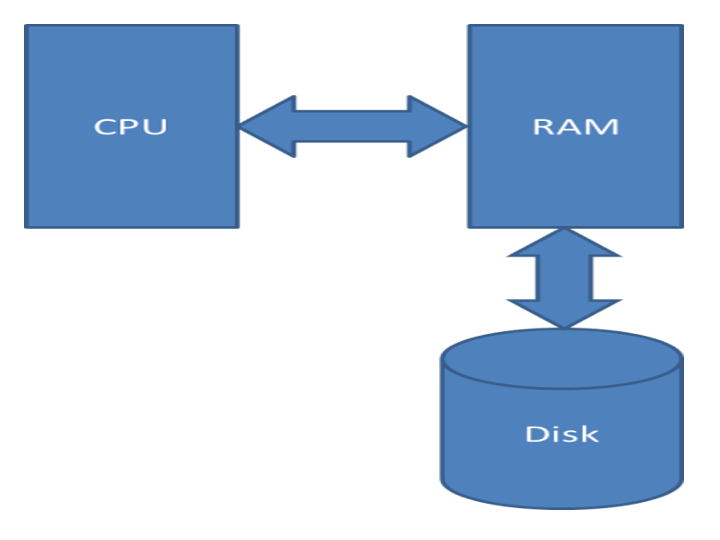
>Programlama dillerinde değişkenler RAM'de tutulur. İşlemler CPU'da yapılır. Örneğin:

```java
a = b + c;
```


>ifadesinde a, b, c RAM'dedir. Fakat toplama ve atama işlemi CPU tarafından yapılır. CPU RAM'e erişir oradan b'yi ve c'yi alır. Bunu elekrik devreleriyle toplar ve sonucu da a'ya atar.
>
>Dosyalar diskte bulunurlar. Bilgisayarı kapattığımızda dosyalar kaybolmazlar. İşletim sistemlerinin dosya işlemleri ile uğraşan bölümüne dosya sistemi denir.
>
>Bellek (RAM) byte'lardan byte'lar da bitlerden oluşur. 1 byte 8 bittir. Bit (binary digit>) 0 ya da 1 değerini tutan bellek hücreleridir:

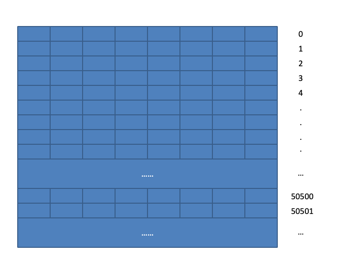
Bellekteki her bir byte'a ilki sıfır olmak üzere artan sırada bir sayı karşılık getirilmiştir. Bu sayılara adres denilmektedir. Değişkenler bellekte olduğuna göre onların da birer adresi vardır. Örneğin:

```java
byte a;
```

>Burada a 1 byte yer kaplayan bir değişkendir. a'nın da bir adresi vardır. Örneğin:

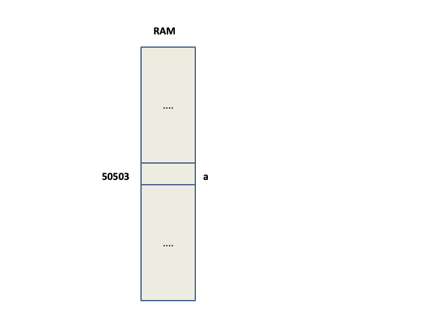
>Burada a'nın adresi 50503'dür. Bir byte'tan daha uzun olan değişkenlerin adresleri onların yalnızca en düşük numaralı adresleriyle ifade edilir. Örneğin:

```java
int a;
```

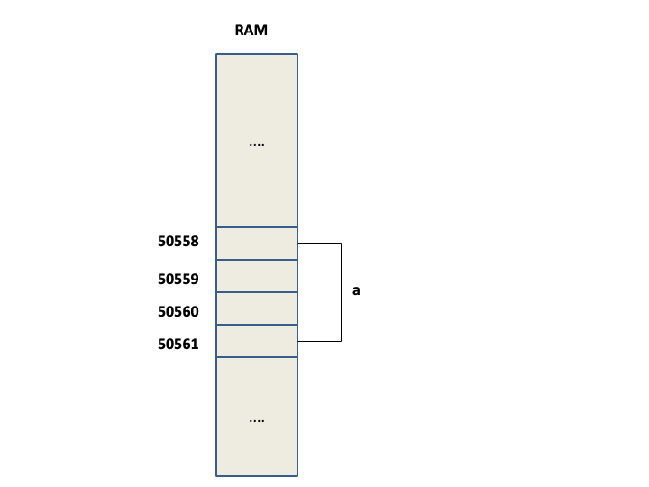
>Burada a 4 byte uzunluğundadır ve a'nın adresi 50558'dir.

#### 6 Haziran 2024

##### Değişkenlerin Ömürleri

>Çalıştırılabilen (executable) bir dosya diskte bulunur. Çalıştırılmak istendiğinde işletim sistemi tarafından diskten alınarak RAM'e yüklenir. Programın çalışması bittiğinde program RAM'den boşaltılır.
>
>Anımsanacağı gibi bir değişkenin (ya da nesnenin) bellekte yaratılmasıyla (yani bellekte yer ayrılması), yok edilmesi (yani bellekten atılması) arasındaki süreye "ömür (storage duration)" denilmektedir. Peki, bir değişken için ayrılan bellek bölgesi neresidir? Bir Java uygulaması çalıştırıldığında, o uygulama için iki tane bellek alanı ayrılır: `stack`, `heap`. Aslında aşağı seviyede başka bellek alanları da ayrılır. Stack ve heap, Java seviyesinde ayrılan alanlar olarak düşünülebilir. Stack ve heap alanları RAM'de organize edilir. Program çalıştırılırken bu alanların uzunlukları belirlenebilir. Herhangi bir belirleme yapılmazsa default uzunluklar alınır. Default uzunluklar sistemden sisteme değişebilmektedir.
	
**Anahtar Notlar:** Yukarıdaki cümlelerde geçen nesne (object) kavramı ileride ele alınacaktır.
	
**Anahtar Notlar:** Veri Yapısı (Data Structure), genel olarak birbiri ile ilişkili olan verilerin bir arada ve belirli bir takım algoritmalara göre tutulmasını sağlayan ve istenildiğinde bu verilere erişilebilen yapılardır. Örneğin dizi, elemanları aynı türden olan ve bellekte peşpeşe olarak yaratılan bir veri yapısıdır. `Stack`, `LIFO` (Last In First Out) kuyruk sistemi biçiminde çalışan bir veri yapısıdır. Tipik olarak editör programlarının "undo-redo" mekanizmaları bu şekilde gerçekleştirilir (implementation). Stack veri yapısına eleman ekleme işlemine "push", eleman silme (bazı yaklaşımlara göre hem silme hem elemanı elde etme) işlemine "pop" denir. Uygulama için ayrılan stack alanında yer ayrılması işlemi stack veri yapısı biçiminde (donanımsal da destek ile) yapıldığından, bu alana "stack alanı" denilmektedir. Stack alanında, yaratma ve yok etme işlemi çok hızlı bir biçimde gerçekleşmektedir.

>`Yerel değişkenler` ve `parametre değişkenleri` `stack` alanında yaratılırlar. Stack alanı doldur boşalt biçiminde çalışan bellek alanıdır. Böylece program çalışma zamanında, toplamda, bu alanın uzunluğundan daha fazla değişken için yer ayrılabilir.
>
>Yerel bir değişken, akış kod bakımından bildirim noktasına geldiğinde yaratılır, bildirildiği blok sonunda yok edilir. Bu durumda bir yerel değişkenin yaratılması `push` komutu ile, yok edilmesi ise `pop` komutu ile yapılır. Peşpeşe bildirilen (yani çalışma zamanında peş peşe yaratılan) yerel değişkenlerin yok edilmesi ters sırada yapılır. Buna göre faaliyet alanı (scope) ve ömür arasında dolaylı bir ilişki söz konusudur. Ancak yine de faaliyet alanı derleme zamanına ilişkin, ömür ise çalışma zamanına ilişkindir. Yerel bir değişkenin bildirildiği blok sonlandığında yok edilmesi dolayısıyla faaliyet alanı da bildirildiği yerden bildirildiği bloğun sonuna kadardır.

```java
package csd;

class App {
	public static void main(String [] args) 
	{	
		int a; //a yaratıldı (push a)
		double b; //b yaratıldı (push b)
		
		{
			int c; //c yaratıldı (push c)
			float d; // d yaratıldı (push d)
			
			//...		} //d yok edildi (pop d) -> c yok edildi (pop c)
		
		int x;
		
	} //b yok edildi (pop b) -> a yok edildi (pop a)
}
```

>Bir parametre değişkeni ait olduğu metot çağrıldığında yaratılır (push), metot çağrısı bittiğinde yok edilir (pop)

```java
package csd;

class App {
	public static void main(String [] args) 
	{	
		Sample.foo(10, 20); //a yaratıldı (push a) -> b yaratıldı (push b)
		//b yok edildi (pop b), a yok edildi (pop a)
		
		//...
		
		Sample.foo(10, 20); //a yaratıldı (push a) -> b yaratıldı (push b)
		//b yok edildi (pop b), a yok edildi (pop a)
		
		//...
	} 
}

class Sample {
	public static void foo(int a, int b)
	{
		//...
	}
}
```

##### Sınıfların Veri Elemanları

>Sınıf içerisinde, tüm metotların dışında bildirilen değişkenlere **sınıf veri elemanı (class data member/member variable)** denir. Sınıf veri elemanları metotlarda olduğu gibi erişim belirleyiciye (public, protected, no-modifier, private) sahip olabilirler. Yine metotlarda olduğu gibi ilgili konuya gelene kadar tüm veri elemanlarımızı public olarak bildireceğiz. Sınıf veri elemanları da metotlarda olduğu gibi static veya non-static olabilirler. static anahtar sözcüğü ile bildirilmemişse non-static olur.
>
>Sınıf içerisindeki bildirimlere sınıfın elemanları **members** denir. Bu, anlamda veri elemanı ve metot sınıfın elemanlarıdır. Sınıfın başka elemanları da vardır. Sınıf veri elemanlarına **data member/member variable/field** denilmektedir. Sınıfın elemanı bir alt program ise metot denir. Sınıfın diğer elemanları konular içerisinde ele alınacaktır.
	
>Bir sınıf veri elemanının faaliyet alanı ve ömrü ileride ele alınacaktır. Sınıf içerisindeki veri elemanları aynı türdense, aynı erişim belirleyiciye sahipse ve static veya non-static olma bakımından aynı ise virgül ile ayrılarak da bildirilebilir.

```java
package csd;

class Sample {
	int a;
	private int x, y;
	private int z;	 
	
	public static void foo()
	{
		//...
	}
	
	protected double b;
	
	public static float c;
}
```

>Java'da sınıf dışında değişken bildirimi geçersizdir ya da başka bir deyişle Java'da bir değişkenin bir sınıf içerisinde bildirilmiş olması (veri elemanı veya parametre değişkeni veya yerel değişken olarak) gerekir


```java
package csd;

int a; //error
```

>Sınıf bildirimi aslında bir tür bildirimidir. Sınıf bildirimi dışında da tür bildirimleri söz konusudur. Bu şekilde yapılan bildirimlere yani programcının bildirdiği türlere **user defined type (UDT)** denilmektedir. Bu durumda sınıf da bir UDT'dir. Sınıf dışındaki UDT'ler konular içerisinde ele alınacaktır

```java
package csd;

class Person {
	//..
}

class Server {
	//...
}

class USBPort {
	//...
}

class TCP {
	//...
}
```

>Madem ki sınıf bildirimi bir tür bildirimidir, bu durumda sınıf türünden değişkenler bildirilebilir

```java
package csd;

class App {
	public static void main(String [] args) 
	{	
		Person p;
		Server s;
		USBPort u;
		TCP t;
		
		
	} 
}

class Person {
	//..
}

class Server {
	//...
}

class USBPort {
	//...
}

class TCP {
	//...
}
```

>Java'da türler kategori olarak iki gruba ayrılır: **değer türleri (value types), referans türleri (reference types)** 
>T bir tür ismi olmak üzere, T türden bir değişken içerisinde bir adres tutuluyorsa T bir referans türüdür, tutulmuyorsa bir değer türüdür. Ya da başka bir deyişle, T türden bir değişkenin içerisindeki değer bir adres ise T referans türü, adres değilse değer türüdür. Java'da temel türler (primitive/built-in/predefined types) değer türleridir. Yani temel bir türden değişken içerisinde adres tutulmaz. Java'da bir sınıf referans türüdür. Öyleyse sınıf türünden bir değişken içerisinde adres tutulur. Aslında genel olarak temel türler dışında kalan türler (yani UDT'ler) referans türleridir
>
>Sınıf türünden değişkenlere referans değişken `reference variable` ya da kısaca referans (reference) denir. Java seviyesinde adres (address) terimi yerine referans (reference) terimi de kullanılmaktadır. Referans dendiğinde ya bir adres ya da bir referans değişken kastedilmiş olur. Buna göre örneğin bir cümlede **"reference of an object"** gibi bir içerik söz konusuysa, buradaki referans adres anlamındadır. Ya da örneğin bir cümlede **"address of an object is assigned to a reference"** gibi bir içerik söz konusuysa, buradaki referans, değişken anlamındadır.
>
>Peki bir referansa atanacak adres nasıl elde edilecektir?

```java
package csd;

class App {
	public static void main(String [] args) 
	{	
		Person p; //p referans (değişken)
		Server s; //s referans (değişken)
		USBPort u; //u referans (değişken)
		TCP t; //t referans (değişken)
		
		
	} 
}

class Person {
	//..
}

class Server {
	//...
}

class USBPort {
	//...
}

class TCP {
	//...
}
```

#### 11 Haziran 2024

>- Sınıf türünden bellekte ayrılan bir alana nesne `object` denir.
>- Nesneler `heap` alanında yaratılırlar. Java'da stack'de nesne **yaratılamaz**.
>- Java'da bir nesnenin kendisi tutulamaz, adresi tutulabilir. Bu adres de aynı türden bir referans (değişken) içerisinde tutulabilir.
>- Java'da nesne yaratılması `new` operatörü ile yapılır. `new` operatörünün kullanımına ilişkin genel biçimi şu şekildedir:

		new <sınıf ismi>([argümanlar]);
>Bu operatör özel amaçlı tek operandlı ve önek durumundadır. Operatör, yaratılmış olan nesnenin adresini üretir. Bir nesne ile referans için hangi uzunlukta yer ayrılacağı ileride ele alınacaktır. Bu operatörün yan etkisi yoktur. 
>
>Aşağıdaki örnekte `p`, `s`, `u` ve `t` birer nesne **DEĞİLDİR**, ilgili türden nesnelerin adreslerini tutan `referans` değişkenlerdir.
>
>Örnekte `*, **, *** ve ****` ile belirtilen deyimlerde ilgili türden nesneler yaratılmış ve ilgili türden referans değişkenlere adresleri atanmıştır. Bu durumda bir referans değişkene bir adres atandığında o referans o nesneyi gösteriyor (reference to) duruma gelmiş olur. 
>- Bir nesne ilgili sınıf türünden bir örnektir. Buna İngilizce olarak **instance** terimi de kullanılır. Bu anlamda nesne yaratma işlemi için de **create** fiili ile birlikte **instantiate** fiili de kullanılır.
>- Referans ve nesne kavramları birbirinden farklıdır. 
>- Her `new` işlemi yeni bir nesne yaratmak demektir.

```java
package csd;

class App {
	public static void main(String [] args) 
	{	
		Person p; //p referans (değişken)
		Server s; //s referans (değişken)
		USBPort u; //u referans (değişken)
		TCP t; //t referans (değişken)
		
		p = new Person(); //*
		s = new Server(); //**
		u = new USBPort(); //***
		t = new TCP(); //****
	} 
}

class Person {
	//...
}

class Server {
	//...
}

class USBPort {
	//...
}

class TCP {
	//...
}
```
>Sınıfın `non-static` bir veri elemanına sınıf dışından referans ve nokta operatörü ile erişilir. Nokta operatörü iki operandlı ve araek durumundadır. Bu operatörün birinci operandı bir `referans`, ikinci operandı `non-static` bir veri elemanı ise bu durumda o veri elemanına ilişkin değişkeni üretir.

>Sınıfın `non-static` veri elemanları her nesne yaratıldığında nesnenin içerisinde yaratılırlar. Yani sınıfın `non-static` veri elemanları nesneye özgüdür ya da başka bir deyişle her nesne için ayrıdır. Bu durumda referans ile non-static bir veri elemanına erişmek aslında referansın gösterdiği nesnenin içerisinde elemana erişmek anlamına gelir

```java
package csd;

class App {
	public static void main(String [] args) 
	{	
		Sample s1, s2;
		
		s1 = new Sample();
		s2 = new Sample();		
		
		s1.x = 10;
		s1.y = true;
		
		s2.x = 20;
		s2.y = false;
		
		System.out.printf("s1.x = %d, s1.y = %b%n", s1.x, s1.y);
		System.out.printf("s2.x = %d, s2.y = %b%n", s2.x, s2.y);
	} 
}

class Sample {
	public int x;
	public boolean y;
	
	//...
}
```

>Bir nesne yaratıldığında nesneye ait `non-static` veri elemanlarına **default** değerler (default/zero value) atanır. Default değer mantıksal sıfır (türe özgü sıfır) değeridir. Örneğin int türü için default değer sıfırdır, double türü için default değer yine sıfırdır, boolean türü için ise false değeridir

```java
package csd;

class App {
	public static void main(String [] args) 
	{	
		Sample s;
		
		s = new Sample();		
	
		System.out.printf("s.x = %d, s.y = %b%n", s.x, s.y);		
	} 
}

class Sample {
	public int x;
	public boolean y;
	
	//...
}
```

>Aşağıdaki örnekte **değer verilmemiş** bir yerel değişkenin kullanılmasından dolayı **error** oluşur

```java
package csd;

class App {
	public static void main(String [] args) 
	{	
		Sample s;			
		
		System.out.printf("s.x = %d, s.y = %b%n", s.x, s.y); //error
	} 
}

class Sample {
	public int x;
	public boolean y;
	
	//...
}
```

#### 13 Haziran 2024
 
>Sınıfın `non-static` veri elemanı nesneye özel olduğundan sınıf ile temsil edilen kavrama ilişkin bir karakteristiği (characteristics) ya da başka bir deyişle bir öz niteliği (attribute) belirtir. Bu durumda bir sınıf `non-static` veri elemanları ile bir **bileşik türdür (compound type)**. Örneğin, analitik düzlemde bir noktanın iki tane bileşeni vardır: axis, ordinate. Bu durumda analitik düzlemde bir "nokta" kavramı ne tek başına axis ne de tek başına ordinate'dir. İkisi birlikte bir noktadır. Bu durumda programcı bu noktayı temsil eden bir sınıf bildiriminde `non-static` veri elemanı olarak (en azından) axis ve ordinate bilgilerini tutar. Dikkat edilirse sınıfın isminin belirlenmesinden, içerisindeki elemanların belirlenmesine kadarki kısım sınıfın ait olduğu `domain`'e göre ele alınır.
>
>Peki bir **referansın** uzunluğu ne kadardır?
>
>Bir referansın uzunluğu sistemin adresleyebileceği kadardır. Yani örneğin `32 bit` bir sistemde `4 byte`, `64 bit` bir sistemde `8 byte`'dır. Bu anlamda adresler tamsayı formatında olduğundan tutuluş biçimleri yine işaretsiz ikiye tümleme formatıdır. **Referansların** uzunluğu türe göre **değişmez**. Bu anlamda bir uygulama için ilgili sistemde tüm referansların uzunluğu **aynıdır.**
>
>Peki bir **nesnenin** uzunluğu ne kadardır?
>
>Bir nesnenin uzunluğu **en az, ilişkin olduğu sınıfın non-static veri elemanlarının toplam uzunluğu kadardır**. Burada en az kavramıyla sisteme ilişkin başka bilgilerin de eklenebileceği anlatılmaktadır. Detaylar önemsizdir. Java programcısı açısından **uzunluk non-static veri elemanları ile belirlenir** olarak algılanmalıdır.
>
>Peki `non-static` bir veri elemanının `ömrü` (storage duration) ne kadardır?
> 
>`Non-static` bir veri elemanı nesne yaratıldığında yaratılır. Nesne yok edildiğinde yok edilir. Java'da nesne **garbage collector** tarafından yok edilir. Bir nesnenin yok edilmesine ilişkin detaylar ileride ele alınacaktır.
>
>Peki `non-static` bir veri elemanının faaliyet alanı nedir?
>
>Bu konu ileride ele alınacaktır.

>Sınıfın `static` bir veri elemanı nesne içerisinde yaratılmaz. Sınıfın `static` bir veri elemanına sınıf dışından sınıf ismi ve nokta operatörü ile erişilir. Nokta operatörü sınıf ismi ve static veri elemanı ile kullanıldığında veri elemanına ilişkin değişkeni üretir. Sınıfın static veri elemanları sınıfın bir elemanı (member) ilk kez kullanıldığında yaratılır ve program sonuna kadar yaşarlar. Bu durumda sınıfın `static` bir veri elemanı stack'de **yaratılamaz**. Static veri elemanlarının yaratıldığı alana ilişkin detaylar söz konusu olsa da dolaylı olarak `heap`'de olduğu söylenebilir.
>
>Bu durumda static bir veri elemanına erişmek için bir nesne yaratılması gerekmez. Static veri elemanlarına da yaratıldıklarında default değerler atanır

```java
package csd;

class App {
	public static void main(String [] args) 
	{	
		System.out.printf("Sample.x = %d, Sample.y = %b%n", Sample.x, Sample.y);
		
		Sample.x = 10;
		Sample.y = true;
		
		System.out.printf("Sample.x = %d, Sample.y = %b%n", Sample.x, Sample.y);
		
		++Sample.x;
		
		System.out.printf("Sample.x = %d, Sample.y = %b%n", Sample.x, Sample.y);
	} 
}

class Sample {	
	public static boolean y;
	public static int x;	
	
	//...
}
```

>Aşağıdaki demo örnekte sayaçlar, sınıfları kullanan programcı tarafından tutulmuş ve gerektiğinde artırılmıştır. Bu durumda programcı artırma işlemini unutabilir. Ayrıca başka türler için de sayaçlar tutulması gerektiğinde sayaç için değişken bildirimi hem isim açısından hem de kod yükü açısından bir maliyet getirecektir. Buradaki maliyet geliştirme zamanı maaliyetidir. Üstelik örnek bir demodur ve algoritmik bakımdan pek çok detaylı durum söz konusudur.

```java
package csd;

class App {
	public static void main(String [] args) 
	{	
		DemoGameApp.run();
	}
}

class DemoGameApp {
	public static void run()
	{		
		int alienCount = 0;
		int soldierCount = 0;
		//...
		
		for (int i = 0; i < 10; ++i) {
			Alien a = new Alien();
			
			++alienCount;			
			//...
		}
		
		for (int i = 0; i < 20; ++i) {
			Soldier soldier = new Soldier();
			
			++soldierCount;
			
			//...
		}
		
		//...
		
		System.out.printf("Number of aliens:%d%n", alienCount);
		System.out.printf("Number of soldiers:%d%n", soldierCount);			
	}
}

class Alien {
	public int color;
	public int armCount;
	//...
}

class Soldier {
	 public int title;
	 public int gunCount;
	 //...
}

class Civilian {
	//...
}

class Building {
	//...
}

class Animal {
	//...
}

//...
```

>Yukarıdaki demo örnekte sınıflara "count static veri elemanı eklenerek" anlatılan problemler çözülebilir.
	
**Anahtar Notlar:** `**` ve `***` ile belirtilen kodların detayları şu an önemsizdir. Burada sayacın nesne yaratıldıkça artırıldığına odaklanınız. Buradaki detaylar ileride ele alınacaktır

```java
package csd;

class App {
	public static void main(String [] args) 
	{	
		DemoGameApp.run();
	}
}

class DemoGameApp {
	public static void run()
	{		
		//...
		
		for (int i = 0; i < 10; ++i) {
			Alien a = new Alien();		
				
			//...
		}
		
		for (int i = 0; i < 20; ++i) {
			Soldier soldier = new Soldier();		
			
			//...
		}
		
		//...
		
		System.out.printf("Number of aliens:%d%n", Alien.count);
		System.out.printf("Number of soldiers:%d%n", Soldier.count);			
	}
}

class Alien {
	public static int count;
	public int color;
	public int armCount;
	
	// ...
	public Alien() //**
	{
		//...
		++count;		
	}
	//...
}

class Soldier {
	
	public static int count;
	public int title;
	public int gunCount; 
	 
	//...

	
	public Soldier() //***
	{
		++count;
		//...
	}
	 
	 //...
}

class Civilian {
	public static int count;
	//...
}

class Building {
	public static int count;
	//...
}

class Animal {
	public static int count;
	//...
}

//...
```

#### 20 Haziran 2024

>Sınıfın `non-static` bir veri elemanına sınıf dışından sınıf ismi ile erişilemez. Erişilebilseydi sınıfın ilgili elemanı hangi nesneye ait olurdu? Bu sebeple erişilemez.

```java
package csd;

class App {
	public static void main(String [] args) 
	{			
		Sample.x = 10; /error
	}
}

class Sample {
	public int x;
	public boolean y;
	
	//...
}
```

>Aslında sınıfın `static` bir veri elemanına sınıf dışından referans ile de erişilebilir. Aslında bu erişimin sınıf ismi ile erişmekten farkı yoktur. Dilin Matematiksel anlatımı gereği bu sentaks geçerlidir. Ancak Java programcısının bu şekilde erişmesi kesinlikle **tavsiye edilmez**. Bu durum Java programcısı açısından adeta bir `error` gibi değerlendirilmeli dolayısıyla kullanılmamalıdır. Kullanımı durumundan kodun okunabilirliğini/algılanabilirliğini olumsuz etkilediğine dikkat ediniz

```java
package csd;

class App {
	public static void main(String [] args) 
	{			
		Sample s = new Sample();
		
		s.x = 10; //Gönlümüzün error'u
		s.y = true; //Gönlümüzün error'u
		
		System.out.printf("Sample.x = %d, Sample.y = %b%n", Sample.x, Sample.y);
	}
}

class Sample {
	public static int x;
	public static boolean y;
	
	//...
}
```

>Sınıfnın `non-static` bir metoduna sınıf dışından referans ve nokta operatörü ile erişelebilir. Sınıf ismi ile **erişilemez**. Sınıfın `non-static` metotlarının nesne ile ilişkisi ileride ele alınacaktır

```java
package csd;

class App {
	public static void main(String [] args) 
	{			
		Sample s = new Sample();
		
		s.foo();
		
		Sample.foo(); //error
	}
}

class Sample {
	//...
	
	public void foo()
	{
		//...
	}
	//...
}
```

**Anahtar Notlar:** `non-static metotlar` nesne içerisinde tutulmaz. Aslında metotlar aşağı seviyede genel olarak ismine "code section" denilen bir bölümde tutulurlar. Bu bölümün detayları ve Java düzeyindeki karşılığı burada ele alınamayacaktır. Bu durumda metotlar stack veya heap alanında tutulmazlar değil mi?

>Sınıfın `static` bir metoduna sınıf dışından sınıf ismi ve nokta operatörü ile erişilebilir. static veri elemanlarında olduğu gibi referans ve nokta operatörü ile de erişlebilir. Yine Java programcısı olarak static metotlara da referans ile erişmeyeceğiz. Sınıfın static metotlarının tür ile ilişkisi ileride ele alınacaktır

```java
package csd;

class App {
	public static void main(String [] args) 
	{	
		Sample.foo();
		
		Sample s = new Sample();
		
		s.foo(); //gönlümüzün error'u		
	}
}

class Sample {
	//...
	public static void foo()
	{
		//...
	}
	//...
}
```

**Anahtar Notlar:** Dikkat edilirse yukarıdaki anlatılanlar, sınıf dışından yani başka bir sınıfın içinden olan erişimler içindir.

>Sınıfın `non-static` bir veri elemanına ait olduğu sınıfın `non-static` bir `metodu` içerisinde doğrudan yani nokta operatörü kullanmadan **erişilebilir**.
>
>Doğrudan erişilen non-static veri elemanı, non-static metodun çağrılmasında kullanılan referansın gösterdiği nesnenin veri elemanıdır

```java
package csd;

class App {
	public static void main(String [] args) 
	{	
		Sample s1 = new Sample();
		Sample s2 = new Sample();
		
		s1.foo(10);
		s2.foo(20);
		
		System.out.printf("s1.x = %d%n", s1.x);
		System.out.printf("s2.x = %d%n", s2.x);
		s1.bar();
		s2.bar();
	}
}

class Sample {
	public int x;
	//...
	public void foo(int a)
	{
		x = a;
	}
	
	public void bar()
	{
		System.out.printf("x = %d%n", x);
	}
	//...
}
```

>Sınıfın `non-static` bir metodu ait olduğu sınıfın `non-static` bir metodu içerisinde doğrudan çağrılabilir.
>
>Doğrudan çağrılan `non-static metot`, çağıran `non-static metodun` çağrılmasında kullanılan referans ile çağrılmış olur

```java
package csd;

class App {
	public static void main(String [] args) 
	{	
		Sample s1 = new Sample();
		Sample s2 = new Sample();
		
		s1.foo(10);
		s2.foo(20);
	}
}

class Sample {
	public int x;
	//...
	public void foo(int a)
	{
		x = a;
		bar();
	}
	
	public void bar()
	{
		System.out.printf("x = %d%n", x);
	}
	//...
}
```

>Yukarıdaki iki maddenin özeti olarak şu söylenebilir:
>- Sınıfın `non-static` bir metodu içerisinde, **tüm** `non-static` elemanlarına (member) doğrudan **erişilebilir**

>Sınıfın `non-static` bir metodu içerisinde, aynı sınıfın `static` veri elemanlarına doğrudan **erişilebilir**

```java
package csd;

class App {
	public static void main(String [] args) 
	{	
		Sample s1 = new Sample();
		Sample s2 = new Sample();
		
		s1.foo(10);
		
		s1.bar();
		s2.bar();
		System.out.println("----------------------");
		
		s2.foo(20);
		
		s1.bar();
		s2.bar();
		System.out.println("----------------------");
	}
}

class Sample {
	public static int x;
	//...
	public void foo(int a)
	{
		x = a;
		bar();
	}
	
	public void bar()
	{
		System.out.printf("x = %d%n", x);
	}
	//...
}
```

>Sınıfın `non-static` bir metodu içerisinde, aynı sınıfın `static` metotları **doğrudan çağrılabilir**

```java
package csd;

class App {
	public static void main(String [] args) 
	{	
		Sample s1 = new Sample();
		Sample s2 = new Sample();
		
		s1.foo(10);
		s2.foo(20);
	}
}

class Sample {
	public static int x;
	//...
	public void foo(int a)
	{
		x = a;
		bar();
	}
	
	public static void bar()
	{
		System.out.printf("x = %d%n", x);
	}
	//...
}
```

>Yukarıdaki **iki** maddenin özeti olarak şu söylenebilir:
>- Sınıfın `non-static` bir metodu içerisinde, tüm `static` elemanlarına **doğrudan erişilebilir**
>
>Yukarıdaki **dört** maddenin özeti olarak şu söylenebilir:
>- Sınıfın `non-static` bir metodu içerisinde, sınfın **tüm** elemanlarına **doğrudan erişilebilir**

>Sınıfın `static` bir metodu içerisinde, aynı sınıfın `non-static` bir veri elemanına **doğrudan erişilemez**

```java
package csd;

class Sample {
	public int x;
	//...
	public static void foo(int a)
	{
		x = a; //error
	}

	//...
}
```

>Sınıfın `static` bir metodu içerisinde, aynı sınıfın `non-static` bir metodu **doğrudan çağrılamaz**

```java
package csd;

class Sample {
	public int x;
	//...
	public static void foo(int a)
	{
		bar(a); //error
	}
	
	public void bar(int a)
	{
		x = a;
	}

	//...
}
```

>Yukarıdaki iki maddenin özeti olarak şu söylenebilir:
>- Sınıfın `static` bir metodu içerisinde, aynı sınıfın `non-static` elemanlarına doğrudan **erişilemez**

>Sınıfın `static` bir metodu içerisinde, aynı sınıfın `static` bir veri elemanına doğrudan **erişilebilir**

```java
package csd;

class App {
	public static void main(String [] args) 
	{	
		Sample.foo(10);
		System.out.printf("Sample.x = %d%n", Sample.x);
	}
}

class Sample {
	public static int x;
	//...
	public static void foo(int a)
	{
		x = a;
	}
	
	//...
}
```

>Sınıfın `static` bir metodu içerisinde, aynı sınıfın `static` bir metodu doğrudan **çağrılabilir**

```java
package csd;

class App {
	public static void main(String [] args) 
	{	
		Sample.foo(10);
		System.out.printf("Sample.x = %d%n", Sample.x);
	}
}

class Sample {
	public static int x;
	//...
	public static void foo(int a)
	{
		bar(a);
	}
	
	public static void bar(int a)
	{
		x = a;
	}
	
	//...
}
```

>Yukarıdaki **iki** maddenin özeti olarak şu söylenebilir: 
>- Sınıfın `static` bir metodu içerisinde aynı sınıfın `static` elemanlarına **doğrudan erişilebilir**
> 
>Yukarıdaki **dört** maddenin özeti olarak şu söylenebilir: 
>- Sınıfın `static` bir metodu içerisinde **aynı** sınıfın 
>	- `static` elemanlarına doğrudan **erişilebilirken**
>	- `non-static` elemanlarına doğrudan **erişilemez**
>
>Yukarıdaki **sekiz** maddenin özeti olarak şu söylenebilir: 
>- Sınıfın `non-static` bir metodu içerisinde aynı sınıfın **tüm** elemanlarına doğrudan **erişilebilir** 
>- `static` bir metodu içerisinde **yalnızca** `static` elemanlarına doğrudan **erişilebilir**

>Aşağıdaki demo örnekte foo metodu içerisinde bar metoduna doğrudan erişilmediğine dikkat ediniz

```java
package csd;

class App {
	public static void main(String [] args) 
	{	
		Sample.foo(10);
	}
}

class Sample {
	public int x;
	//...
	public static void foo(int a)
	{
		Sample s = new Sample();
		
		s.bar(a);
	}
	
	public void bar(int a)
	{
		x = a;
	}
	
	//...
}
```
 
>Peki tüm bu anlatılanlara göre sınıfı yazan programcı bir metodu `static` veya` non-static` yapacağına nasıl karar verecektir?
>
>Bir metot `non-static` bir elemana erişmeyecekse `static` yapılmalıdır. Bu durumda yani `non-static` bir elemana erişmeyen bir metodun `static` yapılması durumu, `non-static` metotların okunabilirliğini/algılanabilirliğini artırır.
>
>Yani bir sinıfı kullanan programcı `non-static` bir metot gördüğünde o metodun `non-static` bir veri elemanına eriştiğini bilir. Çünkü erişmeseydi programcı bu metodu `static` yapardı olarak algılar

>Aşağıdaki örnekte `s1` referansının gösterdiği nesne ile `s2` referansının gösterdiği nesne farklıdır

```java
package csd;

class App {
	public static void main(String [] args) 
	{	
		Sample s1 = new Sample();
		Sample s2 = new Sample();
		
		s1.x = 10;
		s1.y = true;
		s2.x = 30;
		
		System.out.printf("s1.x = %d, s1.y = %b%n", s1.x, s1.y);
		System.out.printf("s2.x = %d, s2.y = %b%n", s2.x, s2.y);
	}
}

class Sample {
	public int x;
	public boolean y;
	
	//...
}
```

>Aynı türden referansların birbirine atanması durumunda artık referanslar aynı nesneyi gösteriyor duruma gelmiş olurlar. Bu durumda hangi referans ile nesneye erişildiğinin bir önemi yoktur

```java
package csd;

class App {
	public static void main(String [] args) 
	{	
		Sample s1 = new Sample();
		Sample s2 = new Sample();
		
		s1.x = 10;
		s1.y = true;
		s2.x = 30;
		
		System.out.printf("s1.x = %d, s1.y = %b%n", s1.x, s1.y);
		System.out.printf("s2.x = %d, s2.y = %b%n", s2.x, s2.y);
		
		s2 = s1;
		
		System.out.printf("s1.x = %d, s1.y = %b%n", s1.x, s1.y);
		System.out.printf("s2.x = %d, s2.y = %b%n", s2.x, s2.y);
		
		++s2.x;
		System.out.printf("s1.x = %d, s1.y = %b%n", s1.x, s1.y);
		System.out.printf("s2.x = %d, s2.y = %b%n", s2.x, s2.y);
	}
}

class Sample {
	public int x;
	public boolean y;
	
	//...
}
```

#### 25 Haziran 2024

>Aşağıdaki örnekte argüman olarak geçilen `x` yerel değişkeninin değeri metot içerisinde değiştirilemez değil mi?

```java
package csd;

class App {
	public static void main(String [] args) 
	{	
		int x = 10;
		
		Sample.foo(x);
		
		System.out.printf("x = %d%n", x);
	}
}

class Sample {
	public static void foo(int x)
	{
		++x;
		
		System.out.printf("foo:x = %d%n", x);
	}
}
```

>Bir metodun parametre değişkeni bir referans olabilir. Bu durumda metodun çağrılabilmesi için metoda aynı türden bir referansın argüman olarak geçilmesi gerekir. Bu durumda metodun perametresi olan referans ile argüman olarak geçilen referans aynı nesneyi gösterir duruma gelir. Anımsanacağı gibi argümanlardan parametre değişkenlerine aktarım da bir atama işlemidir. Bu durumda metot çağrısı boyunca ilgili nesneye erişilebilir. Hatta metot nesnenin içeriğini de değiştirebilir. Örnekte `DateUtil` sınıfının `change` metodunun nesnenin içeriğini değiştirdiğine dikkat ediniz.

>Bir metodun geri dönüş değeri bir sınıf türünden olabilir. Bu durumda bir metot `referansa` (adrese) geri dönmüş olur. Böyle bir metodun `return` deyimine ilişkin ifadesi de aynı türden bir referans olmalıdır. Örnekteki `create` metodunun bir nesne yaratıp o nesnenin adresine geri döndüğüne dikkat ediniz

```java
package csd;

class App {
	public static void main(String [] args) 
	{	
		Date d = DateUtil.create(11, 7, 1983);
		
		DateUtil.display(d);
		DateUtil.change(d, 6, 9, 2021);
		DateUtil.display(d);
	}
}

class DateUtil {
	public static void change(Date date, int day, int month, int year)
	{
		//...
		date.day = day;
		date.month = month;
		date.year = year;
	}
	
	public static Date create(int day, int month, int year)
	{
		//...
		Date date = new Date();
		
		date.day = day;
		date.month = month;
		date.year = year;
		
		return date;
	}
	
	public static void display(Date date)
	{
		System.out.printf("%02d/%02d/%04d%n", date.day, date.month, date.year);
	}
}

class Date {
	public int day;
	public int month;
	public int year;
	
	//...
}
```

#### 27 Haziran 2024

>Aşağıdaki, kartezyen düzlemde bir noktayı temsil eden `Point`sınıfını ve test kodlarını inceleyiniz.

```java
package csd;

class App {
	public static void main(String [] args) 
	{	
		Point p1 = new Point();
		Point p2 = new Point();
		
		p1.x = 23.4;
		p1.y = 56.7;
		p2.x = 90;
		
		p1.display();
		p2.display();
	}
}
```

```java
package csd;

class App {
	public static void main(String [] args) 
	{	
		Point p1 = new Point();
		Point p2 = new Point();
		
		p1.x = 23.4;
		p1.y = 56.7;
		p2.x = 90;
		
		p1.display();
		p2.display();		
		p1.offset(3.4, -6.7);
		p2.offset(-45, 9.78);
		p1.display();
		p2.display();	
	}
}
```

```java
package csd;

class App {
	public static void main(String [] args) 
	{	
		Point p1 = new Point();
		Point p2 = new Point();
		
		p1.x = 23.4;
		p1.y = 56.7;
		p2.x = 90;
		
		p1.display();
		p2.display();		
		p1.offset(3.4);
		p2.offset(-45, 9.78);
		p1.display();
		p2.display();	
	}
}
```

```java
package csd;

class App {
	public static void main(String [] args) 
	{	
		Point p1 = new Point();
		Point p2 = new Point();
		
		p1.x = 23;
		p1.y = 56;
		p2.x = 26;
		p2.y = 52;
		
		double x = 26, y = 52;
		
		p1.display();
		p2.display();		
		
		double d = p1.distance(p2);

		System.out.printf("Distance:%f%n", d);
		
		d = p1.distance(x, y);
		
		System.out.printf("Distance:%f%n", d);
		
		d = p1.distance();
		
		System.out.printf("Distance:%f%n", d);
	}
}

class Point {
	public double x;
	public double y;
	
	public double distance()
	{
		return distance(0, 0);
	}
	
	public double distance(Point other)
	{
		return distance(other.x, other.y);
	}
	
	public double distance(double a, double b)
	{
		return Math.sqrt(Math.pow(x - a, 2) + Math.pow(y - b, 2));
	}	
	
	public void offset(double dxy)
	{
		offset(dxy, dxy);
	}
	
	public void offset(double dx, double dy)
	{
		x += dx;
		y += dy;
	}
	
	public void display()
	{
		System.out.printf("(%f, %f)%n", x, y);
	}
}
```

>Aşağıdaki, bir karmaşık sayıyı (complex number) temsil eden `Complex` sınıfın ve test kodlarını inceleyiniz.
>**Açıklamalar:** $z = a + i * b$, $z_1 = a_1 + i * b_1$, $z_2 = a_2 + i * b_2$ karmaşık sayıları için
>- $\bar{z} = a - i * b$
>- $|z| = \sqrt{a^2 + b^2}$
>- $z_1 \pm z_2 = (a_1 \pm a_2) + i * (b_1 \pm b2)$
>- $z_1z_2 = (a_1 * a_2 - b_1 * b_2) + i * (a_1 * b_2 + a_2 * b_1)$
>- $z_1 / z_2 =  (1 / |\bar{z_2}|) * (z_1 * \bar{z_2})$

```java
package csd;

class App {
	public static void main(String [] args) 
	{	
		java.util.Scanner kb = new java.util.Scanner(System.in);
				
		Complex z1 = new Complex();
		Complex z2 = new Complex();
		Complex z;
		
		System.out.print("Input two complex numbers:");
		z1.real = kb.nextDouble();
		z1.imag = kb.nextDouble();
		z2.real = kb.nextDouble();
		z2.imag = kb.nextDouble();		
		
		z1.display();
		z2.display();
		
		z = z1.add(z2);	//Mantıksal z1 + z2 işlemi
		z.display();		
		z = z1.add(3.6); //Mantıksal z1 + 3.6 işlemi
		z.display();
		z = Complex.add(3.6, z1); //Mantıksal 3.6 + z1 işlemi
		z.display();		
	}
}
```

```java
package csd;

class App {
	public static void main(String [] args) 
	{	
		java.util.Scanner kb = new java.util.Scanner(System.in);
				
		Complex z1 = new Complex();
		Complex z2 = new Complex();
		Complex z;
		
		System.out.print("Input two complex numbers:");
		z1.real = kb.nextDouble();
		z1.imag = kb.nextDouble();
		z2.real = kb.nextDouble();
		z2.imag = kb.nextDouble();		
		
		z1.display();
		z2.display();
		
		z = z1.subtract(z2); //Mantıksal z1 - z2 işlemi
		z.display();		
		z = z1.subtract(3.6); //Mantıksal z1 - 3.6 işlemi
		z.display();
		z = Complex.subtract(3.6, z1); //Mantıksal 3.6 - z1 işlemi
		z.display();		
	}
}
```

```java
package csd;

class App {
	public static void main(String [] args) 
	{	
		java.util.Scanner kb = new java.util.Scanner(System.in);
				
		Complex z = new Complex();	
		
		System.out.print("Input a complex number:");
		z.real = kb.nextDouble();				
		z.imag= kb.nextDouble();		
		z.display();		
		z.inc(); //Mantıksal ++z işlemi
		z.display();
		z.dec(); //Mantıksal --z
		z.display();
	}
}
```

```java
package csd;

class App {
	public static void main(String [] args) 
	{	
		java.util.Scanner kb = new java.util.Scanner(System.in);
				
		Complex z = new Complex();	
		
		System.out.print("Input a complex number:");
		z.real = kb.nextDouble();				
		z.imag= kb.nextDouble();		
		z.display();		
		z.inc(2); //Mantıksal ++z işlemi
		z.display();
		z.dec(2); //Mantıksal --z
		z.display();
	}
}

class Complex {
	public double real;
	public double imag;
	
	public static Complex add(double re1, double im1, double re2, double im2) //İleride sınıfı kullanan kodlardan gizleyeceğiz
	{
		Complex result = new Complex();
		
		result.real = re1 + re2;
		result.imag = im1 + im2;
		
		return result;
	}
	
	public static Complex subtract(double re1, double im1, double re2, double im2) //İleride sınıfı kullanan kodlardan gizleyeceğiz
	{
		return add(re1, im1, -re2, -im2);		
	}
	
	public static Complex add(double val, Complex z)
	{
		return add(val, 0, z.real, z.imag);
	}
	
	public Complex add(Complex other)
	{
		return add(real, imag, other.real, other.imag);
	}
	
	public Complex add(double val)
	{
		return add(real, imag, val, 0);
	}	
	
	public static Complex subtract(double val, Complex z)
	{
		return subtract(val, 0, z.real, z.imag);
	}
	
	public Complex subtract(Complex other)
	{
		return subtract(real, imag, other.real, other.imag);
	}
	
	public Complex subtract(double val)
	{
		return subtract(real, imag, val, 0);
	}
	
	public void inc(double val)
	{
		real += val;
	}
	
	public void inc()
	{
		inc(1);
	}
	
	public void dec(double val)
	{
		inc(-val);
	}
	
	public void dec()
	{
		dec(1);
	}
	
	public Complex getConjugate()
	{
		Complex result = new Complex();
		
		result.real = real;
		result.imag = -imag;
		
		return result;
	}
	
	public double getNorm()
	{
		return Math.sqrt(real * real + imag * imag);
	}
	
	public double getLength()
	{
		return getNorm();
	}	
	
	public void display()
	{
		System.out.printf("(%.2f, %.2f)%n", real, imag);
	}
}
```

#### 2 Temmuz 2024

##### Nesnenin Yaratılması Aşamaları:
>Çalışma zamanında bir nesne şu adımlardan geçilerek yaratılır:
>
>1. Bellekte yer ayrılır.
>2. `Non-static` olan (ancak `final olmayan`) veri elemanlarına `default` değerler verilir. 
>3. Constructor (`ctor`) çağrılır.
>
>**Bu üç adım tamamlandığında nesne yaratılmış olur. Herhangi bir adımda bir problem oluştuğunda nesnenin yaratılması tamamlanmamış olur.**
	
**Anahtar Notlar:** final veri elemanları ileride ele alınacaktır.

>`ctor` aşağıdaki özelliklere sahip bir `metottur`
>- ctor nesne yaratılması aşamasında **çağrılır**.
>- ctor overload edilebilir `constructor overloading`.
>- Sınıf içerisinde programcı tarafından hiç bir ctor bildirilmemişse parametresiz ctor `default ctor` derleyici tarafından public ve içi boş olarak yazılır. Programcı en az bir tane ctor bildirirse artık derleyici default ctor'u **yazmaz**.
>- ctor ismi, sınıf ismi ile **aynı** olan ve **geri dönüş değeri kavramı olmayan** metottur. Burada geri dönüş değeri kavramı olmaması void bir metot olması anlamına **GELMEZ**. Ctor için geri dönüş değeri bilgisi yerine herhangi bir şey yazılmaz. Hatta sınıf ismi ile aynı isimde olan ve geri dönüş değeri bilgisi yazılmış olan bir metot bildirimi geçerlidir. Ancak hiç bir programcı böylesi bir metot yazmaz. Çünkü sınıf ismi ile aynı olan bir metodun geri dönüş değeri bilgisi yazılırsa bu metot artık ctor anlamına gelmez.
>- ctor `non-static` bir metottur.
>- Hangi ctor'un çağrılacağı `new` operatöründe geçilen argümanlara göre klasik **"method overload resolution"** kuralları ile belirlenir.
>- ctor programcı tarafından **çağrılamaz**. Programcı, nesne yaratılması sırasında hangi ctor'un çağrılacağının belirlendiği kodu yazar.
>- Nesne yaratılması adımları gereği ctor'dan önce `non-static` veri elemanlarına `default` değerleri verilmiş olur.
>- ctor geri dönüş değeri kavramı olmayan bir metot olsa da void bir metot gibi istenirse return deyimi sonlandırmak için kullanılabilir. Buradaki sonlandırma normal bir sonlandırmadır yani nesne yaratılmış olur.

>Aşağıdaki demo örneği inceleyiniz

```java
package csd;

class App {
	public static void main(String [] args) 
	{	
		Sample s;
		Mample m;
		
		s = new Sample();
		s = new Sample(10, true);
		s = new Sample(20);
		m = new Mample(); 
		//...		
	}
}

class Mample {
	//...
}

class Sample {
	//...
	
	public Sample()
	{
		System.out.println("I am a default ctor");
	}
	
	public Sample(int a, boolean b)
	{
		System.out.println("I am a ctor with parameter types int and boolean");
	}
	
	public Sample(int a)
	{
		System.out.println("I am a ctor with parameter type int");
	}
}
```

>Aşağıdaki demo örnekte Sample sınıfının parametresiz ctor'u olmadığından error oluşur. Çünkü bu sınıf için derleyici default ctor'u otomatik olarak yazmaz

```java
package csd;

class App {
	public static void main(String [] args) 
	{	
		Sample s;	
		
		s = new Sample(); //error	
	 
		//...		
	}
}

class Sample {
	//...
	
	public Sample(int a, boolean b)
	{
		System.out.println("I am a ctor with parameter types int and boolean");
	}
}
```

>Aşağıdaki demo örneği inceleyiniz

```java
package csd;

class App {
	public static void main(String [] args) 
	{	
		Sample s;
		
		s = new Sample(); 
		System.out.println("-----------------------------------------");
		s = new Sample(10, true);
		System.out.println("-----------------------------------------");
		s = new Sample(20);
	}
}

class Sample {
	public int x;
	public boolean y;
	//...
	
	public Sample()
	{
		System.out.println("I am a default ctor");
		System.out.printf("x = %d, y = %b%n", x, y);
	}
	
	public Sample(int a, boolean b)
	{
		System.out.println("I am a ctor with parameter types int and boolean");
		System.out.printf("x = %d, y = %b%n", x, y);
	}
	
	public Sample(int a)
	{
		System.out.println("I am a ctor with parameter type int");
		System.out.printf("x = %d, y = %b%n", x, y);
	}
}
```

>Aşağıdaki demo örneği inceleyiniz

```java
package csd;

class App {
	public static void main(String [] args) 
	{	
		Sample s;
		
		s = new Sample(10, false); 
		System.out.println("-----------------------------------------");
		s = new Sample(-10, true);
		System.out.println("-----------------------------------------");	
	}
}

class Sample {
	public int x;
	public boolean y;
	//...
	
	public Sample(int a, boolean b)
	{
		System.out.println("I am a ctor with parameter types int and boolean");
		
		if (a < 0)
			return;
		
		System.out.printf("x = %d, y = %b%n", x, y);
	}	
}
```

>Peki, ctor ne işe yarar?
>
>Ctor, nesne yaratılmadan önce bir takım ilk işlemlerin yapılması amacıyla kullanılır. Bu işlemlerden en tipik olanı veri elemanlarına değer verilmesidir. Sınıfın ilgili ctor'ları aldıkları parametre değişkenlerini kullanarak veri elemanlarına değer verebilirler. Şüphesiz bu durum sınıfın senaryosu yani ne olduğu ile ilgilidir. Yine örneğin, bir sınıf aldığı bağlantı bilgilerine göre nesne yaratılmadan önce o bağlantıda bulunan bir cihaza bağlanabilir. Şüphesiz en çok karşılaşılan durum sınıfın veri elemanlarına değer verilmesi durumudur

##### Point sınıfı ve test kodları

```java
package csd;

class App {
	public static void main(String [] args) 
	{	
		Point p1, p2, p3;
		
		p1 = new Point(100, 200);
		p2 = new Point(200);
		p3 = new Point();
		
		p1.display();
		p2.display();
		p3.display();
	}
}

class Point {
	public double x;
	public double y;

	public Point()
	{		
	}

	public Point(double a)
	{
		x = a;		
	}
	
	public Point(double a, double b)
	{
		x = a;
		y = b;
	}
	
	public double distance()
	{
		return distance(0, 0);
	}
	
	public double distance(Point other)
	{
		return distance(other.x, other.y);
	}
	
	public double distance(double a, double b)
	{
		return Math.sqrt(Math.pow(x - a, 2) + Math.pow(y - b, 2));
	}	
	
	public void offset(double dxy)
	{
		offset(dxy, dxy);
	}
	
	public void offset(double dx, double dy)
	{
		x += dx;
		y += dy;
	}
	
	public void display()
	{
		System.out.printf("(%f, %f)%n", x, y);
	}
}
```

#### 4 Temmuz 2024

##### Complex sınıfı ve test kodları

```java
package csd;

class App {
	public static void main(String [] args) 
	{	
		Complex z1, z2, z3;
		
		z1 = new Complex();
		z2 = new Complex(-5.6);
		z3 = new Complex(-5, 8);
		
		z1.display();
		z2.display();
		z3.display();
	}
}
```

```java
package csd;

class App {
	public static void main(String [] args) 
	{	
		Complex z1, z2;
		Complex z;
		
		z1 = new Complex(-5.6);
		z2 = new Complex(-5, 8);
		
		z1.display();
		z2.display();
		
		z = z1.add(z2);
		
		z.display();		
	}
}

class Complex {
	public double real;
	public double imag;
	
	public static Complex add(double re1, double im1, double re2, double im2) //İleride sınıfı kullanan kodlardan gizleyeceğiz
	{
		return new Complex(re1 + re2, im1 + im2);
	}
	
	public static Complex subtract(double re1, double im1, double re2, double im2) //İleride sınıfı kullanan kodlardan gizleyeceğiz
	{
		return add(re1, im1, -re2, -im2);		
	}
	
	public Complex()
	{		
	}
	
	public Complex(double a)
	{
		real = a;		
	}
	
	public Complex(double a, double b)
	{
		real = a;
		imag = b;
	}
	
	public static Complex add(double val, Complex z)
	{
		return add(val, 0, z.real, z.imag);
	}
	
	public Complex add(Complex other)
	{
		return add(real, imag, other.real, other.imag);
	}
	
	public Complex add(double val)
	{
		return add(real, imag, val, 0);
	}	
	
	public static Complex subtract(double val, Complex z)
	{
		return subtract(val, 0, z.real, z.imag);
	}
	
	public Complex subtract(Complex other)
	{
		return subtract(real, imag, other.real, other.imag);
	}
	
	public Complex subtract(double val)
	{
		return subtract(real, imag, val, 0);
	}
	
	public void inc(double val)
	{
		real += val;
	}
	
	public void inc()
	{
		inc(1);
	}
	
	public void dec(double val)
	{
		inc(-val);
	}
	
	public void dec()
	{
		dec(1);
	}
	
	public Complex getConjugate()
	{				
		return new Complex(real, -imag);
	}
	
	public double getNorm()
	{
		return Math.sqrt(real * real + imag * imag);
	}
	
	public double getLength()
	{
		return getNorm();
	}	
	
	public void display()
	{
		System.out.printf("(%.2f, %.2f)%n", real, imag);
	}
}
```

##### Rassal (Random) Sayı Üretimi

>Rassal sayı üretimi Bilgisayar dünyasında çok fazla kullanılmaktadır. Örneğin bir oyunda rassal sayılar üretilerek bir takım karakterler (game object) rassal olarak oluşturulup hareket ettirilebilirler. Ya da örneğin simülasyon programlarında da rassal sayılar üretilmektedir. Gerçek hayattaki rassallık bilgisayar dünyasında gerçeklleştirilemez. Bu anlamda Bilgisayar dünyasında deterministik olarak rassal sayılar üretilebilmektedir. Bu sebeple Bilgisayar dünyasında üretilen rassal sayılara **"pseudo random numbers"** da denilmektedir.
>	
>Bilgisayar dünyasında rassal sayı üretiminin kalitesi söz konusudur. Rassal sayı üretimine ilişkin işlemler bir mantık çerçevesinde karmaşıklaştıkça genel olarak kalite artar. Ancak bu durumda da yapılan işlemlere ilişkin bir maliyet söz	konusu  olabilmektedir. Bu anlamda Bilgisayar dünyasında rassal sayı üretimine ilişkin bilimsel çalışmalar hali	hazırda devam etmektedir.
>
>Java'da rassal sayı üretimine ilişkin pek çok sınıf bulunmaktadır. Özellikle `Java 17` ile birlikte çeşitli algoritmalara göre rassal sayı üretebilmesine yönelik JavaSE'ye eklentiler yapılmıştır. Java'da rassal sayı üretimine ilişkin en temel sınıf `java.util` paketi içerisinde bulunan `Random` sınıfıdır. Bu sınıfın rassal sayı üretimi orta kalitelidir. Çoğu	zaman yeterli olmaktadır. Zaten yeterli olmadığı durumda programcı diğerlerine yönelir. Özellikle `Java 17`'den itibaren `Random` sınıfına ilişkin rassal sayı üretimine **"legacy random"** da denilmektedir. Burada `Random` sınıfı dışındaki rassal sayı üretimi ele alınmayacaktır.
>
>**Anahtar Notlar:** `java.util.Random` sınıfı Donald Knuth'un "The Art of Computer Programming" kitaplar serisinin ikinci cildinde "Seminumerical Algorithms" bölümündeki (Section 3.2.1) algoritmayı kullanmaktadır.
>	
>Bilgisayar dünyasında genel olarak rassal sayı üretiminde ismine **"tohum değeri (seed value)"** bir değer kullanılır. Aslında rassal sayı üretimi bu değer ile başlar ve her üretimde bu değer güncellenerek devam eder. Yani tohum değeri, rassal sayı üretimine ilişkin Matematiksel işlemlerde kullanılır. `java.util.Random` sınıfının default ctor'u ile nesne yaratıldığında, tohum değeri o uygulama içerisinde daha önce yine default ctor kullanılarak yaratılmış olan nesnelere ilişkin tohum değerlerinden mümkün olduğunca farklı olma eğilimindedir. 
>
>`java.util.Random` sınıfının `nextXXX` metotları ile rassal sayılar elde edilebilir. Şüphesiz bu metotlar dışında da metotları bulunmaktadır. Bazı metotlar ileride ele alınacaktır

>`Random` sınıfının parametresiz nextInt metodu int türü sınırları içerisinde rassal olarak üretilmiş bir sayıya geri döner

```java
package csd;

class App {
	public static void main(String [] args) 
	{	
		java.util.Scanner kb = new java.util.Scanner(System.in);
		java.util.Random r = new java.util.Random();
		
		System.out.print("Bir sayı giriniz:");
		int count = kb.nextInt();
		
		for (int i = 0; i < count; ++i)
			System.out.printf("%d%n", r.nextInt());
	}
}
```

>`Random` sınıfının tek parametreli nextInt metodu sıfır ile parametresi ile aldığı değer aralığında rassal sayı üretir. Burada parametresi ile aldığı değer üretilecek sayı sınırına dahil değildir

```java
package csd;

class App {
	public static void main(String [] args) 
	{	
		java.util.Scanner kb = new java.util.Scanner(System.in);
		java.util.Random r = new java.util.Random();
		
		System.out.print("Bir sayı giriniz:");
		int count = kb.nextInt();
		
		for (int i = 0; i < count; ++i)
			System.out.printf("%02d ", r.nextInt(100)); //[0, 100)
		
		System.out.println();
	}
}
```

>`Random` sınıfına Java 17 ile birlikte iki paramatreli `nextInt` metodu da dolaylı olarak eklenmiştir. Bu metot aldığı parametre değerlerine göre `[origin, bound)` aralığında üretilmiş rassal bir sayıya geri döner.
	
**Anahtar Notlar:** Burada "dolaylı olarak eklenmiştir" denmesinin ayrıntıları ileride ele alınacaktır

```java
package csd;

class App {
	public static void main(String [] args) 
	{	
		java.util.Scanner kb = new java.util.Scanner(System.in);
		java.util.Random r = new java.util.Random();
		
		System.out.print("Üç tane sayı giriniz:");
		int count = kb.nextInt();
		int origin = kb.nextInt();
		int bound = kb.nextInt();
		
		for (int i = 0; i < count; ++i)
			System.out.printf("%02d ", r.nextInt(origin, bound)); //[origin, bound)
		
		System.out.println();
	}
}
```

>`Random` sınıfının `nextLong` metotları long türden rassal bir sayı üretilmesini sağlar. Tek parametreli ve iki parametreli `nextLong` metotları Java 17 ile birlikte dolaylı olarak eklenmiştir

```java
package csd;

class App {
	public static void main(String [] args) 
	{	
		java.util.Scanner kb = new java.util.Scanner(System.in);
		java.util.Random r = new java.util.Random();
		
		System.out.print("Üç tane sayı giriniz:");
		int count = kb.nextInt();
		long origin = kb.nextLong();
		long bound = kb.nextLong();
		
		for (int i = 0; i < count; ++i)
			System.out.printf("%d%n", r.nextLong(origin, bound)); //[origin, bound)
		
		System.out.println("-------------------------------------------");

		
		for (int i = 0; i < count; ++i)
			System.out.printf("%d%n", r.nextLong(bound)); //[0, bound)
		
		System.out.println("-------------------------------------------");
		
		for (int i = 0; i < count; ++i)
			System.out.printf("%d%n", r.nextLong());
		
		System.out.println("-------------------------------------------");
	}
}
```

>`Random` sınıfının `nextDouble` metotları `double` türden rassal bir sayı üretilmesini sağlar. Parmetresiz nextDouble metodu `[0, 1)` aralığında rassal olarak üretilmiş bir sayıya geri döner. Tek parametreli ve iki parametreli `nextDouble` metotları yine Java 17 ile birlikte dolaylı olarak eklenmiştir

```java
package csd;

class App {
	public static void main(String [] args) 
	{	
		java.util.Scanner kb = new java.util.Scanner(System.in);
		java.util.Random r = new java.util.Random();
		
		System.out.print("Üç tane sayı giriniz:");
		int count = kb.nextInt();
		double origin = kb.nextDouble();
		double bound = kb.nextDouble();
		
		for (int i = 0; i < count; ++i)
			System.out.printf("%f%n", r.nextDouble(origin, bound)); //[origin, bound)
		
		System.out.println("-------------------------------------------");

		
		for (int i = 0; i < count; ++i)
			System.out.printf("%f%n", r.nextDouble(bound)); //[0, bound)
		
		System.out.println("-------------------------------------------");
		
		for (int i = 0; i < count; ++i)
			System.out.printf("%f%n", r.nextDouble()); //[0, 1)
		
		System.out.println("-------------------------------------------");
	}
}
```

>`Random` sınıfının `nextBoolean` boolean türden rassal olarak üretilmiş değere geri döner

```java
package csd;

class App {
	public static void main(String [] args) 
	{	
		java.util.Scanner kb = new java.util.Scanner(System.in);
		java.util.Random r = new java.util.Random();
		
		System.out.print("Bir sayı giriniz:");
		int count = kb.nextInt();
		
		for (int i = 0; i < count; ++i)
			System.out.printf("%b ", r.nextBoolean());
		
		System.out.println();		
	}
}
```

>**Sınıf Çalışması:** Hilesiz bir paranın yazı gelme olasılığının yaklaşık olarak 0.5 olduğunu hesaplayan basit simülasyon programını yazınız.
>
>**_Not:_** İleride daha iyisi yazılacaktır.

```java
package csd;

class App {
	public static void main(String [] args) 
	{	
		CoinTailProbabilitySimulationApp.run();				
	}
}

class CoinTailProbabilitySimulationApp {
	public static void run()
	{
		java.util.Scanner kb = new java.util.Scanner(System.in);
		System.out.print("Input count:");
		int count = kb.nextInt();
		
		CoinTailProbabilitySimulation simulation = new CoinTailProbabilitySimulation();
		
		simulation.run(count);
		
		System.out.printf("Probability of tail:%f%n", simulation.p);
		
	}
}

class CoinTailProbabilitySimulation {
	public double p;
	
	public void run(int count)
	{
		java.util.Random r = new java.util.Random();		
		int n = 0;
		
		for (int i = 0; i < count; ++i)
			n += r.nextInt(2);
		
		p = (double)n / count;
	}
}
```

>**Sınıf Çalışması:** Hilesiz bir paranın yazı gelme olasılığının yaklaşık olarak 0.5 olduğunu hesaplayan basit simülasyon programını yazınız.
>
>**_Not:_** İleride daha iyisi yazılacaktır.

```java
package csd;

class App {
	public static void main(String [] args) 
	{	
		CoinTailProbabilitySimulationApp.run();				
	}
}

class CoinTailProbabilitySimulationApp {
	public static void run()
	{
		java.util.Scanner kb = new java.util.Scanner(System.in);
		System.out.print("Input count:");
		int count = kb.nextInt();
		
		CoinTailProbabilitySimulation simulation = new CoinTailProbabilitySimulation();
		
		simulation.run(count);
		
		System.out.printf("Probability of tail:%f%n", simulation.p);
	}
}

class CoinTailProbabilitySimulation {
	public double p;
	
	public void run(int count)
	{
		java.util.Random r = new java.util.Random();		
		int n = 0;
		
		for (int i = 0; i < count; ++i)
			if (r.nextBoolean())
				++n;
		
		p = (double)n / count;
	}
}
```

>**Sınıf Çalışması:** Hilesiz iki zarın atılması deneyinde zarların çift gelmesi (ikisinin de aynı) olasılığını yaklaşık olarak hesaplayan simülasyonu yazınız.
>
>**_Not:_** İleride daha iyisi yazılacaktır.

```java
package csd;

class App {
	public static void main(String [] args) 
	{	
		SameDiceProbabilitySimulationApp.run();						
	}
}

class SameDiceProbabilitySimulationApp {
	public static void run()
	{
		java.util.Scanner kb = new java.util.Scanner(System.in);
		System.out.print("Input count:");
		int count = kb.nextInt();
		
		SameDiceProbabilitySimulation simulation = new SameDiceProbabilitySimulation();
		
		simulation.run(count);
		
		System.out.printf("Probability:%f%n", simulation.p);
	}
}

class SameDiceProbabilitySimulation {
	public double p;
	
	public static boolean areSame(java.util.Random r)
	{
		return r.nextInt(6) + 1 == r.nextInt(6) + 1;
	}
	
	public void run(int count)
	{
		java.util.Random r = new java.util.Random();
		int n = 0;
		
		for (int i = 0; i < count; ++i)
			if (areSame(r))
				++n;
		
		p = (double)n / count;		
	}
}
```

>**Sınıf Çalışması:** Hilesiz iki zarın atılması deneyinde zarların her ikisinin birden çift sayılar gelmesi olasılığını yaklaşık olarak hesaplayan simülasyonu yazınız.
>
>**_Not:_** İleride daha iyisi yazılacaktır.

```java
package csd;

class App {
	public static void main(String [] args) 
	{	
		EvenDiceProbabilitySimulationApp.run();						
	}
}

class EvenDiceProbabilitySimulationApp {
	public static void run()
	{
		java.util.Scanner kb = new java.util.Scanner(System.in);
		System.out.print("Input count:");
		int count = kb.nextInt();
		
		EvenDiceProbabilitySimulation simulation = new EvenDiceProbabilitySimulation();
		
		simulation.run(count);
		
		System.out.printf("Probability:%f%n", simulation.p);
	}
}

class EvenDiceProbabilitySimulation {
	public double p;
	
	public static boolean areEven(java.util.Random r)
	{
		return (r.nextInt(6) + 1) % 2 == 0 && (r.nextInt(6) + 1) % 2 == 0;
	}
	
	public void run(int count)
	{
		java.util.Random r = new java.util.Random();
		int n = 0;
		
		for (int i = 0; i < count; ++i)
			if (areEven(r))
				++n;
		
		p = (double)n / count;		
	}
}
```

#### 9 Temmuz 2024

>Anımsanacağı gibi rassal sayı üretimi bir takım Matematiksel işlemlerle bilgisayar dünyasında gerçekleştirilir. Şüphesiz bu işlemler kullanılan algoritmalara göre değişiklik gösterebilir. Ancak neredeyse tüm algoritmalarda **"tohum değeri (seed value)"** denilen bir değer kullanılır. Bu değer her sayı üretiminde ilgili algoritmaya göre güncellenir. Bu durumda bir işlem aynı tohum değeriyle tekrar yapıldığında aynı sonuçlar elde edilir. Yani örneğin bir programda `10` tane `[0, 99]` aralığında sayı üretiliyorsa bu program hep **aynı** tohum değeri ile çalıştırılırsa hep aynı sayılar aynı dizilimde üretilir. Random sınıfının default ctor'u her yaratılan nesne için tohum değerini farklı verecek şekilde yazılmıştır. Bu işlem genel olarak zaman kavramı kullanılarak yapılabilir. Örneğin tohum değeri belirli bir tarihten itibaren geçen milisaniye olarak alınırsa veya donanıma ilişkin üretilen tick sayısına bağlı olarak alınırsa her değer farklı olma eğiliminde olur. Random sınıfının tohum değerini başlangıçta programcıdan alabildiği bir ctor'u ve `setSeed` isimli bir metodu da vardır. Örneğin bir resim içerisinde resimde gözle değişiklikle anlaşılamayacak şekilde bir yazı gizlemek için yazının bitleri rassal olarak belirlenen pixel'lere yazılabilir. Bu durumda resimden yazı elde edilirken aynı pixel'lerin elde edilebilmesi için aynı tohum değeriyle üretim yapılması gerekir. Şüphesiz bu işlemin nasıl yapılacağına ilişkin pek çok detay söz konusudur. Burada önemli olan yani odaklanmanız gereken, örnekte tohum değerinin aynı olacak şekilde kullanılmasıdır.

>Aşağıdaki demo örneğin her çalıştırılmasında üretilen ilk 10 sayının dizilimi diğer çalıştırmalardan farklıdır. İkinci 10 sayının dizilimi ise tohum değerine bağlı olduğundan daha önceki bir çalıştırılmada girilen tohum değeri ile aynı değer tekrar girildiğinde dizilim aynı olur

```java
package csd;

class App {
	public static void main(String [] args) 
	{	
		java.util.Scanner kb = new java.util.Scanner(System.in);
		java.util.Random r = new java.util.Random();
		
		System.out.print("Tohum değerini giriniz:");
		long seed = kb.nextLong();
		
		for (int i = 0; i < 10; ++i)
			System.out.printf("%d ", r.nextInt(100));
		
		System.out.println();
		
		r.setSeed(seed);
		
		for (int i = 0; i < 10; ++i)
			System.out.printf("%d ", r.nextInt(100));
		
		System.out.println();		
	}
}
```

**Anahtar Notlar:** Burada `java.util.Random` sınıfının bazı metotları ele alınmıştır. Diğer metotlar başka konuları da gerektirdiğinden daha sonra belirli ölçüde ele alınacaktır

##### Yazılarla işlemler ve String sınıfı:

>Yazılarla işlemler programlamada çok fazla yapılmaktadır. İrili ufaklı tüm programlar bir şekilde yazıları kullanırlar. Programlamada karakterlerden oluşan bir topluluğa ya da genel olarak yazılara "string" terimi karşılık getirilmektedir. Java'da yazı işlemlerine ilişkin en temel sınıf `java.lang` paketinde bulunan `String` sınıfıdır. JavaSE'de yazılarla işlem yapan başka sınıflar da vardır. Ancak bunlar genel olarak String sınıfına yardımcı sınıflardır.

**Anahtar Notlar:** `java.lang` paketi içerisinde bulunan UDT'ler herhangi bir bildirim yapmadan doğrudan kullanılabilir. Örneğin, `String`, `System` gibi sınıflar `java.lang` paketi içerisinde olduğundan isimleri doğrudan kullanılabilir. Ancak örneğin `Random` sınıfı `java.util` paketi içerisinde olduğundan doğrudan kullanılması için ileride detaylı olarak ele alacağımız bir takım işlemlerin de yapılması gerekir ya da paket ismiyle kombine edilerek kullanılabilir.

**Anahtar Notlar:** Bir nesnenin içeriği (yani kabaca `non-static` veri elemanları) nesne yaratıldıktan sonra sınıfı kullanan programcı tarafından değiştirilemiyorsa bu tarz nesnelerin yaratılabildiği sınıflara **"immutable class"** denir. Pek çok immutable sınıfın `non-static` veri elemanları içsel olarak da değiştirilemez. `Immutable` bir sınıfın nasıl yazılacağı ileride ele alınacaktır.

>Derleyici bir string literal gördüğünde ve bu string literal'ı ilk kez görüyorsa kabaca şu şekilde bir kod üretir: **String türden bir nesne yarat ve string literal içerisindeki karakterleri bu string nesnesi ile tutulabilecek şekle getir ve ilgili string nesnesinin referansını (adresini) ver**. Bu durumda bir string literal ile bir string nesnesinin referansı elde edilebilir. print ve println metotlarının String parametreli overload'ları vardır. Bu metotlar aldıkları String referansına ilişkin nesne ile tutulan yazıyı yazdırır. printf metodu ile bir yazı s format karakteri ile yazdırılabilir. Klavyeden bir yazı elde etmek için Scanner sınıfının String geri dönüş değerine sahip metotları kullanılabilir. Örneğin nextLine metodu klavyeden enter girilene alınan yazılara ilişkin bir String nesnesi yaratır ve onun referansına geri döner. Bu yazı içerisinde enter karakteri yoktur

>Aşağıdaki demo örneği inceleyiniz

```java
package csd;

class App {
	public static void main(String [] args) 
	{			
		String s;
		
		s = "ankara";
		
		System.out.println(s);
	}
}
```

>Aşağıdaki demo örneği inceleyiniz

```java
package csd;

class App {
	public static void main(String [] args) 
	{			
		String s;
		
		s = "ankara";
		
		System.out.printf("Yazı:%s%n", s);
	}
}
```

>Aşağıdaki demo örneği inceleyiniz

```java
package csd;

class App {
	public static void main(String [] args) 
	{			
		java.util.Scanner kb = new java.util.Scanner(System.in);
		
		System.out.print("Bir yazı giriniz:");
		String s = kb.nextLine();
		System.out.printf("Yazı:%s%n", s);
	}
}
```

#### 11 Temmuz 2024

>Bir String nesnesine ilişkin yazının karakterlerinin her birine sıfırdan başlayarak bir indeks numarası verilmiş gibi yani bir dizi gibi düşünebiliriz. Bu durumda bir yazının herhangi bir indeksteki karakterine `charAt` isimli metot ile erişilebilir. Bu metot aldığı indeks numarasına ilişkin karaktere geri döner. Metoda pozitif ya da negatif bakımdan sınırlar dışında bir indeks numarası verildiğinde exception oluşur. Yazının uzunluğu yani kaç tane karakterden oluştuğu bilgisi length metodu ile elde edilebilir

>Aşağıdaki demo örneği inceleyiniz

```java
package csd;

class App {
	public static void main(String [] args) 
	{			
		java.util.Scanner kb = new java.util.Scanner(System.in);
		
		System.out.print("Bir yazı giriniz:");
		String s = kb.nextLine();
		int len = s.length();
		
		System.out.printf("Yazının uzunluğu:%d%n", len);
		
		for (int i = 0; i < len; ++i)
			System.out.printf("%c ", s.charAt(i));
		
		System.out.println();
	}
}
```

>Aşağıdaki demo örneği inceleyiniz

```java
package csd;

class App {
	public static void main(String [] args) 
	{			
		java.util.Scanner kb = new java.util.Scanner(System.in);
		
		System.out.print("Bir yazı giriniz:");
		String s = kb.nextLine();
		int len = s.length();
		
		System.out.printf("Yazının uzunluğu:%d%n", len);
		
		char c = s.charAt(5);
		
		System.out.printf("c = %c%n", c);
	}
}
```

>String sınıfı `immutable` bir sınıftır. Yani, bir String nesnesine ilişkin yazı değiştirilemez. Bu durumda yazı üzerinde değişiklik yapan metotlar değiştirilmiş yazıyı tutan yeni bir String referansına geri dönerler. Örneğin, `toLowerCase` metotları yazının tüm karakterlerini küçük harfe çeviren metottur. Metot ilgili yazıyı değiştiremeyeceğinden tamamı küçük harflerden oluşan bir yazıya ilişkin yeni bir String referansına geri döner. Benzer şekilde `toUpperCase` metotları yazının tüm karakterlerini büyük harfe çevirir. Şüphesiz küçük/büyük harf karşılığı olmayan karakterlerin aynıları alınır. Bu metotların bu bölümde yalnızca parametresiz overload'ları ele alınacaktır

>Aşağıdaki demo örneği inceleyiniz

```java
package csd;

class App {
	public static void main(String [] args) 
	{			
		java.util.Scanner kb = new java.util.Scanner(System.in);
		
		System.out.print("Bir yazı giriniz:");
		String s = kb.nextLine();	
		String lower = s.toLowerCase();
		
		System.out.printf("s = %s%nlower = %s%n", s, lower);		
	}
}
```

>Aşağıdaki demo örneği inceleyiniz

```java
package csd;

class App {
	public static void main(String [] args) 
	{			
		java.util.Scanner kb = new java.util.Scanner(System.in);
		
		System.out.print("Bir yazı giriniz:");
		String s = kb.nextLine();	
		String upper = s.toUpperCase();
		
		System.out.printf("s = %s%nupper= %s%n", s, upper);		
	}
}
```

>Bazen aynı referans ile kod içerisinde devam edilmesi gerektiğinde değiştirilmiş yazıya ilişkin nesnenin adresi referansa atanır.
>
>Aşağıdaki demo örneği inceleyiniz

```java
package csd;

class App {
	public static void main(String [] args) 
	{			
		java.util.Scanner kb = new java.util.Scanner(System.in);
		
		System.out.print("Bir yazı giriniz:");
		String s = kb.nextLine();	
		s = s.toUpperCase();
		
		System.out.printf("s = %s%n", s);		
	}
}
```

>Bazen aynı referans ile kod içerisinde devam edilmesi gerektiğinde değiştirilmiş yazıya ilişkin nesnenin adresi referansa atanır.
>
>Aşağıdaki demo örneği inceleyiniz

```java
package csd;

class App {
	public static void main(String [] args) 
	{			
		java.util.Scanner kb = new java.util.Scanner(System.in);
		
		System.out.print("Bir yazı giriniz:");
		String s = kb.nextLine();	
		s = s.toUpperCase();
		
		System.out.printf("s = %s%n", s);		
	}
}
```

**Anahtar Notlar:** Aynı türden iki referans `==` veya `!=` operatörü ile işleme sokulabilir. Bu durumda aslında iki referansın da aynı nesneyi gösterip göstermediğine ilişkin değer üretilir. Yani `==` operatörü iki referans da **aynı** nesneyi gösteriyorsa	**true**, göstermiyorsa **false** değerini, `!=` operatörü iki referans **aynı** nesneyi gösteriyosa **false**, göstermiyorsa **true** değerini üretir. **Farklı** türden referanslar hiç bir şekilde işleme **sokulamaz**.

Dikkat edilirse aynı türden referansların eşitlik karşılaştırması adreslerin karşılaştırılmasıdır. Nesnelerin içeriğinin yani `non-static` veri elemanlarının **aynı olup olmadığı** kontrolü bu şekilde **yapılamaz**

>Aşağıdaki demo örnekte `farklı` nesneler yaratılmıştır değil mi?

```java
package csd;

class App {
	public static void main(String [] args) 
	{			
		Sample s1 = new Sample(10);
		Sample s2 = new Sample(10);
		
		System.out.println(s1 == s2 ? "Aynı nesne" : "Farklı nesneler");
		System.out.println(s1 != s2 ? "Farklı nesneler" : "Aynı nesne");
	}
}

class Sample {
	public int x;
	
	public Sample(int a)
	{
		x = a;
	}
	
	//...
}
```

>Aşağıdaki demo örnekte referanslar `aynı` nesneyi gösteriyor değil mi?

```java
package csd;

class App {
	public static void main(String [] args) 
	{			
		Sample s1 = new Sample(10);
		Sample s2 = s1;
		
		System.out.println(s1 == s2 ? "Aynı nesne" : "Farklı nesneler");
		System.out.println(s1 != s2 ? "Farklı nesneler" : "Aynı nesne");
	}
}

class Sample {
	public int x;
	
	public Sample(int a)
	{
		x = a;
	}
	
	//...
}
```

>Aşağıdaki örnekte iki yazının özdeşlik yani tüm karakterlerinin karşılıklı olarak aynı olması karşılaştırması yapılmamıştır değil mi?

```java
package csd;

class App {
	public static void main(String [] args) 
	{			
		java.util.Scanner kb = new java.util.Scanner(System.in);
		
		System.out.print("Birinci yazıyı giriniz:");
		String s1 = kb.nextLine();
		
		System.out.print("İkinci yazıyı giriniz:");
		String s2 = kb.nextLine();
		
		System.out.println(s1 == s2 ? "Aynı yazı" : "Farklı yazılar");
	}
}
```

>Yazıların özdeşlik karşılaştırması equals isimli metot ile yapılabilir. Bu metot case-sensitive olarak çalışır. Case-insensitive karşılaştırma için `equalsIgnoreCase` metodu kullanılabilir

```java
package csd;

class App {
	public static void main(String [] args) 
	{			
		java.util.Scanner kb = new java.util.Scanner(System.in);
		
		System.out.print("Birinci yazıyı giriniz:");
		String s1 = kb.nextLine();
		
		System.out.print("İkinci yazıyı giriniz:");
		String s2 = kb.nextLine();
		
		System.out.println(s1.equals(s2) ? "Aynı yazı" : "Farklı yazılar");		
		System.out.println(s1.equalsIgnoreCase(s2) ? "Aynı yazı" : "Farklı yazılar");
	}
}
```

>Derleyici özdeş string literal'lar için aynı adresin verileceği kodu üretir. Yani özdeş string'lere ilişkin bir tane nesne yaratılmış olur. Zaten sınıf immutable olduğundan iki referansın aynı nesneyi göstermesi durumunda nesnenin içeriği değiştirelemezdir, bu da herhangi bir probleme yol açmaz. Bu durumda bellek efektif olarak kullanılmış olur
>
>Aşağıdaki örnekte yine referans karşılaştırması yapılmıştır

```java
package csd;

class App {
	public static void main(String [] args) 
	{			
		String s1 = "ankara";
		String s2 = "ankara";
		
		System.out.println(s1 == s2 ? "Aynı nesne" : "Farklı nesneler");		
	}
}
```

#### 16 Temmuz 2024

>String sınıfının `concat` metodu çağrıldığı yazının sonuna parametresi ile aldığı yazıyı ekler

```java
package csd;

class App {
	public static void main(String [] args) 
	{			
		java.util.Scanner kb = new java.util.Scanner(System.in);
		
		while (true) {
			System.out.print("Birinci yazıyı giriniz:");
			String s1 = kb.nextLine();
			
			if ("elma".equals(s1))
				break;
			
			System.out.print("İkinci yazıyı giriniz:");
			String s2 = kb.nextLine();
			
			String str = s1.concat(s2);
			
			System.out.println(str);
		}
		
		System.out.println("Tekrar yapıyor musunuz?");
	}
}
```

>Aşağıdaki demo örneği inceleyiniz

```java
package csd;

class App {
	public static void main(String [] args) 
	{			
		java.util.Scanner kb = new java.util.Scanner(System.in);
		
		while (true) {
			System.out.print("Birinci yazıyı giriniz:");
			String s1 = kb.nextLine();
			
			if ("elma".equals(s1))
				break;
			
			System.out.print("İkinci yazıyı giriniz:");
			String s2 = kb.nextLine();
			
			String str = s1.concat(" ").concat(s2);
			
			System.out.println(str);
		}
		
		System.out.println("Tekrar yapıyor musunuz?");
	}
}
```

>Aşağıdaki demo örneği inceleyiniz

```java
package csd;

class App {
	public static void main(String [] args) 
	{			
		java.util.Scanner kb = new java.util.Scanner(System.in);
		
		while (true) {
			System.out.print("Birinci yazıyı giriniz:");
			String s1 = kb.nextLine();
			
			if ("elma".equals(s1))
				break;
			
			System.out.print("İkinci yazıyı giriniz:");
			String s2 = kb.nextLine();
			
			String str = s1.concat(" ".concat(s2));
			
			System.out.println(str);
		}
		
		System.out.println("Tekrar yapıyor musunuz?");
	}
}
```

>`+` operatörünün operandları String türündense bu işlem yazı birleştirmesi anlamına gelir ve birleştirilmiş yazıya ilişkin String referansı elde edilir

```java
package csd;

class App {
	public static void main(String [] args) 
	{			
		java.util.Scanner kb = new java.util.Scanner(System.in);
		
		while (true) {
			System.out.print("Birinci yazıyı giriniz:");
			String s1 = kb.nextLine();
			
			if ("elma".equals(s1))
				break;
			
			System.out.print("İkinci yazıyı giriniz:");
			String s2 = kb.nextLine();
			
			String str = s1 + " " + s2;
			
			
			System.out.println(str);
		}
		
		System.out.println("Tekrar yapıyor musunuz?");
	}
}
```

>`+` operatörünün bir operandı String türündense, diğer operandın yazı karşılığı elde edilerek birleştirme işlemi yapılır. String türden olmayan bir ifadenin yazı karşılığının (yani String karşılığının) nasıl elde edildiği `Java Language Specification` dökumanında açıklanmıştır ve detayları ileride ele alınacaktır. Aşağıdaki dönüşüm tür dönüştürme operatörü ile yapılamaz değil mi?

```java
package csd;

class App {
	public static void main(String [] args) 
	{			
		java.util.Scanner kb = new java.util.Scanner(System.in);
		
		while (true) {
			System.out.print("Hava sıcaklığını giriniz:");
			int degree = Integer.parseInt(kb.nextLine());
			
			String message = "Bugün hava " + degree + " derece";
			
			System.out.println(message);
			
			if (degree == 0)
				break;			
		}
		
		System.out.println("Tekrar yapıyor musunuz?");
	}
}
```

>Aşağıdaki örnekte önce yazılar birleştirilip println metodu çağrılır. Anımsanacağı gibi bir metot çağrısı için önce argümana ilişkin ifade hesaplanır elde edilen değer ile metot çağrılır

```java
package csd;

class App {
	public static void main(String [] args) 
	{			
		java.util.Scanner kb = new java.util.Scanner(System.in);
		
		while (true) {
			System.out.print("Hava sıcaklığını giriniz:");
			int degree = Integer.parseInt(kb.nextLine());	
			
			System.out.println("Bugün hava " + degree + " derece");
			
			if (degree == 0)
				break;			
		}
		
		System.out.println("Tekrar yapıyor musunuz?");
	}
}
```

>Length bilgisi sıfır olan yani hiçbir karakter içermeyen bir yazıya "boş string (empty string)" denir. Boş string en kolay iki tane çift tırnak işaretinin yan yana getirilmesi ile ("") elde edilebilir.

```java
package csd;

class App {
	public static void main(String [] args) 
	{			
		String s = "";

		System.out.printf("Length: %d%n", s.length());
	}
}
```

>Bir String'in boş olup olmadığı çeşitli şekillerde anlaşılıabilir. Örneğin length'inin sıfır olup olmadığına bakılabilir. Ya da "" ile equals metodu kullanılarak karşılaştırma yapılabilir. Ancak bu işlem pratikte çok gerekli olduğundan String sınıfında `isEmpty` isimli bir metot bulundurulmaktadır. Bu durumda hem okunabilir hem de kolay olması açısından bir yazının boş string olup olmadığının anlaşılması için `isEmpty` metodu kullanılmalıdır.
>
>Aşağıdaki demo örneği inceleyiniz

```java
package csd;

class App {
	public static void main(String [] args) 
	{			
		java.util.Scanner kb = new java.util.Scanner(System.in);
		
		while (true) {
			System.out.print("Bir yazı giriniz:");
			String s = kb.nextLine();
			
			if (s.isEmpty()) {
				System.out.println("Boş string girdiniz");
				continue;
			}
			if ("elma".equals(s))
				break;
			
			System.out.printf("Girilen yazı:(%s)%n", s);
		}
		
		System.out.println("Tekrar yapıyor musunuz?");
	}
}
```

>`String` sınıfnın `substring` metotları bir yazının belli bir kısmını elde etmek için kullanılır. substring metodunun tek paramtreli overload'u parametresi ile aldığı indeks değerinden itibaren yazının sonuna kadarki kısmına ilişkin String referansına geri döner. İki parametreli overload'u ise birinci parametresi ile aldığı indeks değerinden ikinci parametresi ile aldığı indeks değerine kadar (hariç) olan yazıya ilişkin String referansına geri döner

```java
package csd;

class App {
	public static void main(String [] args) 
	{			
		String s = "ankara";
		
		System.out.printf("(%s)%n", s.substring(2)); //(kara)
		System.out.printf("(%s)%n", s.substring(2, 5)); //(kar)
	}
}
```

>`substring` metodunun tek parametreli overload'una yazının uzunluğu indeks olarak verildiğinde özel bir durum olarak boş string'e geri döner. Uzunluktan daha büyük bir indeks numarası için exception oluşur

```java
package csd;

class App {
	public static void main(String [] args) 
	{			
		java.util.Scanner kb = new java.util.Scanner(System.in);
		
		while (true) {
			System.out.print("Bir yazı giriniz:");
			String s = kb.nextLine();
			
			if ("elma".equals(s))
				break;
			
			System.out.print("İndeks numarasını giriniz:");
			int idx = Integer.parseInt(kb.nextLine());
			
			String str = s.substring(idx);
			
			System.out.println(str.isEmpty() ? "Boş string" : "Yazı:" + str);
		}
		
		System.out.println("Tekrar yapıyor musunuz?");	
	}
}
```

>**Sınıf Çalışması:** Klavyeden elma girilene kadar alınan yazıları aralarına `-` koyacak şekilde birleştirilmiş yeni bir yazı (yani String referansı) elde eden programı yazınız
>
>**Açıklamalar:**
>- Programda dizi kullanılmayacaktır. Zaten gerek de yoktur
>**_Not:_** İleride daha iyisi yazılacaktır

```java
package csd;

class App {
	public static void main(String [] args) 
	{			
		ConcatWithHyphenApp.run();	
	}
}

class ConcatWithHyphenApp {
	public static void run()
	{
		java.util.Scanner kb = new java.util.Scanner(System.in);
		String str = "";
		
		while (true) {
			System.out.print("Bir yazı giriniz:");
			String s = kb.nextLine();
			
			if ("elma".equals(s))
				break;
			
			str += s + "-";			
		}
		
		str = str.isEmpty() ? str : str.substring(0, str.length() - 1);
		
		System.out.println(str);
	}
}
```

>**Sınıf Çalışması:** Klavyeden elma girilene kadar alınan yazıları aralarına `-` koyacak şekilde birleştirilmiş yeni bir	yazı (yani String referansı) elde eden programı yazınız.
>
>**Açıklamalar:**
>- Programda dizi kullanılmayacaktır. Zaten gerek de yoktur
>- Girilen boş string'ler yazıya dahil edilmeyecektir
>
>**_Not:_** İleride daha iyisi yazılacaktır

```java
package csd;

class App {
	public static void main(String [] args) 
	{			
		ConcatWithHyphenApp.run();	
	}
}

class ConcatWithHyphenApp {
	public static void run()
	{
		java.util.Scanner kb = new java.util.Scanner(System.in);
		String str = "";
		
		while (true) {
			System.out.print("Bir yazı giriniz:");
			String s = kb.nextLine();
			
			if (s.isEmpty())
				continue;
				
			if ("elma".equals(s))
				break;
			
			str += s + "-";			
		}
		
		str = str.isEmpty() ? str : str.substring(0, str.length() - 1);
		
		System.out.println(str);
	}
}
```

>`substring` metodunun ikiparametreli overload'u için her iki parametreye de aynı değer yani ayno indeks numarası geçirlise boş string'e geri döner.

```java
package csd;

class App {
	public static void main(String [] args) 
	{		
		java.util.Scanner kb = new java.util.Scanner(System.in);
		
		System.out.print("Bir yazı giriniz:");
		String s = kb.nextLine();
		
		s = s.substring(0, 0);
		
		System.out.println(s.isEmpty() ? "Boş string" : "Yazı:" + s);
	}
}
```

>`String` sınıfının `indexOf` metotları yazı içerisinde bir karakteri ya da yazı içerisinde bir yazıyı aramak için kullanılırlar. `indexOf` metotlarının prototipleri şu şekildedir:	
>1. int indexOf(int ch)
>2. int indexOf(int ch, int fromIndex)	
>3. int indexOf(String str)
>4. int indexOf(String str, int fromIndex)
>
>`1. ve 2.` metotlar yazı içerisinde karakter aramak için kullanılır. Eğer ilgili karakter bulunursa karakterin ilk bulunduğu indeks numarasına geri dönerler, bulunamazsa -1 değerine geri dönerler.\
>`3. ve 4.` metotlar yazı içerisinde bir yazıyı aramak için kullanılır. Bulursa aranan yazının ilk bulunduğu yerdeki ilk karakterinin indeks numarasına geri dönerler. Bulunamazsa -1 değerine geri dönerler.\
>`2. ve 4.` metotlar arama işlemine ikinci parametreleri ile aldıkları indeks numarasından başlarlar.\
>`1. ve 3.` metotlar arama işlemine yazının başından başlarlar

>Aşağıdaki demo örneği inceleyiniz

```java
package csd;

class App {
	public static void main(String [] args) 
	{		
		String text = "Bugün hava çok güzel, çok çok güzel";
		String s = "çok";
		
		System.out.println(text.indexOf(s));
		System.out.println(text.indexOf(s, 12));		
		System.out.println(text.indexOf(s, 27));
	}
}
```

>**Sınıf Çalışması:** Parametresi ile aldığı iki yazıdan birinci içerisinde ikincisinden kaç olduğuna geri dönen `countString` isimli metodu `StringUtil` isimli bir sınıf içerisinde yazınız ve aşağıdaki kod ile test ediniz.

```java
package csd;

class App {
	public static void main(String [] args) 
	{		
		StringUtilCountStringTest.run();
	}
}

class StringUtilCountStringTest {
	public static void run()
	{
		java.util.Scanner kb = new java.util.Scanner(System.in);
		
		while (true) {
			System.out.print("Birinci yazıyı giriniz:");
			String s1 = kb.nextLine();
			
			if ("elma".equals(s1))
				break;
			
			System.out.print("İkinci yazıyı giriniz:");
			String s2 = kb.nextLine();
			
			System.out.printf("Count:%d%n", StringUtil.countString(s1, s2));
		}
	}
}

class StringUtil {
	public static int countString(String s1, String s2)
	{
		int count = 0;
		int idx = 0;
		
		
		while ((idx = s1.indexOf(s2, idx)) != -1) {
			++count;
			++idx;
		}
		
		
		return count;
	}
}
```

>**Sınıf Çalışması:** Parametresi ile aldığı iki yazıdan birinci içerisinde ikincisinden kaç olduğuna geri dönen `countString` isimli metodu `StringUtil` isimli bir sınıf içerisinde yazınız ve aşağıdaki kod ile test ediniz.

```java
package csd;

class App {
	public static void main(String [] args) 
	{		
		StringUtilCountStringTest.run();
	}
}

class StringUtilCountStringTest {
	public static void run()
	{
		java.util.Scanner kb = new java.util.Scanner(System.in);
		
		while (true) {
			System.out.print("Birinci yazıyı giriniz:");
			String s1 = kb.nextLine();
			
			if ("elma".equals(s1))
				break;
			
			System.out.print("İkinci yazıyı giriniz:");
			String s2 = kb.nextLine();
			
			System.out.printf("Count:%d%n", StringUtil.countString(s1, s2));
		}
	}
}

class StringUtil {
	public static int countString(String s1, String s2)
	{
		int count = 0;
		int idx = -1;		
		
		while ((idx = s1.indexOf(s2, idx + 1)) != -1)
			++count;		
		
		return count;
	}
}
```

>**Sınıf Çalışması:** Parametresi ile aldığı iki yazıdan birinci içerisinde ikincisinden kaç olduğuna geri dönen `countString` isimli metodu `StringUtil` isimli bir sınıf içerisinde yazınız ve aşağıdaki kod ile test ediniz.

```java
package csd;

class App {
	public static void main(String [] args) 
	{		
		StringUtilCountStringTest.run();
	}
}

class StringUtilCountStringTest {
	public static void run()
	{
		java.util.Scanner kb = new java.util.Scanner(System.in);
		
		while (true) {
			System.out.print("Birinci yazıyı giriniz:");
			String s1 = kb.nextLine();
			
			if ("elma".equals(s1))
				break;
			
			System.out.print("İkinci yazıyı giriniz:");
			String s2 = kb.nextLine();
			
			System.out.printf("Count:%d%n", StringUtil.countString(s1, s2));
		}
	}
}

class StringUtil {
	public static int countString(String s1, String s2)
	{
		int count = 0;
		
		for (int i = -1; (i = s1.indexOf(s2, i + 1)) != -1; ++count)
			;		

		return count;
	}
}
```

>**Sınıf Çalışması:** Parametresi ile aldığı iki yazıdan birinci içerisinde ikincisinden kaç olduğuna geri dönen `countString` isimli metodu `StringUtil` isimli bir sınıf içerisinde yazınız ve aşağıdaki kod ile test ediniz.

```java
package csd;

class App {
	public static void main(String [] args) 
	{		
		StringUtilCountStringTest.run();
	}
}

class StringUtilCountStringTest {
	public static void run()
	{
		java.util.Scanner kb = new java.util.Scanner(System.in);
		
		while (true) {
			System.out.print("Birinci yazıyı giriniz:");
			String s1 = kb.nextLine();
			
			if ("elma".equals(s1))
				break;
			
			System.out.print("İkinci yazıyı giriniz:");
			String s2 = kb.nextLine();
			
			System.out.printf("Count:%d%n", StringUtil.countString(s1, s2));
		}
	}
}

class StringUtil {
	public static int countString(String s1, String s2)
	{		
		int count = 0;
		
		for (int i = 0; (i = s1.indexOf(s2, i)) != -1; ++i, ++count)
			;		

		return count;
	}
}
```

#### 18 Temmuz 2024

>**Sınıf Çalışması:** Parametresi ile aldığı iki yazıdan birinci içerisinde ikincisinden kaç olduğuna geri dönen ve case insensitive olarak çalışan `countStringIgnoreCase` isimli metodu yazınız ve aşağıdaki kod ile test ediniz.

```java
package csd;

class App {
	public static void main(String [] args) 
	{		
		StringUtilCountStringIgnoreCaseTest.run();
	}
}

class StringUtilCountStringIgnoreCaseTest {
	public static void run()
	{
		java.util.Scanner kb = new java.util.Scanner(System.in);
		
		while (true) {
			System.out.print("Birinci yazıyı giriniz:");
			String s1 = kb.nextLine();
			
			if ("elma".equals(s1))
				break;
			
			System.out.print("İkinci yazıyı giriniz:");
			String s2 = kb.nextLine();
			
			System.out.printf("Count:%d%n", StringUtil.countStringIgnoreCase(s1, s2));
		}
	}
}

class StringUtil {
	public static int countStringIgnoreCase(String s1, String s2)
	{
		return countString(s1.toLowerCase(), s2.toLowerCase());
	}
	
	public static int countString(String s1, String s2)
	{		
		int count = 0;
		
		for (int i = 0; (i = s1.indexOf(s2, i)) != -1; ++i, ++count)
			;		

		return count;
	}
}
```

>`String` sınıfının `lastIndexOf` metotları sondan itibaren ilk bulunan yazı veya karaktere ilişkin indeks numarasına geri dönerler. Bu metotlar da bulamadıkları durumda -1 değerine geri dönerler

```java
package csd;

class App {
	public static void main(String [] args) 
	{		
		String text = "Bugün hava çok güzel, çok çok güzel";
		String s = "çok";
		
		System.out.println(text.lastIndexOf(s));
		System.out.println(text.lastIndexOf(s, 12));		
		System.out.println(text.lastIndexOf(s, 27));
	}
}
```

>**Sınıf Çalışması:** Aşağıdaki açıklamalara göre parametresi ile aldığı bir yol ifadesine (path) ilişkin dosyanın yalnızca ismine geri dönen `getFileName` isimli metodu yazınız.
>
>**Açıklamalar:**
>- Metot yol ifadesi geçerliliği yapmayacaktır.
>- Metot yol ifadesine `/` veya `\` karakterlerini kabul edecektir.
>- Yol ifadesi `/` ya da `\` içermiyorsa doğrudan yol ifadesini döndürecektir.
>- Örneğin yol ifadesi `C:/test/mest.dat` için elde edilen dosya ismi mest.dat olarak elde edilecektir. Ya da örneğin test gibi bir ifadesi için dosya ismi test olarak elde edilecektir.
>- Metodu `FileUtil` isimli bir sınıf içerisinde yazınız.
>- Bu işlemi JavaSE'de yapan türler ve metotlar kullanılmayacaktır.
>- Metodu klavyeden alınan yol ifadeleri ile test edebilirsiniz.
>
>Not: İleride daha iyisi yazılacaktır

```java
package csd;

class App {
	public static void main(String [] args) 
	{		
		FileUtilgetFileNameTest.run();
	}
}

class FileUtilgetFileNameTest {
	public static void run()
	{
		java.util.Scanner kb = new java.util.Scanner(System.in);
		
		while (true) {
			System.out.print("Input path:");
			String path = kb.nextLine();
			
			System.out.printf("File name:%s%n",FileUtil.getFileName(path));
			
			if ("quit".equals(path))
				break;
		}
	}
}

class FileUtil {
	public static String getFileName(String path)
	{
		int idx;
		
		idx = path.lastIndexOf('\\');		
	
		return idx != -1 ? path.substring(idx + 1) : path.substring(path.lastIndexOf('/') + 1);		
	}
}

```

##### IntegerDecimalOccurence

>String pattern matching in decimal representations of ints.
>
>Task description:\
>Two integers A and B are given. We are interested in positions at which decimal representation of A occurs as a substring in the decimal representation of B (counting from 0) For example:
>
>- 53 occurs in 1953786 at position 2.
>- 78 occurs in 1953786786 at positions 4 and 7
>- 57 does not occur in 153786.
>
>Decimal representations are assumed to be big-endian and without leading zeros (the only exception being the number 0, whose decimal representation is "0")
>
>Write function
>
>		class Solution { public int solution(int A, int B); }	
>that, given two integers A and B, returns the leftmost position at which A occurs in B the function should return -1 if A does not occur in B.
>
>For example, given A = 53 and B = 195378653, the function should return 2, as explained above.\
>Assume that:	
>- A and B are integers within the range `[0..999,999,999]`
>
>In your solution, focus on correctness. The performance of your solution will not be the focus of the assessment.

```java
package csd;

class App {
	public static void main(String [] args) 
	{		
		SolutionTest.run();
	}
}

class SolutionTest {
	public static void run()
	{
		java.util.Scanner kb = new java.util.Scanner(System.in);
		
		while (true) {
			System.out.print("Input first number:");
			int a = Integer.parseInt(kb.nextLine());
			
			System.out.print("Input second number:");
			int b = Integer.parseInt(kb.nextLine());
			
			Solution s = new Solution();
			
			System.out.printf("Position:%d%n", s.solution(a, b));
			
			if (a == 0 && b == 0)
				break;
		}
	}
}

class Solution { 
	public int solution(int A, int B)
	{
		return (B + "").indexOf(A + "");
	}
}
```

>Aşağıdaki örneği inceleyiniz

```java
package csd;

class App {
	public static void main(String [] args) 
	{		
		System.out.println("Java" + 10 + 11); //Java1011
		System.out.println(10 + 11 + "Java"); //21Java
	}
}
```

>**Anahtar Notlar:** Java'da aşağıdaki koşullardan birini sağlayan bir karakter whitespace karakterdir. Tersine whitespace bir karakter aşağıdaki koşullardan birini sağlar (if and only if):
>  	
>- Karakter "Unicode space" karakter ve "Non-breaking space" olmayan karakterlerdendir. Unicode space karakterler şunlardır:  Space Separator, Line Separator, Paragraph Separator. Bu karakterler UNICODE'da çeşitli kategorilerdir. Detaylar burada ele alınmayacaktır. Bu karakter Character sınıfının SPACE_SEPERATOR, LINE_SEPARATOR, PARAGRAPH_SEPARATOR isimli static veri elemanları ile elde edilebilir. non-breaking space karakterler şunlardır: '\u00A0', '\u2007', '\u202F'
>
>		'\t' 		horizontal tabulation
>		'\n' 		line feed (LF)
>		'\u000B' 	vertical tabulation
>		'\f' 		form tabulation
>		'\r' 		carriage return (CR)
>		'\u001C' 	file separator
>		'\u001D' 	group separator
>		'\u001E' 	record separator
>		'\u001F' 	unit separator

>Bir karakter ile çeşitli işlemler yapan çeşitli metotların bulunduğu `Character` sınıfı aynı zamanda `String` sınıfına da yardımcı olarak kullanılabilmektedir. Sınıfın `isXXX` metotları parametresi aldığı karaktere ilişkin kontrol yaparlar. Bu metotlardan bazıları şunlardır:
>
>- `isWhitespace`: Karakterin whitespace karakter olup olmadığını test eder.
>- `isLetter`: Karakterin alfabetik olup olmadığını test eder.
>- `isDigit`: Karakterin bir sayısal karakter olup olmadığını test eder
>
>Sınıfın `toXXX` metotları parametresi ile aldığı karakteri dönüştürmekte kullanılır. Bu metotlardan bazıları şunlardır:
>- `toUpperCase`: Karakterin büyük harf karşılığını döndürür. Yoksa aynı karaktere geri döner
>- `toLowerCase`: Karakterin küçük harf karşılığını döndürür. Yoksa aynı karaktere geri döner
>
>Bu sınıfa ait bir metodun hem char hem de int paremetreli overload'ları bulunur. Bu durumda tüm karakterler yani sıra numarası 65535'den büyük olan karakterler için de işlem yapan metotlar bulunmaktadır.

>Aşağıdaki demo örneği inceleyiniz

```java
package csd;

class App {
	public static void main(String [] args) 
	{		
		StringCharactersReportApp.run();		
	}
}

class StringCharactersReportApp {
	public static void printReport(String s)
	{
		int len = s.length();
		int whitespaceCount = 0;
		int letterCount = 0;
		int digitCount = 0;		
		
		for (int i = 0; i < len; ++i) {
			char ch = s.charAt(i);
			
			if (Character.isWhitespace(ch))
				++whitespaceCount;			
			else if (Character.isLetter(ch))
				++letterCount;
			else if (Character.isDigit(ch))
				++digitCount;		
					
		}
		
		System.out.printf("Whitespace count:%d%n", whitespaceCount);
		System.out.printf("Letter count:%d%n", letterCount);
		System.out.printf("Digit count:%d%n", digitCount);
		System.out.printf("Others:%d%n", len - whitespaceCount - letterCount - digitCount);	
	}
	
	public static void run()
	{
		java.util.Scanner kb = new java.util.Scanner(System.in);
		
		while (true) {
			System.out.print("Input string:");
			String s = kb.nextLine();
			
			printReport(s);
			
			if ("quit".equals(s))
				break;
		}
	}
}
```

>**Sınıf Çalışması:** parametresi ile aldığı bir yazının ilk karakteri büyük diğer karakterleri küçük harf olan biçimine geri dönen `capitalize` isimli metodu `StringUtil` sınıfı içerisinde yazınız ve test ediniz. Örneğin yazı:
>
>		bugün hava ÇOK güzel
>ise elde edilecek yazı
>
>		Bugün hava çok güzel
>olacaktır.

```java
package csd;

class App {
	public static void main(String [] args) 
	{		
		StringUtilCapitalizeTest.run();		
	}
}

class StringUtilCapitalizeTest {	
	public static void run()
	{
		java.util.Scanner kb = new java.util.Scanner(System.in);
		
		while (true) {
			System.out.print("Input string:");
			String s = kb.nextLine();
			
			System.out.printf("(%s)%n", StringUtil.capitalize(s));
			
			if ("quit".equals(s))
				break;
		}
	}
}

class StringUtil {
	public static String capitalize(String s)
	{
		return s.isEmpty() ? s : Character.toUpperCase(s.charAt(0)) + s.substring(1).toLowerCase();
	}
}
```

>`String` sınıfının `trim` metodu yazının başındaki (leading) ve sonundaki (trailing) boşluk karakterlerini atar. Bu metot `[\u0000, \u0020]` aralığındaki boşluk karakterleri için çalışır. Diğer whitespace karakterleri atmaz. `Java 11` ile birlikte tüm whitespace karakterler için çalışan yani yazının başındaki ve sonundaki whitespace karakterleri atan strip isimli bir metot eklenmiştir. Ayrıca `Java 11` ile birlikte yazının sadece başındaki whitespace karakterleri atan stripLeading ve sadece sonundaki boşluk karakterlerini atan stripLeading isimli metotlar da eklenmiştir. Java 11 öncesince yazının yalnızca başındaki veya yalnızca sonundaki boşluk karakterlerini atan metotlar bulunmamaktadır. `Java 11` öncesinde çalışıldığı durumda  bu tarz metotlar programcı tarafından yazılmalıdır.

**Anahtar Notlar:** Pratikte trim metodu çoğu zaman işimizi görse de bazı özel whitespace karakterler için çalışamamaktadır.
Bu sebeple `Java 11+` ile çalışıldığında trim metodu yerine her zaman strip metodu tercih edilmelidir. `Java 11` öncesinde
çalışılıyorsa strip gibi bir metot gerekirse programcı tarafından eklenebilir

>Aşağıdaki demo örneği inceleyiniz

```java
package csd;

class App {
	public static void main(String [] args) 
	{		
		java.util.Scanner kb = new java.util.Scanner(System.in);
		
		
		while (true) {
			System.out.print("Input string:");
			String s = kb.nextLine();
			
			System.out.printf("(%s)%n", s);
			System.out.printf("(%s)%n", s.trim());
			System.out.printf("(%s)%n", s.strip());
			System.out.printf("(%s)%n", s.stripLeading());
			System.out.printf("(%s)%n", s.stripTrailing());
			
			if ("exit".equals(s))
				break;
		}
	}
}
```

#### 23 Temmuz 2024

>**_Sınıfı Çalışması:_** Aşağıda belirtilen metotları `StrigUtil` sınıfı içerisinde açıklamalara yazınız ve test ediniz.
>
>**Açıklamalar:**
>- Metotların prototipleri şunlardır:
>
>		public static String trim(String s);
>		public static String trimLeading(String s);
>		public static String trimTrailing(String s);
>		
>- Metotlar sırasıyla yazının başındaki ve sonundaki, yalnızca başındaki ve yalnızca sonundaki whitespace karakterleri atacaklardır.
>- Metotlar Java 11 öncesi için yazılacaktır. Yani `stripXXX` metotları kullanılmayacaktır

```java
package csd;

class App {
	public static void main(String [] args) 
	{		
		StringUtilTrimMethodsTest.run();
	}
}

class StringUtilTrimMethodsTest {
	public static void run()
	{
		java.util.Scanner kb = new java.util.Scanner(System.in);
		
		
		while (true) {
			System.out.print("Input string:");
			String s = kb.nextLine();
			
			System.out.printf("(%s)%n", s);
			System.out.printf("(%s)%n", StringUtil.trim(s));			
			System.out.printf("(%s)%n", StringUtil.trimLeading(s));
			System.out.printf("(%s)%n", StringUtil.trimTrailing(s));
			
			if ("exit".equals(s))
				break;
		}
	}
}

class StringUtil {
	public static String trim(String s)
	{
		return trimTrailing(trimLeading(s));
	}
	
	public static String trimLeading(String s)
	{
		int i = 0;
		
		for (; i < s.length() && Character.isWhitespace(s.charAt(i)); ++i)
			;
		
		return s.substring(i);
	}
	
	public static String trimTrailing(String s)
	{
		int i = s.length() - 1;
		
		for (; i >= 0 && Character.isWhitespace(s.charAt(i)); --i)
			;
		
		return s.substring(0, i + 1);
	}
}
```

>**_Sınıfı Çalışması:_** Parametresi ile aldığı yazının tersini döndüren `reverse` isimli metodu yazınız ve aşağıdaki kod ile test ediniz.
>
>**Açıklamalar:** Metodun yazımında performansı (ya da daha genel bir deyişle hızı) düşünmenize gerek yoktur.
>	
>**Anahtar Notlar:** Aşağıdaki `reverse` metodunda String birleştirme işlemi sırasında sürekli String nesnesi yaratılıp referans da eski nesneden kopartılmaktadır. Burada bellek açısından bir sorun oluşmasa da nesne yaratılması bir maliyet oluşturur:
>
>		str += s.charAt(i)
>ifadesinin
>
>		str = (String)(str + s.charAt(i))
>ifadesine karşılık geldiğini anımsayınız
>	
>**_Not:_** Bu metodun daha hızlı olacak şekilde çözümleri ileride ele alınacaktır

```java
package csd;

class App {
	public static void main(String [] args) 
	{		
		StringUtilReverseTest.run();
	}
}

class StringUtilReverseTest {
	public static void run()
	{
		java.util.Scanner kb = new java.util.Scanner(System.in);
		
		
		while (true) {
			System.out.print("Input string:");
			String s = kb.nextLine();
			
			System.out.printf("Reverse:%s%n", StringUtil.reverse(s));
			
			if ("exit".equals(s))
				break;
		}
	}
}

class StringUtil {
	public static String reverse(String s)
	{
		String str = "";
		
		for (int i = s.length() - 1; i >= 0; --i)
			str += s.charAt(i);
		
		return str;
	}
}
```

>String sınıfının immutable olmasının maliyetli olması durumunda string işlemleri için String sınıfına yardımcı StringBuilder isimli bir sınıf kullanılabilir. Bu sınıf immutable değildir. Bu sınıf yazı üzerinde değişiklik yapabilen pek çok yararlı metoda sahiptir. Ancak bu sınıf String sınıfına alternatif olarak düşünülmemelidir. Bu sınıf String sınıfına yardımcı bir sınıftır. StringBuilder sınıfının append metotları ile yazının sonuna ekleme	yapılabilir. toString metodu ile StringBuilder içerisindeki yazı String olarak elde edilebilir. Bu sınıfın diğer metotları bu kurs ve Uygulama kursları içerisinde kullanıldıkça ele alınacaktır. Bu sınıfın içsel detayları şu an için önemsizdir. Bu durumda Java programcısı yazı üzerinde değişiklik yapılacak durumların performansı etkilemesi halinde bu sınıfı kullanmalı, işlemlerin sonunda yine String olarak ilgili yazıyı elde etmelidir.
>	
>**Anahtar Notlar:** StringBuilder sınıfının pek çok metodu StringBuilder referansına geri döner. Yazı üzerinde değişiklik yapan metotlar aynı StringBuilder referansına geri döner. Bu şekildeki sınıflar ileride ele alacağımız "fluent pattern"'e uygun olarak yazılmışlardır.
>
>Aşağıdaki `changeCase` metodu parametresi ile aldığı yazının büyük harflerini küçük harfe, küçük harflerini de büyük harfe dönüştürmektedir. Alfabetik olmayan karakterler için herhangi bir işlem yapmamaktadır. Örnek String birleştirme kullanılarak şu şekilde yazılabilir.
		
```java
public static String changeCase(String s)
{
	String str = "";
	
	for (int i = 0; i < s.length(); ++i) {
		char c = s.charAt(i);
		
		str += Character.isLowerCase(c) ? Character.toUpperCase(c) : Character.toLowerCase(c);
	}
	
	return str;
}
```
>StringBuilder kullanıldığındaki kod ile arasındaki farkı gözlemleyiniz.

```java
package csd;

class App {
	public static void main(String [] args) 
	{		
		StringUtilChangeCaseTest.run();
	}
}

class StringUtilChangeCaseTest {
	public static void run()
	{
		java.util.Scanner kb = new java.util.Scanner(System.in);
		
		while (true) {
			System.out.print("Input string:");
			String s = kb.nextLine();
			
			System.out.printf("%s%n", StringUtil.changeCase(s));
			
			if ("exit".equals(s))
				break;
		}
	}
}

class StringUtil {
	public static String changeCase(String s)
	{
		StringBuilder sb = new StringBuilder();
		
		for (int i = 0; i < s.length(); ++i) {
			char c = s.charAt(i);
			
			sb.append(Character.isLowerCase(c) ? Character.toUpperCase(c) : Character.toLowerCase(c));
		}
		
		return sb.toString();
	}
}
```

>`StringBuilder` sınıfının String parametreli ctor'u ile verilen yazıyı içeren bir StringBuilder nesnesi yaratılabilir. `setCharAt` metodu ile verilen bir indeksteki karakteri değiştirmek için kullanılır. Metoda indek olarak pozitif ya da negatif bakımdan sınırlar dışında bir değer geçilirse exception oluşur.
>
>Yukarıdaki changeCase metodu aşağıdaki gibi de yazılabilir

```java
package csd;

class App {
	public static void main(String [] args) 
	{		
		StringUtilChangeCaseTest.run();
	}
}

class StringUtilChangeCaseTest {
	public static void run()
	{
		java.util.Scanner kb = new java.util.Scanner(System.in);
		
		while (true) {
			System.out.print("Input string:");
			String s = kb.nextLine();
			
			System.out.printf("%s%n", StringUtil.changeCase(s));
			
			if ("exit".equals(s))
				break;
		}
	}
}

class StringUtil {
	public static String changeCase(String s)
	{
		StringBuilder sb = new StringBuilder(s);
		
		for (int i = 0; i < s.length(); ++i) {
			char c = s.charAt(i);
			
			sb.setCharAt(i, Character.isLowerCase(c) ? Character.toUpperCase(c) : Character.toLowerCase(c));
		}
		
		return sb.toString();
	}
}
```

>Aşağıdaki reverse metodunu inceleyiniz

```java
package csd;

class App {
	public static void main(String [] args) 
	{		
		StringUtilReverseTest.run();
	}
}

class StringUtilReverseTest {
	public static void run()
	{
		java.util.Scanner kb = new java.util.Scanner(System.in);
		
		
		while (true) {
			System.out.print("Input string:");
			String s = kb.nextLine();
			
			System.out.printf("Reverse:%s%n", StringUtil.reverse(s));
			
			if ("exit".equals(s))
				break;
		}
	}
}

class StringUtil {
	public static String reverse(String s)
	{
		StringBuilder sb = new StringBuilder();
		
		for (int i = s.length() - 1; i >= 0; --i)
			sb.append(s.charAt(i));
		
		return sb.toString();
	}
}
```

>`StringBuilder` sınıfının `reverse` metodu ile yazının tersi elde edilebilir. Aşağıdaki reverse metodunun en etkin ve compact yazımı Java'da aşağıdaki gibidir

```java
package csd;

class App {
	public static void main(String [] args) 
	{		
		StringUtilReverseTest.run();
	}
}

class StringUtilReverseTest {
	public static void run()
	{
		java.util.Scanner kb = new java.util.Scanner(System.in);
		
		
		while (true) {
			System.out.print("Input string:");
			String s = kb.nextLine();
			
			System.out.printf("Reverse:%s%n", StringUtil.reverse(s));
			
			if ("exit".equals(s))
				break;
		}
	}
}

class StringUtil {
	public static String reverse(String s)
	{
		return new StringBuilder(s).reverse().toString();
	}
}
```

>`String` sınıfına `Java 11` ile birlikte `repeat` isimli bir metot eklenmiştir. Bu metot parametresi ile adığı değer kadar ilgili yazıyı çoklar

```java
package csd;

class App {
	public static void main(String [] args) 
	{		
		java.util.Scanner kb = new java.util.Scanner(System.in);		
		
		while (true) {
			System.out.print("Input string:");
			String s = kb.nextLine();
			
			if ("exit".equals(s))
				break;
			
			System.out.print("Input count:");
			int count = Integer.parseInt(kb.nextLine());
			
			System.out.printf("%s%n", s.repeat(count));			
		}
	}
}
```

>`String` sınıfına `Java 11` ile birlikte `isBlank` isimli bir metot eklenmiştir. Bu metot yazının tamamının whitespace karakterlerden oluşup oluşmadığını veya boş string olup olmadığını test eder.

```java
package csd;

class App {
	public static void main(String [] args) 
	{		
		java.util.Scanner kb = new java.util.Scanner(System.in);		
		
		while (true) {
			System.out.print("Input string:");
			String s = kb.nextLine();
			
			if ("exit".equals(s))
				break;
			
			System.out.println(s.isBlank() ? "Blank string" : "Not a blank string");			
		}
	}
}
```

>**Sınıf Çalışması:** Parametresi ile aldığı bir yazının pangram olup olmadığını test eden `isPangramTR` ve `isPangramEN` isimli metotları yazınız ve aşağıdaki kod ile test ediniz.
>
>**Açıklamalar:**
>- İlgili dilin alfabesindeki tüm karakterler kullanılarak oluşturulan ve içerisinde özel isim olmayan anlamlı cümlelere "pangram" denir. Örneğin tipik bir İnglizce pangram şudur:	
>	
>		The quick brown fox jumps over the lazy dog.
>Örneğin tipik bir Türkçe pangram şudur:
>
>		Pijamalı hasta yağız şoföre çabucak güvendi.
>- Metotlar, cümlenin anlamına ve özel isim içerip içermediğine bakmayacaktır.

```java
package csd;

class App {
	public static void main(String [] args) 
	{		
		StringUtilIsPangramTest.run();
	}
}

class StringUtilIsPangramTest {
	public static void run()
	{
		java.util.Scanner kb = new java.util.Scanner(System.in);
		
		StringUtilIsPangramTRTest.run(kb);
		StringUtilIsPangramENTest.run(kb);
	}
}

class StringUtilIsPangramTRTest {
	public static void run(java.util.Scanner kb)
	{
		while (true) {
			System.out.print("Bir yazı giriniz:");
			String s = kb.nextLine();
			
			if ("elma".equals(s))
				break;
			
			System.out.println(StringUtil.isPangramTR(s) ? "Pangram" : "Pangram değil");			
		}
	}
}

class StringUtilIsPangramENTest {
	public static void run(java.util.Scanner kb)
	{		
		while (true) {
			System.out.print("Input string:");
			String s = kb.nextLine();
			
			if ("exit".equals(s))
				break;
			
			System.out.println(StringUtil.isPangramEN(s) ? "Pangram" : "Not a pangram");			
		}
	}
}

class StringUtil {
	public static boolean isPangram(String s, String alphabet)
	{
		for (int i = 0; i < alphabet.length(); ++i)
			if (s.indexOf(alphabet.charAt(i)) == -1)
				return false;
		
		return true;
	}
	
	public static boolean isPangramTR(String s)
	{
		return isPangram(s.toLowerCase(), "abcçdefgğhıijklmnoöprsştuüvyz");
	}
	
	public static boolean isPangramEN(String s)
	{
		return isPangram(s.toLowerCase(), "abcdefghijklmnopqrstuvwxyz");
	}
}
```

>Yukarıdaki örnekte yalnızca `isPangramEN` yazılacak olsaydı `ASCII` karakter tablosundan faydalanılarak aşağıdaki gibi yazılabilirdi. Şüphesiz yukarıdaki `isPangram` metodu daha genel yazılmıştır

```java
package csd;

class App {
	public static void main(String [] args) 
	{		
		StringUtilIsPangramENTest.run();
	}
}

class StringUtilIsPangramENTest {
	public static void run()
	{		
		java.util.Scanner kb = new java.util.Scanner(System.in);
		
		while (true) {
			System.out.print("Input string:");
			String s = kb.nextLine();
			
			if ("exit".equals(s))
				break;
			
			System.out.println(StringUtil.isPangramEN(s) ? "Pangram" : "Not a pangram");			
		}
	}
}

class StringUtil {
	
	public static boolean isPangramEN(String s)
	{
		s = s.toLowerCase();
		 
		for (char c = 'a'; c <= 'z'; ++c)
			if (s.indexOf(c) == -1)
				return false;
		
		return true;
	}
}
```

>Yukarıdaki örnek aşağıdaki gibi de yazılabilir

```java
package csd;

class App {
	public static void main(String [] args) 
	{		
		StringUtilIsPangramENTest.run();
	}
}

class StringUtilIsPangramENTest {
	public static void run()
	{		
		java.util.Scanner kb = new java.util.Scanner(System.in);
		
		while (true) {
			System.out.print("Input string:");
			String s = kb.nextLine();
			
			if ("exit".equals(s))
				break;
			
			System.out.println(StringUtil.isPangramEN(s) ? "Pangram" : "Not a pangram");			
		}
	}
}

class StringUtil {
	public static boolean isPangramEN(String s)
	{
		s = s.toLowerCase();
		
		for (int i = 0; i < 26; ++i) 
			if (s.indexOf((char)('a' + i)) == -1)
				return false;
		
		return true;
	}
}
```

>Yukarıdaki örnek aşağıdaki gibi de yazılabilir

```java
package csd;

class App {
	public static void main(String [] args) 
	{		
		StringUtilIsPangramENTest.run();
	}
}

class StringUtilIsPangramENTest {
	public static void run()
	{		
		java.util.Scanner kb = new java.util.Scanner(System.in);
		
		while (true) {
			System.out.print("Input string:");
			String s = kb.nextLine();
			
			if ("exit".equals(s))
				break;
			
			System.out.println(StringUtil.isPangramEN(s) ? "Pangram" : "Not a pangram");
		}
	}
}

class StringUtil {
	
	public static boolean isPangramEN(String s)
	{
		s = s.toLowerCase();
		
		for (int i = 0; i < 26; ++i) 
			if (s.indexOf('a' + i) == -1)
				return false;
		
		return true;
	}
}
```

#### 25 Temmuz 2024

>**Sınıf Çalışması:** Aşağıdaki metotları açıklamalara göre StringUtil sınıfı içerisinde yazınız ve test ediniz.
>
>		public static String padLeading(String s, int n, char ch);
>		public static String padLeading(String s, int n);
>		public static String padTrailing(String s, int n, char ch);
>		public static String padTrailing(String s, int n);
>
>**Açıklamalar:** 
>- padLeading metodunun üç parametreli overload'u parametresi ile aldığı yazıyı ikinci parametresi ile aldığı
uzunluk kadar baştan ch karakteri ile besleyecektir. İkinci parametresi ile aldığı uzunluk bilgisi ilgili 
yazının uzunluğundan küçük veya eşit aynı yazıya geri dönecektir. 
>
>Örneğin:\
>`padLeading("ankara", 8, 'x');`\
>çağrısı ile\
>`xxankara`\
>yazısı elde edilecektir.
>
>Örneğin:\
>`padLeading("ankara", 5, 'x');`\
>çağrısı ile\
>`ankara`\
>yazısı elde edilecektir.
>
>- padLeading metodunun iki parametreli overload'u yazıyı space karakteri ile besleyecektir.
>- padTrailing metotları padLeading'in yaptıklarını sondan besleyecek şekilde yapacaktır.
>- Metotlar Java 11 öncesi için yazılacaktır

```java
package csd;

class App {
	public static void main(String [] args) 
	{		
		StringUtilPadLeadingTrailingTest.run();
	}
}

class StringUtilPadLeadingTrailingTest {
	public static void run()
	{
		java.util.Scanner kb = new java.util.Scanner(System.in);
		
		while (true) {
			System.out.print("Input text:");
			String s = kb.nextLine();
			
			if ("exit".equals(s))
				break;
			
			System.out.print("Input count:");
			int count = Integer.parseInt(kb.nextLine());
			
			System.out.printf("(%s)%n", StringUtil.padLeading(s, count, 'x'));
			System.out.printf("(%s)%n", StringUtil.padLeading(s, count));
			System.out.printf("(%s)%n", StringUtil.padTrailing(s, count, 'x'));
			System.out.printf("(%s)%n", StringUtil.padTrailing(s, count));
		}
	}
}

class StringUtil {
	public static String padLeading(String s, int n, char ch)
	{
		int len = s.length();
		
		return len < n ? repeat(n - len, ch) + s : s;
	}
	
	public static String padLeading(String s, int n)
	{
		return padLeading(s, n, ' ');
	}
	
	public static String padTrailing(String s, int n, char ch)
	{
		int len = s.length();
		
		return len < n ? s + repeat(n - len, ch) : s;
	}
	
	public static String padTrailing(String s, int n)
	{
		return padTrailing(s, n, ' ');
	}
	
	public static String repeat(int n, char ch)
	{		
		StringBuilder sb = new StringBuilder();
		
		for (int i = 0; i < n; ++i)
			sb.append(ch);
		
		return sb.toString();
	}
}
```

>**Sınıf Çalışması:** Aşağıdaki metotları açıklamalara göre StringUtil sınıfı içerisinde yazınız ve test ediniz.
>
>		public static String padLeading(String s, int n, char ch);
>		public static String padLeading(String s, int n);
>		public static String padTrailing(String s, int n, char ch);
>		public static String padTrailing(String s, int n);
>
>**Açıklamalar:**
>- padLeading metodunun üç parametreli overload'u parametresi ile aldığı yazıyı ikinci parametresi ile aldığı uzunluk kadar baştan ch karakteri ile besleyecektir. İkinci parametresi ile aldığı uzunluk bilgisi ilgili yazının uzunluğundan küçük veya eşit aynı yazıya geri dönecektir.
>
>Örneğin:\
>`padLeading("ankara", 8, 'x');`\
>çağrısı ile\
>`xxankara`\
>yazısı elde edilecektir.
>
>Örneğin:\
>`padLeading("ankara", 5, 'x');`\
>çağrısı ile\
>`ankara`\
>yazısı elde edilecektir.
>
>- padLeading metodunun iki parametreli overload'u yazıyı space karakteri ile besleyecektir.
>- padTrailing metotları padLeading'in yaptıklarını sondan besleyecek şekilde yapacaktır.

```java
package csd;

class App {
	public static void main(String [] args) 
	{		
		StringUtilPadLeadingTrailingTest.run();
	}
}

class StringUtilPadLeadingTrailingTest {
	public static void run()
	{
		java.util.Scanner kb = new java.util.Scanner(System.in);
		
		while (true) {
			System.out.print("Input text:");
			String s = kb.nextLine();
			
			if ("exit".equals(s))
				break;
			
			System.out.print("Input count:");
			int count = Integer.parseInt(kb.nextLine());
			
			System.out.printf("(%s)%n", StringUtil.padLeading(s, count, 'x'));
			System.out.printf("(%s)%n", StringUtil.padLeading(s, count));
			System.out.printf("(%s)%n", StringUtil.padTrailing(s, count, 'x'));
			System.out.printf("(%s)%n", StringUtil.padTrailing(s, count));
		}
	}
}

class StringUtil {
	public static String padLeading(String s, int n, char ch)
	{
		int len = s.length();
		
		return len < n ? (ch + "").repeat(n - len) + s : s;
	}
	
	public static String padLeading(String s, int n)
	{
		return padLeading(s, n, ' ');
	}
	
	public static String padTrailing(String s, int n, char ch)
	{
		int len = s.length();
		
		return len < n ? s + (ch + "").repeat(n - len) : s;
	}
	
	public static String padTrailing(String s, int n)
	{
		return padTrailing(s, n, ' ');
	}
}
```

>`String` sınıfının static `valueOf` metotları temel bir türe ilişkin değerin yazı karşılığını elde etmekte kullanılır.
	
**Anahtar Notlar:** Aldığı parametreleri kullanarak bir nesnenin referansına geri dönen bir metoda **factory method** denir. Factory bir metot ilgili sınıfa aitse static olarak bildirilir. Bu anlamda valueOf metodu bir factory metottur. 

**Anahtar Notlar:** JavaSE'de bazı sınıfların çeşitli `factory metotları` bulunur. Java 8'e kadar bu tarz metotların isimlendirilmesinde genel olarak "valueOf" kullanılırken, `Java 8` ve sonrasında "of" ismi kullanılmaktadır. Bu anlamda bazı sınıfların `valueOf` veya `of` gibi factory metotları bulunur. Şüphesiz farklı isimlerde factory metotları olan sınıflar da vardır. 
	
>Aşağıdaki örneği inceleyiniz

```java
package csd;

class App {
	public static void main(String [] args) 
	{		
		StringUtilPadLeadingTrailingTest.run();
	}
}

class StringUtilPadLeadingTrailingTest {
	public static void run()
	{
		java.util.Scanner kb = new java.util.Scanner(System.in);
		
		while (true) {
			System.out.print("Input text:");
			String s = kb.nextLine();
			
			if ("exit".equals(s))
				break;
			
			System.out.print("Input count:");
			int count = Integer.parseInt(kb.nextLine());
			
			System.out.printf("(%s)%n", StringUtil.padLeading(s, count, 'x'));
			System.out.printf("(%s)%n", StringUtil.padLeading(s, count));
			System.out.printf("(%s)%n", StringUtil.padTrailing(s, count, 'x'));
			System.out.printf("(%s)%n", StringUtil.padTrailing(s, count));
		}
	}
}

class StringUtil {
	public static String padLeading(String s, int n, char ch)
	{
		int len = s.length();
		
		return len < n ? String.valueOf(ch).repeat(n - len) + s : s;
	}
	
	public static String padLeading(String s, int n)
	{
		return padLeading(s, n, ' ');
	}
	
	public static String padTrailing(String s, int n, char ch)
	{
		int len = s.length();
		
		return len < n ? s + String.valueOf(ch).repeat(n - len) : s;
	}
	
	public static String padTrailing(String s, int n)
	{
		return padTrailing(s, n, ' ');
	}
}
```

>`String` sınıfının `contains` metodu bir yazı içerisinde parmetesi ile aldığı yazının var olup olmadığını test eder. Metodun geri dönüş değeri boolean türündendir
	
**Anahtar Notlar:** `contains` metodunun parametresi `CharSequence` türündendir. `CharSequence` gereken yerlerde String referansı verilebilir. Detaylar ileride ele alınacaktır

```java
package csd;

class App {
	public static void main(String [] args) 
	{		
		StringUtilIsPangramTest.run();
	}
}

class StringUtilIsPangramTest {
	public static void run()
	{
		java.util.Scanner kb = new java.util.Scanner(System.in);
		
		StringUtilIsPangramTRTest.run(kb);
		StringUtilIsPangramENTest.run(kb);
	}
}

class StringUtilIsPangramTRTest {
	public static void run(java.util.Scanner kb)
	{
		while (true) {
			System.out.print("Bir yazı giriniz:");
			String s = kb.nextLine();
			
			if ("elma".equals(s))
				break;
			
			System.out.println(StringUtil.isPangramTR(s) ? "Pangram" : "Pangram değil");			
		}
	}
}

class StringUtilIsPangramENTest {
	public static void run(java.util.Scanner kb)
	{		
		while (true) {
			System.out.print("Input string:");
			String s = kb.nextLine();
			
			if ("exit".equals(s))
				break;
			
			System.out.println(StringUtil.isPangramEN(s) ? "Pangram" : "Not a pangram");			
		}
	}
}

class StringUtil {
	public static boolean isPangram(String s, String alphabet)
	{
		for (int i = 0; i < alphabet.length(); ++i)
			if (!s.contains(String.valueOf(alphabet.charAt(i))))
				return false;
		
		return true;
	}
	
	public static boolean isPangramTR(String s)
	{
		return isPangram(s.toLowerCase(), "abcçdefgğhıijklmnoöprsştuüvyz");
	}
	
	public static boolean isPangramEN(String s)
	{
		return isPangram(s.toLowerCase(), "abcdefghijklmnopqrstuvwxyz");
	}
}
```

>**Sınıf Çalışması:** Parametresi ile aldığı bir yazının palindrome olup olmadığını test eden `isPalindrome` isimli metodu `StringUtil` sınıfı içerisinde yazınız ve test ediniz.
>
>**Açıklamalar:**
>- Alfabetik olmayan karakterleri çıkartıldığında tersi kendisine eşit olan yazılara pandrom denir. Örneğin
>
>		Ey Edip Adana'da pide ye
>		Anastas mum satsana
>		Ali Papila
>- Palindromlar case-insensitive'dir

```java
package csd;

class App {
	public static void main(String [] args) 
	{		
		StringUtilIsPalindromeTest.run();
	}
}

class StringUtilIsPalindromeTest {
	public static void run()
	{
		java.util.Scanner kb = new java.util.Scanner(System.in);
		
		while (true) {
			System.out.print("Input string:");
			String s = kb.nextLine();
			
			if ("exit".equals(s))
				break;
			
			System.out.println(StringUtil.isPalindrome(s) ? "Palindrome" : "Not a palindrome");				
		}
	}
}

class StringUtil {
	public static boolean isPalindrome(String s)
	{
		int left = 0;
		int right = s.length() - 1;
		
		while (left < right) {
			char cLeft = s.charAt(left);
			
			if (!Character.isLetter(cLeft)) {
				++left;
				continue;
			}
			
			char cRight = s.charAt(right);
			
			if (!Character.isLetter(cRight)) {
				--right;
				continue;
			}
			
			if (Character.toLowerCase(cLeft) != Character.toLowerCase(cRight))
				return false;
			
			++left;
			--right;
		}
		
		return true;		
	}
}
```

**Anahtar Notlar:** `java.util.Scanner` sınıfının çalışma sistemi gereği bazı sistemlerde aynı nesne ile `nextLine` ve temel türlere ilişkin `nextXXX` metotları peşpeşe kullanılmamalıdır. Bu Scanner açısından bir problem değildir, Scanner'ın içsel çalışması ile ilgili sistemin içsel yapısı gereği oluşan bir sonuçtur. Detayının önemi yoktur. Programcı bu tip durumlarda hep `nextLine` metoduyla değerleri alması ve temel türler için ilgili `parseXXX` metotlarını çağırmalıdır.

>Aşağıdaki demo örnek bazı sistemlerde doğru çalışmayacaktır

```java
package csd;

class App {
	public static void main(String [] args) 
	{		
	
		java.util.Scanner kb = new java.util.Scanner(System.in);
		
		while (true) {
			System.out.print("Input name:");
			String name = kb.nextLine();
			
			if ("exit".equals(name))
				break;
			
			System.out.print("Input number:");
			int no = kb.nextInt();
			
			System.out.printf("%d, %s%n", no, name);
		}		
	}
}
```

>Yukarıdaki örnek aşağıdaki gibi yazılmalıdır

```java
package csd;

class App {
	public static void main(String [] args) 
	{		
	
		java.util.Scanner kb = new java.util.Scanner(System.in);
		
		while (true) {
			System.out.print("Input name:");
			String name = kb.nextLine();
			
			if ("exit".equals(name))
				break;
			
			System.out.print("Input number:");
			int no = Integer.parseInt(kb.nextLine());
			
			System.out.printf("%d, %s%n", no, name);
		}		
	}
}
```

#### 30 Temmuz 2024

**Anahtar Notlar:** JavaSE'de her temel türe karşılık gelen bir sınıf bulunur. Bu sınıflara "sarmalayan sınıflar (wrapper classes)" denir. Sarmalayan sınıfların ilişkin oldukları temel türe yönelik pek çok yardımcı metotları vardır. Temel tür ve ilgili sarmalayan sınıflar şunlardır:
		
|Temel Tür	|	Sarmalayan sınıf|
|-----------|-------------------|
|short		|	Short			|
|int		|	Integer			|
|long		|	Long			|
|byte		|	Byte			|
|			|					|
|float		|	Float			|
|double		|	Double			|
|			|					|
|char		|	Character		|
|boolean	|	Boolean			|

>Sarmalayan sınıflara ilişkin kullanım detayları ileride ele alınacaktır.

>`Character` sınıfı dışında kalan sınıfların (yani nümerik türlere ilişkin sarmalayan sınıfların) `parseXXX` metotları aldıkları yazıyı ilgili temel türe dönüştürme işleminde kullanılır. `Boolean` sınıfının `parseBoolean` metodu dışındaki diğer `parseXXX` metotları aldıkları yazı ilgili türe dönüştürülemiyorsa exception oluştururlar (fırlatırlar). `parseBoolean` metodu aldığı yazı case-insensitive olarak true değilse false değerine geri döner.
	
>Aşağıdaki demo örneği inceleyiniz

```java
package csd;

class App {
	public static void main(String [] args) 
	{		
	
		java.util.Scanner kb = new java.util.Scanner(System.in);
		
		while (true) {
			System.out.print("Bir tamsayı giriniz:");
			int a = Integer.parseInt(kb.nextLine());
			
			System.out.print("Bir gerçek sayı giriniz:");
			double b = Double.parseDouble(kb.nextLine());
			
			System.out.printf("a = %d, b = %f%n", a, b);
		
			System.out.printf("Çıkmak etmek için büyük küçük harf duyarsız true giriniz:");
			boolean exitFlag = Boolean.parseBoolean(kb.nextLine());
			
			if (exitFlag)
				break;
		}		
		
		System.out.println("Tekrar yapıyor musunuz?");		
	}
}
```

>`String` sınıfının `startsWith` metodu ilgili yazının parametresi ile aldığı yazı ile başlayıp başlamadığını test etmek için kullanılır
>
>Aşağıdaki demo örneği inceleyiniz

```java
package csd;

class App {
	public static void main(String [] args) 
	{		
	
		java.util.Scanner kb = new java.util.Scanner(System.in);
		
		while (true) {
			System.out.print("Web Adresi giriniz:");
			String address = kb.nextLine();
			
			if (address.equals("elma"))
				break;
			
			if (!address.startsWith("http://"))
				address = "http://" + address;
			
			System.out.println(address);
		}							
	}
}
```

>`String` sınıfının `endsWith` metodu ilgili yazının parametresi ile aldığı yazı ile bitip bitmediğini test etmek için kullanılır
>	
>Aşağıdaki demo örneği inceleyiniz

```java
package csd;

class App {
	public static void main(String [] args) 
	{		
	
		java.util.Scanner kb = new java.util.Scanner(System.in);
		
		while (true) {
			System.out.print("Email bilgisini giriniz:");
			String email = kb.nextLine();
			
			if (email.equals("elma"))
				break;
			
			if (!email.endsWith(".com"))
				email += ".com";
			
			System.out.println(email);
		}							
	}
}
```

>`String` sınıfının `format` isimli static metodu `printf` metodu gibi çalışır. ekrana basmak yerine formatlanmış yazıya geri döner.
>
>Aşağıdaki demo örneği inceleyiniz

```java
package csd;

class App {
	public static void main(String [] args) 
	{	
		java.util.Scanner kb = new java.util.Scanner(System.in);
		
		while (true) {
			System.out.print("Email bilgisini giriniz:");
			String email = kb.nextLine();
			
			if (email.equals("elma"))
				break;
			
			if (!email.endsWith(".com"))
				email += ".com";
			
			String message = String.format("Email:%s", email);
			
			System.out.println(message);
		}							
	}
}
```

>Complex sınıfının toString metodu

```java
package csd;

class App {
	public static void main(String [] args) 
	{	
		Complex z1 = new Complex(3, 4);
		Complex z2 = new Complex(-5.6, 9.67);
		Complex z = z1.add(z2);
		
		String str = z.toString();
		
		System.out.println(str);
	}
}

class Complex {
	public double real;
	public double imag;
	
	public static Complex add(double re1, double im1, double re2, double im2) //İleride sınıfı kullanan kodlardan gizleyeceğiz
	{
		return new Complex(re1 + re2, im1 + im2);
	}
	
	public static Complex subtract(double re1, double im1, double re2, double im2) //İleride sınıfı kullanan kodlardan gizleyeceğiz
	{
		return add(re1, im1, -re2, -im2);		
	}
	
	public Complex()
	{		
	}
	
	public Complex(double a)
	{
		real = a;		
	}
	
	public Complex(double a, double b)
	{
		real = a;
		imag = b;
	}
	
	public static Complex add(double val, Complex z)
	{
		return add(val, 0, z.real, z.imag);
	}
	
	public Complex add(Complex other)
	{
		return add(real, imag, other.real, other.imag);
	}
	
	public Complex add(double val)
	{
		return add(real, imag, val, 0);
	}	
	
	public static Complex subtract(double val, Complex z)
	{
		return subtract(val, 0, z.real, z.imag);
	}
	
	public Complex subtract(Complex other)
	{
		return subtract(real, imag, other.real, other.imag);
	}
	
	public Complex subtract(double val)
	{
		return subtract(real, imag, val, 0);
	}
	
	public void inc(double val)
	{
		real += val;
	}
	
	public void inc()
	{
		inc(1);
	}
	
	public void dec(double val)
	{
		inc(-val);
	}
	
	public void dec()
	{
		dec(1);
	}
	
	public Complex getConjugate()
	{				
		return new Complex(real, -imag);
	}
	
	public double getNorm()
	{
		return Math.sqrt(real * real + imag * imag);
	}
	
	public double getLength()
	{
		return getNorm();
	}	
	
	public String toString()
	{
		return String.format("(%.2f, %.2f)", real, imag);
	}
}
```

>Point sınıfının toString metodu

```java
package csd;

class App {
	public static void main(String [] args) 
	{	
		Point p1 = new Point();
		Point p2 = new Point(100, -456);
		
		String str1 = p1.toString();
		String str2 = p2.toString();
		
		System.out.println(str1);
		System.out.println(str2);
	}
}

class Point {
	public double x;
	public double y;

	public Point()
	{		
	}

	public Point(double a)
	{
		x = a;		
	}
	
	public Point(double a, double b)
	{
		x = a;
		y = b;
	}
	
	public double distance()
	{
		return distance(0, 0);
	}
	
	public double distance(Point other)
	{
		return distance(other.x, other.y);
	}
	
	public double distance(double a, double b)
	{
		return Math.sqrt(Math.pow(x - a, 2) + Math.pow(y - b, 2));
	}	
	
	public void offset(double dxy)
	{
		offset(dxy, dxy);
	}
	
	public void offset(double dx, double dy)
	{
		x += dx;
		y += dy;
	}
	
	public String toString()
	{
		return String.format("(%f, %f)", x, y);
	}
}
```

>`String` sınıfına `Java 15` ile birlikte `formatted` isimli bir metot eklenmiştir. Bu metot format metodunun non-static versiyonu olarak düşünülebilir. Bu durumda programcının `Java 15` ve üzerinde yani pratikte `Java 17+` ile çalışıyorsa `format` metodu yerine bu metodu çağırması uygundur
>
>Aşağıdaki demo örneği inceleyiniz

```java
package csd;

class App {
	public static void main(String [] args) 
	{	
		java.util.Scanner kb = new java.util.Scanner(System.in);
		
		while (true) {
			System.out.print("Email bilgisini giriniz:");
			String email = kb.nextLine();
			
			if (email.equals("elma"))
				break;
			
			if (!email.endsWith(".com"))
				email += ".com";
			
			String message = "Email:%s".formatted(email);
			
			System.out.println(message);
		}							
	}
}
```

>Complex sınıfının toString metodu

```java
package csd;

class App {
	public static void main(String [] args) 
	{	
		Complex z1 = new Complex(3, 4);
		Complex z2 = new Complex(-5.6, 9.67);
		Complex z = z1.add(z2);
		
		String str = z.toString();
		
		System.out.println(str);
	}
}

class Complex {
	public double real;
	public double imag;
	
	public static Complex add(double re1, double im1, double re2, double im2) //İleride sınıfı kullanan kodlardan gizleyeceğiz
	{
		return new Complex(re1 + re2, im1 + im2);
	}
	
	public static Complex subtract(double re1, double im1, double re2, double im2) //İleride sınıfı kullanan kodlardan gizleyeceğiz
	{
		return add(re1, im1, -re2, -im2);		
	}
	
	public Complex()
	{		
	}
	
	public Complex(double a)
	{
		real = a;		
	}
	
	public Complex(double a, double b)
	{
		real = a;
		imag = b;
	}
	
	public static Complex add(double val, Complex z)
	{
		return add(val, 0, z.real, z.imag);
	}
	
	public Complex add(Complex other)
	{
		return add(real, imag, other.real, other.imag);
	}
	
	public Complex add(double val)
	{
		return add(real, imag, val, 0);
	}	
	
	public static Complex subtract(double val, Complex z)
	{
		return subtract(val, 0, z.real, z.imag);
	}
	
	public Complex subtract(Complex other)
	{
		return subtract(real, imag, other.real, other.imag);
	}
	
	public Complex subtract(double val)
	{
		return subtract(real, imag, val, 0);
	}
	
	public void inc(double val)
	{
		real += val;
	}
	
	public void inc()
	{
		inc(1);
	}
	
	public void dec(double val)
	{
		inc(-val);
	}
	
	public void dec()
	{
		dec(1);
	}
	
	public Complex getConjugate()
	{				
		return new Complex(real, -imag);
	}
	
	public double getNorm()
	{
		return Math.sqrt(real * real + imag * imag);
	}
	
	public double getLength()
	{
		return getNorm();
	}	
	
	public String toString()
	{
		return "(%.2f, %.2f)".formatted(real, imag);
	}
}
```

>Point sınıfının toString metodu

```java
package csd;

class App {
	public static void main(String [] args) 
	{	
		Point p1 = new Point();
		Point p2 = new Point(100, -456);
		
		String str1 = p1.toString();
		String str2 = p2.toString();
		
		System.out.println(str1);
		System.out.println(str2);
	}
}

class Point {
	public double x;
	public double y;

	public Point()
	{		
	}

	public Point(double a)
	{
		x = a;		
	}
	
	public Point(double a, double b)
	{
		x = a;
		y = b;
	}
	
	public double distance()
	{
		return distance(0, 0);
	}
	
	public double distance(Point other)
	{
		return distance(other.x, other.y);
	}
	
	public double distance(double a, double b)
	{
		return Math.sqrt(Math.pow(x - a, 2) + Math.pow(y - b, 2));
	}	
	
	public void offset(double dxy)
	{
		offset(dxy, dxy);
	}
	
	public void offset(double dx, double dy)
	{
		x += dx;
		y += dy;
	}
	
	public String toString()
	{
		return "(%f, %f)".formatted(x, y);
	}
}
```

>`String` sınıfının iki tane `char` parametreli `replace` metodu, birinci parametresi verilen karakterleri, ikinci parametresi ile verilen karakter ile değiştirir. Benzer şekilde iki `CharSequence` parametreli replace metodu, birinci parametresi verilen yazıları, ikinci parametresi ile verilen yazı ile değiştirir

```java
package csd;

class App {
	public static void main(String [] args) 
	{	
		String s1 = "ankara";
		String s2 = "Bugün hava çok sıcak. Bu sıcak havada ders mi yapılır!...";
		
		System.out.println(s1.replace('a', 'b'));
		System.out.println(s2.replace("sıcak", "çok soğuk"));
	}
}
```

>`String` sınıfının `compareTo` metodu
>
>		result = a.compareTo(b)
>işlemi için şu şekilde çalışır:
>
>		result > 0 <=> a yazısı b yazısından sonra gelir
>		result == 0 <=> a yazısı b yazısı ile özdeştir (equals)
>		result < 0 <=> a yazısı b yazısından önce gelir
>Buradaki karşılaştırma "lexicographically" olarak yapılır. Detaylar gözardı edilirse, bu karşılaştırmaya genel olarak karakter tablosunda göre karşılaştırma denebilir

```java
package csd;

class App {
	public static void main(String [] args) 
	{	
		System.out.println("ankara".compareTo("Ankara"));
		System.out.println("Ankara".compareTo("ankara"));
		System.out.println("ankara".compareTo("ankara"));
		System.out.println("bursa".compareTo("izmir"));
		System.out.println("ozan".compareTo("oğuz"));
		System.out.println("ozan".compareTo("oguz"));
	}
}
```

>`String` sınıfının `compareToIgnoreCase` metodu karşılaştırma işlemini case-insensitive olarak yapar

```java
package csd;

class App {
	public static void main(String [] args) 
	{	
		System.out.println("ankara".compareToIgnoreCase("Ankara"));
		System.out.println("Ankara".compareToIgnoreCase("ankara"));	
	}
}
```

>**Sınıf Çalışması:** Aşağıdaki metodu açıklamalara göre yazınız.
>
>		public static String repeat(int count, char ch);
>**Açıklamalar:**
>- Metot StringUtil sınıfı içerisinde yazılacaktır.
>- Metot yazılırken döngü kullanılmayacaktır.
>- String sınıfının repeat metodu kullanılmayacaktır.

```java
package csd;

class App {
	public static void main(String [] args) 
	{	
		System.out.println(StringUtil.repeat(4, 'c'));	
	}
}

class StringUtil {
	public static String repeat(int count, char ch)
	{
		return String.format("%0" + count + "d", 0).replace('0', ch);
	}
}
```

>**Sınıf Çalışması:** Aşağıdaki metodu açıklamalara göre yazınız.
>
>		public static String repeat(int count, char ch);
>**Açıklamalar:**
>- Metot StringUtil sınıfı içerisinde yazılacaktır.
>- Metot yazılırken döngü kullanılmayacaktır.
>- String sınıfının repeat metodu kullanılmayacaktır.

```java
package csd;

class App {
	public static void main(String [] args) 
	{	
		System.out.println(StringUtil.repeat(4, 'c'));	
	}
}

class StringUtil {
	public static String repeat(int count, char ch)
	{
		return String.format("%" + count + "c", ' ').replace(' ', ch);
	}
}
```

>**Sınıf Çalışması:** Aşağıdaki metodu açıklamalara göre yazınız.
>
>		public static String repeat(int count, char ch);
>**Açıklamalar:**
>- Metot StringUtil sınıfı içerisinde yazılacaktır.
>- Metot yazılırken döngü kullanılmayacaktır.
>- String sınıfının repeat metodu kullanılmayacaktır.

```java
package csd;

class App {
	public static void main(String [] args) 
	{	
		System.out.println(StringUtil.repeat(4, 'c'));	
	}
}

class StringUtil {
	public static String repeat(int count, char ch)
	{
		return ("%0" + count + "d").formatted(0).replace('0', ch);
	}
}
```

**Anahtar Notlar:** String sınıfına ilişkin diğer metotlar konular içerisinde ele alınacaktır.

**Anahtar Notlar:** `Java 13` ile birlikte "Text block" denilen bir String literal dile eklenmiştir. Buna göre bir String sabiti """ ve """ arasında yazılabilmektedir. Text block detaylı bir konudur ve ileride ayrı bir bölüm olarak ele alınacaktır.

#### 1 Ağustos 2024- 6 Ağustos 2024

##### Paketler ve İsim Arama (Packages and Name Lookup)

>Anımsanacağı gibi bir Java programı genel olarak paketlerden oluşur. Java kodlarını içeren ve genel olarak `.java` uzantılı olarak derlenen dosyalara "derleme birimi (translation/compilation unit) denir". Java'da her User Defined Type (UDT) ayrı bir derleme birimi olarak düşünülebilir.
>
>Paketlere ilişkin detaylar:
>- `javac` her UDT için bir ".class" uzantılı dosya üretir. İşte bu dosyalara "byte code (BC)" denir. 
>- UDT'ler aynı derleme biriminde olsalar bile her biri için ayrı BC üretilir. 
>- Bir UDT herhangi bir pakette olabilir. Bir proje içerisindeki UDT'lerin aynı pakette olması gerekmez.
>- Bir ".class" uzantılı dosyaya ilişkin UDT'nin başka derleme biriminden kullanılabilmesi için UDT'nin ait olduğu paketle aynı isimde bir dizinde (directory) olması gerekir. Java IDE'leri bu işlemi otomatik olarak yaparlar. Yani BC'yi uygun yerinde üretirler. Derleme birimleri için böyle bir zorunluluk yoktur ancak Java'da kullanılan IDE'lerin hemen hepsi derleme birimleri için de pakete ilişkin directory'de olma zorunluluğu tutar.
>- Bir UDT'nin ismine bulunduğu paket dışından paket ismi ve nokta operatörü ile erişilebilir. Bir UDT'ye bulunduğu paket dışından erişilebilmesi için public olarak bildirilmesi gerekir. public olarak bildirilmeyen yani yalnızca kendi paketi içerisinden erişilebilen UDT'ler için "friendly" terimi kullanılır. Bazı kaynaklar `friendly` terimi yerine "internal" terimini de kullanırlar.
>- Farklı paketlerde bulunan UDT'lerin BC'lerinin, bulunduğu pakete ilişkin dizinlerin, yani kodda paketi belirtilen dizinin, uygulamanın çalışmaya başladığı yerde olması gerekir. Bu durumda tüm paketler burada bulundurulmalıdır
>- Uygulamada kullanılan sınıflar içerisinde bir tane main metodu olmak zorunda değildir. java programına verilen sınıfın uygun main metodu çalıştırılır. main metodunun prototipi aşağıdaki gibi olmalıdır:
>
>		public static void main(String [] args);
>Bu prototipte uygunluğu bozmayacak tek değişiklik parametre ismi olan args'ta yapılabilir. Java programına verilen sınıfın `main` metodunun bu prototipe sahip olması zorunludur. Aksi durumda exception oluşur. Akışın başladığı main metoduna "entry point" dendiğini anımsayınız. Entry point olarak belirlenen main metodunun ait olduğu UDT kesinlikle bir sınıf olmalıdır.

**Anahtar Notlar:** `Java 21` ile birlikte entry point olarak belirlenen main metodunun yapısına ilişkin bazı esnek kullanımlar söz konusu olmaktadır. Bu durum "uygulama kurslarında" ele alınacaktır.

>- `public` olarak bildirilen bir UDT, ismi ile aynı isimde bir `.java` dosyasında olmalıdır. Aksi durumda error oluşur. Bu durumda bir java dosyası içerisinde ancak dosya ismi ile aynı isimde bir UDT `public` olabilir
>- Bir java dosyasında dosya ile aynı isimde olan bir UDT olmak zorunda değildir. Ancak bu durum pratikte çok kullanılmaz
>- Paket bildirimi tüm bildirimlerden önce olmalıdır. Dolayısıyla bir java dosyasında bir tane paket bildirimi yapılabilir
>- Birden fazla `.java` dosyasında aynı isimde paket bildirimi yapılabilir. Bu durumda bu dosyalardaki tüm UDT'ler **aynı pakette** bildirilmiş olur
>- Bir paket içerisinde **aynı** isimde birden fazla UDT bildirimi **geçersizdir**
>- Farklı paketler içerisinde aynı isimde UDT bildirimleri geçerlidir. Bu UDT'ler isimleri aynı olsa da aslında farklı türlerdir
>- Bir paketin `alt paketleri` olabilir. Alt paket bildiriminin genel biçimi şu şekildedir:

		package <paket ismi>[.<alt paket ismi>.<alt paket ismi>...];
>Alt paket içerisindeki UDT'lerin byte code'ları paket hiyerarşisinde uygun alt dizinde bulunmalıdır. Yine IDE programlar bunu otomatik olarak yaparlar.
>- Paketler içiçe bile olsa farklı paketlerdir. Yani örneğin `arman` paketi içerisinde `SerialPort` isimli bir sınıf varsa, `arman.util` paketi içerisinde de `SerialPort` isimli bir sınıf olabilir. Çünkü paketler **farklıdır** ve isim çakışması oluşmaz
>- Paketler isim çakışmasını engellemek için düşünülmüştür. Paketler ile farklı firmalar kendi paket isimleriyle UDT yazdıklarında UDT'lerin isimleri aynı olsa bile diğerleriyle birlikte aynı projede kullanılabilirler
>- Paket isimleri genelde bir firmaya özgü tekil (unique) bir olan domain isminden türetilir. Örneğin CSD'nin paketleri domain ismi "csystem.org" olduğundan "org.csystem" paketi altında yazılır. Bu bir **convention**'dır ve firmalar özellikle bu kurala genel UDT'ler için mutlaka uyarlar. Pratikte domain ismi altında doğrudan bir UDT bildirilmez. En az bir tane paket altında bildirilir. Yani aslında bu convention'da domain ismi taban paket (base package) olarak kullanılır. Programcının bir UDT'yi koyacağı paketi okunabilir/algılanabilir ve isim çakışma olasığını en aza olacak şekilde belirler. Bu anlamda alt paketlerin fazla olması bir sorun oluşturmaz. Paket isimlendirmede programcı anlamlı olacak şekilde cömert olmalıdır.
>- Paket isimleri bir convention olarak **tamamı küçük harf** olacak şekilde bildirilir. Birden fazla kelimeden oluşuyorsa **bitişik** olarak yazılır. Örneğin:
>
>		org.csystem.util.net
>		org.csystem.util.mapoperations
>- `JavaSE` içerisindeki tüm paketler ve UDT'ler `java` isimli bir paket altında bildirilmiştir. Bu anlamda programcının `java` paketi altında bir bildirim yapması tavsiye edilmez. Zaten yıkarıdaki domain ismi convention'ına uyulduğunda böyle bir durum da oluşmaz
>- `java.lang` paketi içerisindeki tüm UDT'ler her yerden görülebilirdir. Yani bu paket içerisindeki UDT isimleri doğrudan kullanılabilir. Ayrıca belirtilmesi gerekmez. Bu UDT'ler ileride göreceğimiz "import bildirimi (import declaration)" yapılmasına gerek yoktur. Örneğin `System`, `String`, `Integer`, `Double` sınıfları `java.lang` paketi altında bildirilmiştir
>- Hiç bir paket altında bildirilmeyen UDT'ler **isimsiz paket** (unnamed package) içerisinde bildirilmiş olur. Pratikte bir uygulama içerisinde isimsiz paket altında bir UDT bildirimi yapılmaz. Bunun nedeni ileride ele alınacaktır

```java
/**
 * Point class that represents a point in geometry
 * Last Update: 6th August 2024
 * @author Java-Jan-2024 Group
 */
package org.csystem.math.geometry;

public class Point {
	public double x;
	public double y;

	public Point()
	{
	}

	public Point(double a)
	{
		x = a;
	}

	public Point(double a, double b)
	{
		x = a;
		y = b;
	}

	public double distance()
	{
		return distance(0, 0);
	}

	public double distance(Point other)
	{
		return distance(other.x, other.y);
	}

	public double distance(double a, double b)
	{
		return Math.sqrt(Math.pow(x - a, 2) + Math.pow(y - b, 2));
	}

	public void offset(double dxy)
	{
		offset(dxy, dxy);
	}

	public void offset(double dx, double dy)
	{
		x += dx;
		y += dy;
	}

	public String toString()
	{
		return "(%f, %f)".formatted(x, y);
	}
}
```

```java
/**
 * Point class that represents a point in geometry
 * Last Update: 6th August 2024
 * @author Java-Jan-2024 Group
 */
package org.csystem.math.geometry;

public class Point {
	public double x;
	public double y;

	public Point()
	{
	}

	public Point(double a)
	{
		x = a;
	}

	public Point(double a, double b)
	{
		x = a;
		y = b;
	}

	public double distance()
	{
		return distance(0, 0);
	}

	public double distance(Point other)
	{
		return distance(other.x, other.y);
	}

	public double distance(double a, double b)
	{
		return Math.sqrt(Math.pow(x - a, 2) + Math.pow(y - b, 2));
	}

	public void offset(double dxy)
	{
		offset(dxy, dxy);
	}

	public void offset(double dx, double dy)
	{
		x += dx;
		y += dy;
	}

	public String toString()
	{
		return "(%f, %f)".formatted(x, y);
	}
}
```

#### 8 Ağustos 2024

```java
/**
 * Utility class for numeric operations
 * Last Update: 8th August 2024
 * @author Java-Jan-2024 Group
 */
package org.csystem.util.numeric;

public class NumberUtil {
	public static int countDigits(int a)
	{
		return a != 0 ? (int) Math.log10(Math.abs(a)) + 1 : 1;
	}

	public static long factorial(int n)
	{
		long result = 1;

		for (long i = 2; i <= n; ++i)
			result *= i;

		return result;
	}

	public static int fibonacciNumber(int n)
	{
		if (n <= 2)
			return n - 1;

		int prev1 = 1, prev2 = 0, result = prev1 + prev2;

		for (int i = 3; i < n; ++i) {
			prev2 = prev1;
			prev1 = result;
			result = prev1 + prev2;
		}

		return result;
	}

	public static int getDigitsPowSum(int a)
	{
		int result = 0;
		int n = countDigits(a);

		while (a != 0) {
			result += (int)Math.pow(a % 10, n);
			a /= 10;
		}

		return result;
	}

	public static boolean isArmstrong(int a)
	{
		return a >= 0 && getDigitsPowSum(a) == a;
	}

	public static boolean isEven(int a)
	{
		return a % 2 == 0;
	}

	public static boolean isOdd(int a)
	{
		return !isEven(a);
	}

	public static boolean isPrime(long a)
	{
		if (a <= 1)
			return false;

		if (a % 2 == 0)
			return a == 2;

		if (a % 3 == 0)
			return a == 3;

		if (a % 5 == 0)
			return a == 5;

		if (a % 7 == 0)
			return a == 7;

		for (long i = 11; i * i <= a; i += 2)
			if (a % i == 0)
				return false;

		return true;
	}

	public static long nextClosestPrime(long a)
	{
		if (a < 2)
			return 2;

		while (!isPrime(++a))
			;

		return a;
	}

	public static int nextFibonacciNumber(int val)
	{
		if (val < 0)
			return 0;

		int prev1 = 1, prev2 = 0, next = prev1 + prev2;

		while (next <= val) {
			prev2 = prev1;
			prev1 = next;
			next = prev1 + prev2;
		}

		return next;
	}

	public static long nthPrime(int n)
	{
		long result = 2;
		int count = 0;

		for (long i = 2; count < n; ++i)
			if (isPrime(i)) {
				++count;
				result = i;
			}
		return result;
	}

	public static int reverse(int val)
	{
		int result = 0;

		while (val != 0) {
			result = result * 10 + val % 10;
			val /= 10;
		}

		return result;
	}

	public static int sumDigits(int val)
	{
		int total = 0;

		while (val != 0) {
			total += val % 10;
			val /= 10;
		}

		return Math.abs(total);
	}
}
```

```java
/**
 * Utility class for string operations
 * Last Update: 8th August 2024
 * @author Java-Jan-2024 Group
 */
package org.csystem.util.string;

public class StringUtil {
	public static String capitalize(String s)
	{
		return s.isEmpty() ? s : Character.toUpperCase(s.charAt(0)) + s.substring(1).toLowerCase();
	}

	public static String changeCase(String s)
	{
		StringBuilder sb = new StringBuilder(s);

		for (int i = 0; i < s.length(); ++i) {
			char c = s.charAt(i);

			sb.setCharAt(i, Character.isLowerCase(c) ? Character.toUpperCase(c) : Character.toLowerCase(c));
		}

		return sb.toString();
	}

	public static int countString(String s1, String s2)
	{
		int count = 0;

		for (int i = 0; (i = s1.indexOf(s2, i)) != -1; ++i, ++count)
			;

		return count;
	}

	public static boolean isPalindrome(String s)
	{
		int left = 0;
		int right = s.length() - 1;

		while (left < right) {
			char cLeft = s.charAt(left);

			if (!Character.isLetter(cLeft)) {
				++left;
				continue;
			}

			char cRight = s.charAt(right);

			if (!Character.isLetter(cRight)) {
				--right;
				continue;
			}

			if (Character.toLowerCase(cLeft) != Character.toLowerCase(cRight))
				return false;

			++left;
			--right;
		}

		return true;
	}

	public static boolean isPangram(String s, String alphabet)
	{
		for (int i = 0; i < alphabet.length(); ++i)
			if (s.indexOf(alphabet.charAt(i)) == -1)
				return false;

		return true;
	}

	public static boolean isPangramEN(String s)
	{
		s = s.toLowerCase();

		for (char c = 'a'; c <= 'z'; ++c)
			if (s.indexOf(c) == -1)
				return false;

		return true;
	}

	public static boolean isPangramTR(String s)
	{
		return isPangram(s.toLowerCase(), "abcçdefgğhıijklmnoöprsştuüvyz");
	}

	public static String padLeading(String s, int n, char ch)
	{
		int len = s.length();

		return len < n ? String.valueOf(ch).repeat(n - len) + s : s;
	}

	public static String padLeading(String s, int n)
	{
		return padLeading(s, n, ' ');
	}

	public static String padTrailing(String s, int n, char ch)
	{
		int len = s.length();

		return len < n ? s + String.valueOf(ch).repeat(n - len) : s;
	}

	public static String padTrailing(String s, int n)
	{
		return padTrailing(s, n, ' ');
	}

	public static String reverse(String s)
	{
		return new StringBuilder(s).reverse().toString();
	}
}
```

>Derleyici kod içerisinde kullanılan bir ismi gördüğünde bu ismin bildirimini arar. Bu kavrama **"isim arama (name lookup)"** denir. Derleyici bir ismi bildirim noktasında aramaz. Derleyici ismi bulduğunda (yani bildirimini bulduğunda) o ismin geçerli olarak kullanılıp kullanılmadığına bakar. Eğer geçersiz olarak kullanılmışsa error oluşur. Yani aslında derleyici önce isim araması yapar, bulduktan sonra geçerlilik kontrolü yapar. Zaten ismi bulamazsa yine error oluşur. Bu durumda bir ismin bulunamaması ile bulunup geçersiz kullanılması durumunda oluşan error'lar aynı değildir.
>
>Aşağıdaki örnekte `**` ile belirtilen error a isminin bulunması ancak geçersiz kullanılması durumunda oluşmuştur. `***` ile belirtilen error ise x isminin bulunamaması dolayısıyla oluşmuştur

```java

package org.csystem.app;

class App {
	public static void main(String [] args)
	{
		boolean a = true;

		++a; //error **
		++x; //error ***
	}
}
```

>Kod içerisinde bir isim iki şekilde kullanılabilir: **nitelikli** (qualified), **niteliksiz** (unqualified).
>
>Kullanılan bir isim nokta operatörünün sağında kalıyorsa nitelikli, kalmıyorsa niteliksiz kullanılmış olur.
>
>Nitelikli kullanılan bir isim nitelikli isim arama kurallarına göre, niteliksiz kullanılan bir isim ise niteliksiz isim arama kurallarına göre aranır.
>
>**Anahtar Notlar:** Buradaki "qualified" ve "unqualified" terimleri algısal olarak olumlu ya da olumsuz bir durum belirtmemektedir. Tamamen kullanım biçimlerine ilişkin kavramlardır.
>
>**Anahtar Notlar:** Nitelikli ve niteliksiz isim arama kuralları genel ve özel olmak üzere iki gruba ayrılabilir. Biz öncelikle genel kuralları, sonrasında özel kuralları ele alacağız

```java
package org.csystem.app;

class App {
	public static void main(String [] args)
	{
		Sample s; //Sample niteliksiz kullanılmıştır

		s = new Sample(); //s ve Sample niteliksiz kullanılmıştır
		s.foo(10); // s niteliksiz, foo nitelikli kullanılmıştır
	}
}

class Sample {
	public int x;

	public void foo(int a)
	{
		x = a; //x ve a niteliksiz kullaılmıştır
		//...
	}
}
```

>Kod içerisinde bir isim iki şekilde kullanılabilir: nitelikli (qualified), niteliksiz (unqualified).
>
>Kullanılan bir isim nokta operatörünün sağında kalıyorsa nitelikli, kalmıyorsa niteliksiz kullanılmış olur.
>
>Nitelikli kullanılan bir isim nitelikli isim arama kurallarına göre, niteliksiz kullanılan bir isim ise niteliksiz isim arama kurallarına göre aranır.
>
>**Anahtar Notlar:** Buradaki "qualified" ve "unqualified" terimleri algısal olarak olumlu ya da olumsuz bir durum
belirtmemektedir. Tamamen kullanım biçimlerine ilişkin kavramlardır.
>
>**Anahtar Notlar:** Nitelikli ve niteliksiz isim arama kuralları genel ve özel olmak üzere iki gruba ayrılabilir. Biz
öncelikle genel olanları, sonrasında özel durumlarını ele alacağız

```java
package org.csystem.app;

class App { //App aranmaz
	public static void main(String [] args) //main aranmaz
	{
		Sample s; //Sample niteliksiz kullanılmıştır, s aranmaz

		s = new Sample(); //s ve Sample niteliksiz kullanılmıştır
		s.foo(10); // s niteliksiz, foo nitelikli kullanılmıştır
	}
}

class Sample { //Sample aranmaz
	public int x; //x aranmaz

	public void foo(int a) // foo aranmaz
	{
		x = a; //x ve a niteliksiz kullanılmıştır
		//...
	}
}
```
##### Niteliksiz isim arama genel kuralları

>Niteliksiz isim arama genel kuralları (else if biçiminde değerlendiriniz):
>
>1. İsim metot içerisinde kullanılmışsa kullanılan noktadan yukarıya doğru metot içerisinde aranır. Bu aramaya metot parametre değişkenleri de dahildir

```java
class Sample {
	public void foo(int a)
	{
		int x;

		x = a;
	}
}
```

>Niteliksiz isim arama genel kuralları (else if biçiminde değerlendiriniz):
>
>2. Kullanılan isim sınıf içerisinde, tüm metotların dışında kalan her yerde aranır. Bulunamazsa taban sınıflara da bulununcaya veya bulunamayıncaya kadar bakılır. Taban sınıf (super class) kavramı türetme (inheritance) konusunda ele alınacaktır

```java
package org.csystem.app;

class App {
	public static void main(String [] args)
	{
		Sample s = new Sample();

		s.foo(19);

		System.out.printf("s.x = %d%n", s.x);
	}
}

class Sample {
	public void foo(int a)
	{
		x = a;
	}

	public int x;

	public void bar(int x)
	{
		//...
	}
}
```

>Yukarıdaki iki maddenin sonucu olarak, bir metodun parametre değişkeni veya bir yerel değişkeni ait olduğu sınıfın veri elemanı ile aynı isimde olabilir.
>
>Aşağıdaki örnekte `**` belirtilen atama işleminde x yerel değişken olan x'dir değil mi?

```java
package org.csystem.app;

class App {
	public static void main(String [] args)
	{
		Sample s = new Sample();

		s.foo(19);

		System.out.printf("s.x = %d%n", s.x);
	}
}

class Sample {
	public int x;

	public void foo(int a)
	{
		int x;

		x = a; //**
	}
}
```

>Niteliksiz isim arama genel kuralları (else if biçiminde değerlendiriniz):
>
>3. İsim, kullanılan metodun ait olduğu sınıfın ait olduğu paket içerisinde aranır. Burada alt ve üst paketlere bakılmaz

```java
package org.csystem.app;

class App {
	public static void main(String [] args)
	{
		Sample s;
	}
}

class Sample {
	//
}
```

>Niteliksiz isim arama genel kuralları (else if biçiminde değerlendiriniz):
>
>3. İsim, kullanılan metodun ait olduğu sınıfın ait olduğu paket içerisinde aranır. Burada alt ve üst paketlere bakılmaz

```java
package org.csystem.app;

class App {
	public static void main(String [] args)
	{
		Sample s;
	}
}
```

```java
package org.csystem;

public class Sample {
    //...
}
```

>Niteliksiz isim arama genel kuralları (else if biçiminde değerlendiriniz):
>
>3. İsim, kullanılan metodun ait olduğu sınıfın ait olduğu paket içerisinde aranır. Burada alt ve üst paketlere bakılmaz

```java
package org.csystem.app;

class App {
	public static void main(String [] args)
	{
		Sample s;
	}
}
```

```java
package org.csystem.app.sample;

public class Sample {
    //...
}
```

>Niteliksiz isim arama genel kuralları (else if biçiminde değerlendiriniz):
>
>4. "import on demand declaration" olarak belirtilen paketlerin hepsinde arama yapar. "import on demand declaration" ileride ele alınacaktır

##### Nitelikli isim arama genel kuralları

>Nitelikli isim arama genel kuralları (else if biçiminde değerlendiriniz):
>
>1. Aranan ismin solunda bir UDT ismi varsa, isim o UDT içerisinde aranır. Burada bulunamazsa taban sınıflara bulununcaya veya bulunamayıncaya kadar bakılır

```java
package org.csystem.app;

class App {
	public static void main(String [] args)
	{
		Sample.foo(20);
		System.out.printf("Sample.x = %d%n", Sample.x);
	}
}

class Sample {
	public static int x;

	public static void foo(int a)
	{
		x = a;
	}
}
```

>Nitelikli isim arama genel kuralları (else if biçiminde değerlendiriniz):
>
>2. Aranan ismin solunda bir referans (değişken) ismi varsa, isim referans değişkenin türüne ilişkin UDT içerisinde	aranır. Burada bulunamazsa taban sınıflara da bulununcaya veya bulunamayıncaya kadar bakılır

```java
package org.csystem.app;

class App {
	public static void main(String [] args)
	{
		Sample s = new Sample();

		s.foo(20);
		System.out.printf("Sample.x = %d%n", s.x);
	}
}

class Sample {
	public int x;

	public void foo(int a)
	{
		x = a;
	}
}
```

>Nitelikli isim arama genel kuralları (else if biçiminde değerlendiriniz):
>
>3. Aranan ismin solunda bir paket ismi varsa, isim o paket içerisinde aranır. Burada da alt paketlere ya da üst paketlere bakılmaz

```java

package org.csystem.app;

class App {
	public static void main(String [] args)
	{
		org.csystem.math.geometry.Point p;
	}
}
```

>Paket isimleri niteliksiz isim aramaya dahil değildir. Aslında bu kural daha teknik olarak şu şekilde açıklanabilir:
>
>Paket içerisinde arama yapılırken paket isimleri niteliksiz aramaya dahil edilmez

```java
package org.csystem.app;

class App {
	public static void main(String [] args)
	{
		sample.Sample s;
	}
}
```

```java
package org.csystem.app.sample;

public class Sample {
    //...
}
```

>Yukarıda anlatılan isim arama kurallarına göre isimsiz (unnamed) bir paket içerisinde bildirilen bir UDT'ye başka bir paketten erişilemez. Bu durumda isimsiz paket altında bildirilen bir UDT ancak isimsiz paket altında bildirilen başka bir UDT içerisinden erişilebilirdir. Bu durumda isimsiz bir paket altında UDT bildirimi pratikte tavsiye edilmez

```java
package org.csystem.app;

class App {
	public static void main(String [] args)
	{
		Sample s;
	}
}

public class Sample {
    //...
}
```

#### 15 Ağustos 2024

##### import bildirimleri (import declarations)

>import bildirimleri niteliklendirmeyi azaltmak ve kodu daha yalın olarak yazabilmek için düşünülmüştür. import bildirimlerinin UDT ismi bakımından iki kullanım biçimi vardır:
>
>1. `Yıldızlı` import bildirimi (import on demand declaration)
>2. `Yıldızsız` import bildirimi (import single type declaration)
>
>import bildirimlerine ilişkin ortak özellikler:
>
>- import bildirimleri bir derleme biriminde paket bildiriminden `sonra` ve tüm diğer bildirimlerden `önce` bulunmalıdır.
>- Birden fazla import bildirimi geçerlidir ve bildirim sırasının önemi yoktur.
>- import bildirimleri niteliksiz isimler için (yani niteliksiz isim arama için) geçerlidir. Nitelikli isimler için import bildiriminin önemi yoktur.
>- Bir import bildirimi yalnızca bildirildiği derleme biriminde geçerlidir.
>
>**Anahtar Notlar:** `import` bildirimi bir kütüphaneyi projeye dahil etmek demek **DEĞİLDİR**. Bir kütüphaneyi projeye dahil etmek için başka yöntemler kullanılmaktadır. Bir kütüphaneyi projeye dahil etme işlemi `Java ile Uygulama Geliştirme 1` ve `Android Programlama` kurslarında ele alınacaktır.
>
>**Anahtar Notlar:** Yukarıdaki "yıldızlı" ve "yıldızsız" terimleri tamamen _Oğuz Karan_ tarafından uydurulmuştur. Bunlar gerçek terimlerin Türkçe karşılıkları değildir. Kolay anlaşılması açısından bu şekilde kullanılmaktadır

###### Yıldızlı import bildirimi (import on demand declaration) 

>Yıldızlı import bildiriminin genel biçimi şu şekildedir:

		import <paket ismi>[.<alt paket listesi>].*;
>Niteliksiz isim arama genel kurallarına göre isim, paket içerisinde bulunamazsa yıldızlı import bildirimlerine ilişkin tüm paketlerde aranır. Burada yine alt ve üst paketlere bakılmaz. Bu bildirim adeta bir paketi isim arama anlamında derleme birimine ilişkin pakete dahil etmektir.

```java
package org.csystem.app;

import java.util.*;
import org.csystem.math.*;
import org.csystem.math.geometry.*;

class App {
	public static void main(String [] args)
	{
		Random r = new Random();
		Scanner kb = new Scanner(System.in);

		System.out.print("Bir sayı giriniz:");
		int count = kb.nextInt();

		for (int i = 0; i < count; ++i) {
			Point p = new Point(r.nextInt(-100, 100), r.nextInt(-100, 100));
			Complex z = new Complex(r.nextDouble(-3.456, 3.456), r.nextDouble(-3.456, 3.456));

			System.out.println("--------------------------------------");
			System.out.printf("Point:%s%n", p.toString());
			System.out.printf("Complex Number:%s%n", z.toString());
			System.out.println("--------------------------------------");
		}
	}
}
```

>Arama tüm yıldızlı import bildirimlerinde yapılır. Eğer isim import bildirimlerine ilişkin birden fazla pakette bulunursa error oluşur (ambiguity)

```java
package org.csystem.app;

import gorkem.*;
import arman.*;

class App {
	public static void main(String [] args)
	{
		Mample m;
		Test t;
		Sample s; //error: ambiguity
	}
}
```

```java
package arman;

public class Sample {
    //...
}
```

```java
package gorkem;

public class Sample {
    //...
}
```

```java
package gorkem;

public class Mample {
    //...
}
```

```java
package arman;

public class Test {
    //...
}
```
###### Yıldızsız import bildirimleri (import single type declaration)

>Bu bildirimin genel biçimi şu şekildedir:

		import <paket ismi>[.alt paket listesi>].<UDT ismi>;
>Bu bildirimde belirtilen UDT ismi derleme birimi boyunca her yerde niteliksiz olarak kullanılabilir (visible). Ya da başka bir deyişle buradaki bildirim, bu ismin derleme birimi boyunca niteliksiz kullanılabileceğini belirtir. Yani bu bildirime ilişkin isim niteliksiz isim arama genel kurallarına göre aranmaz. Yani ilgili isim için niteliksiz isim arama genel kuralları uygulanmaz

```java
package org.csystem.app;

import java.util.Random;
import java.util.Scanner;
import org.csystem.math.Complex;
import org.csystem.math.geometry.Point;

class App {
	public static void main(String [] args)
	{
		Random r = new Random();
		Scanner kb = new Scanner(System.in);

		System.out.print("Bir sayı giriniz:");
		int count = kb.nextInt();

		for (int i = 0; i < count; ++i) {
			Point p = new Point(r.nextInt(-100, 100), r.nextInt(-100, 100));
			Complex z = new Complex(r.nextDouble(-3.456, 3.456), r.nextDouble(-3.456, 3.456));

			System.out.println("--------------------------------------");
			System.out.printf("Point:%s%n", p.toString());
			System.out.printf("Complex Number:%s%n", z.toString());
			System.out.println("--------------------------------------");
		}
	}
}
```

>Yıldızsız import bildiriminde aynı ismin farklı paketlerden verilmesi error oluşuturur. Çünkü bu bildirim ile bir	isim artık niteliksiz kullanılabilirdir. Bu durumda farklı paketlerde olan aynı isim için bildirim yapılamaz

```java
package org.csystem.app;

import arman.Sample;
import gorkem.Sample; //error

class App {
	public static void main(String [] args)
	{

	}
}
```

```java
package arman;

public class Sample {
    //...
}
```

```java
package gorkem;

public class Sample {
    //...
}
```

**Anahtar Notlar:** Programcı mümkün olduğunda yıldızsız import bildirimlerini tercih etmelidir. Aslında bu bildirim ile artık ismin kullanımında ambiguity durumu oluşamayacağından tercih edilmeldir. IDE'ler genel olarak yıldızsız import bildirimine yönlendirirler. Ancak bu çeşitli konfigürasyon ayarlarından değiştirilebilmektedir. Yine çok fazla aynı paketteki UDT'ler için yıldızsız bildirim yapıldığında bunlar yıldızlı ile de birleştirilebilir. Bu aslında bir yaklaşımdır ve programcıdan programcıya değişiklik gösterebilir

>Aşağıdaki demo örnekte `Sample`, `org.csystem.app` paketi içerisinde olandır

```java
package org.csystem.app;

import gorkem.*;

class App {
	public static void main(String [] args)
	{
		Sample.foo();
	}
}
```

```java
package gorkem;

public class Sample {
    //...
    public static void foo()
    {
        System.out.println("gorkem.Sample.foo()");
    }
}
```

```java
package org.csystem.app;

class Sample {
    //...
    public static void foo()
    {
        System.out.println("org.csystem.app.Sample.foo()");
    }
}
```

>Aşağıdaki demo örnekte `Sample`, `gorkem` paketi içerisinde olandır

```java
package org.csystem.app;

import gorkem.Sample;

class App {
	public static void main(String [] args)
	{
		Sample.foo();
	}
}
```

```java
package gorkem;

public class Sample {
    //...
    public static void foo()
    {
        System.out.println("gorkem.Sample.foo()");
    }
}
```

```java
package org.csystem.app;

class Sample {
    //...
    public static void foo()
    {
        System.out.println("org.csystem.app.Sample.foo()");
    }
}
```

>Aşağıdaki demo örnekte `Sample` sınıfı aynı derleme biriminde de bildirildiğinden içerisinde bildirildiğinden error oluşur

```java
package org.csystem.app;

import gorkem.Sample;

class App {
	public static void main(String [] args)
	{
		Sample.foo();
	}
}

class Sample {
	//...
	public static void foo()
	{
		System.out.println("org.csystem.app.Sample.foo()");
	}
}
```

```java
package gorkem;

public class Sample {
    //...
    public static void foo()
    {
        System.out.println("gorkem.Sample.foo()");
    }
}
```
##### import static bildirimleri (import static declarations)

>import static bildirimleri `Java 5` ile dile eklenmiştir.
>
>Bu bildirimler de iki gruba ayrılabilir:
>1. `Yıldızlı` import static bildirimi (import static on demand declaration)
>2. `Yıldızsız` import static bildirimi (import static single member declaration)
>
>import bildirimleri için yazılan ortak özellikler import static bildirimleri için de geçerlidir
>
>**Anahtar Notlar:** import static bildirimlerinin okunabilirliği olumsuz etkilemedikten sonra kullanılması tavsiye edilir

###### Yıldızlı import static bildirimi (import static on demand declaration)

>Bu bildirimin genel biçimi şu şekildedir:

		import static <paket ismi>[.<alt paket listesi>].<UDT ismi>.*;
>Bu bildirim ile niteliksiz kullanılan bir isim ilgili pakette de bulunamazsa yıldızlı import static bildirimine ilişkin UDT'de aranır

```java
package org.csystem.app;

import java.util.Scanner;
import static java.lang.Math.*;

class App {
	public static void main(String [] args)
	{
		Scanner kb = new Scanner(System.in);

		System.out.print("Bir sayı giriniz:");
		double a = kb.nextDouble();

		System.out.printf("sqrt(%f) = %f%n", a, sqrt(a));
	}
}
```

```java
package org.csystem.math.geometry;

import static java.lang.Math.*;

public class Point {
	public double x;
	public double y;

	public Point()
	{
	}

	public Point(double a)
	{
		x = a;
	}

	public Point(double a, double b)
	{
		x = a;
		y = b;
	}

	public double distance()
	{
		return distance(0, 0);
	}

	public double distance(Point other)
	{
		return distance(other.x, other.y);
	}

	public double distance(double a, double b)
	{
		return sqrt(pow(x - a, 2) + pow(y - b, 2));
	}

	public void offset(double dxy)
	{
		offset(dxy, dxy);
	}

	public void offset(double dx, double dy)
	{
		x += dx;
		y += dy;
	}

	public String toString()
	{
		return "(%f, %f)".formatted(x, y);
	}
}
```

```java
package org.csystem.math;

import static java.lang.Math.*;

public class Complex {
	public double real;
	public double imag;

	public static Complex add(double re1, double im1, double re2, double im2) //İleride sınıfı kullanan kodlardan gizleyeceğiz
	{
		return new Complex(re1 + re2, im1 + im2);
	}

	public static Complex subtract(double re1, double im1, double re2, double im2) //İleride sınıfı kullanan kodlardan gizleyeceğiz
	{
		return add(re1, im1, -re2, -im2);
	}

	public Complex()
	{
	}

	public Complex(double a)
	{
		real = a;
	}

	public Complex(double a, double b)
	{
		real = a;
		imag = b;
	}

	public static Complex add(double val, Complex z)
	{
		return add(val, 0, z.real, z.imag);
	}

	public Complex add(Complex other)
	{
		return add(real, imag, other.real, other.imag);
	}

	public Complex add(double val)
	{
		return add(real, imag, val, 0);
	}

	public static Complex subtract(double val, Complex z)
	{
		return subtract(val, 0, z.real, z.imag);
	}

	public Complex subtract(Complex other)
	{
		return subtract(real, imag, other.real, other.imag);
	}

	public Complex subtract(double val)
	{
		return subtract(real, imag, val, 0);
	}

	public void inc(double val)
	{
		real += val;
	}

	public void inc()
	{
		inc(1);
	}

	public void dec(double val)
	{
		inc(-val);
	}

	public void dec()
	{
		dec(1);
	}

	public Complex getConjugate()
	{
		return new Complex(real, -imag);
	}

	public double getNorm()
	{
		return sqrt(real * real + imag * imag);
	}

	public double getLength()
	{
		return getNorm();
	}

	public String toString()
	{
		return "(%.2f, %.2f)".formatted(real, imag);
	}
}
```
###### Yıldızsız import static bildirimi (import static single member declaration)

>Bu bildirimin genel biçimi şu şekildedir:

		import static <paket ismi>[.<alt paket listesi>].<UDT ismi>.<static eleman>;
>Bu bildirim ile ilgili static eleman tüm derleme birimi boyunca kullanılabilir

```java
package org.csystem.app;

import java.util.Scanner;

import static java.lang.Math.sqrt;

class App {
	public static void main(String [] args)
	{
		Scanner kb = new Scanner(System.in);

		System.out.print("Bir sayı giriniz:");
		double a = kb.nextDouble();

		System.out.printf("sqrt(%f) = %f%n", a, sqrt(a));
	}
}
```

```java
package org.csystem.math.geometry;

import static java.lang.Math.pow;
import static java.lang.Math.sqrt;

public class Point {
	public double x;
	public double y;

	public Point()
	{
	}

	public Point(double a)
	{
		x = a;
	}

	public Point(double a, double b)
	{
		x = a;
		y = b;
	}

	public double distance()
	{
		return distance(0, 0);
	}

	public double distance(Point other)
	{
		return distance(other.x, other.y);
	}

	public double distance(double a, double b)
	{
		return sqrt(pow(x - a, 2) + pow(y - b, 2));
	}

	public void offset(double dxy)
	{
		offset(dxy, dxy);
	}

	public void offset(double dx, double dy)
	{
		x += dx;
		y += dy;
	}

	public String toString()
	{
		return "(%f, %f)".formatted(x, y);
	}
}
```

```java
package org.csystem.math;

import static java.lang.Math.sqrt;

public class Complex {
	public double real;
	public double imag;

	public static Complex add(double re1, double im1, double re2, double im2) //İleride sınıfı kullanan kodlardan gizleyeceğiz
	{
		return new Complex(re1 + re2, im1 + im2);
	}

	public static Complex subtract(double re1, double im1, double re2, double im2) //İleride sınıfı kullanan kodlardan gizleyeceğiz
	{
		return add(re1, im1, -re2, -im2);
	}

	public Complex()
	{
	}

	public Complex(double a)
	{
		real = a;
	}

	public Complex(double a, double b)
	{
		real = a;
		imag = b;
	}

	public static Complex add(double val, Complex z)
	{
		return add(val, 0, z.real, z.imag);
	}

	public Complex add(Complex other)
	{
		return add(real, imag, other.real, other.imag);
	}

	public Complex add(double val)
	{
		return add(real, imag, val, 0);
	}

	public static Complex subtract(double val, Complex z)
	{
		return subtract(val, 0, z.real, z.imag);
	}

	public Complex subtract(Complex other)
	{
		return subtract(real, imag, other.real, other.imag);
	}

	public Complex subtract(double val)
	{
		return subtract(real, imag, val, 0);
	}

	public void inc(double val)
	{
		real += val;
	}

	public void inc()
	{
		inc(1);
	}

	public void dec(double val)
	{
		inc(-val);
	}

	public void dec()
	{
		dec(1);
	}

	public Complex getConjugate()
	{
		return new Complex(real, -imag);
	}

	public double getNorm()
	{
		return sqrt(real * real + imag * imag);
	}

	public double getLength()
	{
		return getNorm();
	}

	public String toString()
	{
		return "(%.2f, %.2f)".formatted(real, imag);
	}
}
```

**Anahtar Notlar:** Paket ve isim arama konusunda burada anlatılmayan diğer detaylar ya ileride ele alınacaktır ya da pratikte çok kullanılmadağından hiç ele alınmayacaktır.

#### 20 Ağustos 2024

##### Diziler (Arrays)

>Elemanları **aynı türden** olan ve elemanları bellekte **peş peşe** tutulacak şekilde yaratılan veri yapısıdır. Diziler programlamada en temel veri yapılarıdır. Hatta önemli bazı veri yapıları dizi kullanılarak implemente edilebilir.
>
>Java'da diziler `heap`'de yaratılırlar. Yani sınıfsal temsil edilmişlerdir. Java'da `stack`'de dizi **yaratılamaz**. `T` bir tür ismi olmak üzere her bir elemanı `T` türünden olan (bu durumda `T` türden dizi de denebilir) bir dizi referansı bildiriminin iki biçimi vardır:
>
>		T [] a;
>		T a[];
>Burada `a` bir referans değişkendir. Henüz daha dizi yaratılmamıştır. İkinci biçime **"C stili (C style)"** bildirim de denilmektedir. Java programcısına önerilmemektedir. Pek çok static kod analizi aracı da ikinci biçimde default olarak uyarı verebilmektedir. Biz de kodlarımıza birinci biçimi tercih edeceğiz
>
>Örneğin:
>
>		int [] a;
>		int a[];

```java
package org.csystem.app;

class App {
	public static void main(String [] args)
	{
		int [] a; //int türden dizi referansı bildirimi
		int b[]; //int türden dizi referansı bildirimi

	}
}
```

>Dizi referansı bildirimlerinin farkı

```java
package org.csystem.app;

class App {
	public static void main(String [] args)
	{
		int [] a, b, c; //a, b ve c int [] türünden
		int x[], y, z; // x int[], y ve z int türden
	}
}
```

>Dizi yaratmak için yine `new` operatörü kullanılır. Dizi yaratmak için `new` operatörü kullanımının genel biçimi şu şekildedir:

		new <tür>[<int türüne doğrudan dönüşebilen türden bir değer>];
>Burada `[]` içerisinde verilen değere dizinin uzunluğu (length) denir. Uzunluk dizinin eleman sayısıdır. Java'da dizi uzunluğunun sabit ifadesi olması gerekmez. Dizi yaratıldıktan sonra uzunluğu **değiştirilemez**. Dizi uzunluğunun negatif olması durumunda **exception** oluşur. Dizi uzunluğuna `length` isimli veri elemanı ile erişilebilir. `length` veri elemanının değeri **değiştirilemez**
>
>Dizinin elemanlarına erişmek için `[]` operatörü (subscription operator) kullanılır. Bu operatör özel amaçlı iki operandlı ve ara ek durumundadır. Operatörün birinci operandı bir referansı ikinci operandı ise `int` türüne **doğrudan** dönüşebilen bir değer olmalıdır. İkinci operandına indeks değeri de denilmektedir. Dizinin ilk elemanına sıfır numaralı indeks değeri kullanılarak erişilir. Yani bu anlamda dizinin elemanlarına erişmek için kullanılan indeks değerleri `[0, length)` aralığıdır. Bu operatör operatör öncelik tablosunda birinci seviyededir. Operatörün ürettiği değer indeksteki elemana ilişkin değişkendir. Indeks numarası pozitif ya da negatif bakımdan sınırlar dışında bir değer olarak verilirse exception oluşur.
>
>Dizi yaratıldığında elemanlarının her birine `default` değerler atanır.

>Aşağıdaki demo örneği inceleyiniz

```java
package org.csystem.app;

import java.util.Scanner;

class App {
	public static void main(String [] args)
	{
		Scanner kb = new Scanner(System.in);

		System.out.print("Bir sayı giriniz:");
		int count = kb.nextInt();

		int [] a;

		a = new int[count];
		int len = a.length;

		for (int i = 0; i < len; ++i)
			a[i] = i;

		for (int i = 0; i < len; ++i)
			System.out.printf("%d ", a[i]);

		System.out.println();
	}
}
```

>Aşağıdaki demo örneği inceleyiniz

```java
package org.csystem.app;

import java.util.Scanner;

class App {
	public static void main(String [] args)
	{
		Scanner kb = new Scanner(System.in);

		System.out.print("Bir sayı giriniz:");
		int count = kb.nextInt();

		int [] a;

		a = new int[count];
		int len = a.length;

		for (int i = 0; i < len; ++i)
			a[i] = i;

		System.out.println(a[5]);
	}
}
```

>Aşağıdaki demo örneği inceleyiniz

```java
package org.csystem.app;

import java.util.Random;
import java.util.Scanner;

class App {
	public static void main(String [] args)
	{
		Scanner kb = new Scanner(System.in);
		Random r = new Random();

		System.out.print("Bir sayı giriniz:");
		int count = kb.nextInt();

		int [] a;

		a = new int[count];
		int len = a.length;

		for (int i = 0; i < len; ++i)
			a[i] = r.nextInt(100);

		for (int i = 0; i < len; ++i)
			System.out.printf("%02d ", a[i]);

		System.out.println();
	}
}
```

>Aşağıdaki demo örneği inceleyiniz

```java
package org.csystem.app;

import java.util.Random;
import java.util.Scanner;

class App {
	public static void main(String [] args)
	{
		Scanner kb = new Scanner(System.in);
		Random r = new Random();

		System.out.print("Bir sayı giriniz:");
		int count = kb.nextInt();

		int [] a;
		boolean [] b;

		a = new int[count];
		b = new boolean[count];

		for (int i = 0; i < count; ++i)
			System.out.printf("%d ", a[i]);

		System.out.println();

		for (int i = 0; i < count; ++i)
			System.out.printf("%b ", b[i]);

		System.out.println();
	}
}
```

>Bir diziye ilk değer verilebilir (initialization). Bu işlem için `{}` kullanılır. `{}` içerisindeki değerler virgül ile ayrılırlar. Dizinin eleman sayısı verilen değer kadar olur. Yani ilk değer verildiğinde ilgili dizi nesnesi yaratılır ve elemanlar ilk değer olarak verilir. İlk değer verme sentaksında yine `new` operatörü kullanılır. `[]` içerisi boş bırakılır. `[]` içerisine değer verilmesi durumunda error oluşur. Diziye ilk değer verirken aynı zamanda dizinin adresine ilişkin referans değişkene de ilk değer veriliyorsa `new` operatörü kullanılmasına gerek yoktur. İstenirse kullanılabilir.

>Aşağıdaki örnekte diziye ilk değer verilmiştir ancak referansa ilk değer verilmemiştir

```java
package org.csystem.app;

class App {
	public static void main(String [] args)
	{
		int [] a;

		a = new int[] {1, 2, 3, 4, 5, 6};

		for (int i = 0; i < a.length; ++i)
			System.out.printf("%d ", a[i]);

		System.out.println();
	}
}
```

>Aşağıdaki örnekte diziye ve ilgili referansa da ilk değer verilmiştir

```java
package org.csystem.app;

class App {
	public static void main(String [] args)
	{
		int [] a = {1, 2, 3, 4, 5, 6};

		for (int i = 0; i < a.length; ++i)
			System.out.printf("%d ", a[i]);

		System.out.println();
	}
}
```

>Diziye ilk değer verme sentaksında son elemandan sonra virgül yazılabilir. Buna "trailing comma" denir. Bunu yazmakla yazmamak arasında bir fark yoktur. Bunun programcının yaklaşımına göre iki tane kullanımı söz konusu olabilir:
>1. Programcı henüz ilk değerleri kod içerisinde tamamlamamıştır ve bunu belirtmek için sondaki virgülü kullanabilir
>2. Verilen ilk değerlerin geliştirme aşamasında yerlerinin çok sık değişebileceği durumda, değiştirme işlemi daha kolay yapılabilir

>Bir metodun parametre değişkeni bir dizi referansı olabilir

```java
package org.csystem.app;

import static org.csystem.util.array.ArrayUtil.print;

class App {
	public static void main(String [] args)
	{
		int [] a = {1, 2, 3, 4, 5, 6};

		print(a);
	}
}
```

#### 22 Ağustos 2024

>Bir metodun geri dönüş değeri de bir dizi referansı olabilir

```java
package org.csystem.app;

import static org.csystem.util.array.ArrayUtil.generateRandomArray;
import static org.csystem.util.array.ArrayUtil.print;

import java.util.Random;
import java.util.Scanner;

class App {
	public static void main(String[] args)
	{
		Scanner kb = new Scanner(System.in);
		Random random = new Random();

		while (true) {
			System.out.print("Bir sayı giriniz:");
			int count = kb.nextInt();
			if (count <= 0)
				break;

			int[] a = generateRandomArray(random, count, 0, 100);

			print(a, 2);
		}
	}
}
```

>Bir metodun geri dönüş değeri de bir dizi referansı olabilir

```java
package org.csystem.app;

import static org.csystem.util.array.ArrayUtil.generateRandomArray;
import static org.csystem.util.array.ArrayUtil.print;

import java.util.Random;
import java.util.Scanner;

class App {
	public static void main(String[] args)
	{
		Scanner kb = new Scanner(System.in);
		Random random = new Random();

		while (true) {
			System.out.print("Bir sayı giriniz:");
			int count = kb.nextInt();
			if (count <= 0)
				break;

			double [] a = generateRandomArray(random, count, 0., 100);

			print(a);
		}
	}
}
```

>**Sınıf Çalışması:** Parametresi ile aldığı `int` türden bir dizinin elemanları toplamına geri dönen `sum` metodunu `ArrayUtil` sınıfı içerisinde yazınız. Metodunuzu rassal olarak üretilmiş diziler ile test ediniz.

```java
package org.csystem.util.array.test;

import java.util.Random;
import java.util.Scanner;

import static org.csystem.util.array.ArrayUtil.*;

public class ArrayUtilSumTest {
    public static void run()
    {
        Scanner kb = new Scanner(System.in);
        Random r = new Random();

        while (true) {
            System.out.print("Bir sayı giriniz:");
            int count = Integer.parseInt(kb.nextLine());

            if (count <= 0)
                break;

            int [] a = generateRandomArray(r, count, 0, 100);

            print(a, 2);
            System.out.printf("Total:%d%n", sum(a));
        }
    }

    public static void main(String[] args)
    {
        run();
    }
}
```

>Sıfır elemanlı bir dizi yaratılabilir. Bu durumda şüphesiz dizide bir eleman tutulamaz ancak dizi yaratılmış olur. Sıfır elemanlı diziler bazı durumlarda kontrol amaçlı kullanılabimlir. Örneğin bir metot bir takım değerlere göre bir dizi yuratacak olsun. Metoda geçilen değerlerin geçersiz olması durumunda metot sıfır elemanlı bir diziye geri dönebilir. Bu durumda metodu çağıran programcı geri dönen dizinin eleman sayısına bakarak geçerlilik kontrolü yapabilir. Şüphesiz bunu yapmanın başka yöntemleri de vardır. Sıfır elemanlı bir dizi aşağıdakilerden biri ile yaratılabilir:
>
>		1. new int[0]
>		2. new int[]{};
>Aşağıdaki demo örnekte bu gösterilmeye çalışılmıştır.

```java
package org.csystem.app;

import java.util.Random;
import java.util.Scanner;

class App {
	public static void main(String[] args)
	{
		Scanner kb = new Scanner(System.in);
		Random random = new Random();

		while (true) {
			System.out.print("Bir sayı giriniz:");
			int count = kb.nextInt();

			boolean [] a = Util.generateRandomBooleanArray(random, count);

			if (a.length > 0) {
				for (int i = 0; i < a.length; ++i)
					System.out.printf("%b ", a[i]);

				System.out.println();
			}
			else
				System.out.printf("Dizi uzunluğu sıfırdan büyük olmalıdır:%d%n", count);

		}
	}
}

class Util {
	public static boolean [] generateRandomBooleanArray(Random r, int count)
	{
		if (count <= 0)
			return new boolean[0];

		boolean [] a = new boolean[count];

		for (int i = 0; i < count; ++i)
			a[i] = r.nextBoolean();

		return a;
	}
}
```

>**Sınıf Çalışması:** Parametresi ile aldığı `int` türden bir dizinin en büyük elemanına geri dönen `max` ve en küçük elemanına geri dönen `min` isimli metotları `ArrayUtil` sınıfı içerisinde yazınız ve aşağıdaki kodlarla test ediniz.

```java
package org.csystem.util.array.test;

import java.util.Random;
import java.util.Scanner;

import static org.csystem.util.array.ArrayUtil.*;

public class ArrayUtilMinMaxTest {
    public static void run()
    {
        Scanner kb = new Scanner(System.in);
        Random r = new Random();

        while (true) {
            System.out.print("Bir sayı giriniz:");
            int count = Integer.parseInt(kb.nextLine());

            if (count <= 0)
                break;

            int [] a = generateRandomArray(r, count, 0, 100);

            print(a, 2);
            System.out.printf("En büyük eleman:%d%nEn küçük eleman:%d%n", max(a), min(a));
        }
    }

    public static void main(String[] args)
    {
        run();
    }
}
```

>**Sınıf Çalışması:** Sayısal loto kupon üreten programı yazınız.
>
>**_Açıklama:_** Bir sayısal loto kuponu birbirinden farklı 6 tane küçükten büyüğe sıralanmış `[1, 49]` aralığındaki sayılardan oluşur
>
>**_Not:_** Aşağıdaki yaklaşım çok iyi değildir
>
>**Anahtar Notlar:** `Arrays` sınıfının `sort` metodu parametresi ile aldığı diziyi **(ascending)** artan şekilde sıralar

```java
package org.csystem.app.lottery.numeric;

import org.csystem.util.array.ArrayUtil;

import java.util.Random;
import java.util.Scanner;

public class NumericLotteryApp {
    public static void run()
    {
        Scanner kb = new Scanner(System.in);
        NumericLottery numericLottery = new NumericLottery(new Random());

        while (true) {
            System.out.print("Kaç tane kupon oynamak istersiniz?");
            int n = Integer.parseInt(kb.nextLine());

            if (n <= 0) {
                System.out.println("Lütfen pozitif bir sayı giriniz");
                continue;
            }

            while (n-- > 0)
                ArrayUtil.print(numericLottery.getNumbers(), 2);
        }
    }

    public static void main(String[] args)
    {
        run();
    }
}
```


```java
package org.csystem.app.lottery.numeric;

import java.util.Arrays;
import java.util.Random;

public class NumericLottery {
    public Random random;

    public NumericLottery(Random r)
    {
        random = r;
    }

    public int [] getNumbers()
    {
        int [] a = new int[6];

        for (int i = 0; i < 6; ++i) {
            boolean repeat;

            do {
                repeat = false;
                a[i] = random.nextInt(1, 50);

                for (int k = 0; k < i; ++k)
                    if (a[k] == a[i]) {
                        repeat = true;
                        break;
                    }
            } while (repeat);
        }

        Arrays.sort(a);

        return a;
    }
}
```

#### 27 Ağustos 2024

>**Sınıf Çalışması:** Sayısal loto kupon üreten programı yazınız.
>
>**_Açıklama:_** Bir sayısal loto kuponu birbirinden farklı 6 tane küçükten büyüğe sıralanmış `[1, 49]` aralığındaki sayılardan oluşur
>
>**_Not:_** Aşağıdaki yaklaşım bir öncekine göre oldukça iyidir. Ancak daha iyileri de vardır. İleride yazılacaktır

```java
package org.csystem.app.lottery.numeric;

import org.csystem.util.array.ArrayUtil;

import java.util.Random;
import java.util.Scanner;

public class NumericLotteryApp {
    public static void run()
    {
        Scanner kb = new Scanner(System.in);
        NumericLottery numericLottery = new NumericLottery(new Random());

        while (true) {
            System.out.print("Kaç tane kupon oynamak istersiniz?");
            int n = Integer.parseInt(kb.nextLine());

            if (n <= 0) {
                System.out.println("Lütfen pozitif bir sayı giriniz");
                continue;
            }

            while (n-- > 0)
                ArrayUtil.print(numericLottery.getNumbers(), 2);
        }
    }

    public static void main(String[] args)
    {
        run();
    }
}
```

```java
package org.csystem.app.lottery.numeric;  
  
import java.util.Random;  
  
public class NumericLottery {  
    public Random random;  
  
    public boolean [] getFlags()  
    {  
        boolean [] flags = new boolean[50];  
  
        for (int i = 0; i < 6; ++i) {  
            int val;  
  
            while (true) {  
                val = random.nextInt(1, 50);  
                if (!flags[val])  
                    break;  
            }  
  
            flags[val] = true;  
        }  
  
        return flags;  
    }  
  
    public int [] getNumbers(boolean [] flags)  
    {  
        int [] a = new int[6];  
        int idx = 0;  
  
        for (int i = 1; i < flags.length; ++i)  
            if (flags[i])  
                a[idx++] = i;  
  
        return a;  
    }  
  
    public NumericLottery(Random r)  
    {  
        random = r;  
    }  
  
    public int [] getNumbers()  
    {  
        return getNumbers(getFlags());  
    }  
}
```

>**Sınıf Çalışması:** Sayısal loto kupon üreten programı yazınız.
>
>**_Açıklama:_** Bir sayısal loto kuponu birbirinden farklı 6 tane küçükten büyüğe sıralanmış `[1, 49]` aralığındaki sayılardan oluşur
>
>**_Not:_** Aşağıdaki yaklaşım bir öncekine göre oldukça iyidir. Ancak daha iyileri de vardır. İleride yazılacaktır

```java
package org.csystem.app.lottery.numeric;  
  
import org.csystem.util.array.ArrayUtil;  
  
import java.util.Random;  
import java.util.Scanner;  
  
public class NumericLotteryApp {  
    public static void run()  
    {  
        Scanner kb = new Scanner(System.in);  
        NumericLottery numericLottery = new NumericLottery(new Random());  
  
        while (true) {  
            System.out.print("Kaç tane kupon oynamak istersiniz?");  
            int n = Integer.parseInt(kb.nextLine());  
  
            if (n <= 0) {  
                System.out.println("Lütfen pozitif bir sayı giriniz");  
                continue;  
            }  
  
            while (n-- > 0)  
                ArrayUtil.print(numericLottery.getNumbers(), 2);  
        }  
    }  
  
    public static void main(String[] args)  
    {  
        run();  
    }  
}
```

```java
package org.csystem.app.lottery.numeric;  
  
import java.util.Random;  
  
public class NumericLottery {  
    public Random random;  
  
    public boolean [] getFlags()  
    {  
        boolean [] flags = new boolean[50];  
  
        for (int i = 0; i < 6; ++i) {  
            int val;  
  
            do  
                val = random.nextInt(1, 50);  
            while (flags[val]);  
  
            flags[val] = true;  
        }  
  
        return flags;  
    }  
  
    public int [] getNumbers(boolean [] flags)  
    {  
        int [] a = new int[6];  
        int idx = 0;  
  
        for (int i = 1; i < flags.length; ++i)  
            if (flags[i])  
                a[idx++] = i;  
  
        return a;  
    }  
  
    public NumericLottery(Random r)  
    {  
        random = r;  
    }  
  
    public int [] getNumbers()  
    {  
        return getNumbers(getFlags());  
    }  
}
```

##### Dizilerin Sıraya Dizilmesi (Sorting)

>Dizilerin sıraya dizilmesine yönelik pek çok algoritma bulunmaktadır. Sıralama işleminin küçükten büyüğe ya da başka bir deyişle artan sırada (ascending) yapılmasına doğal sıralama (natural sort order) denir. Dizilerin azalan sırada sıralanmasına "descending order" denilmektedir. Biz burada kabarcık sıralama (bubble sort) ve seçerek sıralama (selection sort) algoritmalarını ele alacağız. Bu algoritmaların doğal sıralayan biçimi anlatımda kullanılacaktır ancak hem ascending hem de descending biçimleri ayrıca implemente edilecektir

**Anahtar Notlar:**  Algoritmaların karşılaştırılmasına yönelik iki ölçüt kullanılır: hız (speed), kaynak kullanımı (resource usage). Burada ele alacağımız bubble sort ve selection sort algoritmaları karşılaştırılmayacaktır. Algoritma analizi isimli konuda bu iki algoritmanın karşılaştırılması da ayrıca ele alınacaktır.

>Kabarcık sıralama algoritmasında dizinin yanyana iki elemanı karşılaştırılır. Duruma göre yer değiştirilir. Her yinelemede en büyük eleman daraltılmış dizinin sonuna gider. Böylece her yinelemede bir geriye kadar gidilmiş olur:
>
>Örneğin :
>22 8 66 -7 34 -6 17 21 68 45 -10 3 16
>8 22 -7 34 -6 17 21 66 45 -10 3 16 68
>8 22 -7 -6 . . .

```java
package org.csystem.util.array.test;  
  
import java.util.Random;  
import java.util.Scanner;  
  
import static org.csystem.util.array.ArrayUtil.*;  
  
public class ArrayUtilBubbleSortTest {  
    public static void run()  
    {  
        Scanner kb = new Scanner(System.in);  
        Random r = new Random();  
  
        while (true) {  
            System.out.print("Bir sayı giriniz:");  
            int count = Integer.parseInt(kb.nextLine());  
  
            if (count <= 0)  
                break;  
  
            int [] a = generateRandomArray(r, count, 0, 100);  
  
            print(a, 2);  
            boolean descending = r.nextBoolean();  
            System.out.printf("Dizi %s olarak sıralanıyor%n", descending ? "azalan sırada" : "artan sırada");  
            bubbleSort(a, descending);  
            print(a, 2);  
        }  
    }  
  
    public static void main(String[] args)  
    {  
        run();  
    }  
}
```

>Aşağıdaki reverse metodunu inceleyiniz. Metodun başka bir yazım biçimi ArrayUtil sınıfı içerisinde bulunmaktadır

```java
public static void reverse(int [] a)  
{
    for (int i = 0; i < a.length / 2; ++i)  
        swap(a, i, a.length - i - 1);  
}
```
#### 3 Eylül 2024

>Seçerek sıralama algoritmasında en küçük eleman bulunur, ilk eleman ile değiştirilir. Dizi bir daraltılır, aynı işlem daraltılmış dizi için yapılır. Böylece ilerleriz
>
>Örneğin :\
>22 8 66 -7 34 -6 17 21 68 45 -10 3 16\
>-10 8 66 -7 34 -6 17 21 68 45 22 3 16\
>-10 -7 66 8 34 -6 17 21 68 45 22 3 16\
>. . .


```java
package org.csystem.util.array.test;  
  
import java.util.Random;  
import java.util.Scanner;  
  
import static org.csystem.util.array.ArrayUtil.*;  
  
public class ArrayUtilSelectionSortTest {  
    public static void run()  
    {  
        Scanner kb = new Scanner(System.in);  
        Random r = new Random();  
  
        while (true) {  
            System.out.print("Bir sayı giriniz:");  
            int count = Integer.parseInt(kb.nextLine());  
  
            if (count <= 0)  
                break;  
  
            int [] a = generateRandomArray(r, count, 0, 100);  
  
            print(a, 2);  
            boolean descending = r.nextBoolean();  
            System.out.printf("Dizi %s olarak sıralanıyor%n", descending ? "azalan sırada" : "artan sırada");  
            selectionSort(a, descending);  
            print(a, 2);  
        }  
    }  
  
    public static void main(String[] args)  
    {  
        run();  
    }  
}
```

>***Bölümleme (Partition) Algoritması:*** Bu algoritmada amaç, bir dizinin belirli bir koşula uyan elemanlarının dizinin başında, koşula uymayanların ise dizinin sonuna getirilmesidir. Bu algoritma başka bir dizi yaratılmadan da gerçekleştirilebilir (implementation). Zaten başka bir dizi kullanımı efektif değildir. Dizi bölümlendikten sonra ilk koşula uymayan elemanın bulunduğu indeks değerine ***"bölümleme noktası (partition point)"*** denir. Bu durumda dizinin tüm elemanları ilgili koşula uyuyor ise partition point'in değeri dizinin uzunluğudur, dizinin hiç bir elemanı koşula uymuyorsa partitionpoint'in değeri sıfırdır. Bu işlem tipik olarak şu şekilde yapılabilir: Önce dizinin koşula uymayan ilk elemanı bulunur. Sonra ikinci bir indeks, koşula uymayan ilk elemandan bir sonraki elemana konumlandırılır. Eğer eleman (ikinci indeksdeki eleman) koşula uyuyorsa, koşula uymayan eleman ile (birinci indeksteki eleman ile) yer değiştirilir ve birinci indeks artırılır. İkinci indeks her durumda artırılır. Böylece ilerlenir. Bu durumda birinci indeks partition point olarak elde edilmiş olur.
>
> Örneğin:\
> 2 8 66 7 34 6 17 21 68 45 10 3 16
>
> dizisinde 11 değerinden küçük olan elemanların bölümlenmesi şu şekilde elde edilebilir\
> 1.indeks:2\
> 2.indeks:3
>
> 2 8 7 66 34 6 17 21 68 45 10 3 16\
> 1.indeks:3\
> 2.indeks:4
>
> 2 8 7 66 34 6 17 21 68 45 10 3 16\
> 1.indeks:3\
> 2.indeks:5
> 
> 2 8 7 6 34 66 17 21 68 45 10 3 16\
> 1.indeks:4\
> 2.indeks:6\
> . . .

```java
package org.csystem.util.array.test;  
  
import java.util.Random;  
import java.util.Scanner;  
  
import static org.csystem.util.array.ArrayUtil.*;  
  
public class ArrayUtilPartitionTest {  
    public static void run()  
    {  
        Scanner kb = new Scanner(System.in);  
        Random r = new Random();  
  
        while (true) {  
            System.out.print("Input count:");  
            int count = Integer.parseInt(kb.nextLine());  
  
            if (count <= 0)  
                break;  
  
            int [] a = generateRandomArray(r, count, 0, 100);  
  
            print(a, 2);  
  
            System.out.print("Input threshold:");  
            int threshold = Integer.parseInt(kb.nextLine());  
              
            System.out.printf("Threshold:%d%n", threshold);  
            int partitionPoint = partition(a, threshold);  
  
            print(a);  
            System.out.printf("Partition Point:%d%n", partitionPoint);  
        }  
    }  
  
    public static void main(String[] args)  
    {  
        run();  
    }  
}
```


> **Sınıf Çalışması:** Parametresi ile aldığı long türden bir sayının basamaklarından oluşan diziye geri dönen getDigits isimli metodu NumberUtil sınıfı içerisinde yazınız ve aşağıdaki kod ile test ediniz. 
> ***Açıklama:*** Metot negatif bir argüman için basamak değerlerini pozitif olarak verecektir

```java
package org.csystem.util.numeric.test;  
  
import static org.csystem.util.numeric.NumberUtil.*;  
  
import java.util.Random;  
import java.util.Scanner;  
  
import static org.csystem.util.array.ArrayUtil.*;  
  
public class NumberUtilGetDigitsTest {  
    public static void run()  
    {  
        Scanner kb = new Scanner(System.in);  
        Random r = new Random();  
  
        System.out.print("Bir sayı giriniz:");  
        int n = kb.nextInt();  
  
        for (int i = 0; i < n; ++i) {  
            long val = r.nextLong();  
  
            System.out.printf("%d -> ", val);  
            print(getDigits(val));  
        }  
    }  
  
    public static void main(String[] args)  
    {  
        run();  
    }  
}
```

#### 5 Eylül 2024

>**Sınıf Çalışması:** Aşağıda prototipi verilen metodu açıklamalara göre yazınız ve test ediniz:
>`public static int [] histogramData(int [] a, int n);`
>**Açıklamalar:** 
>- Metot ArrayUtil sınıfı içerisinde yazılacaktır.
>- Metodun birinci parametresi, içerisinde [0, n] aralığında değerlerden oluşan bir dizi olacaktır.
>- Parametre ile alınan dizinin değerleri için geçerlilik kontrolü yapılmayacaktır.
>- Metot, parametresi ile aldığı dizinin içerisinde [0, n] aralığındaki sayıların sıklık sayılarından yani hangi sayıdan kaç tane olduğu bilgisine ilişkin diziye geri dönecektir.
>- Geri dönüş değeri olan dizinin indeks numarası [0, n] aralığındaki ilgili sayıya karşılık gelecektir. Yani örneğin 25 numaralı indeksteki eleman, 25 sayısının kaç tane olduğu bilgisini tutacaktır.


```java
package org.csystem.util.array.test;  
  
import java.util.Random;  
import java.util.Scanner;  
  
import static org.csystem.util.array.ArrayUtil.*;  
  
public class ArrayUtilHistogramDataTest {  
    public static void run()  
    {  
        Scanner kb = new Scanner(System.in);  
        Random r = new Random();  
  
        while (true) {  
            System.out.print("Bir sayı giriniz:");  
            int count = Integer.parseInt(kb.nextLine());  
  
            if (count <= 0)  
                break;  
  
            int [] a = generateRandomArray(r, count, 0, 11);  
  
            System.out.print("Dizi:");  
            print(a, 2);  
            int [] hist = histogramData(a, 10);  
            System.out.print("Sayı dizisi:");  
            print(hist, 2);  
        }  
    }  
  
    public static void main(String[] args)  
    {  
        run();  
    }  
}
```

>char türden diziler String sınıfına benzetilebilir. char türden diziler immutable değildir. Bu anlamda char türden diziler String sınıfına yardımcı olarak da kullanılabilir. Örneğin String sınıfının immutable olmasından dolayı oluşabilecek maliyetli bir durumda char türden dizi kullanılabilir. Şüphesiz böyle bir durumda StringBuilder sınıfı da String sınıfına yardımcı olarak tercih edilebilir. Zaten StringBuilder sınıfı da genellikle içsel olarak char türden dizi kullanmaktadır. String sınıfının toCharArray metodu ile yazıya ilişkin karakterlerden oluşan char türden dizi elde edilebilir. Şüphesiz toCharArray metodu ile her çağrıda yeni bir dizi yaratılır. String sınıfnın char [] parametreli ctor'ları ile char türden dizi içerisindeki karakteri tutan String nesnesi elde edilebilir. String sınıfnın char [] parametresi alan 3 parametreli ctor'u dizinin herhangi bir indeksinden başlayarak 3. parametresi ile aldığı sayı kadar karakterden oluşan bir String nesnesi yaratılmasını sağlar. String sınıfının char [] parametreli valueOf factory metotları da yine char türden bir diziden String nesnesi elde etmek için kullanılabilir. Aşağıdaki demo örneği inceleyiniz


```java
package org.csystem.app;  
  
import java.util.Scanner;  
  
class App {  
    public static void main(String [] args)  
    {  
       Scanner kb = new Scanner(System.in);  
  
       while (true) {  
          System.out.print("Input a text:");  
          String s = kb.nextLine();  
  
          if ("quit".equals(s))  
             break;  
  
          char [] chars = s.toCharArray();  
  
          for (int i = 0; i < chars.length / 2; ++i) {  
             char temp = chars[i];  
  
             chars[i] = chars[chars.length - 1 - i];  
             chars[chars.length - 1 - i] = temp;  
          }  
  
          System.out.printf("Reverse of text:%s%n", new String(chars));  
          System.out.printf("Reverse of text:%s%n", String.valueOf(chars));  
       }  
    }  
}
```


>**Sınıf Çalışması:** StringUtil sınıfı içerisinde daha önceden yazılmış olaran changeCase metodunu char türden dizi kullanarak Util isimli bir sınıf içerisinde yazınız. Util sınıfını, test kodlarını ve entry point'i içeren sınıfı tek bir derleme biriminde yazabilirsiniz


```java
package org.csystem.app;  
  
import org.csystem.util.string.StringUtil;  
  
import java.util.Scanner;  
  
class App {  
    public static void main(String [] args)  
    {  
       ChangeCaseTest.run();;  
    }  
}  
  
class ChangeCaseTest {  
    public static void run()  
    {  
       Scanner kb = new Scanner(System.in);  
  
       while (true) {  
          System.out.print("Input string:");  
          String s = kb.nextLine();  
  
          System.out.printf("%s%n", StringUtil.changeCase(s));  
  
          if ("exit".equals(s))  
             break;  
       }  
    }  
}  
  
class Util {  
    public static String changeCase(String s)  
    {  
       char [] c = s.toCharArray();  
  
       for (int i = 0; i < c.length; ++i)  
          c[i] = Character.isUpperCase(c[i]) ? Character.toLowerCase(c[i]) : Character.toUpperCase(c[i]);  
  
       return String.valueOf(c);  
    }  
}
```

###### Referans Dizileri

>Her bir elemanı bir referans olan dizilere denir. Bu durumda dizinin her bir elemanı ilgili türden bir adres tutar. Bu durumda bir referans dizisinin yaratılması, elemanı olan her bir referansın gösterdiği nesnelerin de yaratılması anlamına gelmez. Yani bir referans dizisi yaratıldıktan sonra diziye ilişkin referanslara da uygun adreslerin verilmesi gerekir. Bir referans dizisi ilk değer vermeden yaratıldığında her bir referansa null değeri atanır.

**Anahtar Notlar:** Programlamada kullanılmayan adrese `null adres (null address)` denilmektedir. Java'da null adres `null` isimli bir sabit ile temsil edilir. null, bir referansın default değeri olarak atanır. null adrese ilişkin diğer detaylar ileride ele alınacaktır.

>Aşağıdaki demo örnekte referans dizisi yaratılmış ancak, dizinin elemanı olan referanslar herhangi bir nesneyi göstermediğinden exception oluşur

```java
package org.csystem.app;  
  
import org.csystem.util.string.StringUtil;  
  
import java.util.Scanner;  
  
class App {  
    public static void main(String [] args)  
    {  
       Sample [] samples;  
  
       samples = new Sample[10];  
  
       for (int i = 0; i < 10; ++i)  
          samples[i].x = i;  
  
       System.out.println("Dizi elemanları yazdırılıyor:");  
       for (int i = 0; i < 10; ++i)  
          System.out.printf("%d ", samples[i].x);  
  
       System.out.println();  
    }  
}  
  
class Sample {  
    public int x;  
  
    public Sample(int a)  
    {  
       x = a;  
    }  
  
    //...  
}
```


>Yukarıdaki örnek aşağıdaki gibi, her bir referansa yeni yaratılmış bir nesnenin adresi verilerek yapılabilir. Şüphesiz duruma göre (yani domain'e göre) referanslara verilecek adresler daha önceden yaratılmış nesnelerin adresleri de olabilir. Çözüm durumu anlatmak için yapılmıştır


```java
package org.csystem.app;  
  
class App {  
    public static void main(String [] args)  
    {  
       Sample [] samples;  
  
       samples = new Sample[10];  
  
       for (int i = 0; i < 10; ++i)  
          samples[i] = new Sample(i);
  
       System.out.println("Dizi elemanları yazdırılıyor:");  
       for (int i = 0; i < 10; ++i)  
          System.out.printf("%d ", samples[i].x);  
  
       System.out.println();  
    }  
}  
  
class Sample {  
    public int x;  
  
    public Sample(int a)  
    {  
       x = a;  
    }  
  
    //...  
}
```

#### 10 Eylül 2024

>Referans dizilerine ilk değer verilmesi aslında referans dizisinin elemanları olan referanslara adreslerin verilmesi demektir. Aşağıdaki demo örneği inceleyiniz


```java
package org.csystem.app;  
  
class App {  
    public static void main(String [] args)  
    {  
       Sample s1 = new Sample(67);  
       Sample s2 = new Sample(35);  
       Sample [] samples = {s1, new Sample(23), s1, s2, new Sample(10), s2};  
  
       System.out.println("Dizi elemanları yazdırılıyor:");  
       for (int i = 0; i < samples.length; ++i)  
          System.out.printf("%d ", samples[i].x);  
  
       System.out.println();  
    }  
}  
  
class Sample {  
    public int x;  
  
    public Sample(int a)  
    {  
       x = a;  
    }  
  
    //...  
}
```


>Pratikte String türden referans dizileri çok sık kullanılmaktadır. String türden bir diziye ilk değer olarak String sabitleri de (string literals) verilebilir


```java
package org.csystem.app;  
  
class App {  
    public static void main(String [] args)  
    {  
       String [] cities = {"ankara", "istanbul", "izmir", "zonguldak", "muğla"};  
  
       for (int i = 0; i < cities.length; ++i)  
          System.out.println(cities[i].toUpperCase());  
    }  
}
```


>**Sınıf Çalışması:** Parametresi ile aldığı `int` türden gün, ay ve yıl bilgilerine ilişkin tarihin haftanın hangi günü olduğu bilgisine geri dönen `getDayOfWeek` isimli metodu ve uygulamayı aşağıdaki açıklamalara göre yazınız
>	
>**Açıklamalar:**
>- JavaSE'de bulunan veya başka bir kütüphanedeki tarih zaman işlemlerine ilişkin sınıflar ve metotlar kullanılmayacaktır.
>- getDayOfWeek metodu tarih geçerlilik kontrolü yapmayacaktır.
>- getDayOfWeek metodu haftanın hangi günü olduğuna ilişkin bilgiyi şu algoritmaya göre bulacaktır: `01.01.1900` tarihi ile ilgili tarih (dahil) arasındaki gün sayısı hesaplanıp 7 ile bölümünden elde edilen kalan alındığında 0 Pazar, 1 Pazartesi, ..., 6 Cumartesi anlamına gelir.
>- Program klavyeden gün ay ve yıl bilgisini isteyecek ve eğer tarih geçerli ise aşağıdaki formatta tarihi yazdırıcaktır:
>
>		25/04/2024 Perşembe
>- Tarih geçersiz ise Geçersiz tarih yazdıracaktır. Klavyeden gün ay ve yıl bilgilerinin 3'ü birden sıfır girildiğinde program sonlandırılacaktır. 
>
>Not: İleride daha iyisi yazılacaktır

```java
package org.csystem.app.datetime;  
  
import java.util.Scanner;  
  
class DemoDateApp {  
    public static void run()  
    {  
       Scanner kb = new Scanner(System.in);  
         
       while (true) {  
          System.out.print("Gün, ay ve yıl bilgilerini giriniz:");  
          int day = kb.nextInt();  
          int month = kb.nextInt();  
          int year = kb.nextInt();  
            
          DateUtil.printDateTR(day, month, year);  
          DateUtil.printDateEN(day, month, year);  
            
          if (day == 0 && month == 0 && year == 0)  
             break;  
       }  
         
       System.out.println("Tekrar yapıyor musunuz?");  
    }  
  
    public static void main(String[] args)  
    {  
       run();  
    }  
}
```

```java
package org.csystem.app.datetime;  
  
public class DateUtil {  
    public static int [] daysOfMoths = {0, 31, 28, 31, 30, 31, 30, 31, 31, 30, 31, 30, 31};  
    public static String [] daysOfWeekTR = {"Pazar", "Pazartesi", "Salı", "Çarşamba", "Perşembe", "Cuma", "Cumartesi"};  
    public static String [] daysOfWeekEN = {"Sunday", "Monday", "Tuesday", "Wednesday", "Thursday", "Friday", "Saturday"};  
    public static String [] monthsTR = {"", "Ocak", "Şubat", "Mart", "Nisan", "Mayıs", "Haziran",  
          "Temmuz", "Ağustos", "Eylül", "Ekim", "Kasım", "Aralık"};  
    public static String [] monthsEN = {"", "January", "February", "March", "April", "May", "June",  
          "July", "August", "September", "October", "November", "December"};  
  
    public static void printDateTR(int day, int month, int year)  
    {  
       if (!isValidDate(day, month, year)) {  
          System.out.println("Geçersiz tarih!...");  
          return;  
       }  
  
       System.out.printf("%d %s %d %s%n", day, monthsTR[month], year, daysOfWeekTR[getDayOfWeek(day, month, year)]);  
    }  
  
    public static void printDateEN(int day, int month, int year)  
    {  
       if (!isValidDate(day, month, year)) {  
          System.out.println("Invalid date!...");  
          return;  
       }  
  
       System.out.printf("%d%s %s %d %s%n", day, getDaySuffix(day), monthsEN[month], year,  
             daysOfWeekEN[getDayOfWeek(day, month, year)]);  
    }  
  
    public static String getDaySuffix(int day)  
    {  
       return switch (day) {  
          case 1, 21, 31 -> "st";  
          case 2, 22 -> "nd";  
          case 3, 23 -> "rd";  
          default -> "th";  
       };  
    }  
      
    public static int getDayOfWeek(int day, int month, int year)  
    {  
       int totalDays = getDayOfYear(day, month, year);  
         
       for (int y = 1900; y < year; ++y) {  
          totalDays += 365;  
          if (isLeapYear(y))  
             ++totalDays;  
       }  
         
       return totalDays % 7;  
    }  
      
      
    public static int getDayOfYear(int day, int month, int year)  
    {  
       int dayOfYear = day;  
  
       for (int m = month - 1; m >= 1; --m)  
          dayOfYear += daysOfMoths[m];  
  
       if (month > 2 && isLeapYear(year))  
          ++dayOfYear;  
         
       return dayOfYear;  
    }  
      
    public static boolean isValidDate(int day, int month, int year)  
    {  
       return 1 <= day && day <= 31 &&  1 <= month && month <= 12 && day <= getDays(month, year);  
    }  
      
    public static int getDays(int month, int year)  
    {  
       return month == 2 && isLeapYear(year) ? 29 : daysOfMoths[month];  
    }  
      
    public static boolean isLeapYear(int year)  
    {  
       return year % 4 == 0 && year % 100 != 0 || year % 400 == 0;  
    }  
}
```

>**Sınıf Çalışması:** Aşağıda prototipi verilen metodu StringUtil sınıfı içerisinde açıklamalara göre yazınız ve aşağıdaki kod ile test ediniz:
>`public static String join(String [] s, String delimiter)` 
>**Açıklamalar:**
>- Metot birinci parametresi ile aldığı String dizisi ile tutulan yazıları ikinci parametresi ile aldığı separator ile birleştirilmiş bir yazıya geri dönecektir.
>- Metot parametre geçerlilik kontrolü yapmayacaktır

```java
package org.csystem.util.string.test;  
  
import org.csystem.util.string.StringUtil;  
  
import java.util.Random;  
import java.util.Scanner;  
  
public class StringUtilJoinTest {  
    public static void run()  
    {  
        Scanner kb = new Scanner(System.in);  
        Random random = new Random();  
  
        System.out.print("Bir sayı giriniz:");  
        String [] s = StringUtil.generateRandomTextsTR(random, kb.nextInt(), 5, 16);  
          
        System.out.printf("(%s)", StringUtil.join(s, "--"));  
    }  
  
    public static void main(String[] args)  
    {  
        run();  
    }  
}
```

>**Anahtar Notlar:** Aslında yukarıdaki metot doğrudan String sınıfının static join metodu çağrılarak da yapılabilir. Bu metodun parametrelerine ilişkin detaylar daha sonra ele alınacaktır.

#### 12 Eylül 2024

>String sınıfının `split` isimli metodu ile bir yazı ayraç (delimiter/separator) ya da ayraçlara göre parçalanabilir. Bu metot parametresi ile ayraç veya ayraçlara ilişkin bir yazı alır. Bu metot ayraç veya ayraçlara ilişkin yazıyı bir düzenli ifade (regular expression) pattern'i olarak alır.
>
>**Anahtar Notlar:** Bir yazı içerisinde belirli kalıplara uygun yazıları aramak için düzenli ifade motorları (regular expression engines/regex engines) kullanılır. Örneğin bir yazı içerisinde sayıların bulunması isteniyorsa ya da örneğin bir yazı içerisinde gg/aa/yyyy formatındaki tarih bilgileri bulunması isteniyorsa ya da örneğin bir yazı içerisinde a ile başlayan ve z biten ve içerisinde rakamların olmadığı yazılar bulunmak isteniyorsa düzenli ifadeler kullanılır. Düzenli ifadeler `Java ile Uygulama Geliştirme` kurslarında detaylı olarak ele alınacaktır.
>
> ***Burada split metodunun kullanımında en çok karşılaşılan regex patternleri ele alınacaktır. Pattern'lere ilişkin detayların bilinmesine şu an gerek yoktur. Birer kalıp olarak hatırlanması önerilir.*** 
> split metodunda ayraçların [ ile ] arasında yazılması önerilir. Bazı karakterlerin regex olarak özel anlamları vardır ve tek başına split metoduna verildiklerinde doğrudan ayraç olarak ele alınmaz. Bu sebeple [ ile ] arasında yazılması uygundur. Eğer [ veya ] ayraç olarak kullanılacaksa ters bölü ile yazılmalıdır. **Yine belirtmekte fayda var ki bu kalıbın da istisna durumları yani detayları söz konusudur.** Ancak pratikte çoğu zaman işimizi görmektedir. [ ile ] arasındaki karakterlerin en az bir tanesinin bulunması durumunda ayraç olarak ele alınır. Örneğin `split("[, .]")` çağrısı virgül, space ve nokta karakterlerini ayraç kabul et anlamındadır.  Ancak burada iki ayraç yanyana geldiğinde aralarındaki boş string de diziye eklenir. Boş string eklenmesi istenmiyorsa yani ayraçların istenildiği kadar yanyana olması durumunda da ayraç olması isteniyorsa ]'den sonra + konmalıdır: `split("[, .]+")

>Aşağıdaki demo örnekte boş string'lerin de diziye eklendiğini gözlemleyiniz

```java
package org.csystem.app;  
  
class App {  
    public static void main(String [] args)  
    {  
       String s = "Bugün hava çok güzel, çok çok güzel. Yarın nasıl olacak acaba?";  
       String [] str = s.split("[, .]");  
  
       for (int i = 0; i < str.length; ++i)  
          System.out.printf("(%s)%n", str[i]);
    }  
} 
```


>Aşağıdaki demo örnekte boş string'lerin diziye eklenmediğini gözlemleyiniz


```java
package org.csystem.app;  
  
class App {  
    public static void main(String [] args)  
    {  
       String s = "Bugün hava çok güzel, çok çok güzel. Yarın nasıl olacak acaba?";  
       String [] str = s.split("[, .]+");  
         
       for (int i = 0; i < str.length; ++i)  
          System.out.printf("(%s)%n", str[i]);
    }  
}
```


>Aşağıdaki örnekte [ ve ] de ayraç olarak verilmiştir


```java
package org.csystem.app;  
  
class App {  
    public static void main(String [] args)  
    {  
       String s = "Bugün hava [çok] güzel, [çok] çok güzel. Yarın nasıl olacak acaba?";  
       String [] str = s.split("[, .\\]\\[]+");  
  
       for (int i = 0; i < str.length; ++i)  
          System.out.printf("(%s)%n", str[i]);  
    }  
}
```


>Aşağıdaki demo örneği inceleyiniz

```java
package org.csystem.app;  
  
import org.csystem.util.string.StringUtil;  
  
class App {  
    public static void main(String [] args)  
    {  
       String s = "Bugün hava [çok] güzel, [çok] çok güzel. Yarın nasıl olacak acaba?";  
       String [] str = StringUtil.split(s, ", . ] [");  
  
       for (int i = 0; i < str.length; ++i)  
          System.out.printf("(%s)%n", str[i]);  
    }  
}
```


>**Sınıf Çalışması:** Klavyeden aşağıdaki formatta girilen yazıyı açıklamalara göre ayrıştırınız.
>öğrenci no:ad soyad:doğum tarihi:ders adı:arasınav notu:final notu
>**Açıklamalar:**
>- Yazının format geçerlilik kontrolü yapılmayacaktır.
>- Formata ilişkin bir örnek aşağıdaki gibidir:
>1234:Oğuz Karan:10/09/1976:Matematik:67:100
>- Öğrenci numarasının sayıya çevrilmesine gerek yoktur
>- Doğum tarihi gg/aa/yyyy formatında olacaktır.
>- Arasınav ve final notları int türden ele alınacaktır.
>- Yazının parse edilmesinden sonra `%40 * arasınav notu + %60 * final notu` formülüne göre en az 50 alanın geçebildiği bir sistemde aşağıdaki gibi bir çıktı üretilecektir:
>
> Öğrenci Numarası: 1234
> Ad Soyad: Oğuz Karan
> Doğum Tarihi: 10 Eylül 1976
> Ders Adı: Matematik
> Arasınav Notu: 67
> Final Notu: 100
> Geçme Notu: 86.8
> Durum: Geçti
>
> - Geçme Notu noktadan sonra tek basamak olarak bilimsel yuvarlanacaktır.
> - Doğum tarihi için JavaSE'de veya başka bir kütüphanede bulunan sınıflar ya da metotlar kullanılmayacaktır. Bunun için DateUtil sınıfınının ilgili metotlarını kullanabilirsiniz.
> ***Not:*** İleride daha iyisi yazılacaktır.

```java
package org.csystem.app.school;  
  
import java.util.Scanner;  
  
public class GradeInfoApp {  
    public static void run()  
    {  
        Scanner kb = new Scanner(System.in);  
  
        while (true) {  
            System.out.print("Input text:");  
            String s = kb.nextLine();  
  
            if ("quit".equals(s))  
                break;  
  
            GradeInfo gradeInfo = GradeInfoHelper.parse(s);  
  
            GradeInfoHelper.printReport(gradeInfo);  
        }  
    }  
  
    public static void main(String[] args)  
    {  
        run();  
    }  
}
```

```java
package org.csystem.app.school;  
  
import static java.lang.Integer.parseInt;  
import static org.csystem.app.datetime.DateUtil.getDateStrTR;  
  
public class GradeInfoHelper {  
    public static GradeInfo parse(String s)  
    {  
        String [] info = s.split("[:]+");  
  
        //...  
  
        String [] birthDateInfo = info[2].split("[/]+");  
        GradeInfo gradeInfo = new GradeInfo();  
  
        gradeInfo.number = info[0];  
        gradeInfo.name = info[1];  
        gradeInfo.birthDate = getDateStrTR(parseInt(birthDateInfo[0]), parseInt(birthDateInfo[1]), parseInt(birthDateInfo[2]));  
        gradeInfo.lectureName = info[3];  
        gradeInfo.midtermGrade = parseInt(info[4]);  
        gradeInfo.finalGrade = parseInt(info[5]);  
  
        return gradeInfo;  
    }  
  
    public static void printReport(GradeInfo gradeInfo)  
    {  
        double grade = gradeInfo.getGrade();  
  
        System.out.printf("Öğrenci Numarası:%s%n", gradeInfo.number);  
        System.out.printf("Ad Soyad:%s%n", gradeInfo.name);  
        System.out.printf("Doğum Tarihi:%s%n", gradeInfo.birthDate);  
        System.out.printf("Ders Adı:%s%n", gradeInfo.lectureName);  
        System.out.printf("Arasınav Notu:%d%n", gradeInfo.midtermGrade);  
        System.out.printf("Final Notu:%d%n", gradeInfo.finalGrade);  
        System.out.printf("Geçme Notu:%.1f%n", grade);  
        System.out.printf("Durum:%s%n", grade > 50 ? "Geçti" : "Kaldı");  
    }  
}
```

```java
package org.csystem.app.school;  
  
public class GradeInfo {  
    public String number;  
    public String name;  
    public String birthDate;  
    public String lectureName;  
    public int midtermGrade;  
    public int finalGrade;  
  
    //...  
    public double getGrade()  
    {  
        return 0.4 * midtermGrade + 0.6 * finalGrade;  
    }  
  
    //...  
}
```

```java
package org.csystem.app.datetime;  
  
public class DateUtil {  
    public static int [] daysOfMoths = {0, 31, 28, 31, 30, 31, 30, 31, 31, 30, 31, 30, 31};  
    public static String [] daysOfWeekTR = {"Pazar", "Pazartesi", "Salı", "Çarşamba", "Perşembe", "Cuma", "Cumartesi"};  
    public static String [] daysOfWeekEN = {"Sunday", "Monday", "Tuesday", "Wednesday", "Thursday", "Friday", "Saturday"};  
    public static String [] monthsTR = {"", "Ocak", "Şubat", "Mart", "Nisan", "Mayıs", "Haziran",  
          "Temmuz", "Ağustos", "Eylül", "Ekim", "Kasım", "Aralık"};  
    public static String [] monthsEN = {"", "January", "February", "March", "April", "May", "June",  
          "July", "August", "September", "October", "November", "December"};  
  
    public static void printDateTR(int day, int month, int year)  
    {  
       if (!isValidDate(day, month, year)) {  
          System.out.println("Geçersiz tarih!...");  
          return;  
       }  
  
       System.out.println(getDateStrTR(day, month, year));  
    }  
  
    public static void printDateEN(int day, int month, int year)  
    {  
       if (!isValidDate(day, month, year)) {  
          System.out.println("Invalid date!...");  
          return;  
       }  
  
       System.out.println(getDateStrEN(day, month, year));  
    }  
  
    public static String getDateStrTR(int day, int month, int year)  
    {  
       return "%d %s %d %s".formatted(day, monthsTR[month], year, daysOfWeekTR[getDayOfWeek(day, month, year)]);  
    }  
  
    public static String getDateStrEN(int day, int month, int year)  
    {  
       return "%d%s %s %d %s".formatted(day, getDaySuffix(day), monthsEN[month], year,  
             daysOfWeekEN[getDayOfWeek(day, month, year)]);  
    }  
  
    public static String getDaySuffix(int day)  
    {  
       return switch (day) {  
          case 1, 21, 31 -> "st";  
          case 2, 22 -> "nd";  
          case 3, 23 -> "rd";  
          default -> "th";  
       };  
    }  
      
    public static int getDayOfWeek(int day, int month, int year)  
    {  
       int totalDays = getDayOfYear(day, month, year);  
         
       for (int y = 1900; y < year; ++y) {  
          totalDays += 365;  
          if (isLeapYear(y))  
             ++totalDays;  
       }  
         
       return totalDays % 7;  
    }  
      
      
    public static int getDayOfYear(int day, int month, int year)  
    {  
       int dayOfYear = day;  
  
       for (int m = month - 1; m >= 1; --m)  
          dayOfYear += daysOfMoths[m];  
  
       if (month > 2 && isLeapYear(year))  
          ++dayOfYear;  
         
       return dayOfYear;  
    }  
      
    public static boolean isValidDate(int day, int month, int year)  
    {  
       return 1 <= day && day <= 31 &&  1 <= month && month <= 12 && day <= getDays(month, year);  
    }  
      
    public static int getDays(int month, int year)  
    {  
       return month == 2 && isLeapYear(year) ? 29 : daysOfMoths[month];  
    }  
      
    public static boolean isLeapYear(int year)  
    {  
       return year % 4 == 0 && year % 100 != 0 || year % 400 == 0;  
    }  
}
```

##### Programın Komut Satırı Argümanları

>Program çalıştırılırken programa verilen yazılara komut satırı argümanları (command line arguments) denir. Komut satırı argümanları terminal/console/shell/comment prompt üzerinden whitespace karakterlerle ayrılacak şekilde verilebilir. Bir java programı çalıştırıldığında komut satırı argümanlarından oluşan bir String dizisi yaratılır ve dizinin referansı ile main çağrılır. Program çalıştırılırken hiç komut satırı argümanı geçilmemişse sıfır elemanlı bir String dizisi ile main çağrılır. Bu durumda programcı, komut satırı argümanlarını alarak ilgili işlemleri yapar. 

**Anahtar Notlar:** Komut satırı argümanları aslında işletim sistemi tarafında ilgili programa aktarılır. Modern pek çok işletim sisteminde programın ismi de ilk komut satırı argümanı olarak geçilir. Java'da main metoduna geçilen dizide yalnızca komut satırı argümanları bulunur program ismi bulunmaz.

> Bir uygulamada komut satırı argümanları sayısı önemli olabilir. Bu durumda programcı komut satırı argümanına ilişkin dizinin uzunluğuna bakabilir. Tipik olarak komut satırı argümanları sayısının geçerli olmaması durumunda pek çok program ilgili mesajları vererek sonlanabilmektedir.

>Aşağıdaki örnekte programın komut satırı argümanları yazdırılmıştır
```java
package org.csystem.app;  
  
class App {  
    public static void main(String [] args)  
    {  
       for (int i = 0; i < args.length; ++i)  
          System.out.println(args[i]);  
    }  
}
```


>Aşağıdaki demo örneği inceleyiniz
>
>**Anahtar Notlar:** Genellikle hata mesajları `stderr` denilen bir dosyaya yazılır. Java'da `stderr` dosyasına yazma yapmak için System sınıfının err referansı kullanılabilir. `stdin, stdout ve stderr` dosyaları ileride ele alınacaktır

```java
package org.csystem.app;  
  
import java.util.Random;  
  
class App {  
    public static void main(String [] args)  
    {  
       if (args.length != 3) {  
          System.err.println("usage: java org.csystem.app.App <count> <origin> <bound>");  
          System.exit(1);  
       }  
  
       Random random = new Random();  
       int count = Integer.parseInt(args[0]);  
       int origin = Integer.parseInt(args[1]);  
       int bound = Integer.parseInt(args[2]);  
  
       for (int i = 0; i < count; ++i)  
          System.out.printf("%d ", random.nextInt(origin, bound));  
    }  
}
```

>Aşağıdaki demo örneği inceleyiniz

```java
package org.csystem.app;  
  
import java.util.Random;  
  
import static org.csystem.util.console.CommandLineArgsUtil.checkLengthEquals;  
  
class App {  
    public static void main(String [] args)  
    {  
       checkLengthEquals(3, args.length, "usage: java org.csystem.app.App <count> <origin> <bound>");  
  
       Random random = new Random();  
       int count = Integer.parseInt(args[0]);  
       int origin = Integer.parseInt(args[1]);  
       int bound = Integer.parseInt(args[2]);  
  
       for (int i = 0; i < count; ++i)  
          System.out.printf("%d ", random.nextInt(origin, bound));  
    }  
}
```

#### 17 Eylül 2024

```java
package org.csystem.util.array;  
  
import java.util.Random;  
  
public class ArrayUtil {  
    public static void bubbleSortAscending(int [] a)  
    {  
        for (int i = 0; i < a.length - 1; ++i)  
            for (int k = 0; k < a.length -1 - i; ++k)  
                if (a[k + 1] < a[k])  
                    swap(a, k, k + 1);  
    }  
  
    public static void bubbleSortDescending(int [] a)  
    {  
        for (int i = 0; i < a.length - 1; ++i)  
            for (int k = 0; k < a.length -1 - i; ++k)  
                if (a[k] < a[k + 1])  
                    swap(a, k, k + 1);  
    }  
  
    public static void selectionSortAscending(int [] a)  
    {  
        int min, minIndex;  
  
        for (int i = 0; i < a.length - 1; ++i) {  
            min = a[i];  
            minIndex = i;  
  
            for (int k = i + 1; k < a.length; ++k)  
                if (a[k] < min) {  
                    min = a[k];  
                    minIndex = k;  
                }  
            a[minIndex] = a[i];  
            a[i] = min;  
        }  
    }  
  
    public static void selectionSortDescending(int [] a)  
    {  
        int max, maxIndex;  
  
        for (int i = 0; i < a.length - 1; ++i) {  
            max = a[i];  
            maxIndex = i;  
  
            for (int k = i + 1; k < a.length; ++k)  
                if (max < a[k]) {  
                    max = a[k];  
                    maxIndex = k;  
                }  
            a[maxIndex] = a[i];  
            a[i] = max;  
        }  
    }  
  
    public static void bubbleSort(int [] a)  
    {  
        bubbleSort(a, false);  
    }  
  
    public static void bubbleSort(int [] a, boolean descending)  
    {  
        if (descending)  
            bubbleSortDescending(a);  
        else  
            bubbleSortAscending(a);  
    }  
  
    public static int [] generateRandomArray(Random random, int count, int origin, int bound)  
    {  
        int [] a = new int[count];  
  
        for (int i = 0; i < count; ++i)  
            a[i] = random.nextInt(origin, bound);  
  
        return a;  
    }  
  
    public static double [] generateRandomArray(Random random, int count, double origin, double bound)  
    {  
        double [] a = new double[count];  
  
        for (int i = 0; i < count; ++i)  
            a[i] = random.nextDouble(origin, bound);  
  
        return a;  
    }  
  
    public static boolean [] generateRandomArray(Random random, int count)  
    {  
        boolean [] a = new boolean[count];  
  
        for (int i = 0; i < count; ++i)  
            a[i] = random.nextBoolean();  
  
        return a;  
    }  
  
    public static int [] histogramData(int [] a, int n)  
    {  
        int [] data = new int[n + 1];  
  
        for (int i = 0; i < a.length; ++i)  
            ++data[a[i]];  
  
        return data;  
    }  
  
    public static int max(int [] a)  
    {  
        int result = a[0];  
  
        for (int i = 1; i < a.length; ++i)  
            result = Math.max(result, a[i]);  
  
        return result;  
    }  
  
    public static int max(int [] a, int startIndex)  
    {  
        int result = a[startIndex];  
  
        for (int i = startIndex + 1; i < a.length; ++i)  
            result = Math.max(result, a[i]);  
  
        return result;  
    }  
  
    public static int min(int [] a)  
    {  
        int result = a[0];  
  
        for (int i = 1; i < a.length; ++i)  
            result = Math.min(result, a[i]);  
  
        return result;  
    }  
  
    public static int min(int [] a, int startIndex)  
    {  
        int result = a[startIndex];  
  
        for (int i = startIndex + 1; i < a.length; ++i)  
            result = Math.min(result, a[i]);  
  
        return result;  
    }  
  
    public static int partition(int [] a, int threshold)  
    {  
        int partitionPoint = 0;  
  
        while (partitionPoint != a.length && a[partitionPoint] < threshold)  
            ++partitionPoint;  
  
        if (partitionPoint == a.length)  
            return partitionPoint;  
  
        for (int i = partitionPoint + 1; i < a.length; ++i)  
            if (a[i] < threshold)  
                swap(a, i, partitionPoint++);  
  
        return partitionPoint;  
    }  
  
    public static int partitionByEven(int [] a)  
    {  
        int partitionPoint = 0;  
  
        while (partitionPoint != a.length && a[partitionPoint] % 2 == 0)  
            ++partitionPoint;  
  
        if (partitionPoint == a.length)  
            return partitionPoint;  
  
        for (int i = partitionPoint + 1; i < a.length; ++i)  
            if (a[i] % 2 == 0)  
                swap(a, i, partitionPoint++);  
  
        return partitionPoint;  
    }  
  
    public static void print(int [] a)  
    {  
        print(a, ' ', '\n');  
    }  
  
    public static void print(int [] a, char sep, char end)  
    {  
        print(a, 1, sep, end);  
    }  
  
    public static void print(int [] a, int n)  
    {  
        print(a, n, ' ', '\n');  
    }  
  
    public static void print(int [] a, int n, char sep, char end)  
    {  
        String fmt = String.format("%%0%dd%c", n, sep);  
  
        for (int i = 0; i < a.length; ++i)  
            System.out.printf(fmt, a[i], sep);  
  
        System.out.print(end);  
    }  
  
    public static void print(double [] a)  
    {  
        print(a, '\n', '\n');  
    }  
  
    public static void print(double [] a, char sep, char end)  
    {  
        for (int i = 0; i < a.length; ++i)  
            System.out.printf("%f%c", a[i], sep);  
  
        System.out.print(end);  
    }  
  
    public static void selectionSort(int [] a)  
    {  
        selectionSort(a, false);  
    }  
  
    public static void selectionSort(int [] a, boolean descending)  
    {  
        if (descending)  
            selectionSortDescending(a);  
        else  
            selectionSortAscending(a);  
    }  
    public static long sum(int [] a)  
    {  
        long total = 0;  
  
        for (int i = 0; i < a.length; ++i)  
            total += a[i];  
  
        return total;  
    }  
  
    public static void swap(int [] a, int i, int k)  
    {  
        int temp = a[i];  
  
        a[i] = a[k];  
        a[k] = temp;  
    }  
  
    //...  
}
```

```java
package org.csystem.util.console;  
  
public class CommandLineArgsUtil {  
    public static void checkLengthEquals(int len, int argsLen, String message)  
    {  
        checkLengthEquals(len, argsLen, message, 1);  
    }  
  
    public static void checkLengthEquals(int len, int argsLen, String message, int exitCode)  
    {  
        if (len != argsLen) {  
            System.err.println(message);  
            System.exit(exitCode);  
        }  
    }  
  
    public static void checkLengthGreater(int len, int argsLen, String message)  
    {  
        checkLengthGreater(len, argsLen, message, 1);  
    }  
  
    public static void checkLengthGreater(int len, int argsLen, String message, int exitCode)  
    {  
        if (len <= argsLen) {  
            System.err.println(message);  
            System.exit(exitCode);  
        }  
    }  
  
    //...  
}
```

```java
package org.csystem.util.numeric;  
  
public class NumberUtil {  
    public static int countDigits(long a)  
    {  
       return a != 0 ? (int) Math.log10(Math.abs(a)) + 1 : 1;  
    }  
  
    public static long factorial(int n)  
    {  
       long result = 1;  
  
       for (long i = 2; i <= n; ++i)  
          result *= i;  
  
       return result;  
    }  
  
    public static int fibonacciNumber(int n)  
    {  
       if (n <= 2)  
          return n - 1;  
  
       int prev1 = 1, prev2 = 0, result = prev1 + prev2;  
  
       for (int i = 3; i < n; ++i) {  
          prev2 = prev1;  
          prev1 = result;  
          result = prev1 + prev2;  
       }  
  
       return result;  
    }  
  
    public static int [] getDigits(long a)  
    {  
       int [] digits = new int[countDigits(a)];  
  
       a = Math.abs(a);  
  
       for (int i = digits.length - 1; i >= 0; digits[i--] = (int)(a % 10), a /= 10)  
          ;  
  
       return digits;  
    }  
  
    public static int getDigitsPowSum(int a)  
    {  
       int result = 0;  
       int n = countDigits(a);  
  
       while (a != 0) {  
          result += (int)Math.pow(a % 10, n);  
          a /= 10;  
       }  
  
       return result;  
    }  
  
    public static boolean isArmstrong(int a)  
    {  
       return a >= 0 && getDigitsPowSum(a) == a;  
    }  
  
    public static boolean isEven(int a)  
    {  
       return a % 2 == 0;  
    }  
  
    public static boolean isOdd(int a)  
    {  
       return !isEven(a);  
    }  
  
    public static boolean isPrime(long a)  
    {  
       if (a <= 1)  
          return false;  
  
       if (a % 2 == 0)  
          return a == 2;  
  
       if (a % 3 == 0)  
          return a == 3;  
  
       if (a % 5 == 0)  
          return a == 5;  
  
       if (a % 7 == 0)  
          return a == 7;  
  
       for (long i = 11; i * i <= a; i += 2)  
          if (a % i == 0)  
             return false;  
  
       return true;  
    }  
  
    public static long nextClosestPrime(long a)  
    {  
       if (a < 2)  
          return 2;  
  
       while (!isPrime(++a))  
          ;  
  
       return a;  
    }  
  
    public static int nextFibonacciNumber(int val)  
    {  
       if (val < 0)  
          return 0;  
  
       int prev1 = 1, prev2 = 0, next = prev1 + prev2;  
  
       while (next <= val) {  
          prev2 = prev1;  
          prev1 = next;  
          next = prev1 + prev2;  
       }  
  
       return next;  
    }  
  
    public static long nthPrime(int n)  
    {  
       long result = 2;  
       int count = 0;  
  
       for (long i = 2; count < n; ++i)  
          if (isPrime(i)) {  
             ++count;  
             result = i;  
          }  
       return result;  
    }  
  
    public static int reverse(int val)  
    {  
       int result = 0;  
  
       while (val != 0) {  
          result = result * 10 + val % 10;  
          val /= 10;  
       }  
  
       return result;  
    }  
  
    public static int sumDigits(int val)  
    {  
       int total = 0;  
  
       while (val != 0) {  
          total += val % 10;  
          val /= 10;  
       }  
  
       return Math.abs(total);  
    }  
}
```

```java
/**  
 * Utility class for string operations * Last Update: 12th September 2024 * @author Java-Jan-2024 Group */package org.csystem.util.string;  
  
import java.util.Random;  
  
public class StringUtil {  
    public static String capitalize(String s)  
    {  
       return s.isEmpty() ? s : Character.toUpperCase(s.charAt(0)) + s.substring(1).toLowerCase();  
    }  
  
    public static String changeCase(String s)  
    {  
       StringBuilder sb = new StringBuilder(s);  
  
       for (int i = 0; i < s.length(); ++i) {  
          char c = s.charAt(i);  
  
          sb.setCharAt(i, Character.isLowerCase(c) ? Character.toUpperCase(c) : Character.toLowerCase(c));  
       }  
  
       return sb.toString();  
    }  
  
  
    public static int countString(String s1, String s2)  
    {  
       int count = 0;  
  
       for (int i = 0; (i = s1.indexOf(s2, i)) != -1; ++i, ++count)  
          ;  
  
       return count;  
    }  
  
    public static String generateRandomText(Random random, int count, String sourceText)  
    {  
       char [] c = new char[count];  
  
       for (int i = 0; i < count; ++i)  
          c[i] = sourceText.charAt(random.nextInt(sourceText.length()));  
  
       return String.valueOf(c);  
    }  
  
    public static String generateRandomTextEN(Random random, int count)  
    {  
       return generateRandomText(random, count, "ABCDEFGHIJKLMNOPQRSTUVWXYZabcdefghijklmnopqrstuvwxyz");  
    }  
  
    public static String generateRandomTextTR(Random random, int count)  
    {  
       return generateRandomText(random, count, "ABCÇDEFGĞHIİJKLMNOÖPRSŞTUÜVYZabcçdefgğhıijklmnoöprsştuüvyz");  
    }  
  
    public static String [] generateRandomTexts(Random random, int count, int origin, int bound, String sourceText)  
    {  
       String [] str = new String[count];  
  
       for (int i = 0; i < count; ++i)  
          str[i] = generateRandomText(random, random.nextInt(origin, bound), sourceText);  
  
       return str;  
    }  
  
    public static String [] generateRandomTextsEN(Random random, int count, int origin, int bound)  
    {  
       return generateRandomTexts(random, count, origin, bound, "ABCDEFGHIJKLMNOPQRSTUVWXYZabcdefghijklmnopqrstuvwxyz");  
    }  
  
    public static String [] generateRandomTextsTR(Random random, int count, int origin, int bound)  
    {  
       return generateRandomTexts(random, count, origin, bound, "ABCÇDEFGĞHIİJKLMNOÖPRSŞTUÜVYZabcçdefgğhıijklmnoöprsştuüvyz");  
    }  
  
    public static boolean isPalindrome(String s)  
    {  
       int left = 0;  
       int right = s.length() - 1;  
  
       while (left < right) {  
          char cLeft = s.charAt(left);  
  
          if (!Character.isLetter(cLeft)) {  
             ++left;  
             continue;  
          }  
  
          char cRight = s.charAt(right);  
  
          if (!Character.isLetter(cRight)) {  
             --right;  
             continue;  
          }  
  
          if (Character.toLowerCase(cLeft) != Character.toLowerCase(cRight))  
             return false;  
  
          ++left;  
          --right;  
       }  
  
       return true;  
    }  
  
  
    public static boolean isPangram(String s, String alphabet)  
    {  
       for (int i = 0; i < alphabet.length(); ++i)  
          if (s.indexOf(alphabet.charAt(i)) == -1)  
             return false;  
  
       return true;  
    }  
  
  
    public static boolean isPangramEN(String s)  
    {  
       return isPangram(s.toLowerCase(), "abcdefghijklmnopqrstuvwxyz");  
    }  
  
    public static boolean isPangramTR(String s)  
    {  
       return isPangram(s.toLowerCase(), "abcçdefgğhıijklmnoöprsştuüvyz");  
    }  
  
    public static String join(String [] s, String delimiter)  
    {  
       StringBuilder sb = new StringBuilder();  
  
       for (int i = 0; i < s.length; ++i)  
          sb.append(s[i]).append(delimiter);  
  
       return sb.substring(0, sb.length() - delimiter.length());  
    }  
  
    public static String join(String [] s, char delimiter)  
    {  
       return join(s, String.valueOf(delimiter));  
    }  
  
    public static String padLeading(String s, int n, char ch)  
    {  
       int len = s.length();  
  
       return len < n ? String.valueOf(ch).repeat(n - len) + s : s;  
    }  
  
    public static String padLeading(String s, int n)  
    {  
       return padLeading(s, n, ' ');  
    }  
  
    public static String padTrailing(String s, int n, char ch)  
    {  
       int len = s.length();  
  
       return len < n ? s + String.valueOf(ch).repeat(n - len) : s;  
    }  
  
    public static String padTrailing(String s, int n)  
    {  
       return padTrailing(s, n, ' ');  
    }  
  
    public static String reverse(String s)  
    {  
       return new StringBuilder(s).reverse().toString();  
    }  
  
    public static String [] split(String s, String delimiters)  
    {  
       return split(s, delimiters, true);  
    }  
  
    public static String [] split(String s, String delimiters, boolean removeEmptyEntries)  
    {  
       StringBuilder pattern = new StringBuilder("[");  
  
       for (int i = 0; i < delimiters.length(); ++i) {  
          char c = delimiters.charAt(i);  
  
          if (c == '[' || c == ']')  
             pattern.append('\\');  
  
          pattern.append(c);  
       }  
  
       pattern.append(']');  
  
       if (removeEmptyEntries)  
          pattern.append("+");  
  
       return s.split(pattern.toString());  
    }  
}
```

##### for-each Döngü Deyimi

>for-each döngü deyimi Java'ya 1.5 ile eklenmiştir. Bu döngü deyimi "dolaşılabilir (iterable)" türler ile kullanılabilmektedir. Diziler bu anlamda dolaşılabilir türlerdir. İleride başka dolaşılabilir sınıflar da ele alınacaktır. for-each döngü deyimine **enhanced for loop** ya da **range based loop** gibi isimler de verilmektedir. Java programcısı for-each döngü deyiminin kullanıldığı VE okunabilirliği/algılanabilirliği olumsuz etkilemediği durumda kesinlikle for-each döngü deyimini kullanmalıdır. for-each döngü deyiminin genel biçimi şu şekildedir:

```java
for (<tür> <değişken> : <dolaşılabilir türden referans>)
   <deyim>
```

> Burada döngü değişkeni dolaşılabilir türün her bir elemanının doğrudan atanabildiği (implicit conversion) türden olmalıdır. Aksi durumda error oluşur. Bu döngüde sırasıyla dolaşılabilir türün her elemanı baştan sona olmak üzere döngü değişkenine atanır. Yani, örneğin dolaşılabilir tür bir dizi ise her adımda dizinin ilgili elemanı döngü değişkenine atanmış olur. Bu döngü ile dizi baştan sona dolaşılmış olur. Dikkat edilirse bu döngüde dizinin elemanına erişmek için indeks kullanılması gerekmez.

```java
package org.csystem.app;  
  
class App {  
    public static void main(String [] args)  
    {  
       int [] a = {1, 2, 3, 4, 5, 6};  
  
       for (int val : a)  
          System.out.printf("%d ", val);  
  
       System.out.println();  
    }  
}
```


>for-each döngü deyiminde döngü değişkenine atama implicit olarak yapıldığından aşağıdaki örnekte error oluşur


```java
package org.csystem.app;  
  
class App {  
    public static void main(String [] args)  
    {  
       int [] a = {1, 2, 3, 4, 5, 6};  
  
       for (short val : a) //error  
          System.out.printf("%d ", val);  
  
       System.out.println();  
    }  
}
```

>for-each döngü deyiminde döngü değişkenine atama implicit olarak yapıldığından aşağıdaki örnek geçerlidir

```java
package org.csystem.app;  
  
class App {  
    public static void main(String [] args)  
    {  
       int [] a = {1, 2, 3, 4, 5, 6};  
  
       for (long val : a)  
          System.out.printf("%d ", val);  
  
       System.out.println();  
    }  
}
```

>Aslnda for-each döngü deyimi for döngü gibi de kullanılabilir. Örneğin bir dizinin elemanlarına atama yapmak için indeks numarası gerekir. Programcı bu durumda for-each döngü deyiminde indeks için değişkeni kendisi belirleyerek yine kullanabilir. Ancak bu durum okunabilirlik/algılanabilirlik açısından olumsuz bir durum oluşturur. Bu durumda programcı klasik for döngü deyimini kullanmalıdır. Aşağıdaki örneği inceleyiniz ve durumu gözlemleyiniz. Örnekte ilk döngü klasik for döngüsü olarak yazılsaydı daha okunabilir/algılanabilir olurdu

```java
package org.csystem.app;  
  
class App {  
    public static void main(String [] args)  
    {  
       int [] a = new int[10];  
  
       int i = 0;  
  
       for (int val : a)  
          a[i++] = i * 10;  
  
       for (int val : a)  
          System.out.printf("%d ", val);  
  
       System.out.println();  
    }  
}
```

**Anahtar Notlar:** Bu durumda for-each döngü deyimi bir dizi için ne zaman tercih edilmemelidir? Aslında bu sorunun cevabı oldukça basittir. Ne zaman dizi için indeks gerekirse o zaman for-each kullanılmamalıdır. Bu durumda tersten söylersek, indeks gerekmediği her durumda for-each kullanılmalıdır

>for-each döngü deyiminde : den sonraki ifade döngünün başında bir kez hesaplanır

```java
package org.csystem.app;  
  
class App {  
    public static void main(String [] args)  
    {  
       for (int val : Sample.getArray())  
          System.out.printf("%d ", val);  
  
       System.out.println();  
    }  
}  
  
class Sample {  
    public static int [] getArray()  
    {  
       System.out.println("getArray");  
  
       return new int[] {1, 2, 3, 4, 5, 6};  
    }  
}
```


>Aşağıdaki örneği inceleyiniz

```java
package org.csystem.app;  
  
class App {  
    public static void main(String [] args)  
    {  
       String [] cities = {"ankara", "istnbul", "İznir"};  

  
       for (String s : cities)  
          System.out.println(s);  
    }  
}
```

>String sınıfı "iterable" bir sınıf olmadığından for-each ile aşağıdaki gibi kullanılamaz

```java
package org.csystem.app;  
  
class App {  
    public static void main(String [] args)  
    {  
       String s = "ankara";  
  
       for (char c : s) //error  
          System.out.printf("%c ", c);  
  
       System.out.println();  
    }  
}
```


>Aşağıdaki örnekte String sınıfının toCharArray metodu çağrılarak char türden dizi dolaşılmıştır

```java
package org.csystem.app;  
  
class App {
    public static void main(String [] args)  
    {  
       String s = "ankara";  
  
       for (char c : s.toCharArray())  
          System.out.printf("%c ", c);  
  
       System.out.println();  
    }  
}
```

#### Dizi Dizileri ve Matrisler

> Dizinin her bir elemanı yine bir dizi referansı ise bu durumda bu diziye artık bir dizi dizisi (array of array) denebilir. Programlamada dizi dizisi "jagged array" olarak da adlandırılmaktadır. Örneğin
> `int [][] a` bildiriminde a referansı her bir elamanı int [ ] türünden bir dizi türündendir. Yani aslında bu bir referans dizisidir. Bu durumda dizi yaratılırken new operatörü ile birlikte yine iki tane [ ] kullanılır. Aslında diziler için karmaşık bildirimler de söz konusu olabilir. Örneğin 
> `int [][][] a` bildiriminde a referansı, her bir elemanı bir dizi dizisi olan bir dizi türündendir. Pratikte diziler ve dizi dizileri daha çok kullanılmaktadır. 
> Bir dizi dizisinin her bir elemanı olan dizi referanslarına ilişkin dizilerin uzunları aynı ise bu dizi dizisi artık bir matrisi temsil eder. Yani örneğin ana dizinin uzunluğu m, elemanı olan her dizininin uzunluğu n ise bu dizi artık m x n'lık bir matris olarak kullanılabilir. 
> new operatörü ile bir dizi dizisi yaratılmasında ilk [ ]'in içeris boş olamaz. Çünkü ilk [ ] ana dizinin uzunluğunu belirtir. Diğer [ ]'ler boş olabilir. 

**Anahtar Notlar:** Java'da çok boyutlu dizi (multi dimensional array) yoktur. Yani, Java'da bir matris için iki boyutlu dizi demek teknik olarak doğru değildir. Teknik olarak bir matris de bir dizi dizisidir. 

>Aşağıdaki örneği inceleyiniz 

```java
package org.csystem.app;  
  
import java.util.Random;  
import java.util.Scanner;  
  
class App {  
    public static void main(String [] args)  
    {  
       Random r = new Random();  
       Scanner kb = new Scanner(System.in);  
       System.out.print("Matrisin satır ve sütun sayılarını giriniz:");  
       int m = kb.nextInt();  
       int n = kb.nextInt();  
  
       int[][] a = new int[m][];  
  
       for (int i = 0; i < m; ++i) {  
          a[i] = new int[n];  
          for (int j = 0; j < n; ++j)  
             a[i][j] = r.nextInt(10);  
       }  
  
       for (int i = 0; i < m; ++i) {  
          for (int j = 0; j < n; ++j)  
             System.out.printf("%02d ", a[i][j]);  
  
          System.out.println();  
       }  
  
    }  
}
```

>Bir dizi dizisinin ana dizisi dışında kalan [ ]'ler içeirisinde uzunluk yazıldığında ilgili diziler otomatik olarak o uzunlukta yaratılır. Bu özellike Java 5 ile dile eklenmiştir. Yukarıdaki örnek aşağıdaki gibi yapılabilir

```java
package org.csystem.app;  
  
import java.util.Random;  
import java.util.Scanner;  
  
class App {  
    public static void main(String [] args)  
    {  
       Random r = new Random();  
       Scanner kb = new Scanner(System.in);  
       System.out.print("Matrisin satır ve sütun sayılarını giriniz:");  
       int m = kb.nextInt();  
       int n = kb.nextInt();  
  
       int[][] a = new int[m][n];  
  
       for (int i = 0; i < m; ++i)  
          for (int j = 0; j < n; ++j)  
             a[i][j] = r.nextInt(10);  
  
       for (int i = 0; i < m; ++i) {  
          for (int j = 0; j < n; ++j)  
             System.out.printf("%02d ", a[i][j]);  
  
          System.out.println();  
       }  
  
    }  
}
```

>Aşağıdaki örnekte ikinci [ ]'in içerisinde n yazılması gereksizdir değil mi?

```java
package org.csystem.app;  
  
import org.csystem.util.array.ArrayUtil;  
  
import java.util.Random;  
import java.util.Scanner;  
  
class App {  
    public static void main(String [] args)  
    {  
       Random r = new Random();  
       Scanner kb = new Scanner(System.in);  
       System.out.print("Matrisin satır ve sütun sayılarını giriniz:");  
       int m = kb.nextInt();  
       int n = kb.nextInt();  
  
       int[][] a = new int[m][];  
  
       for (int i = 0; i < m; ++i)  
          a[i] = ArrayUtil.generateRandomArray(r, n, 0, 100);  
  
       for (int i = 0; i < a.length; ++i) {  
          for (int j = 0; j < a[i].length; ++j)  
             System.out.printf("%02d ", a[i][j]);  
  
          System.out.println();  
       }  
  
    }  
}
```

>Dizi dizilerinin for-each döngü deyimi ile dolaşılması

```java
package org.csystem.app;  
  
import org.csystem.util.array.ArrayUtil;  
  
import java.util.Random;  
import java.util.Scanner;  
  
class App {  
    public static void main(String [] args)  
    {  
       Random r = new Random();  
       Scanner kb = new Scanner(System.in);  
       System.out.print("Matrisin satır ve sütun sayılarını giriniz:");  
       int m = kb.nextInt();  
       int n = kb.nextInt();  
  
       int[][] a = new int[m][];  
  
       for (int i = 0; i < m; ++i)            
			a[i] = ArrayUtil.generateRandomArray(r, n, 0, 100);  
  
       for (int [] array : a) {  
          for (int val : array)  
             System.out.printf("%02d ", val);  
  
          System.out.println();  
       }  
    }  
}
```

#### 19 Eylül 2024

> Dizi dizilerine ilk değer içiçe küme parantezleri ile verilebilir

```java
package org.csystem.app;  
  
import org.csystem.util.array.ArrayUtil;  
  
class App {  
    public static void main(String [] args)  
    {  
       int [][] a = {{1, 2, 3}, {4, 5, 6}, {7, 8, 9}};  
       int [][] b = {{1, 2, 3}, {4, 5, 6, 3}, {7, 8, 9}};  
  
       ArrayUtil.print(a);  
       System.out.println("--------------------------------");  
       ArrayUtil.print(b);  
    }  
}
```

>**Sınıf Çalışması:** Parametresi ile aldığı bir dizi dizisinin matris olup olmadığını test eden `isMatrix` isimli metodu ve parametresi ile aldığı bir dizi dizisinin bir kare matris olup olmadığını test eden `isSquareMatrix` metodunu `MatrixUtil` isimli sınıfın içerisinde yazınız ve test ediniz

```java
package org.csystem.util.matrix.test;  
  
import org.csystem.util.array.ArrayUtil;  
import org.csystem.util.matrix.MatrixUtil;  
  
public class MatrixUtilIsMatrixTest {  
    public static void run()  
    {  
        int [][] a = {{1, 2, 3}, {4, 5, 6}, {7, 8, 9}};  
        int [][] b = {{1, 2, 3}, {4, 5, 6, 3}, {7, 8, 9}};  
  
        ArrayUtil.print(a);  
        System.out.println("--------------------------------");  
        ArrayUtil.print(b);  
  
        System.out.println(MatrixUtil.isMatrix(a) ? "Matris" : "Matris değil");  
        System.out.println(MatrixUtil.isMatrix(b) ? "Matris" : "Matris değil");  
    }  
  
    public static void main(String[] args)  
    {  
        run();  
    }  
}
```

```java
package org.csystem.util.matrix.test;  
  
import org.csystem.util.array.ArrayUtil;  
import org.csystem.util.matrix.MatrixUtil;  
  
public class MatrixUtilIsSquareMatrixTest {  
    public static void run()  
    {  
        int [][] a = {{1, 2, 3}, {4, 5, 6}, {7, 8, 9}};  
        int [][] b = {{1, 2, 3}, {4, 5, 6, 3}, {7, 8, 9}};  
        int [][] c = {{1, 2, 3}, {4, 5, 6}, {7, 8, 9}, {1, 2, 3}};  
  
        ArrayUtil.print(a);  
        System.out.println("--------------------------------");  
        ArrayUtil.print(b);  
        System.out.println("--------------------------------");  
        ArrayUtil.print(c);  
  
        System.out.println(MatrixUtil.isSquareMatrix(a) ? "Kare matris" : "Kare matris değil");  
        System.out.println(MatrixUtil.isSquareMatrix(b) ? "Kare matris" : "Kare matris değil");  
        System.out.println(MatrixUtil.isSquareMatrix(c) ? "Kare matris" : "Kare matris değil");  
    }  
  
    public static void main(String[] args)  
    {  
        run();  
    }  
}
```

>**Sınıf Çalışması:*** Parametresi ile aldığı bir kare matrisin esas köşegeni (diagonal) üzerindeki elemanların toplamına geri dönen `sumDiagonal` isimli metodu MatrixUtil içerisinde yazınız ve test ediniz.
>**Açıklamalar:**
>- Metot parametresi ile aldığı referansa ilişkin dizi dizisinin kare matris olup olmadığını kontrol etmeyecektir.
>- Bir kare matrisin esas köşegeni üzerindeki elemanlar, matrisin n x n lik ise sırasıyla `a[0][0], a[1][1], ..., a[n - 1][n - 1]` elemanlarıdır.
>- Metot taşmaları düşünmeden long türüne geri dönecektir.

```java
package org.csystem.util.matrix.test;  
  
import org.csystem.util.matrix.MatrixUtil;  
  
import java.util.Random;  
import java.util.Scanner;  
  
public class MatrixUtilSumDiagonalTest {  
    public static void run()  
    {  
        Random random = new Random();  
        Scanner kb = new Scanner(System.in);  
  
  
        while (true) {  
            System.out.print("Bir sayı giriniz:");  
            int n = Integer.parseInt(kb.nextLine());  
  
            if (n <= 0)  
                break;  
  
            int [][] a = MatrixUtil.generateRandomSquareMatrix(random, n, 0, 100);  
  
            MatrixUtil.print(a, 2);  
  
            System.out.printf("Esas köşegen toplamı:%d%n", MatrixUtil.sumDiagonal(a));  
        }  
    }  
  
    public static void main(String[] args)  
    {  
        run();  
    }  
}
```


>Bir dizi dizisinin en büyük elemanı bulunurken, dizinin ilk elemanını almak yerine ilgili türün en küçük değeri alınır. İşlem klasik olarak devam eder. Benzer dırım en küçük eleman bulunurken de ilgili türün en büyük değerini alarak yapılabilir. Bu bir yaklaşımdır. Pek çok başka yaklaşım söz konusu olabilir. Aşağıdaki max ve min metotlarını inceleyiniz. Metotlar durumu anlatmak için en ilkel biçimde yazılmıştır

```java
public static int max(int [][] a)  
{  
    int result = Integer.MIN_VALUE;  
  
    for (int i = 0; i < a.length; ++i)  
        for (int j = 0; j < a[i].length; ++j)  
            if (result < a[i][j])  
                result = a[i][j];  
  
    return result;  
}

public static int min(int [] a, int startIndex)  
{  
    int result = a[startIndex];  
  
    for (int i = startIndex + 1; i < a.length; ++i)  
        result = Math.min(result, a[i]);  
  
    return result;  
}
```


>MatrixUtil sınıfının min ve max metotları

```java
package org.csystem.util.matrix.test;  
  
import java.util.Random;  
import java.util.Scanner;  
  
import static org.csystem.util.matrix.MatrixUtil.*;  
  
public class MatrixUtilMinMaxTest {  
    public static void run()  
    {  
        Scanner kb = new Scanner(System.in);  
        Random r = new Random();  
  
        while (true) {  
            System.out.print("Satır sayısını giriniz:");  
            int m = Integer.parseInt(kb.nextLine());  
  
            System.out.print("Sütun sayısını giriniz:");  
            int n = Integer.parseInt(kb.nextLine());  
  
            if (m <= 0 || n <= 0)  
                break;  
  
            int [][] a = generateRandomMatrix(r, m, n, 0, 100);  
  
            print(a, 2);  
            System.out.printf("En büyük eleman:%d%nEn küçük eleman:%d%n", max(a), min(a));  
        }  
    }  
  
    public static void main(String[] args)  
    {  
        run();  
    }  
}
```

#### 24 Eylül 2024

>**Sınıf Çalışması:** Parametresi ile aldığı int türden iki matrisin toplamından oluşan matrise geri dönen add isimli metodu MatrixUtil sınıfı içerisinde yazınız ve test ediniz.
>**Açıklamalar:**
>- Metot matris olup olmama kontrolü yapmayacaktır.
>- Metot matrislerin toplanıp toplanmayacağını kontrol etmeyecektir.
>- İki matrisin toplamı karşılıklı elemanların toplamından elde edilen yeni bir matristir.


```java
package org.csystem.util.matrix.test;  
  
import java.util.Random;  
import java.util.Scanner;  
  
import static org.csystem.util.matrix.MatrixUtil.*;  
  
public class MatrixUtilAddTest {  
    public static void run()  
    {  
        Scanner kb = new Scanner(System.in);  
        Random r = new Random();  
  
        while (true) {  
            System.out.print("Satır sayısını giriniz:");  
            int m = Integer.parseInt(kb.nextLine());  
  
            System.out.print("Sütun sayısını giriniz:");  
            int n = Integer.parseInt(kb.nextLine());  
  
            if (m <= 0 || n <= 0)  
                break;  
  
            int [][] a = generateRandomMatrix(r, m, n, 0, 100);  
            int [][] b = generateRandomMatrix(r, m, n, 0, 100);  
  
            print(a, 2);  
            System.out.println("---------------------------------------------");  
            print(b, 2);  
            System.out.println("---------------------------------------------");  
  
            int [][] c = add(a, b);  
  
            print(c, 3);  
        }  
    }  
  
    public static void main(String[] args)  
    {  
        run();  
    }  
}
```


>**Sınıf Çalışması:** Parametresi ile aldığı int türden iki matrisinin farkında oluşan matrise geri dönen subtract isimli metodu MatrixUtil sınıfı içerisinde yazınız ve test ediniz.
>**Açıklamalar:**
>- Metot matris olup olmama kontrolü yapmayacaktır.
>- Metot matrislerin çıkartılıp çıkartılamayacağını kontrol etmeyecektir.
>- İki matrisin farkı karşılıklı elemanların farkından elde edilen yeni bir matristir.

```java
package org.csystem.util.matrix.test;  
  
import java.util.Random;  
import java.util.Scanner;  
  
import static org.csystem.util.matrix.MatrixUtil.*;  
  
public class MatrixUtilSubtractTest {  
    public static void run()  
    {  
        Scanner kb = new Scanner(System.in);  
        Random r = new Random();  
  
        while (true) {  
            System.out.print("Satır sayısını giriniz:");  
            int m = Integer.parseInt(kb.nextLine());  
  
            System.out.print("Sütun sayısını giriniz:");  
            int n = Integer.parseInt(kb.nextLine());  
  
            if (m <= 0 || n <= 0)  
                break;  
  
            int [][] a = generateRandomMatrix(r, m, n, 0, 100);  
            int [][] b = generateRandomMatrix(r, m, n, 0, 100);  
  
            print(a, 2);  
            System.out.println("---------------------------------------------");  
            print(b, 2);  
            System.out.println("---------------------------------------------");  
  
            int [][] c = subtract(a, b);  
  
            print(c, 3);  
        }  
    }  
  
    public static void main(String[] args)  
    {  
        run();  
    }  
}
```


>**Sınıf Çalışması:** Parametresi ile aldığı int türden bir matris ile, ikinci parametresi ile aldığı int türden bir sayıyı çarpan multiplyBy metodunu yazınız ve test ediniz.
>**Açıklamalar:**
>- Metot matris olup olmama kontrolü yapmayacaktır.
>- Bir matrisin bir sayı (scalar) ile çarpımı matrisin tüm elemanlarını o sayı ile çarpmaktır.

```java
package org.csystem.util.matrix.test;  
  
import java.util.Random;  
import java.util.Scanner;  
  
import static org.csystem.util.matrix.MatrixUtil.*;  
  
public class MatrixUtilMultiplyByTest {  
    public static void run()  
    {  
        Scanner kb = new Scanner(System.in);  
        Random r = new Random();  
  
        while (true) {  
            System.out.print("Satır sayısını giriniz:");  
            int m = Integer.parseInt(kb.nextLine());  
  
            System.out.print("Sütun sayısını giriniz:");  
            int n = Integer.parseInt(kb.nextLine());  
  
            if (m <= 0 || n <= 0)  
                break;  
  
            System.out.print("Bir sayı giriniz:");  
            int value = Integer.parseInt(kb.nextLine());  
  
            int [][] a = generateRandomMatrix(r, m, n, 0, 100);  
  
  
            print(a, 2);  
            System.out.println();  
            multiplyBy(a, value);  
            print(a, 3);  
        }  
    }  
  
    public static void main(String[] args)  
    {  
        run();  
    }  
}
```


>**Sınıf Çalışması:** Parametresi ile aldığı int türden bir matrisin devriğine (transpose) geri dönen transpose isimli metodu MatrixUtil sınıfı içerisinde yazınız ve test ediniz
>**Açıklamalar:**
>- Metot matris olup olmama kontrolü yapmayacaktır.
>- Bir matrisin devriği satırların sütun sütunların yapılmış halidir.

```java
package org.csystem.util.matrix.test;  
  
import java.util.Random;  
import java.util.Scanner;  
  
import static org.csystem.util.matrix.MatrixUtil.*;  
  
public class MatrixUtilTransposeTest {  
    public static void run()  
    {  
        Scanner kb = new Scanner(System.in);  
        Random r = new Random();  
  
        while (true) {  
            System.out.print("Satır sayısını giriniz:");  
            int m = Integer.parseInt(kb.nextLine());  
  
            System.out.print("Sütun sayısını giriniz:");  
            int n = Integer.parseInt(kb.nextLine());  
  
            if (m <= 0 || n <= 0)  
                break;  
  
            int [][] a = generateRandomMatrix(r, m, n, 0, 100);  
  
            print(a, 2);  
            System.out.println();  
            print(transpose(a), 2);  
        }  
    }  
  
    public static void main(String[] args)  
    {  
        run();  
    }  
}
```

>Dizi dizilerine ilişkin karmaşık bildirimler de söz konusu olabilmektedir. Örneğin: 
>`int [][][] a` referansı her bir elemanı bir dizi dizisi olan bir dizi referansını temsil eder. Bu durumda eğer dizi dizilerinin kendi aralarında uzunlukları ve dizi dizilerine ilişkin dizilerin de kendi aralarında uzunlukları eşitse yani örneğin bu referansa `new int[3][4][5]` gibi bir dizinin referansı verilirse bu bir dikdörtgen prizmayı temsil edebilir. Şüphesiz daha karmaşık bildirimler de söz konusu olabilir ancak pratikte çok kullanılmaz.

```java
package org.csystem.app;  
  
import java.util.Random;  
  
class App {  
    public static void main(String [] args)  
    {  
       int [][][] a = new int[3][4][5];  
       Random r = new Random();  
  
       for (int i = 0; i < a.length; ++i)  
          for (int j = 0; j < a[i].length; ++j)  
             for (int k = 0; k < a[i][j].length; ++k)  
                a[i][j][k] = r.nextInt(100);  
  
       //...  
  
  
       for (int [][] arrayOfArray : a)  
          for (int [] array : arrayOfArray)  
             for (int val : array)  
                System.out.println(val);  
    }  
}
```
#### 1 Ekim 2024

> **Sınıf Çalışması:** Parametresi ile aldığı int türden iki matrisin çarpımından oluşan matrisi döndüren multiply isimli metodu MatrixUtil içerisinde yazınız ve aşağıdaki kod test ediniz
> **Açıklamalar:**
> - Metot matris olup olmama kontrolü yapmayacaktır.
> - Metot matrislerin çarpılıp çarpılmayacağını kontrol etmeyecektir
> - Matris çarpımına ilişkin formülü şu link'den elde edebilirsiniz:  https://en.wikipedia.org/wiki/Matrix_multiplication

```java
package org.csystem.util.matrix.test;  
  
import java.util.Random;  
import java.util.Scanner;  
  
import static org.csystem.util.matrix.MatrixUtil.*;  
  
public class MatrixUtilMultiplyTest {  
    public static void run()  
    {  
        Scanner kb = new Scanner(System.in);  
        Random r = new Random();  
  
        while (true) {  
            System.out.print("Satır sayısını giriniz:");  
            int m = Integer.parseInt(kb.nextLine());  
  
            System.out.print("Sütun sayısını giriniz:");  
            int n = Integer.parseInt(kb.nextLine());  
  
            System.out.print("İkinci matrisin sütun sayısını giriniz:");  
            int k = Integer.parseInt(kb.nextLine());  
  
            if (m <= 0 || n <= 0 || k <= 0)  
                break;  
  
            int [][] a = generateRandomMatrix(r, m, n, 0, 10);  
            int [][] b = generateRandomMatrix(r, n, k, 0, 10);  
  
            print(a, 2);  
            System.out.println("---------------------------------------------");  
            print(b, 2);  
            System.out.println("---------------------------------------------");  
  
            int [][] c = multiply(a, b);  
  
            print(c, 3);  
        }  
    }  
  
    public static void main(String[] args)  
    {  
        run();  
    }  
}
```

##### Sınıf Elemanlarının Temel Erişim Belirleyicileri

>Anımsanacağı gibi sınıf elemanları  (member) şu erişim belirleyicilerden birini alabilirler: **public, no-modifier, protected, private.**
>
>Burada no-modifier erişim belirleyici yazmamak anlamındadır. Java'da no-modifier'ın da diğerlerinden farklı bir anlamı vardır. 
>
>Burada öncelikle bu erişim belirleyicilerin syntax ve semantic olarak kuralları ele alınacak, sonrasında NYPT'de kullanımı anlatılacaktır.
>
>Aslında bir sınıf erişim belirleyiciler açısından 4 bölümden oluşur. Bir eleman hangi erişim belirleyici ile bildirilirse o bölüme eklenmiş olur. 
>
>public ve private bölümlerin anlamı aynı paketteki diğer sınıflar (friendly classes) veya farklı paketlerdeki diğer sınıflar için değişmez. Yani private bölüme erişim aynı paketteki veya farklı paketlerdeki diğer sınıflar için aynı anlamdadır. Benzer şekilde public bölümün anlamı aynı paketteki diğer sınıflar için ve farklı paketlerdeki diğer sınıflar için aynıdır. Ancak no-modifier ve protected bölümlere aynı paketteki diğer sınıfların erişimi ile farklı paketlerdeki diğer sınıfların erişimleri değişiklik göstermektedir. 
>
>Erişim belirleyiciler, sınıf dışından erişimlerde geçerlidir. Sınıf içerisinde her bölüme erişilebilir.
>
>Syntax açısından bölümlere ait elemanlar karışık olarak bildirilebilir. Şüphesiz belli bir düzende bildirimi okunabilirliği artırır. 


>Sınıfın public bölümüne aynı paketteki tüm sınıflardan erişilebilir

```java
package x;  
  
public class A {  
    public int a;  
  
    public A(/*...*/)  
    {  
        //...  
    }  
  
    public void foo()  
    {  
        //...  
    }  
}
```

```java
package x;  
  
public class B {  
    public void bar()  
    {  
        A o = new A(/*...*/);  
  
        o.a = 20;  
        o.foo();  
    }  
}
```

>Sınıfın public bölümüne farklı paketlerdeki tüm sınıflardan erişilebilir

```java
package x;  
  
public class A {  
    public int a;  
  
    public A(/*...*/)  
    {  
        //...  
    }  
  
    public void foo()  
    {  
        //...  
    }  
}
```

```java
package y;  
  
import x.A;  
  
public class B {  
    public void bar()  
    {  
        A o = new A(/*...*/);  
  
        o.a = 20;  
        o.foo();  
    }  
}
```

>Sınıfın private bölümüne aynı paketteki diğer sınıflardan erişilemez

```java
package x;  
  
public class A {  
    private int a;  
  
    private A(/*...*/)  
    {  
        //...  
    }  
  
    private void foo()  
    {  
        //...  
    }  
}
```

```java
package x;  
  
public class B {  
    public void bar()  
    {  
        A o = new A(/*...*/); //error  
  
        o.a = 20; //error  
        o.foo(); //error  
    }  
}
```

>Sınıfın private bölümüne farklı paketlerdeki diğer sınıflardan erişilemez

```java
package x;  
  
public class A {  
    private int a;  
  
    private A(/*...*/)  
    {  
        //...  
    }  
  
    private void foo()  
    {  
        //...  
    }  
}
```

```java
package y;  
  
import x.A;  
  
public class B {  
    public void bar()  
    {  
        A o = new A(/*...*/); //error  
  
        o.a = 20; //error  
        o.foo(); //error  
    }  
}
```

>Sınıfın no-modifier bölümü aynı paketteki diğer sınıflar için public anlamındadır

```java
package x;  
  
public class A {  
    int a;  
  
    A(/*...*/)  
    {  
        //...  
    }  
  
    void foo()  
    {  
        //...  
    }  
}
```

```java
package x;  
  
public class B {  
    public void bar()  
    {  
        A o = new A(/*...*/);  
  
        o.a = 20;  
        o.foo();  
    }  
}
```

>Sınıfın no-modifier bölümü farklı paketlerdeki diğer sınıflar için private anlamındadır

```java
package x;  
  
public class A {  
    int a;  
  
    A(/*...*/)  
    {  
        //...  
    }  
  
    void foo()  
    {  
        //...  
    }  
}
```

```java
package y;  
  
import x.A;  
  
public class B {  
    public void bar()  
    {  
        A o = new A(/*...*/); //error
  
        o.a = 20;  //error
        o.foo();  //error
    }  
}
```

**Anahtar Notlar:** Sınıfın no-modifier bölümündeki elemanlar için "package-private" terimi de kullanılabilmektedir

>Sınıfın protected bölümü aynı paketteki diğer sınıflar için public anlamındadır

```java
package x;  
  
public class A {  
    protected int a;  
  
    protected A(/*...*/)  
    {  
        //...  
    }  
  
    protected void foo()  
    {  
        //...  
    }  
}
```

```java
package x;  
  
public class B {  
    public void bar()  
    {  
        A o = new A(/*...*/);  
  
        o.a = 20;  
        o.foo();  
    }  
}
```

>Sınıfın protected bölümü farklı paketlerdeki diğer sınıflar için türetme (inheritance) söz konusu değilse private anlamındadır. Türemiş sınıf (derived/sub class) kendisine ait protected bölüme erişibilir. protected bölümün anlamı ve türemiş sınıf kavramı inheritance konusunda ayrıca ele alınacaktır

```java
package x;  
  
public class A {  
    protected int a;  
  
    protected A(/*...*/)  
    {  
        //...  
    }  
  
    protected void foo()  
    {  
        //...  
    }  
}
```

```java
package y;  
  
import x.A;  
  
public class B {  
    public void bar()  
    {  
        A o = new A(/*...*/); //error  
  
        o.a = 20; //error  
        o.foo(); //error  
    }  
}
```

>Sınıf içerisinde her bölüme erişilebilir

```java
package x;  
  
public class A {  
    private int a;  
  
    protected void foo()  
    {  
        a = 10;  
    }  
}
```


>Erişim belirleyicilere ilişkin özet tablo şu şekildedir:

| Erişim Belirleyici | Aynı Sınıf | Friendly Sınıf | Farklı Paketteki Sınıf | Türemiş sınıf |
| ------------------ | ---------- | -------------- | ---------------------- | ------------- |
| public             | T          | T              | T                      | T             |
| protected          | T          | T              | F                      | T             |
| no-modifier        | T          | T              | F                      | F             |
| private            | T          | F              | F                      | F             |
##### 3 Êkim 2024

#### Encapsulation, Data/Information Hiding

>NYPT'de özellikle veri elemanlarının gizlenmesine **encapsulation** denilmektedir. Bu anlamda bu kavrama **veri/bilgi gizleme (data/information hiding**) de denilmektedir. Bu kavram aslında gerçek hayattan programlamaya aktarılmıştır. Örneğin, televizyon izleyen bir kişi televizyonun, kumandası ile nasıl haberleştiğini bilmek zorunda değildir. Yani  bunu bilmesi ya da bilmemesi izlemesini etkilemez. Bu durumda aslında kumanda ile haberleşme kısmı televizyonu izleyenden gizlenmiştir.  Çünkü gerek yoktur. Ancak televizyonu üreten açısından bunun bilinmesi gerekir.  
>
>Bir sınıf için iki bakış açısı söz konusudur: **yazan bakış açısı, kullanan bakış açısı.**  Sınıfı yazan, sınıfa ilişkin tüm detayları ve sınıfı kullanan bakış açısını da bilmelidir. Sınıfı kullanan ise içsel detayları bilmek zorunda değildir. Bu anlamda sınıfın bildirimine hizmet veren anlamında **server codes**, kullanan kodlara  ise hizmet alan anlamında **client codes** da denilmektedir. Aslında bu kavramlar geneldir. Sınıf elemanlarının  gizlenmesi ile NYPT'de kullanılmaktadır.  
>
  Bir sınıfın veri elemanı gizlendiğinde, dışarıdan değerinin değiştirilmesi ve/veya değerinin elde edilmesi gerekebilir.  Bunun için veri elemanına erişen public metotların yazılması gerekir. Gizlenmiş bir veri elemanının değerini değiştirmek  için yazılan public metoda **set metodu (setter/mutator)** denir ve bir convention olarak (genelde) **set** öneki ile başlatılır.  Gizlenmiş bir veri elemanının değerini elde etmek için yazılan public metoda **get metodu (getter/accessor)** denir ve  bir convention olarak (genelde) **get** öneki ile başlatılır. Veri elemanı boolean türdense tipik olarak getter, **is** ile başlatılır. Gizlenenen bir eleman için mutator ve accessor metotlarının yazılıp yazılmayacağı sınıfa yani domain'e  bağlıdır. Bazı veri elemanları için hiç biri yazılmayabilirken, bazı veri elemanları için bir tanesi, bazı veri  elemanları için ise ikisi de yazılabilir.
>
  Bir sınıfın public ve protected bölümleri dökumante edilir. private ve no-modifier bölümleri dökumante edilmez. Bir sınıfın bir elemanının erişim belirleyicisi (yani aslında sınıfın bölümleri) diğer sınıflar için anlamldır. Sınıf  içerisinden erişimde elemanın hangi bölümde olduğunun önemi yoktur.

>**Anahtar Notlar:** Değişken atom isimlendirmede bazı teknikler kullanılmaktadır. Bu teknikler dışında da isimlendirme yapılabilir. Burada anlatılanlar çok kullanılan ve bilinen tekniklerdir:
>1. **Unix style (snake case):** Bu isimlendirmede karakterlerin tamamı küçük harfle yazılır, kelimeler alttire karakteri ile ayrılır. Örneğin: `number_of_devices` `find_file`. Bu isimlendirme Java'da doğrudan tercih edilmez.
>2. **Lower Camel Case:** Bu isimlendirmede kelimeler bitişik yazılır. İlk kelimenin baş harfi küçük, diğer kelimelerin baş harfi büyük olur. Diğer tüm karakterler de küçük harfle yazılır. Örneğin: `numberOfDevices`, `nextInt`, `findFile`. Bu isimlendirme genel olarak Java'da metot isimlerinde, yerel değişken isimlerinde, parametre değişkeni, sınıf elemanı isimlerinde tercih edilir.
>3. **Upper Camel Case:** Bu isimlendirmede kelimeler bitişik yazılır. Tüm kelimelerin baş hafleri büyük, geri kalan tüm karakterler küçük harfle yazılır. Örneğin: `ArrayUtil`, `ReflectionUtils`. Bu isimlerde Java'da genel olarak UDT isimlerinde tercih edilir. 
>
> İsimlendirmede bunlardan biri yada birden fazlası kullanılabilir. Hatta bunlardan biri kullanılmak zorunda bile değildir. Örneğin Java'da paket isimlerinin tamamı küçük harf  ve kelimeler bitişik olacak şekilde yazılır. Örneğin: `java.util`, `org.csystem.util.array`, `org.sprinframework.boot`.
> 
> Burada anlatılan teknikler tamamen geneldir ve bunlara isimler verilmiştir. Hatta bazen isimlendirmede bir ya da birden fazla teknik biraz değiştirilecek kullanılabilmektedir.
> 
> **Anahtar Notlar:** Programcılar genel olarak programlama dilinin doğasına uygun olacak şekilde isimlendirme yaparlar. Örneğin Java'da metot isimleri lower camel olarak kullanıldığından Java programcısı da kendi yazdığı metotlar aynı teknikle isimlendirme yapar.
> 
> **Anahtar Notlar:** Bazı programcılar özellikle private veri elemanların isimlendirmesinde bazı önekler (prefix) kullanabilmektedir. Örneğin `m_`, `d_`, `m` önekleri tercih edilebilmektedir. Bazı programcılar hiç bir önek koymamayı tercih edebilirler. Bu tür yaklaşımların iyisi kötüsü yoktur. Geliştirici ekip tarafından belirlenen teknik kullanılır. Biz convention olarak, sınıfların non-static ve private veri elemanları için `m_` önekini, sınıfın static ve private veri elemanları için `ms_` önekini kullanacağız.

>Aşağıdaki demo Time sınıfı ve accessor ve mutator metotlarını inceleyiniz

```java
package org.csystem.app;  
  
class App {  
    public static void main(String [] args)  
    {  
       Time t = new Time(21, 21, 39);  
  
       System.out.printf("%02d:%02d:%02d%n", t.getHour(), t.getMinute(), t.getSecond());  
       t.setHour(22);  
       t.setMinute(34);  
       t.setSecond(0);  
       System.out.printf("%02d:%02d:%02d%n", t.getHour(), t.getMinute(), t.getSecond());  
    }  
}  
  
class Time {  
    private int m_hour;  
    private int m_minute;  
    private int m_second;  
  
    //...  
  
    public Time(int hour, int minute, int second)  
    {  
       //...  
       m_hour = hour;  
       m_minute = minute;  
       m_second = second;  
    }  
  
    public int getHour()  
    {  
       return m_hour;  
    }  
  
    public void setHour(int value)  
    {  
       //...  
       m_hour = value;  
    }  
  
    public int getMinute()  
    {  
       return m_minute;  
    }  
  
    public void setMinute(int value)  
    {  
       //...  
       m_minute = value;  
    }  
  
    public int getSecond()  
    {  
       return m_second;  
    }  
  
    public void setSecond(int value)  
    {  
       //...  
       m_second = value;  
    }  
  
    //...  
}
```

>Aşağıdaki durumlardan en az bir tanesi varsa ilgili veri elemanı gizlenir:
>- Sınıfların versiyonları ilerledikçe yani sınıfın kodlarında değişiklik ya da eklentiler yapıldıkça veri elemanları isimlerinin hatta türlerinin değiştirilmesi ile çok fazla karşılaşılır. Bu durumda eski kodların yeni değişikliklerden etkilenmemesi için veri elemanları gizilenir.
>
>-  Bir veri elemanının sınır değerleri olabilir. Bu durumda sınırlar dışında değer verilmemesi için veri elemanı gizlenir.
>
>- Bir veri elemanının değeri, başka bir veri elemanın değerine bağlı olarak hesaplanıyor olabilir. Bu durumda veri elemanı gizlenir. 
>
>- Bir veri elemanının değişen değerine göre bir işlem yapılması gerekebilir. Örneğin, bir veritabanı bağlantısına yönelik bir bilginin değişmesi durumunda eski bağlantının kopartılıp yeni bağlantının sağlanması gerekebilir. Bu durumda ilgili veri elemanı gizlenir.
>

**Anahtar Notlar:** Bazen yukarıdaki durumlardan biri olmasa bile veri elemanı gizlenebilir. Örneğin, sınıfın bir veri elemanı dışında kalan diğer veri elemanları gizlenmesi gerekebilir. Bütünlüğün bozulmaması için gizlenmesi gerekmeyen veri elemanı da gizlenebilir. Bu durumda yine ilgili accessor ve mutator metotlar yazılır. Bu da aslında sınıfa bağlıdır.
 
**Anahtar Notlar:** Yukarıdaki 4 durumdan en az bir tanesi varsa programcı hiç düşünmeden veri elemanını gizlemelidir.
 
 **Anahtar Notlar:** Yukarıdaki durumlardan hiç birisi ile karşılaşılmaması durumunda (%3 - %5 arasında karşılaşılmaz) ilgili veri elemanı public yapılabilir.

>Aşağıdaki demo Time sınıfının kodları değişmesine rağmen, değişiklik yapılmadan yazılmış client code'ların etkilenmediğine dikkat ediniz

```java
package org.csystem.app;  
  
class App {  
    public static void main(String [] args)  
    {  
       Time t = new Time(21, 21, 39);  
  
       System.out.printf("%02d:%02d:%02d%n", t.getHour(), t.getMinute(), t.getSecond());  
       t.setHour(22);  
       t.setMinute(34);  
       t.setSecond(0);  
       System.out.printf("%02d:%02d:%02d%n", t.getHour(), t.getMinute(), t.getSecond());  
    }  
}  
  
class Time {  
    private String m_timeStr;  
    //...  
  
    public Time(int hour, int minute, int second)  
    {  
       //...  
       m_timeStr = "%02d:%02d:%02d".formatted(hour, minute, second);  
    }  
  
    public int getHour()  
    {  
       return Integer.parseInt(m_timeStr.substring(0, 2));  
    }  
  
    public void setHour(int value)  
    {  
       //...  
       m_timeStr = "%02d:%02d:%02d".formatted(value, getMinute(), getSecond());  
    }  
  
    public int getMinute()  
    {  
       return Integer.parseInt(m_timeStr.substring(3, 5));  
    }  
  
    public void setMinute(int value)  
    {  
       //...  
       m_timeStr = "%02d:%02d:%02d".formatted(getHour(), value, getSecond());  
    }  
  
    public int getSecond()  
    {  
       return Integer.parseInt(m_timeStr.substring(6));  
    }  
  
    public void setSecond(int value)  
    {  
       //...  
       m_timeStr = "%02d:%02d:%02d".formatted(getHour(), getMinute(), value);  
    }  
  
    //...  
}
```

>**Anahtar Notlar:** Bazı durumlarda sınıfın public bölümünde değişiklik yapılması gerekebilir. Bu durumda değişikliği doğrudan yapmak yerine, eskisi korunup **deprecated** yapılabilir. Şüphesiz bu durum da domain'e bağlıdır. Ayrıca bu durum sınıfın dökumantasyonunda belirtilir.

##### 8 Ekim 2024

>Bir metodun sınıf dışından çağrılması istenmiyorsa yani genel olarak dışardan çağrılması anlamsızsa bu durumda ilgili metot gizlenir. Circle sınıfının aşağıdaki implementasyonunda calculate metodunun sınıf dışından çağrılmasının bir anlamı olmayacağından private yapıldığında dikkat ediniz.

> Circle sınıfının bir implementasyonu
```java
package org.csystem.math.geometry;  
  
import static java.lang.Math.PI;  
import static java.lang.Math.abs;  
  
public class Circle {  
    private double m_r;  
    private double m_area;  
    private double m_circumference;  
  
    private void calculate()  
    {  
        m_area = PI * m_r * m_r;  
        m_circumference = 2 * PI * m_r;  
    }  
  
    public Circle()  
    {  
    }  
  
    public Circle(double radius)  
    {  
        setRadius(radius);  
    }  
  
    public void setRadius(double radius)  
    {  
        m_r = abs(radius);  
        calculate();  
    }  
  
    public double getRadius()  
    {  
        return m_r;  
    }  
  
    public double getArea()  
    {  
        return m_area;  
    }  
  
    public double getCircumference()  
    {  
        return m_circumference;  
    }  
  
    public String toString()  
    {  
        return "Radius = %f, Area = %f, Circumference = %f".formatted(m_r, m_area, m_circumference);  
    }  
}
```

>Bazı durumlarda accessor bir metot geri planda bir veri elemanın değerini doğrudan döndürmüyor olabilir. Yine, bazı veri elemanlarını kullanarak bir işlemin sonucuna geri dönebilir. Sınıfın müşteri kodları için bu metotlar yine accessor metotlardır. Circle sınıfının aşağıdaki implementasyonunda alan ve çevre için veri elemanları tutulmadığına ve getArea ve getCircumference metotların yarıçapı kullanarak hesap yaptığına dikkar ediniz.

>Circle sınıfının bir implementasyonu
```java
package org.csystem.math.geometry;  
  
import static java.lang.Math.abs;  
import static java.lang.Math.*;  
  
public class Circle {  
    private double m_r;  
  
    public Circle(double radius)  
    {  
        setRadius(radius);  
    }  
  
    public void setRadius(double radius)  
    {  
        m_r = abs(radius);  
    }  
  
    public double getRadius()  
    {  
        return m_r;  
    }  
  
    public double getArea()  
    {  
        return PI * m_r * m_r;  
    }  
  
    public double getCircumference()  
    {  
        return 2 * PI * m_r;  
    }  
  
    public String toString()  
    {  
        return "Radius = %f, Area = %f, Circumference = %f".formatted(m_r, getArea(), getCircumference());  
    }  
}
```

>Circle sınıfının test kodu. Aşağıdaki kodun iki implementasyon için de kullanılabileceğine dikkat ediniz
```java
package org.csystem.math.geometry.test;  
  
import org.csystem.math.geometry.Circle;  
  
import java.util.Random;  
import java.util.Scanner;  
  
public class CircleTest {  
    private static void run()  
    {  
        Scanner kb = new Scanner(System.in);  
        Random random = new Random();  
  
        System.out.print("Input count:");  
        int count = kb.nextInt();  
  
        while (count-- > 0) {  
            System.out.println("----------------------------------------");  
            double r = random.nextDouble(-10, 11);  
            Circle c = new Circle(r);  
  
            System.out.printf("Generated Value:%f%n", r);  
            System.out.printf("Radius:%f, Area:%f, Circumference:%f%n", c.getRadius(), c.getArea(), c.getCircumference());  
            r = random.nextDouble(-10, 11);  
            c.setRadius(r);  
            System.out.printf("Generated Value:%f%n", r);  
            System.out.printf("Radius:%f, Area:%f, Circumference:%f%n", c.getRadius(), c.getArea(), c.getCircumference());  
            System.out.println("----------------------------------------");  
        }  
    }  
  
    public static void main(String[] args)  
    {  
        run();  
    }  
}
```

>Complex sınıfının bir implementasyonu

```java
package org.csystem.math;  
  
import static java.lang.Math.sqrt;  
  
public class Complex {  
    public double real;  
    public double imag;  
      
    private static Complex add(double re1, double im1, double re2, double im2)  
    {  
       return new Complex(re1 + re2, im1 + im2);  
    }  
      
    private static Complex subtract(double re1, double im1, double re2, double im2)  
    {  
       return add(re1, im1, -re2, -im2);       
    }  
      
    public Complex()  
    {       
    }  
      
    public Complex(double a)  
    {  
       real = a;       
    }  
      
    public Complex(double a, double b)  
    {  
       real = a;  
       imag = b;  
    }  
      
    public static Complex add(double val, Complex z)  
    {  
       return add(val, 0, z.real, z.imag);  
    }  
      
    public Complex add(Complex other)  
    {  
       return add(real, imag, other.real, other.imag);  
    }  
      
    public Complex add(double val)  
    {  
       return add(real, imag, val, 0);  
    }    
      
    public static Complex subtract(double val, Complex z)  
    {  
       return subtract(val, 0, z.real, z.imag);  
    }  
      
    public Complex subtract(Complex other)  
    {  
       return subtract(real, imag, other.real, other.imag);  
    }  
      
    public Complex subtract(double val)  
    {  
       return subtract(real, imag, val, 0);  
    }  
      
    public void inc(double val)  
    {  
       real += val;  
    }  
      
    public void inc()  
    {  
       inc(1);  
    }  
      
    public void dec(double val)  
    {  
       inc(-val);  
    }  
      
    public void dec()  
    {  
       dec(1);  
    }  
      
    public Complex getConjugate()  
    {             
       return new Complex(real, -imag);  
    }  
      
    public double getNorm()  
    {  
       return sqrt(real * real + imag * imag);  
    }  
      
    public double getLength()  
    {  
       return getNorm();  
    }    
      
    public String toString()  
    {  
       return "(%.2f, %.2f)".formatted(real, imag);  
    }  
}
```

##### 10 Ekim 2024 - 15 Ekim 2024

> **Sınıf Çalışması:** Bir okulda ortak olarak Fizik sınavı yapılıyor olsun. Sınav n tane şube için yapılsın. n sayısını klavyeden isteyiniz. Her bir şubedeki öğrenci sayısını da klavyeden isteyiniz. Bu sınavdan alınan notları rassal olarak belirleyiniz. Bu işlemlerden sonra ilgili notlara göre her bir şubenin ayrı ayrı Fizik dersi ortalaması ve okulun Fizik dersi ortalamasını hesaplayan simülasyonu yazınız.
> **Açıklamalar:**
> - Bir öğrencinin not `[0, 10]` aralığında bir tamsayı olabilir.
> - Programı mümkün olduğunca nesne yönelimli olarak ve genel olarak tasarlayınız.
> - Her bir şubenin not dağılımına ilişkin histogram'ları  ve okulun Fizik notlarına ilişkin histogramı (düşey olarak) çiziniz.
> **Not:** İleride daha iyisi yazılacaktır.

```java
package org.csystem.app.simulation.grades;  
  
import org.csystem.util.array.ArrayUtil;  
import org.csystem.util.string.StringUtil;  
  
import java.util.Random;  
import java.util.Scanner;  
  
public class ExamSimulationApp {  
    private static void setGrades(Classroom classroom)  
    {  
        Random random = new Random();  
        int n = classroom.getNumberOfStudents();  
  
        for (int i = 0; i < n; ++i) {  
            String firstName = StringUtil.generateRandomTextTR(random, random.nextInt(5, 11));  
            String lastName = StringUtil.generateRandomTextTR(random, random.nextInt(5, 11));  
  
            classroom.setGrade(i, new GradeInfo("%s %s".formatted(firstName, lastName), random.nextInt(11)));  
        }  
    }  
  
    private static Exam createExam(String lectureName, int nClasses, Scanner kb)  
    {  
        Exam exam = new Exam(lectureName, nClasses);  
  
        for (int i = 0; i < nClasses; ++i) {  
            System.out.printf("%d. şube öğrenci sayısını giriniz:", i + 1);  
            Classroom classroom = new Classroom(Integer.parseInt(kb.nextLine()));  
  
            setGrades(classroom);  
            exam.setClassroom(i, classroom);  
        }  
  
        return exam;  
    }  
  
    private static void printReport(Exam exam)  
    {  
        int nClasses = exam.getNumberOfClassrooms();  
        System.out.printf("%s dersi notları:%n", exam.getLectureName());  
  
        for (int i = 0; i < nClasses; ++i) {  
            int nStudents = exam.getNumberOfStudents(i);  
            System.out.printf("%d. şube -> ", i + 1);  
            for (int k = 0; k < nStudents; ++k)  
                System.out.printf("%s ", exam.getGradeInfo(i, k).toString());  
  
            System.out.printf("Ortalama:%f%n", exam.getAverage(i));  
        }  
  
        System.out.printf("Okul Ortalaması:%f%n", exam.getAverage());  
    }  
  
    private static void drawHistogram(Classroom classroom, int maxGrade)  
    {  
        int [] data = classroom.getHistogramData(maxGrade);  
        ArrayUtil.print(data);  
        ArrayUtil.drawHistogram(data, 20, '-');  
    }  
  
    private static void drawHistogram(Exam exam)  
    {  
        int nClasses = exam.getNumberOfClassrooms();  
  
        for (int i = 0; i < nClasses; ++i) {  
            System.out.printf("%d. şube histogram verisi:%n", i + 1);  
            drawHistogram(exam.getClassroom(i), exam.getMaxGrade());  
        }  
  
        System.out.printf("%s dersi okul histogramı:%n", exam.getLectureName());  
        int [] data = exam.getHistogramData();  
  
        ArrayUtil.print(data);  
        ArrayUtil.drawHistogram(data, 20, '-');  
    }  
  
    public static void run()  
    {  
        Scanner kb = new Scanner(System.in);  
  
        System.out.print("Ders adını giriniz:");  
        String lectureName = kb.nextLine();  
  
        System.out.print("Şube sayısını giriniz:");  
        int n = Integer.parseInt(kb.nextLine());  
  
        Exam exam = createExam(lectureName, n, kb);  
  
        exam.calculate();  
  
        printReport(exam);  
        System.out.println("Histogram:");  
        drawHistogram(exam);  
    }  
  
    public static void main(String[] args)  
    {  
        run();  
    }  
}
```

```java
package org.csystem.app.simulation.grades;  
  
public class Exam {  
    private String m_lectureName;  
    private Classroom [] m_classrooms;  
    private double [] m_averages;  
    private double m_average;  
    private int m_maxGrade;  
  
    public Exam(String lectureName, int nClasses)  
    {  
        m_lectureName = lectureName;  
        m_classrooms = new Classroom[nClasses];  
        m_averages = new double[nClasses];  
        m_maxGrade = 10;  
    }  
  
    public Exam(String lectureName, int nClasses, int maxGrade)  
    {  
        m_lectureName = lectureName;  
        m_classrooms = new Classroom[nClasses];  
        m_averages = new double[nClasses];  
        m_maxGrade = maxGrade;  
    }  
  
    public String getLectureName()  
    {  
        return m_lectureName;  
    }  
  
    public void setLectureName(String lectureName)  
    {  
        m_lectureName = lectureName;  
    }  
  
    public Classroom getClassroom(int i)  
    {  
        return m_classrooms[i];  
    }  
  
    public double getGrade(int i, int k)  
    {  
        return getGradeInfo(i, k).getGrade();  
    }  
  
    public GradeInfo getGradeInfo(int i, int k)  
    {  
        return m_classrooms[i].getGradeInfo(k);  
    }  
  
    public int getNumberOfClassrooms()  
    {  
        return m_classrooms.length;  
    }  
  
    public int getNumberOfStudents(int i)  
    {  
        return m_classrooms[i].getNumberOfStudents();  
    }  
  
    public void setClassroom(int i, Classroom classroom)  
    {  
        m_classrooms[i] = classroom;  
    }  
  
    public void setGrade(int i, int k, GradeInfo gradeInfo)  
    {  
        m_classrooms[i].setGrade(k, gradeInfo);  
    }  
  
    public double getAverage(int i)  
    {  
        return m_averages[i];  
    }  
  
    public double getAverage()  
    {  
        return m_average;  
    }  
  
    public int getMaxGrade()  
    {  
        return m_maxGrade;  
    }  
  
    public int [] getHistogramData()  
    {  
        int [] data = new int[m_maxGrade + 1];  
  
        for (Classroom classroom : m_classrooms) {  
            int nStudents = classroom.getNumberOfStudents();  
  
            for (int i = 0; i < nStudents; ++i)  
                ++data[classroom.getGradeInfo(i).getGrade()];  
        }  
  
        return data;  
    }  
    //...  
  
    public void calculate()  
    {  
        int totalNumberOfStudents = 0;  
        int totalGrades = 0;  
  
        for (int i = 0; i < m_classrooms.length; ++i) {  
            int totalClassNumberOfStudents = m_classrooms[i].getNumberOfStudents();  
            int totalClassroomGrades = 0;  
  
            for (int k = 0; k < totalClassNumberOfStudents; ++k) {  
                GradeInfo gradeInfo = m_classrooms[i].getGradeInfo(k);  
  
                totalClassroomGrades += gradeInfo.getGrade();  
            }  
  
            m_averages[i] = (double) totalClassroomGrades / totalClassNumberOfStudents;  
            totalGrades += totalClassroomGrades;  
            totalNumberOfStudents += totalClassNumberOfStudents;  
        }  
  
        m_average = (double) totalGrades / totalNumberOfStudents;  
    }  
    //...  
}
```

```java
package org.csystem.app.simulation.grades;  
  
public class Classroom {  
    private GradeInfo [] m_grades;  
  
    //...  
  
    public Classroom(int nStudents)  
    {  
        m_grades = new GradeInfo[nStudents];  
    }  
  
    public void setGrade(int i, GradeInfo gradeInfo)  
    {  
        m_grades[i] = gradeInfo;  
    }  
  
    public GradeInfo getGradeInfo(int i)  
    {  
        return m_grades[i];  
    }  
  
    public int getNumberOfStudents()  
    {  
        return m_grades.length;  
    }  
  
    public int [] getHistogramData(int maxGrade)  
    {  
        int [] data = new int[maxGrade + 1];  
  
        for (GradeInfo gradeInfo : m_grades)  
            ++data[gradeInfo.getGrade()];  
  
        return data;  
    }  
  
    public String toString()  
    {  
        StringBuilder sb = new StringBuilder("[");  
        String delimiter = ", ";  
  
        for (GradeInfo gi : m_grades)  
            sb.append(gi.toString()).append(delimiter);  
  
        return sb.substring(0, sb.length() - delimiter.length()) + "]";  
    }  
}
```

```java
package org.csystem.app.simulation.grades;  
  
public class GradeInfo {  
    private String m_studentName;  
    private int m_grade;  
  
    public GradeInfo(String studentName, int grade)  
    {  
        //...  
        m_studentName = studentName;  
        m_grade = grade;  
    }  
  
    public String getStudentName()  
    {  
        return m_studentName;  
    }  
  
    public void setName(String studentName)  
    {  
        m_studentName = studentName;  
    }  
  
    public int getGrade()  
    {  
        return m_grade;  
    }  
  
    public void setGrade(int grade)  
    {  
        //...  
        m_grade = grade;  
    }  
  
    public String toString()  
    {  
        return "%s, %d".formatted(m_studentName, m_grade);  
    }  
}
```

##### 17 Ekim 2024

>Tüm elemanları static olarak bildirilmiş bir sınıf türünden nesne yaratılmasının bir anlamı yoktur. Çünkü bir nesne ilgili sınıfın non-static veri elemanları ve onları kullanan metotlar anlamlıdır. Tüm elemanları static olarak bildirilmiş bir sınıfın ctor'u bir convention olarak private yapılır.  Bu convention'a JavaSE içerisindeki sınıflarda da uyulmuştur. Örneğin Math ve Arrays sınıflarının tüm elemanları static olarak bildirildiğinden ctor'ları private yapılmıştır: Tüm elemanları static olarak bildirilen bu tarz sınıflara genel olarak **utility class** da denilmektedir. Java programcısı yazdığı utility için bu convention'a uymalıdır.

>Aşağıdaki örneği inceleyiniz

```java
package org.csystem.app;  
  
import org.csystem.util.array.ArrayUtil;  
import org.csystem.util.string.StringUtil;  
  
import java.util.Arrays;  
  
class App {  
    public static void main(String[] args)  
    {  
        Math m = new Math(); //error  
        Arrays a = new Arrays(); //error  
        ArrayUtil au = new ArrayUtil(); //error  
        StringUtil su = new StringUtil(); //error  
  
        //...    }  
}
```

>ArrayUtil sınıfı

```java
package org.csystem.util.array;  
  
import java.util.Random;  
  
public class ArrayUtil {  
    private ArrayUtil()  
    {  
    }  
  
    private static void bubbleSortAscending(int [] a)  
    {  
        for (int i = 0; i < a.length - 1; ++i)  
            for (int k = 0; k < a.length - 1 - i; ++k)  
                if (a[k + 1] < a[k])  
                    swap(a, k, k + 1);  
    }  
  
    private static void bubbleSortDescending(int [] a)  
    {  
        for (int i = 0; i < a.length - 1; ++i)  
            for (int k = 0; k < a.length -1 - i; ++k)  
                if (a[k] < a[k + 1])  
                    swap(a, k, k + 1);  
    }  
  
    private static void selectionSortAscending(int [] a)  
    {  
        int min, minIndex;  
  
        for (int i = 0; i < a.length - 1; ++i) {  
            min = a[i];  
            minIndex = i;  
  
            for (int k = i + 1; k < a.length; ++k)  
                if (a[k] < min) {  
                    min = a[k];  
                    minIndex = k;  
                }  
            a[minIndex] = a[i];  
            a[i] = min;  
        }  
    }  
  
    private static void selectionSortDescending(int [] a)  
    {  
        int max, maxIndex;  
  
        for (int i = 0; i < a.length - 1; ++i) {  
            max = a[i];  
            maxIndex = i;  
  
            for (int k = i + 1; k < a.length; ++k)  
                if (max < a[k]) {  
                    max = a[k];  
                    maxIndex = k;  
                }  
            a[maxIndex] = a[i];  
            a[i] = max;  
        }  
    }  
  
    public static double average(int [] a)  
    {  
        return sum(a) / (double)a.length;  
    }  
  
    public static void bubbleSort(int [] a)  
    {  
        bubbleSort(a, false);  
    }  
  
    public static void bubbleSort(int [] a, boolean descending)  
    {  
        if (descending)  
            bubbleSortDescending(a);  
        else  
            bubbleSortAscending(a);  
    }  
  
    public static void drawHistogram(int [] data, int n, char ch)  
    {  
        int maxValue = ArrayUtil.max(data);  
  
        for (int grade : data) {  
            int count = (int)Math.floor(grade * n / (double)maxValue);  
  
            while (count-- > 0)  
                System.out.print(ch);  
  
            System.out.println();  
        }  
    }  
  
    public static int [] generateRandomArray(Random random, int count, int origin, int bound)  
    {  
        int [] a = new int[count];  
  
        for (int i = 0; i < count; ++i)  
            a[i] = random.nextInt(origin, bound);  
  
        return a;  
    }  
  
    public static double [] generateRandomArray(Random random, int count, double origin, double bound)  
    {  
        double [] a = new double[count];  
  
        for (int i = 0; i < count; ++i)  
            a[i] = random.nextDouble(origin, bound);  
  
        return a;  
    }  
  
    public static boolean [] generateRandomArray(Random random, int count)  
    {  
        boolean [] a = new boolean[count];  
  
        for (int i = 0; i < count; ++i)  
            a[i] = random.nextBoolean();  
  
        return a;  
    }  
  
    public static int [] histogramData(int [] a, int n)  
    {  
        int [] data = new int[n + 1];  
  
        for (int val : a)  
            ++data[val];  
  
        return data;  
    }  
  
    public static int max(int [] a)  
    {  
        return max(a, 0);  
    }  
  
    public static int max(int [] a, int startIndex)  
    {  
        int result = a[startIndex];  
  
        for (int i = startIndex + 1; i < a.length; ++i)  
            result = Math.max(result, a[i]);  
  
        return result;  
    }  
  
    public static int max(int [][] a)  
    {  
        int result = Integer.MIN_VALUE;  
  
        for (int [] array : a)  
            result = Math.max(result, max(array));  
  
        return result;  
    }  
  
    public static int min(int [] a)  
    {  
        return min(a, 0);  
    }  
  
    public static int min(int [] a, int startIndex)  
    {  
        int result = a[startIndex];  
  
        for (int i = startIndex + 1; i < a.length; ++i)  
            result = Math.min(result, a[i]);  
  
        return result;  
    }  
  
    public static int min(int [][] a)  
    {  
        int result = Integer.MAX_VALUE;  
  
        for (int [] array : a)  
            result = Math.min(result, min(array));  
  
        return result;  
    }  
  
    public static void multiplyBy(int [] a, int value)  
    {  
        for (int i = 0; i < a.length; ++i)  
            a[i] *= value;  
    }  
  
    public static void multiplyBy(int [][] a, int value)  
    {  
        for (int [] array : a)  
            multiplyBy(array, value);  
    }  
  
    public static int partition(int [] a, int threshold)  
    {  
        int partitionPoint = 0;  
  
        while (partitionPoint != a.length && a[partitionPoint] < threshold)  
            ++partitionPoint;  
  
        if (partitionPoint == a.length)  
            return partitionPoint;  
  
        for (int i = partitionPoint + 1; i < a.length; ++i)  
            if (a[i] < threshold)  
                swap(a, i, partitionPoint++);  
  
        return partitionPoint;  
    }  
  
    public static int partitionByEven(int [] a)  
    {  
        int partitionPoint = 0;  
  
        while (partitionPoint != a.length && a[partitionPoint] % 2 == 0)  
            ++partitionPoint;  
  
        if (partitionPoint == a.length)  
            return partitionPoint;  
  
        for (int i = partitionPoint + 1; i < a.length; ++i)  
            if (a[i] % 2 == 0)  
                swap(a, i, partitionPoint++);  
  
        return partitionPoint;  
    }  
  
    public static void print(int [] a)  
    {  
        print(a, ' ', '\n');  
    }  
  
    public static void print(int [] a, char sep, char end)  
    {  
        print(a, 1, sep, end);  
    }  
  
    public static void print(int [] a, int n)  
    {  
        print(a, n, ' ', '\n');  
    }  
  
    public static void print(int [] a, int n, char sep, char end)  
    {  
        String fmt = String.format("%%0%dd%c", n, sep);  
  
        for (int val : a)  
            System.out.printf(fmt, val);  
  
        System.out.print(end);  
    }  
  
    public static void print(int [][] a)  
    {  
        print(a, 1);  
    }  
  
    public static void print(int [][] a, int n)  
    {  
        for (int [] array : a)  
            print(array, n, ' ', '\n');  
    }  
  
    public static void print(double [] a)  
    {  
        print(a, '\n', '\n');  
    }  
  
    public static void print(double [] a, char sep, char end)  
    {  
        for (double val : a)  
            System.out.printf("%f%c", val, sep);  
  
        System.out.print(end);  
    }  
  
    public static void selectionSort(int [] a)  
    {  
        selectionSort(a, false);  
    }  
  
    public static void selectionSort(int [] a, boolean descending)  
    {  
        if (descending)  
            selectionSortDescending(a);  
        else  
            selectionSortAscending(a);  
    }  
    public static long sum(int [] a)  
    {  
        long total = 0;  
  
        for (int val : a)  
            total += val;  
  
        return total;  
    }  
  
    public static void swap(int [] a, int i, int k)  
    {  
        int temp = a[i];  
  
        a[i] = a[k];  
        a[k] = temp;  
    }  
  
    //...  
}
```


##### Nesne Yönelimli Tasarım İlkeleri

>NYPT için birtakım ilkeler söz konusudur. Bu ilkelere literatürde **Object Oriented Design Principles** da denilmektedir. Aslında bu ilkeler yalnızca NYPT'ye özgü değildir. NYPT için de uygulanabilir. Bu ilkeler kısaca **SOLID** olarak bilinir. Bu ilkeler şunlardır:
>- **S**ingle Responsibility Principle (SRP)
>- **O**pen Closed Principle (OCP)
>- **L**iskov Substitution Principle (LSP)
>- **I**nterface Segregation Principle (ISP)
>- **D**ependency Inversion Principle (DIP)
>Bu ilkeler birbirilerinden ayrı olarak düşünülmemelidir. 
>Bu ilkelere ilişkin detaylar bu kurs ve uygulama kursları ile birlikte konular içerisinde anlaşılacaktır:

##### Single Responsibility Principle

>Bu ilkeye göre bir sınıfın tek bir sorumluluğu olmalıdır. Bu anlamda bir sınıfı birbirinden bağımsız işler yapacak şekilde tasarlanmamalıdır. Bu ilkeye ilişkin iki temel mottosu şu şekilde söylenir:
>
>- [A module should be responsible to one, and only one, actor](https://en.wikipedia.org/wiki/Single-responsibility_principle)>
>- [A class should have only one reason to change](https://en.wikipedia.org/wiki/Single-responsibility_principle)
>
>İkinci motto NYPT açısından daha belirgindir.

##### Tasarım Kalıpları

>Özellikle NYPT ilerledikçe bazı programcılar bir takım problemlere genel çözümler üretme çabasına girmişlerdir. Bu anlamda  **Gang of Four (GoF)** olarak anılan 4 bilim insanı bir grup genel problemi çözümleriyle birlikte kategorize etmişlerdir. Bu tip genel çözümlere **tasarım kalıpları (design patterns)** denilmektedir. GoF pattern'lerinden sonra da pek çok patttern tasarlanmıştır. Bu kurs ve uygulama kurslarında çeşitli pattern'ler konular içerisinde ele alınacaktır.

##### Singleton Tasarım Kalıbı

>Singleton GoF'un nesne yaratan (creational) kalıplarından biridir. Problemin tanımı şu şekilde verilebilir: **Öyle bir sınıf olsun ki o sınıf türünden program boyunca yalnızca bir tane nesne yaratılabilsin ve istenildiği zaman o nesne referansı elde edilebilsin.** 

**Anahtar Notlar:** Singleton kalıbının bir çok implementasyonu söz konusudur. Zaman içerisinde bunlar ele alınacaktır.

**Anahtar Notlar:** Burada Singleton kalıbının hangi durumlarda kullanılacağı ele alınmayacaktır. Yalnızca probleme ve çözümüne odaklanınız.

>Singleton kalıbının bir implementasyonu. Dikkat edilirse bu implementasyonda ilgili nesne ilk getInstance çağrısında yaratılmaktadır. Bu durumda getInstance çağrılmadığı sürece nesne yaratılmamaktadır. Bu sebeple buna **lazy implementation** da denilmektedir

```java
package org.csystem.app;  
  
class App {  
    public static void main(String[] args)  
    {  
        Singleton s1 = Singleton.getInstance();  
        Singleton s2 = Singleton.getInstance();  
  
        System.out.println(s1 == s2);  
  
        //...  
    }  
}  
  
class Singleton {  
    private static Singleton ms_instance;  
    private int m_x;  
    //...  
  
    private Singleton()  
    {  
    }  
  
    public static Singleton getInstance()  
    {  
        if (ms_instance == null)  
            ms_instance = new Singleton();  
  
        return ms_instance;  
    }  
  
    public int getX()  
    {  
        return m_x;  
    }  
  
    public void setX(int x)  
    {  
        //...  
        m_x = x;  
    }  
  
    public String toString()  
    {  
        return String.valueOf(m_x);  
    }  
}
```


> Point sınıfını **kutupsal koordinatlar (polar coordinates)** da kullanılarak nesne yaratılabilecek şekilde güncellemek isteyelim. Bu durumda Point sınıfına kutupsal koordinata ilişkin yarıçapı ve açı bilgisini alan bir ctor ile birlikte kartezyen koordinatları alan bir ctor Point sınıfı içerisinde aynı imzaya sahip olduklarından yazılamazlar. Bu durumda Point sınıfına aşağıdaki gibi 3 parametreli bir ctor eklenen bir yaklaşıma gidilebilir:

```java
package org.csystem.math.geometry;  
  
import static java.lang.Math.*;  
  
public class Point {  
    public double x;  
    public double y;  
  
    public Point()  
    {       
    }  
  
    public Point(double a)  
    {  
       x = a;      
    }  
      
    public Point(double a, double b)  
    {  
       x = a;  
       y = b;  
    }  
  
    public Point(double a, double b, boolean polar)  
    {  
       x = polar ? a * cos(b) : a;  
       y = polar ? a * sin(b) : b;  
    }  
      
    public double distance()  
    {  
       return distance(0, 0);  
    }  
      
    public double distance(Point other)  
    {  
       return distance(other.x, other.y);  
    }  
      
    public double distance(double a, double b)  
    {  
       return sqrt(pow(x - a, 2) + pow(y - b, 2));  
    }    
      
    public void offset(double dxy)  
    {  
       offset(dxy, dxy);  
    }  
      
    public void offset(double dx, double dy)  
    {  
       x += dx;  
       y += dy;  
    }  
      
    public String toString()  
    {  
       return "(%f, %f)".formatted(x, y);  
    }  
}
```

>Bu sınıfın basit bir kullanımı şu şekildedir:

```java
package org.csystem.app;  
  
import org.csystem.math.geometry.Point;  
  
class App {  
    public static void main(String[] args)  
    {  
        Point pc = new Point(100, 100);  
        Point pp = new Point(100, 100, true);
  
        System.out.println(pc.toString());  
        System.out.println(pp.toString());  
    }  
}
```

>**Yeni eklenen ctor ile birlikte istenen sağlanmaktadır ancak kullanım biraz karmaşıklaşmaya başlamış ve okunabilirlik/algılanabilirlik görece azalmıştır.** 
>Karmaşıklığı azaltmek ve okunabilirliği/algılanabilirliği artırmak için şöyle bir yaklaşım uygulanabilir: **Sınıfın ctor'u private yapılır ve createCartesian ve createPolar isimli factory metotlar eklenebilir. Şüphesiz farklı yaklaşımlar da söz konusu olabilir.** Point sınıfının bu yaklaşımla olan implementasyonu ve basit kullanım kodları şu şekildedir:

```java
package org.csystem.math.geometry;  
  
import static java.lang.Math.*;  
  
public class Point {  
    private double m_x;  
    private double m_y;  
  
    private Point(double a, double b, boolean polar)  
    {  
       m_x = polar ? a * cos(b) : a;  
       m_y = polar ? a * sin(b) : b;  
    }  
  
    public static Point createCartesian(double x, double y)  
    {  
       return new Point(x, y, false);  
    }  
  
    public static Point createPolar(double r, double theta)  
    {  
       return new Point(r, theta, true);  
    }  
  
    public double getX()  
    {  
       return m_x;  
    }  
  
    public void setX(double x)  
    {  
       m_x = x;  
    }  
  
    public double getY()  
    {  
       return m_y;  
    }  
  
    public void setY(double y)  
    {  
       m_y = y;  
    }  
  
    public double distance()  
    {  
       return distance(0, 0);  
    }  
      
    public double distance(Point other)  
    {  
       return distance(other.m_x, other.m_y);  
    }  
      
    public double distance(double x, double y)  
    {  
       return sqrt(pow(m_x - x, 2) + pow(m_y - y, 2));  
    }    
      
    public void offset(double dxy)  
    {  
       offset(dxy, dxy);  
    }  
      
    public void offset(double dx, double dy)  
    {  
       m_x += dx;  
       m_y += dy;  
    }  
      
    public String toString()  
    {  
       return "(%f, %f)".formatted(m_x, m_y);  
    }  
}
```

```java
package org.csystem.app;  
  
import org.csystem.math.geometry.Point;  
  
class App {  
    public static void main(String[] args)  
    {  
        Point pc = Point.createCartesian(100, 100);  
        Point pp = Point.createPolar(100, 100);  
  
        System.out.println(pc.toString());  
        System.out.println(pp.toString());  
    }  
}
```

>Point sınıfı aşağıdaki gibi de yazılabilirdi değil mi?

```java
package org.csystem.math.geometry;  
  
import static java.lang.Math.*;  
  
public class Point {  
    private double m_x;  
    private double m_y;  
  
    private static Point create(double a, double b)  
    {  
       Point p = new Point();  
  
       p.m_x = a;  
       p.m_y = b;  
  
       return p;  
    }  
  
    private Point()  
    {  
    }  
  
    public static Point createCartesian(double x, double y)  
    {  
       return create(x, y);  
    }  
  
    public static Point createPolar(double r, double theta)  
    {  
       return create(r * cos(theta), r * sin(theta));  
    }  
  
    public double getX()  
    {  
       return m_x;  
    }  
  
    public void setX(double x)  
    {  
       m_x = x;  
    }  
  
    public double getY()  
    {  
       return m_y;  
    }  
  
    public void setY(double y)  
    {  
       m_y = y;  
    }  
  
    public double distance()  
    {  
       return distance(0, 0);  
    }  
      
    public double distance(Point other)  
    {  
       return distance(other.m_x, other.m_y);  
    }  
      
    public double distance(double x, double y)  
    {  
       return sqrt(pow(m_x - x, 2) + pow(m_y - y, 2));  
    }    
      
    public void offset(double dxy)  
    {  
       offset(dxy, dxy);  
    }  
      
    public void offset(double dx, double dy)  
    {  
       m_x += dx;  
       m_y += dy;  
    }  
      
    public String toString()  
    {  
       return "(%f, %f)".formatted(m_x, m_y);  
    }  
}
```

**Anahtar Notlar:** Kutupsal koordinatlara ilişkin detaylı bilgiye [buradan](https://en.wikipedia.org/wiki/Polar_coordinate_system) ulaşabilirsiniz.

##### 22 Ekim 2024

##### final Anahtar Sözcüğü
>final anahtar sözcüğü aşağıdaki bildirimlerde kullanılan önemli bir anahtar sözcüktür:
>- Değişken bildirimleri (final variables)
>- Sınıf bildirimlerinde (final classes)
>- Metot bildirimlerinde (final methods)

##### final Değişkenler

>Anımsanacağı gibi Java'da 3 çeşit değişken vardır: **local variables**, **parameter variables**, **member variables**. Değişkenler final olarak bildirilebilir. Bir değişkenin final olması durumunda, o değişkene scope'u boyunca bir kez değer verilebilir. Yani değişkenin değeri değiştirilemez. Değerinin değiştirilmeye çalışması error oluşturur.
>
>Bazı değişkenler final anahtar sözcüğü kullanılmasa bile belirli koşullar altında  final etkisinde olabilmektedir. Bu kavrama **effectively final** denir. Bu kavram ileride ele alınacaktır.
>
>Java 8 ile birlikte yerel değişkenlerin ve parametre değişkenlerinin final olarak bildirilmesi gerekliliği ortadan kalkmıştır. Bunun nedeni `Java ile Uygulama Geliştirme I` kursunda ele alınacaktır. Ancak veri elemanlarını final olarak bildirilmesi oldukça önemlidir.
>
>final bir yerel değişkene scope'u içerisinde ya initialize edilerek ya da atama yapılarak **toplamda bir kez** verilebilir. Bir metodun parametre değişkeni final olabilir. Bu durumda metot içerisinde o parametre değişkeninin değeri değiştirilemez.

>Aşağıdaki demo örneği inceleyiniz

```java
package org.csystem.app;  
  
class App {  
    public static void main(String[] args)  
    {  
        final int a = 10;  
        final int b;  
  
        b = 20;  
  
        ++b; //error  
  
        a += 3; //error  
    }  
}  
  
class Sample {  
    public static void foo(int a, final double b)  
    {  
        ++a;  
        --b; //error  
    }  
}
```

>Bir veri elemanı final olarak bildirilebilir. final veri elemanlarına default değerler otomatik olarak verilmez. 

```java
class Sample {  
    public final int a; //error  
    public static final int b; //error  
}
```

**Anahtar Notlar:** Sınıf veri elemanı için erişim belirleyici, static anahtar sözcüğü ve final anahtar sözcüğü aynı sentaks seviyesinde olduklarından istenilen sırada yazılabilirler. Ancak okunabilirlik/algılanabilirlik açısından bildirimde şu sırayla yazılması uygundur:
	`[erişim belirleyici] [static] [final]`

>Sınıfın non-static ve final olarak bildirilmiş bir veri elemanına aşağıdaki 3 yerden yalnızca birinde değer verilebilir:
>- Bildirim noktasında (initialization)
>- Tüm ctor'lar içerisinde
>- non-static initializer içerisinde
>Sınıfın static ve final olarak bildirilmiş bir veri elemanına aşağıdaki 2 yerden yalnızca birinde değer verilebilir:
>- Bildirim noktasında (initialization)
>- static initializer içerisinde
>static ve non-static initializer elemanları ileride ele alıncaktır.


>Aşağıdaki demo örneği inceleyiniz

```java
package org.csystem.app;  
  
class App {  
    public static void main(String[] args)  
    {  
        Sample s = new Sample();  
        Mample m1 = new Mample(45);  
        Mample m2 = new Mample();  
  
        System.out.printf("s.a = %d, Sample.b = %d%n", s.a, Sample.b);  
        System.out.printf("m1.a = %d%n", m1.a);  
        System.out.printf("m2.a = %d%n", m2.a);  
    }  
}  
  
class Sample {  
    public final int a = 10;  
    public static final int b = 30;  
}  
  
class Mample {  
    public final int a;  
  
    public Mample()  
    {  
        a = 0;  
    }  
  
    public Mample(int x)  
    {  
        a = x;  
    }  
}
```

>non-static ve final olarak bildirilmiş bir veri elemanına ctor dışında değer verilmemişse tüm ctor'lar içerisinde değer verilmelidir. Aksi durumda error oluşur

```java
  
class Sample {  
    public final int a;  //error
  
    public Sample()  
    {  
        //a = 0;  
    }  
  
    public Sample(int x)  
    {  
        a = x;  
    }  
}
```

>final bir değişkene sabit ifadesi (constant expression) ile değeri verilmesi zorunlu değildir. Sınıfın static ve final olarak bildirilmiş bir veri elemanına sabit ifadesi ile değer verildiğinde o veri elemanı sabit ifadesi olarak kullanılabilir. Sınıfın public, static ve final olarak bildirilmiş bir veri elemanı için (özellikle sabit ifadesi ile de değer veriliyorsa) bir convention olarak tamamı büyük harflerden oluşacak şekilde ve birden fazla kelimeden oluşuyorsa kelimeler alttire karakteri ile ayrılacak şekilde isimlendirme yapılır. 

>Aşağıdaki demo örneği inceleyiniz

```java
package org.csystem.app;  
  
class App {  
    public static void main(String[] args)  
    {  
        Window w = new Window();  
  
        w.setVisibility(Visibility.GONE);  
  
        //...  
    }  
}  
  
class Window {  
    //...  
    public void setVisibility(int value)  
    {  
        //...  
        switch (value) {  
            case Visibility.VISIBLE -> System.out.println("Visible");  
            case Visibility.INVISIBLE -> System.out.println("Invisible");  
            case Visibility.GONE -> System.out.println("Gone");  
        }  
    }  
}  
  
class Visibility {  
    public static final int VISIBLE = 1;  
    public static final int INVISIBLE = 0;  
    public static final int GONE = 2;  
}
```


>final bir referans değişkenin gösterdiği nesnenin (yani içerisinde tuttuğu adresteki nesne) içeriği değiştirilebilir. Burada referansın içerisinde tuttuğu adres değiştirilemez. Bu durumda nesne final olamaz. Bir nesnenin içeriğinin değiştirilememesi için o sınıfın immutable olarak yazılmış olması gerekir. Bu durumda da nesneyi gösteren bir referansın final olup olmamasının nesnenin içeriğinin değiştirilip değiştirilememesi anlamında bir önemi yoktur.

>Aşağıdaki demo örneği inceleyiniz

```java
package org.csystem.app;  
  
class App {  
    public static void main(String[] args)  
    {  
        final Sample s = new Sample(20);  
  
        s.x = 10;  
    }  
}  
  
class Sample {  
    public int x;  
  
    public Sample(int a)  
    {  
        x = a;  
    }  
}
```


>Aşağıdaki `RandomStringArrayGenerator` sınıfında `m_texts` veri elemanı gizlenmiştir. `m_texts` referansının içerisindeki adres dışarıya verildiği için ve referans da bir dizi gösterdiği için client code içerisinde dizinin elemanları değiştirilmiştir. Dolayısıyla sınıf içerisinde tutulan dizi de bundan etkilenmiştir. Yani referans değişkeni gizlemek (hatta onu final yaparak atama yapılmasını engellemek) dizi nesnesinin değiştirilmesini engellememiştir. Çünkü diziler immutable değildir. Bu durumda sınıfı yazan programcı da getTexts metodunun dökumantasyonunda bu durumu belirtmelidir. Ya da dökümanın  yazım biçiminden bu anlaşılmalıdır,

```java
package org.csystem.app;  
  
import org.csystem.generator.random.string.RandomStringArrayGeneratorTR;  
  
import java.util.Random;  
  
class App {  
    public static void main(String[] args)  
    {  
        RandomStringArrayGeneratorTR generator = new RandomStringArrayGeneratorTR(new Random(), 10, 4, 11);  
        String [] texts = generator.getTexts();  
  
  
        System.out.println("Texts:");  
        for (String text : texts)  
            System.out.println(text);  
        System.out.println("---------------------------------------------------------------");  
  
  
        for (int i = 0; i < texts.length; ++i)  
            texts[i] = texts[i].toUpperCase();  
  
        System.out.println("Texts:");  
        for (String text : texts)  
            System.out.println(text);  
        System.out.println("---------------------------------------------------------------");  
  
  
        System.out.println("Generated Texts:");  
        for (String text : generator.getTexts())  
            System.out.println(text);  
        System.out.println("---------------------------------------------------------------");  
    }  
}
```

```java
package org.csystem.generator.random.string;  
  
import org.csystem.util.string.StringUtil;  
  
import java.util.Random;  
  
public class RandomStringArrayGeneratorTR {  
    private final String [] m_texts;  
  
    public RandomStringArrayGeneratorTR(Random random, int count, int origin, int bound)  
    {  
        m_texts = StringUtil.generateRandomTextsTR(random, count, origin, bound);  
    }  
  
    public String [] getTexts()  
    {  
        return m_texts;  
    }  
}
```

>Yukarıdaki sınıf aşağıdaki gibi yazıldığında artık içsel olarak tutulan dizinin doğrudan adresi değil, kopyasının (yeni yaratılmış olan bir dizinin) adresi dışarıya verilmektedir. Bu durumda sınıfı yazan programcı da getTexts metodunun dökumantasyonunda bu durumu belirtir. 

**Anahtar Notlar:** Arrays sınıfının `copyOf` metodu birinci parametresi ile aldığı dizinin, ikinci parametresi ile aldığı newLength tane elemanından oluşan yeni bir (newly allocated) dizi referansına geri döner. Bu durumda ikinci parametreye argüman olarak dizinin uzunluğu geçilirse dizinin tüm elemanlarından bir kopyası çıkartılmış olur


```java
package org.csystem.app;  
  
import org.csystem.generator.random.string.RandomStringArrayGeneratorTR;  
  
import java.util.Random;  
  
class App {  
    public static void main(String[] args)  
    {  
        RandomStringArrayGeneratorTR generator = new RandomStringArrayGeneratorTR(new Random(), 10, 4, 11);  
        String [] texts = generator.getTexts();  
  
  
        System.out.println("Texts:");  
        for (String text : texts)  
            System.out.println(text);  
        System.out.println("---------------------------------------------------------------");  
  
  
        for (int i = 0; i < texts.length; ++i)  
            texts[i] = texts[i].toUpperCase();  
  
        System.out.println("Texts:");  
        for (String text : texts)  
            System.out.println(text);  
        System.out.println("---------------------------------------------------------------");  
  
  
        System.out.println("Generated Texts:");  
        for (String text : generator.getTexts())  
            System.out.println(text);  
        System.out.println("---------------------------------------------------------------");  
    }  
}
```

```java
package org.csystem.generator.random.string;  
  
import org.csystem.util.string.StringUtil;  
  
import java.util.Arrays;  
import java.util.Random;  
  
public class RandomStringArrayGeneratorTR {  
    private final String [] m_texts;  
  
    public RandomStringArrayGeneratorTR(Random random, int count, int origin, int bound)  
    {  
        m_texts = StringUtil.generateRandomTextsTR(random, count, origin, bound);  
    }  
  
    public String [] getTexts()  
    {  
        return Arrays.copyOf(m_texts, m_texts.length);  
    }  
}
```

>Aşağıdaki örnekte sınıfı kullanan programcı bir dizi referansını zaten elde edememektedir

```java
package org.csystem.app;  
  
import org.csystem.generator.random.string.RandomStringArrayGeneratorTR;  
  
import java.util.Random;  
  
class App {  
    public static void main(String[] args)  
    {  
        RandomStringArrayGeneratorTR generator = new RandomStringArrayGeneratorTR(new Random(), 10, 4, 11);  
        int size = generator.size();  
  
        for (int i = 0; i < size; ++i)  
            System.out.println(generator.get(i));  
    }  
}
```

```java
package org.csystem.generator.random.string;  
  
import org.csystem.util.string.StringUtil;  
  
import java.util.Random;  
  
public class RandomStringArrayGeneratorTR {  
    private final String [] m_texts;  
  
    public RandomStringArrayGeneratorTR(Random random, int count, int origin, int bound)  
    {  
        m_texts = StringUtil.generateRandomTextsTR(random, count, origin, bound);  
    }  
  
    public int size()  
    {  
        return m_texts.length;  
    }  
  
    public String get(int index)  
    {  
        return m_texts[index];  
    }  
}
```

##### 26 Ekim 2024

>**Anahtar Notlar:** Bir veri elemanının final olması algoritmik açıdan kodu değiştirimiyorsa ve final yapılması sentaks  olarak error oluşturmuyorsa, final olarak bildirilmesi her zaman iyi bir tekniktir. Pek çok static kod analizi aracı da default olarak final yapma uyarısı verir. Ancak programcının nasılsa uyarı verir düşüncesiyle değil, iyi bir  teknik olarak bunu tasarımda düşünmesi ve ona göre kodu yazması gerekir

 >**Sınıf Çalışması:** Bir okulda ortak olarak Fizik sınavı yapılıyor olsun. Sınav n tane şube için yapılsın. n sayısını klavyeden isteyiniz. Her bir şubedeki öğrenci sayısını da klavyeden isteyiniz. Bu sınavdan alınan notları rassal olarak belirleyiniz. Bu işlemlerden sonra ilgili notlara göre her bir şubenin ayrı ayrı Fizik dersi ortalaması ve okulun Fizik dersi ortalamasını hesaplayan simülasyonu yazınız.
> **Açıklamalar:**
> - Ders adını komut satırı argümanı olarak alınız.
> - Bir öğrencinin not `[0, 10]` aralığında bir tamsayı olabilir.
> - Programı mümkün olduğunca nesne yönelimli olarak ve genel olarak tasarlayınız.
> - Her bir şubenin not dağılımına ilişkin histogram'ları  ve okulun Fizik notlarına ilişkin histogramı (düşey olarak) çiziniz.
> **Not:** İleride daha iyisi yazılacaktır.

```java
package org.csystem.app.simulation.grades;  
  
import org.csystem.util.console.CommandLineArgsUtil;  
  
public class ExamSimulationApp {  
    public static void run(String [] args)  
    {  
        CommandLineArgsUtil.checkLengthEquals(1, args.length, "wrong number of arguments");  
        ExamSimulation examSimulation = new ExamSimulation(args[0]);  
  
        examSimulation.run();  
    }  
  
    public static void main(String[] args)  
    {  
        run(args);  
    }  
}
```

```java
package org.csystem.app.simulation.grades;  
  
import org.csystem.util.array.ArrayUtil;  
import org.csystem.util.string.StringUtil;  
  
import java.util.Random;  
import java.util.Scanner;  
  
public class ExamSimulation {  
    private final String m_lectureName;  
    private Exam m_exam;  
  
    private static void drawHistogram(Classroom classroom, int maxGrade)  
    {  
        int [] data = classroom.getHistogramData(maxGrade);  
        ArrayUtil.print(data);  
        ArrayUtil.drawHistogram(data, 20, '-');  
    }  
  
    private static void setGrades(Classroom classroom)  
    {  
        Random random = new Random();  
        int n = classroom.getNumberOfStudents();  
  
        for (int i = 0; i < n; ++i) {  
            String firstName = StringUtil.generateRandomTextEN(random, random.nextInt(5, 11));  
            String lastName = StringUtil.generateRandomTextEN(random, random.nextInt(5, 11));  
  
            classroom.setGrade(i, new GradeInfo("%s %s".formatted(firstName, lastName), random.nextInt(11)));  
        }  
    }  
  
    private static Exam createExam(String lectureName, int nClasses, Scanner kb)  
    {  
        Exam exam = new Exam(lectureName, nClasses);  
  
        for (int i = 0; i < nClasses; ++i) {  
            System.out.printf("Input number of students of classroom %d:", i + 1);  
            Classroom classroom = new Classroom(Integer.parseInt(kb.nextLine()));  
  
            setGrades(classroom);  
            exam.setClassroom(i, classroom);  
        }  
  
        return exam;  
    }  
  
    private void printReport()  
    {  
        int nClasses = m_exam.getNumberOfClassrooms();  
        System.out.printf("Grades of lecture %s:%n", m_exam.getLectureName());  
  
        for (int i = 0; i < nClasses; ++i) {  
            int nStudents = m_exam.getNumberOfStudents(i);  
            System.out.printf("Classroom %d -> ", i + 1);  
            for (int k = 0; k < nStudents; ++k)  
                System.out.printf("%s ", m_exam.getGradeInfo(i, k).toString());  
  
            System.out.printf("Average:%f%n", m_exam.getAverage(i));  
        }  
  
        System.out.printf("School Average:%f%n", m_exam.getAverage());  
    }  
  
    private void drawHistogram()  
    {  
        int nClasses = m_exam.getNumberOfClassrooms();  
  
        for (int i = 0; i < nClasses; ++i) {  
            System.out.printf("Data of classroom %d%n", i + 1);  
            drawHistogram(m_exam.getClassroom(i), m_exam.getMaxGrade());  
        }  
  
        System.out.printf("Histogram of %s lecture:%n", m_exam.getLectureName());  
        int [] data = m_exam.getHistogramData();  
  
        ArrayUtil.print(data);  
        ArrayUtil.drawHistogram(data, 20, '-');  
    }  
  
    public ExamSimulation(String lectureName)  
    {  
        m_lectureName = lectureName;  
    }  
  
    public void run()  
    {  
        Scanner kb = new Scanner(System.in);  
  
        System.out.print("Input number of classrooms:");  
        int n = Integer.parseInt(kb.nextLine());  
  
        m_exam = createExam(m_lectureName, n, kb);  
        m_exam.calculate();
        printReport();  
        System.out.println("Histogram:");  
        drawHistogram();  
    }  
}
```

```java
package org.csystem.app.simulation.grades;  
  
public class Exam {  
    private String m_lectureName;  
    private final Classroom [] m_classrooms;  
    private final double [] m_averages;  
    private double m_average;  
    private final int m_maxGrade;  
  
    public Exam(String lectureName, int nClasses)  
    {  
        m_lectureName = lectureName;  
        m_classrooms = new Classroom[nClasses];  
        m_averages = new double[nClasses];  
        m_maxGrade = 10;  
    }  
  
    public Exam(String lectureName, int nClasses, int maxGrade)  
    {  
        m_lectureName = lectureName;  
        m_classrooms = new Classroom[nClasses];  
        m_averages = new double[nClasses];  
        m_maxGrade = maxGrade;  
    }  
  
    public String getLectureName()  
    {  
        return m_lectureName;  
    }  
  
    public void setLectureName(String lectureName)  
    {  
        m_lectureName = lectureName;  
    }  
  
    public Classroom getClassroom(int i)  
    {  
        return m_classrooms[i];  
    }  
  
    public double getGrade(int i, int k)  
    {  
        return getGradeInfo(i, k).getGrade();  
    }  
  
    public GradeInfo getGradeInfo(int i, int k)  
    {  
        return m_classrooms[i].getGradeInfo(k);  
    }  
  
    public int getNumberOfClassrooms()  
    {  
        return m_classrooms.length;  
    }  
  
    public int getNumberOfStudents(int i)  
    {  
        return m_classrooms[i].getNumberOfStudents();  
    }  
  
    public void setClassroom(int i, Classroom classroom)  
    {  
        m_classrooms[i] = classroom;  
    }  
  
    public void setGrade(int i, int k, GradeInfo gradeInfo)  
    {  
        m_classrooms[i].setGrade(k, gradeInfo);  
    }  
  
    public double getAverage(int i)  
    {  
        return m_averages[i];  
    }  
  
    public double getAverage()  
    {  
        return m_average;  
    }  
  
    public int getMaxGrade()  
    {  
        return m_maxGrade;  
    }  
  
    public int [] getHistogramData()  
    {  
        int [] data = new int[m_maxGrade + 1];  
  
        for (Classroom classroom : m_classrooms) {  
            int nStudents = classroom.getNumberOfStudents();  
  
            for (int i = 0; i < nStudents; ++i)  
                ++data[classroom.getGradeInfo(i).getGrade()];  
        }  
  
        return data;  
    }  
    //...  
  
    public void calculate()  
    {  
        int totalNumberOfStudents = 0;  
        int totalGrades = 0;  
  
        for (int i = 0; i < m_classrooms.length; ++i) {  
            int totalClassNumberOfStudents = m_classrooms[i].getNumberOfStudents();  
            int totalClassroomGrades = 0;  
  
            for (int k = 0; k < totalClassNumberOfStudents; ++k) {  
                GradeInfo gradeInfo = m_classrooms[i].getGradeInfo(k);  
  
                totalClassroomGrades += gradeInfo.getGrade();  
            }  
  
            m_averages[i] = (double) totalClassroomGrades / totalClassNumberOfStudents;  
            totalGrades += totalClassroomGrades;  
            totalNumberOfStudents += totalClassNumberOfStudents;  
        }  
  
        m_average = (double) totalGrades / totalNumberOfStudents;  
    }  
    //...  
}
```

```java
package org.csystem.app.simulation.grades;  
  
public class GradeInfo {  
    private String m_studentName;  
    private int m_grade;  
  
    public GradeInfo(String studentName, int grade)  
    {  
        //...  
        m_studentName = studentName;  
        m_grade = grade;  
    }  
  
    public String getStudentName()  
    {  
        return m_studentName;  
    }  
  
    public void setName(String studentName)  
    {  
        m_studentName = studentName;  
    }  
  
    public int getGrade()  
    {  
        return m_grade;  
    }  
  
    public void setGrade(int grade)  
    {  
        //...  
        m_grade = grade;  
    }  
  
    public String toString()  
    {  
        return "%s, %d".formatted(m_studentName, m_grade);  
    }  
}
```

```java
package org.csystem.app.simulation.grades;  
  
public class Classroom {  
    private final GradeInfo [] m_grades;  
  
    //...  
  
    public Classroom(int nStudents)  
    {  
        m_grades = new GradeInfo[nStudents];  
    }  
  
    public void setGrade(int i, GradeInfo gradeInfo)  
    {  
        m_grades[i] = gradeInfo;  
    }  
  
    public GradeInfo getGradeInfo(int i)  
    {  
        return m_grades[i];  
    }  
  
    public int getNumberOfStudents()  
    {  
        return m_grades.length;  
    }  
  
    public int [] getHistogramData(int maxGrade)  
    {  
        int [] data = new int[maxGrade + 1];  
  
        for (GradeInfo gradeInfo : m_grades)  
            ++data[gradeInfo.getGrade()];  
  
        return data;  
    }  
  
    public String toString()  
    {  
        StringBuilder sb = new StringBuilder("[");  
        String delimiter = ", ";  
  
        for (GradeInfo gi : m_grades)  
            sb.append(gi.toString()).append(delimiter);  
  
        return sb.substring(0, sb.length() - delimiter.length()) + "]";  
    }  
}
```

>Aşağıdaki NumericLottery ve final veri elemanını inceleyiniz

```java
package org.csystem.app.lottery.numeric;  
  
import java.util.Random;  
  
public class NumericLottery {  
    private final Random m_random;  
  
    private boolean [] getFlags()  
    {  
        boolean [] flags = new boolean[50];  
  
        for (int i = 0; i < 6; ++i) {  
            int val;  
  
            do  
                val = m_random.nextInt(1, 50);  
            while (flags[val]);  
  
            flags[val] = true;  
        }  
  
        return flags;  
    }  
  
    private int [] getNumbers(boolean [] flags)  
    {  
        int [] a = new int[6];  
        int idx = 0;  
  
        for (int i = 1; i < flags.length; ++i)  
            if (flags[i])  
                a[idx++] = i;  
  
        return a;  
    }  
  
    public NumericLottery(Random r)  
    {  
        m_random = r;  
    }  
  
    public int [] getNumbers()  
    {  
        return getNumbers(getFlags());  
    }  
}
```

>StringUtil sınıfı ve ilgili elemanları inceleyiniz

```java
package org.csystem.util.string;  
  
import java.util.Random;  
  
public class StringUtil {  
    private StringUtil()  
    {  
    }  
  
    private static final String LETTERS_EN = "abcdefghijklmnopqrstuvwxyz";  
    private static final String LETTERS_TR = "abcçdefgğhıijklmnoöprsştuüvyz";  
    private static final String CAPITAL_LETTERS_EN = "ABCDEFGHIJKLMNOPQRSTUVWXYZ";  
    private static final String CAPITAL_LETTERS_TR = "ABCÇDEFGĞHIİJKLMNOÖPRSŞTUÜVYZ";  
    private static final String ALL_LETTERS_EN = LETTERS_EN + CAPITAL_LETTERS_EN;  
    private static final String ALL_LETTERS_TR = LETTERS_TR + CAPITAL_LETTERS_TR;  
  
    public static String capitalize(String s)  
    {  
       return s.isEmpty() ? s : Character.toUpperCase(s.charAt(0)) + s.substring(1).toLowerCase();  
    }  
  
    public static String changeCase(String s)  
    {  
       StringBuilder sb = new StringBuilder(s);  
  
       for (int i = 0; i < s.length(); ++i) {  
          char c = s.charAt(i);  
  
          sb.setCharAt(i, Character.isLowerCase(c) ? Character.toUpperCase(c) : Character.toLowerCase(c));  
       }  
  
       return sb.toString();  
    }  
  
  
    public static int countString(String s1, String s2)  
    {  
       int count = 0;  
  
       for (int i = 0; (i = s1.indexOf(s2, i)) != -1; ++i, ++count)  
          ;  
  
       return count;  
    }  
  
    public static String generateRandomText(Random random, int count, String sourceText)  
    {  
       char [] c = new char[count];  
  
       for (int i = 0; i < count; ++i)  
          c[i] = sourceText.charAt(random.nextInt(sourceText.length()));  
  
       return String.valueOf(c);  
    }  
  
    public static String generateRandomTextEN(Random random, int count)  
    {  
       return generateRandomText(random, count, ALL_LETTERS_EN);  
    }  
  
    public static String generateRandomTextTR(Random random, int count)  
    {  
       return generateRandomText(random, count, ALL_LETTERS_TR);  
    }  
  
    public static String [] generateRandomTexts(Random random, int count, int origin, int bound, String sourceText)  
    {  
       String [] str = new String[count];  
  
       for (int i = 0; i < count; ++i)  
          str[i] = generateRandomText(random, random.nextInt(origin, bound), sourceText);  
  
       return str;  
    }  
  
    public static String [] generateRandomTextsEN(Random random, int count, int origin, int bound)  
    {  
       return generateRandomTexts(random, count, origin, bound, ALL_LETTERS_EN);  
    }  
  
    public static String [] generateRandomTextsTR(Random random, int count, int origin, int bound)  
    {  
       return generateRandomTexts(random, count, origin, bound, ALL_LETTERS_TR);  
    }  
  
    public static boolean isPalindrome(String s)  
    {  
       int left = 0;  
       int right = s.length() - 1;  
  
       while (left < right) {  
          char cLeft = s.charAt(left);  
  
          if (!Character.isLetter(cLeft)) {  
             ++left;  
             continue;  
          }  
  
          char cRight = s.charAt(right);  
  
          if (!Character.isLetter(cRight)) {  
             --right;  
             continue;  
          }  
  
          if (Character.toLowerCase(cLeft) != Character.toLowerCase(cRight))  
             return false;  
  
          ++left;  
          --right;  
       }  
  
       return true;  
    }  
  
  
    public static boolean isPangram(String s, String alphabet)  
    {  
       for (int i = 0; i < alphabet.length(); ++i)  
          if (s.indexOf(alphabet.charAt(i)) == -1)  
             return false;  
  
       return true;  
    }  
  
  
    public static boolean isPangramEN(String s)  
    {  
       return isPangram(s.toLowerCase(), LETTERS_EN);  
    }  
  
    public static boolean isPangramTR(String s)  
    {  
       return isPangram(s.toLowerCase(), LETTERS_TR);  
    }  
  
    public static String join(String [] s, String delimiter)  
    {  
       StringBuilder sb = new StringBuilder();  
  
       for (String str : s)  
          sb.append(str).append(delimiter);  
  
       return sb.substring(0, sb.length() - delimiter.length());  
    }  
  
    public static String join(String [] s, char delimiter)  
    {  
       return join(s, String.valueOf(delimiter));  
    }  
  
    public static String padLeading(String s, int n, char ch)  
    {  
       int len = s.length();  
  
       return len < n ? String.valueOf(ch).repeat(n - len) + s : s;  
    }  
  
    public static String padLeading(String s, int n)  
    {  
       return padLeading(s, n, ' ');  
    }  
  
    public static String padTrailing(String s, int n, char ch)  
    {  
       int len = s.length();  
  
       return len < n ? s + String.valueOf(ch).repeat(n - len) : s;  
    }  
  
    public static String padTrailing(String s, int n)  
    {  
       return padTrailing(s, n, ' ');  
    }  
  
    public static String reverse(String s)  
    {  
       return new StringBuilder(s).reverse().toString();  
    }  
  
    public static String [] split(String s, String delimiters)  
    {  
       return split(s, delimiters, true);  
    }  
  
    public static String [] split(String s, String delimiters, boolean removeEmptyEntries)  
    {  
       StringBuilder pattern = new StringBuilder("[");  
  
       for (int i = 0; i < delimiters.length(); ++i) {  
          char c = delimiters.charAt(i);  
  
          if (c == '[' || c == ']')  
             pattern.append('\\');  
  
          pattern.append(c);  
       }  
  
       pattern.append(']');  
  
       if (removeEmptyEntries)  
          pattern.append("+");  
  
       return s.split(pattern.toString());  
    }  
}
```

>**Sınıf Çalışması:** Aşağıda açıklanan `IntValue` isimli sınıfı yazınız.
>**Açıklamalar:** 
>- Sınıf int türden bir değeri sarmalayacaktır (wrapping).
>- Sınıf immutable olarak yazılacaktır. Yani sınıf içerisinde tutulan veri elemanı değiştirilemeyecektir.
>- Sınıf `[-128, 127]` aralığındaki değerler için bir ön bellek (cache) kullanacaktır. Bu aralıktaki bir değer için ilk sarmalamada nesne yaratılacak ve aynı değer tekrar sarmalanmak istendiğinde daha önce yaratılmış olan nesnenin referansı verilecektir.
>- Sınıf `[-128, 127]` aralığı dışında kalan değerleri ön bellekte tutmayacaktır.
>- Sınıfa yararlı bazı eklentiler yapılabilir.
>- 
>**Anahtar Notlar:** Ön bellek (cache) genel bir kavramdır ve etkinlik açısından tercih edilir. Bu örnekte sınıf immutable olduğundan belirli aralıktaki değerler için ayrı ayrı nesnelerin yaratılması engellenmiştir. Bu durumda bellekte etkin kullanılmış olur aynı zamanda sarmalama da hızlı yapılmış olur. Daha fazla değere ilişkin nesnelerin saklanmaması yine etkinlik açısından düşünülmüştür. Eğer çok fazla değer saklanırsa belleğin etkin kullanımı azalmış olur.
>
>**Anahtar Notlar:** Aslında JavaSE'de örnekteki int türden bir değeri immutable olarak sarmalayan ve `[-128, 127]` aralığındaki değerler için bir ön bellek kullanan sınıf vardır. Bu sınıf ileride ele alınacaktır. Örneğin amacı programalama açısından böyle bir sınıfın nasıl yazılabileceğini göstermektedir. 
>
>**Anahtar Notlar:**  Bir değerin sarmalanması (wrapping) o değerin bir sınıf içerisinde yani bir nesne içerinde tutulması anlamındadır. Temel türden bir değerin sarmalanması da aslında o değerin heap'de tutulması anlamına gelir. Temel türden bir değerin sarmalanmasına genel olarak **boxing** denilmektedir. Sarmalanan temel türden bir değerin elde edilmesine ise **unboxing** denilmektedir. Bu kavramlar ileride daha detaylı olarak ele alınacaktır.
>
>**Anahtar Notlar:** Bu örnekte yazılan sınıfta `[-128, 127]` aralında kalan bir değer için nesne ilk kez sarmalandığında yaratılıp aynı değerin tekrar sarmalanması durumunda aynı nesne kullanıldığından Gof'un **flyweight** tasarım kalıbı kullanılmıştır. Kalıbın detayları şu an için önemsizdir.
>
>**Anahtar Notlar:** Bazı sınıflarda Java 8 öncesinde `valueOf` biçiminde isimlendirilen factory metotlar bulundurulmuştur. Java 8 ile birlike yeni eklenen sınıflarda `valueOf` yerine `of` ismi tercih edilmektedir. Bu isimlendirme Java'da genel bir convention niteliğindedir.

```java
package org.csystem.wrapper.primitive.test;  
  
import org.csystem.wrapper.primitive.IntValue;  
  
public class IntValueInCacheTest {  
    public static void run()  
    {  
        int value = -128;  
        IntValue intValue1 = IntValue.of(value);  
        IntValue intValue2 = IntValue.of(value);  
  
        System.out.println(intValue1 == intValue2 ? "Aynı nesne" : "Farklı nesneler");  
    }  
  
    public static void main(String[] args)  
    {  
        run();  
    }  
}
```

```java
package org.csystem.wrapper.primitive.test;  
  
import org.csystem.wrapper.primitive.IntValue;  
  
public class IntValueNotInCacheTest {  
    public static void run()  
    {  
        int value = -129;  
        IntValue intValue1 = IntValue.of(value);  
        IntValue intValue2 = IntValue.of(value);  
  
        System.out.println(intValue1 == intValue2 ? "Aynı nesne" : "Farklı nesneler");  
    }  
  
    public static void main(String[] args)  
    {  
        run();  
    }  
}
```

```java
package org.csystem.wrapper.primitive;  
  
public class IntValue {  
    private static final int CACHE_MIN = -128;  
    private static final int CACHE_MAX = 127;  
    private static final int INDEX_DIFFERENCE = 128;  
  
    private static final IntValue [] CACHE = new IntValue[CACHE_MAX - CACHE_MIN + 1];  
    private final int m_value;  
  
    private IntValue(int value)  
    {  
        m_value = value;  
    }  
  
    public static IntValue of(int value)  
    {  
        if (value < CACHE_MIN || value > CACHE_MAX)  
            return new IntValue(value);  
  
        if (CACHE[value + INDEX_DIFFERENCE] == null)  
            CACHE[value + INDEX_DIFFERENCE] = new IntValue(value);  
  
        return CACHE[value + INDEX_DIFFERENCE];  
    }  
  
    public int getValue()  
    {  
        return m_value;  
    }  
  
    public String toString()  
    {  
        return String.valueOf(m_value);  
    }  
}
```

##### 31 Ekim 2024

>Bazı sınıfların duruma göre hem mutable hem de immutable versiyonları bulundurulabilir. Şüphesiz tüm sınıflar için bu durum söz konusu değildir. Yani domain'e bağlı olarak her iki versiyonun da yazılması gerekebilir. Böylesi durumlarda hem mutable hem de immutable olan sınıfların isimlendirilmesinde genel olarak immutable olan doğrudan isimlendirilir, mutable olan ise `Mutable` ön eki ile isimlendirilir. Örneğin iki boyutlu bir noktayı temsil eden bir tür için hem mutable hem de immutable versiyonları yazılacaksa immutable olana `Point`, mutable olana ise `MutablePoint` isimleri verilebilir. Bu bir convention olarak düşünülebilir.

>Aşağıdaki Point, MutablePoint ve friendly olarak bildirilmiş PointCommon isimli sınıfları inceleyiniz

```java
package org.csystem.math.geometry;  
  
import static java.lang.Math.*;  
  
public class Point {  
    private final double m_x;  
    private final double m_y;  
  
    private static Point create(double a, double b)  
    {  
       return new Point(a, b);  
    }  
  
    private Point(double x, double y)  
    {  
       m_x = x;  
       m_y = y;  
    }  
  
    public static Point createCartesian(double x, double y)  
    {  
       return create(x, y);  
    }  
  
    public static Point createPolar(double r, double theta)  
    {  
       return create(r * cos(theta), r * sin(theta));  
    }  
  
    public double getX()  
    {  
       return m_x;  
    }  
  
    public double getY()  
    {  
       return m_y;  
    }  
  
    public double euclideanDistance()  
    {  
       return euclideanDistance(0, 0);  
    }  
      
    public double euclideanDistance(Point other)  
    {  
       return euclideanDistance(other.m_x, other.m_y);  
    }  
      
    public double euclideanDistance(double x, double y)  
    {  
       return PointCommon.euclideanDistance(m_x, m_y, x, y);  
    }    
  
    public String toString()  
    {  
       return PointCommon.toString(m_x, m_y);  
    }  
}
```

```java
package org.csystem.math.geometry;  
  
import static java.lang.Math.*;  
  
public class MutablePoint {  
    private double m_x;  
    private double m_y;  
  
    private static MutablePoint create(double a, double b)  
    {  
       return new MutablePoint(a, b);  
    }  
  
    private MutablePoint(double x, double y)  
    {  
       m_x = x;  
       m_y = y;  
    }  
  
    public static MutablePoint createCartesian(double x, double y)  
    {  
       return create(x, y);  
    }  
  
    public static MutablePoint createPolar(double r, double theta)  
    {  
       return create(r * cos(theta), r * sin(theta));  
    }  
  
    public double getX()  
    {  
       return m_x;  
    }  
  
    public void setX(double x)  
    {  
       m_x = x;  
    }  
  
    public double getY()  
    {  
       return m_y;  
    }  
  
    public void setY(double y)  
    {  
       m_y = y;  
    }  
  
    public double euclideanDistance()  
    {  
       return euclideanDistance(0, 0);  
    }  
      
    public double euclideanDistance(MutablePoint other)  
    {  
       return euclideanDistance(other.m_x, other.m_y);  
    }  
      
    public double euclideanDistance(double x, double y)  
    {  
       return PointCommon.euclideanDistance(m_x, m_y, x, y);  
    }    
      
    public void offset(double dxy)  
    {  
       offset(dxy, dxy);  
    }  
      
    public void offset(double dx, double dy)  
    {  
       m_x += dx;  
       m_y += dy;  
    }  
      
    public String toString()  
    {  
       return PointCommon.toString(m_x, m_y);  
    }  
}
```

```java
package org.csystem.math.geometry;  
  
import static java.lang.Math.pow;  
import static java.lang.Math.sqrt;  
  
class PointCommon {  
    static String toString(double x, double y)  
    {  
        return "(%f, %f)".formatted(x, y);  
    }  
  
    static double euclideanDistance(double x1, double y1, double x2, double y2)  
    {  
        return sqrt(pow(x1 - x2, 2) + pow(y1 - y2, 2));  
    }  
}
```

>Aşağıdaki Complex ve MutableComplex sınıflarını inceleyiniz

```java
package org.csystem.math;  
  
import static java.lang.Math.sqrt;  
  
public class Complex {  
    private final double m_real;  
    private final double m_imag;  
      
    private static Complex add(double re1, double im1, double re2, double im2)  
    {  
       return new Complex(re1 + re2, im1 + im2);  
    }  
      
    private static Complex subtract(double re1, double im1, double re2, double im2)  
    {  
       return add(re1, im1, -re2, -im2);       
    }  
      
    public Complex()  
    {  
       m_real = m_imag = 0;  
    }  
      
    public Complex(double real)  
    {  
       m_real = real;  
       m_imag = 0;  
    }  
      
    public Complex(double real, double imag)  
    {  
       m_real = real;  
       m_imag = imag;  
    }  
      
    public static Complex add(double val, Complex z)  
    {  
       return add(val, 0, z.m_real, z.m_imag);  
    }  
      
    public Complex add(Complex other)  
    {  
       return add(m_real, m_imag, other.m_real, other.m_imag);  
    }  
      
    public Complex add(double val)  
    {  
       return add(m_real, m_imag, val, 0);  
    }    
      
    public static Complex subtract(double val, Complex z)  
    {  
       return subtract(val, 0, z.m_real, z.m_imag);  
    }  
      
    public Complex subtract(Complex other)  
    {  
       return subtract(m_real, m_imag, other.m_real, other.m_imag);  
    }  
      
    public Complex subtract(double val)  
    {  
       return subtract(m_real, m_imag, val, 0);  
    }  
  
    public Complex getConjugate()  
    {             
       return new Complex(m_real, -m_imag);  
    }  
      
    public double getNorm()  
    {  
       return sqrt(m_real * m_real + m_imag * m_imag);  
    }  
      
    public double getLength()  
    {  
       return getNorm();  
    }    
      
    public String toString()  
    {  
       return "(%.2f, %.2f)".formatted(m_real, m_imag);  
    }  
}
```

```java
package org.csystem.math;  
  
import static java.lang.Math.sqrt;  
  
public class MutableComplex {  
    private double m_real;  
    private double m_imag;  
  
    private static MutableComplex add(double re1, double im1, double re2, double im2)  
    {  
       return new MutableComplex(re1 + re2, im1 + im2);  
    }  
  
    private static MutableComplex subtract(double re1, double im1, double re2, double im2)  
    {  
       return add(re1, im1, -re2, -im2);  
    }  
  
    public MutableComplex()  
    {  
    }  
  
    public MutableComplex(double real)  
    {  
       m_real = real;  
    }  
  
    public MutableComplex(double real, double imag)  
    {  
       m_real = real;  
       m_imag = imag;  
    }  
      
    public static MutableComplex add(double val, MutableComplex z)  
    {  
       return add(val, 0, z.m_real, z.m_imag);  
    }  
      
    public MutableComplex add(MutableComplex other)  
    {  
       return add(m_real, m_imag, other.m_real, other.m_imag);  
    }  
      
    public MutableComplex add(double val)  
    {  
       return add(m_real, m_imag, val, 0);  
    }    
      
    public static MutableComplex subtract(double val, MutableComplex z)  
    {  
       return subtract(val, 0, z.m_real, z.m_imag);  
    }  
      
    public MutableComplex subtract(MutableComplex other)  
    {  
       return subtract(m_real, m_imag, other.m_real, other.m_imag);  
    }  
      
    public MutableComplex subtract(double val)  
    {  
       return subtract(m_real, m_imag, val, 0);  
    }  
      
    public void inc(double val)  
    {  
       m_real += val;  
    }  
      
    public void inc()  
    {  
       inc(1);  
    }  
      
    public void dec(double val)  
    {  
       inc(-val);  
    }  
      
    public void dec()  
    {  
       dec(1);  
    }  
      
    public MutableComplex getConjugate()  
    {             
       return new MutableComplex(m_real, -m_imag);  
    }  
      
    public double getNorm()  
    {  
       return sqrt(m_real * m_real + m_imag * m_imag);  
    }  
      
    public double getLength()  
    {  
       return getNorm();  
    }    
      
    public String toString()  
    {  
       return "(%.2f, %.2f)".formatted(m_real, m_imag);  
    }  
}
```

##### 7 Kasım 2024

>Aşağıda test kodu bulunan `getDigits, getDigitsInTwos ve getDigitsInThrees` metotlarını inceleyiniz

```java
package org.csystem.util.numeric.test;  
  
import java.util.Random;  
import java.util.Scanner;  
  
import static org.csystem.util.array.ArrayUtil.print;  
import static org.csystem.util.numeric.NumberUtil.*;  
  
public class NumberUtilGetDigitsTest {  
    public static void run()  
    {  
        Scanner kb = new Scanner(System.in);  
        Random r = new Random();  
  
        System.out.print("Bir sayı giriniz:");  
        int n = kb.nextInt();  
  
        for (int i = 0; i < n; ++i) {  
            long val = r.nextLong();  
  
            System.out.printf("%d -> ", val);  
            print(getDigits(val));  
            System.out.printf("%d -> ", val);  
            print(getDigitsInTwos(val));  
            System.out.printf("%d -> ", val);  
            print(getDigitsInThrees(val));  
            System.out.println("------------------------------------------------------------");  
        }  
  
        System.out.print("0 -> ");  
        print(getDigits(0));  
        System.out.print("0 -> ");  
        print(getDigitsInTwos(0));  
        System.out.print("0 -> ");  
        print(getDigitsInThrees(0));  
  
    }  
  
    public static void main(String[] args)  
    {  
        run();  
    }  
}
```

>**Sınıf Çalışması:** Parametresi ile aldığı long türden bir sayının Türkçe okunuşuna geri dönen numToStrTR metodunu NumberUtil sınıfı içerisinde yazınız ve aşağıdaki kod ile test ediniz
>**Açıklamalar:** 
>- Sayının okunuşuna ilişkin elde edilecek yazılar şu şekilde olacaktır: 
>Sayı `12345608` ise okunuşu `on iki milyon üç yüz kırk beş bin altı yüz sekiz`
>Sayı `-12345608` ise okunuşu `eksi on iki milyon üç yüz kırk beş bin altı yüz sekiz`
>- Okunuştaki kelimeler arasında birer adet SPACE karakteri olduğuna dikkat ediniz

```java
package org.csystem.util.numeric.test;  
  
import java.util.Random;  
import java.util.Scanner;  
  
import static org.csystem.util.numeric.NumberUtil.numToStrTR;  
  
public class NumberUtilNumToStrTRTest {  
    public static void run()  
    {  
        Scanner kb = new Scanner(System.in);  
        Random r = new Random();  
  
        System.out.print("Bir sayı giriniz:");  
        int n = kb.nextInt();  
  
        for (int i = 0; i < n; ++i) {  
            long val = r.nextLong();  
  
            System.out.printf("%d -> ", val);  
            System.out.printf("(%s)%n", numToStrTR(val));  
        }  
        long a = 0;  
        System.out.printf("%d -> ", 0);  
        System.out.printf("(%s)%n", numToStrTR(0));  
  
        a = -109;  
        System.out.printf("%d -> ", a);  
        System.out.printf("(%s)%n", numToStrTR(a));  
  
        a = 1923;  
        System.out.printf("%d -> ", a);  
        System.out.printf("(%s)%n", numToStrTR(a));  
        a = 3923;  
        System.out.printf("%d -> ", a);  
        System.out.printf("(%s)%n", numToStrTR(a));  
  
        a = -1;  
        System.out.printf("%d -> ", a);  
        System.out.printf("(%s)%n", numToStrTR(a));  
  
        a = 1_000_001;  
        System.out.printf("%d -> ", a);  
        System.out.printf("(%s)%n", numToStrTR(a));  
  
        a = 1_001;  
        System.out.printf("%d -> ", a);  
        System.out.printf("(%s)%n", numToStrTR(a));  
  
        a = 1_000_000_000_001L;  
        System.out.printf("%d -> ", a);  
        System.out.printf("(%s)%n", numToStrTR(a));  
    }  
  
    public static void main(String[] args)  
    {  
        run();  
    }  
}
```


##### 12 Kasım 2024

##### Enum Sınıfları

>Enum sınıfları (enum/enumeration classes) bir UDT'dir. Aslında genel olarak bakıldığında kendine ait özellikleri olan bir sınıftır. Bu bölümde anlatılacak özellikleri dışında kalan özellikler klasik sınıflar ile aynıdır. >uka sınıfları Java 5 ile dile eklenmiştir.
>
>Aşağıdaki demo örnekte GameObject sınıfının renk bilgisi ve move metodunun parametre isimleri ne olduğuna ilişkin bir fikir verse de, türleri hangi değerleri alabileceğine ilişkin bir fikir vermemektedir. Şüphesiz bunlar dökumanlardan anlaşılabilir. Ayrıca ilgili metotlar çağrılırken geçilen değerler de client code'ların okunabilirliğini/algılanabilirliğini olumsuz olarak etkileyebilmektedir. Bu anlamda setColor ve move metotları doğru çalışsalar da okunabilirlik/algılanabilirlik açısından iyi tasarlanmamış olarak düşünülebilir.

```java
package org.csystem.app;  
  
import org.csystem.util.thread.ThreadUtil;  
  
import java.util.Random;  
  
class App {  
    public static void main(String[] args)  
    {  
        DemoGameApp.run(args);  
    }  
}  
  
class DemoGameApp {  
    public static void run(String [] args)  
    {  
        Random random = new Random();  
        GameObject go1 = new GameObject("Player-1");  
        GameObject go2 = new GameObject("Player-2");  
  
        go1.setColor(0);  
        go2.setColor(2);  
  
        while (true) {  
            int direction1 = random.nextInt(1, 5);  
            int direction2 = random.nextInt(1, 5);  
  
            //...  
  
            go1.move(direction1);  
            go2.move(direction2);  
  
            ThreadUtil.sleep(random.nextLong(300, 900));  
        }  
    }  
}  
  
class GameObject {  
    private final String m_name;  
    private int m_color;  
    //...  
  
    public GameObject(String name)  
    {  
        m_name = name;  
    }  
  
    public void move(int direction)  
    {  
        switch (direction) {  
            case 1 -> System.out.printf("%s moves to right%n", m_name);  
            case 2 -> System.out.printf("%s moves to top%n", m_name);  
            case 3 -> System.out.printf("%s moves to left%n", m_name);  
            case 4 -> System.out.printf("%s moves to bottom%n", m_name);  
            default -> System.out.println("Invalid direction value");  
        }  
    }  
  
    public void setColor(int color)  
    {  
        //...  
        m_color = color;  
    }  
  
    public int getColor()  
    {  
        return m_color;  
    }  
  
    //...  
}
```

>Yukarıdaki örnek aşağıdaki gibi daha okunabilir/algılanabilir hale getirilebilir ancak burada ilgili metotların parametre değişkenleri String türden yapıldığında geçilen değerler açısından okunabilir/algılanabilir olmaktadır ancak hata yapılması olasılığı da görece artmaktadır. Ayrıca unutulmamalıdır ki yazı karşılaştırması karakter karakter yapıldığınde tamsayı karşılaştırmasına göre yavaştır. Ayrıca yine ilgili metotların parametre değişkenleri geçilebilecek değerler açısından çok da fikir vermemektedir

```java
package org.csystem.app;  
  
import org.csystem.util.thread.ThreadUtil;  
  
import java.util.Random;  
  
class App {  
    public static void main(String[] args)  
    {  
        DemoGameApp.run(args);  
    }  
}  
  
class DemoGameApp {  
    public static void run(String [] args)  
    {  
        String [] directions = {"", "right", "top", "left", "bottom"};  
        Random random = new Random();  
        GameObject go1 = new GameObject("Player-1");  
        GameObject go2 = new GameObject("Player-2");  
  
        go1.setColor("red");  
        go2.setColor("blue");  
  
        while (true) {  
  
            int direction1 = random.nextInt(1, 5);  
            int direction2 = random.nextInt(1, 5);  
  
            //...  
  
            go1.move(directions[direction1]);  
            go2.move(directions[direction2]);  
  
            ThreadUtil.sleep(random.nextLong(300, 900));  
        }  
    }  
}  
  
class GameObject {  
    private final String m_name;  
    private String m_color;  
    //...  
  
    public GameObject(String name)  
    {  
        m_name = name;  
    }  
  
    public void move(String direction)  
    {  
        switch (direction) {  
            case "right" -> System.out.printf("%s moves to right%n", m_name);  
            case "top" -> System.out.printf("%s moves to top%n", m_name);  
            case "left" -> System.out.printf("%s moves to left%n", m_name);  
            case "bottom" -> System.out.printf("%s moves to bottom%n", m_name);  
            default -> System.out.println("Invalid direction value");  
        }  
    }  
  
    public void setColor(String color)  
    {  
        //...  
        m_color = color;  
    }  
  
    public String getColor()  
    {  
        return m_color;  
    }  
  
    //...  
}
```

>Yukarıdaki demo örnek aşağıdaki gibi geçilecek değer final veri elemanları ile görece okunabilir/algılanabilir hale getirilebilir. Ancak hala ilgili metotların parametre değişkenleri geçilecek değerlere ilişkin bir fikir vermemektedir.

```java
package org.csystem.app;  
  
import org.csystem.util.thread.ThreadUtil;  
  
import java.util.Random;  
  
class App {  
    public static void main(String[] args)  
    {  
        DemoGameApp.run(args);  
    }  
}  
  
class DemoGameApp {  
    public static void run(String [] args)  
    {  
        Random random = new Random();  
        GameObject go1 = new GameObject("Player-1");  
        GameObject go2 = new GameObject("Player-2");  
  
        go1.setColor(Color.RED);  
        go2.setColor(Color.BLUE);  
  
        while (true) {  
            int direction1 = random.nextInt(1, 5);  
            int direction2 = random.nextInt(1, 5);  
  
            //...  
  
            go1.move(direction1);  
            go2.move(direction2);  
  
            ThreadUtil.sleep(random.nextLong(300, 900));  
        }  
    }  
}  
  
class Direction {  
    private Direction()  
    {  
    }  
  
    public static final int RIGHT = 1;  
    public static final int TOP = 2;  
    public static final int LEFT = 3;  
    public static final int BOTTOM = 4;  
}  
  
class Color {  
    private Color()  
    {  
    }  
  
    public static final int RED = 0;  
    public static final int GREEN = 1;  
    public static final int BLUE = 2;  
    public static final int WHITE = 3;  
    public static final int BLACK = 4;  
}  
  
class GameObject {  
    private final String m_name;  
    private int m_color;  
    //...  
  
    public GameObject(String name)  
    {  
        m_name = name;  
    }  
  
    public void move(int direction)  
    {  
        switch (direction) {  
            case 1 -> System.out.printf("%s moves to right%n", m_name);  
            case 2 -> System.out.printf("%s moves to top%n", m_name);  
            case 3 -> System.out.printf("%s moves to left%n", m_name);  
            case 4 -> System.out.printf("%s moves to bottom%n", m_name);  
            default -> System.out.println("Invalid direction value");  
        }  
    }  
  
    public void setColor(int color)  
    {  
        //...  
        m_color = color;  
    }  
  
    public int getColor()  
    {  
        return m_color;  
    }  
  
    //...  
}
```

>Direction ve Color sınıfları yukarıdaki yazıldığında ve ilgili metotların parametre değişkenleri de bu türlerden olduğunda yukarıda anlatılan okunabilirlik/algılanabilirlik artırılmıştır

```java
package org.csystem.app;  
  
import org.csystem.util.thread.ThreadUtil;  
  
import java.util.Arrays;  
import java.util.Random;  
  
class App {  
    public static void main(String[] args)  
    {  
        DemoGameApp.run(args);  
    }  
}  
  
class DemoGameApp {  
    public static void run(String [] args)  
    {  
        Direction [] directions = Direction.values();  
        Random random = new Random();  
        GameObject go1 = new GameObject("Player-1");  
        GameObject go2 = new GameObject("Player-2");  
  
        go1.setColor(Color.RED);  
        go2.setColor(Color.BLUE);  
  
        while (true) {  
            int index1 = random.nextInt(0, 4);  
            int index2 = random.nextInt(0, 4);  
  
            //...  
  
            go1.move(directions[index1]);  
            go2.move(directions[index2]);  
  
            ThreadUtil.sleep(random.nextLong(300, 900));  
        }  
    }  
  
}  
  
class Direction {  
    private final int m_ordinal;  
  
    private Direction(int ordinal)  
    {  
        m_ordinal = ordinal;  
    }
  
    private static final Direction [] m_values = {new Direction(0), new Direction(1), new Direction(2), new Direction(3),};  
  
    public static final Direction RIGHT = m_values[0];  
    public static final Direction TOP = m_values[1];  
    public static final Direction LEFT = m_values[2];  
    public static final Direction BOTTOM = m_values[3];  
  
    public static Direction [] values()  
    {  
        return Arrays.copyOf(m_values, m_values.length);  
    }  
  
    public int ordinal()  
    {  
        return m_ordinal;  
    }  
}  
  
class Color {  
    private final int m_ordinal;  
  
    private Color(int ordinal)  
    {  
        m_ordinal = ordinal;  
    }  
  
    //...  
  
    public static final Color RED = new Color(0);  
    public static final Color GREEN = new Color(1);  
    public static final Color BLUE = new Color(2);  
    public static final Color WHITE = new Color(3);  
    public static final Color BLACK = new Color(4);  
  
    public int ordinal()  
    {  
        return m_ordinal;  
    }  
  
    //...  
}  
  
class GameObject {  
    private final String m_name;  
    private Color m_color;  
    //...  
  
    public GameObject(String name)  
    {  
        m_name = name;  
    }  
  
    public void move(Direction direction)  
    {  
        if (direction == Direction.RIGHT)  
            System.out.printf("%s moves to right%n", m_name);  
        else if (direction == Direction.TOP)  
            System.out.printf("%s moves to top%n", m_name);  
        else if (direction == Direction.LEFT)  
            System.out.printf("%s moves to left%n", m_name);  
        else if (direction == Direction.BOTTOM)  
            System.out.printf("%s moves to bottom%n", m_name);  
        else  
            System.out.println("Invalid direction value");  
    }  
  
    public void setColor(Color color)  
    {  
        //...  
        m_color = color;  
    }  
  
    public Color getColor()  
    {  
        return m_color;  
    }  
  
    //...  
}
```

>Yukarıdaki örnekte Color ve Direction sınıfları enum sınıfları olarak bildirildiklerinde, hem daha kolay hem de yetenekli sınıflar olarak bildirilmiş olur. Yani bu iki sınıfın enum class olması yukarıdaki özellikle (hatta daha da fazlasına) otomatik olarak sahip olması anlamına gelir. Detaylar bölüm içerisinde ele alınacaktır

```java
package org.csystem.app;  
  
import org.csystem.util.thread.ThreadUtil;  
  
import java.util.Random;  
  
class App {  
    public static void main(String[] args)  
    {  
        DemoGameApp.run(args);  
    }  
}  
  
class DemoGameApp {  
    public static void run(String [] args)  
    {  
        Direction [] directions = Direction.values();  
        Random random = new Random();  
        GameObject go1 = new GameObject("Player-1");  
        GameObject go2 = new GameObject("Player-2");  
  
        go1.setColor(Color.RED);  
        go2.setColor(Color.BLUE);  
  
        while (true) {  
            int index1 = random.nextInt(0, 4);  
            int index2 = random.nextInt(0, 4);  
  
            //...  
  
            go1.move(directions[index1]);  
            go2.move(directions[index2]);  
  
            ThreadUtil.sleep(random.nextLong(300, 900));  
        }  
    }  
}  
  
enum Direction {  
    RIGHT, TOP, LEFT, BOTTOM  
}  
  
enum Color {  
    RED, GREEN, BLUE, WHITE, BLACK  
}  
  
class GameObject {  
    private final String m_name;  
    private Color m_color;  
    //...  
  
    public GameObject(String name)  
    {  
        m_name = name;  
    }  
  
    public void move(Direction direction)  
    {  
        if (direction == Direction.RIGHT)  
            System.out.printf("%s moves to right%n", m_name);  
        else if (direction == Direction.TOP)  
            System.out.printf("%s moves to top%n", m_name);  
        else if (direction == Direction.LEFT)  
            System.out.printf("%s moves to left%n", m_name);  
        else if (direction == Direction.BOTTOM)  
            System.out.printf("%s moves to bottom%n", m_name);  
        else  
            System.out.println("Invalid direction value");  
    }  
  
    public void setColor(Color color)  
    {  
        //...  
        m_color = color;  
    }  
  
    public Color getColor()  
    {  
        return m_color;  
    }  
  
    //...  
}
```

>enum sınıfları **enum** anahtar sözcüğü ile bildirilirler. Bir enum class içerisinde aralarına virgül konularak bildirilen isimlere enum sabitleri (enum constants) denilmektedir. enum sabitlerinin her bir public, static ve final olarak bildirilmiş ait olduğu enum class türünden referans değişkenlerdir ve bu değişkenler yaratıldıklarında her bir ait oldukları enum class türünden bir nesneyi gösterir duruma gelirler. enum sabitleri için public, static, final ve tür ismi yazılması geçersizdir. Son enum sabitinden sonra noktalı virgül konabilir. Eğer enum class içerisinde yalnızca enum sabitleri olacaksa bu durumda noktalı virgül konmasına gerek yoktur. Enum sınıfına sabit dışında elemanlar eklenecekse noktalı virgül gereklidir. Enum sınıfına sabit dışında eleman eklenmesi bölüm içerisinde ele alınacaktır. 

>Aşağıdaki enum sınıflarını inceleyiniz

```java
enum DayOfWeek {  
    SUN, MON, TUE, WED, THU, FRI, SAT  
}
  
enum Month {  
    JAN, FEB, MAR, APR, MAY, JUN, JUL, AUG, SEP, OCT, NOV, DEC  
}

enum DeviceStatus {  
    OPEN, CLOSED, INDETERMINATE  
}  
  
enum MaritalStatus {  
    SINGLE, MARRIED, DIVORCED  
}  
  
enum CardType {  
    SPADE, CLUB, HEART, DIAMOND  
}  
  
enum CardValue {  
    TWO, THREE, FOUR, FIVE, SIX, SEVEN, EIGHT, NINE, TEN, KNAVE, QUEEN, KING, ACE  
}

enum Visibility {
	VISIBLE, INVISIBLE, GONE
}
```

>Bir enum sabitinin, enum içerisindeki birdirim sırasına ilişkin int türden değere **ordinal** değeri denir. ordinal değerin enum sınıfının ordinal isimli metodu ile elde edilebilir. ordinal değeri sıfırdan başlar.  Bir enum sınıfının static olarak bildirilmiş values isimli metodu vardır. Bu metot sabitlere ilişkin referansların ordinal numarasına sırasıyla tutulduğu ilgli enum türünde dizi referansına geri döner. values her çağrıldığında yeni bir dizi referansı elde edilir. enum sınıfının toString metodu ilgili referansın karşılık geldiği sabit ismine geri döner


##### 14 Kasım 2024

>Aşağıdaki demo örneği inceleyiniz

```java
package org.csystem.app;  
  
import org.csystem.game.card.Card;  
import org.csystem.game.card.CardType;  
import org.csystem.game.card.CardValue;  
import org.csystem.game.card.RandomCardGenerator;  
  
import java.util.Random;  
import java.util.Scanner;  
  
class App {  
    public static void main(String[] args)  
    {  
        Scanner kb = new Scanner(System.in);  
        RandomCardGenerator randomCardGenerator = new RandomCardGenerator(new Random());  
  
        System.out.print("Kaç tane kart istersiniz?");  
        int count = kb.nextInt();  
  
        for (int i = 0; i < count; ++i) {  
            System.out.println("-----------------------------------------------");  
            Card card = randomCardGenerator.create();  
            CardType cardType = card.getCardType();  
            CardValue cardValue = card.getCardValue();  
  
            System.out.println(card.toString());  
            System.out.printf("Ordinal %s is %d%nOrdinal of %s is %d%n", cardType, cardType.ordinal(), cardValue, cardValue.ordinal());  
  
            System.out.println("-----------------------------------------------");  
        }  
  
    }  
}
```


```java
package org.csystem.game.card;  
  
import java.util.Random;  
  
public class RandomCardGenerator {  
    private static final CardType [] CARD_TYPES = CardType.values();  
    private static final CardValue [] CARD_VALUES = CardValue.values();  
    private final Random m_random;  
  
    public RandomCardGenerator(Random random)  
    {  
        m_random = random;  
    }  
  
    public Card create()  
    {  
        return new Card(CARD_TYPES[m_random.nextInt(CARD_TYPES.length)], CARD_VALUES[m_random.nextInt(CARD_VALUES.length)]);  
    }  
}
```


>Aşağıdaki demo örneği inceleyiniz

```java
package org.csystem.app;  
  
import org.csystem.game.card.Card;  
  
class App {  
    public static void main(String[] args)  
    {  
        for (Card card : Card.newDeck())  
            System.out.println(card.toString());  
    }  
}
```

>Aşağıdaki demo örneği inceleyiniz

```java
package org.csystem.app;  
  
import org.csystem.game.card.Card;  
  
import java.util.Random;  
  
class App {  
    public static void main(String[] args)  
    {  
        for (Card card : Card.newShuffledDeck(new Random()))  
            System.out.println(card.toString());  
    }  
}
```

>Yukarıdaki iki demo örnekte kullanılan Card sınıfı, CardType ve CardValue enum sınıflarını inceleyiniz

```java
package org.csystem.game.card;  
  
import java.util.Random;  
  
public class Card {  
    private static final int DEFAULT_SHUFFLE_COUNT = 100;  
    private static final int CARD_COUNT_OF_DECK = 52;  
    private CardType m_cardType;  
    private CardValue m_cardValue;  
  
    private static void swap(Card [] cards, int i, int k)  
    {  
        Card temp;  
  
        temp = cards[i];  
        cards[i] = cards[k];  
        cards[k] = temp;  
    }  
  
    public static Card [] newDeck()  
    {  
        Card [] deck = new Card[CARD_COUNT_OF_DECK];  
        int idx = 0;  
  
        for (CardType cardType : CardType.values())  
            for (CardValue cardValue : CardValue.values())  
                deck[idx++] = new Card(cardType, cardValue);  
  
        return deck;  
    }  
  
    public static Card [] newShuffledDeck(Random random)  
    {  
        return newShuffledDeck(random, DEFAULT_SHUFFLE_COUNT);  
    }  
      
    public static Card [] newShuffledDeck(Random random, int count)  
    {  
        Card [] deck = newDeck();  
  
        for (int i = 0; i < count; ++i)  
            swap(deck, random.nextInt(deck.length), random.nextInt(deck.length));  
  
        return deck;  
    }  
  
    public Card(CardType cardType, CardValue cardValue)  
    {  
        m_cardType = cardType;  
        m_cardValue = cardValue;  
    }  
  
    public CardType getCardType()  
    {  
        return m_cardType;  
    }  
  
    public void setCardType(CardType cardType)  
    {  
        m_cardType = cardType;  
    }  
  
    public CardValue getCardValue()  
    {  
        return m_cardValue;  
    }  
  
    public void setCardValue(CardValue cardValue)  
    {  
        m_cardValue = cardValue;  
    }  
  
    public String toString()  
    {  
        return "%s-%s".formatted(m_cardType.toString(), m_cardValue.toString());  
    }  
}
```

```java
package org.csystem.game.card;  
  
public enum CardType {  
    SPADE, CLUB, HEART, DIAMOND  
}
```

```java
package org.csystem.game.card;  
  
public enum CardValue {  
    TWO, THREE, FOUR, FIVE, SIX, SEVEN, EIGHT, NINE, TEN, KNAVE, QUEEN, KING, ACE  
}
```

>Bir enum sınıfına sabitler dışında da eleman eklenebilmektedir. Bir enum sınıfına eleman eklemek için son sabitten sonra noktalı virgül konmalıdır. Bir enum sınıfına, klasik sınıflarda olduğu gibi veri elemanı, ctor ve metot eklenebilir. Bir enum sınıfına programcı tarafından hiç ctor eklenmemişse, default ctor derleyici tarafından otomatik olarak içi boş olarak yazılır. Ancak burada klasik sınıflarda olduğu public olarak yazılmaz. Zaten bir enum sınıfına programcı tarafından public ya da protected bir ctor yazılması geçersizdir. Bir enum sınıfına programcı ya private olarak ya da no-modifier olarak istediği kadar ctor ekleyebilir. **Bir enum sınıfında ctor'un no-modifier olması private olarak bildirilmesiyle aynı anlamdadır.** Genel olarak programcılar bir enum sınıfına yazdıkları ctor'u no-modifier olarak bildirirler. Bu durum yalnızca ctor için geçerlidir. Bir enum sınıfına eklenen diğer elemanlar için erişim belileyiciler klasik sınıflar ile aynıdır. Aslında bir enum sınıfı için ctor erişim anlamında private'ın da ötesindedir. Bir enum türünden nesne hiç bir yerde programcı tarafından yaratılamaz. Yani bir enum türünden nesne sayısı o enum türüne ait enum sabiti sayısı kadardır. 
>
>Bir enum sınıfında sabiti doğrudan bildirmek veya sabit isminden sonra içi boş parantez `()` koymak aynı anlamdadır ve bu sabite ilişkin referansın gösterdiği nesnenin default ctor çağrılarak yaratılacağı anlamına gelir.

>Aşağıdaki demo örneği inceleyiniz. Örnekte static elemanların yaratıldığını da gözlemleyiniz

```java
package org.csystem.app;  
  
import java.util.Random;  
  
class App {  
    public static void main(String[] args)  
    {  
        Color color1 = Color.randomColor(new Random());  
        System.out.println("-----------------------");  
        Color color2 = Color.randomColor(new Random());  
  
        System.out.println(color1.toString());  
        System.out.println(color2.toString());  
    }  
}  
  
enum Color {  
    RED(), GREEN(), BLUE(), WHITE, BLACK;  
    private static final Color [] VALUES = values();  
    Color()  
    {  
        System.out.println("I am a default ctor");  
    }  
  
    public static Color randomColor(Random random)  
    {  
        return VALUES[random.nextInt(VALUES.length)];  
    }  
}
```

##### 19 Kasım 2024

>Bir enum sınıfına ctor eklenmesi mantıksal olarak nesneye bir ya da birden fazla değerin iliştirilmesi (attachment) için kullanılır. 

>Aşağıdaki demo örneği inceleyiniz

```java
package org.csystem.app;  
  
import java.util.Random;  
import java.util.Scanner;  
  
class App {  
    public static void main(String[] args)  
    {  
        Random random = new Random();  
        Scanner kb = new Scanner(System.in);  
  
        System.out.print("Bir sayı giriniz:");  
        int count = kb.nextInt();  
  
        for (int i = 0; i < count; ++i) {  
            Color color = Color.randomColor(random);  
  
            System.out.printf("%s[r = %d, g = %d, b = %d]%n", color.toString(), color.r, color.g, color.b);  
        }  
    }  
}  
  
enum Color {  
    RED(255, 0, 0), GREEN(0, 255, 0), BLUE(0, 0, 255), WHITE(255, 255, 255), BLACK;  
    private static final Color [] VALUES = values();  
    public final int r, g, b;  
    Color()  
    {  
        r = g = b = 0;  
    }  
  
    Color(int x, int y, int z)  
    {  
        r = x;  
        g = y;  
        b = z;  
    }  
  
    public static Color randomColor(Random random)  
    {  
        return VALUES[random.nextInt(VALUES.length)];  
    }  
}
```

>Aşağıdaki demo örneği inceleyiniz

```java
package org.csystem.app;  
  
import org.csystem.datetime.Month;  
  
import java.util.Random;  
import java.util.Scanner;  
  
class App {  
    public static void main(String[] args)  
    {  
        Random random = new Random();  
        Scanner kb = new Scanner(System.in);  
        Month [] months = Month.values();  
  
        System.out.print("Bir sayı giriniz:");  
        int count = kb.nextInt();  
  
        for (int i = 0; i < count; ++i) {  
            Month month = months[random.nextInt(months.length)];  
            int year = random.nextInt(1900, 2101);  
  
            System.out.printf("%d -> %s(%d)%n", year, month.toString(), month.getDays(year));  
        }  
    }  
}
 
```


>Bir enum sınıfının `valueOf` static metodu parametresi ile aldığı yazıyla aynı isimde enum sabiti varsa o sabite ilişkin referansa geri döner. Yoksa exception oluşur,

>Aşağıdaki demo örneği inceleyiniz

```java
package org.csystem.app;  
  
import org.csystem.datetime.Month;  
  
import java.util.Random;  
import java.util.Scanner;  
  
class App {  
    public static void main(String[] args)  
    {  
        Random random = new Random();  
        Scanner kb = new Scanner(System.in);  
        System.out.print("Input month as JAN, FEB, ..., DEC:");  
        Month month = Month.valueOf(kb.nextLine());  
        int year = random.nextInt(1900, 2100);  
  
        System.out.printf("%d -> %s(%d)%n", year, month.toString(), month.getDays(year));  
    }  
}
```


>enum referansları == veya != operatörü ile karşılaştırıldığında aslında mantıksal olarak eşitlik karşılaştırması da yapılmış olur. Yani referans karşılaştırma çoğu zaman mantıksal eşitlik karşılaştırması olarak da kullanılabilir. Eşitlik karşılaştırması ayrıca `equals` metodu ile de yapılabillir.

>Aşağıdaki demo örneği inceleyiniz

```java
package org.csystem.app;  
  
import org.csystem.datetime.Month;  
  
import java.util.Random;  
import java.util.Scanner;  
  
class App {  
    public static void main(String[] args)  
    {  
        Random random = new Random();  
        Scanner kb = new Scanner(System.in);  
        Month [] months = Month.values();  
  
        System.out.print("Bir sayı giriniz:");  
        int count = kb.nextInt();  
  
        for (int i = 0; i < count; ++i) {  
            Month month1 = months[random.nextInt(months.length)];  
            Month month2 = months[random.nextInt(months.length)];  
            int year = random.nextInt(1900, 2101);  
  
            System.out.printf("%d -> %s(%d)%n", year, month1.toString(), month1.getDays(year));  
            System.out.printf("%d -> %s(%d)%n", year, month2.toString(), month2.getDays(year));  
            System.out.println(month1 == month2 ? "Aynı ay": "Farklı Aylar");  
            System.out.println(month1 != month2 ? "Farklı aylar": "Aynı ay");  
            System.out.println("--------------------------------------------------------");  
        }  
    }  
}
```

>Aşağıdaki demo örneği inceleyiniz

```java
package org.csystem.app;  
  
import org.csystem.datetime.Month;  
  
import java.util.Random;  
import java.util.Scanner;  
  
class App {  
    public static void main(String[] args)  
    {  
        Random random = new Random();  
        Scanner kb = new Scanner(System.in);  
        Month [] months = Month.values();  
  
        System.out.print("Bir sayı giriniz:");  
        int count = kb.nextInt();  
  
        for (int i = 0; i < count; ++i) {  
            Month month1 = months[random.nextInt(months.length)];  
            Month month2 = months[random.nextInt(months.length)];  
            int year = random.nextInt(1900, 2101);  
  
            System.out.printf("%d -> %s(%d)%n", year, month1.toString(), month1.getDays(year));  
            System.out.printf("%d -> %s(%d)%n", year, month2.toString(), month2.getDays(year));  
            System.out.println(month1.equals(month2) ? "Aynı ay": "Farklı Aylar");  
            System.out.println("--------------------------------------------------------");  
        }  
    }  
}
```

>Bir enum sınıfının `compareTo` metodu 

>`a. compareTo(b)
>çağrısı için 
>
>`a.ordinal() - b.ordinal()`
>
> değerine geri döner. Bu durumda bu değer negatifse a referansının gösterdiği nesneyi gösteren enum sabiti, b referansının gösterdiği nesneyi gösteren enum sabitinden önce gelir, sıfırsa aynı sabitlerdir, pozitifse sonra gelir. 

>Aşağıdaki demo örneği inceleyiniz

```java
package org.csystem.app;  
  
import org.csystem.datetime.Month;  
  
import java.util.Random;  
import java.util.Scanner;  
  
class App {  
    public static void main(String[] args)  
    {  
        Random random = new Random();  
        Scanner kb = new Scanner(System.in);  
        Month [] months = Month.values();  
  
        System.out.print("Bir sayı giriniz:");  
        int count = kb.nextInt();  
  
        for (int i = 0; i < count; ++i) {  
            Month month1 = months[random.nextInt(months.length)];  
            Month month2 = months[random.nextInt(months.length)];  
            int diff = month1.compareTo(month2);  
  
            if (diff > 0)  
                System.out.printf("%s ve %s arasında %d ay vardır%n", month2.toString(), month1.toString(), diff);  
            else if (diff == 0)  
                System.out.printf("%s ve %s aynı aylardır", month1.toString(), month2.toString());  
            else  
                System.out.printf("%s ve %s arasında %d ay vardır%n", month1.toString(), month2.toString(), -diff);  
  
            System.out.println("--------------------------------------------------------");  
        }  
    }  
}
```

>Örneklerde kullanılan Month enum sınıfı

```java
package org.csystem.datetime;  
  
public enum Month {  
    JAN(31), FEB(28), MAR(31), APR(30), MAY(31), JUN(30), JUL(31), AUG(31), SEP(30), OCT(31), NOV(30), DEC(31);  
  
    private final int m_days;  
  
    Month(int days)  
    {  
        m_days = days;  
    }  
  
    private static boolean isLeapYear(int year)  
    {  
        return year % 4 == 0 && year % 100 != 0 || year % 400 == 0;  
    }  
  
    public int getDays(int year)  
    {  
        return ordinal() == 1 && isLeapYear(year) ? 29 : m_days;  
    }  
}
```

>enum sabitleri sabit ifadesi (constant expression) olarak ele alınır. Dolayısıyla enum sınıfları ve sabitleri switch statement ve switch expression ile de kullanılabilir. 

>Aşağıdaki demo örneği inceleyiniz

```java
package org.csystem.app;  
  
import org.csystem.util.thread.ThreadUtil;  
  
import java.util.Random;  
  
class App {  
    public static void main(String[] args)  
    {  
        DemoGameApp.run(args);  
    }  
}  
  
class DemoGameApp {  
    public static void run(String [] args)  
    {  
        Direction [] directions = Direction.values();  
        Random random = new Random();  
        GameObject go1 = new GameObject("Player-1");  
        GameObject go2 = new GameObject("Player-2");  
  
        go1.setColor(Color.RED);  
        go2.setColor(Color.BLUE);  
  
        while (true) {  
            int index1 = random.nextInt(0, 4);  
            int index2 = random.nextInt(0, 4);  
  
            //...  
  
            go1.move(directions[index1]);  
            go2.move(directions[index2]);  
  
            ThreadUtil.sleep(random.nextLong(300, 900));  
        }  
    }  
}  
  
enum Direction {  
    RIGHT, TOP, LEFT, BOTTOM  
}  
  
enum Color {  
    RED, GREEN, BLUE, WHITE, BLACK  
}  
  
class GameObject {  
    private final String m_name;  
    private Color m_color;  
    //...  
  
    public GameObject(String name)  
    {  
        m_name = name;  
    }  
  
    public void move(Direction direction)  
    {  
        switch (direction) {  
            case RIGHT -> System.out.printf("%s moves to right%n", m_name);  
            case TOP -> System.out.printf("%s moves to top%n", m_name);  
            case LEFT -> System.out.printf("%s moves to left%n", m_name);  
            case BOTTOM -> System.out.printf("%s moves to bottom%n", m_name);  
            default -> System.out.println("Invalid direction value");  
        }  
    }  
  
    public void setColor(Color color)  
    {  
        //...  
        m_color = color;  
    }  
  
    public Color getColor()  
    {  
        return m_color;  
    }  
  
    //...  
}
```

>Aşağıdaki demo örnekte singleton bir sınıf **eager implementation** olarak yazılmıştır

```java
package org.csystem.app;  
  
class App {  
    public static void main(String[] args)  
    {  
        Singleton s1 = Singleton.INSTANCE;  
        Singleton s2 = Singleton.INSTANCE;  
  
        System.out.println(s1 == s2);  
  
        //...  
    }  
}  
  
class Singleton {  
    public static final Singleton INSTANCE = new Singleton();  
    private int m_x;  
    //...  
  
    private Singleton()  
    {  
    }  
  
    public int getX()  
    {  
        return m_x;  
    }  
  
    public void setX(int x)  
    {  
        //...  
        m_x = x;  
    }  
  
    public String toString()  
    {  
        return String.valueOf(m_x);  
    }  
}
```


>Singleton bir sınıfın eager implemantasyonu enum sınıf ile daha basit ve etkin olarak yazılabilir. Lazy implementation gerekmedikçe Java'da en iyi singleton implementasyonu enum ile yapılandır

```java
package org.csystem.app;  
  
class App {  
    public static void main(String[] args)  
    {  
        Singleton s1 = Singleton.INSTANCE;  
        Singleton s2 = Singleton.INSTANCE;  
  
        System.out.println(s1 == s2);  
  
        //...  
    }  
}  
  
enum Singleton {  
    INSTANCE;  
    private int m_x;  
    //...  
    public int getX()  
    {  
        return m_x;  
    }  
  
    public void setX(int x)  
    {  
        //...  
        m_x = x;  
    }  
  
    public String toString()  
    {  
        return String.valueOf(m_x);  
    }  
}
```

**Anahtar Notlar:** Dikkat edilirse enum sabitleri ve gösterdikleri nesneler yaratıldıktan sonra program sonlanana kadar yaşarlar. Bu durum nadir de olsa önemli bazı uygulamalarda bellek açısından dezavantajlı olabilmektedir. Örneğin çok güçlü olmayan (limited) bir Android cihazın bellek kapasite de kullanımına göre sınırlı olabilir ve yaratılan nesnelerin sürekli yaşamaması gerekebilir. Böylesi nadir ama önemli durumlarda enum sınıf kullanmak yerine int türden değerler kullanmak uygun olabilmektedir. Bu durumda performans açısından okunabilirlikten/algılanabilirlikten vazgeçilmiş olur.


>**Soru:** Aşağıda implementasyonu verilen sınıfı açıklamalara güncelleyiniz

```java
class Fighter {  
    private String m_name;  
    private int m_health;  
    private int m_strength;  
    private int m_agility;  
  
    //...  
  
    public String getName()  
    {  
        return m_name;  
    }  
  
    public void setName(String name)  
    {  
        m_name = name;  
    }  
  
    public int getHealth()  
    {  
        return m_health;  
    }  
  
    public void setHealth(int health)  
    {  
        m_health = health;  
    }  
  
    public int getStrength()  
    {  
        return m_strength;  
    }  
  
    public void setStrength(int strength)  
    {  
        m_strength = strength;  
    }  
  
    public int getAgility()  
    {  
        return m_agility;  
    }  
  
    public void setAgility(int agility)  
    {  
        m_agility = agility;  
    }  
  
    public int totalOfAbilities()  
    {  
        return m_health + m_strength + m_agility;  
    }  
  
    public double averageOfAbilities()  
    {  
        return totalOfAbilities() / 3.;  
    }  
}
```

>**Açıklamalar:** 
>
>- Sınıfa int türden yeni yetenekler eklenecektir.
>- Bir yetenek eklendiğinde averageOfAbilities ve totalOfAbilities metotlarının değiştirilmemesi gerekmektedir.

>Bir implementasyon şu şekilde olabilir. Sabitlerin `hard coded` olarak verilmesi dolayısıyla iyi bir yaklaşım değildir

```java
class Fighter {  
    private String m_name;  
    private final int [] m_abilities = new int[4];  
  
    //...  
  
    public String getName()  
    {  
        return m_name;  
    }  
  
    public void setName(String name)  
    {  
        m_name = name;  
    }  
  
    public int getHealth()  
    {  
        return m_abilities[0];  
    }  
  
    public void setHealth(int health)  
    {  
        m_abilities[0] = health;  
    }  
  
    public int getStrength()  
    {  
        return m_abilities[1];  
    }  
  
    public void setStrength(int strength)  
    {  
        m_abilities[1] = strength;  
    }  
  
    public int getAgility()  
    {  
        return m_abilities[2];  
    }  
  
    public void setAgility(int agility)  
    {  
        m_abilities[2] = agility;  
    }  
  
    public int getRange()  
    {  
        return m_abilities[3];  
    }  
  
    public void setRange(int agility)  
    {  
        m_abilities[3] = agility;  
    }  
  
    public int totalOfAbilities()  
    {  
        return (int)ArrayUtil.sum(m_abilities);  
    }  
  
    public double averageOfAbilities()  
    {  
        return totalOfAbilities() / (double)m_abilities.length;  
    }
}
```

>Daha okunabilir bir implementasyon şu şekilde olabilir

```java
class Fighter {  
    private static final int HEALTH = 0;  
    private static final int STRENGTH = 1;  
    private static final int AGILITY = 2;  
    private static final int RANGE = 3;  
    private static final int COUNT = 4;  
    private String m_name;  
    private final int [] m_abilities = new int[COUNT];  
  
    //...  
  
    public String getName()  
    {  
        return m_name;  
    }  
  
    public void setName(String name)  
    {  
        m_name = name;  
    }  
  
    public int getHealth()  
    {  
        return m_abilities[HEALTH];  
    }  
  
    public void setHealth(int health)  
    {  
        m_abilities[HEALTH] = health;  
    }  
  
    public int getStrength()  
    {  
        return m_abilities[STRENGTH];  
    }  
  
    public void setStrength(int strength)  
    {  
        m_abilities[STRENGTH] = strength;  
    }  
  
    public int getAgility()  
    {  
        return m_abilities[AGILITY];  
    }  
  
    public void setAgility(int agility)  
    {  
        m_abilities[AGILITY] = agility;  
    }  
  
    public int getRange()  
    {  
        return m_abilities[RANGE];  
    }  
  
    public void setRange(int range)  
    {  
        m_abilities[RANGE] = range;  
    }  
  
    public int totalOfAbilities()  
    {  
        return (int)ArrayUtil.sum(m_abilities);  
    }  
  
    public double averageOfAbilities()  
    {  
        return totalOfAbilities() / (double)m_abilities.length;  
    }  
}
```

>enum kullanılan bir implementasyon şu şekilde olabilir

```java
class Fighter {  
    private enum Ability {HEALTH, STRENGTH, AGILITY, RANGE, COUNT}  
    private String m_name;  
    private final int [] m_abilities = new int[Ability.COUNT.ordinal()];  
  
    //...  
  
    public String getName()  
    {  
        return m_name;  
    }  
  
    public void setName(String name)  
    {  
        m_name = name;  
    }  
  
    public int getHealth()  
    {  
        return m_abilities[Ability.HEALTH.ordinal()];  
    }  
  
    public void setHealth(int health)  
    {  
        m_abilities[Ability.HEALTH.ordinal()] = health;  
    }  
  
    public int getStrength()  
    {  
        return m_abilities[Ability.STRENGTH.ordinal()];  
    }  
  
    public void setStrength(int strength)  
    {  
        m_abilities[Ability.STRENGTH.ordinal()] = strength;  
    }  
  
    public int getAgility()  
    {  
        return m_abilities[Ability.AGILITY.ordinal()];  
    }  
  
    public void setAgility(int agility)  
    {  
        m_abilities[Ability.AGILITY.ordinal()] = agility;  
    }  
  
    public int getRange()  
    {  
        return m_abilities[Ability.RANGE.ordinal()];  
    }  
  
    public void setRange(int range)  
    {  
        m_abilities[Ability.RANGE.ordinal()] = range;  
    }  
  
    public int totalOfAbilities()  
    {  
        return (int)ArrayUtil.sum(m_abilities);  
    }  
  
    public double averageOfAbilities()  
    {  
        return totalOfAbilities() / (double)m_abilities.length;  
    }  
}
```

##### 21 Kasım 2024 - 28 Kasım 2024
#### Sınıflararası İlişkiler

>Bir projenin kodlama aşamasında, NYPT kullanılacaksa ilk olarak o domain'e ilişkin varlıklara karşılık gelen sınıflar belirlenir. Sonra ilişkiler belirlenir. Buna **transformation** da denir. Sonrasında kodlama aşamasına geçilir. Örneğin bir alışveriş sistemine ilişkin bir uygulamada müşteri, ürün, sipariş gibi kavramlar sınıflar olarak belirlenir. Aslında ilişkiler nesneler arasında düşünülür ve sınıflar olarak implemente edilir.
>
>Bir uygulamanın isterlerinin belirlenmesinden (requirement analysis) teslimine (deployment) kadar geçen süreci şemalarla ifade etmeye yarayan **UML (Unified Modeling Language)** denilen bir dil proje geliştirmede kullanılabilmektedir. UML'in, genel olarak programcıyı ilgilendiren önemli şemalarında biri **class diagram** olarak adlandırılan şemadır. Bu şema ile sınıflar (aslında UDT'ler) ve aralarındaki ilişkiler bir standart olarak çizilebilmektedir/gösterilebilmektedir. 

**Anahtar Notlar:** UML oldukça geniştir. Teorik olarak bakıldığında UML ile bir projenin tüm aşamaları belirlenebilir. Ancak pratikte her projede tüm detayıyla kullanılmaz. Hatta bazen kodlama aşamasından sonra da şemalarda değişiklikler yapılabilir. Bu, UML'in hedefine aykırı değildir. UML projenin süreçlerini anlatır. Değişiklik yapıldığında şemaların değişmesi de gayet normal bir durumdur. 

>Bir kodun yazılabilmesi için (derlenebilmesi de denebilir) gereken kodların olması durumuna **bağımlılık (dependency)** denir. Örneğin bir metodu yazabilmek için başka bir metodun olması gerektiği durumdur. NYPT açısından dependency, sınıflar (aslında tüm UDT'ler) için de söz konusudur. Örneğin bir sınıfın, başka bir sınıf türünden veri elamanı olması durumu aslında bir dependency'dir. 
>
>**Anahtar Notlar:** Modelleme yapılırken kavramın ya da kavramların özel durumları değil genel durumları düşünülür. Özel durumlar da düşünülürse hiç bir şey modellenemez. Örneğin araba nesnesi ile ona ait olan motor nesnesi arasındaki ilişki (adının şu an için önemi yok) genel olarak aşağıdaki iki koşulu birden sağlar:
>- Bir araba nesnesine ait motor nesnesi başka bir nesne tarafından kullanılamaz.
>- Bir araba nesnesine ait motor nesnesi ömrüne hemen hemen araba ile başlar ve ömrü hemen hemen araba ile son bulur.
>Buradaki örnekte özel bir durum olan arabanın motorunun değişmesi bu modeli etkilemez. Çünkü genel olarak karşılaşılan bir durum değildir. 
>
>İki sınıf arasında aşağıdaki ilişkilerden ya birisi vardır ya da hiç birisi yoktur:
>- **Composition (has a):** `A has a B` ilişkisinde aşağıdaki iki koşulun gerçeklenmesi gerek ve yeterdir: 
>	- A nesnesine ait B nesnesi başka bir nesne tarafından kullanılamayacak. 
>	- A nesnesine ait B nesnesi ömrüne hemen hemen A nesnesi başlayacak ve ömrü hemen hemen A nesnesi ile son bulacak. 
> Burada, B nesnesi ait olduğu A nesnesi tarafından gerektiğinde(yani istenildiği zaman) kullanılabilecektir. Bu tarz kullanıma `bütünsel kullanım (whole usage)` denir. `A has a B` ilişkisinin sınıf diagramı şu şekildedir:
>
>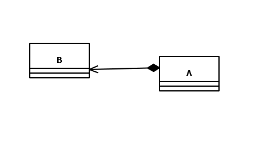
>
>A ile B arasındaki composition ilişkinin genel bir implementasyonu

```java
package org.csystem.app;  
  
class App {  
    public static void main(String[] args)  
    {  
        A x = new A(/*...*/);
  
        x.doWork1();  
        x.doWork2();  
    }  
}  
  
class A {  
    private B m_b;  
  
    public A(/*...*/)  
    {  
        m_b = new B(/*...*/);
    }  
  
    public void doWork1()  
    {  
        //...  
        m_b.doSomething();  
    }  
  
    public void doWork2()  
    {  
        //...  
        m_b.doSomething();  
    }  
}  
  
class B {  
    //...  
    public void doSomething()  
    {  
        //...  
    }  
}
```

>- **Aggregation (holds a):** `A holds B` ilişkisi composition ilişkisinin kurallarından en az bir tanesinin genel olarak gerçeklenmediği bütünsel kullanım ilişkisidir. `A holds a B` ilişkisinin sınıf diagramı şu şekildedir:
>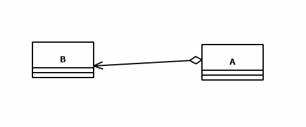
>A ile B arasındaki aggregation ilişkinin genel bir implementasyonu
```java
package org.csystem.app;  
  
class App {  
    public static void main(String[] args)  
    {  
        B b1 = new B(/*...*/);  
        A x = new A(b1/*...*/);  
  
        x.doWork1();  
        x.doWork2();  
  
        B b2 = new B(/*...*/);  
  
        x.setB(b2);
        x.doWork1();  
        x.doWork2();  
    }  
}  
  
class A {  
    private B m_b;  
  
    public A(B b/*...*/)  
    {  
        m_b = b;  
    }  
  
    public B getB()  
    {  
        return m_b;  
    }  
  
    public void setB(B b)  
    {  
        //...  
        m_b = b;  
    }  
  
    public void doWork1()  
    {  
        //...  
        m_b.doSomething();  
    }  
  
    public void doWork2()  
    {  
        //...  
        m_b.doSomething();  
    }  
}  
  
class B {  
    //...  
    public void doSomething()  
    {  
        //...  
    }  
}
```
>- **Association:** A nesnesinin B nesnesini ihtiyacı olduğunda kullanması yani bütünsel kullanmaması ilişkisidir. Buradaki kullanım **parçalı kullanım (partial usage)** biçimindedir. `A holds a B` ilişkisinin sınıf diagramı şu şekildedir:
>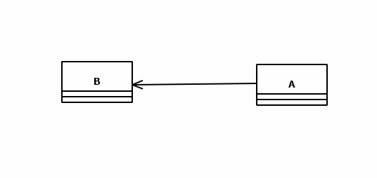
>A ile B arasındaki association ilişkinin genel bir implementasyonu
```java
package org.csystem.app;  
  
class App {  
    public static void main(String[] args)  
    {  
        B b1 = new B(/*...*/);  
        B b2 = new B(/*...*/);  
        A x = new A(/*...*/);  
  
  
        x.doWork(b1);  
        x.doWork(b2);  
    }  
}  
  
class A {  
    //...  
    public void doWork(B b)  
    {  
        //...  
        b.doSomething();  
    }  
}  
  
class B {  
    //...  
    public void doSomething()  
    {  
        //...  
    }  
}
```

>Aşağıdaki demo örneği aşağıdaki sınıf şeması doğrulltusunda inceleyiniz:

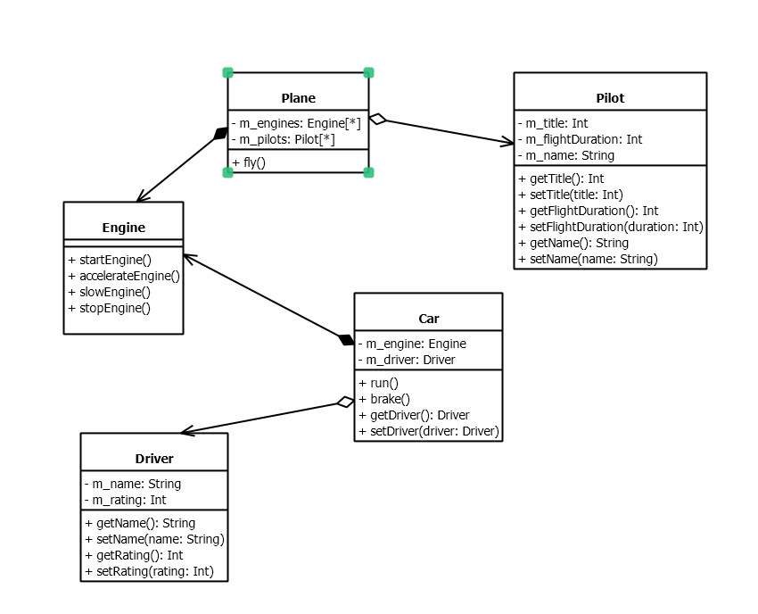
>Demo örnekte bazı detaylar gözardı edilmiştir

```java
package org.csystem.app;  
  
class App {  
    public static void main(String[] args)  
    {  
        DemoRaceApp.run();  
    }  
}  
  
class DemoRaceApp {  
    public static void run()  
    {  
        Driver driver = new Driver(/*...*/);  
  
        driver.setName("Arman Koca");  
        driver.setRating(100);  
  
        Car car = new Car(driver/*...*/);  
  
        car.run();  
  
        Pilot [] pilots = {new Pilot(1, 10000, "Elif Kılıç"), new Pilot(2, 50000, "Günay Akıncı"), new Pilot(3, 2500, "İsmail Enes Doğru")};  
        Plane plane = new Plane(4, pilots/*...*/);  
  
        plane.fly();  
    }  
}  
  
class Plane {  
    private final Engine [] m_engines;  
    private Pilot [] m_pilots;  
  
    //...  
  
    public Plane(int n, Pilot [] pilots/*...*/)  
    {  
        m_engines = new Engine[n];  
        m_pilots = pilots;  
  
        for (int i = 0; i < n; ++i)  
            m_engines[i] = new Engine(/*...*/);  
    }  
  
    private void startEngines()  
    {  
        for (Engine e : m_engines)  
            e.startEngine();  
    }  
  
    private void accelerateEngines()  
    {  
        for (Engine e : m_engines)  
            e.accelerateEngine();  
    }  
  
    private void slowEngines()  
    {  
        for (Engine e : m_engines)  
            e.slowEngine();  
    }  
  
    private void stopEngines()  
    {  
        for (Engine e : m_engines)  
            e.stopEngine();  
    }  
  
  
    public void fly()  
    {  
        for (Pilot pilot : m_pilots)  
            System.out.printf("%d, %s, %d%n", pilot.getTitle(), pilot.getName(), pilot.getFlightDuration());  
  
        startEngines();  
        accelerateEngines();  
  
        //...  
        System.out.println("flying");  
  
        slowEngines();  
        stopEngines();  
    }  
}  
  
class Car {  
    private final Engine m_engine;  
    private Driver m_driver;  
  
    //...  
  
    public Car(Driver driver/*...*/)  
    {  
        m_engine = new Engine(/*...*/);  
        m_driver = driver;  
    }  
  
    public Driver getDriver()  
    {  
        return m_driver;  
    }  
  
    public void setDriver(Driver driver)  
    {  
        m_driver = driver;  
    }  
  
    public void brake()  
    {  
        m_engine.slowEngine();  
    }  
  
    public void run()  
    {  
        System.out.printf("Driver:%s, %d%n", m_driver.getName(), m_driver.getRating());  
        m_engine.startEngine();  
        m_engine.accelerateEngine();  
  
        //...  
        System.out.println("running");  
  
        brake();  
        m_engine.stopEngine();  
    }  
}  
  
class Pilot {  
    private int m_title;  
    private int m_flightDuration;  
    private String m_name;  
  
    //...  
  
  
    public Pilot(int title, int flightDuration, String name)  
    {  
        m_title = title;  
        m_flightDuration = flightDuration;  
        m_name = name;  
    }  
  
    public int getTitle()  
    {  
        return m_title;  
    }  
  
    public void setTitle(int title)  
    {  
        m_title = title;  
    }  
  
    public int getFlightDuration()  
    {  
        return m_flightDuration;  
    }  
  
    public void setFlightDuration(int flightDuration)  
    {  
        m_flightDuration = flightDuration;  
    }  
  
    public String getName()  
    {  
        return m_name;  
    }  
  
    public void setName(String name)  
    {  
        m_name = name;  
    }  
}  
  
class Driver {  
    private String m_name;  
    private int m_rating;  
  
    //...  
  
    public String getName()  
    {  
        return m_name;  
    }  
  
    public void setName(String name)  
    {  
        m_name = name;  
    }  
  
    public int getRating()  
    {  
        return m_rating;  
    }  
  
    public void setRating(int rating)  
    {  
        m_rating = rating;  
    }  
}  
  
class Engine {  
    //...  
  
    public void startEngine()  
    {  
        System.out.println("Start Engine");  
    }  
  
    public void accelerateEngine()  
    {  
        System.out.println("Accelerate Engine");  
    }  
  
    public void slowEngine()  
    {  
        System.out.println("Slow Engine");  
    }  
  
    public void stopEngine()  
    {  
        System.out.println("Stop Engine");  
    }  
}
```

>Aşağıdaki demo örneği aşağıdaki sınıf şeması doğrulltusunda inceleyiniz:
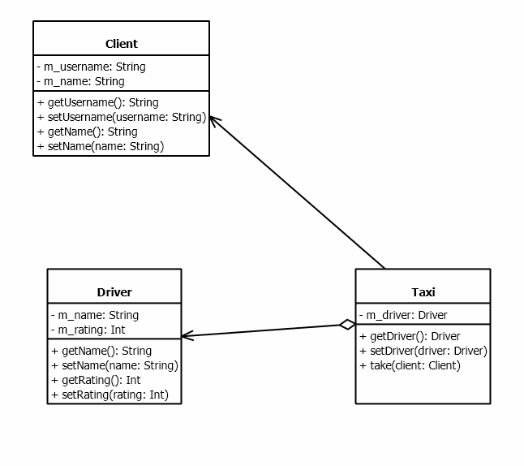


>Demo örnekte bazı detaylar gözardı edilmiştir,

```java
package org.csystem.app;  
  
class App {  
    public static void main(String[] args)  
    {  
        DemoRaceApp.run();  
    }  
}  
  
class DemoRaceApp {  
    public static void run()  
    {  
        Driver driver = new Driver();  
  
        driver.setName("Oğuz Karan");  
        driver.setRating(100);  
        Taxi taxi = new Taxi(driver/*...*/);  
        Client client1 = new Client("kaanaslan", "Kaan Aslan");  
        Client client2 = new Client("aliserce", "Ali Vefa Serçe");  
  
        taxi.take(client1);  
  
        //...  
  
        taxi.take(client2);  
    }  
}  
  
  
class Taxi {  
    private Driver m_driver;  
  
    //...  
  
    public Taxi(Driver driver/*...*/)  
    {  
        m_driver = driver;  
    }  
  
    public Driver getDriver()  
    {  
        return m_driver;  
    }  
  
    public void setDriver(Driver driver)  
    {  
        m_driver = driver;  
    }  
  
    public void take(Client client)  
    {  
        System.out.printf("Driver:%s, %d%n", m_driver.getName(), m_driver.getRating());  
        System.out.printf("Client:%s%n", client.getUsername());  
  
        //...  
    }  
}  
  
class Client {  
    private String m_username;  
    private String m_name;  
    //...  
  
  
    public Client(String name, String username)  
    {  
        m_name = name;  
        m_username = username;  
    }  
  
    public String getUsername()  
    {  
        return m_username;  
    }  
  
    public void setUsername(String username)  
    {  
        m_username = username;  
    }  
  
    public String getName()  
    {  
        return m_name;  
    }  
  
    public void setName(String name)  
    {  
        m_name = name;  
    }  
}  
  
class Driver {  
    private String m_name;  
    private int m_rating;  
  
    //...  
  
    public String getName()  
    {  
        return m_name;  
    }  
  
    public void setName(String name)  
    {  
        m_name = name;  
    }  
  
    public int getRating()  
    {  
        return m_rating;  
    }  
  
    public void setRating(int rating)  
    {  
        m_rating = rating;  
    }  
}  
  
class Engine {  
    //...  
  
    public void startEngine()  
    {  
        System.out.println("Start Engine");  
    }  
  
    public void accelerateEngine()  
    {  
        System.out.println("Accelerate Engine");  
    }  
  
    public void slowEngine()  
    {  
        System.out.println("Slow Engine");  
    }  
  
    public void stopEngine()  
    {  
        System.out.println("Stop Engine");  
    }  
}
```

>- **Inheritance (is a):** Biyoloji'den programlamlaya aktarılmıştır. Biyoloji'de inheritance `ebeveynin (parent) özelliklerinin çocuğuna (child) aktarımı` olarak tanımlanabilir.

**Anahtar Notlar:** Yukarıdaki 4 ilişkiden inheritance dışında kalanlar için Java'da ayrı bir kural seti yoktur. İlgili ilişkinin tanımı ve kuralları doğrultusunda, Java kuralları ile implemente edilebilir. Ancak inheritance ilişkisi için Java'da ayrı bir kural seti vardır. 

**Anahtar Notlar:** İki sınıf arasında, sınıfların tasarımları ve implementasyonları gereği yukarıdaki 4 ilişkiden hiç birisi olmamasına karşın bir dependency söz konusu olabilir. Bu da özel durumlardandır, genel durumu etkilemez. Bu durumlara ilişkin örnekler ileride verilecektir.

##### 3 Aralık 2024
##### Inheritance İlişkisi

>Bu ilişkiye NYPT'de `is a` ilişkisi de denilmektedir. Bu ilişki ile varolan bir sınıfın kodlarına dokunmadan (kodları elimizde olabilir ya da olmayabilir) **genişletme (extension)** yapılabilir. Bu ilişkiye aynı zamanda **generalization** da denilmektedir. Bu ilişkiye Türkçe olarak **türetme/kalıtım** ilişkisi diyeceğiz. Örneğin `analitik düzlemde` bir çemberi temsil eden (yarıçap, alan, çevre, merkez koordinatları vb bilgilerle) bir sınıf yazacak olalım. Anımsanacağı gibi daha önce yazdığımız Circle sınıfı `sentetik geometride` bir çemberi (dolayısıyla daireyi) temsil etmektedir. Yani, elimizde daha önceden yazılmış ve test edilmiş bir sınıf bulunmaktadır. Analitik düzlemde bir çemberde analitik özellikleri dışından bir çember olduğundan `(Analytical circle is a circle)`, `AnalyticalCircle` isimli bir sınıf `Circle` sınıfından türetilebilir. Bu anlamda bu ilişki `SOLID` ilkelerinden `Open Closed Principle`'ın mottosu olan **open for extension closed for modification** cümlesi de karşılamaktadır.
>
>A sınıfından B sınıfı türetilmiş olsun (B is a A). Bu durumda A sınıfına B sınıfının **taban sınıfı (bas class)**, B'ye ise A nın bir **türemiş sınıfı (derived class)** denir. Java'da `base class` yerine daha çok **super class**, `derived class` yerine ise daha çok **sub class** terimleri kullanılır. Bu terimlerle birlikte NYPT'de `base class` yerine **parent class**, `derived class` yerine **child class** terİmleri de kullanılabilmektedir. `B is a A` ilişkisinin sınıf şeması şu şekildedir:


>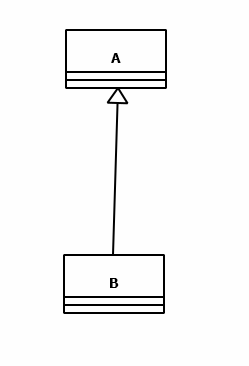

> Bir dizi türeme de söz konusu olabilir:

>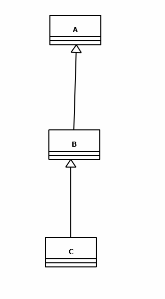

>Burada C'nin taban sınıfı (super class) dendiğinde **doğrudan taban sınıfı (direct super class)** anlaşılır. Yani C'nin taban sınıfı B'dir. Burada A C'nin **dolaylı taban sınıflarından (indirect super class)** biridir. Burada `C'nin taban sınıflarından bir A'dır (One of the super class of C is A` veya `A, C'nin taban sınıfır (A is super class of A` cümleleri YANLIŞTIR. Bu cümlelerin doğrusu `C'nin dolaylı taban sınıflarından bir A'dır (One of the indirect super class of C is A`. Çünkü, `C'nin taban sınıfı B'dir.` 
>
> Örneğin, `Vehicle` kavramı taşıma özelliğine sahip olsun. Bu domain'de bir deniz aracı, deniz'e ilişkin özelliklerin yanında taşıma özelliğine'de sahip olduğundan `Marine Vehicle is a vehicle` denebilir. Benzer şekilde `kara aracı ve hava aracı` için de aynı durum söz konusudur. Bu hiyerarşide bir `gemi`, bir `deniz aracı` olarak nitelendirilebilir. Bu hiyerarjiye ilişkin örnek bazı sınıflara ilişkin şema aşağıdaki gibi olabilir:
>

>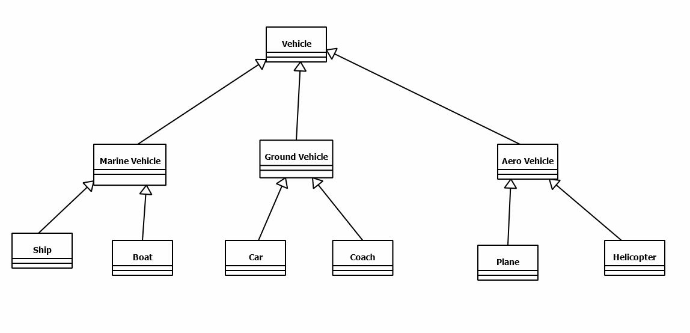
>Burada dikkat edilirse `Vehicle`'dan aşağıya doğru inildikçe bir **özelleşme (specialization)**, `Vehicle`'a doğru çıkıldıkça bir **genelleşme (generalization)** söz konusu olmaktadır. Bir sınıfın birden fazla (doğrudan) taban sınıfı olması durumuna `çoklu türetme (multiple inheritance)` denir. Java'da bir sınıfın yalnızca bir tane taban sınıfı vardır. Bu anlamda Java'da çoklu türetme yoktur. Aslında çoklu türetmenin programlamada bir karşılığı da doğrudan yoktur. Bu anlamda Java'da ileride göreceğimiz `arayüzler (interfaces)` ile çoklu türetme belirli ölçüde (pratikteki isterleri karşılayacak kadar) desteklenmektedir. Yani, Java'da çoklu türetmenin olmaması bir eksiklik oluşturmaz. Örneğin `Vehicle` hiyerarşisinde `deniz uçağı (float plane)` hem `deniz aracı` hem de `hava aracı` değildir. Deniz uçağı, hava aracıdır. Bu anlamda deniz uçağı için çoklu türetme söz konusu olmaz. 
>Bir sınıf kendisinden doğrudan ya da dolaylı olarak türetilemez. Yani türetme ilişkisinde döngüsellik söz konusu değildir. 
>
>Java'da türetme **extends** anahtar sözcüğü ile yapıılır. Türetme işleminde taban sınıfın elemanları türemiş sınıfa aktarılmış olur. Örneğin taban sınıfta olan bir metot türemiş sınıfa da aktarılır. Benzer şekilde ver elemanları da türemiş sınıfa aktarılır. Yani bu elemanlara türemiş sınıf türünden referans ile de erişilebilir.
>
>Aşağıdaki demo örneği inceleyiniz

```java
package org.csystem.app;  
  
class App {  
    public static void main(String[] args)  
    {  
        A x = new A();  
        B y = new B();  
        C z = new C();  
  
        x.foo();  
        x.a = 10;  
        y.foo();  
        y.bar();  
        ++y.a;  
        y.b = 30;  
        z.a = 10;  
        z.b = 20;  
        z.c = 45;  
        z.foo();  
        z.bar();  
        z.tar();  
    }  
}  
  
class C extends B {  
    public int c;  
  
    public void tar()  
    {  
        System.out.println("C.tar");  
    }  
}  
  
class B extends A {  
    public int b;  
  
    public void bar()  
    {  
        System.out.println("B.bar");  
    }  
}  
  
class A {  
    public int a;  
    public void foo()  
    {  
        System.out.println("A.foo");  
    }  
}
```

>Türetme ilişkisinde nesnesel bir kapsama söz konusudur. Bu ilişkide türemiş sınıf nesnesi içerisinde taban sınıf kadarlık bir bölüm de bulunur. Yani türemiş sınıf nesnesi yaratıldığında nesnesel olarak kapsadığı taban sınıf nesnesi de yaratılmış olur. Bu anlamda bakıldığında türemiş sınıfa eklenmiş veri elemanları ile aslında taban sınıf nesnesi genişletilmiş (extension) olur. Bu durumda türemiş sınıf nesnesinin uzunluğu **en az taban sınıf nesnesinin uzunluğu + türemiş sınıfa eklenen non-static veri elemanlarının uzunluğu kadardır.** Aslında türemiş sınıfa eklenen non-static veri elemanları ile bir nesne genişletilmiş (extend) olur:

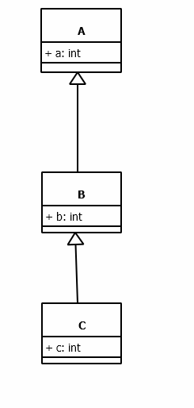

>Burada B sınıfı türünden bir nesnenin içeriisnde a veri elemanı da vardır. Aynı şekilde C sınıfı türünden bir nesnenin içerisinde a ve b veri elemanları da bulunur. Bu hiyerarşiye ilişkin nesnelerin birer örneklerinin bellekteki karşılıkları şekilsel olarak şu şekilde ifade edilebilir:


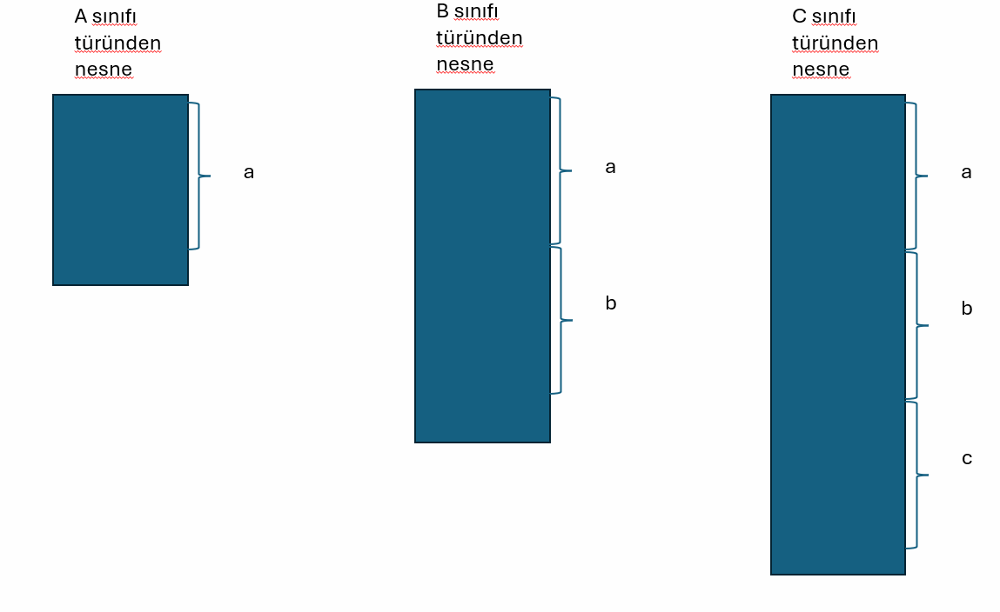

>Burada türemiş sınıfa eklenen veri elemanlarının düşük numaralı adreste veya yüksek numaralı adreste olmasının Java programcısı açısından önemi yoktur. 

##### 5 Aralık 2024

>Anımsanacağı gibi bir nesnenin yaratılmasının tamamlanması için en son aşamada ilgili ctor'unda çağrılmış olması gerekir. Bu durumda türemiş sınıf nesnesi yaratıldığında içerisinde taban sınıf nesnesi için de ctor'un çağrılması gerekir. **Türemiş sınıf ctor'undan önce, türemiş sınıf ctor'unda her hangi bir belirtme yapılmamışsa, taban sınıfının default ctor'u çağrılır.**  Yani aslında derleyici türemiş sınıf ctor'unun başında taban sınıf ctor çağrısı kodunu gizlice yerleştirir. Türemiş sınıf ctor'unda taban sınıf ctor'unun çağrısına ilişkin belirtme `super ctor sentaksı (**super ctor syntax)` kullanılarak yapılır. İleride ele alınacaktır.

>Aşağıdaki demo örneği çalıştırıp çağrıları gözlemleyiniz

```java
package org.csystem.app;  
  
class App {  
    public static void main(String[] args)  
    {  
        A x = new A();  
        System.out.println("--------------------------------");  
        B y = new B();  
        System.out.println("--------------------------------");  
        B z = new B(10);  
        System.out.println("--------------------------------");  
        C t = new C();  
        System.out.println("--------------------------------");  
        C u = new C(10, 20);  
        System.out.println("--------------------------------");  
    }  
}  
  
class C extends B {  
    public C()  
    {  
        System.out.println("I am a default ctor of C");  
    }  
  
    public C(int b, int c)  
    {  
        System.out.println("I am a ctor of C with parameter types int, int");  
    }  
    //...  
}  
  
class B extends A {  
    public B()  
    {  
        System.out.println("I am a default ctor of B");  
    }  
  
    public B(int b)  
    {  
        System.out.println("I am a ctor of B with a parameter type int");  
    }  
  
    //...  
}  
  
class A {  
    public A()  
    {  
        System.out.println("I am a default ctor of A");  
    }  
  
    //...  
}
```

###### super Constructor Syntax

>Taban sınıfın default ctor'u yoksa ya da var ama erişilemiyorsa ya da türemiş sınıfı yazan programcı türemiş sınıfın ctor'undan önce taban sınıfın default ctor'u yerine başka bir ctor'un çağrılmasını isterse (şüphesiz bu durum sınıfın tasarımı, dolayısıyla dmain'i ile alakalıdır) na yapması gerekir? Bu durumda **super ctor sentaksı (super ctor syntax)** kullanılır. super ctor sentaksı **super** anahtar sözcüğü ile yapılır. super ctor sentaksının genel biçimi şu şekildedir:,


```java
super([argumanlar]);
```

super ctor sentaksı türemiş sınıf ctor'nun başına programcı tarafından yerleştirilir. super ctor sentaksında hangi ctor'un çağrılacağı `method overload resolution` kurallarına göre belirlenir. Buna göre türemiş sınıfı içerisinde super ctor sentaksının `super()` biçiminde yazılması veya yazılmaması aynı anlama gelmektedir. super ctor sentaksından önce başka bir deyim yazılması error oluşuturur. Ayrıca adından da anlaşıldığı gibi super ctor sentaksı yalnızca ctor içerisinde yazılabilir. Bir metot içerisinde yazılması error oluşturur. 

>Aşağıdaki demo örneği inceleyiniz

```java
package org.csystem.app;  
  
class App {  
    public static void main(String[] args)  
    {  
        A x = new A();  
        System.out.println("--------------------------------");  
        B y = new B();  
        System.out.println("--------------------------------");  
        B z = new B(10);  
        System.out.println("--------------------------------");  
        C t = new C();  
        System.out.println("--------------------------------");  
        C u = new C(10, 20);  
        System.out.println("--------------------------------");  
    }  
}  
  
class C extends B {  
    public C()  
    {  
        System.out.println("I am a default ctor of C");  
    }  
  
    public C(int b, int c)  
    {  
        super(b);  
        System.out.println("I am a ctor of C with parameter types int, int");  
    }  
    //...  
}  
  
class B extends A {  
    public B()  
    {  
        System.out.println("I am a default ctor of B");  
    }  
  
    public B(int b)  
    {  
        super(b);  
        System.out.println("I am a ctor of B with a parameter type int");  
    }  
  
    //...  
}  
  
class A {  
    public A()  
    {  
        System.out.println("I am a default ctor of A");  
    }  
  
    public A(int a)  
    {  
        System.out.println("I am a ctor of A with a parameter type int");  
    }  
  
    //...  
}
```

>Aşağıdaki demo örneği inceleyiniz

```java
package org.csystem.app;  
  
class App {  
    public static void main(String[] args)  
    {  
        A x = new A();  
        System.out.println("--------------------------------");  
        B y = new B();  
        System.out.println("--------------------------------");  
        B z = new B(10);  
        System.out.println("--------------------------------");  
        C t = new C();  
        System.out.println("--------------------------------");  
        C u = new C(10, 20);  
        System.out.println("--------------------------------");  
    }  
}  
  
class C extends B {  
    public C()  
    {  
        super(); //yazılsa da yazılmasa da aynı anlamdadır  
        System.out.println("I am a default ctor of C");  
    }  
  
    public C(int b, int c)  
    {  
        super(b);  
        System.out.println("I am a ctor of C with parameter types int, int");  
    }  
    //...  
}  
  
class B extends A {  
    public B()  
    {  
        super(); //yazılsa da yazılmasa da aynı anlamdadır  
        System.out.println("I am a default ctor of B");  
    }  
  
    public B(int b)  
    {  
        super(b);  
        System.out.println("I am a ctor of B with a parameter type int");  
    }  
  
    //...  
}  
  
class A {  
    public A()  
    {  
        System.out.println("I am a default ctor of A");  
    }  
  
    public A(int a)  
    {  
        System.out.println("I am a ctor of A with a parameter type int");  
    }  
  
    //...  
}
```

>Aşağıdaki demo örnekte super ctor sentaksından önce bir deyim yazıldığından yani super ctor sentaksı ctor'un ilk deyimi olmadığından error oluşur

```java
class B extends A {  
    public B(int b)  
    {  
        System.out.println("I am a ctor of B with a parameter type int");  
        super(b); //error  
    }  
  
    //...  
}  
  
class A {  
    public A()  
    {  
        System.out.println("I am a default ctor of A");  
    }  
  
    public A(int a)  
    {  
        System.out.println("I am a ctor of A with a parameter type int");  
    }  
  
    //...  
}
```

**Anahtar Notlar:** super ctor sentaksının ctor'un deyimi olması konusunda Java 21 ile birlikte bazı değişiklikler yapılmıştır. Bu durum `Java ile Uygulama Geliştirme` kurslarında ele alınacaktır. 

>Aşağıdaki örnekte super ctor sentaksı bir metot içerisinde kullanıldığı için error oluşur

```java
class B extends A {  
    public void foo(int a)  
    {  
        super(a); //error  
    }  
  
    //...  
}  
  
class A {  
    public A()  
    {  
        System.out.println("I am a default ctor of A");  
    }  
  
    public A(int a)  
    {  
        System.out.println("I am a ctor of A with a parameter type int");  
    }  
  
    //...  
}
```

###### this Constructor Syntax

>Bir sınıfın bir ctor'undan önce, aynı sınıfın başka bir ctor'un çağrılabilmesi mümkündür ve bu **this ctor sentaksı (this ctor syntax)** kullanılarak yapılabilir. this ctor sentaksı **this** anahtar sözcüğü ile yapılır. thşs ctor sentaksının genel biçimi şu şekildedir:,


```java
this([argumanlar]);
```

this ctor sentaksı türemiş sınıf ctor'nun başına programcı tarafından yerleştirilir. this ctor sentaksında hangi ctor'un çağrılacağı `method overload resolution` kurallarına göre belirlenir. Bir ctor'un başında `this()` sentaksının yazılması ile yazılmaması aynı anlamda değildir. Yazılırsa, yazılan ctor'dan önce default ctor çağrılsın anlamında, yazılmasa, yazılmayan ctor'dan önce herhangi bir ctor çağrılmasın anlamındadır. this ctor sentaksından önce başka bir deyim yazılması error oluşuturur. Ayrıca adından da anlaşıldığı gibi this ctor sentaksı yalnızca ctor içerisinde yazılabilir. Bir metot içerisinde yazılması error oluşturur. this ctor sentaksında döngüsel durum error oluşturur

>Aşağıdaki demo örneği inceleyiniz

```java
package org.csystem.app;  
  
import java.util.Stack;  
  
class App {  
    public static void main(String[] args)  
    {  
        A x = new A();  
        System.out.println("--------------------------------");  
  
        A y = new A(10);  
        System.out.println("--------------------------------");  
  
        A z = new A("ankara");  
        System.out.println("--------------------------------");  
    }  
}  
  
class A {  
    public A()  
    {  
        this("");  
        System.out.println("I am a default ctor of A");  
    }  
  
    public A(int a)  
    {  
        this();  
        System.out.println("I am a ctor of A with a parameter type int");  
    }  
  
    public A(String str)  
    {  
        System.out.println("I am a ctor of A with a parameter type String");  
    }  
  
    //...  
}
```

>Aşağıdaki demo örnekte this ctor sentaksından önce bir deyim kullanıldığından error oluşur. 

```java
class A {  
    public A()  
    {  
        System.out.println("I am a default ctor of A");  
        this("");  //error  
    }  
  
    public A(int a)  
    {  
        this();  
        System.out.println("I am a ctor of A with a parameter type int");  
    }  
  
    public A(String str)  
    {  
  
        System.out.println("I am a ctor of A with a parameter type String");  
    }  
  
    //...  
}
```


>Aşağıdaki demo örnekte this ctor sentaksı bir metot içerisinde kullanıldığı için error oluşur

```java
class A {  
    public A()  
    {  
        this("");  
        System.out.println("I am a default ctor of A");  
    }  
  
    public A(int a)  
    {  
        this();  
        System.out.println("I am a ctor of A with a parameter type int");  
    }  
  
    public A(String str)  
    {  
  
        System.out.println("I am a ctor of A with a parameter type String");  
    }  
  
    public void foo()  
    {  
        this(); //error  
    }  
  
    //...  
}
```

>Aşağıdaki demo örnek this ctor sentaksı ile döngüsel bir durum oluşturuğundan geçersizdir

```java
class A {  
    public A()  
    {  
        this(""); //error  
        System.out.println("I am a default ctor of A");  
    }  
  
    public A(int a)  
    {  
        this();  
        System.out.println("I am a ctor of A with a parameter type int");  
    }  
  
    public A(String str)  
    {  
        this(); //error  
        System.out.println("I am a ctor of A with a parameter type String");  
    }  
  
    //...  
}
```

>Aşağıdaki demo örnek this ctor sentaksı ile döngüsel bir durum oluşturuğundan geçersizdir

```java
class A {  
    public A()  
    {  
        this(""); //error  
        System.out.println("I am a default ctor of A");  
    }  
  
    public A(int a)  
    {  
        this(); //error  
        System.out.println("I am a ctor of A with a parameter type int");  
    }  
  
    public A(String str)  
    {  
        this(10); //error  
        System.out.println("I am a ctor of A with a parameter type String");  
    }  
  
    //...  
}
```

>super ctor sentaksı ve this ctor sentaksı aynı ctor'da kullanılamaz. Çünkü her ikisinin de ctor'un ilk deyimi olması zorunludur. Aslında programcının böylesi bir durumla hiç karşılaşmaması gerekir. İyi bir tasarım ve dolayısıyla implementasyon programcı hiç bir zaman bunu kullanmak zorunda bırakmaz. Bir programcı böylesi bir durumla karşılaşırsa tasarımına bakmaıdır. 

>Aşağıdaki demo örnekte this ctor ve super sentaksları aynı ctor'da bir arada kullanıldıklarından error oluşur

```java
class B extends A {  
    public B()  
    {  
        System.out.println("I am a default ctor of B");  
    }  
  
    public B(int b)  
    {  
        this();  
        super(0); //error  
        System.out.println("I am a ctor of B with a parameter type int");  
    }  
  
    //...  
}  
  
class A {  
    public A()  
    {  
        System.out.println("I am a default ctor of A");  
    }  
  
    public A(int a)  
    {  
        System.out.println("I am a ctor of A with a parameter type int");  
    }  
  
    //...  
}
```

>Aşağıdaki demo örneğin inceleyiniz

```java
class B extends A {  
    public B()  
    {  
        super(0);  
        System.out.println("I am a default ctor of B");  
    }  
  
    public B(int b)  
    {  
        this();  
        System.out.println("I am a ctor of B with a parameter type int");  
    }  
  
    //...  
}  
  
class A {  
    public A()  
    {  
        System.out.println("I am a default ctor of A");  
    }  
  
    public A(int a)  
    {  
        System.out.println("I am a ctor of A with a parameter type int");  
    }  
  
    //...  
}
```

###### Object Sınıfı

>Bir sınıf extends anahtar sözcüğü ile hiç bir sınıftab türetilmese de **java.lang.Object** isimli bir sınıftan türetilmiş olur. Bu durumda Object sınıfı her sınıfın doğrudan ya da dolaylı olarak taban sınıfıdır. Böyle bir tasarımın yani Object sınıfın varlığı ve anlamı ileride ele alınacaktır. İstenirse Object sınıfı bir sınıfta extends anahtar sözcüğü ile de yazılabilir, yazılmasa da aynı anlamda olduğundan yazmamayı tercih edeceğiz. Bu durumda taban sınıf olmayan tek sınıf Object'dir. 

>Aşağıdaki demo sınıfın taban sınıfı olarak Object yazılmasına gerek yoktur

```java
class A extends Object {  
    //...
}
```

###### protected Bölümün Anlamı

>Anımsanacağı sınıfın protected bölümü friendly sınıf için public, farklı paketteki diğer sınıflar için türetme söz konusu değilse private anlamındadır. Ancak türetme söz konusuysa, türemiş sınıf taban sınıfının protected bölümüne aşağıdaki gibi erişemez

```java
package test;  
  
public class A {  
    protected int a;  
    protected A()  
    {  
  
    }  
  
    protected void foo()  
    {  
  
    }  
}
```

```java
package mest;  
  
import test.A;  
  
public class B extends A {  
    public void bar()  
    {  
        A x = new A(); //error
  
        x.a = 10; //error
        x.foo(); //error
    }  
}
```

>Bir sınıf farklı paketteki bir sınıftan türetilmişse, taban sınıfının `mantıksal olarak kendisine türemiş sınıfa ait olan protected bölümüne` erişilebilir. Yani aslında protected elemanlara doğrudan erişilebilir. 

>Aşağıdaki demo örneği inceleyiniz

```java
package test;  
  
public class A {  
    protected int a;  
    protected A()  
    {  
  
    }  
  
    protected A(int a)  
    {  
  
    }  
  
    protected void foo()  
    {  
  
    }  
}
```

```java
package mest;  
  
import test.A;  
  
public class B extends A {  
    public B()  
    {  
  
    }  
  
    public B(int a, int b)  
    {  
        super(a);  
    }  
  
    public void  bar(int x)  
    {  
        a = x;  
        foo();  
    }  
}
```

###### İsim Arama ve Türetme

>Anımsanacağı gibi nitelikli ve niteliksiz isim arama genel kurallarında bir isim sınıf içerisinde aranıyorsa ve bulunamazsa taban sınıfa, yoksa onun taban sınıfına, . . . bakılır. Hiç birinde yoksa bu adımda bulunamamış olur. 

>Aşağıdaki demo örneği inceleyiniz

```java
package org.csystem.app;  
  
class App {  
    public static void main(String[] args)  
    {  
        C x = new C();  
  
        x.a = 100;  
        x.b = 34;  
        x.c = 67;  
        x.tar();  
        x.bar();  
        x.foo();  
    }  
}  
  
class C extends B {  
    public int c;  
  
    public void tar()  
    {  
        a = 20;  
        b = 30;  
        c = 20;  
    }  
}  
  
class B extends A {  
    public int b;  
  
    public void bar()  
    {  
        System.out.println("B.bar");  
    }  
}  
  
class A {  
    public int a;  
    public void foo()  
    {  
        System.out.println("A.foo");  
    }  
}
```

##### 10 Aralık 2024

>Kartezyen düzlemde bir çemberi (analitik çember) temsil sınıfı yazacak olalım. Analitik çember aynı zamanda bir çember olduğuna göre daha önceden yazmış olduğumuz `Circle` sınıfının özelliklerini de barındırır. Bu durumda Circle sınıfından türetilebilir. Analitik çemberin ek (extension) olarak merkez koordinatı da olduğundan daha önce yazmış olduğumuz `MutablePoint` sınıfı `composition` ile kullanılabilir. Yani tipik olarak şu cümle kurulabilir: `AnalyticalCircle is a Circle, has a MutablePoint`. Buna göre detayları gözardı edilmiş UML şeması aşağıdaki gibidir:
>

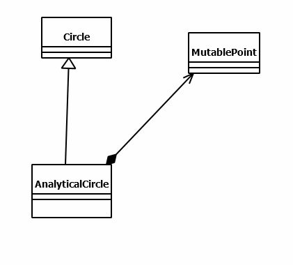
>AnalyticalCircle sınıfı ve test kodlarını inceleyiniz

```java
package org.csystem.math.geometry.test;  
  
import org.csystem.math.geometry.AnalyticalCircle;  
import org.csystem.math.geometry.Circle;  
  
import java.util.Random;  
import java.util.Scanner;  
  
public class AnalyticalCircleTest {  
    private static void run()  
    {  
        Scanner kb = new Scanner(System.in);  
        Random random = new Random();  
  
        System.out.print("Input count:");  
        int count = kb.nextInt();  
  
        while (count-- > 0) {  
            System.out.println("----------------------------------------");  
            double r = random.nextDouble(-10, 11);  
            double y = random.nextDouble(-100, 101);  
            double x = random.nextDouble(-100, 101);  
            AnalyticalCircle ac = new AnalyticalCircle(r, x, y);  
  
            System.out.printf("Generated Values -> r = %f, x = %f, y = %f%n", r, x, y);  
            System.out.printf("Radius:%f, Area:%f, Circumference:%f, Center:(%f, %f)%n", ac.getRadius(), ac.getArea(), ac.getCircumference(), ac.getX(), ac.getY());  
            y = random.nextDouble(-100, 101);  
            x = random.nextDouble(-100, 101);  
            ac.setX(x);  
            ac.setY(y);  
            System.out.printf("Radius:%f, Area:%f, Circumference:%f, Center:(%f, %f)%n", ac.getRadius(), ac.getArea(), ac.getCircumference(), ac.getX(), ac.getY());  
            System.out.printf("Radius:%f, Area:%f, Circumference:%f%n", ac.getRadius(), ac.getArea(), ac.getCircumference());  
            System.out.println("----------------------------------------");  
        }  
    }  
  
    public static void main(String[] args)  
    {  
        run();  
    }  
}
```
```java
package org.csystem.math.geometry.test;  
  
import org.csystem.math.geometry.AnalyticalCircle;  
  
import java.util.Random;  
import java.util.Scanner;  
  
public class AnalyticalCircleDefaultCtorTest {  
    private static void run()  
    {  
        AnalyticalCircle ac = new AnalyticalCircle();  
  
        System.out.printf("Radius:%f, Area:%f, Circumference:%f, Center:(%f, %f)%n", ac.getRadius(), ac.getArea(), ac.getCircumference(), ac.getX(), ac.getY());  
    }  
  
    public static void main(String[] args)  
    {  
        run();  
    }  
}
```

```java
package org.csystem.math.geometry.test;  
  
import org.csystem.math.geometry.AnalyticalCircle;  
  
import java.util.Random;  
import java.util.Scanner;  
  
public class AnalyticalCircleZeroRadiusCtorTest {  
    private static void run()  
    {  
        Scanner kb = new Scanner(System.in);  
        Random random = new Random();  
  
        System.out.print("Input count:");  
        int count = kb.nextInt();  
  
        while (count-- > 0) {  
            System.out.println("----------------------------------------");  
            double y = random.nextDouble(-100, 101);  
            double x = random.nextDouble(-100, 101);  
            AnalyticalCircle ac = new AnalyticalCircle(x, y);  
  
            System.out.printf("Generated Values -> x = %f, y = %f%n", x, y);  
            System.out.printf("Radius:%f, Area:%f, Circumference:%f, Center:(%f, %f)%n", ac.getRadius(), ac.getArea(), ac.getCircumference(), ac.getX(), ac.getY());  
            y = random.nextDouble(-100, 101);  
            x = random.nextDouble(-100, 101);  
            ac.setX(x);  
            ac.setY(y);  
            System.out.printf("Generated Values -> x = %f, y = %f%n", x, y);  
            System.out.printf("Radius:%f, Area:%f, Circumference:%f, Center:(%f, %f)%n", ac.getRadius(), ac.getArea(), ac.getCircumference(), ac.getX(), ac.getY());  
            System.out.println("----------------------------------------");  
        }  
    }  
  
    public static void main(String[] args)  
    {  
        run();  
    }  
}
```

```java
package org.csystem.math.geometry.test;  
  
import org.csystem.math.geometry.AnalyticalCircle;  
  
import java.util.Random;  
import java.util.Scanner;  
  
public class AnalyticalCircleZeroCenterCtorTest {  
    private static void run()  
    {  
        Scanner kb = new Scanner(System.in);  
        Random random = new Random();  
  
        System.out.print("Input count:");  
        int count = kb.nextInt();  
  
        while (count-- > 0) {  
            System.out.println("----------------------------------------");  
            double r = random.nextDouble(-10, 11);  
  
            AnalyticalCircle ac = new AnalyticalCircle(r);  
  
            System.out.printf("Generated Values -> r = %f%n", r);  
            System.out.printf("Radius:%f, Area:%f, Circumference:%f, Center:(%f, %f)%n", ac.getRadius(), ac.getArea(), ac.getCircumference(), ac.getX(), ac.getY());  
            System.out.println("----------------------------------------");  
        }  
    }  
  
    public static void main(String[] args)  
    {  
        run();  
    }  
}
```

```java
package org.csystem.math.geometry.test;  
  
import org.csystem.math.geometry.AnalyticalCircle;  
  
import java.util.Random;  
import java.util.Scanner;  
  
public class AnalyticalCircleOffsetTest {  
    private static void run()  
    {  
        Scanner kb = new Scanner(System.in);  
        Random random = new Random();  
  
        System.out.print("Input count:");  
        int count = kb.nextInt();  
  
        while (count-- > 0) {  
            System.out.println("----------------------------------------");  
            double r = random.nextDouble(-10, 11);  
            double y = random.nextDouble(-100, 101);  
            double x = random.nextDouble(-100, 101);  
            AnalyticalCircle ac = new AnalyticalCircle(r, x, y);  
  
            System.out.printf("Generated Values -> r = %f, x = %f, y = %f%n", r, x, y);  
            System.out.printf("Radius:%f, Area:%f, Circumference:%f, Center:(%f, %f)%n", ac.getRadius(), ac.getArea(), ac.getCircumference(), ac.getX(), ac.getY());  
            double dx = random.nextDouble(-100, 101);  
            double dy = random.nextDouble(-100, 101);  
  
            ac.offset(dx, dy);  
            System.out.printf("Generated Values -> dx = %f, dy = %f%n", dx, dy);  
            System.out.printf("Radius:%f, Area:%f, Circumference:%f, Center:(%f, %f)%n", ac.getRadius(), ac.getArea(), ac.getCircumference(), ac.getX(), ac.getY());  
            System.out.println("----------------------------------------");  
        }  
    }  
  
    public static void main(String[] args)  
    {  
        run();  
    }  
}
```

```java
package org.csystem.math.geometry;  
  
public class AnalyticalCircle extends Circle {  
    private static final double DELTA = 0.0000001;  
    private final MutablePoint m_center;  
  
    public AnalyticalCircle()  
    {  
        this(0, 0);  
    }  
  
    public AnalyticalCircle(double radius)  
    {  
        this(radius, 0, 0);  
    }  
  
    public AnalyticalCircle(double x, double y)  
    {  
        this(0, x, y);  
    }  
  
    public AnalyticalCircle(double radius, double x, double y)  
    {  
        super(radius);  
        m_center = MutablePoint.createCartesian(x, y);  
    }  
  
    public double getX()  
    {  
        return m_center.getX();  
    }  
  
    public void setX(double x)  
    {  
        m_center.setX(x);  
    }  
  
    public double getY()  
    {  
        return m_center.getY();  
    }  
  
    public void setY(double y)  
    {  
        m_center.setY(y);  
    }  
  
    public void setCenter(double x, double y)  
    {  
        setX(x);  
        setY(y);  
    }  
  
    public void offset(double dx, double dy)  
    {  
        m_center.offset(dx, dy);  
    }  
  
    public void offset(double dxy)  
    {  
        offset(dxy, dxy);  
    }  
  
    public boolean isTangent(AnalyticalCircle other)  
    {  
        return Math.abs(centersDistance(other) - getRadius() - other.getRadius()) < DELTA;  
    }  
  
    public double centersDistance(AnalyticalCircle other)  
    {  
        return m_center.euclideanDistance(other.m_center);  
    }  
  
    //...  
}
```

>Dikkat edilirse `AnalyticalCircle` sınıfın 3 parametreli ctor'u tüm diğer ctor'lardan önce çağrılmaktadır. Çünkü ctor'ların hepsi aslında benzer işi aynı algoritmayı kullanarak yapmaktadır. Bir sınıf içerisinde tüm diğer ctor'lardan doğrudan ya da dolaylı çağrılan ctor'lara **primary ctor** da denilmektedir.
>
>Bir sınıf, gizlediği bir referansın türüne ilişkin sınıfın bir metodunu genel olarak aynı isimde ve aynı parametrik yapıda dışarıya veriyorsa (genel olarak public yapıyorsa), dışarıya verilen bu metoda **delegate method** denir. Yukarıdaki AnalyticalCircle sınıfının getX, setX, getY, setY, offset metotları aslında birer delagate metottur. 

###### Bir Sınıfın Türetmeye Kapatılması

>Java'da bir sınıf default olarak türetmeye açıktır. Bir sınıfı kapatmak için sınıf **final** olarak bildirilir. Türetmeye kapalı sınıflara ise **final sınıflar (final classes)** denir. 


>Aşağıdaki demo örneği inceleyiniz

```java
class B extends A { //error
    //...  
}  
  
final class A {  
    //...  
}
```
>Bir sınıfın türetmeye kapatılması şüphesiz sınıfın domain'ine bağlıdır. Ancak bazı durumlarda gerekmese de sınıf final yapılır. Örneğin utility sınıflar zaten nesne özelliği göstermedikleri için bir convention olarak final yapılabilir. Ancak Jaba'da bu convention'a bazı sınıflarda uyulmamıştır. Örneğin Math sınıfı final'dır ancak Array sınıfı final olarak bildirilmemiştir. 

>Aşağıda final olarak bildirilmiş utility sınıfları inceleyiniz

```java
package org.csystem.util.array;  
  
import java.util.Random;  
  
public final class ArrayUtil {  
    private ArrayUtil()  
    {  
    }  
  
    private static void bubbleSortAscending(int [] a)  
    {  
        for (int i = 0; i < a.length - 1; ++i)  
            for (int k = 0; k < a.length - 1 - i; ++k)  
                if (a[k + 1] < a[k])  
                    swap(a, k, k + 1);  
    }  
  
    private static void bubbleSortDescending(int [] a)  
    {  
        for (int i = 0; i < a.length - 1; ++i)  
            for (int k = 0; k < a.length -1 - i; ++k)  
                if (a[k] < a[k + 1])  
                    swap(a, k, k + 1);  
    }  
  
    private static void selectionSortAscending(int [] a)  
    {  
        int min, minIndex;  
  
        for (int i = 0; i < a.length - 1; ++i) {  
            min = a[i];  
            minIndex = i;  
  
            for (int k = i + 1; k < a.length; ++k)  
                if (a[k] < min) {  
                    min = a[k];  
                    minIndex = k;  
                }  
            a[minIndex] = a[i];  
            a[i] = min;  
        }  
    }  
  
    private static void selectionSortDescending(int [] a)  
    {  
        int max, maxIndex;  
  
        for (int i = 0; i < a.length - 1; ++i) {  
            max = a[i];  
            maxIndex = i;  
  
            for (int k = i + 1; k < a.length; ++k)  
                if (max < a[k]) {  
                    max = a[k];  
                    maxIndex = k;  
                }  
            a[maxIndex] = a[i];  
            a[i] = max;  
        }  
    }  
  
    public static double average(int [] a)  
    {  
        return sum(a) / (double)a.length;  
    }  
  
    public static void bubbleSort(int [] a)  
    {  
        bubbleSort(a, false);  
    }  
  
    public static void bubbleSort(int [] a, boolean descending)  
    {  
        if (descending)  
            bubbleSortDescending(a);  
        else  
            bubbleSortAscending(a);  
    }  
  
    public static void drawHistogram(int [] data, int n, char ch)  
    {  
        int maxValue = ArrayUtil.max(data);  
  
        for (int grade : data) {  
            int count = (int)Math.floor(grade * n / (double)maxValue);  
  
            while (count-- > 0)  
                System.out.print(ch);  
  
            System.out.println();  
        }  
    }  
  
    public static int [] generateRandomArray(Random random, int count, int origin, int bound)  
    {  
        int [] a = new int[count];  
  
        for (int i = 0; i < count; ++i)  
            a[i] = random.nextInt(origin, bound);  
  
        return a;  
    }  
  
    public static double [] generateRandomArray(Random random, int count, double origin, double bound)  
    {  
        double [] a = new double[count];  
  
        for (int i = 0; i < count; ++i)  
            a[i] = random.nextDouble(origin, bound);  
  
        return a;  
    }  
  
    public static boolean [] generateRandomArray(Random random, int count)  
    {  
        boolean [] a = new boolean[count];  
  
        for (int i = 0; i < count; ++i)  
            a[i] = random.nextBoolean();  
  
        return a;  
    }  
  
    public static int [] histogramData(int [] a, int n)  
    {  
        int [] data = new int[n + 1];  
  
        for (int val : a)  
            ++data[val];  
  
        return data;  
    }  
  
    public static int max(int [] a)  
    {  
        return max(a, 0);  
    }  
  
    public static int max(int [] a, int startIndex)  
    {  
        int result = a[startIndex];  
  
        for (int i = startIndex + 1; i < a.length; ++i)  
            result = Math.max(result, a[i]);  
  
        return result;  
    }  
  
    public static int max(int [][] a)  
    {  
        int result = Integer.MIN_VALUE;  
  
        for (int [] array : a)  
            result = Math.max(result, max(array));  
  
        return result;  
    }  
  
    public static int min(int [] a)  
    {  
        return min(a, 0);  
    }  
  
    public static int min(int [] a, int startIndex)  
    {  
        int result = a[startIndex];  
  
        for (int i = startIndex + 1; i < a.length; ++i)  
            result = Math.min(result, a[i]);  
  
        return result;  
    }  
  
    public static int min(int [][] a)  
    {  
        int result = Integer.MAX_VALUE;  
  
        for (int [] array : a)  
            result = Math.min(result, min(array));  
  
        return result;  
    }  
  
    public static void multiplyBy(int [] a, int value)  
    {  
        for (int i = 0; i < a.length; ++i)  
            a[i] *= value;  
    }  
  
    public static void multiplyBy(int [][] a, int value)  
    {  
        for (int [] array : a)  
            multiplyBy(array, value);  
    }  
  
    public static int partition(int [] a, int threshold)  
    {  
        int partitionPoint = 0;  
  
        while (partitionPoint != a.length && a[partitionPoint] < threshold)  
            ++partitionPoint;  
  
        if (partitionPoint == a.length)  
            return partitionPoint;  
  
        for (int i = partitionPoint + 1; i < a.length; ++i)  
            if (a[i] < threshold)  
                swap(a, i, partitionPoint++);  
  
        return partitionPoint;  
    }  
  
    public static int partitionByEven(int [] a)  
    {  
        int partitionPoint = 0;  
  
        while (partitionPoint != a.length && a[partitionPoint] % 2 == 0)  
            ++partitionPoint;  
  
        if (partitionPoint == a.length)  
            return partitionPoint;  
  
        for (int i = partitionPoint + 1; i < a.length; ++i)  
            if (a[i] % 2 == 0)  
                swap(a, i, partitionPoint++);  
  
        return partitionPoint;  
    }  
  
    public static void print(int [] a)  
    {  
        print(a, ' ', '\n');  
    }  
  
    public static void print(int [] a, char sep, char end)  
    {  
        print(a, 1, sep, end);  
    }  
  
    public static void print(int [] a, int n)  
    {  
        print(a, n, ' ', '\n');  
    }  
  
    public static void print(int [] a, int n, char sep, char end)  
    {  
        String fmt = String.format("%%0%dd%c", n, sep);  
  
        for (int val : a)  
            System.out.printf(fmt, val);  
  
        System.out.print(end);  
    }  
  
    public static void print(int [][] a)  
    {  
        print(a, 1);  
    }  
  
    public static void print(int [][] a, int n)  
    {  
        for (int [] array : a)  
            print(array, n, ' ', '\n');  
    }  
  
    public static void print(double [] a)  
    {  
        print(a, '\n', '\n');  
    }  
  
    public static void print(double [] a, char sep, char end)  
    {  
        for (double val : a)  
            System.out.printf("%f%c", val, sep);  
  
        System.out.print(end);  
    }  
  
    public static void reverse(int [] a)  
    {  
        int left = 0, right = a.length - 1;  
  
        while (left < right)  
            swap(a, left++, right--);  
    }  
  
    public static void reverse(char [] a)  
    {  
        int left = 0, right = a.length - 1;  
  
        while (left < right)  
            swap(a, left++, right--);  
    }  
  
    public static void selectionSort(int [] a)  
    {  
        selectionSort(a, false);  
    }  
  
    public static void selectionSort(int [] a, boolean descending)  
    {  
        if (descending)  
            selectionSortDescending(a);  
        else  
            selectionSortAscending(a);  
    }  
    public static long sum(int [] a)  
    {  
        long total = 0;  
  
        for (int val : a)  
            total += val;  
  
        return total;  
    }  
  
    public static void swap(int [] a, int i, int k)  
    {  
        int temp = a[i];  
  
        a[i] = a[k];  
        a[k] = temp;  
    }  
  
    public static void swap(char [] a, int i, int k)  
    {  
        char temp = a[i];  
  
        a[i] = a[k];  
        a[k] = temp;  
    }  
  
    //...  
}
```

```java
package org.csystem.util.console;  
  
public final class CommandLineArgsUtil {  
    private CommandLineArgsUtil()  
    {  
    }  
  
    public static void checkLengthEquals(int len, int argsLen, String message)  
    {  
        checkLengthEquals(len, argsLen, message, 1);  
    }  
  
    public static void checkLengthEquals(int len, int argsLen, String message, int exitCode)  
    {  
        if (len != argsLen) {  
            System.err.println(message);  
            System.exit(exitCode);  
        }  
    }  
  
    public static void checkLengthGreater(int len, int argsLen, String message)  
    {  
        checkLengthGreater(len, argsLen, message, 1);  
    }  
  
    public static void checkLengthGreater(int len, int argsLen, String message, int exitCode)  
    {  
        if (len <= argsLen) {  
            System.err.println(message);  
            System.exit(exitCode);  
        }  
    }  
  
    //...  
}
```

```java
package org.csystem.util.matrix;  
  
import org.csystem.util.array.ArrayUtil;  
  
import java.util.Random;  
  
public final class MatrixUtil {  
    private MatrixUtil()  
    {  
    }  
  
    public static int [][] add(int [][] a, int [][] b)  
    {  
        int m = a.length;  
        int n = a[0].length;  
        int [][] r = new int[m][n];  
  
        for (int i = 0; i < m; ++i)  
            for (int j = 0; j < n; ++j)  
                r[i][j] = a[i][j] + b[i][j];  
  
        return r;  
    }  
  
    public static double [][] add(double [][] a, double [][] b)  
    {  
        int m = a.length;  
        int n = a[0].length;  
        double [][] r = new double[m][n];  
  
        for (int i = 0; i < m; ++i)  
            for (int j = 0; j < n; ++j)  
                r[i][j] = a[i][j] + b[i][j];  
  
        return r;  
    }  
  
    public static int [][] generateRandomMatrix(Random random, int m, int n, int origin, int bound)  
    {  
        int [][] result = new int[m][];  
  
        for (int i = 0; i < m; ++i)  
            result[i] = ArrayUtil.generateRandomArray(random, n, origin, bound);  
  
        return result;  
    }  
  
    public static int [][] generateRandomSquareMatrix(Random random, int n, int origin, int bound)  
    {  
        return generateRandomMatrix(random, n, n, origin, bound);  
    }  
  
    public static boolean isMatrix(int [][] a)  
    {  
        for (int i = 1; i < a.length; ++i)  
            if (a[i].length != a[0].length)  
                return false;  
  
        return true;  
    }  
  
    public static boolean isSquareMatrix(int [][] a)  
    {  
        return isMatrix(a) && a.length == a[0].length;  
    }  
  
    public static int max(int [][] a)  
    {  
        return ArrayUtil.max(a);  
    }  
  
    public static int min(int [][] a)  
    {  
        return ArrayUtil.min(a);  
    }  
  
    public static int [][] multiply(int [][] a, int [][] b)  
    {  
        int m = a.length;  
        int n = a[0].length;  
        int p = b[0].length;  
        int [][] r = new int[m][p];  
  
        for (int i = 0; i < m; ++i)  
            for (int j = 0; j < n; ++j)  
                for (int k = 0; k < p; ++k)  
                    r[i][k] += a[i][j] * b[j][k];  
  
        return r;  
    }  
  
    public static void multiplyBy(int [][] a, int value)  
    {  
        ArrayUtil.multiplyBy(a, value);  
    }  
  
    public static void print(int [][] a)  
    {  
        print(a, 1);  
    }  
  
    public static void print(int [][] a, int n)  
    {  
        ArrayUtil.print(a, n);  
    }  
  
    public static int [][] subtract(int [][] a, int [][] b)  
    {  
        int m = a.length;  
        int n = a[0].length;  
        int [][] r = new int[m][n];  
  
        for (int i = 0; i < m; ++i)  
            for (int j = 0; j < n; ++j)  
                r[i][j] = a[i][j] - b[i][j];  
  
        return r;  
    }  
  
    public static long sum(int [][] a)  
    {  
        long total = 0;  
  
        for (int [] array : a)  
            total += ArrayUtil.sum(array);  
  
        return total;  
    }  
  
    public static long sumDiagonal(int [][] a)  
    {  
        long total = 0;  
  
        for (int i = 0; i < a.length; ++i)  
            total += a[i][i];  
  
        return total;  
    }  
  
    public static int [][] transpose(int [][] a)  
    {  
        int m = a.length;  
        int n = a[0].length;  
        int [][] r = new int[n][m];  
  
        for (int i = 0; i < n; ++i)  
            for (int j = 0; j < m; ++j)  
                r[i][j] = a[j][i];  
  
        return r;  
    }  
}
```

```java
package org.csystem.util.numeric;  
  
public final class NumberUtil {  
    private NumberUtil()  
    {  
    }  
  
    private static final String ZERO_TR = "sıfır";  
    private static final String MINUS_TR = "eksi";  
    private static final String [] ONES_TR = {"", "bir", "iki", "üç", "dört", "beş", "altı", "yedi", "sekiz", "dokuz"};  
    private static final String [] TENS_TR = {"", "on", "yirmi", "otuz", "kırk", "elli", "altmış", "yetmiş", "seksen", "doksan"};  
    private static final String [] NUMBER_UNITS_TR = {"kentilyon", "katrilyon", "trilyon", "milyar", "milyon", "bin", ""};  
  
  
    private static final String ZERO_EN = "zero";  
    private static final String MINUS_EN= "minus";  
    private static final String [] ONES_EN = {"", "one", "two", "three", "four", "five", "six", "seven", "eight", "nine"};  
    private static final String [] TENS_EN = {"", "ten", "twenty", "thirty", "forty", "fifty", "sixty", "seventy", "eighty", "ninety"};  
    private static final String [] NUMBER_UNITS_EN = {"quintillion", "quadrillion", "trillion", "billion", "million", "thousand", ""};  
  
    private static int [] getDigits(long a, int n)  
    {  
        int divider = (int)Math.pow(10, n);  
       a = Math.abs(a);  
        int [] digits = new int[a == 0 ? 1 : (int)(Math.log10(a) / n) + 1];  
  
        for (int i = digits.length - 1; i >= 0; digits[i--] = (int)(a % divider), a /= divider)  
            ;  
  
        return digits;  
    }  
  
    private static String numToStr3DigitsTR(int val)  
    {  
       StringBuilder sb = new StringBuilder();  
  
       int a = val / 100;  
       int b = val / 10 % 10;  
       int c = val % 10;  
  
       if (a != 0) {  
          if (a != 1)  
             sb.append(ONES_TR[a]).append(" ");  
          sb.append("yüz ");  
       }  
  
       if (b != 0)  
          sb.append(TENS_TR[b]).append(" ");  
  
       if (c != 0)  
          sb.append(ONES_TR[c]).append(" ");  
  
       return sb.isEmpty() ? "" : sb.substring(0, sb.length() - 1);  
    }  
  
    private static String numToStr3DigitsEN(int val)  
    {  
       StringBuilder sb = new StringBuilder();  
  
       int a = val / 100;  
       int b = val / 10 % 10;  
       int c = val % 10;  
  
       if (a != 0)  
          sb.append(ONES_EN[a]).append(" ").append("hundred ");  
  
       if (b != 0)  
          sb.append(TENS_EN[b]).append(" ");  
  
       if (c != 0)  
          sb.append(ONES_EN[c]).append(" ");  
  
       return sb.isEmpty() ? "" : sb.substring(0, sb.length() - 1);  
    }  
  
    public static int countDigits(long a)  
    {  
       return a != 0 ? (int)Math.log10(Math.abs(a)) + 1 : 1;  
    }  
  
    public static long factorial(int n)  
    {  
       long result = 1;  
  
       for (long i = 2; i <= n; ++i)  
          result *= i;  
  
       return result;  
    }  
  
    public static int fibonacciNumber(int n)  
    {  
       if (n <= 2)  
          return n - 1;  
  
       int prev1 = 1, prev2 = 0, result = prev1 + prev2;  
  
       for (int i = 3; i < n; ++i) {  
          prev2 = prev1;  
          prev1 = result;  
          result = prev1 + prev2;  
       }  
  
       return result;  
    }  
  
    public static int [] getDigits(long a)  
    {  
       return getDigits(a, 1);  
    }  
  
    public static int [] getDigitsInThrees(long a)  
    {  
        return getDigits(a, 3);  
    }  
  
    public static int [] getDigitsInTwos(long a)  
    {  
        return getDigits(a, 2);  
    }  
  
    public static int getDigitsPowSum(int a)  
    {  
       int result = 0;  
       int n = countDigits(a);  
  
       while (a != 0) {  
          result += (int)Math.pow(a % 10, n);  
          a /= 10;  
       }  
  
       return result;  
    }  
  
    public static boolean isArmstrong(int a)  
    {  
       return a >= 0 && getDigitsPowSum(a) == a;  
    }  
  
    public static boolean isEven(int a)  
    {  
       return a % 2 == 0;  
    }  
  
    public static boolean isOdd(int a)  
    {  
       return !isEven(a);  
    }  
  
    public static boolean isPrime(long a)  
    {  
       if (a <= 1)  
          return false;  
  
       if (a % 2 == 0)  
          return a == 2;  
  
       if (a % 3 == 0)  
          return a == 3;  
  
       if (a % 5 == 0)  
          return a == 5;  
  
       if (a % 7 == 0)  
          return a == 7;  
  
       for (long i = 11; i * i <= a; i += 2)  
          if (a % i == 0)  
             return false;  
  
       return true;  
    }  
  
    public static long nextClosestPrime(long a)  
    {  
       if (a < 2)  
          return 2;  
  
       while (!isPrime(++a))  
          ;  
  
       return a;  
    }  
  
    public static int nextFibonacciNumber(int val)  
    {  
       if (val < 0)  
          return 0;  
  
       int prev1 = 1, prev2 = 0, next = prev1 + prev2;  
  
       while (next <= val) {  
          prev2 = prev1;  
          prev1 = next;  
          next = prev1 + prev2;  
       }  
  
       return next;  
    }  
  
    public static long nthPrime(int n)  
    {  
       long result = 2;  
       int count = 0;  
  
       for (long i = 2; count < n; ++i)  
          if (isPrime(i)) {  
             ++count;  
             result = i;  
          }  
       return result;  
    }  
  
    public static String numToStrTR(long a)  
    {  
       if (a == 0)  
          return ZERO_TR;  
  
       int [] threes = getDigitsInThrees(a);  
       StringBuilder sb = new StringBuilder();  
       int idx = NUMBER_UNITS_TR.length - 1;  
  
       for (int i = threes.length - 1; i >= 0; --i) {  
          if (threes[i] != 0)  
             sb.insert(0, "%s%s ".formatted(idx == NUMBER_UNITS_TR.length - 2 && threes[i] == 1 ? "" : numToStr3DigitsTR(threes[i]) + " ", NUMBER_UNITS_TR[idx]));  
  
          --idx;  
       }  
  
       return "%s%s".formatted(a < 0 ? MINUS_TR + " " : "", sb.substring(0, sb.length() - 2));  
    }  
  
    public static String numToStrEN(long a)  
    {  
       if (a == 0)  
          return ZERO_EN;  
  
       int [] threes = getDigitsInThrees(a);  
       StringBuilder sb = new StringBuilder();  
       int idx = NUMBER_UNITS_EN.length - 1;  
  
       for (int i = threes.length - 1; i >= 0; --i) {  
          if (threes[i] != 0)  
             sb.insert(0, "%s %s ".formatted(numToStr3DigitsEN(threes[i]), NUMBER_UNITS_EN[idx]));  
  
          --idx;  
       }  
  
       return "%s%s".formatted(a < 0 ? MINUS_EN + " " : "", sb.substring(0, sb.length() - 2));  
    }  
  
    public static int reverse(int val)  
    {  
       int result = 0;  
  
       while (val != 0) {  
          result = result * 10 + val % 10;  
          val /= 10;  
       }  
  
       return result;  
    }  
  
    public static int sumDigits(int val)  
    {  
       int total = 0;  
  
       while (val != 0) {  
          total += val % 10;  
          val /= 10;  
       }  
  
       return Math.abs(total);  
    }  
}
```

```java
package org.csystem.util.string;  
  
import java.util.Random;  
  
public final class StringUtil {  
    private StringUtil()  
    {  
    }  
  
    private static final String LETTERS_EN = "abcdefghijklmnopqrstuvwxyz";  
    private static final String LETTERS_TR = "abcçdefgğhıijklmnoöprsştuüvyz";  
    private static final String CAPITAL_LETTERS_EN = "ABCDEFGHIJKLMNOPQRSTUVWXYZ";  
    private static final String CAPITAL_LETTERS_TR = "ABCÇDEFGĞHIİJKLMNOÖPRSŞTUÜVYZ";  
    private static final String ALL_LETTERS_EN = LETTERS_EN + CAPITAL_LETTERS_EN;  
    private static final String ALL_LETTERS_TR = LETTERS_TR + CAPITAL_LETTERS_TR;  
  
    public static String capitalize(String s)  
    {  
       return s.isEmpty() ? s : Character.toUpperCase(s.charAt(0)) + s.substring(1).toLowerCase();  
    }  
  
    public static String changeCase(String s)  
    {  
       StringBuilder sb = new StringBuilder(s);  
  
       for (int i = 0; i < s.length(); ++i) {  
          char c = s.charAt(i);  
  
          sb.setCharAt(i, Character.isLowerCase(c) ? Character.toUpperCase(c) : Character.toLowerCase(c));  
       }  
  
       return sb.toString();  
    }  
  
  
    public static int countString(String s1, String s2)  
    {  
       int count = 0;  
  
       for (int i = 0; (i = s1.indexOf(s2, i)) != -1; ++i, ++count)  
          ;  
  
       return count;  
    }  
  
    public static String generateRandomText(Random random, int count, String sourceText)  
    {  
       char [] c = new char[count];  
  
       for (int i = 0; i < count; ++i)  
          c[i] = sourceText.charAt(random.nextInt(sourceText.length()));  
  
       return String.valueOf(c);  
    }  
  
    public static String generateRandomTextEN(Random random, int count)  
    {  
       return generateRandomText(random, count, ALL_LETTERS_EN);  
    }  
  
    public static String generateRandomTextTR(Random random, int count)  
    {  
       return generateRandomText(random, count, ALL_LETTERS_TR);  
    }  
  
    public static String [] generateRandomTexts(Random random, int count, int origin, int bound, String sourceText)  
    {  
       String [] str = new String[count];  
  
       for (int i = 0; i < count; ++i)  
          str[i] = generateRandomText(random, random.nextInt(origin, bound), sourceText);  
  
       return str;  
    }  
  
    public static String [] generateRandomTextsEN(Random random, int count, int origin, int bound)  
    {  
       return generateRandomTexts(random, count, origin, bound, ALL_LETTERS_EN);  
    }  
  
    public static String [] generateRandomTextsTR(Random random, int count, int origin, int bound)  
    {  
       return generateRandomTexts(random, count, origin, bound, ALL_LETTERS_TR);  
    }  
  
    public static boolean isPalindrome(String s)  
    {  
       int left = 0;  
       int right = s.length() - 1;  
  
       while (left < right) {  
          char cLeft = s.charAt(left);  
  
          if (!Character.isLetter(cLeft)) {  
             ++left;  
             continue;  
          }  
  
          char cRight = s.charAt(right);  
  
          if (!Character.isLetter(cRight)) {  
             --right;  
             continue;  
          }  
  
          if (Character.toLowerCase(cLeft) != Character.toLowerCase(cRight))  
             return false;  
  
          ++left;  
          --right;  
       }  
  
       return true;  
    }  
  
  
    public static boolean isPangram(String s, String alphabet)  
    {  
       for (int i = 0; i < alphabet.length(); ++i)  
          if (s.indexOf(alphabet.charAt(i)) == -1)  
             return false;  
  
       return true;  
    }  
  
  
    public static boolean isPangramEN(String s)  
    {  
       return isPangram(s.toLowerCase(), LETTERS_EN);  
    }  
  
    public static boolean isPangramTR(String s)  
    {  
       return isPangram(s.toLowerCase(), LETTERS_TR);  
    }  
  
    public static String join(String [] s, String delimiter)  
    {  
       StringBuilder sb = new StringBuilder();  
  
       for (String str : s)  
          sb.append(str).append(delimiter);  
  
       return sb.substring(0, sb.length() - delimiter.length());  
    }  
  
    public static String join(String [] s, char delimiter)  
    {  
       return join(s, String.valueOf(delimiter));  
    }  
  
    public static String padLeading(String s, int n, char ch)  
    {  
       int len = s.length();  
  
       return len < n ? String.valueOf(ch).repeat(n - len) + s : s;  
    }  
  
    public static String padLeading(String s, int n)  
    {  
       return padLeading(s, n, ' ');  
    }  
  
    public static String padTrailing(String s, int n, char ch)  
    {  
       int len = s.length();  
  
       return len < n ? s + String.valueOf(ch).repeat(n - len) : s;  
    }  
  
    public static String padTrailing(String s, int n)  
    {  
       return padTrailing(s, n, ' ');  
    }  
  
    public static String reverse(String s)  
    {  
       return new StringBuilder(s).reverse().toString();  
    }  
  
    public static String [] split(String s, String delimiters)  
    {  
       return split(s, delimiters, true);  
    }  
  
    public static String [] split(String s, String delimiters, boolean removeEmptyEntries)  
    {  
       StringBuilder pattern = new StringBuilder("[");  
  
       for (int i = 0; i < delimiters.length(); ++i) {  
          char c = delimiters.charAt(i);  
  
          if (c == '[' || c == ']')  
             pattern.append('\\');  
  
          pattern.append(c);  
       }  
  
       pattern.append(']');  
  
       if (removeEmptyEntries)  
          pattern.append("+");  
  
       return s.split(pattern.toString());  
    }  
}
```


##### 17 Aralık 2024

>**Soru:** `final` anahtar sözcüğü kullanmadan bir sınıfı türetmeye nasıl kapatırsınız? 

>**Cevap:** Şüphesiz pratikte bir sınıfı türetmeye kapatmak için final anahtar sözcüğü kullanılır. Bu soruya ve cevabına bir bilgi ölçümü olarak bakılmalıdır. Bir sınıf final anahtar sözcüğü kullanmadan doğrudan türetmeye kapatılamaz. Bu durumda türetme yapılamaması için ctor'un private yapılması gerekir. Ancak bu durumda sınıfı kullanan kodlar da nesne yaratamaz duruma gelecektir. Bu sınıf türünden nesnenin de sınıf dışından yaratılabilmesi için programcı bir factory metot yazabilir. Bu durumda nesne yaratmak isteyen programcı sınıfın ilgili factory metodunu çağırarak nesne yaratılmasını sağlar. 

```java
package org.csystem.app;  
  
class App {  
    public static void main(String[] args)  
    {  
        A x = A.create();  
          
        x.foo();  
    }  
}  
  
  
class B extends A { //error  
  
}  
  
class A {  
    //...  
    private A()  
    {  
    }  
  
    public static A create()  
    {  
        return new A();  
    }  
  
    public void foo()  
    {  
        //...  
    }  
    //...  
}
```

>Dikkat edilirse sınıf türetmeye dolaylı olarak kapatılmıştır. 

###### Türemiş Sınıf ve Taban Sınıf Arasındaki Dönüşümler

>Anımsanacağı gibi farklı türden referanslar tür dönüştürme operatörü ile (explicit) bile birbirine dönüşemezler. İki sınıf arasında türetme ilişkisi varsa bu durumda:
>1. Türemiş sınıf türünden bir referans, taban sınıf türünden bir referansa doğrudan (implicit) dönüşebilir (atanabilir).
>2. Taban sınıf türünden bir referans, türemiş sınıf türünden bir referansa doğrudan (implicit) dönüşemez (atanamaz). Bu işlem tür dönüştürme operatörü ile yapılabilir.
>Buradaki ilk dönüşüme **yukarıya doğru dönüşüm (upcasting)**, ikinci dönüşüme ise **aşağıya doğru dönüşüm (downcasting)** denilmektedir.
> 

###### Yukarıya Doğru Dönüşüm (Upcasting)

>Bu durumda **türemiş nesnesinin taban sınıf kısmının adresi taban sınıf referansına atanmış olur**.
>

>sınıfları için nesnelerin bellekteki karşıklarının aşağıdaki gibi olduğunu yani türemiş sınıf türünden bir nesnenin taban sınıf kısmına ilişkin nesneyi de kapsadığını (nesnesel kapsama) anımsayınız:


>Aşağıdaki demo örneği inceleyiniz

```java
package org.csystem.app;  
  
class App {  
    public static void main(String[] args)  
    {  
        B x = new B();  
        A y;  
  
        x.a = 20;  
        x.b = 30;  
        y = x; //upcasting  
  
        System.out.printf("x.a = %d, x.b = %d%n", x.a, x.b);  
        System.out.printf("y.a = %d%n", y.a);  
        System.out.println("---------------------------------");  
  
        ++y.a;  
        System.out.printf("x.a = %d, x.b = %d%n", x.a, x.b);  
        System.out.printf("y.a = %d%n", y.a);  
        System.out.println("---------------------------------");  
  
        ++x.a;  
        System.out.printf("x.a = %d, x.b = %d%n", x.a, x.b);  
        System.out.printf("y.a = %d%n", y.a);  
        System.out.println("---------------------------------");  
    }  
}  
  
class B extends A {  
    public int b;  
    //...  
}  
  
class A {  
    public int a;  
    //...  
}
```

>Upcasting argümandan parametreye aktarım ve metodun geri dönüş değerinde geçici değişkene atama durumlarında da geçerlidir. 

>Upcasting ile özellikle türden bağımsız (type independent) kodlar yazılabilmektedir. Aşağıdaki demo örnekte A hiyararşisine yeni bir sınıf eklendiğinde yani A dan doğrudan ya da dolaylı olarak yeni bir sınıf türetildiğinde Sample sınıfına ve DemoApp sınıfının kodlarının değia da kodlarına eklenti yapılması gerekmez. İşte bu demo örnekte Sample sınıfı ve DemoApp sınıfı A'dan türeyenlerden bağımsız yazılmıştır. Başka bir deyişle Sampe ve DemoApp sınıfı A hiyerarşisinde yalnızca A sınıfına bağlıdır (dependency) 

```java
package org.csystem.app;  
  
import org.csystem.util.thread.ThreadUtil;  
  
import java.util.Random;  
  
class App {  
    public static void main(String[] args)  
    {  
        DemoApp.run();  
    }  
}  
  
class DemoApp {  
    public static void run()  
    {  
        AFactory factory = new AFactory();  
  
        while (true) {  
            System.out.println("-----------------------------------");  
            A a = factory.create();  
  
            Sample.doWork(a);  
            System.out.println("-----------------------------------");  
            ThreadUtil.sleep(1000);
        }  
    }  
}  
  
class Sample {  
    public static void doWork(A a)  
    {  
        System.out.printf("a = %d%n", a.x);  
    }  
}  
  
class AFactory {  
    private final Random m_random = new Random();  
  
    public A create()  
    {  
        return switch (m_random.nextInt(6)) {  
            case 0 -> new B();  
            case 1 -> new C();  
            case 2 -> new D();  
            case 3 -> new E();  
            case 4 -> new F();  
            default -> new A();  
        };  
    }  
}  
  
class F extends C {  
    public int k;  
    public F()  
    {  
        System.out.println("F");  
    }  
}  
class E extends B {  
    public int z;  
    public E()  
    {  
        System.out.println("E");  
    }  
    //...  
}  
  
class D extends A {  
    public int t;  
    public D()  
    {  
        System.out.println("D");  
    }  
    //...  
}  
  
class C extends B {  
    public int z;  
    public C()  
    {  
        System.out.println("C");  
    }  
    //...  
}  
  
class B extends A {  
    public int y;  
    public B()  
    {  
        System.out.println("B");  
    }  
    //...  
}  
  
class A {  
    public int x;  
    public A()  
    {  
        System.out.println("A");  
    }  
    //...  
}
```

##### 19 Aralık 2024

>Object sınıfı her sınıfın doğrudan ya da dolaylı olarak taban sınıfı olduğuna göre her türden referans Object türden referansa doğrudan dönüşebilir/atanabilir. Object sınıfına herhangi referansın atanabilmesinin anlamı ileride ele alınacaktır. 

>Aşağıdaki demo örneği inceleyiniz

```java
package org.csystem.app;  
  
import org.csystem.wrapper.primitive.IntValue;  
  
import java.util.Random;  
  
class App {  
    public static void main(String[] args)  
    {  
        Object oSample = IntValue.of(67);  
        Object oString = "ankara";  
        Object oRandom = new Random();  
  
        //...  
    }  
}
```

###### Static ve Dinamik Türler

>Bir referans değişkenin iki tane türü vardır: **statik tür (static type), dinamik (dynamic type)**. Referansın bildirildiği türe **statik tür (static type)** denir. Derleme zamanına ilişkindir ve faaliyet alanı boyunca bu tür değişmez. Referansın türü dendiğinde statik tür anlaşılır. Referansın gösterdiği adresteki nesnenin gerçek türüne **dinamik tür (dynamic type)** denir. Çalışma zamanına ilişkindir, değişebilir. 

**Anahtar Notlar:** Bir referansın dinamik türünün nitelikli (fully qualified) ismi bir String olarak aşağıdaki kalıp ile elde edilebilir:
```java
<referans>.getClass().getName();
```
Bu kalıbı detayları şu an için önemsizdir.

>Aşağıdaki demo örneği inceleyiniz

```java
package org.csystem.app;  
  
import org.csystem.util.thread.ThreadUtil;  
  
import java.util.Random;  
  
class App {  
    public static void main(String[] args)  
    {  
        DemoApp.run();  
    }  
}  
  
class DemoApp {  
    public static void run()  
    {  
        AFactory factory = new AFactory();  
  
        A a;  
  
        while (true) {  
            System.out.println("-----------------------------------");  
            a = factory.create();  
            System.out.printf("Dynamic type:%s%n", a.getClass().getName());  
            System.out.println("-----------------------------------");  
            ThreadUtil.sleep(1000);  
        }  
        //...  
    }  
}  
  
class AFactory {  
    private final Random m_random = new Random();  
  
    public A create()  
    {  
        return switch (m_random.nextInt(6)) {  
            case 0 -> new B();  
            case 1 -> new C();  
            case 2 -> new D();  
            case 3 -> new E();  
            case 4 -> new F();  
            default -> new A();  
        };  
    }  
}  
  
class F extends C {  
    //...  
}  
  
class E extends B {  
    //...  
}  
  
class D extends A {  
    //...  
}  
  
class C extends B {  
    //...  
}  
  
class B extends A {  
    //...  
}  
  
class A {  
    //...  
}
```

###### Aşağıya Doğru Dönüşüm (Downcasting)

>Bu dönüşüm doğrudan yapılamaz, tür dönüştürme operatörü ile (explicit conversion/casting) yapılabilir. Aslında tür dönüştürme operatörü derlemeden geçmek içindir. Çalışma zamanında kaynak referansın (yani türemiş sınıf türünden referansın) dinamik türüne bakılır, dinamik tür hedef referansa ilişkin türü kapsıyorsa yani aralarından doğrudan ya da dolaylı olarak bir türetme ilişkisi varsa (nesnesel kapsama) **haklı dönüşüm (valid casting)**  olarak ele alınır ve akış devam eder. Kapsamıyorsa **haksız dönüşüm (invalid casting)** olarak ele alınır ve exception oluşur. 

>Aşağıdaki demo örneği inceleyiniz. Dinamil türlere göre akışı gözlemleyiniz

```java
package org.csystem.app;  
  
import org.csystem.util.thread.ThreadUtil;  
  
import java.util.Random;  
  
class App {  
    public static void main(String[] args)  
    {  
        DemoApp.run();  
    }  
}  
  
class DemoApp {  
    public static void run()  
    {  
        AFactory factory = new AFactory();  
  
        A x;  
  
        while (true) {  
            System.out.println("-----------------------------------");  
            x = factory.create();  
            System.out.printf("Dynamic type:%s%n", x.getClass().getName());  
            B y = (B)x;  
  
            y.b = 20;  
            System.out.println("-----------------------------------");  
            ThreadUtil.sleep(1000);  
        }  
        //...  
    }  
}  
  
class AFactory {  
    private final Random m_random = new Random();  
  
    public A create()  
    {  
        return switch (m_random.nextInt(6)) {  
            case 0 -> new B();  
            case 1 -> new C();  
            case 2 -> new D();  
            case 3 -> new E();  
            case 4 -> new F();  
            default -> new A();  
        };  
    }  
}  
  
class F extends C {  
    public int f;  
    //...  
}  
  
class E extends B {  
    public int e;  
    //...  
}  
  
class D extends A {  
    public int d;  
    //...  
}  
  
class C extends B {  
    public int c;  
    //...  
}  
  
class B extends A {  
    public int b;  
    //...  
}  
  
class A {  
    public int a;  
    //...  
}
```

###### instanceof Operatörü

>Bir referansın dinamik türünü test etmek için **instanceof** operatörü kullanılabilir. Bu operatör özel amaçlı (special purpose) iki operandlı (binary), araek (infix) durumundadır. Bu operatörün birinci operandı bir referans olmalıdır. İkinci operandı bir referans türü olmalıdır. Bu operatör birinci operandına ilişkin referansın dinamik türü ikinci operandına ilişkin türü kapsıyorsa (nesnesel kapsıyorsa) true, kapsamıyorsa false değerini üretir. Bu operatör tipik olarak downcasting işleminin güvenli olarak yapılması için kullanılır. 

>Aşağıdaki demo örneği inceleyiniz

```java
package org.csystem.app;  
  
import org.csystem.util.thread.ThreadUtil;  
  
import java.util.Random;  
  
class App {  
    public static void main(String[] args)  
    {  
        DemoApp.run();  
    }  
}  
  
class DemoApp {  
    public static void run()  
    {  
        AFactory factory = new AFactory();  
  
        A x;  
  
        while (true) {  
            System.out.println("-----------------------------------");  
            x = factory.create();  
            String name = x.getClass().getName();  
            System.out.printf("Dynamic type:%s%n", name);  
            if (x instanceof B) {  
                System.out.println("Valid type");  
                B y = (B) x;  
  
                y.b = 20;  
            }  
            else  
                System.out.println("Invalid type");  
  
            System.out.println("-----------------------------------");  
            ThreadUtil.sleep(1000);  
        }  
        //...  
    }  
}  
  
class AFactory {  
    private final Random m_random = new Random();  
  
    public A create()  
    {  
        return switch (m_random.nextInt(6)) {  
            case 0 -> new B();  
            case 1 -> new C();  
            case 2 -> new D();  
            case 3 -> new E();  
            case 4 -> new F();  
            default -> new A();  
        };  
    }  
}  
  
class F extends C {  
    public int f;  
    //...  
}  
  
class E extends B {  
    public int e;  
    //...  
}  
  
class D extends A {  
    public int d;  
    //...  
}  
  
class C extends B {  
    public int c;  
    //...  
}  
  
class B extends A {  
    public int b;  
    //...  
}  
  
class A {  
    public int a;  
    //...  
}
```

>Aşağıdaki demo örnekte heterojen türler bir Object dizisinde tutulmaktadır ve çalışma zamanında dizinin her bir elemanın dinamik türüne göre işlem yapılmaktadır.

```java
package org.csystem.app.generator;  
  
import org.csystem.generator.object.ObjectArrayGenerator;  
import org.csystem.math.Complex;  
import org.csystem.math.geometry.Circle;  
import org.csystem.math.geometry.Point;  
import org.csystem.wrapper.primitive.IntValue;  
  
import java.util.Scanner;  
  
public class DemoObjectArrayGeneratorApp {  
    public static void run()  
    {  
        Scanner kb = new Scanner(System.in);  
        System.out.print("Input a number:");  
        int count = kb.nextInt();  
        ObjectArrayGenerator generator = new ObjectArrayGenerator();  
  
        for (Object o : generator.createObjects(count)) {  
            System.out.println("-------------------------------------------------------------------------------------");  
            System.out.printf("Dynamic type:%s%n", o.getClass().getName());  
  
            if (o instanceof String) {  
                String s = (String)o;  
                String upper = s.toUpperCase();  
  
                System.out.printf("Text:%s, Upper:%s%n", s, upper);  
            }  
            else if (o instanceof IntValue) {  
                IntValue iVal = (IntValue)o;  
                int val = iVal.getValue();  
  
                System.out.printf("%d * %d = %d%n", val, val, val * val);  
            }  
            else if (o instanceof Point) {  
                 Point p = (Point)o;  
  
                System.out.printf("Distance to origin:%f%n", p.euclideanDistance());  
            }  
            else if (o instanceof Circle) {  
                Circle c = (Circle)o;  
  
                System.out.printf("Radius:%f, Area:%f, Circumference:%f%n", c.getRadius(), c.getArea(), c.getCircumference());  
            }  
            else {  
                Complex c = (Complex)o;  
  
                System.out.printf("||%s|| = %f%n", c.toString(), c.getLength());  
            }  
            System.out.println("-------------------------------------------------------------------------------------");  
        }  
    }  
  
    public static void main(String[] args)  
    {  
        run();  
    }  
}
```

>`Java 14` ile birlikte **instanceof pattern (pattern matching of instanceof)** dile eklenerek instanceof operatörü ile birlikte dowcasting otomatik olarak yapılarak basitleştirilmiştir. Derleyici downcasting işlemine ilişkin kodu üretir.

>Yukarıdaki demo örnek aşağıdaki gibi yapılabilir

```java
package org.csystem.app.generator;  
  
import org.csystem.generator.object.ObjectArrayGenerator;  
import org.csystem.math.Complex;  
import org.csystem.math.geometry.Circle;  
import org.csystem.math.geometry.Point;  
import org.csystem.wrapper.primitive.IntValue;  
  
import java.util.Scanner;  
  
public class DemoObjectArrayGeneratorApp {  
    public static void run()  
    {  
        Scanner kb = new Scanner(System.in);  
        System.out.print("Input a number:");  
        int count = kb.nextInt();  
        ObjectArrayGenerator generator = new ObjectArrayGenerator();  
  
        for (Object o : generator.createObjects(count)) {  
            System.out.println("-------------------------------------------------------------------------------------");  
            System.out.printf("Dynamic type:%s%n", o.getClass().getName());  
  
            if (o instanceof String s) {  
                String upper = s.toUpperCase();  
  
                System.out.printf("Text:%s, Upper:%s%n", s, upper);  
            }  
            else if (o instanceof IntValue iVal) {  
                int val = iVal.getValue();  
  
                System.out.printf("%d * %d = %d%n", val, val, val * val);  
            }  
            else if (o instanceof Point p)  
                System.out.printf("Distance to origin:%f%n", p.euclideanDistance());  
            else if (o instanceof Circle c)  
                System.out.printf("Radius:%f, Area:%f, Circumference:%f%n", c.getRadius(), c.getArea(), c.getCircumference());  
            else if (o instanceof Complex c)  
                System.out.printf("||%s|| = %f%n", c.toString(), c.getLength());  
  
            System.out.println("-------------------------------------------------------------------------------------");  
        }  
    }  
  
    public static void main(String[] args)  
    {  
        run();  
    }  
}
```

>`Java 17` ile birlikte **switch pattern (pattern matching of switch)** dile eklenmiştir. Aslında Java 17 ile birlikte `preview` olarak dile eklenmiştir. Daha sonraki sürümler için doğrudan kullanılabilir hale gelmiştir. switch pattern ile bir referansın bir türü kapsayıp kapsamadığı case bölümlerinde kontrol edilebilir. switch expression bu işlemi instanceof operatörü ile aynı işlemi yapar.

>Yukarıdaki demo örnek aşağıdaki gibi yapılabilir

```java
package org.csystem.app.generator;  
  
import org.csystem.generator.object.ObjectArrayGenerator;  
import org.csystem.math.Complex;  
import org.csystem.math.geometry.Circle;  
import org.csystem.math.geometry.Point;  
import org.csystem.wrapper.primitive.IntValue;  
  
import java.util.Scanner;  
  
public class DemoObjectArrayGeneratorApp {  
    public static void run()  
    {  
        Scanner kb = new Scanner(System.in);  
        System.out.print("Input a number:");  
        int count = kb.nextInt();  
        ObjectArrayGenerator generator = new ObjectArrayGenerator();  
  
        for (Object o : generator.createObjects(count)) {  
            System.out.println("-------------------------------------------------------------------------------------");  
            System.out.printf("Dynamic type:%s%n", o.getClass().getName());  
  
            switch (o) {  
                case String s-> {  
                    String upper = s.toUpperCase();  
  
                    System.out.printf("Text:%s, Upper:%s%n", s, upper);  
                }  
                case IntValue iVal -> {  
                    int val = iVal.getValue();  
  
                    System.out.printf("%d * %d = %d%n", val, val, val * val);  
                }  
                case Point p -> System.out.printf("Distance to origin:%f%n", p.euclideanDistance());  
                case Circle c -> System.out.printf("Radius:%f, Area:%f, Circumference:%f%n", c.getRadius(), c.getArea(), c.getCircumference());  
                case Complex c -> System.out.printf("||%s|| = %f%n", c.toString(), c.getLength());  
                default -> {}  
            }  
  
            System.out.println("-------------------------------------------------------------------------------------");  
        }  
    }  
  
    public static void main(String[] args)  
    {  
        run();  
    }  
}
```

**Anahtar Notlar:** Programlamada kullanılan dilin desteği de olması koşuluyla çalışma zamanında tür bilgisinin elde edilmesine genel olarak **Runtime Type Information (RTTI)** denilmektedir.

##### 26 Aralık 2024
##### Sarmalayan Sınıflar (Wrapper Classes)

>JavaSE'de her temel türe karşılık gelen bir sınıf bulundurulmuştur. Bu sınıflara **sarmalayan sınıflar (wrapper classes)** denir. Bu sınıfların sarmalama dışında ilgili temel türe ilişkin pek çok yararlı elemanı bulunur. Anımsanacağı gibi Character dışında kalan sınıfların parseXXX metotları aldıkları yazıyı ilgili temel türe çevirmek için kullanılırlar. Sarmalayan sınıflar ve ilişkin oldukları temel türle şu şekildedir:


| Temel Tür | Sarmalayan Sınıf |
| --------- | ---------------- |
| short     | Short            |
| int       | Integer          |
| long      | Long             |
| byte      | Byte             |
| float     | Float            |
| double    | Double           |
| char      | Character        |
| boolean   | Boolean          |

>Sarmalayan sınıfların tipik özellikleri şunlardır:
>- Bu sınıflar `java.lang` paketi içerisindedir
>- Tamsayı ve gerçek sayı türlerine ilişkin sınıflar (Short, Integer, Long, Byte, Float, Double) `java.lang` paketi içerisindeki `Number` isimli sınıftan türetilmişlerdir. Bu sınıflara **numeric classes** da denilmektedir
>- `Character` ve `Boolean` sınıfları Object sınıfından türetilmişlerdir. 
>- Sarmalayan sınıfların ctor'ları `Java 9` ile birlikte `deprecated` olmuştur ve aynı zamanda ileleyen sürümlerde silineceği belirtilmiştir. Zaten ileride göreceğimiz nedenlerden dolayı `Java 5`'den itibaren bu sınıfların ctor'ları ile nesne yaratılması önerilmemektedir. Dolayısıyla `Java 5`'den itibaren programcılar tarafında da kullanılmamaktadır.
>- Sarmalayan sınıflar temel türden bir değerin heap'de tutulması için kullanılırlar. Anımsanacağı gibi temel türden bir değerin heap'de tutulmasına **kutulama (boxing)**, heap'de tutulan temel türden bir değerin elde edilmesine ise **kutu açma (unboxing)** denilmektedir. 
>- Bu sınıflar `immutable`'dır. Yani kutuladıkları değer değiştirilemez.
>- Bu sınıflar kutuladıkları değerlere ilişkin **ön bellek (cache)** kullanarak zaman ve bellek maliyetini minimize ederler.
>- Sarmalayan sınıflara **platform classes** da denilmektedir.

###### Sarmayalan Sınıfların Bazı Yararlı Elemanları

>Boolean sınıfı dışında kalan sarmalayan sınıfların **BYTES** ve **SIZE** public static ve final veri elemanları sırasıyla ilgili temel türe ilişkin `byte` ve `bit`cinsinden uzunluk bilgisidir.

```java
package org.csystem.app;  
  
class App {  
    public static void main(String[] args)  
    {  
        System.out.printf("short -> %d/%d bytes/bits%n", Short.BYTES, Short.SIZE);  
        System.out.printf("int -> %d/%d bytes/bits%n", Integer.BYTES, Integer.SIZE);  
        System.out.printf("long -> %d/%d bytes/bits%n", Long.BYTES, Long.SIZE);  
        System.out.printf("byte -> %d/%d bytes/bits%n", Byte.BYTES, Byte.SIZE);  
        System.out.printf("float -> %d/%d bytes/bits%n", Float.BYTES, Float.SIZE);  
        System.out.printf("double -> %d/%d bytes/bits%n", Double.BYTES, Double.SIZE);  
        System.out.printf("char -> %d/%d bytes/bits%n", Character.BYTES, Character.SIZE);  
    }  
}
```

>Boolean sınıfı dışında kalan sarmalayan sınıfların **MIN_VALUE** ve **MAX_VALUE** public static ve final veri elemanları sırasıyla ilgili temel türe ilişkin `en küçük` ve `en büyük` değer bilgisidir. Float ve Double sınıflarının MIN_VALUE ve MAX_VALUE değerleri pozifitir. Gerçek sayıların tutuluş formatında (IEEE 754) bu değerlerin negatif olanları da sınır değerleridir

```java
package org.csystem.app;  
  
class App {  
    public static void main(String[] args)  
    {  
        System.out.printf("short -> [%d, %d]%n", Short.MIN_VALUE, Short.MAX_VALUE);  
        System.out.printf("int -> [%d, %d]%n", Integer.MIN_VALUE, Integer.MAX_VALUE);  
        System.out.printf("long -> [%d, %d]%n", Long.MIN_VALUE, Long.MAX_VALUE);  
        System.out.printf("byte -> [%d, %d]%n", Byte.MIN_VALUE, Byte.MAX_VALUE);  
        System.out.println("float -> [+-" + Float.MIN_VALUE + ", +-" + Float.MAX_VALUE + "]");  
        System.out.println("double -> [+-" + Double.MIN_VALUE + ", +-" + Double.MAX_VALUE + "]");  
        System.out.printf("char -> [%d, %d]%n", (int)Character.MIN_VALUE, (int)Character.MAX_VALUE);  
    }  
}
```

>Tamsayı türlerime ilişkin sarmalayan sınıfların (Short, Integer, Long, Byte) radix parametreleri parseXXX metotları ilgili yazıyı radix olarak aldığı sayı sistemine göre ilgili türe çevirir. Çeviremezse exception oluşur

```java
package org.csystem.app;  
  
import java.util.Scanner;  
  
class App {  
    public static void main(String[] args)  
    {  
        Scanner kb = new Scanner(System.in);  
  
        System.out.print("Hexadecimal bir sayı giriniz:");  
        int a = Integer.parseInt(kb.nextLine(), 16);  
  
        System.out.printf("a = %d%n", a);  
    }  
}
```

>Sarmalayan sınıfların bunlar dışında da pek çok yararlı elemanı bulunur. Bu elemanlar ihtiyaca göre incelenebilir

###### Sarmalama İşlemi

>Boolean sınıfına `Java 4` ile, diğer sarmalayan sınıflara `Java 5` ile birlikte ilgili temel türden parametreli **valueOf** factory metotları eklenmiştir (boxing). **valueOf** metotları bir ön bellek kullanırlar. Tamsayı türlerine ilişkin sarmalayan sınıfların valueOf metotları `[-128, 127]` aralığındaki değerler için bir ön bellek tutar. Bu aralıktaki bir değer için ilgili nesne değer ilk kez sarmalandığında yaratılır, diğer sarmalamalarda aynı nesnenin referansına geri dönülür. Bu sınırlar dışında kalan değerler için ön bellek tutulup tutulmayacağı derleyici yazanlar bırakılmıştır (implementation defined). Character sınıfının `valueOf` metodu `['\u0000', '\u007F']` aralığındakİ değerleri için bir ön bellek tutar.  Bu sınırlar dışında kalan değerler için ön bellek tutulup tutulmayacağı derleyici yazanlar bırakılmıştır . Gerçek sayı türlerine ilişkin sarmalayan sınıfların (Float, Double) valueOf metotları tutuluş formatına uygun olarak bir ön bellek tutarlar. Bu sınıfların ön bellek kullanmasındaki temel amaç **to yield significantly better space and time performance** içindir.

**Anahtar Notlar:** Daha önce yazmış olduğumuz `IntValue` sınıfını inceleyiniz

>Aşağıdaki demo örneği inceleyiniz. 
>**Not:** Örnekte static kod analizi araçları tarafından verilen uyarıları şimdilik dikkate almayınız

```java
package org.csystem.app;  
  
class App {  
    public static void main(String[] args)  
    {  
        Integer iVal1 = Integer.valueOf(127);  
        Integer iVal2 = Integer.valueOf(127);  
        Integer iVal3 = Integer.valueOf(128);  
        Integer iVal4 = Integer.valueOf(128);  
  
        System.out.println(iVal1 == iVal2 ? "Aynı nesne" : "Farklı nesneler");  
        System.out.println(iVal3 == iVal4 ? "Aynı nesne" : "Farklı nesneler");  
    }  
}
```

>Aşağıdaki demo örneği inceleyiniz
>**Not:** Örnekte static kod analizi araçları tarafından verilen uyarıları şimdilik dikkate almayınız

```java
package org.csystem.app;  
  
class App {  
    public static void main(String[] args)  
    {  
        Character c1 = Character.valueOf('D');  
        Character c2 = Character.valueOf('D');  
        Character c3 = Character.valueOf('Ş');  
        Character c4 = Character.valueOf('Ş');  
  
        System.out.println(c1 == c2 ? "Aynı nesne" : "Farklı nesneler");  
        System.out.println(c3 == c4 ? "Aynı nesne" : "Farklı nesneler");  
    }  
}
```

>Sarmalanan değerleri elde etmek için (unboxing) sarmalayan sınıfların xxxValue metotları kullanılır. Nümerik sınıfların xxxValue metotları `Number` sınıfından gelir.

>Aşağıdaki demo örneği inceleyiniz
>**Not:** Örnekte static kod analizi araçları tarafından verilen uyarıları şimdilik dikkate almayınız

```java
package org.csystem.app;  
  
class App {  
    public static void main(String[] args)  
    {  
        Integer iVal1 = Integer.valueOf(127);  
        int val = iVal1.intValue();  
  
        System.out.println(val);  
    }  
}
```

>Aşağıdaki demo örneği inceleyiniz
>**Not:** Örnekte static kod analizi araçları tarafından verilen uyarıları şimdilik dikkate almayınız

```java
package org.csystem.app;  
  
class App {  
    public static void main(String[] args)  
    {  
        Character c = Character.valueOf('D');  
        char ch = c.charValue();  
  
        System.out.println(ch);  
    }  
}
```

>Aşağıdaki demo örneği inceleyiniz. Örnekte temel türlere ilişkin değerler kutulanarak ilgili adresler Object referansında tutulmuştur. Zaten kutulamanın temel amacı da budur. İlgili değerler yine kutu açarak elde edilmiştir.

```java
package org.csystem.app.generator;  
  
import org.csystem.generator.object.ObjectArrayGenerator;  
import org.csystem.math.Complex;  
import org.csystem.math.geometry.Circle;  
import org.csystem.math.geometry.Point;  
import org.csystem.wrapper.primitive.IntValue;  
  
import java.util.Scanner;  
  
public class DemoObjectArrayGeneratorApp {  
    public static void run()  
    {  
        Scanner kb = new Scanner(System.in);  
        System.out.print("Input a number:");  
        int count = kb.nextInt();  
        ObjectArrayGenerator generator = new ObjectArrayGenerator();  
  
        for (Object o : generator.createObjects(count)) {  
            System.out.println("-------------------------------------------------------------------------------------");  
            System.out.printf("Dynamic type:%s%n", o.getClass().getName());  
  
            if (o instanceof String s) {  
                String upper = s.toUpperCase();  
  
                System.out.printf("Text:%s, Upper:%s%n", s, upper);  
            }  
            else if (o instanceof Integer iVal) {  
                int val = iVal.intValue();  
  
                System.out.printf("%d * %d = %d%n", val, val, val * val);  
            }  
            else if (o instanceof Character c) {  
                char ch = c.charValue();  
  
                System.out.printf("ch = %c%n", ch);  
            }  
            else if (o instanceof Boolean b) {  
                boolean flag = b.booleanValue();  
  
                System.out.printf("flag = %b%n", flag);  
            }  
            else if (o instanceof Point p)  
                System.out.printf("Distance to origin:%f%n", p.euclideanDistance());  
            else if (o instanceof Circle c)  
                System.out.printf("Radius:%f, Area:%f, Circumference:%f%n", c.getRadius(), c.getArea(), c.getCircumference());  
            else if (o instanceof Complex c)  
                System.out.printf("||%s|| = %f%n", c.toString(), c.getLength());  
  
            System.out.println("-------------------------------------------------------------------------------------");  
        }  
    }  
  
    public static void main(String[] args)  
    {  
        run();  
    }  
}
```

```java
package org.csystem.generator.object;  
  
import org.csystem.math.Complex;  
import org.csystem.math.geometry.Circle;  
import org.csystem.math.geometry.Point;  
import org.csystem.util.string.StringUtil;  
  
import java.util.Random;  
  
public class ObjectArrayGenerator {  
    private final Random m_random = new Random();  
  
    //StringEN, Integer, Character, Boolean, Point, Circle, Complex  
    private Object createObject()  
    {  
        return switch (m_random.nextInt(7)) {  
            case 0 -> StringUtil.generateRandomTextEN(m_random, m_random.nextInt(5, 11));  
            case 1 -> Integer.valueOf(m_random.nextInt(-128, 128));  
            case 2 -> Character.valueOf((char)((m_random.nextBoolean() ? 'A' : 'a') + m_random.nextInt(26)));  
            case 3 -> Boolean.valueOf(m_random.nextBoolean());  
            case 4 -> Point.createCartesian(m_random.nextDouble(-100, 100), m_random.nextDouble(-100, 100));  
            case 5 -> new Circle(m_random.nextDouble(-10, 10));  
            default -> new Complex(m_random.nextDouble(-20, 20), m_random.nextDouble(-20, 20));  
        };  
    }  
  
    public Object [] createObjects(int count)  
    {  
        Object [] objects = new Object[count];  
  
        for (int i = 0; i < count; ++i)  
            objects[i] = createObject();  
  
        return objects;  
    }  
}
```

###### Auto-boxing ve Auto-unboxing Kavramları

>Java 5 ile birlikte **otomatik kutulama (auto-boxing)** ve **otomatik kutu açma (auto-unboxing)** kavramları dile eklenmiştir. Buna göre temel türden bir ifade ilişkin olduğu sarmalayan sınıf türünden bir referansa veya Object referansına doğrudan atanabilir. Bu durumda derleyici valueOf metodunu çağıran yaklaşık kodu üretir. Buna **auto-boxing** denir. Benzer şekilde ilgili sarmalayan sınıf türünden bir referans ilişkin olduğu temel türden bir değişkene doğrudan atanabilir. Bu durumda derleyici `xxxValue` metodunu çağıran yaklaşık kodu üretir. Buna da **auto-unboxing** denir. Auto-unboxing işlemi Object türünden referans ile yapıldığında dinamik türe ilişkin sarmayan sınıfın karşılık geldiği türe explicit olarak dönüştürülür. Bu dönüşüm ile önce downcasting, sonra da xxxValue metodu çağrılmış olur

>Aşağıdaki demo örneği inceleyiniz

```java
package org.csystem.app;  
  
class App {  
    public static void main(String[] args)  
    {  
        Integer iVal1 = 127; //auto-boxing: Integer.valueOf(127)  
        Integer iVal2 = 127; //auto-boxing: Integer.valueOf(127)  
        Integer iVal3 = 128; //auto-boxing: Integer.valueOf(128)  
        Integer iVal4 = 128;//auto-boxing: Integer.valueOf(128)  
  
        System.out.println(iVal1 == iVal2 ? "Aynı nesne" : "Farklı nesneler");  
        System.out.println(iVal3 == iVal4 ? "Aynı nesne" : "Farklı nesneler");  
    }  
}
```

>Aşağıdaki demo örneği inceleyiniz

```java
package org.csystem.app;  
  
class App {  
    public static void main(String[] args)  
    {  
        Character c1 = 'D';  //auto-boxing: Character.valueOf('D')  
        Character c2 = 'D';  //auto-boxing: Character.valueOf('D')  
        Character c3 = 'Ş';  //auto-boxing: Character.valueOf('Ş')  
        Character c4 = 'Ş';  //auto-boxing: Character.valueOf('Ş')  
  
        System.out.println(c1 == c2 ? "Aynı nesne" : "Farklı nesneler");  
        System.out.println(c3 == c4 ? "Aynı nesne" : "Farklı nesneler");  
    }  
}
```

>Aşağıdaki demo örneği inceleyiniz

```java
package org.csystem.app;  
  
class App {  
    public static void main(String[] args)  
    {  
        Integer iVal = 127;
        int a = iVal; //auto-unboxing: iVal.intValue()  
  
        System.out.printf("a = %d%n", a);  
    }  
}
```

>Aşağıdaki demo örneği inceleyiniz

```java
package org.csystem.app;  
  
class App {  
    public static void main(String[] args)  
    {  
        Character c = 'D';  
        char ch = c; //auto-unboxing: c.charValue()  
  
        System.out.printf("ch = %c%n", ch);  
    }  
}
```


>Aşağıdaki demo örneği inceleyiniz

```java
package org.csystem.app;  
  
class App {  
    public static void main(String[] args)  
    {  
        Object o = 127; //auto-boxing: Integer.valueOf(127)  
        int a = (int)o; //auto-unboxing: (int)o ifadesinin karşılığı -> ((Integer)o).intValue()  
  
        System.out.printf("a = %d%n", a);  
    }  
}
```

>Aşağıdaki demo örneği inceleyiniz. Örnekte auto-boxing ve auto-unboxing kullanılarak kod yalınlaştırılmıştır


```java
package org.csystem.app.generator;  
  
import org.csystem.generator.object.ObjectArrayGenerator;  
import org.csystem.math.Complex;  
import org.csystem.math.geometry.Circle;  
import org.csystem.math.geometry.Point;  
import org.csystem.wrapper.primitive.IntValue;  
  
import java.util.Scanner;  
  
public class DemoObjectArrayGeneratorApp {  
    public static void run()  
    {  
        Scanner kb = new Scanner(System.in);  
        System.out.print("Input a number:");  
        int count = kb.nextInt();  
        ObjectArrayGenerator generator = new ObjectArrayGenerator();  
  
        for (Object o : generator.createObjects(count)) {  
            System.out.println("-------------------------------------------------------------------------------------");  
            System.out.printf("Dynamic type:%s%n", o.getClass().getName());  
  
            if (o instanceof String s) {  
                String upper = s.toUpperCase();  
  
                System.out.printf("Text:%s, Upper:%s%n", s, upper);  
            }  
            else if (o instanceof Integer) {  
                int val = (int)o;  
  
                System.out.printf("%d * %d = %d%n", val, val, val * val);  
            }  
            else if (o instanceof Character) {  
                char ch = (char)o;  
  
                System.out.printf("ch = %c%n", ch);  
            }  
            else if (o instanceof Boolean) {  
                boolean flag = (boolean)o;  
  
                System.out.printf("flag = %b%n", flag);  
            }  
            else if (o instanceof Point p)  
                System.out.printf("Distance to origin:%f%n", p.euclideanDistance());  
            else if (o instanceof Circle c)  
                System.out.printf("Radius:%f, Area:%f, Circumference:%f%n", c.getRadius(), c.getArea(), c.getCircumference());  
            else if (o instanceof Complex c)  
                System.out.printf("||%s|| = %f%n", c.toString(), c.getLength());  
  
            System.out.println("-------------------------------------------------------------------------------------");  
        }  
    }  
  
    public static void main(String[] args)  
    {  
        run();  
    }  
}
```

```java
package org.csystem.generator.object;  
  
import org.csystem.math.Complex;  
import org.csystem.math.geometry.Circle;  
import org.csystem.math.geometry.Point;  
import org.csystem.util.string.StringUtil;  
  
import java.util.Random;  
  
public class ObjectArrayGenerator {  
    private final Random m_random = new Random();  
  
    //StringEN, Integer, Character, Boolean, Point, Circle, Complex  
    private Object createObject()  
    {  
        return switch (m_random.nextInt(7)) {  
            case 0 -> StringUtil.generateRandomTextEN(m_random, m_random.nextInt(5, 11));  
            case 1 -> m_random.nextInt(-128, 128);  
            case 2 -> (char)((m_random.nextBoolean() ? 'A' : 'a') + m_random.nextInt(26));  
            case 3 -> m_random.nextBoolean();  
            case 4 -> Point.createCartesian(m_random.nextDouble(-100, 100), m_random.nextDouble(-100, 100));  
            case 5 -> new Circle(m_random.nextDouble(-10, 10));  
            default -> new Complex(m_random.nextDouble(-20, 20), m_random.nextDouble(-20, 20));  
        };  
    }  
  
    public Object [] createObjects(int count)  
    {  
        Object [] objects = new Object[count];  
  
        for (int i = 0; i < count; ++i)  
            objects[i] = createObject();  
  
        return objects;  
    }  
}
```

##### 2 Ocak 2025

>Aşağıdaki demo örnekte auto-unboxing yapılırken referansın dinamik türü `Integer` olduğunden haksız dönüşüm dolayısıyla exception oluşur 

```java
package org.csystem.app;  
  
class App {  
    public static void main(String[] args)  
    {  
        Object o = 12; //auto-boxing: Integer.valueOf(12);  
        long a;  
  
        a = (long)o; //auto-unboxing: ((Long)o).longValue();  
        System.out.printf("a = %d%n", a);  
    }  
}
```

>Aşağıdaki demo örneği inceleyiniz

```java
package org.csystem.app;  
  
class App {  
    public static void main(String[] args)  
    {  
        Object o = 12; //auto-boxing: Integer.valueOf(12);  
        long a;  
  
        a = (int)o; //auto-unboxing: ((Integer)o).intValue();  
        System.out.printf("a = %d%n", a);  
    }  
}
```

>Aşağıdaki demo örnek tür dönüştürme operatörü `right associative` olduğundan geçerlidir ve dönüşüm haklı dönüşümdür

```java
package org.csystem.app;  
  
class App {  
    public static void main(String[] args)  
    {  
        Object o = 12; //auto-boxing: Integer.valueOf(12);  
        short a;  
  
        a = (short)(int)o; //auto-unboxing: (short)((Integer)o).integerValue();  
        System.out.printf("a = %d%n", a);  
    }  
}
```


>Number sınıfnın `xxxValue` metotları sarmalayan sınıflar için temel türler arasındaki tür dönüştürme kurallarına göre işlem yaparlar. Yani örneğin, `Long` türden bir referans ile `intValue` metodu çağrıldığında long türünden int türüne explicit dönüşüm kuralları uygulanır. Yani değerin yüksek anlamlı 4 byte'ı atılır elde edilen değere geri dönülür

```java
package org.csystem.app;  
  
class App {  
    public static void main(String[] args)  
    {  
        Long lVal = 5_000_000_000L;  
        long val = 5_000_000_000L;  
        int a, b;  
  
        a = lVal.intValue();  
        b = (int)val;  
  
        System.out.printf("%016X%n", 5_000_000_000L);  
        System.out.printf("a = %d, b = %d%n", a, b);  
        System.out.printf("a = %9X, b = %08X%n", a, b);  
    }  
}
```

##### Çöp Toplayıcı (Garbage Collector)

>Programlamada heap'de tahsis nesnelere genel olarak `dinamik ömürlü nesneler` denir. Bu anlamda heap'de yapılan tahsisatlara **dynamic memory allocation** denilmektedir. Stack'de tahsis edilen değişkenler **otomatik ömürlü** değişkenler denir tahsis edilen alanlar otomatik olarak yaratılır ve otomatik olarak yok edilir. Static veri elemaları ise yaratıldıktan sonra program yaşadıklarından **static ömürlü** değişkenlerdir.  
>
>Dinamik olarak yaratılan nesneler (Java'da nesneler) artık kullanılmaz duruma geldiklerinde, başka nesneler için de tahsisat yapılabilsin diye yok edilirler. Bu yok etme işlemine **free** ya da **delete** denilmektedir. Heap'de tahsis edilen alanlar heap'in algoritması gereği stack'teki gibi otomatik olarak yok edilmezler. Bazı programlama dillerinde ve ortamlarında delete işlemi programcının sorumluluğundadır. Java'da nesnelerin yok edilmesi işlemi  **çöp toplayıcı (garbage collector)(GC)** isimli ayrı bir akış tarafından yapılır. Şüphesiz Java programcısı açısında bu yok etme yine otomatik olarak yok etme işlemidir ancak stack'deki gibi doğal değildir. Öyleyse GC için şu sorular ve cevapları önemlidir:
>
>**Soru 1:** GC, yok edilmesi gereken bir alanı nasıl anlar?
>
>**Soru2:** Programcı dinamik olarak tahsis edilen bir alanı kendisi yok edebilir mi?
>
>**Soru 3:** Bir nesne yok edilebilir duruma geldiğinde GC hemen devreye girip bu alanı yok eder mi?
>
>**Yanıt 1:** Bir nesneyi gösteren hiç bir referans kalmadığında nesne **eligible/garbage collected** duruma gelir. Bir nesneyi gösteren referansların takip edilmesine yönelik pek çok algoritma kullanılmaktadır. Örneğin **referans sayma (reference counting)** algoritması ile her nesne için ayrı bir referans sayacı tutularak yapılır. Buna göre nesnenin adresi bir referansa atandığında sayaç 1(bir) artılır, nesne bir referanstan kopartıldığında sayaç 1(bir) azaltılır. Bu durumda sayaç sıfır olduğunda artık o nesneyi gösteren hiç bir referans kalmamıştır dolayısıya nesne eligible/garbage collected duruma gelmiş olur. 
>
>**Yanıt 2:** Programcı herhangi bir anda dinamik olarak tahsis edilmiş bir alanı yok edemez. Programcı akış içerisinde nesneyi eligible duruma getirebilir.
>
>**Yanıt 3:** GC'nin ne zaman devreye gireceği yazanlara bırakılmıştır (implementation defined/dependent). Bu durumda bir nesne eligible olur olmaz GC'nin devreye gireceği garanti olmadığından nesnenin eligible olur olmaz yok edileceği de garanti değildir. Bu anlamda GC'nin etkinliğine güvenilir. 

**Anahtar Notlar:** Program terimi teknik olarak `çalıştırılabilen dosyaya (executable file)` verilen bir isimdir. Çalışan program için teknik olarak **process** terimi kullanılmaktadır.

>Process sonlandığında, ayrılan bellek alanı da yok edildiğinden tüm nesneler de `delete` edilmiş olur.

>Aşağıdaki demo örnekte `reference counting` yöntemi kullanılıyor varsayımı ile referansların takibi gösterilmiştir

```java
package org.csystem.app;  
  
class App {  
    public static void main(String[] args)  
    {  
        Sample s = new Sample(); //rc1:1  
  
        Mample.foo(s); //rc1:2 -> 3  
        //rc1:1      
          
        Mample.foo(s); //rc1:2 -> 3  
        //rc1:1        
        
        s = new Sample();//rc1:0 (eligible), rc2:1  
  
        //...    
    }  
}  
  
class Mample {  
    public static void foo(Sample s)  
    {  
        Sample k;  
  
        k = s;  
  
        //...  
    }  
}  
  
class Sample {  
    //...  
}
```

>Aşağıdaki demo örnekte nesneyi gösteren son referans null adres atanarak nesneden kopartıldığından nesne artık eligible duruma gelir

```java
package org.csystem.app;  
  
class App {  
    public static void main(String[] args)  
    {  
        Sample s = new Sample(); //rc1:1  
  
        Mample.foo(s); //rc1:2 -> 3  
        //rc1:1  
        
        Mample.foo(s); //rc1:2 -> 3  
        //rc1:1  
        
        s = null;//rc1:0 (eligible)  
  
        //...    }  
}  
  
class Mample {  
    public static void foo(Sample s)  
    {  
        Sample k;  
  
        k = s;  
  
        //...  
    }  
}  
  
class Sample {  
    //...  
}
```

##### 16 Ocak 2024

>Aşağıdaki demo örnekte nesney gösteren referans null yapılmasına karşın nesne eligible duruma gelmemiştir. Çünkü nesneyi gösteren bir referans daha bulunmaktadır

```java
package org.csystem.app;  
  
class App {  
    public static void main(String[] args)  
    {  
        Sample s = new Sample(); //rc1:1  
  
        Mample.foo(s); //rc1:2 -> 3  
        //rc1:1  
        Mample.foo(s); //rc1:2 -> 3  
        //rc1:1  
        Sample k;  
  
        k = s; //rc1:2  
        s = null; //rc1:1  
  
        //...    }  
}  
  
class Mample {  
    public static void foo(Sample s)  
    {  
        Sample k;  
  
        k = s;  
  
        //...  
    }  
}  
  
class Sample {  
    //...  
}
```

>Programcı isterse GC'nin devreye girmesini sağlayabilir. Bunu yapmanın birden fazla yöntemi olsa da tipik olarak `System`sınıfının `gc` isimli static metodu çağrılabilir. Ancak burada GC'nin programcı tarafından devreye sokulması çoğu zaman (neredeyse hiç bir zaman) gerekmez. Bu anlamda GC'nin etkinliğine güvenilir. GC'nin sürekli ya da gereksiz yere devreye sokulması da performansı olumsuz etkileyebilir.

>Aşağıdaki demo örneği inceleyiniz

```java
package org.csystem.app;  
  
class App {  
    public static void main(String[] args)  
    {  
        Sample s = new Sample(); //rc1:1  
  
        Mample.foo(s); //rc1:2 -> 3  
        //rc1:1  
        Mample.foo(s); //rc1:2 -> 3  
        //rc1:1  
        s = null; //rc1:1  
  
        System.gc();  
        //...  
    }  
}  
  
class Mample {  
    public static void foo(Sample s)  
    {  
        Sample k;  
  
        k = s;  
  
        //...  
    }  
}  
  
class Sample {  
    //...  
}
```

##### null Adres

>Anımsanacağı gibi programlamada **null address** belleğin kullanılmayan bir adresine verilen isimdir. Java'da null address **null** sabiti ile temsil edilir. null türü olmayan bir adrestir. Dolayısıyla bir referans değişkene atanabilir. Temel türden bir değişkene atanamaz. İçerisinde null adres bulunan bir referans ile nesne gösteriyormuş gibi erişim yapılması durumunda exception oluşur. null adresin kullanımına yönelik tipik durumlar şunlardır:
>- Kontrol amaçlı kullanılır. Örneğin bir referansın null olması durumuna göre işlem yapılır.
>- Bir metodun geri dönüş değeri bir referans ise ve metot akışı içerisinde bir nesnenin adresine dönülemiyorsa null adrese geri dönülebilir. Aşağıdaki örnek metodun parametre değişkenlerinin geçersiz olması durumunda null adrese dönülmüştür:

```java
public static Point createRandomPoint(Random random, double origin, double bound)  
{  
    return (random != null && origin < bound) ? (Point.createCartesian(random.nextDouble(origin, bound), random.nextDouble(origin, bound))) : (null);  
}
```

>- Bir referansa derleyici açısından değer verilmesi gerekiyorsa ancak bir nesnenin adresi henüz verilemiyorsa, null adres verilebilir. Aşağıdaki demo örnekte `**` ile belirtilen noktada p referansına bir değer verilmese `***` ile belirtilen noktada error oluşur. Çünkü Java'da değer verilmemiş bir değişkenin kullanılması geçersizdir. Derleyici de örnekteki switch expression'da case bölümlerinden herhangi bir tanesinde değer yakalanmazsa p'nin değeri verilmemiş olacağı düşüncesiyle error oluşturur. Halbuki algoritmik olarak böyle bir durum oluşmaz ancak derleyici bunu bilemez. Bu durumda p referansına null değer verilerek derleyicinin error oluşturması engellenmiştir. Şüphesiz kod farklı yöntemlerle de yazılabilir. Burada null referansın kullanımına odaklanınız

```java
package org.csystem.app;  
  
import org.csystem.math.geometry.Point;  
  
import java.util.Scanner;  
  
class App {  
    public static void main(String[] args)  
    {  
        DemoApp.run();  
    }  
}  
  
class DemoApp {  
    public static void run()  
    {  
        Scanner kb = new Scanner(System.in);  
  
        System.out.print("Bir sayı giriniz:");  
        int val = Integer.parseInt(kb.nextLine());  
  
        if (val < 3 || val > 5) {  
            System.out.println("Geçersiz değer girdiniz!...");  
            System.exit(1);  
        }  
  
        Point p = null; //**  
  
        switch (val) {  
            case 3-> p = Point.createCartesian(100, 100);  
            case 4 -> p = Point.createPolar(100, Math.PI / 4);  
            case 5 -> p = Point.createCartesian(0, 0);  
        }  
  
        System.out.printf("Point:%s%n", p.toString()); //***  
    }  
}
```


>Yukarıdaki durumlar dışında da kullanımlar söz konusu olabilir. Yukarıdaki kullanımlar daha geneldir.

#### this Referansı

>Aşağı seviyede non-static metot kavramı yoktur. Tüm metotlar adeta static metotmuş gibi (aslında global fonksiyonlar olarak) ele alınır. Bu durumda non-static bir metodun aşağı seviyede ele alınabilmesi için o metodu çağıran referansın da o metoda geçirilmesi gerekir. İşte bu işlem ilgili metoda ait olduğu UDT türünden +1 tane parametre eklenerek yapılır. Non-static bir metot çağrısı da aşağı seviyede metodun çağrılmasında kullanılan referansın, metodun aşağı seviyedeki karşılığına argüman olarak geçilmesi biçiminde ele alınır. Anımsanacağı gibi ctor da non-static metottur. Aşağı seviyede ctor'lar da global fonksiyonlar olarak ele alınır. Byte code içerisinde ctor için belirlenen metodun ismi genel olarak `init` biçimindedir. Bu metoda da aşağı seviyede +1 tane ilgili sınıf türünden parametre geçilir. 
>
>Aşağıdaki demo örnekte non-static metotların bildirimlerinin ve çağrılarının aşağı seviyedeki yaklaşık karşılıkları gösterilmiştir:

```java
package org.csystem.app;  
  
class App {  
    public static void main(String[] args)  
    {  
        Sample s = new Sample(20);  
  
        System.out.printf("Value: %d%n", s.getX());  
  
        //Yukarıdaki getX çağrısının aşağı seviyedeki yaklaşık karşılığı  
        System.out.printf("Value: %d%n", Sample.getX(s));  
  
        s.setX(30);  
  
        //Yukarıdaki setX çağrısının aşağı seviyedeki yaklaşık karşılığı  
        Sample.setX(s, 30);  
          
        System.out.printf("Value: %d%n", s.getX());  
        //Yukarıdaki getX çağrısının aşağı seviyedeki yaklaşık karşılığı  
        System.out.printf("Value: %d%n", Sample.getX(s));  
  
    }  
}  
  
class Sample {  
    private int m_x;  
  
    public Sample(int x)  
    {  
        m_x = x;  
    }  
  
    public void setX(int x)  
    {  
        m_x = x;  
    }  
  
    //setX metodunun aşağı seviyedeki yaklaşık karşılığı  
    public static void setX(final Sample s, int x)  
    {  
        s.m_x = x;  
    }  
  
    //getX metodunun aşağı seviyedeki yaklaşık karşılığı  
    public static int getX(final Sample s)  
    {  
        return s.m_x;  
    }  
  
    public int getX()  
    {  
        return m_x;  
    }  
}
```

>Non-static bir metodun çağrılmasında kullanılan referansa (yani aşağı seviyede gizlice geçirilen referansa) metot bildirimi içerisinde **this** referansı ile erişilebilir. Bu durumda non-static bir metot içerisinde kullanılan this referansı, o metodun çağrılmasında kullanılan nesnenin adresidir. Peki this referansının türü nedir? Hangi non-static metot içerisinde kullanılmışsa, o metodun ait olduğu UDT türündendir. Bu anlamda **non-static bir metoda this geçirilir** diyebilir. 

>Aşağıdaki demo örneği inceleyiniz

```java
package org.csystem.app;  
  
class App {  
    public static void main(String[] args)  
    {  
        Sample s = new Sample(20);  
  
        System.out.printf("Value: %d%n", s.getX());  
  
        s.setX(30);  
  
        System.out.printf("Value: %d%n", s.getX());  
    }  
}  
  
class Sample {  
    private int m_x;  
  
    public Sample(int x)  
    {  
        this.m_x = x;  
    }  
  
    public void setX(int x)  
    {  
        this.m_x = x;  
    }  
  
    public int getX()  
    {  
        return this.m_x;  
    }  
}
```

>static metotlara this geçirilmez. Yani static bir metot içerisinde this referansı kullanılamaz

```java
class Sample {  
    private static int m_x;  
  
    public static void setX(int x)  
    {  
        this.m_x = x; //error
    }
}
```

>this aslında bir sabittir. Değişken olmadığı için atama operatörünün solunda kullanılamaz

```java
class Sample {  
    private int m_x;  
  
    //...
  
    public void setX(int x)  
    {  
        this = new Sample(x); //error
        this.m_x = x;  
    }  
  
    //...
}
```

**Anahtar Notlar:** Java'ya örnek aldığı dillerden aktarılan ancak pratikte kullanılmayan bir sentaks vardır. Buna göre non-static metot istenirse birinci parametresi ilgili UDT türünden ve ismi this olan bir referans olarak da bildirilebilir. Bu referansın olması ile olmaması arasında bir fark yoktur. Pratikte kullanılmaz.

>Aşağıdaki demo örnekte bulunan setX ve getX metotlarının `Sample this`parametrelerinin yazılması ile yazılmaması arasında fark yoktur. Pratikte yazmayacağız

```java
class Sample {  
    private int m_x;  
  
    public Sample(int x)  
    {  
        this.m_x = x;  
    }  
  
    public void setX(Sample this, int x)  
    {  
        this.m_x = x;  
    }  
  
    public int getX(Sample this)  
    {  
        return m_x;  
    }  
}
```

##### 21 Ocak 2025

>Peki this referansının kullanılması gerekli olan durumlar var mıdır? Ya da başka bir deyişle this referansını hangi durumlarda kullanacağız? Biz genel olarak okunabililiği/algılanabilirliği etkilemediği sürece zorunlu durumlar dışında this referansını kullanmayacağız. Ancak bazı durumlarda this referansının kullanılması gerekli olmaktadır. Örneğin bir sınıfın non-static metotlarının  zincir biçiminde (fluent) çağrılabilmesi için `this`referansına geri dönmesi gerekir. StringBuilder sınıfının bir çok metodunun aynı StringBuilder nesnesinin referansına döndüğünü anımsayınız

>Aşağıdaki demo örneği inceleyiniz. MyStringBuilder sınıfı örnek açısında StringBuilder kullanılarak yazılmıştır

```java
package org.csystem.app;  
  
import java.util.Scanner;  
  
class App {  
    public static void main(String[] args)  
    {  
        Scanner kb = new Scanner(System.in);  
        MyStringBuilder sb = new MyStringBuilder();  
  
        while (true) {  
            System.out.print("Input a text:");  
            String s = kb.nextLine();  
  
            if ("exit".equals(s))  
                break;  
  
            sb.append(s).append("-");  
        }  
  
        String str = sb. substring(0, sb.length() - 1);  
  
        System.out.println(str);  
    }  
}  
  
class MyStringBuilder {  
    private final StringBuilder m_sb;  
  
    public MyStringBuilder()  
    {  
        m_sb = new StringBuilder();  
    }  
  
    public MyStringBuilder append(String s)  
    {  
        m_sb.append(s);  
  
        return this;  
    }  
  
    public int length()  
    {  
        return m_sb.length();  
    }  
  
    //...  
  
    public String substring(int beginIndex, int endIndex)  
    {  
        return m_sb.substring(beginIndex, endIndex);  
    }  
  
    public String toString()  
    {  
        return m_sb.toString();  
    }  
}
```

> Bazı programcılar sınıfın veri elemanlarının isimlendirilmesinde ismi dışında ek birtakım karakter kullanmazlar. Doğrudan `lower camel case` olarak veri elemanının isimlendirirler. Bu durumda örneğin ctor'un parametresi böylesi bir veri elemanı değeri alacaksa parametre değişkenine veri elemanı ile aynı isim verilir. Bu durumda veri elemanına ctor içerisinde this referansı ile erişilebilir. Şüphesiz parametre değişkeni farklı isimlendirilebilir ancak çoğu zaman bu durum okunabilirlik/algılanabilirlik açısından olumsuz olabilmektedir.

>Aşağıdaki demo örneği inceleyiniz

```java
class Complex {  
    private double real;  
    private double imag;  
  
    public Complex(double real, double imag)  
    {  
        this.real = real;  
        this.imag = imag;  
    }  
    
	public void setReal(double real)
	{
		//...
		this.real = real;
	}
  
    //...  
}
```

##### Algoritma Kavramı ve Algoritma Analizi

>Algoritma bir problemin çözümüne ulaştıran doğru adımlara denir. Algoritmaların anlatımında belli bir formal yöntem  yoktur. Genel olarak sahte kodlar (pseudo codes) kullanılarak açıklanır. Algoritmalar, açıklama bakımından genel olarak  dilden bağımsızdır. Ancak ince noktalara gelindiğinde algoritmalar da dile bağımlı hale gelir. Örneğin, bir dilde belli bir işi daha kolay yapan deyimler bulunabilir. Bu durumda algoritma o deyimlerle implemente edilir.  
>
>Bir algoritmanın işleyişinin masaya yatırılmasına **algoritma analizi (analysis of algorithm)** denir. Bu analiz  genel olarak Matematiksel yöntemler kullanılarak yapılır. İki algoritmanın karşılaştırılabilmesi için kullanılan ölçüye **algoritmanın karmaşıklığı (complexity of algorithm)** denir. Algoritmanın karmaşıklığı için temel iki ölçüt kullanılır:  **Hız (speed), Kaynak Kullanımı (resource usage)**. Burada baskın ölçüt hızdır. Yani daha çok algoritmalar hızlarına göre karşılaştırılır. Ancak bazı durumlarda kaynak kullanımı da göz önüne alınır. Bu durumlar hıza göre az da olsa önemli durumlardır. Her iki ölçütün de en iyi olduğu durum çoğu zaman mümkün olmaz.  
>
>Örneğin aşağıdaki gibi yazılmış, en büyük sayıyı bulma algoritması için:  

```java
int [] a = {...};
int max = a[0];  
  
n = a.length;  
  
for (int i = 1; i < n ++i)  
    if (max < a[i])  
        max = a[i];  
```

>Burada toplam işlemin sayısı `max = a[i]` işlemine bağlıdır. Bu algoritma için dizinin elemanları bilinmeden bu işlemin ne kadar yapıldığı anlaşılamaz. İşte algoritma analizinde işlemlerin sayısı hesaplanırken üç durum dikkate alınır: 
> 
>1. Ortalama durum (average case condition)  
>2. En kötü durum (worst case condition)  
>3. En iyi durum (best case condition)  
>
>En kötü durum olabileceklerinin en kötüsüdür. Yukarıdaki örnekte en kötü durumda `max = a[i]` işlemi `n - 1` kez  yapılır. Ortalama durum tüm olasılıkların ortalamasını temsil eder. Buna göre yukarıdaki örnekte `max = a[i]` işlemi  `(n - 1) / 2` kez yapılır. En iyi durum olabileceklerin en iyisini temsil eder. Yani `max = a[i]` işlemi hiç yapılmaz.  Algoritma analizinde en iyi durumun çok yararı yoktur. Çünkü aşırı iyimserlik programlamada çok değerli değildir. En  kötü durum senaryosu önemlidir. Bazı algoritmalar için en kötü duruma hazırlıklı olmak gerekebilir. En önemli durum  ortalama durumdur. Ortalama durum algoritmanın karakterini en iyi belirten durumdur. Genel olarak algoritma analizi  ortalama durum ve en kötü durum için yapılır  
>
>Algoritmalarda işlem sayısına ilişkin analizler çok da kolay değildir. Özellikle ortalama durumu hesaplamak bazen çok karmaşık olabilmektedir. Algoritmaları pratik bakımdan karşılaştırmak için **asimtotik notasyonlardan** yararlanılır. Bunlardan en çok kullanılanı **Big O** notasyonudur. Bu notasyonda belli karakterdeki algoritmalar aynı kategoride kabul  edilir. Eğer bir algoritma birden fazla kategoriye sahipse en kötü duruma ilişkin kategori gerçek kategoridir.  

**Anahtar Notlar:** Bir program ömrünü genel olarak döngülerde geçirir. Dolayısıyla algoritmaların karşılaştırılmasında genel olarak döngüler kullanılır.  
  
**Anahtar Notlar:** Asimtotik gösterilişte iki algoritma aynı kategoride olsa da tam anlamıyla aynı sayıda işlem yapılmıyor olabilir. Örneğin bir dizinin en büyük elemanını bulma algoritması ile dizinin elemanlarının toplamını bulma algoritmalarının her ikisi de tek bir döngü içerdiği için aynı kategoridedir. Şüphesiz her ikisinin işlem sayısı aynı değildir. Yine örneğin bir algoritma iç içe iki döngü içerip, devamında tekil n tane döngü içeriyorsa, bu algoritma yalnızca iç içe iki döngü içeren algoritma ile aynı kategoridedir ancak işlem sayısı aynı değildir .
  
>Algoritmanın karmaşıklığının `Big O` notasyonu ile iyiden kötüye doğru kategorileri şunlardır:  
>
>- **Polinomsal karmaşıklar (polynomial complexity) :**
>
>	-  **O(1):** Sabit karmaşıklık: Döngü yok. Bir üçgenin alanının bulunması, Dizinin bir elemanına erişim.  
>	- **O(logn):** Logaritmik karmaşıklık (2 tabanında): Tek bir döngü var, her adımda dönme sayısı yarı yarıya azalıyor.  Örneğin binary search  algoritması.
>	- **O(n):** Doğrusal karmaşıklık: Tek döngü. Örneğin bir dizinin elemanları toplamının bulunması, bir dizinin en büyük  elemanının bulunması 
>	- **O(n * logn):** nlogn karmaşıklık (2 tabanında): İç içe iki döngü var birisinde her adımda dönme sayısı yarı yarıya düşüyor. Örneğin, quick sort 
>	- **O(n ^ 2) :** Karesel karmaşıklık: İç içe iki döngü var. Örneğin, bir matrisin elemanları toplamının bulunması, bubble sort ve selection sort algoritmaları, iki matrisin toplanması 
>	- **O(n ^ 3):** Küpsel karmaşıklık: İç içe üç döngü var. Örneğin, matris çarpımı, bir dikdörtgen prizmanın tüm noktalarının dolaşılması.  
>	- ...
>	- **O(n ^ k):** k-sal karmaşıklık (k sabit): İç içe k tane döngü var  
>
>- **Polinomsal olmayan karmaşıklar (non-polynomial ya da kısaca NP complexity) :**
>	- **O(k ^ n):** Üstel karmaşıklık (k sabit). Örneğin n elemanlı bir kümenin tüm alt kümelerini dolaşan bir algoritma  
>	- **O(n!):** Faktoriyel karmaşıklık. Örneğin, gezgin satıcı problemi  
  
**Anahtar Notlar:** NP algoritmalara ilişkin kesin çözümler günümüzdeki bilgisayarlarla bile ya çok uzun zamanda yapılabilmekte ya da yapılamamaktadır. Bu sebeple bu problemlerin çözümleri sezgisel (heuristic) olarak yani en yakın çözüm olacak şekilde tasarlanır. Halen bu tip problemlerin çözümleri üzerinde çalışılmaktadır.  
  
>Bir algoritma `çoğu zaman` herhangi bir karmaşlıktayken, bazı zamanlar (bu az olmalıdır) üst bir karmaşıklıkta çalışıyorsa, bu tarz karmaşıklıklara **amortized (time) complexity** ya da **amortized (time) cost** denir. Örneğin bir algoritma çoğu zaman O(1), bazı zamanlarda O(n) karmaşıklıkta çalışıyor ise **constant amortized (time) complexity/cost** denir.

##### 23 Ocak 2025
##### Dinamik Büyüyen Dizi Veri Yapısı ve ArrayList Sınıfı

>Anımsanacağı gibi bir dizinin uzunluğu değiştirilemez. Bir diziyi büyütmek için yeni eleman sayısıyla bir dizi yaratılmalı, eski dizideki elemanlar yeni diziye kopyalanmalı ve seki diziyi gösteren referans yeni diziyi gösterir duruma getirilmelidir. Burada aslında mantıksal bir büyütme söz konusudur. Dizinin, eklenmesi gereken eleman sayısı kadar mantıksal büyütülmesi işlemi `O(n)`karmaşıklıktadır. Bu durumda dizinin bir elemanına erişimin `O(1)`karmaşıklıkta olması avantajı artık ortadan kalkacaktır.  Böylesi bir durumda sabit zamanlı erişimden daha fazla yararlanmak için dizi eklenecek eleman sayısından biraz daha fazla büyütülür. Bu tarz bir büyütme işlemiyle birlikte bu diziye ekleme yapılması çoğu zaman O(1), büyütüleceği zaman O(n) karmaşıklıkta olur. Anımsanacağı gibi bu karmaşıklığa **constant amortized (time) complexity/cost** denilmektedir. Diziyi gerektiğinde mantıksal olarak büyüten böylesi veri yapılarına **dynamic array** ya da **resizable array** denilmektedir. Java dünyasında veri yapılarına **collections** denilmektedir. JavaSe'de de bir çok veri yapısını temsil eden collection sınıflar vardır. Burada dinamik büyüyen dizi veri yapısını temsil eden **ArrayList** ve belirli ölçüde **Vector** sınıfını ele alacağız. Bu sınıflar **java.util** paketi içerisindedir. Diğer collection sınıflar `Java ile Uygulama Geliştirme I ve II` kurslarında ele alınacaktır. Dinamik büyüyen dizi veri yapıları büyütme işlemini eklenen elam sayısından genel olarak fazla yaptıklarından iki önemli değer söz konusudur: **capacity**, **size/count**. Capacity değeri dizinin gerçek uzunluğudur. Size değeri ise dizi ile tutulan eleman sayısıdır. Capacity değeri en az size kadar olur, size değerinden küçük olamaz. ArrayList sınıfında capacity değerinin büyütme politikası (growth policy)yani nasıl büyütüleceği belirtilmemiştir. Yani bu sınıfı JavaSE için yazanlara bırakılmıştır (implementation defined/dependent). Ancak bir capacity değeri kullandığı yani etkin bir şekilde (amortized constant time cost) büyüteceği garanti edilmiştir. ArrayList sınıfından içsel olarak tutulan dizinin uzunluğu yani capacity değerini veren bir metot yoktur. Yani programcı o anki capacity değerini elde edemez. Capacity değeri gereken durumda ArrayList sınıfı gibi dinamik büyüyen dizi veri yapısını temsil eden `Vector`isimli sınıf kullanılabilir. Biz de örneklerimizde capacity değeri gerektiğinde Vector sınıfını kullanacağız. Zaten pratikte de ArrayList'de olmayan özellikler için Vector sınıfı kullanılır. ArrayList'in özellikleri uygulamaya ilişkin senaryoyu karşılıyorsa bu durumda kesinlikle ArrayList kullanılmalıdır. Vector sınıfının o anki capacity değerinin döndüren **capacity** isimli bir metodu vardır. Bu metot veya bu metodun yaptığı işi yapan bir metot ArrayList'de yoktur.

**Anahtar Notlar:** ArrayList ve Vector sınıfları aslında `generic` sınıflardır. Java'da generic sınıflar generic değilmiş gibi yani generic olmayan bir sınıf gibi de kullanılabilmektedir. Bu kullanım aslında tavsiye edilmeyen bir kullanımdır ancak biz henüz generic sınıfları ele almadığımız için bu şekilde kullanımı tercih edeceğiz. Generic sınıflar, generic değilmiş gibi kullanıldıklarından bir çok static kod analizi aracı uyarı mesajı verirler. Buradaki örneklerimizde bu uyarıları dikkate almayacağız. Generic sınıflar konusu ile birlikte, bu durumun neden tavsiye edilmediği gibi detaylar ayrıca ele alınacaktır. 

>ArrayList ve Vector sınıfları içsel olarak `Object` türden dizi tutarlar. 

>ArrayList/Vector sınıfının default ctor'u ile capacity değeri 10 olan bir nesne yaratılır. ArrayList/Vector sınıfının tek parametreli add metodu sona ekleme (append) yapar. Vector sınıfının capacity metodu ile o anki capacity değeri elde edilebilir. ArrayList/Vector sınıfının size metodu ile tutulan eleman sayısı elde edilebilir. ArrayList/Vector sınıfının get metodu aldığı indeks numarasındaki elemanına ilişkin Object referansına geri döner. get metoduna verilen indeks numarası `[0, size)` aralığı içerisinde olmalıdır. Aksi durumda exception olur. 

>Aşağıdaki demo örneği inceleyiniz

```java
package org.csystem.app;  
  
import org.csystem.util.string.StringUtil;  
  
import java.util.Random;  
import java.util.Scanner;  
import java.util.Vector;  
  
class App {  
    public static void main(String[] args)  
    {  
        Vector texts = new Vector();  
        Random random = new Random();  
        Scanner kb = new Scanner(System.in);  
  
        while (true) {  
            System.out.print("Bir sayı giriniz:");  
            int n = Integer.parseInt(kb.nextLine());  
  
            if (n <= 0)  
                break;  
  
            texts.add(StringUtil.generateRandomTextTR(random, n));  
  
            System.out.printf("Capacity:%d, Size:%d%n", texts.capacity(), texts.size());  
        }  
  
        int size = texts.size();  
  
        for (int i = 0; i < size; ++i) {  
            String text = (String)texts.get(i);  
  
            System.out.println(text);  
        }  
    }  
}
```

>ArrayList/Vector sınıfının initialCapacity parametreli ctor'u ile başlangıç capacity değeri belirlenebilir. initialCapacity değeri sıfır olabilir, negatif bir değer için exception oluşur.

>Aşağıdaki demo örneği inceleyiniz

```java
package org.csystem.app;  
  
import org.csystem.util.string.StringUtil;  
  
import java.util.Random;  
import java.util.Scanner;  
import java.util.Vector;  
  
class App {  
    public static void main(String[] args)  
    {  
        Random random = new Random();  
        Scanner kb = new Scanner(System.in);  
  
        System.out.print("Başlangıç capacity değerini giriniz:");  
        int initialCapacity = Integer.parseInt(kb.nextLine());  
  
        Vector texts = new Vector(initialCapacity);  
  
        while (true) {  
            System.out.print("Bir sayı giriniz:");  
            int n = Integer.parseInt(kb.nextLine());  
  
            if (n <= 0)  
                break;  
  
            texts.add(StringUtil.generateRandomTextTR(random, n));  
  
            System.out.printf("Capacity:%d, Size:%d%n", texts.capacity(), texts.size());  
        }  
  
        int size = texts.size();  
  
        for (int i = 0; i < size; ++i) {  
            String text = (String)texts.get(i);  
  
            System.out.println(text);  
        }  
    }  
}
```

>ArrayList/Vector sınıfı `for-each` döngü deyimi ile dolaşılabilirdir (iterable)

>Aşağıdaki demo örneği inceleyiniz

```java
package org.csystem.app;  
  
import org.csystem.util.string.StringUtil;  
  
import java.util.Random;  
import java.util.Scanner;  
import java.util.ArrayList;  
  
class App {  
    public static void main(String[] args)  
    {  
        ArrayList texts = new ArrayList();  
        Random random = new Random();  
        Scanner kb = new Scanner(System.in);  
  
        while (true) {  
            System.out.print("Bir sayı giriniz:");  
            int n = Integer.parseInt(kb.nextLine());  
  
            if (n <= 0)  
                break;  
  
            texts.add(StringUtil.generateRandomTextTR(random, n));
        }  
  
        int size = texts.size();  
  
        for (Object o : texts) {  
            String text = (String)o;  
  
            System.out.println(text);  
        }  
    }  
}
```

>ArrayList sınıfının iki parametreli add metodu aldığı indekse ekleme yapar (insert). Bu metot elemanları kaydırma yaptığı için `O(n)`karmaşıklıktadır.

```java
package org.csystem.app;  
  
import org.csystem.util.string.StringUtil;  
  
import java.util.ArrayList;  
import java.util.Random;  
import java.util.Scanner;  
  
class App {  
    public static void main(String[] args)  
    {  
        ArrayList texts = new ArrayList();  
        Random random = new Random();  
        Scanner kb = new Scanner(System.in);  
  
        while (true) {  
            System.out.print("Bir sayı giriniz:");  
            int n = Integer.parseInt(kb.nextLine());  
  
            if (n <= 0)  
                break;  
  
            String text = StringUtil.generateRandomTextTR(random, n);  
  
            System.out.printf("Text:%s%n", text);  
            texts.add(0, text);  
        }  
  
        System.out.println();  
        int size = texts.size();  
  
        for (Object o : texts) {  
            String text = (String)o;  
  
            System.out.println(text);  
        }  
    }  
}
```

##### 4 Şubat 2025

>ArrayList sınıfının set metodu ilgili indeksteki elemanı değiştirmek için kullanılır. Bu metot `O(1)` karmaşıklıktadır. İndeks olarak `[0, size)` aralığı dışında değer verildiğinde exception oluşur. Metot değiştirme yapılmadan önceki elemana ilişkin adrese geri döner. 

```java
package org.csystem.app;  
  
import org.csystem.util.string.StringUtil;  
  
import java.util.ArrayList;  
import java.util.Random;  
import java.util.Scanner;  
  
class App {  
    public static void main(String[] args)  
    {  
        ArrayList texts = new ArrayList();  
        Random random = new Random();  
        Scanner kb = new Scanner(System.in);  
  
        while (true) {  
            System.out.print("Bir sayı giriniz:");  
            int n = Integer.parseInt(kb.nextLine());  
  
            if (n <= 0)  
                break;  
  
            String text = StringUtil.generateRandomTextTR(random, n);  
  
            System.out.printf("Text:%s%n", text);  
            texts.add(text);  
        }  
  
        System.out.println();  
        int size = texts.size();  
  
        for (Object o : texts) {  
            String text = (String)o;  
  
            System.out.println(text);  
        }  
        System.out.println("--------------------------------------");  
  
        String oldText = (String) texts.set(3, "Zonguldak");  
  
        for (Object o : texts) {  
            String text = (String)o;  
  
            System.out.println(text);  
        }  
  
        System.out.printf("Old Text:%s%n", oldText);  
    }  
}
```

>ArrayList sınıfının int parametreli remove metodu parametresi ile aldığı indeks numarasındaki elemanı siler ve silinmiş elemana ilişkin referansa geri döner. Bu metot `O(n)` karmaşıklıktadır. İndeks numarasın `[0, size)` aralığı dışında verilirse exception oluşur

```java
package org.csystem.app;  
  
import org.csystem.util.string.StringUtil;  
  
import java.util.ArrayList;  
import java.util.Random;  
import java.util.Scanner;  
  
class App {  
    public static void main(String[] args)  
    {  
        ArrayList texts = new ArrayList();  
        Random random = new Random();  
        Scanner kb = new Scanner(System.in);  
  
        while (true) {  
            System.out.print("Bir sayı giriniz:");  
            int n = Integer.parseInt(kb.nextLine());  
  
            if (n <= 0)  
                break;  
  
            String text = StringUtil.generateRandomTextTR(random, n);  
  
            System.out.printf("Text:%s%n", text);  
            texts.add(text);  
        }  
  
        System.out.println();  
        int size = texts.size();  
  
        for (Object o : texts) {  
            String text = (String)o;  
  
            System.out.println(text);  
        }  
        System.out.println("--------------------------------------");  
  
        String oldText = (String) texts.remove(3);  
  
        for (Object o : texts) {  
            String text = (String)o;  
  
            System.out.println(text);  
        }  
  
        System.out.printf("Old Text:%s%n", oldText);  
    }  
}
```

>ArrayList sınıfının clear metodu diziyi boşaltır. Bu metot `O(n)` karmaşıklıktadır

```java
package org.csystem.app;  
  
import org.csystem.util.string.StringUtil;  
  
import java.util.ArrayList;  
import java.util.Random;  
import java.util.Scanner;  
  
class App {  
    public static void main(String[] args)  
    {  
        ArrayList texts = new ArrayList();  
        Random random = new Random();  
        Scanner kb = new Scanner(System.in);  
  
        while (true) {  
            System.out.print("Bir sayı giriniz:");  
            int n = Integer.parseInt(kb.nextLine());  
  
            if (n <= 0)  
                break;  
  
            String text = StringUtil.generateRandomTextTR(random, n);  
  
            System.out.printf("Text:%s%n", text);  
            texts.add(text);  
        }  
  
        System.out.println();  
        int size = texts.size();  
  
        for (Object o : texts) {  
            String text = (String)o;  
  
            System.out.println(text);  
        }  
        System.out.println("--------------------------------------");  
  
        texts.clear();  
  
        System.out.printf("Size:%d%n", texts.size());  
    }  
}
```

**Anahtar Notlar:** ArrayList/Vector sınıfının silme işlemi yapan metotları (remove, clear vb.) capacity değerini değiştirmez.

>ArrayList sınıfının isEmpty metodu ile dizinin boş olup olmadığı yani size değerinin sıfır olup olmadığı test edilebilir

```java
package org.csystem.app;  
  
import org.csystem.util.string.StringUtil;  
  
import java.util.ArrayList;  
import java.util.Random;  
import java.util.Scanner;  
  
class App {  
    public static void main(String[] args)  
    {  
        ArrayList texts = new ArrayList();  
        Random random = new Random();  
        Scanner kb = new Scanner(System.in);  
  
        while (true) {  
            System.out.print("Bir sayı giriniz:");  
            int n = Integer.parseInt(kb.nextLine());  
  
            if (n <= 0)  
                break;  
  
            String text = StringUtil.generateRandomTextTR(random, n);  
  
            System.out.printf("Text:%s%n", text);  
            texts.add(text);  
        }  
  
        System.out.println();  
        int size = texts.size();  
  
        for (Object o : texts) {  
            String text = (String)o;  
  
            System.out.println(text);  
        }  
        System.out.println("--------------------------------------");  
  
        if (random.nextBoolean())  
            texts.clear();  
  
        System.out.println(texts.isEmpty() ? "Empty" : "Not empty");  
    }  
}
```

>ArrayList/Vector sınıfının trimToSize metodu capacity değerini size değerine çeker. Bu metot `O(n)` karmaşıklıktadır. Bu metot çağrıldıktan sonra ekleme yapılması da `O(n)` karmaşıklıktadır. Bu durumda bu metodun performans açısından gereksiz yere çağrılmamasına dikkat edilmelidir

```java
package org.csystem.app;  
  
import org.csystem.util.string.StringUtil;  
  
import java.util.Random;  
import java.util.Scanner;  
import java.util.Vector;  
  
class App {  
    public static void main(String[] args)  
    {  
        Vector texts = new Vector();  
        Random random = new Random();  
        Scanner kb = new Scanner(System.in);  
  
        while (true) {  
            System.out.print("Bir sayı giriniz:");  
            int n = Integer.parseInt(kb.nextLine());  
  
            if (n <= 0)  
                break;  
  
            String text = StringUtil.generateRandomTextTR(random, n);  
  
            System.out.printf("Text:%s%n", text);  
            texts.add(text);  
        }  
  
        System.out.printf("Size:%d%nCapacity:%d%n", texts.size(), texts.capacity());  
        texts.trimToSize();  
        System.out.printf("Size:%d%nCapacity:%d%n", texts.size(), texts.capacity());  
        texts.clear();  
        System.out.printf("Size:%d%nCapacity:%d%n", texts.size(), texts.capacity());  
        texts.trimToSize();  
        System.out.printf("Size:%d%nCapacity:%d%n", texts.size(), texts.capacity());  
    }  
}
```

>ArrayList/Vector sınıfının ensureCapacity metodu ile capacity değeri aşağıdaki koşullara göre büyütülebilir: (else-if biçiminde değerlendiriniz)
>1. minCapacity değeri, varolan capacity değerinden küçükse herhangi bir işlem yapılmaz
>2. minCapacity değeri, varolan capacity değerinin artması gereken değerden küçük veya eşitse, capacity değeri artması gereken değere çekilir.
>3. minCapacity değeri artması gereken değerden büyükse, capacity değeri minCapacity değerine çekilir.

```java
package org.csystem.app;  
  
import java.util.Vector;  
  
class App {  
    public static void main(String[] args)  
    {  
        Vector texts = new Vector(5);  
  
        texts.ensureCapacity(3);  
        System.out.printf("Size:%d, Capacity:%d%n", texts.size(), texts.capacity());  
        texts.ensureCapacity(7);  
        System.out.printf("Size:%d, Capacity:%d%n", texts.size(), texts.capacity());  
        texts.ensureCapacity(25);  
        System.out.printf("Size:%d, Capacity:%d%n", texts.size(), texts.capacity());  
    }  
}
```

>**Sınıf Çalışması:** Klavyeden `exit`girilene kadar alınan yazıları bir ArrayLit'e ekleyiniz. Bu işlemden sonra yazıların arasında `--` olacak şekilde birleştirilmiş yeni bir yazı elde ediniz.

```java
package org.csystem.app.string.join;  
  
import org.csystem.util.console.Console;  
import org.csystem.util.string.StringUtil;  
  
import java.util.ArrayList;  
  
public class JoinWithTwoHyphenApp {  
    public static void run()  
    {  
        ArrayList texts = new ArrayList();  
        String s;  
  
        while (!(s = Console.readString("Input a text:")).equals("exit"))  
            texts.add(s);  
  
        String str = StringUtil.join(texts, "--");  
  
        Console.writeLine("(%s)", str);  
    }  
    public static void main(String[] args)  
    {  
        run();  
    }  
}
```

**Anahtar Notlar:** StringBuilder sınıfı da aslında dinamik büyüyen dizi veri yapısıdır. Bu sınıf ekleme işleminde gerekirse içsel olarak tuttuğu diziyi büyütür. Büyütme işlemi yine **amortize edilmiş sabit zamanlı maliyette (karmaşıklıkta)** yapılır dolayısıyla bu sınıf ta `capacity` kavramını kullanır.

>**Ara Soru:**  Bilindiği gibi `a % b` işleminde a'nın işareti elde edilen sonucu belirler. Yani bu operatör negatif a değerleri için Matematikteki gibi çalışmaz. Parametresi ile aldığı int türden a ve b değerleri için Matematikteki mod işlemini yapan `mod` isimli metodu yazınız.
>
>**Açıklamalar:** 
>- b parametresinin negatif olması durumunu önemsemeyeniz.
>- Aslında math sınıfında tamsayılar için `floorMod` ve gerçek sayılar için `IEEERemainder` metotları bu işi yaparlar. Bu metotlar kullanılmayacaktır.
>**Çözüm:**
```java
package org.csystem.app;  
  
import org.csystem.util.console.Console;  
  
class App {  
    public static void main(String[] args)  
    {  
        Console.writeLine(Util.mod(10, 3));  
        Console.writeLine(Util.mod(-10, 3));  
        Console.writeLine(Util.mod(11, 6));  
        Console.writeLine(Util.mod(-11, 6));  
    }  
}  
  
class Util {
    public static int mod(int a, int b)  
    {  
        int result = a % b;  
  
        return result < 0 ? result + b : result;  
    }  
}
```
##### 11 Şubat 2025

>Aşağıdaki `CSDStringBuilder` sınıfını ve test kodlarını inceleyiniz. Bu sınıf özellikle dinamik büyüyen dizi veri yapısının nasıl gerçekleştirilebileceğine (implementation) yönelik bir fikir vermesi açıından yazılmıştır. `java.lang.StringBuilder` sınıfının tüm metotları yazılmamıştır ancak gerekirse eklenebilecek durumdadır. `CSDStringBuilder` sınıfı capacity değerini `2 (iki)`kat artıracak şekilde (growth policy) tasarlanmıştır. Sınıfın yazımında bazı detaylar göz ardı edilmiştir. Özellikle bu bölümde dinamik büyüyen dizi veri yapısının gerçekleştirilmesine odaklanınız.

**Anahtar Notlar:** System sınıfının `arrayCopy` metodu parametresi ile aldığı Object türden src ve dest referansları, başlangıç indeks bilgisi ve length bilgisine göre src dizisinden dest dizisinde kopyalama yapar. Bu metot aşağı seviyeli yazıldığından kopyalama işlemini efektif bir biçimde yapar.

```java
package org.csystem.string.test;  
  
import org.csystem.string.CSDStringBuilder;  
import org.csystem.util.console.Console;  
  
public class CSDStringBuilderCapacityIncrementTest {  
    public static void run()  
    {  
        String str = "Bugün hava çok karlı değil mi?";  
        CSDStringBuilder sb = new CSDStringBuilder(5);  
  
        sb.append("ali");  
  
        Console.writeLine("Capacity:%d, Length:%d", sb.capacity(), sb.length());  
        sb.append(str);  
        Console.writeLine("Capacity:%d, Length:%d", sb.capacity(), sb.length());  
    }  
  
    public static void main(String[] args)  
    {  
        run();  
    }  
}
```

```java
package org.csystem.string.test;  
  
import org.csystem.string.CSDStringBuilder;  
import org.csystem.util.console.Console;  
  
public class CSDStringBuilderInitialCapacityZeroTest {  
    public static void run()  
    {  
        CSDStringBuilder sb = new CSDStringBuilder(0);  
  
        sb.append("ali");  
  
        Console.writeLine("Capacity:%d, Length:%d", sb.capacity(), sb.length());  
    }  
  
    public static void main(String[] args)  
    {  
        run();  
    }  
}
```

```java
package org.csystem.string.test;  
  
import org.csystem.string.CSDStringBuilder;  
import org.csystem.util.console.Console;  
  
public class CSDStringBuilderStringParameterCtorTest {  
    public static void run()  
    {  
        CSDStringBuilder sb = new CSDStringBuilder("ali");  
  
        Console.writeLine("Capacity:%d, Length:%d", sb.capacity(), sb.length());  
    }  
  
    public static void main(String[] args)  
    {  
        run();  
    }  
}
```

```java
package org.csystem.string.test;  
  
import org.csystem.string.CSDStringBuilder;  
import org.csystem.util.console.Console;  
  
public class CSDStringBuilderTrimToSizeTest {  
    public static void run()  
    {  
        CSDStringBuilder sb = new CSDStringBuilder(5);  
  
        sb.append("ali");  
  
        Console.writeLine("Capacity:%d, Length:%d", sb.capacity(), sb.length());  
        sb.trimToSize();  
        Console.writeLine("Capacity:%d, Length:%d", sb.capacity(), sb.length());  
    }  
  
    public static void main(String[] args)  
    {  
        run();  
    }  
}
```

```java
package org.csystem.string.test;  
  
import org.csystem.string.CSDStringBuilder;  
import org.csystem.util.console.Console;  
  
public class CSDStringBuilderInitialToStringTest {  
    public static void run()  
    {  
        String str = "bugün hava çok karlı değil mi?";  
        CSDStringBuilder sb = new CSDStringBuilder(5);  
  
        Console.writeLine("Capacity:%d, Length:%d", sb.capacity(), sb.length());  
        Console.writeLine("(%s)", sb.toString());  
        sb.append("ali");  
        Console.writeLine("Capacity:%d, Length:%d", sb.capacity(), sb.length());  
        Console.writeLine("(%s)", sb.toString());  
        Console.writeLine("Capacity:%d, Length:%d", sb.capacity(), sb.length());  
        sb.append(' ').append(str);  
  
        Console.writeLine("(%s)", sb.toString());  
        Console.writeLine("Capacity:%d, Length:%d", sb.capacity(), sb.length());  
    }  
  
    public static void main(String[] args)  
    {  
        run();  
    }  
}
```


```java
package org.csystem.string.test;  
  
import org.csystem.string.CSDStringBuilder;  
import org.csystem.util.console.Console;  
  
public class CSDStringBuilderInitialEnsureCapacityTest {  
    public static void run()  
    {  
        CSDStringBuilder sb = new CSDStringBuilder(5);  
  
        sb.append("ali");  
        sb.ensureCapacity(4);  
        Console.writeLine("Capacity:%d, Length:%d", sb.capacity(), sb.length());  
        sb.ensureCapacity(7);  
        Console.writeLine("Capacity:%d, Length:%d", sb.capacity(), sb.length());  
        sb.ensureCapacity(21);  
        Console.writeLine("Capacity:%d, Length:%d", sb.capacity(), sb.length());  
    }  
  
    public static void main(String[] args)  
    {  
        run();  
    }  
}
```


##### 13 Şubat 2025
##### Polymorphism

>Biyoloji'den programlamaya aktarılmış bir kavramdır. Biyoloji'de çok biçimlilik (polymorphism) şu şekilde tanımlanabilir: `Farklı doku ya da organların evrim süreci içerisinde temel işlevi (yani hedefi) aynı kalacak şekilde, o işlevi yerine getirme biçiminin değişebilmesidir.` Örneğin, bir canlının `duyma` işlevinin yapılı şekli, o canlıdan türemiş olan bir canlıda değişiklik gösterebilmektedir. Ancak temel işlev duymaktır. 
>
>Polymorphism özellikle NYPT'de iki biçimde düşünülür: **runtime polymorphism (RTP)**, **compile time polymorphism (CTP)**. Bu bölümde RTP ele alınacaktır. CTP, `generics`konusunda ele alınacaktır. Polymorphism dendiğinde genel olarak RTP anlaşılır. 
>
>RTP ile ilgili pek çok tanım ve betimleme yapılabilse de aşağıdaki 3 (üç) tanıma indirgenebilir:
>
>**1. Biyolojik Tanım:** Taban sınıfın (super/base/parent class) bir fonksiyonunun (Java'da metot olarak düşünebilirsiniz) türemiş sınıfta (sub/derived/child class) yeniden gerçekleştirilmesidir (implementation).
>**2. Yazılım Mühendisliği Tanımı:** Türden bağımsız kod yazmaktır.
>**3. Aşağı Seviyeli Tanım:** Önceden yazılmış kodların sonradan yazılmış kodları çağırabilmesidir.

**Anahtar Notlar:** Özellikle RTP destekleyen bir programlama diline `object oriented programming language` denir. Nesne, türetme (inheritance) gibi kavramların desteklendiği ancak RTP'nin desteklenmediği bir programlama diline ise genel olarak `object based programming language` denilmektedir.

**Anahtar Notlar:** Polymorphism, `SOLID` ilkelerinden, `L` yani `Liskov Substitution Principle`'ın bir uygulaması olarak düşünülebilir.

###### Java'da RTP

>Java'da RTP **sanal metotlar (virtual methods)** kullanılarak gerçekleştirilir. **Non-static bir metot, final olarak bildirilmemişse VEYA abstract olarak bildirilmişse sanaldır (virtual).** Bazı programlama dillerinde bu tanıma uyan metotlar default olarak sanal olmazlar. İlgili metodun sanal olması için ayrı bir şekilde (genel olarak bir anahtar sözcük ile) bildirilmesi gerekir. Bu kavrama **virtual dispatching** denilmektedir. Bu anlamda Java'da `virtual dispatching` yoktur.
>
>Sanal bir metodun imza ve geri dönüş değeri aynı olacak şekilde (erişim belirleyicisi kısmını ileride ele alacağız) türemiş sınıfta yazılmasına **override** denir. Sanal bir metodun türemiş sınıfta override edilme zorunluluğu yoktur.
>
>Derleyici sanal bir metot çağrısı gördüğünde şu şekilde bir kod üretir: `Çalışma zamanında metodun çağrılmasında kullanılan referansın dinamik türüne bak, dinamik türe ilişkin sınıfta ilgili sanal metot override edilmişse onu çağır, edilmemişse taban sınıfına bak orada override edilmişse onu çağır, edilmemişse taban sınıfına bak orada override edilmişse onu çağır, ..."

>Aşağıdaki demo örneği inceleyiniz. Örnekte dikkat edilirse RTP'ye ilişkin 3 temel tanımda gerçeklenmiş olur:
>**- Biyolojik Tanım**: foo metodu bazı türemiş sınıflarda override edilmiştir
>**- Yazılım Mühendisliği Tanımı:** Util sınıfının doSomething metodu ve DemoApp sınıfının run metodu A hiyerarşisi açısında türden bağımsızdır. Yani bu hiyerarşide sadece `A` sınıfına bağımlıdır.
>**- Aşağı Seviyeli Tanım:** A hiyerarşisine yeni bir tür eklense bile doSomething metodu ve run metodu çalışma zamanında bu türü, dolayısıyla ilgili metodu çağırabilir durumdadır

```java
package org.csystem.app;  
  
import org.csystem.util.console.Console;  
import org.csystem.util.thread.ThreadUtil;  
  
import java.util.Random;  
  
class App {  
    public static void main(String[] args)  
    {  
        DemoApp.run();  
    }  
}  
  
class DemoApp {  
    public static void run()  
    {  
        AFactory factory = new AFactory();  
  
        while (true) {  
            A x = factory.create();  
  
            Util.doSomething(x);  
            ThreadUtil.sleep(1000);  
        }  
    }  
}  
  
class Util {  
    public static void doSomething(A a)  
    {  
        Console.writeLine("---------------------------------------");  
        Console.writeLine("Dynamic Type:%s", a.getClass().getName());  
        a.foo(10);  
        Console.writeLine("---------------------------------------");  
    }  
}  
  
class AFactory {  
    private final Random m_random = new Random();  
    //...  
  
    public A create()  
    {  
        return switch (m_random.nextInt(8)) {  
            case 0 -> new B();  
            case 1 -> new C();  
            case 2 -> new D();  
            case 3 -> new E();  
            case 4 -> new F();  
            case 5 -> new G();  
            case 6 -> new H();  
            default -> new A();  
        };  
    }  
}  
class H extends E {  
    //...  
    public void foo(int a) //override  
    {  
        Console.writeLine("H.foo");  
    }  
}  
  
class G extends B {  
    //...  
}  
  
class F extends C {  
    //...  
}  
  
class E extends C {  
    //...  
    public void foo(int a) //override  
    {  
        Console.writeLine("E.foo");  
    }  
}  
  
class D extends B {  
    //...  
    public void foo(int a) //override  
    {  
        Console.writeLine("D.foo");  
    }  
}  
  
class C extends A {  
    //...  
}  
  
class B extends A {  
    public void foo(int a) //override  
    {  
        Console.writeLine("B.foo");  
    }  
}  
  
class A {  
    public void foo(int a) //virtual method  
    {  
        Console.writeLine("A.foo");  
    }  
  
    public final void tar() //non-virtual  
    {  
        Console.writeLine("A.tar");  
    }  
  
    public static void bar(int a) //non-virtual  
    {  
        Console.writeLine("A.bar");  
    }  
}
```


##### 20 Şubat 2025

>Bazı durumlarda türemiş sınıfta override edilen bir metot içerisinde, yapılacak işlerin yanında taban sınıfın metodunun da işi yapılabilir. Buna **augmentation** da denilmektedir. Bunun **super** referansı kullanılır. super referansı kullanıldığı metodun ait oldu sınıfın taban sınıf kısmının adresidir.  super referansı kullanıldığı sınıfın taban sınıfı türündendir. super referansı yalnızca non-static metotlar içerisinde kullanılabilir.

>Aşağıdaki demo örneği inceleyiniz

```java
package org.csystem.app;  
  
import org.csystem.util.console.Console;  
import org.csystem.util.thread.ThreadUtil;  
  
import java.util.Random;  
  
class App {  
    public static void main(String[] args)  
    {  
        DemoApp.run();  
    }  
}  
  
class DemoApp {  
    public static void run()  
    {  
        AFactory factory = new AFactory();  
  
        while (true) {  
            A x = factory.create();  
  
            Util.doSomething(x);  
            ThreadUtil.sleep(1000);  
        }  
    }  
}  
  
class Util {  
    public static void doSomething(A a)  
    {  
        Console.writeLine("---------------------------------------");  
        Console.writeLine("Dynamic Type:%s", a.getClass().getName());  
        a.foo(10);  
        Console.writeLine("---------------------------------------");  
    }  
}  
  
class AFactory {  
    private final Random m_random = new Random();  
    //...  
  
    public A create()  
    {  
        return switch (m_random.nextInt(8)) {  
            case 0 -> new B();  
            case 1 -> new C();  
            case 2 -> new D();  
            case 3 -> new E();  
            case 4 -> new F();  
            case 5 -> new G();  
            case 6 -> new H();  
            default -> new A();  
        };  
    }  
}  
class H extends E {  
    //...  
    public void foo(int a)  
    {  
        super.foo(a);  
        Console.writeLine("H.foo");  
    }  
}  
  
class G extends B {  
    //...  
}  
  
class F extends C {  
    //...  
}  
  
class E extends C {  
    //...  
    public void foo(int a)  
    {  
        super.foo(a);  
        Console.writeLine("E.foo");  
    }  
}  
  
class D extends B {  
    //...  
    public void foo(int a)  
    {  
        super.foo(a);  
        Console.writeLine("D.foo");  
    }  
}  
  
class C extends A {  
    //...  
}  
  
class B extends A {  
    public void foo(int a)  
    {  
        super.foo(a);  
        Console.writeLine("B.foo");  
    }  
}  
  
class A {  
    public void foo(int a)  
    {  
        Console.writeLine("A.foo");  
    }  
  
    public final void tar()  
    {  
        Console.writeLine("A.tar");  
    }  
  
    public static void bar(int a)  
    {  
        Console.writeLine("A.bar");  
    }  
}
```

>Sanal bir metodu türemiş sınıfta override ederken taban sınıftaki erişim belirleyici ya aynı olabilir ya da erişim anlamında yükseltilebilir. Bu durumda örneğin sanal metot taban sınıfta protected olarak bildirilmişse ya protected ya da public olarak override edilebilir, public olarak bildirilmişse yalnızca public olarak override edilebilir, no-modifier olarak bildirilmişse yine public yapılabilir. private metotlar sanal değildir dolayısıyla override edilemezler ancak türemiş sınıfta herhangi bir erişimci ile yazılabilirler, bu override anlamına gelmez. Mantıksal olarak düşünüldüğünde türemiş sınıfı yazan programcı taban sınıfın private bölümünü zaten bilmiyor durumdadır. 

>Aşağıdaki demo örneği inceleyiniz

```java
class H extends A {  
    public void car() //Bu override anlamına gelmez. H sınıfını yazan açısından zaten A sınıfından bu metot bilinmiyor  
    {  
        //...  
    }  
}  
  
class G extends A {  
    public void tar()  
    {  
        //...  
    }  
}  
  
class F extends A {  
    protected void tar()  
    {  
        //...  
    }  
}  
  
class E extends A {  
    protected void foo() //error  
    {  
        //...  
    }  
}  
  
  
class D extends A {  
    void bar() //error  
    {  
        //...  
    }  
}  
  
class C extends A {  
    protected void bar()  
    {  
        //...  
    }  
}  
  
class B extends A {  
    public void bar()  
    {  
        //...  
    }  
}  
  
class A {  
    public void foo()  
    {  
        //...  
    }  
  
    protected void bar()  
    {  
        //...  
    }  
  
    void tar()  
    {  
        //...  
    }  
  
    private void car()  
    {  
        //...  
    }  
}
```

###### Polymorphism'e İlişkin Bazı Örnekler

>Bu bölümde bazı örnek uygulamalarda polymorphism kullanımı teorik olarak ele alınacaktır. 
>- Sürekli devam eden (endless) bir oyunda bir karakter kendisine rasgele olarak gelen toplara vuruyor olsun. Bu karaktere gelen topların çeşitlerine göre vurduktan sonraki davranışları farklılık göstersin. Böyle bir uygulamada vurma esnasında gelen topa göre işlem yapmak yerine, bu davranışı topa ait kabul edip bir taban sınıf ve bir sanal metot (örneğin Ball sınıfı ve kick metodu gibi) ile gelen topa yalnızca vurma kodu yazılıp vurma işleminden sonra dinamik türe göre metodun çağrılması sağlanabilir. Bu durumda oyuna yeni bir top eklenmesi durumunda topun karaktere gelip vurması kodlarında değişiklik yapılması gerekmez (türden bağımsız kod yazma). 
>- Popüler tuğla kırma oyununda (bricks world) top tuğlaya çarptığında tuğlanın şekline göre olay gerçekleşmektedir.  Bu durumda çeşitli tuğlalar için çeşitli davranışlar söz konusu olmaktadır. Topun tuğlaya çarptığı sırada  tuğlanın ne olduğuna göre işlem yapmak yerine bir taban sınıf ve bir sanal metot (örneğin Brick sınıf ve hit metodu gibi)  ile tüm tuğlalar bir matris olarak düşünülüp ilgili elemana top çarptığında sanal metot çağrılarak dinamik türe özgü işlem yapılması  sağlanabilir. Bu durumda yeni bir tuğla eklense de topun tuğlaya çarpması kodlarında değişiklik gerekmez  
>- Popüler angry birds oyununda çeşitli kuşlar bir sapandan atılmaktadır. Oyunda, atıldığında değişik davranışlar  gösteren kuşlar bulunmaktadır. Bu durumda kuşun davranışının atıldıktan sonra kuşun türüne bakarak gerçekleştirilmesi  yerine kuş için bir taban sınıf ve bir sanal metot (örneğin Bird sınıfı ve throwBird metodu gibi) belirlenerek fırlatma işlemi  için taban sınıf referansı kullanılabilir. Bu durumda dinamik türe göre işlem yapılmış olur. Yeni bir kuş  türü eklendiğinde fırlatma kodlarında değişiklik gerekmez.
>
>Şüphesiz buradaki örnekler çoğaltılabilir. 
>
>Programlamada temel amaç yeni eklentilerin mümkün olduğunca eski kodlara dokunmadan yani senaryo değişmedikten sonra eski kodlarda değişiklik yapılmadan yazılabilmesidir. Bu işlem adeta bi puzzle'ın ya da bir lego'nun parçasını eklemek biçiminde düşünülebilir. Böyle bir tasarım ile ürünün yeni versiyonu daha çabuk ve daha sistematik bir biçimde elde edilebilir. RTP de bunu sağlayan araçlardan biridir. Bir ürünün kod kalitesi için şu önerme söylenebilir: **Bir ürünün yeni versiyon çıkartılırken eski kodlara ilişkin senaryolarda ve algoritmalarda değişiklik olmadıktan sonra eski kodlara ne kadar az müdahale edilirse ürünün kodları o kadar kalitelidir.** 

##### 6 Mart 2025
###### Object Sınıfının Önemli Bazı Sanal Metotları

>Bu bölümde Object sınıfının önemli bazı sanal metotları ele alınacaktır:

>- **toString metodu:** Object sınıfının toString isimli sanal bir metodu vardır. Bu metot bir nesneye ilişkin yazı karşılığı olması durumunda `override edilmesi` bir convention olan metottur. Aslında biz sınıflarımız içerisinde toString metodunu hep override ettik. toString metodu JavaSE ve çeşitli üçüncü parti kütüphaneler ve ortamlar (framework) tarafından da duruma göre Object sınıfı üzerinden çağrılmaktadır. Örneğin print ve println metotlarının Object parametreli overload'ları standart output'a yani ekrana basacakları yazıyı toString metodunu çağırarak elde ederler:

```java
package org.csystem.app;  
  
import org.csystem.math.geometry.Circle;  
import org.csystem.math.geometry.Point;  
  
class App {  
    public static void main(String[] args)  
    {  
        Circle c = new Circle(100.5);  
        Point p = Point.createCartesian(300, 67.8);  
  
        System.out.println(c);  
        System.out.println(p);  
    }  
}
```


>printf (ve String sınıfının format metodu) metodu s format karakteri ile verilen bir argüman için yazı karşılığını toString metodunu çağırarak elde eder metodu s format karakteri ile verilen bir argüman için yazı karşılığını toString metodunu çağırarak elde eder.  

```java
package org.csystem.app;  
  
import org.csystem.math.geometry.Circle;  
import org.csystem.math.geometry.Point;  
  
class App {  
    public static void main(String[] args)  
    {  
        Circle c = new Circle(100.5);  
        Point p = Point.createCartesian(300, 67.8);  
  
        System.out.printf("Circle -> %s%n", c);  
        System.out.printf("Point -> %s%n", p);  
    }  
}
```

>Temel bir tür için de printf metodu (ve String sınıfının format metodu) s format karakteri için dolaylı olarak toString metodunu çağırarak değerin yazı karşılığını elde eder. Çünkü temel türden bir ifadenin değeri printf metoduna geçilirken parametre türü Object olduğundan otomatik kutulama yapılır, sonrasında ilgili sarmalayan sınıfın toString metodu çağrılmış olur.  

```java
package org.csystem.app;  
  
class App {  
    public static void main(String[] args)  
    {  
        int a = 10;  
        double b = 10.5;  
        boolean c = true;  
  
        System.out.printf("a = %s, b = %s, c = %s%n", a, b, c);  
    }  
}
```

>Anımsanacağı gibi + operatörünün bir operandı String türündense diğer operandının yazı karşılığı elde edilerek yazı  birleştirmesi işlemi yapılır. Diğer türün yazı karşılığı yine toString metodu çağrılarak elde edilir. 

```java
package org.csystem.app;  
  
import org.csystem.math.geometry.Circle;  
import org.csystem.math.geometry.Point;  
  
class App {  
    public static void main(String[] args)  
    {  
        Circle c = new Circle(100.5);  
        Point p = Point.createCartesian(300, 67.8);  
  
        System.out.println("Circle -> " + c);  
        System.out.println("Point -> " + p);  
    }  
}
```


>Diğer tür temel  türlerden biriyse önce otomatik kutulanır sonra ilgili sarmalayan sınıfın toString metodu çağrılarak yazı karşılığı  elde edilir.

```java
package org.csystem.app;  
  
class App {  
    public static void main(String[] args)  
    {  
        int a = 10;  
        double b = 10.5;  
        boolean c = true;  
  
        System.out.println("a = " + a + ", b = " + b + ", c = " + c);  
    }  
}
```

>Object sınıfının toString metodu nesneye özgü, genel olarak tekil (unique) bir bilgiye ilişkin yazıya karşılık gelir. Bu yazının nasıl elde edildiğine ilişkin detaylar şu aşamada önemsizdir.

```java
package org.csystem.app;  
  
class App {  
    public static void main(String[] args)  
    {  
        Sample s1 = new Sample();  
        Sample s2 = new Sample();  
  
        System.out.println(s1);  
        System.out.println(s2);  
    }  
}  
  
class Sample {  
    //...  
}
```

>ArrayList sınıfının toString metodu elemanlara ilişkin yazı karşılığını yine her bir eleman için toString metodunu çağırarak elde eder. 

```java
package org.csystem.app.generator;  
  
import org.csystem.generator.random.point.RandomPointGenerator;  
import org.csystem.util.console.Console;  
  
import java.util.ArrayList;  
import java.util.Random;  
  
public class DemoPointListGeneratorApp {  
    public static void run()  
    {  
        RandomPointGenerator generator = new RandomPointGenerator(new Random(), -1000, 1000);  
        int count = Console.readInt("Input number of points:");  
  
        ArrayList points = new ArrayList<>();  
  
        generator.addPoints(points, count);  
  
        for (Object o : points)  
            Console.write("%s ", o);  
  
        Console.writeLine();  
  
        Console.writeLine(points);  
    }  
  
    public static void main(String[] args)  
    {  
        run();  
    }  
}
```

```java
package org.csystem.generator.random.point;  
  
import org.csystem.math.geometry.Point;  
  
import java.util.ArrayList;  
import java.util.Random;  
  
public class RandomPointGenerator {  
    private final Random m_random;  
    private final double m_origin, m_bound;  
  
    private Point createRandomPoint()  
    {  
        return Point.createCartesian(m_random.nextDouble(m_origin, m_bound), m_random.nextDouble(m_origin, m_bound));  
    }  
  
    public RandomPointGenerator(Random random, double origin, double bound)  
    {  
        m_random = random;  
        m_origin = origin;  
        m_bound = bound;  
    }  
  
  
    public void addPoints(ArrayList points, int count)  
    {  
        for (int i = 0; i < count; i++)  
            points.add(createRandomPoint());  
    }  
  
    public Point[] createPointArray(int count)  
    {  
        Point [] points = new Point[count];  
  
        for (int i = 0; i < count; i++)  
            points[i] = createRandomPoint();  
  
        return points;  
    }
}
```


>- **equals metodu:** Object sınıfının equals isimli metodunun, Object parametreli ve geri dönüş değeri boolean'dır. Bu metot aynı türden iki nesne için mantıksal eşitlik karşılaştırması için kullanılır. Sınıfı yazan programcı, sınıf türünden iki nesne için mantıksal eşitlik kavramı söz konusuysa equals metodunu bir convention olarak override eder. Yani aslında override edilen metotta eşitliğe ilişkin kodlar yazılır. Object sınıfının equals metodu referans (adres) karşılaştırması yapar. equals metodu JavaSE ve çeşitli üçüncü parti kütüphaneler ve ortamlar (framework) tarafından da duruma göre Object sınıfı üzerinden çağrılmaktadır. Örneğin ArrayList sınıfının `indexOf`ve `lastIndexOf`metotları arama işlemini `null` araması yapılmıyorsa equals metodunu çağırarak yaparlar. Bu durumda ArrayList içerisinde tutulan referansın dinamik türü için, override edilmişse equals çağrılmış olur. Bu durumda ilgili tür için mantıksal eşitlik karşılaştırması yapılmış olur. equals metodu override edilirken, aldığı Object referansına ilişkin dinamik türün ilgili sınıf türünden olup olmadığına da genel olarak bakılır. Özel bir durum yoksa bu bir convention olarak düşünülmelidir. Pek çok static kod analizi aracı default konfigürasyonunda bu kontrolün yapılmadığı durumlarda uyarı vermektedir. Bu kontrol tipik olarak `instanceof` operatörü ile yapılabilir.

>Aşağıdaki demo örneği Point sınıfının equals metodunu kaldırarak da çalıştırıp sonucu gözlemleyiniz

```java
package org.csystem.app;  
  
import org.csystem.math.geometry.Point;  
import org.csystem.util.console.Console;  
import org.csystem.util.thread.ThreadUtil;  
  
import java.util.Random;  
  
class App {  
    public static void main(String[] args)  
    {  
        Point origin = Point.createCartesian(0, 0);  
        Random r = new Random();  
  
        while (true) {  
            Point point = Point.createCartesian(r.nextInt(-1, 1), r.nextInt(-1, 1));  
  
            Console.writeLine(point);  
  
            if (point.equals(origin))  
                break;  
  
            ThreadUtil.sleep(1000);  
        }  
    }  
}
```

>Aşağıdaki demo örneği Point sınıfının equals metodunu kaldırarak da çalıştırıp sonucu gözlemleyiniz

```java
package org.csystem.app;  
  
import org.csystem.math.geometry.Point;  
import org.csystem.util.console.Console;  
  
import java.util.ArrayList;  
import java.util.Random;  
  
class App {  
    public static void main(String[] args)  
    {  
        ArrayList  list = new ArrayList();  
        Random r = new Random();  
  
        while (true) {  
            int x = r.nextInt(-1, 1);  
            int y = r.nextInt(-1, 1);  
  
            list.add(Point.createCartesian(x, y));  
  
            if (x == 0 && y == 0)  
                break;  
        }  
  
        Console.writeLine("Size:%d", list.size());  
        int index = list.indexOf(Point.createCartesian(0, 0));  
  
        Console.writeLine("Index:%d", index);  
    }  
}
```

```java
package org.csystem.math.geometry;  
  
import static java.lang.Math.*;  
  
public class Point {  
    private final double m_x;  
    private final double m_y;  
  
    private static Point create(double a, double b)  
    {  
       return new Point(a, b);  
    }  
  
    private Point(double x, double y)  
    {  
       m_x = x;  
       m_y = y;  
    }  
  
    public static Point createCartesian(double x, double y)  
    {  
       return create(x, y);  
    }  
  
    public static Point createPolar(double r, double theta)  
    {  
       return create(r * cos(theta), r * sin(theta));  
    }  
  
    public double getX()  
    {  
       return m_x;  
    }  
  
    public double getY()  
    {  
       return m_y;  
    }  
  
    public double euclideanDistance()  
    {  
       return euclideanDistance(0, 0);  
    }  
      
    public double euclideanDistance(Point other)  
    {  
       return euclideanDistance(other.m_x, other.m_y);  
    }  
      
    public double euclideanDistance(double x, double y)  
    {  
       return PointCommon.euclideanDistance(m_x, m_y, x, y);  
    }    
  
    public boolean equals(Object other)  
    {  
       return other instanceof Point p && PointCommon.equals(m_x, m_y, p.m_x, p.m_y);  
    }  
  
    public String toString()  
    {  
       return PointCommon.toString(m_x, m_y);  
    }  
}
```

```java
package org.csystem.math.geometry;  
  
import static java.lang.Math.*;  
  
public class MutablePoint {  
    private double m_x;  
    private double m_y;  
  
    private static MutablePoint create(double a, double b)  
    {  
       return new MutablePoint(a, b);  
    }  
  
    private MutablePoint(double x, double y)  
    {  
       m_x = x;  
       m_y = y;  
    }  
  
    public static MutablePoint createCartesian(double x, double y)  
    {  
       return create(x, y);  
    }  
  
    public static MutablePoint createPolar(double r, double theta)  
    {  
       return create(r * cos(theta), r * sin(theta));  
    }  
  
    public double getX()  
    {  
       return m_x;  
    }  
  
    public void setX(double x)  
    {  
       m_x = x;  
    }  
  
    public double getY()  
    {  
       return m_y;  
    }  
  
    public void setY(double y)  
    {  
       m_y = y;  
    }  
  
    public double euclideanDistance()  
    {  
       return euclideanDistance(0, 0);  
    }  
      
    public double euclideanDistance(MutablePoint other)  
    {  
       return euclideanDistance(other.m_x, other.m_y);  
    }  
      
    public double euclideanDistance(double x, double y)  
    {  
       return PointCommon.euclideanDistance(m_x, m_y, x, y);  
    }    
      
    public void offset(double dxy)  
    {  
       offset(dxy, dxy);  
    }  
      
    public void offset(double dx, double dy)  
    {  
       m_x += dx;  
       m_y += dy;  
    }  
  
    public boolean equals(Object other)  
    {  
       return other instanceof MutablePoint p && PointCommon.equals(m_x, m_y, p.m_x, p.m_y);  
    }  
  
    public String toString()  
    {  
       return PointCommon.toString(m_x, m_y);  
    }  
}
```

```java
package org.csystem.math.geometry;  
  
import static java.lang.Math.pow;  
import static java.lang.Math.sqrt;  
  
class PointCommon {  
    static final double DELTA = 0.000001;  
    static String toString(double x, double y)  
    {  
        return "(%f, %f)".formatted(x, y);  
    }  
  
    static boolean equals(double x1, double y1, double x2, double y2)  
    {  
        return Math.abs(x1 - x2) < DELTA && Math.abs(y1 - y2) < DELTA;  
    }  
  
    static double euclideanDistance(double x1, double y1, double x2, double y2)  
    {  
        return sqrt(pow(x1 - x2, 2) + pow(y1 - y2, 2));  
    }  
}
```

>Aşağıdaki sınıfların equals metotlarını inceleyiniz
```java
package org.csystem.wrapper.primitive;  
  
public final class IntValue {  
    private static final int CACHE_MIN = -128;  
    private static final int CACHE_MAX = 127;  
    private static final int INDEX_DIFFERENCE = 128;  
  
    private static final IntValue [] CACHE = new IntValue[CACHE_MAX - CACHE_MIN + 1];  
    private final int m_value;  
  
    private IntValue(int value)  
    {  
        m_value = value;  
    }  
  
    public static IntValue of(int value)  
    {  
        if (value < CACHE_MIN || value > CACHE_MAX)  
            return new IntValue(value);  
  
        if (CACHE[value + INDEX_DIFFERENCE] == null)  
            CACHE[value + INDEX_DIFFERENCE] = new IntValue(value);  
  
        return CACHE[value + INDEX_DIFFERENCE];  
    }  
  
    public int getValue()  
    {  
        return m_value;  
    }  
  
    public boolean equals(Object other)  
    {  
        return other instanceof IntValue i && i.m_value == m_value;  
    }  
      
    public String toString()  
    {  
        return String.valueOf(m_value);  
    }  
}
```


```java
package org.csystem.math;  
  
import static java.lang.Math.sqrt;  
  
public class Complex {  
    private static final double DELTA = 0.00001;  
    private final double m_real;  
    private final double m_imag;  
      
    private static Complex add(double re1, double im1, double re2, double im2)  
    {  
       return new Complex(re1 + re2, im1 + im2);  
    }  
      
    private static Complex subtract(double re1, double im1, double re2, double im2)  
    {  
       return add(re1, im1, -re2, -im2);       
    }  
      
    public Complex()  
    {  
       m_real = m_imag = 0;  
    }  
      
    public Complex(double real)  
    {  
       m_real = real;  
       m_imag = 0;  
    }  
      
    public Complex(double real, double imag)  
    {  
       m_real = real;  
       m_imag = imag;  
    }  
      
    public static Complex add(double val, Complex z)  
    {  
       return add(val, 0, z.m_real, z.m_imag);  
    }  
      
    public Complex add(Complex other)  
    {  
       return add(m_real, m_imag, other.m_real, other.m_imag);  
    }  
      
    public Complex add(double val)  
    {  
       return add(m_real, m_imag, val, 0);  
    }    
      
    public static Complex subtract(double val, Complex z)  
    {  
       return subtract(val, 0, z.m_real, z.m_imag);  
    }  
      
    public Complex subtract(Complex other)  
    {  
       return subtract(m_real, m_imag, other.m_real, other.m_imag);  
    }  
      
    public Complex subtract(double val)  
    {  
       return subtract(m_real, m_imag, val, 0);  
    }  
  
    public Complex getConjugate()  
    {             
       return new Complex(m_real, -m_imag);  
    }  
      
    public double getNorm()  
    {  
       return sqrt(m_real * m_real + m_imag * m_imag);  
    }  
      
    public double getLength()  
    {  
       return getNorm();  
    }  
  
    public boolean equals(Object other)  
    {  
       return other instanceof Complex z && Math.abs(m_real - z.m_real) < DELTA && Math.abs(m_imag - z.m_imag) < DELTA;  
    }  
  
    public String toString()  
    {  
       return "(%.2f, %.2f)".formatted(m_real, m_imag);  
    }  
}
```

```java
package org.csystem.math;  
  
import static java.lang.Math.sqrt;  
  
public class MutableComplex {  
    private static final double DELTA = 0.00001;  
    private double m_real;  
    private double m_imag;  
  
    private static MutableComplex add(double re1, double im1, double re2, double im2)  
    {  
       return new MutableComplex(re1 + re2, im1 + im2);  
    }  
  
    private static MutableComplex subtract(double re1, double im1, double re2, double im2)  
    {  
       return add(re1, im1, -re2, -im2);  
    }  
  
    public MutableComplex()  
    {  
    }  
  
    public MutableComplex(double real)  
    {  
       m_real = real;  
    }  
  
    public MutableComplex(double real, double imag)  
    {  
       m_real = real;  
       m_imag = imag;  
    }  
      
    public static MutableComplex add(double val, MutableComplex z)  
    {  
       return add(val, 0, z.m_real, z.m_imag);  
    }  
      
    public MutableComplex add(MutableComplex other)  
    {  
       return add(m_real, m_imag, other.m_real, other.m_imag);  
    }  
      
    public MutableComplex add(double val)  
    {  
       return add(m_real, m_imag, val, 0);  
    }    
      
    public static MutableComplex subtract(double val, MutableComplex z)  
    {  
       return subtract(val, 0, z.m_real, z.m_imag);  
    }  
      
    public MutableComplex subtract(MutableComplex other)  
    {  
       return subtract(m_real, m_imag, other.m_real, other.m_imag);  
    }  
      
    public MutableComplex subtract(double val)  
    {  
       return subtract(m_real, m_imag, val, 0);  
    }  
      
    public void inc(double val)  
    {  
       m_real += val;  
    }  
      
    public void inc()  
    {  
       inc(1);  
    }  
      
    public void dec(double val)  
    {  
       inc(-val);  
    }  
      
    public void dec()  
    {  
       dec(1);  
    }  
      
    public MutableComplex getConjugate()  
    {             
       return new MutableComplex(m_real, -m_imag);  
    }  
      
    public double getNorm()  
    {  
       return sqrt(m_real * m_real + m_imag * m_imag);  
    }  
      
    public double getLength()  
    {  
       return getNorm();  
    }    
  
    public boolean equals(Object other)  
    {  
       return other instanceof MutableComplex z && Math.abs(m_real - z.m_real) < DELTA && Math.abs(m_imag - z.m_imag) < DELTA;  
    }  
  
    public String toString()  
    {  
       return "(%.2f, %.2f)".formatted(m_real, m_imag);  
    }  
}
```


```java
package org.csystem.math.geometry;  
  
import static java.lang.Math.abs;  
import static java.lang.Math.*;  
  
public class Circle {  
    protected static final double DELTA = 0.000001;  
    private double m_r;  
  
    public Circle()  
    {  
    }  
  
    public Circle(double radius)  
    {  
        setRadius(radius);  
    }  
  
    public void setRadius(double radius)  
    {  
        m_r = abs(radius);  
    }  
  
    public double getRadius()  
    {  
        return m_r;  
    }  
  
    public double getArea()  
    {  
        return PI * m_r * m_r;  
    }  
  
    public double getCircumference()  
    {  
        return 2 * PI * m_r;  
    }  
  
    public boolean equals(Object other)  
    {  
        return other instanceof Circle c &&Math.abs(m_r - c.m_r) < DELTA;  
    }  
  
    public String toString()  
    {  
        return "Radius = %f, Area = %f, Circumference = %f".formatted(m_r, getArea(), getCircumference());  
    }  
}
```

```java
package org.csystem.math.geometry;  
  
public class AnalyticalCircle extends Circle {  
    private static final double DELTA = 0.0000001;  
    private final MutablePoint m_center;  
  
    public AnalyticalCircle()  
    {  
        this(0, 0);  
    }  
  
    public AnalyticalCircle(double radius)  
    {  
        this(radius, 0, 0);  
    }  
  
    public AnalyticalCircle(double x, double y)  
    {  
        this(0, x, y);  
    }  
  
    public AnalyticalCircle(double radius, double x, double y)  
    {  
        super(radius);  
        m_center = MutablePoint.createCartesian(x, y);  
    }  
  
    public double getX()  
    {  
        return m_center.getX();  
    }  
  
    public void setX(double x)  
    {  
        m_center.setX(x);  
    }  
  
    public double getY()  
    {  
        return m_center.getY();  
    }  
  
    public void setY(double y)  
    {  
        m_center.setY(y);  
    }  
  
    public void setCenter(double x, double y)  
    {  
        setX(x);  
        setY(y);  
    }  
  
    public void offset(double dx, double dy)  
    {  
        m_center.offset(dx, dy);  
    }  
  
    public void offset(double dxy)  
    {  
        offset(dxy, dxy);  
    }  
  
    public boolean isTangent(AnalyticalCircle other)  
    {  
        return Math.abs(centersDistance(other) - getRadius() - other.getRadius()) < DELTA;  
    }  
  
    public double centersDistance(AnalyticalCircle other)  
    {  
        return m_center.euclideanDistance(other.m_center);  
    }  
  
    public boolean equals(Object other)  
    {  
        return other instanceof AnalyticalCircle ac && super.equals(other) && m_center.equals(ac.m_center);  
    }  
  
    public String toString()  
    {  
        return "%s, Center:%s".formatted(super.toString(), m_center);  
    }  
}
```
**Anahtar Notlar:** Bir sınıfta equals metodu override edildiğinde, Object sınıfının hashCode metodu da override edilir. Yani, bu iki metot ya hiç override edilmez ya da ikisiz birden override edilir. hashCode metodu `Java ile Uygulama Geliştirme I` kursunda ele alınacaktır. Burada equals metodunun override edildiği sınıflarda hashCode override edilmeyecektir. 

##### 11 Mart 2025

##### abstract Sınıflar ve abstract Metotlar

>Bazı sınıflar türünden doğrudan nesne yaratmanın anlamı yoktur. Bu sınıflar tipik olarak bir kavramı **soyut (abstract)** olarak temsil ederler. Örneğin, bir insan kaynakları otomasyon sistemine ilişkin bir grup sınıfın detayların eklenmediği edildiği UML şeması aşağıdaki gibi olsun:

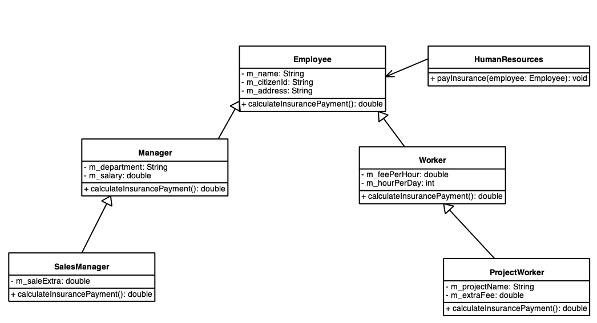
>Burada `Employee` türünden doğrudan nesne yaratılmasının pratikte bir anlamı yoktur. Bu sınıf bu hiyerarşide çalışan kavramını (dolayısıyla ortak özelliklerini) temsil etmektedir. Bu sınıftan türetilmiş olan sınıfların doğrudan yaratılmış nesneler olarak anlamı vardır. Yani, Employee türünden nesne türemiş sınıf içerisinde (nesnesel kapsama) anlamlıdır. Ayrıca Employee sınıfının, bir çalışanın sigorta ödeme miktarını veren `calculateInsurancePayment` metodunun gövdesi yani kodları anlamsızdır ancak bu metodun sanal olarak var olması gerekir. Çünkü `HumanResource` sınıfının `payInsurance` metodu içerisinde sanal olarak çağrılaması gerekir. Türemiş sınıflarda bu metot override edilerek `payInsurance` metodu içerisinde çağrılmış olur. İşte böylesi gövdesi olması gerekmeyen (ya da gövdesi olması anlamsız) sanal metotlara **soyut metotlar (abstract methods)** denir. Doğrudan nesne özelliği göstermeyen sınıflara **soyut sınıflar (abstract sınıflar)** denir. Doğrudan nesne özelliği gösteren sınıflara ise **somut sınıflar (concrete classes)** denir. Buradaki hiyerarşiye ilişkin demo uygulamanın kodları bölüm sonunda `DemoCompanyApp` olarak incelenebilir.
>
>Programcı soyut bir sınıf gördüğünde şunu anlamalıdır: **Bu sınıf bir kavramı soyut olarak temsil ediyor, bu türünden bir nesne doğrudan yaratılamaz, çünkü anlamsız. Bu sınıftan türetilen sınıflar olmalı ya da yazmalıyım ve muhtemel bulunan abstract metotları (hatta belki de abstract olmayan sanal metotları) override etmeliyim ki somut bir sınıf olsun.** Benzer şekilde programcı bir sınıf hiyerarşisi için soyut bir kavramı temsil eden sınıfı `abstract` olarak düşünmelidir.
>
>abstract bir sınıf `abstract` anahtar sözcüğü ile bildirilir. Bir metot abstract olarak bildirildiğinde metoda gövde yazılmaz. Yazılması error oluşturur. Bir sınıfın en az bir tane abstract metodu varsa sınıfı abstract olarak bildirilmelidir. Aksi durumda error oluşur. abstract bir sınıfın abstract bir metodu olmak zorunda değildir. Bu durumda en az bir tane abstract metodu olan bir sınıf `concrete` olamaz. abstract bir sınıfın da veri elemanları olabilir. abstract bir sınıf türünden nesne new operatörü ile yaratılamaz. abstract bir sınıf türünden nesne türemiş sınıf nesnesi içerisinde yaratılır. abstract bir sınıfın ctor'u olabilir. abstract bir sınıfın ctor'unun public yapılmasının bir anlamı yoktur, protected olarak bildirilmesi daha uygundur. Çünkü zaten abstract türünden bir nesne sınıf dışından yaratılamaz. Şüphesiz duruma göre private ya da no-modifier ctor'lar da olabilir.

```java
package org.csystem.app;  
  
class App {  
    public static void main(String[] args)  
    {  
        A a = new A(); //error  
    }  
}  
  
abstract class D {  
    public void bar()  
    {  
        //...  
    }  
}  
  
abstract class C {  
    public abstract void foo(int x) //error  
    {  
  
    }  
  
    public void bar()  
    {  
        //...  
    }  
}  
  
class B { //error  
    public abstract void foo(int x);  
  
    public void bar()  
    {  
        //...  
    }  
}  
  
class Z extends A { //error  
	//...
}  
  
  
abstract class Y extends A {  
	//...
}  
  
class X extends A {  
    public X()  
    {  
  
    }  
  
    public X(int a)  
    {  
        super(a);  
    }  
  
    public void foo(int x)  
    {  
        //...  
    }  
}  
  
abstract class A {  
    private int m_x;  
  
    protected A()  
    {  
    }  
  
    protected A(int x)  
    {  
        m_x = x;  
    }  
  
    public abstract void foo(int x);  
  
    public void bar()  
    {  
        //...  
    }  
}
```


##### 18 Mart 2025

>Aşağıda sınıf şeması verilen demo örneğin kodlarını inceleyiniz


```java
package org.csystem.app.company;  
  
import org.csystem.util.thread.ThreadUtil;  
  
import java.util.Random;  
  
public class DemoCompanyApp {  
    private static Manager getManager()  
    {  
        return new Manager("Kaan Aslan", "12345678945", "Mecidiyeköy", "Yazılım", 300000);  
    }  
  
    private static Worker getWorker()  
    {  
        return new Worker("Güray Sönmez", "12345789321", "Bodrum", 400, 8);  
    }  
  
    private static ProjectWorker getProjectWorker()  
    {  
        return new ProjectWorker("Lokman Köse", "23456789233", "Çağlayan", 200, 8, "Dernek", 2000);  
    }  
  
    private static SalesManager getSalesManager()  
    {  
        return new SalesManager("Ali Serçe", "34567892345", "Geyikli", "Pazarlama", 400000, 30000);  
    }  
  
    private static Employee getEmployee(Random random)  
    {  
        return switch (random.nextInt(4)) {  
            case 0 -> getWorker();  
            case 1 -> getProjectWorker();  
            case 2 -> getSalesManager();  
            default -> getManager();  
        };  
    }  
  
  
    public static void run()  
    {  
        Random random = new Random();  
        HumanResources humanResources = new HumanResources();  
  
        while (true) {  
            Employee employee = getEmployee(random);  
  
            humanResources.payInsurance(employee);  
            ThreadUtil.sleep(1000);  
        }  
    }  
  
    public static void main(String[] args)  
    {  
        run();  
    }  
}
```

```java
package org.csystem.app.company;  
  
public abstract class Employee {  
    private String m_name;  
    private String m_citizenId;  
    private String m_address;  
    //...  
  
    protected Employee(String name, String citizenId, String address)  
    {  
        //...  
        m_name = name;  
        m_citizenId = citizenId;  
        m_address = address;  
    }  
  
    public String getName()  
    {  
        return m_name;  
    }  
  
    public void setName(String name)  
    {  
        //...  
        m_name = name;  
    }  
  
    public String getCitizenId()  
    {  
        return m_citizenId;  
    }  
  
    public void setCitizenId(String citizenId)  
    {  
        //...  
        m_citizenId = citizenId;  
    }  
  
    public String getAddress()  
    {  
        return m_address;  
    }  
  
    public void setAddress(String address)  
    {  
        //...  
        m_address = address;  
    }  
  
    public abstract double calculateInsurancePayment();  
  
    //...  
}
```


```java
package org.csystem.app.company;  
  
import org.csystem.util.console.Console;  
  
public class HumanResources {  
    //...  
  
    public void payInsurance(Employee employee)  
    {  
        Console.writeLine("--------------------------------------------------------");  
        Console.writeLine("Name:%s", employee.getName());  
        Console.writeLine("CitizenId:%s", employee.getCitizenId());  
        Console.writeLine("Insurance payment:%f", employee.calculateInsurancePayment());  
        Console.writeLine("--------------------------------------------------------");  
    }  
}
```


```java
package org.csystem.app.company;  
  
public class Manager extends Employee {  
    private String m_department;  
    private double m_salary;  
  
    public Manager(String name, String citizenId, String address, String department, double salary)  
    {  
        super(name, citizenId, address);  
        m_department = department;  
        m_salary = salary;  
    }  
  
    public String getDepartment()  
    {  
        return m_department;  
    }  
  
    public void setDepartment(String department)  
    {  
        //...  
        m_department = department;  
    }  
  
    public double getSalary()  
    {  
        return m_salary;  
    }  
  
    public void setSalary(double salary)  
    {  
        //...  
        m_salary = salary;  
    }  
  
    public double calculateInsurancePayment()  
    {  
        return m_salary * 1.5;  
    }  
}
```


```java
package org.csystem.app.company;  
  
public class Worker extends Employee{  
    private double m_feePerHour;  
    private int m_hourPerDay;  
  
    public Worker(String name, String citizenId, String address, double feePerHour, int hourPerDay)  
    {  
        super(name, citizenId, address);  
        m_feePerHour = feePerHour;  
        m_hourPerDay = hourPerDay;  
    }  
  
    public double getFeePerHour()  
    {  
        return m_feePerHour;  
    }  
  
    public void setFeePerHour(double feePerHour)  
    {  
        m_feePerHour = feePerHour;  
    }  
  
    public int getHourPerDay()  
    {  
        return m_hourPerDay;  
    }  
  
    public void setHourPerDay(int hourPerDay)  
    {  
        m_hourPerDay = hourPerDay;  
    }  
  
    public double calculateInsurancePayment()  
    {  
        return m_feePerHour * m_hourPerDay * 30;  
    }  
  
    //...  
}
```


```java
package org.csystem.app.company;  
  
public class ProjectWorker extends Worker {  
    private String m_projectName;  
    private double m_extraFee;  
  
    public ProjectWorker(String name, String citizenId, String address, double feePerHour, int hourPerDay, String projectName, double extraFee)  
    {  
        super(name, citizenId, address, feePerHour, hourPerDay);  
        m_projectName = projectName;  
        m_extraFee = extraFee;  
    }  
  
    public String getProjectName()  
    {  
        return m_projectName;  
    }  
  
    public void setProjectName(String projectName)  
    {  
        m_projectName = projectName;  
    }  
  
    public double getExtraFee()  
    {  
        return m_extraFee;  
    }  
  
    public void setExtraFee(double extraFee)  
    {  
        m_extraFee = extraFee;  
    }  
  
    public double calculateInsurancePayment()  
    {  
        return super.calculateInsurancePayment() + m_extraFee * 30;  
    }  
}
```


```java
package org.csystem.app.company;  
  
public class SalesManager extends Manager {  
    private double m_saleExtra;  
  
    public SalesManager(String name, String citizenId, String address, String department, double salary, double saleExtra)  
    {  
        super(name, citizenId, address, department, salary);  
        m_saleExtra = saleExtra;  
    }  
  
    public double getSaleExtra()  
    {  
        return m_saleExtra;  
    }  
  
    public void setSaleExtra(double saleExtra)  
    {  
        m_saleExtra = saleExtra;  
    }  
  
    //...  
}
```

##### final Metotlar

>Non-static bir metot final olarak bildirildiğinde artık türemiş sınıfta override edilemez. Yani final bir metot override işlemine kapatılmış bir metottur. Kendisi override edilmiş olabilir. Ait olduğu sınıftan türeyen bir sınıfta artık override edilemez. Şüphesiz abstract metotlar final olarak bildirilemez. 


```java
class C extends B {  
    public void foo() //error  
    {  
        Console.writeLine("B.foo");  
    }  
}  
  
class B extends A {  
    public final void foo()  
    {  
        Console.writeLine("B.foo");  
    }  
}  
  
class A {  
    public void foo()  
    {  
        Console.writeLine("A.foo");  
    }  
}
```


###### 28 Mart 2025

##### Sınıfın static ve non-static initializer Elemanları

>Sınıf içerisinde tüm metotların dışında static anahtar sözcüğü ile yazılan bloklara **static initializer**, static anahtar sözcüğü kullanılmadan yazılan bloklara ise **non-static initializer** elemanları denir. Sınıfın initializer (static ve non-static) elemanları istenildiği kadar yazılabilir. Ancak pratikte yazılacaksa 1 tane olacak şekilde yazılır. Sınıfın static initializer'ı, sınıfın bir elemanı ilk kez kullanıldığında ve bir kez olmak üzere çalıştırılır. Eğer static initializer birden fazla ise yazılma sırasında yukarıdan aşağıya olacak şekilde çalıştırılır. 


```java
package org.csystem.app;  
  
import org.csystem.util.console.Console;  
  
import java.util.Random;  
  
class App {  
    public static void main(String[] args)  
    {  
        Sample.foo();  
        Console.writeLine("-------------------------");  
        Sample.foo();  
    }  
}  
  
class Sample {  
    static {  
        Console.writeLine("static initializer1");  
    }  
  
    static {  
        Console.writeLine("static initializer3");  
    }  
  
    public Sample(int a)  
    {  
  
    }  
  
    static {  
        Console.writeLine("static initializer3");  
    }  
  
    public static void foo()  
    {  
        Console.writeLine("foo");  
    }  
}
```

>Anımsanacağı gibi sınıfın static initializer'ı içerisinde static ve final veri elemanına değer verilebilir. Bu durumda static initializer tipik olarak toplamda bir kez yapılacak işlemler için kullanılır. Adından da anlaşıldığı gibi static initializer static metot gibidir. Yani sınıfın non-static elemanlarına static initializer içerisinde doğrudan erişilemez. static bir veri elemanına static initializer içerisinde değer vermenin bildirim noktasında değer vermekten teknik olarak farkı yoktur. Ancak static initializer bir akış belirtir:

```java
package org.csystem.app;  
  
import org.csystem.util.console.Console;  
  
import java.util.Random;  
  
class App {  
    public static void main(String[] args)  
    {  
        Console.writeLine("Value:%d", Sample.getValue());  
        Console.writeLine("Value:%d", Sample.getValue());  
    }  
}  
  
class Sample {  
    private static final int VALUE;  
  
    static {  
        Console.writeLine("static initializer");  
        Random random = new Random();  
  
        VALUE = random.nextInt(100);  
    }
  
   public static int getValue()  
   {  
       return VALUE;  
   }  
  
    public static void foo()  
    {  
        Console.writeLine("foo");  
    }  
}
```

>Şüphesiz bu örnek aşağıdaki gibi bir metot yazılarak ve metodun geri dönüş değeri VALUE veri elemanına ilk değer olarak verilebilir:

```java
package org.csystem.app;  
  
import org.csystem.util.console.Console;  
  
import java.util.Random;  
  
class App {  
    public static void main(String[] args)  
    {  
        Console.writeLine("Value:%d", Sample.getValue());  
        Console.writeLine("Value:%d", Sample.getValue());  
    }  
}  
  
class Sample {  
    private static final int VALUE = randomInValue();  
  
    private static int randomInValue()  
    {  
        Console.writeLine("static initializer");  
        Random random = new Random();  
  
        return random.nextInt(100);  
    }  
  
   public static int getValue()  
   {  
       return VALUE;  
   }  
  
    public static void foo()  
    {  
        Console.writeLine("foo");  
    }  
}
```


>Sınıfın static initializer elemanı bazı durumlarda kodun daha derli toplu yazılabilmesi amacıyla programcı tarafından tercih edilebilir:

```java
package org.csystem.util.string;  
  
import java.util.ArrayList;  
import java.util.Random;  
  
public final class StringUtil {  
    private StringUtil()  
    {  
    }  
  
    private static final String LETTERS_EN;  
    private static final String LETTERS_TR;  
    private static final String CAPITAL_LETTERS_EN;  
    private static final String CAPITAL_LETTERS_TR;  
    private static final String ALL_LETTERS_EN;  
    private static final String ALL_LETTERS_TR;  
  
    static {  
       LETTERS_EN = "abcdefghijklmnopqrstuvwxyz";  
       LETTERS_TR = "abcçdefgğhıijklmnoöprsştuüvyz";  
       CAPITAL_LETTERS_EN = "ABCDEFGHIJKLMNOPQRSTUVWXYZ";  
       CAPITAL_LETTERS_TR = "ABCÇDEFGĞHIİJKLMNOÖPRSŞTUÜVYZ";  
       ALL_LETTERS_EN = LETTERS_EN + CAPITAL_LETTERS_EN;  
       ALL_LETTERS_TR = LETTERS_TR + CAPITAL_LETTERS_TR;  
    }  
  
    public static String capitalize(String s)  
    {  
       return s.isEmpty() ? s : Character.toUpperCase(s.charAt(0)) + s.substring(1).toLowerCase();  
    }  
  
    public static String changeCase(String s)  
    {  
       StringBuilder sb = new StringBuilder(s);  
  
       for (int i = 0; i < s.length(); ++i) {  
          char c = s.charAt(i);  
  
          sb.setCharAt(i, Character.isLowerCase(c) ? Character.toUpperCase(c) : Character.toLowerCase(c));  
       }  
  
       return sb.toString();  
    }  
  
  
    public static int countString(String s1, String s2)  
    {  
       int count = 0;  
  
       for (int i = 0; (i = s1.indexOf(s2, i)) != -1; ++i, ++count)  
          ;  
  
       return count;  
    }  
  
    public static String generateRandomText(Random random, int count, String sourceText)  
    {  
       char [] c = new char[count];  
  
       for (int i = 0; i < count; ++i)  
          c[i] = sourceText.charAt(random.nextInt(sourceText.length()));  
  
       return String.valueOf(c);  
    }  
  
    public static String generateRandomTextEN(Random random, int count)  
    {  
       return generateRandomText(random, count, ALL_LETTERS_EN);  
    }  
  
    public static String generateRandomTextTR(Random random, int count)  
    {  
       return generateRandomText(random, count, ALL_LETTERS_TR);  
    }  
  
    public static String [] generateRandomTexts(Random random, int count, int origin, int bound, String sourceText)  
    {  
       String [] str = new String[count];  
  
       for (int i = 0; i < count; ++i)  
          str[i] = generateRandomText(random, random.nextInt(origin, bound), sourceText);  
  
       return str;  
    }  
  
    public static String [] generateRandomTextsEN(Random random, int count, int origin, int bound)  
    {  
       return generateRandomTexts(random, count, origin, bound, ALL_LETTERS_EN);  
    }  
  
    public static String [] generateRandomTextsTR(Random random, int count, int origin, int bound)  
    {  
       return generateRandomTexts(random, count, origin, bound, ALL_LETTERS_TR);  
    }  
  
    public static boolean isPalindrome(String s)  
    {  
       int left = 0;  
       int right = s.length() - 1;  
  
       while (left < right) {  
          char cLeft = s.charAt(left);  
  
          if (!Character.isLetter(cLeft)) {  
             ++left;  
             continue;  
          }  
  
          char cRight = s.charAt(right);  
  
          if (!Character.isLetter(cRight)) {  
             --right;  
             continue;  
          }  
  
          if (Character.toLowerCase(cLeft) != Character.toLowerCase(cRight))  
             return false;  
  
          ++left;  
          --right;  
       }  
  
       return true;  
    }  
  
  
    public static boolean isPangram(String s, String alphabet)  
    {  
       for (int i = 0; i < alphabet.length(); ++i)  
          if (s.indexOf(alphabet.charAt(i)) == -1)  
             return false;  
  
       return true;  
    }  
  
  
    public static boolean isPangramEN(String s)  
    {  
       return isPangram(s.toLowerCase(), LETTERS_EN);  
    }  
  
    public static boolean isPangramTR(String s)  
    {  
       return isPangram(s.toLowerCase(), LETTERS_TR);  
    }  
  
  
    public static String join(ArrayList texts, String delimiter)  
    {  
       StringBuilder sb = new StringBuilder();  
  
       for (Object o : texts) {  
          String s = (String)o;  
  
          sb.append(s).append(delimiter);  
       }  
  
       return sb.substring(0, sb.length() - delimiter.length());  
    }  
  
    public static String join(ArrayList texts, char delimiter)  
    {  
       return join(texts, String.valueOf(delimiter));  
    }  
  
    public static String join(String [] s, String delimiter)  
    {  
       StringBuilder sb = new StringBuilder();  
  
       for (String str : s)  
          sb.append(str).append(delimiter);  
  
       return sb.substring(0, sb.length() - delimiter.length());  
    }  
  
    public static String join(String [] s, char delimiter)  
    {  
       return join(s, String.valueOf(delimiter));  
    }  
  
    public static String padLeading(String s, int n, char ch)  
    {  
       int len = s.length();  
  
       return len < n ? String.valueOf(ch).repeat(n - len) + s : s;  
    }  
  
    public static String padLeading(String s, int n)  
    {  
       return padLeading(s, n, ' ');  
    }  
  
    public static String padTrailing(String s, int n, char ch)  
    {  
       int len = s.length();  
  
       return len < n ? s + String.valueOf(ch).repeat(n - len) : s;  
    }  
  
    public static String padTrailing(String s, int n)  
    {  
       return padTrailing(s, n, ' ');  
    }  
  
    public static String reverse(String s)  
    {  
       return new StringBuilder(s).reverse().toString();  
    }  
  
    public static String [] split(String s, String delimiters)  
    {  
       return split(s, delimiters, true);  
    }  
  
    public static String [] split(String s, String delimiters, boolean removeEmptyEntries)  
    {  
       StringBuilder pattern = new StringBuilder("[");  
  
       for (int i = 0; i < delimiters.length(); ++i) {  
          char c = delimiters.charAt(i);  
  
          if (c == '[' || c == ']')  
             pattern.append('\\');  
  
          pattern.append(c);  
       }  
  
       pattern.append(']');  
  
       if (removeEmptyEntries)  
          pattern.append("+");  
  
       return s.split(pattern.toString());  
    }  
}
```

```java
package org.csystem.util.numeric;  
  
public final class NumberUtil {  
    private NumberUtil()  
    {  
    }  
  
    private static final String ZERO_TR;  
    private static final String MINUS_TR;  
    private static final String [] ONES_TR;  
    private static final String [] TENS_TR;  
    private static final String [] NUMBER_UNITS_TR;  
      
    private static final String ZERO_EN;  
    private static final String MINUS_EN;  
    private static final String [] ONES_EN;  
    private static final String [] TENS_EN;  
    private static final String [] NUMBER_UNITS_EN;  
  
    static {  
       ZERO_TR = "sıfır";  
       MINUS_TR = "eksi";  
       ONES_TR = new String[]{"", "bir", "iki", "üç", "dört", "beş", "altı", "yedi", "sekiz", "dokuz"};  
       TENS_TR = new String[]{"", "on", "yirmi", "otuz", "kırk", "elli", "altmış", "yetmiş", "seksen", "doksan"};  
       NUMBER_UNITS_TR = new String[]{"kentilyon", "katrilyon", "trilyon", "milyar", "milyon", "bin", ""};  
  
       ZERO_EN = "zero";  
       MINUS_EN= "minus";  
       ONES_EN = new String[]{"", "one", "two", "three", "four", "five", "six", "seven", "eight", "nine"};  
       TENS_EN = new String[] {"", "ten", "twenty", "thirty", "forty", "fifty", "sixty", "seventy", "eighty", "ninety"};  
       NUMBER_UNITS_EN = new String[] {"quintillion", "quadrillion", "trillion", "billion", "million", "thousand", ""};  
    }  
  
    private static int [] getDigits(long a, int n)  
    {  
        int divider = (int)Math.pow(10, n);  
       a = Math.abs(a);  
        int [] digits = new int[a == 0 ? 1 : (int)(Math.log10(a) / n) + 1];  
  
        for (int i = digits.length - 1; i >= 0; digits[i--] = (int)(a % divider), a /= divider)  
            ;  
  
        return digits;  
    }  
  
    private static String numToStr3DigitsTR(int val)  
    {  
       StringBuilder sb = new StringBuilder();  
  
       int a = val / 100;  
       int b = val / 10 % 10;  
       int c = val % 10;  
  
       if (a != 0) {  
          if (a != 1)  
             sb.append(ONES_TR[a]).append(" ");  
          sb.append("yüz ");  
       }  
  
       if (b != 0)  
          sb.append(TENS_TR[b]).append(" ");  
  
       if (c != 0)  
          sb.append(ONES_TR[c]).append(" ");  
  
       return sb.isEmpty() ? "" : sb.substring(0, sb.length() - 1);  
    }  
  
    private static String numToStr3DigitsEN(int val)  
    {  
       StringBuilder sb = new StringBuilder();  
  
       int a = val / 100;  
       int b = val / 10 % 10;  
       int c = val % 10;  
  
       if (a != 0)  
          sb.append(ONES_EN[a]).append(" ").append("hundred ");  
  
       if (b != 0)  
          sb.append(TENS_EN[b]).append(" ");  
  
       if (c != 0)  
          sb.append(ONES_EN[c]).append(" ");  
  
       return sb.isEmpty() ? "" : sb.substring(0, sb.length() - 1);  
    }  
  
    public static int countDigits(long a)  
    {  
       return a != 0 ? (int)Math.log10(Math.abs(a)) + 1 : 1;  
    }  
  
    public static long factorial(int n)  
    {  
       long result = 1;  
  
       for (long i = 2; i <= n; ++i)  
          result *= i;  
  
       return result;  
    }  
  
    public static int fibonacciNumber(int n)  
    {  
       if (n <= 2)  
          return n - 1;  
  
       int prev1 = 1, prev2 = 0, result = prev1 + prev2;  
  
       for (int i = 3; i < n; ++i) {  
          prev2 = prev1;  
          prev1 = result;  
          result = prev1 + prev2;  
       }  
  
       return result;  
    }  
  
    public static int [] getDigits(long a)  
    {  
       return getDigits(a, 1);  
    }  
  
    public static int [] getDigitsInThrees(long a)  
    {  
        return getDigits(a, 3);  
    }  
  
    public static int [] getDigitsInTwos(long a)  
    {  
        return getDigits(a, 2);  
    }  
  
    public static int getDigitsPowSum(int a)  
    {  
       int result = 0;  
       int n = countDigits(a);  
  
       while (a != 0) {  
          result += (int)Math.pow(a % 10, n);  
          a /= 10;  
       }  
  
       return result;  
    }  
  
    public static boolean isArmstrong(int a)  
    {  
       return a >= 0 && getDigitsPowSum(a) == a;  
    }  
  
    public static boolean isEven(int a)  
    {  
       return a % 2 == 0;  
    }  
  
    public static boolean isOdd(int a)  
    {  
       return !isEven(a);  
    }  
  
    public static boolean isPrime(long a)  
    {  
       if (a <= 1)  
          return false;  
  
       if (a % 2 == 0)  
          return a == 2;  
  
       if (a % 3 == 0)  
          return a == 3;  
  
       if (a % 5 == 0)  
          return a == 5;  
  
       if (a % 7 == 0)  
          return a == 7;  
  
       for (long i = 11; i * i <= a; i += 2)  
          if (a % i == 0)  
             return false;  
  
       return true;  
    }  
  
    public static long nextClosestPrime(long a)  
    {  
       if (a < 2)  
          return 2;  
  
       while (!isPrime(++a))  
          ;  
  
       return a;  
    }  
  
    public static int nextFibonacciNumber(int val)  
    {  
       if (val < 0)  
          return 0;  
  
       int prev1 = 1, prev2 = 0, next = prev1 + prev2;  
  
       while (next <= val) {  
          prev2 = prev1;  
          prev1 = next;  
          next = prev1 + prev2;  
       }  
  
       return next;  
    }  
  
    public static long nthPrime(int n)  
    {  
       long result = 2;  
       int count = 0;  
  
       for (long i = 2; count < n; ++i)  
          if (isPrime(i)) {  
             ++count;  
             result = i;  
          }  
       return result;  
    }  
  
    public static String numToStrTR(long a)  
    {  
       if (a == 0)  
          return ZERO_TR;  
  
       int [] threes = getDigitsInThrees(a);  
       StringBuilder sb = new StringBuilder();  
       int idx = NUMBER_UNITS_TR.length - 1;  
  
       for (int i = threes.length - 1; i >= 0; --i) {  
          if (threes[i] != 0)  
             sb.insert(0, "%s%s ".formatted(idx == NUMBER_UNITS_TR.length - 2 && threes[i] == 1 ? "" : numToStr3DigitsTR(threes[i]) + " ", NUMBER_UNITS_TR[idx]));  
  
          --idx;  
       }  
  
       return "%s%s".formatted(a < 0 ? MINUS_TR + " " : "", sb.substring(0, sb.length() - 2));  
    }  
  
    public static String numToStrEN(long a)  
    {  
       if (a == 0)  
          return ZERO_EN;  
  
       int [] threes = getDigitsInThrees(a);  
       StringBuilder sb = new StringBuilder();  
       int idx = NUMBER_UNITS_EN.length - 1;  
  
       for (int i = threes.length - 1; i >= 0; --i) {  
          if (threes[i] != 0)  
             sb.insert(0, "%s %s ".formatted(numToStr3DigitsEN(threes[i]), NUMBER_UNITS_EN[idx]));  
  
          --idx;  
       }  
  
       return "%s%s".formatted(a < 0 ? MINUS_EN + " " : "", sb.substring(0, sb.length() - 2));  
    }  
  
    public static int reverse(int val)  
    {  
       int result = 0;  
  
       while (val != 0) {  
          result = result * 10 + val % 10;  
          val /= 10;  
       }  
  
       return result;  
    }  
  
    public static int sumDigits(int val)  
    {  
       int total = 0;  
  
       while (val != 0) {  
          total += val % 10;  
          val /= 10;  
       }  
  
       return Math.abs(total);  
    }  
}
```

>Sınıfın non-static initializer'ı sınıfın bir ctor'undan önce çağrılır. Yani, non-static initializer kodları adeta derleyici tarafından her bir ctor'un başına gizlice yerleştirilir. Eğer non-static initializer birden fazla ise yine yukarıdan aşağıya yazılma sırasıyla çağrılır. Pratikte 1 tanesi yeterli olur. non-static initializer static initializer'dan daha az kullanılır. non-static initializer non-static metot gibidir. Yani sınıfın tüm elemanlarına doğrudan erişilebilir.

```java
package org.csystem.app;  
  
import org.csystem.util.console.Console;  
  
class App {  
    public static void main(String[] args)  
    {  
        Sample s1 = new Sample();  
        Console.writeLine("-------------------------------------");  
        Sample s2 = new Sample(10);  
    }  
}  
  
class Sample {  
    {  
        Console.writeLine("static initializer1");  
    }  
  
    public Sample()  
    {  
        Console.writeLine("I am a default ctor");  
    }  
  
    public Sample(int a)  
    {  
        Console.writeLine("I am a ctor with parameter type int");  
    }  
  
    {  
        Console.writeLine("static initializer2");  
    }  
      
    {  
        Console.writeLine("static initializer3");  
    }  
}
```

>Aşağıdaki demo örneği inceleyiniz

```java
package org.csystem.app;  
  
import org.csystem.util.console.Console;  
  
class App {  
    public static void main(String[] args)  
    {  
        Sample s2 = new Sample(10);  
    }  
}  
  
class Sample {  
    {  
        Console.writeLine("non-static initializer");  
    }  
  
    public Sample()  
    {  
        Console.writeLine("I am a default ctor");  
    }  
  
    public Sample(int a)  
    {  
        this();  
        Console.writeLine("I am a ctor with parameter type int");  
    }  
}
```

###### 3 Nisan 2025
##### Exception İşlemleri

>Anımsanacağı gibi programın çalışma zamanında oluşan, genel olarak hatalı durumlara **exception** veya **runtime error** denir. Bir exception oluştuğunda akışın oluşan exception'a göre yönlendirilmesine **exception handling** denir. Exception mekanizmasının sağladığı avantajlar şunlardır:
>- Programın daha az kontrollü bir biçimde oluşturulmasını sağlamak ve okunabilirliği artırmak.
>- Kod ile hata ele alımını biribirinden ayırmak.
>- Tam bir hata kontrolü sağlamak.
>- İç içe metot çağırmalarında iç metotta oluşan hataların daha kolay ele alınmasını sağlamak.
>- Bir hata oluştuğunda hatanın nedenini de hatayı ele alacak kişiye bildirmek.
>
>Örneğin, konum bilgisi veren bir uygulamanın, konum bilgisi elde edilemediğinde oluşan exception'a göre kullanıcıyı bilgilendirmesi exception handling yapılarak gerçekleştirilebilir. 
>
>Java'da exception işlemleri 5 tane anahtar sözcük ile gerçekleştirilir: **throw, try, catch, finally, throws.**
>
>Akış içerisinde bir exception oluşturulması (fırlatılması) için **throw deyimi (throw statement)** kullanılır. throw deyiminin genel biçimi şu şekildedir:

```java
throw <referans>;
```

>Burada referansa ilişkin sınıfın **Throwable** sınıfından doğrudan ya da dolaylı olarak türetilmiş bir sınıf türünden olması gerekir. Aksi durumda error oluşur. Java'da `Throwable`sınıfından doğrudan ya da dolaylı olarak türetilmiş olan sınıflara genel olarak **exception sınıfları (exception classes)** ya da **throwable classes** denilmektedir. Throwable sınıfından **Exception** ve **Error** isimli iki sınıf türetilmiştir. Ayrıca `Exception`sınıfından **RuntimeException** isimli bir sınıf türetilmiştir. Bu 4 sınıf Java'da temel exception sınıflarıdır. Bu 4 sınıfın önemi ayrıca ele alınacaktır. Pratikte `Throwable`sınıfından doğrudan türetme yapılmaz. Türetme tipik olarak, doğrudan ya da dolaylı olarak ya `Exception` sınıfından, ya `RuntimeException` sınıfından ya da `Error` sınıfından yapılır. Bu 4 tane sınıfa ilişkin sınıf şemasının genel biçimi aşağıdaki gibidir:

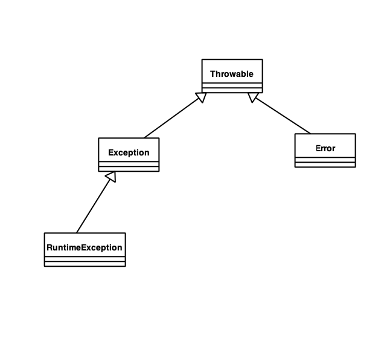
**Anahtar Notlar:** Exception ve RuntimeException sınıflarından doğrudan ya da dolaylı olarak türetilen sınıfların isimlendirmesinde bir convention olarak **Exception** kelimesi son kelime olarak kullanılır, Error sınıfından doğrudan ya da dolaylı olarak türetilen sınıfların isimlendirmesinde bir convention olarak **Error** kelimesi son kelime olarak kullanılır. Programcı da kendi exception sınıfları için bu convention'a uymalıdır.

>Aşağıdaki demo örnekte NegativeException sınıfı Throwable sınıfından doğrudan ya da dolaylı olarak türetilmediği için yani bir exception olmadığı için error oluşur. 

```java
class MathUtil {  
    private static final double DELTA = 0.000001;  
    public static double log10(double a)  
    {  
        if (a < 0)  
            throw new NegativeException(); //error  
                //...  
    }  
}  
  
class NegativeException {  
    //...  
}
```

>Akış throw deyimine geldiğinde metodu terkeder. Bu terkediş return deyimi ya da void bir metottaki gibi metodun sonlaması biçiminde değildir. Yani metot normal bir biçimde sonlanmamıştır. 

>Aşağıdaki demo örneği çeşitli değerler ile çalıştırıp sonuçları gözlemleyiniz

```java
package org.csystem.app;  
  
import java.util.Scanner;  
  
class App {  
    public static void main(String[] args)  
    {  
        Scanner kb = new Scanner(System.in);  
  
        System.out.print("Input a number:");  
        double a = kb.nextInt();  
        double result;  
  
        result = MathUtil.log10(a);  
  
        System.out.printf("log10(%f) = %f%n", a, result);  
    }  
}  
  
class MathUtil {  
    public static double log10(double a)  
    {  
        if (a < 0)  
            throw new NegativeException();  
  
        if (a == 0)  
            throw new ZeroException();  
  
        return Math.log10(a);  
    }  
}  
  
class ZeroException extends RuntimeException {  
    //...  
}  
  
  
class NegativeException extends RuntimeException {  
    //...  
}
```

>Bir metodun hangi durumlarda hangi exception'ı fırlatacağı dokümantasyonundan anlaşılabilir. Bu ya açıkça belirtilir. Ya da akış içerisinde çağırdığı metoda ilişkin exception fırlattığına yönelik betimleme yapılır.
>
>Akış exception bakımından ele alınacaksa (handling) **try deyimi (try statement)** kodları içerisinde yazılmalıdır. try deyimi tek başına yazılamaz. try deyimine ilişkin bloğu bir **catch bloğu ya da blokları** VEYA **catch bloğu ya da blokları ile bir finally bloğu** VEYA **yalnızca bir final bloğu** takip etmelidir. try deyimi takip eden blokları ile birlikte tek bir deyimdir. Takip eden bloklar ile try bloğu arasında başka bir deyim yazılamaz. 
>
>catch bloğu parantezi içerisinde bir referans değişken bildirimi yapılır. Bu referansa **catch parametresi (catch parameter)** da denilmektedir. Bu parametrenin türü bir exception sınıfı türünden olmalıdır. Aksi durumda error oluşur. catch parametre değişkenin faaliyet alanı bildirildiği catch bloğu kadardır. catch parametre değişkeni catch bloğu içerisinde kullanılmayacaksa tipik olarak `ignore` yada `ignored` gibi isimler verilerek bildirilir. Hatta bazı static kod analizi araçları bu tip isimler verilmezse default olarak uyarı mesajı verirler. 
>
>try bloğu içerisinde bir exception fırlatıldığında akış try bloğunu bir daha geri dönmemek üzere (non-resumptive)  terkeder. Bu durumda try deyimine ilişkin ilk catch bloğuna akış dallanır. catch blokları yukarıdan aşağıya ilk uygun catch bloğu bulununcaya kadar taranır. Uygun catch bloğu bulunursa çalıştırılır ve tüm diğer catch blokları atlanarak akış devam eder. Uygun catch bloğu fırlatılan exception nesnesine ilişkin referansın atanabildiği parametre türüne sahip ilk catch bloğudur. Bu durumda ya fırlatılan exception sınıfı ile aynı türden veya onun doğrudan ya da dolaylı taban sınıfı türünden (bu durumda upcasting olur) parametre türüne sahip ilk catch bloğudur. Uygun catch bloğu hiç bulunamazsa akış (thread) `abnormal` bir biçimde sonlanır. 

>Aşağıdaki demo örneği çeşitli değerler ile çalıştırıp sonuçları gözlemleyiniz.

```java
package org.csystem.app;  
  
import java.util.Scanner;  
  
class App {  
    public static void main(String[] args)  
    {  
        try {  
            Scanner kb = new Scanner(System.in);  
  
            System.out.print("Input a number:");  
            double a = kb.nextInt();  
            double result;  
            result = MathUtil.log10(a);  
  
            System.out.printf("log10(%f) = %f%n", a, result);  
        }  
        catch (ZeroException ignore) {  
            System.out.println("Zero value is invalid for logarithm");  
        }  
        catch (NegativeException ignore) {  
            System.out.println("Negative value is invalid for logarithm");  
        }  
  
        System.out.println("main ends!...");  
    }  
}  
  
class MathUtil {  
    public static double log10(double a)  
    {  
        if (a < 0)  
            throw new NegativeException();  
  
        if (a == 0)  
            throw new ZeroException();  
  
        return Math.log10(a);  
    }  
}  
  
class ZeroException extends RuntimeException {  
    //...  
}  
  
  
class NegativeException extends RuntimeException {  
    //...  
}
```


>Aşağıdaki demo örneği çeşitli değerler ile çalıştırıp sonuçları gözlemleyiniz. Örnekte `ZeroException` ve `NegativeException` fırlatıldığında taban sınıf parametreli catch bloğu ile yakalandığına dikkat ediniz

```java
package org.csystem.app;  
  
import java.util.InputMismatchException;  
import java.util.Scanner;  
  
class App {  
    public static void main(String[] args)  
    {  
        try {  
            Scanner kb = new Scanner(System.in);  
  
            System.out.print("Input a number:");  
            double a = kb.nextInt();  
            double result;  
            result = MathUtil.log10(a);  
  
            System.out.printf("log10(%f) = %f%n", a, result);  
        }  
        catch (MathException ignore) {  
            System.out.println("Invalid input for logarithm");  
        }  
        catch (InputMismatchException ignore) {  
            System.out.println("Invalid number");  
        }  
  
        System.out.println("main ends!...");  
    }  
}  
  
class MathUtil {  
    public static double log10(double a)  
    {  
        if (a < 0)  
            throw new NegativeException();  
  
        if (a == 0)  
            throw new ZeroException();  
  
        return Math.log10(a);  
    }  
}  
  
class ZeroException extends MathException {  
    //...  
}  
  
  
class NegativeException extends MathException {  
    //...  
}  
  
class MathException extends RuntimeException {  
    //...  
}
```

###### 8 Nisan 2025

>Taban sınıf parametreli catch bloğu ile türemiş sınıf parametreli catch bloğu aynı try deyiminde bulunacaksa, catch bloklarına yukarıdan aşağıya doğru bakıldığı için türemiş sınıf parametreli catch bloğunun taban sınıf parametreli catch bloğundan sonra olmasının bir anlamı olmayacaktır. Bu durumda derleyici error verecektir. Türemiş sınıf parametreli catch bloğunun taban sınıf parametreli catch bloğundan önce yazılması gerekir. Tüm exception sınıfları doğrudan ya da dolaylı olarak `Throwable` sınıfından türetilmiş olduğuna göre Throwable parametreli catch bloğu ile tüm exception'lar yakalanabilir. Bu durumda birden fazla catch bloğu varsa, Throwable parametreli catch bloğu en son catch bloğu olarak o try deyiminde yazımalıdır. Aralarında türetme ilişkisi olmayan sınıflar türünden parametreli catch blokları bir try deyiminde istenildiği sırada yazılabilir.

>Aşağıdaki demo örnekte ZeroException zaten MathException parametreli catch bloğu ile yakalanabileceğinden error oluşur

```java
package org.csystem.app;  
  
import java.util.InputMismatchException;  
import java.util.Scanner;  
  
class App {  
    public static void main(String[] args)  
    {  
        try {  
            Scanner kb = new Scanner(System.in);  
  
            System.out.print("Input a number:");  
            double a = kb.nextInt();  
            double result;  
            result = MathUtil.log10(a);  
  
            System.out.printf("log10(%f) = %f%n", a, result);  
        }  
        catch (MathException ignore) {  
            System.out.println("Invalid input for logarithm");  
        }  
        catch (ZeroException ignore) { //error  
            System.out.println("Invalid input for logarithm");  
        }  
        catch (InputMismatchException ignore) {  
            System.out.println("Invalid number");  
        }  
  
        System.out.println("main ends!...");  
    }  
}  
  
class MathUtil {  
    public static double log10(double a)  
    {  
        if (a < 0)  
            throw new NegativeException();  
  
        if (a == 0)  
            throw new ZeroException();  
  
        return Math.log10(a);  
    }  
}  
  
class ZeroException extends MathException {  
    //...  
}  
  
  
class NegativeException extends MathException {  
    //...  
}  
  
class MathException extends RuntimeException {  
    //...  
}
```


>Yukarıdaki demo örnek aşağıdaki gibi yapılabilir

```java
package org.csystem.app;  
  
import java.util.InputMismatchException;  
import java.util.Scanner;  
  
class App {  
    public static void main(String[] args)  
    {  
        try {  
            Scanner kb = new Scanner(System.in);  
  
            System.out.print("Input a number:");  
            double a = kb.nextInt();  
            double result;  
            result = MathUtil.log10(a);  
  
            System.out.printf("log10(%f) = %f%n", a, result);  
        }  
        catch (ZeroException ignore) {  
            System.out.println("Zero not allowed");;  
        }  
        catch (MathException ignore) {  
            System.out.println("Invalid input for logarithm");  
        }  
        catch (InputMismatchException ignore) {  
            System.out.println("Invalid number");  
        }  
  
        System.out.println("main ends!...");  
    }  
}  
  
class MathUtil {  
    public static double log10(double a)  
    {  
        if (a < 0)  
            throw new NegativeException();  
  
        if (a == 0)  
            throw new ZeroException();  
  
        return Math.log10(a);  
    }  
}  
  
class ZeroException extends MathException {  
    //...  
}  
  
  
class NegativeException extends MathException {  
    //...  
}  
  
class MathException extends RuntimeException {  
    //...  
}
```

>Aşağıdaki demo örnekte Throwable parametreli catch bloğu ile NegativeException dışında kalan tüm exception'lar yakalanabilmektedir.

```java
package org.csystem.app;  
  
import java.util.Scanner;  
  
class App {  
    public static void main(String[] args)  
    {  
        try {  
            Scanner kb = new Scanner(System.in);  
  
            System.out.print("Input a number:");  
            double a = kb.nextInt();  
            double result;  
            result = MathUtil.log10(a);  
  
            System.out.printf("log10(%f) = %f%n", a, result);  
        }  
        catch (NegativeException ignore) {  
            System.out.println("Negative value not allowed");  
        }  
        catch (Throwable ignore) {  
            System.out.println("Exception occurred");  
        }  
  
        System.out.println("main ends!...");  
    }  
}  
  
class MathUtil {  
    public static double log10(double a)  
    {  
        if (a < 0)  
            throw new NegativeException();  
  
        if (a == 0)  
            throw new ZeroException();  
  
        return Math.log10(a);  
    }  
}  
  
class ZeroException extends MathException {  
    //...  
}  
  
  
class NegativeException extends MathException {  
    //...  
}  
  
class MathException extends RuntimeException {  
    //...  
}
```

>Bazen bir kod birden fazla try deyimi içerisinde olabilir. Bu durumda bir try deyimi başka bir try deyiminin try bloğu içerisinde yazılmış olur. Şüphesiz bu durum doğrudan programcı tarafından yazılmayabilir. Ancak programcının bir try bloğu içerisinde çağırdığı metot içerisinde de bir try deyimi olur. Bu durumda içteki try bloğunda bir exception oluştuğunda o try bloğuna ilişkin catch bloklarına bakılır. Uygun catch bloğu bulunursa akış normal bir biçimde yakalayan bloğu çalıştırılarak devam eder. Dıştaki try deyiminin catch bloklarına bakılmaz. Uygun catch bloğu bulunamazsa dıştaki try deyiminin catch bloklarına bakılır. Bu işlem uygun catch bloğu bulununcaya ya da hiç bulunamayıncaya kadar devam eder. Hiç bulunamazsa akış abnormal bir biçimde sonlanır.

>Aşağıdaki demo örneği çeşitli değerler ile çalıştırıp sonuçları gözlemleyiniz

```java
package org.csystem.app;  
  
import java.util.Scanner;  
  
class App {  
    public static void main(String[] args)  
    {  
        try {  
            Util.doWork();  
        }  
        catch (ZeroException ignore) {  
            System.out.println("Zero not allowed");;  
        }  
  
        System.out.println("main ends!...");  
    }  
}  
  
class Util {  
    public static void doWork()  
    {  
        try {  
            Scanner kb = new Scanner(System.in);  
  
            System.out.print("Input a number:");  
            double a = kb.nextInt();  
            double result;  
            result = MathUtil.log10(a);  
  
            System.out.printf("log10(%f) = %f%n", a, result);  
        }  
        catch (NegativeException ignore) {  
            System.out.println("Negative value not allowed");  
        }  
  
        System.out.println("doWork ends!...");  
    }  
}  
  
class MathUtil {  
    public static double log10(double a)  
    {  
        if (a < 0)  
            throw new NegativeException();  
  
        if (a == 0)  
            throw new ZeroException();  
  
        return Math.log10(a);  
    }  
}  
  
class ZeroException extends RuntimeException {  
    //...  
}  
  
  
class NegativeException extends RuntimeException {  
    //...  
}
```

>Yukarıdaki doWork metodu dökumante edilirken NegativeException fırlatıldığını ve yakalandığını belirtmek durumunda değildir. Ancak fırlattığı exception'ları iyi bir dökumantasyonsa belirtir. 
>
>Bazen bir metot, bir exception oluştuğunda onu handle eder ancak, metodun müşterisi olan (yani metodu çağıran) koda aynı nesneyi fırlatmak ister. Bu durumda yakalanan catch bloğunun sonunda aynı catch parametresi ile throw deyimi yazılır. Bu işleme **yeniden fırlatma (rethrow)** denilmektedir. Bu, aslında bir araya girme işlemidir. Rethrow yapan metot dökumantasyonunda artık yakalayıp fırlattığı exception'ı da fırlattığını belirtecektir. Ancak bunu yeniden fırlatıp fırlatmadığını belirtmeyebilir. 

>Aşağıdaki demo örneği çeşitli değerlerle çalıştırıp sonuçları sonuçları gözlemleyiniz

```java
package org.csystem.app;  
  
import java.util.Scanner;  
  
class App {  
    public static void main(String[] args)  
    {  
        try {  
            Util.doWork();  
        }  
        catch (ZeroException ignore) {  
            System.out.println("Zero not allowed"); 
        }  
        catch (NegativeException ignore) {  
            System.out.println("You can not enter negative value");
        }  
  
        System.out.println("main ends!...");  
    }  
}  
  
class Util {  
    public static void doWork()  
    {  
        try {  
            Scanner kb = new Scanner(System.in);  
  
            System.out.print("Input a number:");  
            double a = kb.nextInt();  
            double result;  
            result = MathUtil.log10(a);  
  
            System.out.printf("log10(%f) = %f%n", a, result);  
        }  
        catch (NegativeException ex) {  
            System.out.println("Negative value not allowed");  
            throw ex; //rethrow  
        }  
  
        System.out.println("doWork ends!...");  
    }  
}  
  
class MathUtil {  
    public static double log10(double a)  
    {  
        if (a < 0)  
            throw new NegativeException();  
  
        if (a == 0)  
            throw new ZeroException();  
  
        return Math.log10(a);  
    }  
}  
  
class ZeroException extends RuntimeException {  
    //...  
}  
  
  
class NegativeException extends RuntimeException {  
    //...  
}
```

###### 10 Nisan 2025

>`finally` bloğu akış try deyiminden nasıl çıkarsa çıksın (exception oluşmadan veya exception oluşup yakalanarak veya exception oluşup yakalanmayarak) çalıştırılır. try deyiminde finally bloğu olmak zorunda değildir. Eğer catch blokları varsa tüm catch bloklarının sonunda yazılmalıdır. finally bloğunda tipik olarak exception oluşsa da oluşmasa da yapılacak işlemler yazılır. Örneğin, dosyanın verileri ile yapan bir akışın önce dosyayı açması gerekir. İşlemler bittikten sonra dosyanın kapatılması gerekir. Dosya açıldıktan sonra yapılacak olan işlemlerin sonunda veya işlemler sırasında oluşabilecek exception'lar durumunda da açılmış olan dosyanın kapatılması kodları tipik olarak finally bloğunda yazılır.

>Aşağıdaki demo örneği çeşitli değerler ile çalıştırıp sonuçları gözlemleyiniz

```java
package org.csystem.app;  
  
import java.util.Scanner;  
  
class App {  
    public static void main(String[] args)  
    {  
        try {  
            Util.doWork();  
        }  
        catch (ZeroException ignore) {  
            System.out.println("Zero not allowed"); 
        }  
        finally {  
            System.out.println("finally in main");  
        }  
  
        System.out.println("main ends!...");  
    }  
}  
  
class Util {  
    public static void doWork()  
    {  
        try {  
            Scanner kb = new Scanner(System.in);  
  
            System.out.print("Input a number:");  
            double a = kb.nextInt();  
            double result;  
            result = MathUtil.log10(a);  
  
            System.out.printf("log10(%f) = %f%n", a, result);  
        }  
        catch (NegativeException ex) {  
            System.out.println("Negative value not allowed");;  
        }  
        finally {  
            System.out.println("finally in doWork");  
        }  
  
        System.out.println("doWork ends!...");  
    }  
}  
  
class MathUtil {  
    public static double log10(double a)  
    {  
        if (a < 0)  
            throw new NegativeException();  
  
        if (a == 0)  
            throw new ZeroException();  
  
        return Math.log10(a);  
    }  
}  
  
class ZeroException extends RuntimeException {  
    //...  
}  
  
  
class NegativeException extends RuntimeException {  
    //...  
}
```

>try deyiminde, try bloğunu yalnızca finally bloğu takip edebilir. Bu yapıya `try-finally`bloğu da denilmektedir. Tipik olarak exception oluşsa da oluşmasa da yapılacak ortak işlemlerin exception yakalanmadan yapılması için kullanılır.

>Aşağıdaki demo örneği çeşitli değerler ile çalıştırıp sonuçları gözlemleyiniz

```java
package org.csystem.app;  
  
import java.util.InputMismatchException;  
import java.util.Scanner;  
  
class App {  
    public static void main(String[] args)  
    {  
        try {  
            Util.doWork();  
        }  
        catch (ZeroException ignore) {  
            System.out.println("Zero not allowed");;  
        }  
        catch (NegativeException ex) {  
            System.out.println("Negative value not allowed");;  
        }  
        catch (InputMismatchException ignore) {  
            System.out.println("Invalid numeric value");  
        }  
        finally {  
            System.out.println("finally in main");  
        }  
  
        System.out.println("main ends!...");  
    }  
}  
  
class Util {  
    public static void doWork()  
    {  
        try {  
            Scanner kb = new Scanner(System.in);  
  
            System.out.print("Input a number:");  
            double a = kb.nextInt();  
            double result;  
            result = MathUtil.log10(a);  
  
            System.out.printf("log10(%f) = %f%n", a, result);  
        }  
        finally {  
            System.out.println("finally in doWork");  
        }  
  
        System.out.println("doWork ends!...");  
    }  
}  
  
class MathUtil {  
    public static double log10(double a)  
    {  
        if (a < 0)  
            throw new NegativeException();  
  
        if (a == 0)  
            throw new ZeroException();  
  
        return Math.log10(a);  
    }  
}  
  
class ZeroException extends RuntimeException {  
    //...  
}  
  
  
class NegativeException extends RuntimeException {  
    //...  
}
```

>**Soru:** Aşağıdaki programın ekran çıktısını yazınız

```java
package org.csystem.app;  
  
import org.csystem.util.console.Console;  
  
class App {  
    public static void main(String[] args)  
    {  
        Console.writeLine(Sample.doWork("foo"));
    }  
}  
  
class Sample {  
    public static StringBuilder doWork(String s)  
    {  
        StringBuilder sb = new StringBuilder(s);  
  
        try {  
            return sb.append("return");  
        }  
        finally {  
            sb.append("finally");  
        }  
    }  
}
```

>**Ekran Çıktısı:** fooreturnfinally

>Aşağıdaki `Console` sınıfının kodlarını inceleyiniz

```java
package org.csystem.util.console;  
  
import java.util.Scanner;  
  
public class Console {  
    private Console()  
    {  
    }  
  
    private static final Scanner KB;  
  
    static {  
        KB = new Scanner(System.in);  
    }  
  
    public static int readInt()  
    {  
        return readInt("");  
    }  
  
    public static int readInt(String prompt)  
    {  
        return readInt(prompt, "");  
    }  
  
    public static int readInt(String prompt, String errorPrompt)  
    {  
        while (true) {  
            try {  
                System.out.print(prompt);  
  
                return Integer.parseInt(KB.nextLine());  
            }  
            catch (NumberFormatException ignore) {  
                System.out.print(errorPrompt);  
            }  
        }  
    }  
  
    public static long readLong()  
    {  
        return readLong("");  
    }  
  
    public static long readLong(String prompt)  
    {  
        return readLong(prompt, "");  
    }  
  
    public static long readLong(String prompt, String errorPrompt)  
    {  
        while (true) {  
            try {  
                System.out.print(prompt);  
  
                return Long.parseLong(KB.nextLine());  
            }  
            catch (NumberFormatException ignore) {  
                System.out.print(errorPrompt);  
            }  
        }  
    }  
  
    public static double readDouble()  
    {  
        return readDouble("");  
    }  
  
    public static double readDouble(String prompt)  
    {  
        return readDouble(prompt, "");  
    }  
  
    public static double readDouble(String prompt, String errorPrompt)  
    {  
        while (true) {  
            try {  
                System.out.print(prompt);  
  
                return Double.parseDouble(KB.nextLine());  
            }  
            catch (NumberFormatException ignore) {  
                System.out.print(errorPrompt);  
            }  
        }  
    }  
  
    //...  
  
    public static String readString(String prompt)  
    {  
        System.out.print(prompt);  
  
        return KB.nextLine();  
    }  
  
    public static void write(String fmt, Object...objects)  
    {  
        System.out.printf(fmt, objects);  
    }  
  
    public static void writeLine(String fmt, Object...objects)  
    {  
        write(fmt + '\n', objects);  
    }  
  
    public static void writeLine()  
    {  
        System.out.println();  
    }  
  
    public static void write(Object object)  
    {  
        System.out.print(object);  
    }  
  
    public static void writeLine(Object object)  
    {  
        System.out.println(object);  
    }  
  
    //...  
}
```

>Bir exception sınıfı içerisinde çeşitli veriler tutulabilir ve exception'ı yakalayan kişi bu verileri kullanabilir. Bu anlamda Throwable sınıfı içerisinde bazı veriler tutulabilmektedir. Bunlardan en tipik olanı String türünde message (detail message) elemanıdır. Bu anlamda Throwable sınıfının message parametreli ctor'ları vardır. Message değerini elde etmek için `getMessage` sanal metodu çağrılabilir. Bu sınıftan doğrudan ya da dolaylı olarak türetilen sınıfların genel olarak message parametreli ctor veya ctor'ları bulunur. Exception, Runtimeexception ve Error sınıflarının da message parametreli ctor'ları vardır. Programcı isterse kendi exception sınıfına başka elemanlar da ekleyebilir. getMessage metodu sanal bir metot olduğundan gerektiğinde override edilebilir. JavaSE içerisinde bulunan bazı exception sınıfları (burada bazı az anlamında düşünülmemelidir) bu metodu override etmişlerdir. 

>Aşağıdaki demo örneği inceleyiniz

```java
package org.csystem.app;  
  
import java.util.InputMismatchException;  
import java.util.Scanner;  
  
class App {  
    public static void main(String[] args)  
    {  
        try {  
            Util.doWork();  
        }  
        catch (ZeroException ex) {  
            System.out.printf("Zero->%s%n", ex.getMessage());  
        }  
        catch (NegativeException ex) {  
            System.out.printf("Negative->%s%n", ex.getMessage());  
        }  
        catch (InputMismatchException ignore) {  
            System.out.println("Invalid numeric value");  
        }  
        finally {  
            System.out.println("finally in main");  
        }  
  
        System.out.println("main ends!...");  
    }  
}  
  
class Util {  
    public static void doWork()  
    {  
        try {  
            Scanner kb = new Scanner(System.in);  
  
            System.out.print("Input a number:");  
            double a = kb.nextInt();  
            double result;  
            result = MathUtil.log10(a);  
  
            System.out.printf("log10(%f) = %f%n", a, result);  
        }  
        finally {  
            System.out.println("finally in doWork");  
        }  
  
        System.out.println("doWork ends!...");  
    }  
}  
  
class MathUtil {  
    public static double log10(double a)  
    {  
        if (a < 0)  
            throw new NegativeException("Value %f can not be negative".formatted(a));  
  
        if (a == 0)  
            throw new ZeroException("Value can not be zero");  
  
        return Math.log10(a);  
    }  
}  
  
class ZeroException extends RuntimeException {  
    public ZeroException()  
    {  
  
    }  
  
    public ZeroException(String message)  
    {  
        super(message);  
    }  
}  
  
  
class NegativeException extends RuntimeException {  
    public NegativeException()  
    {  
  
    }  
  
    public NegativeException(String message)  
    {  
        super(message);  
    }  
}
```

>Aşağıdaki demo örneği inceleyiniz

```java
package org.csystem.app;  
  
import java.util.InputMismatchException;  
import java.util.Scanner;  
  
class App {  
    public static void main(String[] args)  
    {  
        try {  
            Util.doWork();  
        }  
        catch (InputMismatchException ignore) {  
            System.out.println("Invalid numeric value");  
        }  
        catch (RuntimeException ex) {  
            System.out.println(ex.getMessage());  
        }  
        finally {  
            System.out.println("finally in main");  
        }  
  
        System.out.println("main ends!...");  
    }  
}  
  
class Util {  
    public static void doWork()  
    {  
        try {  
            Scanner kb = new Scanner(System.in);  
  
            System.out.print("Input a number:");  
            double a = kb.nextInt();  
            double result;  
            result = MathUtil.log10(a);  
  
            System.out.printf("log10(%f) = %f%n", a, result);  
        }  
        finally {  
            System.out.println("finally in doWork");  
        }  
  
        System.out.println("doWork ends!...");  
    }  
}  
  
class MathUtil {  
    public static double log10(double a)  
    {  
        if (a < 0)  
            throw new NaNException("Value %f can not be negative".formatted(a));  
  
        if (a == 0)  
            throw new NegativeInfinityException("Value can not be zero");  
  
        return Math.log10(a);  
    }  
}  
  
class NegativeInfinityException extends MathException {  
    public NegativeInfinityException()  
    {  
        this(null);  
    }  
  
    public NegativeInfinityException(String message)  
    {  
        super(message, MatExceptionStatus.NEGATIVE_INFINITY);  
    }  
}  
  
class NaNException extends MathException {  
    public NaNException()  
    {  
        this(null);  
    }  
  
    public NaNException(String message)  
    {  
        super(message, MatExceptionStatus.NAN);  
    }  
}  
  
  
class MathException extends RuntimeException {  
    private final MatExceptionStatus m_matExceptionStatus;  
  
    public MathException(String message, MatExceptionStatus matExceptionStatus)  
    {  
        super(message);  
        m_matExceptionStatus = matExceptionStatus;  
    }  
  
    public String getMessage()  
    {  
        return "Message:%s, Status:%s".formatted(super.getMessage(), m_matExceptionStatus);  
    }  
  
    public MatExceptionStatus getMatExceptionStatus()  
    {  
        return m_matExceptionStatus;  
    }  
}  
  
enum MatExceptionStatus {  
    NAN, NEGATIVE, ZERO, INFINITY, POSITIVE_INFINITY, NEGATIVE_INFINITY  
}
```

###### 15 Nisan 2025

>Throwable sınıfının `printStackTrace` metotları exception oluşma noktalarını bir stack olarak gösteren bir mesajı ilgili output'a gönderir. Parametresiz `printStackTrace` metodu ekrana (aslında `stderr`'ye) basmak için kullanılabilir. Basılan mesaj exception'ın yakalanmamasından dolayı akışın abnormal olarak sonlandığı durumda basılan mesaja çok benzerdir. Bu mesajlar tipik olarak geliştirme aşamasında debug etmek için kullanılabilmektedir.

**Anahtar Notlar:** Bir takım bilgilerin daha sonra incelemek için saklanmasına yazılmış geliştirmede `logging` denilmektedir. Örneğin, uygulama test aşamasında çalıştırılırken bir takım hata mesajları saklanarak daha sonra incelenebilir. Bunun için her ne kadar `printStackTrace` metotları kullanılabilse de daha detaylı durumlar için bu mesajlar yetersiz kalabilir. Hatta, dışında da bazı mesajların `loglanması` gerekebilir. Bu durumda, `logger` denilen bazı üçüncü parti kütüphaneler kullanılır. Bu sebeple `printStackTrace` özellikle parametresiz overload'u için bazı static kod analizi araçları default konfigürasyonda uyarı mesajı verebilmektedirler. Logger'lar, `Java ile Uygulama Geliştirme` kurslarında kullanılacak ve çeşitli düzeylerde detaylandırılacaktır.

>Aşağıdaki demo örneği inceleyiniz.

```java
package org.csystem.app;  
  
import java.util.InputMismatchException;  
import java.util.Scanner;  
  
class App {  
    public static void main(String[] args)  
    {  
        try {  
            Util.doWork();  
        }  
        catch (InputMismatchException ignore) {  
            System.out.println("Invalid numeric value");  
        }  
        catch (RuntimeException ex) {  
            ex.printStackTrace();  
        }  
        finally {  
            System.out.println("finally in main");  
        }  
  
        System.out.println("main ends!...");  
    }  
}  
  
class Util {  
    public static void doWork()  
    {  
        try {  
            Scanner kb = new Scanner(System.in);  
  
            System.out.print("Input a number:");  
            double a = kb.nextInt();  
            double result;  
  
            result = MathUtil.log10(a);  
            System.out.printf("log10(%f) = %f%n", a, result);  
        }  
        finally {  
            System.out.println("finally in doWork");  
        }  
  
        System.out.println("doWork ends!...");  
    }  
}  
  
class MathUtil {  
    public static double log10(double a)  
    {  
        if (a < 0)  
            throw new NaNException("Value %f can not be negative".formatted(a));  
  
        if (a == 0)  
            throw new NegativeInfinityException("Value can not be zero");  
  
        return Math.log10(a);  
    }  
}  
  
class NegativeInfinityException extends MathException {  
    public NegativeInfinityException()  
    {  
        this(null);  
    }  
  
    public NegativeInfinityException(String message)  
    {  
        super(message, MatExceptionStatus.NEGATIVE_INFINITY);  
    }  
}  
  
class NaNException extends MathException {  
    public NaNException()  
    {  
        this(null);  
    }  
  
    public NaNException(String message)  
    {  
        super(message, MatExceptionStatus.NAN);  
    }  
}  
  
  
class MathException extends RuntimeException {  
    private final MatExceptionStatus m_matExceptionStatus;  
  
    public MathException(String message, MatExceptionStatus matExceptionStatus)  
    {  
        super(message);  
        m_matExceptionStatus = matExceptionStatus;  
    }  
  
    public String getMessage()  
    {  
        return "Message:%s, Status:%s".formatted(super.getMessage(), m_matExceptionStatus);  
    }  
  
    public MatExceptionStatus getMatExceptionStatus()  
    {  
        return m_matExceptionStatus;  
    }  
}  
  
enum MatExceptionStatus {  
    NAN, NEGATIVE, ZERO, INFINITY, POSITIVE_INFINITY, NEGATIVE_INFINITY  
}
```

>Aralarında türetme ilişkisi olmayan birden fazla exception sınıfı fırlatma ihtimali olan bir akışta, tüm bu exception'lar  için ortak bir işlem yapılacaksa catch bloğunda exception sınıfları `|` atomu ile birbirinden ayrılabilir. Bu durumda catch bloğu içerisinde exception sınıflarına ilişkin yalnızca ortak elemanlara erişilebilir. Bu sentaksla yazılan exception sınıflarının aralarında türetme ilişkisi olması error oluşturur. Bu sentaks Java 7 ile dile eklenmiştir.

```java
package org.csystem.app;  
   
import java.util.Scanner;  
  
class App {  
    public static void main(String[] args)  
    {  
        try {  
            Util.doWork();  
        }  
        catch (NumberFormatException | NaNException | NegativeInfinityException ex) {  
            System.out.printf("Message:%s%n", ex.getMessage());  
        }  
        finally {  
            System.out.println("finally in main");  
        }  
  
        System.out.println("main ends!...");  
    }  
}  
  
class Util {  
    public static void doWork()  
    {  
        try {  
            Scanner kb = new Scanner(System.in);  
  
            System.out.print("Input a number:");  
            double a = Integer.parseInt(kb.nextLine());  
            double result;  
  
            result = MathUtil.log10(a);  
            System.out.printf("log10(%f) = %f%n", a, result);  
        }  
        finally {  
            System.out.println("finally in doWork");  
        }  
  
        System.out.println("doWork ends!...");  
    }  
}  
  
class MathUtil {  
    public static double log10(double a)  
    {  
        if (a < 0)  
            throw new NaNException("Value %f can not be negative".formatted(a));  
  
        if (a == 0)  
            throw new NegativeInfinityException("Value can not be zero");  
  
        return Math.log10(a);  
    }  
}  
  
class NegativeInfinityException extends RuntimeException {  
    public NegativeInfinityException()  
    {  
        this(null);  
    }  
  
    public NegativeInfinityException(String message)  
    {  
        super(message);  
    }  
}  
  
class NaNException extends RuntimeException {  
    public NaNException()  
    {  
        this(null);  
    }  
  
    public NaNException(String message)  
    {  
        super(message);  
    }  
}  
  
  
class MathException extends RuntimeException {  
    private final MatExceptionStatus m_matExceptionStatus;  
  
    public MathException(String message, MatExceptionStatus matExceptionStatus)  
    {  
        super(message);  
        m_matExceptionStatus = matExceptionStatus;  
    }  
  
    public String getMessage()  
    {  
        return "Message:%s, Status:%s".formatted(super.getMessage(), m_matExceptionStatus);  
    }  
  
    public MatExceptionStatus getMatExceptionStatus()  
    {  
        return m_matExceptionStatus;  
    }  
}  
  
enum MatExceptionStatus {  
    NAN, NEGATIVE, ZERO, INFINITY, POSITIVE_INFINITY, NEGATIVE_INFINITY  
}
```

>Java'da exception'lar kategori olarak iki gruba ayrılır: **checked exceptions, unchecked exceptions**.


>**checked exception:**  Bir exception sınıfının doğrudan taban sınıfı ya da dolaylı taban sınıflarından bir `RuntimeException` veya `Error` sınıflarından biri değilse sınıf checked exception sınıfıdır. 
>**unchecked exception:** checked olmayan exception sınıflarıdır.
>
>Bu tanımlara göre şüphesiz, türemiş exception sınıfının kategorisi, taban sınıfının kategorisi ile aynıdır ve değiştirilemez.

**Anahtar Notlar:** Bir exception sınıfının checked veya unchecked olması çalışma zamanına ilişkin bir kavram değildir. Derleme zamanında checked exception'lar için bazı sentaks ve semantik zorunluluklar söz konusudur. Kategorisi ne olursa olsun, çalışma zamanında exception işlemlerine ilişkin bir değişiklik yoktur.

>Bir checked exception fırlatabilecek bir akış için, ya try deyimi ile ilgili exeption'ın yakalanabileceği bir catch bloğunun olması ya da akışa ilişkin metotta `throws bildirimi (throws declaration)` yapılması gerekir. Aksi durumda error oluşur.

>Aşağıdaki demo örnekte `log10` metodundaki throws listesinde her iki checked exception da fırlatılabileceğinden yani akış içerisinde bunları fırlatan throw deyimleri bulunduğundan ve akış try deyimine alınmadığından throws listesi zorunludur. `doWork`metodunda `NegativeInfinityException` yakalanabildiğinden throws listesine konmaz. Ancak `NaNException` throws listesinde olmalıdır. `main` metodunda `NaNException` da yakalanabildiğinde main metodunda herhangi bir throws listesi olması gerekmez.

```java
package org.csystem.app;  
  
import org.csystem.util.console.Console;  
  
import java.util.Scanner;  
  
class App {  
    public static void main(String[] args)  
    {  
        try {  
            Util.doWork();  
        }  
        catch (NaNException ex) {  
            Console.writeLine("NaN Exception:%s", ex.getMessage());  
        }  
        finally {  
            System.out.println("finally in main");  
        }  
  
        System.out.println("main ends!...");  
    }  
}  
  
class Util {  
    public static void doWork() throws NaNException  
    {  
        try {  
            Scanner kb = new Scanner(System.in);  
  
            double a = Console.readDouble("Input a number:", "Invalid value!...");  
            double result;  
  
            result = MathUtil.log10(a);  
            System.out.printf("log10(%f) = %f%n", a, result);  
        }  
        catch (NegativeInfinityException ex) {  
            Console.writeLine("Negative Exception:%s", ex.getMessage());  
        }  
        finally {  
            System.out.println("finally in doWork");  
        }  
  
        System.out.println("doWork ends!...");  
    }  
}  
  
class MathUtil {  
    public static double log10(double a) throws NaNException, NegativeInfinityException  
    {  
        if (a < 0)  
            throw new NaNException("Value %f can not be negative".formatted(a));  
  
        if (a == 0)  
            throw new NegativeInfinityException("Value can not be zero");  
  
        return Math.log10(a);  
    }  
}  
  
class NegativeInfinityException extends Exception {  
    public NegativeInfinityException()  
    {  
        this(null);  
    }  
  
    public NegativeInfinityException(String message)  
    {  
        super(message);  
    }  
}  
  
class NaNException extends Exception {  
    public NaNException()  
    {  
        this(null);  
    }  
  
    public NaNException(String message)  
    {  
        super(message);  
    }  
}
```

###### 22 Nisan 2025

>throws listesinde taban exception sınıfı varsa ondan türemiş exception listeye konmayabilir. Konması error oluşturmaz.  Ancak böyle durumda biz koymamayı tercih edeceğiz.

```java
package org.csystem.app;  
  
import org.csystem.util.console.Console;  
  
import java.util.Scanner;  
  
class App {  
    public static void main(String[] args)  
    {  
        try {  
            Util.doWork();  
        }  
        catch (MathException ex) {  
            Console.writeLine("Math Exception:%s", ex.getMessage());  
        }  
        finally {  
            System.out.println("finally in main");  
        }  
  
        System.out.println("main ends!...");  
    }  
}  
  
class Util {  
    public static void doWork() throws MathException  
    {  
        try {  
            Scanner kb = new Scanner(System.in);  
  
            double a = Console.readDouble("Input a number:", "Invalid value!...");  
            double result;  
  
            result = MathUtil.log10(a);  
            System.out.printf("log10(%f) = %f%n", a, result);  
        }  
        finally {  
            System.out.println("finally in doWork");  
        }  
  
        System.out.println("doWork ends!...");  
    }  
}  
  
class MathUtil {  
    public static double log10(double a) throws MathException  
    {  
        if (a < 0)  
            throw new NaNException("NaNException:Value %f can not be negative".formatted(a));  
  
        if (a == 0)  
            throw new NegativeInfinityException("NegativeInfinityException:Value can not be zero");  
  
        return Math.log10(a);  
    }  
}  
  
class NegativeInfinityException extends MathException {  
    public NegativeInfinityException()  
    {  
        this(null);  
    }  
  
    public NegativeInfinityException(String message)  
    {  
        super(message);  
    }  
}  
  
class NaNException extends MathException {  
    public NaNException()  
    {  
        this(null);  
    }  
  
    public NaNException(String message)  
    {  
        super(message);  
    }  
}  
  
class MathException extends Exception {  
    public MathException()  
    {  
        this(null);  
    }  
  
    public MathException(String message)  
    {  
        super(message);  
    }  
}
```

>Bir catch bloğunun parametresi checked bir exception türündense ilgili try bloğu içerisinde o exception'ın fırlatabileceği  en az bir deyimin bulunması gerekir. Aksi durumda error oluşur

```java
package org.csystem.app;  
  
import org.csystem.util.console.Console;  
  
import java.util.Scanner;  
  
class App {  
    public static void main(String[] args)  
    {  
        try {  
            Util.doWork();  
        }  
        catch (MathException ex) { //error  
            Console.writeLine("Math Exception:%s", ex.getMessage());  
        }  
        finally {  
            System.out.println("finally in main");  
        }  
  
        System.out.println("main ends!...");  
    }  
}  
  
class Util {  
    public static void doWork()  
    {  
        try {  
            Scanner kb = new Scanner(System.in);  
  
            double a = Console.readDouble("Input a number:", "Invalid value!...");  
            double result;  
  
            result = MathUtil.log10(a);  
            System.out.printf("log10(%f) = %f%n", a, result);  
        }  
        catch (MathException ex) {  
            Console.writeLine("Math Exception:%s", ex.getMessage());  
        }  
        finally {  
            System.out.println("finally in doWork");  
        }  
  
        System.out.println("doWork ends!...");  
    }  
}  
  
class MathUtil {  
    public static double log10(double a) throws MathException  
    {  
        if (a < 0)  
            throw new NaNException("NaNException:Value %f can not be negative".formatted(a));  
  
        if (a == 0)  
            throw new NegativeInfinityException("NegativeInfinityException:Value can not be zero");  
  
        return Math.log10(a);  
    }  
}  
  
class NegativeInfinityException extends MathException {  
    public NegativeInfinityException()  
    {  
        this(null);  
    }  
  
    public NegativeInfinityException(String message)  
    {  
        super(message);  
    }  
}  
  
class NaNException extends MathException {  
    public NaNException()  
    {  
        this(null);  
    }  
  
    public NaNException(String message)  
    {  
        super(message);  
    }  
}  
  
class MathException extends Exception {  
    public MathException()  
    {  
        this(null);  
    }  
  
    public MathException(String message)  
    {  
        super(message);  
    }  
}
```

>Yukarıdaki kural `Throwable` ve `Exception` sınıfları için geçerli değildir

```java
package org.csystem.app;  
  
import org.csystem.util.console.Console;  
  
import java.util.Scanner;  
  
class App {  
    public static void main(String[] args)  
    {  
        try {  
            Util.doWork();  
        }  
        catch (Exception ex) {  
            Console.writeLine("Math Exception:%s", ex.getMessage());  
        }  
        finally {  
            System.out.println("finally in main");  
        }  
  
        System.out.println("main ends!...");  
    }  
}  
  
class Util {  
    public static void doWork()  
    {  
        try {  
            Scanner kb = new Scanner(System.in);  
  
            double a = Console.readDouble("Input a number:", "Invalid value!...");  
            double result;  
  
            result = MathUtil.log10(a);  
            System.out.printf("log10(%f) = %f%n", a, result);  
        }  
        catch (MathException ex) {  
            Console.writeLine("Math Exception:%s", ex.getMessage());  
        }  
        finally {  
            System.out.println("finally in doWork");  
        }  
  
        System.out.println("doWork ends!...");  
    }  
}  
  
class MathUtil {  
    public static double log10(double a) throws MathException  
    {  
        if (a < 0)  
            throw new NaNException("NaNException:Value %f can not be negative".formatted(a));  
  
        if (a == 0)  
            throw new NegativeInfinityException("NegativeInfinityException:Value can not be zero");  
  
        return Math.log10(a);  
    }  
}  
  
class NegativeInfinityException extends MathException {  
    public NegativeInfinityException()  
    {  
        this(null);  
    }  
  
    public NegativeInfinityException(String message)  
    {  
        super(message);  
    }  
}  
  
class NaNException extends MathException {  
    public NaNException()  
    {  
        this(null);  
    }  
  
    public NaNException(String message)  
    {  
        super(message);  
    }  
}  
  
class MathException extends Exception {  
    public MathException()  
    {  
        this(null);  
    }  
  
    public MathException(String message)  
    {  
        super(message);  
    }  
}
```

>throws listesi olan sanal bir metot override edildiğinde, throws listesi anlamında şu kurallar söz konusudur.
>- throws listesine ilişkin sınıflar override edilen metotta yazılmayabilir. Bu durumda hiç throws bildirimi de  yapılmayabilir.  
>- override edilen metotta throws listesine, sanal metodun throws listesinde bulunan sınıflar veya bu sınıflardan  doğrudan ya da dolaylı olarak türetilmiş exception sınıfları yazılabilir.  
>
>Bu kurallara göre override edilen metotta, sanal metodun throws listesinde bulunmayan bir checked exception sınıfı  throws listesinde yazıldığında error oluşur

>Aşağıdaki demo örnekte E sınıfının foo metodunda IOException  fırlatıldığından ya throws listesine yazılması ya da foo metodunun içerisinde yakalanıp işlenmesi gerekir. Bu durumda throws listesine yazılması error oluşturur. Çünkü taban türdeki sanal metodun throws listesinde, IOException'ın kendisi ya da IOException sınıfının doğrudan ya da dolaylı taban sınıflarında bir yoktur. Bu durumda E sınıfında doWork metodunu çağıran ve dışarıya exception fırlatmak isteyen programcının algoritmasında değişiklik yapması yani strateji değiştirmesi gerekir. Demo örnekte A sınıfının ve doWork metodunun değiştirilemeyeceğini varsayınız.

```java
package org.csystem.app;   

import java.io.IOException;  


class Sample {  
    public static void doWork()  throws IOException  
    {  
        //...  
    }  
}

class E extends A {  
    public void foo() throws MathException, IOException //error  
    {  
        //... 
        Sample.doWork();
    }  
}  
  
class D extends A {  
    public void foo() throws MathException  
    {  
        //...  
    }  
}  
  
class C extends A {  
    public void foo() throws NegativeInfinityException, NaNException  
    {  
        //...  
    }  
}  
  
class B extends A {  
    public void foo()  
    {  
        //...  
    }  
}  
  
abstract class A {  
    public abstract void foo() throws MathException;  
    //...  
}  
  
  
class NegativeInfinityException extends MathException {  
    public NegativeInfinityException()  
    {  
        this(null);  
    }  
  
    public NegativeInfinityException(String message)  
    {  
        super(message);  
    }  
}  
  
class NaNException extends MathException {  
    public NaNException()  
    {  
        this(null);  
    }  
  
    public NaNException(String message)  
    {  
        super(message);  
    }  
}  
  
class MathException extends Exception {  
    public MathException()  
    {  
        this(null);  
    }  
  
    public MathException(String message)  
    {  
        super(message);  
    }  
}
```


>Throwable sınıfında Throwable türünden cause isimli bir referans da tutulur. Bu durumda bir exception sınıfı içerisinde içsel olarak başka bir exception referansı tutulabilir. İçeride tutulan exception'a **cause exception** ya da **inner exception** denilmektedir. Throwable sınıfının, Throwable parametreli ctor'ları ile cause bilgisi tutulabilir. **getCause** isimli metot ile cause exception referansı elde edilebilir. Şüphesiz cause exception verilmezse getCause metodu null adrese geri döner.

>Yukarıdaki demo örnek cause exception kullanılarak da aşağıdaki gibi yazılabilir. Bu sadece bir çözüm örneğidir. başka çözümler de söz konusu olabilir. Özellikle, checked exception durumunda programcının strateji değiştirmek zorunda kalmasına odaklanınız. Demo örnekte A sınıfının ve doWork metodunun değiştirilemeyeceğini varsaymanız gerektiğini anımsayınız.

```java
package org.csystem.app;  

import java.io.IOException;  
  
class Sample {  
    public static void doWork()  throws IOException  
    {  
        //...  
    }  
}  
  
class E extends A {  
    public void foo() throws MathException  
    {  
        //...  
  
        try {  
            Sample.doWork();  
        }  
        catch (IOException ex) {  
            throw new WrapperException("io problem occurred", ex);  
        }  
    }  
}  
  
class D extends A {  
    public void foo() throws MathException  
    {  
        //...  
    }  
}  
  
class C extends A {  
    public void foo() throws NegativeInfinityException, NaNException  
    {  
        //...  
    }  
}  
  
class B extends A {  
    public void foo()  
    {  
        //...  
    }  
}  
  
abstract class A {  
    public abstract void foo() throws MathException;  
    //...  
}  
  
  
class WrapperException extends RuntimeException {  
    public WrapperException()  
    {  
    }  
  
    public WrapperException(String message)  
    {  
        this(message, null);  
    }  
  
    public WrapperException(String message, Throwable cause)  
    {  
        super(message, cause);  
    }  
  
    public String getMessage()  
    {  
        Throwable cause = getCause();  
  
        return "Message:%s%s".formatted(super.getMessage(), cause != null ? ", Cause Message:%s".formatted(cause.getMessage()) : "");  
    }  
}  
  
class NegativeInfinityException extends MathException {  
    public NegativeInfinityException()  
    {  
        this(null);  
    }  
  
    public NegativeInfinityException(String message)  
    {  
        super(message);  
    }  
}  
  
class NaNException extends MathException {  
    public NaNException()  
    {  
        this(null);  
    }  
  
    public NaNException(String message)  
    {  
        super(message);  
    }  
}  
  
class MathException extends Exception {  
    public MathException()  
    {  
        this(null);  
    }  
  
    public MathException(String message)  
    {  
        super(message);  
    }  
}
```

>Bazı durumlarda abstract metotlarda yukarıdaki çeşitli checked exception'ların fırlatabileceği düşüncesiyle abstract metotlar `throws Exception` bildirimi yapılır. Bu durumda override edilen metotlarda istenilen checked exception sınıfları throws listesine yazılabilir. 

>Aşağıdaki demo örnekte abstract foo metodunda `throws Exception` bildirimi yapıldığından override edilen metotlarda istenilen checked exception throws listesine yazılabilir

```java
package org.csystem.app;  
  

import java.io.IOException;  
   
class Sample {  
    public static void doWork()  throws IOException  
    {  
        //...  
    }  
}  
  
class E extends A {  
    public void foo() throws MathException, IOException  
    {  
        //...  
  
        Sample.doWork();  
    }  
}  
  
class D extends A {  
    public void foo() throws MathException  
    {  
        //...  
    }  
}  
  
class C extends A {  
    public void foo() throws NegativeInfinityException, NaNException  
    {  
        //...  
    }  
}  
  
class B extends A {  
    public void foo()  
    {  
        //...  
    }  
}  
  
abstract class A {  
    public abstract void foo() throws Exception;  
    //...  
}  
  
class NegativeInfinityException extends MathException {  
    public NegativeInfinityException()  
    {  
        this(null);  
    }  
  
    public NegativeInfinityException(String message)  
    {  
        super(message);  
    }  
}  
  
class NaNException extends MathException {  
    public NaNException()  
    {  
        this(null);  
    }  
  
    public NaNException(String message)  
    {  
        super(message);  
    }  
}  
  
class MathException extends Exception {  
    public MathException()  
    {  
        this(null);  
    }  
  
    public MathException(String message)  
    {  
        super(message);  
    }  
}
```

>Dikkat edilirse checked exception sınıfları her ne kadar programcıyı `handle` etmeye zorlasa da yani bu durum iyi olarak düşünülebilse de bazı noktalarda strateji değiştirmek zorunda kalması programcı açısından  kod yazma bütünlüğünü etkileyebilmektedir. Bu sebeple bazı programcılar checked exception kavramını eleştirirler.  Ayrıca exception kavramının çalışma zamanına ilişkin olması dolayısıyla, checked exception kavramında derleme  zamanına özgü kısıtlamaların olması da bazı programcılar tarafından eleştirilmesine yol açar. Java'nın exception kavramını örnek aldığı C++ programlama dilinde ve Java'yı örnek alan popüler programlama dillerinin hiç birisinde  exception kavramı checked ve unchecked olarak ayrılmamıştır. Her ne kadar eleştirilse de bir Java programcısının  checked ve unchecked ayrımını iyi bilmesi ve kodlarını da ona göre uygun düzenlemesi gerekir

**Anahtar Notlar:** throws bildirimi metodun imzasına dahil değildir.

>Exception işlemlerine yönelik bütün bu anlatılanlara göre aşağıdaki iki önemli soru sorulabilir: 
>1. **Programcı bir exception sınıfını ne zaman yazacaktır yani yazıp yazmacağına nasıl karar verecektir?** JavaSE'de  pek çok exception sınıfı bulunur. Bu durumda programcı bir exception fırlatması gerektiğinde önce JavaSE'de domain'ine  uygun bir exception sınıfı olup olmadığına bakmalıdır. Eğer varsa onu kullanmalıdır. Yoksa kullandığı teknolojiye  ilişkin kütüphanelerde domain'ine uygun bir exception sınıfı varsa onu kullanmalıdır. Yoksa artık exception sınıfı  yazmalıdır. 
>2. **Programcı bir exception yazacaksa, sınıfı checked veya unchecked yapacağına nasıl karar verecektir?** Aslında bu  durum, programcıdan programcıya yaklaşımsal olarak farklıdır. Bazı programcılar eğer bir zorunluluk yoksa checked  exception sınıfı yazmazlar. Burada zorunlu durumlardan biri, bir checked exception sınıfından türetme yapmaktır. Biz de  zorunlu olmadıkça checked exception kategorisinde bir sınıf yazmayacağız. Bazı programcılar ise genel olarak kritik  gördükleri yani hemen her durumda handle edilmesi gereken exception sınıflarını checked yapma eğilimindedir. Buradaki  iki teknik için de kötü ya da iyi denemez. Bunlar birer yaklaşımdır ve programcıdan programcıya değişiklik gösterebilir. Ancak, checked exception sınıflarının bazı durumlarda programcının strateji değiştirmesine sebep olduğu da unutulmamalıdır.  Bu anlamda birinci yaklaşımı benimseyen programcılar, **"Bir exception'ın kritik olup olmayacağına zaten programcı  karar vermek durumundadır. Bu durumda zorunlu bırakılması anlamsızdır"** şeklinde düşünürler. İkinci yaklaşımı benimseyen  programcılar ise, **"önemli exception'lar checked yapılarak programcının handle etmesi gerektiğinin farkına vardırırlar"**  şeklinde düşünürler.

>JavaSE'de bulunan çok kullanılan bazı exception sınıfları şunlardır:
>
>**- IllegalArgumentException:** Genel olarak bir metodun parametresine geçilen argümanın geçersiz olması durumunda fırlatılan exception sınıfıdır. Konuya özgü olarak bu sınıftan türetilmiş exception sınıfları da bulunmaktadır.
>**- ClassCastException:** Downcasting işleminde haksız dönüşüm olduğunda JVM tarafından fırlatılır. Haksız dönüşümün kontrolü için handle edilebilir ancak bunun yerine `instanceof` operatörü ve benzeri araçların kullanılması tavsiye edilir. Bu exception programcı tarafından bir metot içerisinde fırlatılmaz.
>**- NumberFormatException:** IllegalArgumentException sınıfından türetilmiştir. Sarmalayan sınıfların `parseXXX` metotları  (Boolean sınıfının parseBoolean metodu hariç) yazıyı ilgili temel türe çeviremezlerse bu exception'ı fırlatırlar.  
>**- NoSuchElementException:** Tipik olarak bir elemanın yokluğu durumunda kullanılır.  
>**- InputMismatchException:** Bu sınıf tipik olarak bir girdinin geçersizliği durumunda kullanılır. Örneğin, Scanner sınıfının  çeşitli metotları (nextInt, nextDouble, nextLong gibi) bu exception'ı fırlatırlar. Bu sınıf NoSuchElementException sınıfından türetilmiştir. 
>**- ArrayIndexOutOfBoundsException:** Bu exception özel olarak dizinin indeks numarasının geçersiz olduğu durumlarda JVM  tarafından fırlatılır. 
>**- IndexOutOfBoundsException:** Bu exception sınıfı indeks taşmalarında kullanılır. Örneğin ArrayList sınıfının bazı metotları bu exception'ı fırlatırlar.  
>**- NullPointerException:** Bir referansın null değeri tutması durumunda o referans ile non-static bir elemana erişilmeye çalışıldığında fırlatılır. Bu exception sınıfının programlamada handle edilmesi tavsiye edilmez. Genel olarak bu duruma yol açabilecek kod parçaları yazılmamalıdır ya da yazılmışsa da düzeltilmelidir.  
>**- UnSupportedOperationException:** Tipik olarak bir metodun o tür için desteklenmediği ancak bulunması gerektiği durumda kullanılır.  
>**- IOException:** Input ve/veya output durumlarında kullanılan checked bir exception sınıfıdır. Bu exception sınıfından da önemli bazı exception sınıfları türetilmiştir.  
>
>Şüphesiz, yukarıdaki exception sınıfları dışında da pek çok exception sınıfı bulunmaktadır.


>Circle sınıfı
>
```java
package org.csystem.math.geometry;  
  
import static java.lang.Math.PI;  
  
public class Circle {  
    protected static final double DELTA = 0.000001;  
    private double m_r;  
  
    public Circle()  
    {  
    }  
  
    public Circle(double radius)  
    {  
        setRadius(radius);  
    }  
  
    public void setRadius(double radius)  
    {  
        if (radius < 0)  
            throw new IllegalArgumentException("Radius can not be negative:%f".formatted(radius));  
  
        m_r = radius;  
    }  
  
    public double getRadius()  
    {  
        return m_r;  
    }  
  
    public double getArea()  
    {  
        return PI * m_r * m_r;  
    }  
  
    public double getCircumference()  
    {  
        return 2 * PI * m_r;  
    }  
  
    public boolean equals(Object other)  
    {  
        return other instanceof Circle c &&Math.abs(m_r - c.m_r) < DELTA;  
    }  
  
    public String toString()  
    {  
        return "Radius = %f, Area = %f, Circumference = %f".formatted(m_r, getArea(), getCircumference());  
    }  
}
```

###### 24 Nisan 2025

>**Sınıf Çalışması:** Bir kesri temsil eden Fraction isimli sınıfı aşağıdaki açıklamalara göre yazınız  
>  
>**Açıklamalar:**  
>- Sınıf Matematikteki bir kesri temsil ettiğinden pay (numerator) ve payda (denominator) değerleri tutulacaktır.  
>- Sınıfın ilgili set ve get metotları yazılacaktır.  
>- Pay'ın sıfırdan farklı veya sıfır VE paydanın sıfır olması durumunda uygun mesajlar ile `IllegalArgumentException` fırlatılacaktır  
>- Kesir her durumda sadeleşmiş bir biçimde tutulacaktır. Örneğin kesrin pay ve paydası sırasıyla 4 ve 18 olarak verildiğinde kesir 2 / 9 olarak tutulacaktır.  
>- Kesir negatif ise işaret payda bulunacaktır. Örneğin kesrin pay ve paydası sırasıyla 3 ve -4 olarak verilmişse  kesir -3 / 4 biçiminde tutulacaktır.  
>- Kesrin pay ve paydasının her ikisinin birden negatif olması durumunda kesir pozitif olarak tutulacaktır.  
>- Kesrin payının sıfır olması durumunda payda ne olursa olsun 1(bir) yapılacaktır.  
>- Sınıfın iki kesri toplayan, bir kesir ile bir tamsayıyı toplayan metotları olacaktır. Aynı işlemler çıkarma, çarpma ve bölme için de yapılacaktır.  
>- Sınıfın kesri 1(bir) artıran ve bir azaltan inc ve dec metotları yazılacaktır.  
>- Sınıfın toString metodu şu formatta yazı döndürecek şekilde override edilecektir. Örneğin 3 / 10 kesri için -> 3 / 10 = 3.333333    10 / 1 kesri için -> 10 Ondalık kısımda 6 basamak gösterilecektir. Geri kalan basamaklar yuvarlanacaktır.  
>- Sınıfın equals metodu iki kesrin eşitlik karşılaştırması için override edilecektir.  
>- Sınıfın default ctor'u `0 / 1` kesrini temsil eden nesneyi yaratmak için kullanılabilecektir.
>- Sınıfın compareTo metodu iki kesrin büyüklük küçüklük karşılaştırmasını yapacaktır. String sınıfının compareTo metodunun mantığına göre tasarlayınız.  
>- Kesrin double türden ondalık değerini döndüren getRealValue metodu yazılacaktır.  
>- Sınıfın public bölümünü değiştirmeden istediğiniz değişikliği ve eklemeleri yapabilirsiniz.  
>- Sınıfın public bölümü ile birlikte iskeleti şu şekildedir:  
  
```java   
package org.csystem.math;  
  
public class Fraction {  
    public Fraction()  
    {  
        throw new UnsupportedOperationException("TODO:");  
    }  
  
    public Fraction(int a)  
    {  
        throw new UnsupportedOperationException("TODO:");  
    }  
  
    public Fraction(int a, int b)  
    {  
        throw new UnsupportedOperationException("TODO:");  
    }  
  
    public int getNumerator()  
    {  
        throw new UnsupportedOperationException("TODO:");  
    }  
  
    public void setNumerator(int val)  
    {  
        throw new UnsupportedOperationException("TODO:");  
    }  
  
    public int getDenominator()  
    {  
        throw new UnsupportedOperationException("TODO:");  
    }  
  
    public void setDenominator(int val)  
    {  
        throw new UnsupportedOperationException("TODO:");  
    }  
  
    public double getRealValue()  
    {  
        throw new UnsupportedOperationException("TODO:");  
    }  
  
    public Fraction add(Fraction other)  
    {  
        throw new UnsupportedOperationException("TODO:");  
    }  
  
    public Fraction add(int val)  
    {  
        throw new UnsupportedOperationException("TODO:");  
    }  
  
    public Fraction subtract(Fraction other)  
    {  
        throw new UnsupportedOperationException("TODO:");  
    }  
  
    public Fraction subtract(int val)  
    {  
        throw new UnsupportedOperationException("TODO:");  
    }  
  
    public Fraction multiply(Fraction other)  
    {  
        throw new UnsupportedOperationException("TODO:");  
    }  
  
    public Fraction multiply(int val)  
    {  
        throw new UnsupportedOperationException("TODO:");  
    }  
  
    public Fraction divide(Fraction other)  
    {  
        throw new UnsupportedOperationException("TODO:");  
    }  
  
    public Fraction divide(int val)  
    {  
        throw new UnsupportedOperationException("TODO:");  
    }  
  
    public void inc()  
    {  
        throw new UnsupportedOperationException("TODO:");  
    }  
  
    public void dec()  
    {  
        throw new UnsupportedOperationException("TODO:");  
    }  
  
    public int compareTo(Fraction other)  
    {  
        throw new UnsupportedOperationException("TODO:");  
    }  
  
    public boolean equals(Object other)  
    {  
        throw new UnsupportedOperationException("TODO:");  
    }  
  
    public String toString()  
    {  
         throw new UnsupportedOperationException("TODO:");  
    }  
}
```

**Çözüm:**

>Test Kodları
```java
package org.csystem.math.geometry.test;  
  
import org.csystem.math.Fraction;  
import org.csystem.util.console.Console;  
  
import java.util.Random;  
  
public class FractionCtorsTest {  
    public static void run()  
    {  
        try {  
            Random r = new Random();  
            Fraction f1 = new Fraction();  
            Fraction f2 = new Fraction(3);  
            Fraction f3 = new Fraction(3, 4);  
            Fraction f4 = new Fraction(3, -4);  
            Fraction f5 = new Fraction(-3, -4);  
            Fraction f6 = new Fraction(120, 160);  
            Fraction f7 = new Fraction(120, -160);  
            Fraction f8 = new Fraction(-120, -160);  
  
            Console.writeLine("f1 -> %s", f1);  
            Console.writeLine("f2 -> %s", f2);  
            Console.writeLine("f3 -> %s", f3);  
            Console.writeLine("f4 -> %s", f4);  
            Console.writeLine("f5 -> %s", f5);  
            Console.writeLine("f6 -> %s", f6);  
            Console.writeLine("f7 -> %s", f7);  
            Console.writeLine("f8 -> %s", f8);  
  
            int a = r.nextInt(3);  
  
            Console.writeLine("a = %d", a);  
            Fraction f9 = new Fraction(a, 0);  
        }  
        catch (IllegalArgumentException ex) {  
            Console.writeLine(ex.getMessage());  
        }  
    }  
  
    public static void main(String[] args)  
    {  
        run();  
    }  
}
```

```java
package org.csystem.math.geometry.test;  
  
import org.csystem.math.Fraction;  
import org.csystem.util.console.Console;  
  
import java.util.Random;  
  
public class FractionSettersTest {  
    public static void run()  
    {  
        try {  
            Random r = new Random();  
            Fraction f1 = new Fraction(12, 16);  
  
            Console.writeLine("f1 -> %s", f1);  
  
            f1.setNumerator(0);  
  
            Console.writeLine("f1 -> %s", f1);  
  
            f1.setNumerator(6);  
            Console.writeLine("f1 -> %s", f1);  
            f1.setDenominator(36);  
            Console.writeLine("f1 -> %s", f1);  
  
            int a = r.nextInt(3);  
  
            Console.writeLine("a = %d", a);  
            f1.setNumerator(a);  
            f1.setDenominator(0);  
        }  
        catch (IllegalArgumentException ex) {  
            Console.writeLine(ex.getMessage());  
        }  
    }  
  
    public static void main(String[] args)  
    {  
        run();  
    }  
}
```

```java
package org.csystem.math.geometry.test;  
  
import org.csystem.math.Fraction;  
import org.csystem.util.console.Console;  
  
public class FractionComparisonTest {  
    public static void run()  
    {  
        Fraction f1 = new Fraction(1,2);  
        Fraction f2 = new Fraction(-10, 20);  
        Fraction f3 = new Fraction(1, -4);  
        Fraction f4 = new Fraction(3, 4);  
        Fraction f5 = new Fraction();  
        Fraction f6 = new Fraction(2, 4);  
        Fraction f7 = new Fraction(-120, -160);  
  
        Console.writeLine(f1.compareTo(f3) > 0);  
        Console.writeLine(f2.compareTo(f1) < 0);  
        Console.writeLine(f4.compareTo(f7) == 0);  
        Console.writeLine(f5.compareTo(f6) < 0);  
        Console.writeLine(f6.compareTo(f3) > 0);  
    }  
    public static void main(String[] args)  
    {  
        run();  
    }  
}
```

```java
package org.csystem.math.geometry.test;  
  
import org.csystem.math.Fraction;  
import org.csystem.util.console.Console;  
  
public class FractionEqualityTest {  
    public static void run(){  
  
        Fraction f1 = new Fraction(1, 2);  
        Fraction f2 = new Fraction(-10, 20);  
        Fraction f3 = new Fraction(1, -4);  
        Fraction f4 = new Fraction(3, 4);  
        Fraction f5 = new Fraction(0, 10);  
        Fraction f6 = new Fraction();  
        Fraction f7 = new Fraction(2, 4);  
        Fraction f8 = new Fraction(-120, -160);  
  
        Console.writeLine(f1.equals(f3));  
        Console.writeLine(f2.equals(f1));  
        Console.writeLine(f4.equals(f8));  
        Console.writeLine(f6.equals(f5));  
        Console.writeLine(f7.equals(f3));  
  
    }  
    public static void main(String[] args)  
    {  
        run();  
    }  
}
```

```java
package org.csystem.math.geometry.test;  
  
import org.csystem.math.Fraction;  
import org.csystem.util.console.Console;  
  
public class FractionArithmeticOperationsTest {  
    public static void run()  
    {  
        try {  
            Fraction f1 = new Fraction(1,2);  
            Fraction f2 = new Fraction(1, -4);  
            
            Console.writeLine(f1.add(f2).equals(new Fraction(1, 4)));  
            Console.writeLine(f1.subtract(f2).equals(new Fraction(3, 4)));  
            Console.writeLine(f1.multiply(f2).equals(new Fraction(1, -8)));  
            Console.writeLine(f1.divide(f2).equals(new Fraction(-2)));  
            Console.writeLine(f1.divide(new Fraction()));  
        }  
        catch (IllegalArgumentException ex) {  
            Console.writeLine("Exception Message:%s", ex.getMessage());  
        }  
    }  
    public static void main(String[] args)  
    {  
        run();  
    }  
}
```


>Fraction sınıfı

```java  
package org.csystem.math;  
  
public class Fraction {  
    private int m_a;  
    private int m_b;  
  
    private static Fraction add(int a1, int b1, int a2, int b2)  
    {  
        return new Fraction(a1 * b2 + a2 * b1, b1 * b2);  
    }  
  
    private static Fraction subtract(int a1, int b1, int a2, int b2)  
    {  
        return add(a1, b1, -a2, b2);  
    }  
  
    private static Fraction multiply(int a1, int b1, int a2, int b2)  
    {  
        return new Fraction(a1 * a2, b1 * b2);  
    }  
  
    private static Fraction divide(int a1, int b1, int a2, int b2)  
    {  
        return multiply(a1, b1, b2, a2);  
    }  
  
    private static void check(int a, int b)  
    {  
        if (b == 0)  
            throw new IllegalArgumentException(a == 0 ? "Indeterminate" : "Undefined");  
    }  
  
    private void setSign()  
    {  
        if (m_b < 0) {  
            m_a = -m_a;  
            m_b = -m_b;  
        }  
    }  
  
    private void simplify()  
    {  
        int min = Math.min(Math.abs(m_a), m_b);  
  
        for (int i = min; i >= 2; --i)  
            if (m_a % i == 0 && m_b % i == 0) {  
                m_a /= i;  
                m_b /= i;  
                break;  
            }  
    }  
  
    private void setFields(int a, int b)  
    {  
        m_a = a;  
        m_b = b;  
    }  
  
    private void set(int a, int b)  
    {  
        if (a == 0) {  
            setFields(0, 1);  
            return;  
        }  
  
        setFields(a, b);  
        setSign();  
        simplify();  
    }  
  
    public Fraction()  
    {  
        this(0);  
    }  
  
    public Fraction(int a)  
    {  
        m_a = a;  
        m_b = 1;  
    }  
  
    public Fraction(int a, int b)  
    {  
        check(a, b);  
        set(a, b);  
    }  
  
    public int getNumerator()  
    {  
        return m_a;  
    }  
  
    public void setNumerator(int val)  
    {  
        set(val, m_b);  
    }  
  
    public int getDenominator()  
    {  
        return m_b;  
    }  
  
    public void setDenominator(int val)  
    {  
        check(m_a, val);  
        set(m_a, val);  
    }  
  
    public double getRealValue()  
    {  
        return (double) m_a / m_b;  
    }  
  
    public Fraction add(Fraction other)  
    {  
        return add(m_a, m_b, other.m_a, other.m_b);  
    }  
  
    public Fraction add(int val)  
    {  
        return add(m_a, m_b, val, 1);  
    }  
  
    public Fraction subtract(Fraction other)  
    {  
        return subtract(m_a, m_b, other.m_a, other.m_b);  
    }  
  
    public Fraction subtract(int val)  
    {  
        return subtract(m_a, m_b, val, 1);  
    }  
  
    public Fraction multiply(Fraction other)  
    {  
        return multiply(m_a, m_b, other.m_a, other.m_b);  
    }  
  
    public Fraction multiply(int val)  
    {  
        return multiply(m_a, m_b, val, 1);  
    }  
  
    public Fraction divide(Fraction other)  
    {  
        return divide(m_a, m_b, other.m_a, other.m_b);  
    }  
  
    public Fraction divide(int val)  
    {  
        return divide(m_a, m_b, val, 1);  
    }  
  
    public void inc()  
    {  
        m_a += m_b;  
    }  
  
    public void dec()  
    {  
        m_a -= m_b;  
    }  
  
    public int compareTo(Fraction other)  
    {  
        return m_a * other.m_b - other.m_a * m_b;  
    }  
  
    public boolean equals(Object other)  
    {  
        return other instanceof Fraction f && compareTo(f) == 0;  
    }  
  
    public String toString()  
    {  
         return "%d%s".formatted(m_a, m_b != 1 ? " / %d = %.6f".formatted(m_b, getRealValue()) : "");  
    }  
}
```

###### 29 Nisan 2025  - 6 Mayıs 2025

##### Arayüzler (Interfaces)

>Bir arayüz (interface) bir UDT bildirimidir. Bir arayüz **interface** anahtar sözcüğü ile bildirilir. Arayüzler en çok `abstract class`'lara benzeseler de sentaks ve semantik olarak farklı kurallara sahiptirler. Arayüzler, Java'da çoklu türetmenin belirli ölçüde kullanılabilmesini de sağlar. Özellikle `Java 8` ile birlikte arayüzler, eklenen yeni özellikler ile daha yetenekli hale gelmişlerdir. 
>
>Arayüzler nesne özelliği göstermezler. Yani, bir arayüz türünden nesne hiç bir şekilde yaratıl(a)maz. Arayüzler aslında bir anlaşma (contract) belirtmek için kullanılır.

**Anahtar Notlar:** Arayüz isimlerini diğer UDT'lerden ayırmak için bazı programcılar arayüz isimlerini `I` ile başlatmayı tercih ederler. Bu bir convention olarak düşünülebilir. Biz de arayüz isimlerimizi `I` ile başlatacağız. Ancak JavaSE'de bulunan arayüzler için bu convention kullanılmamaktadır.

>Bir arayüz içerisinde veri elemanı olabilir. Arayüz içerisinde bildirilen bir veri elemanı, yazılsa da yazılmasa da `public static final` olarak bildirilmiş olur. Yani bir arayüz içerisinde public olmayan veya non-static olan veya final olmayan bir veri elemanı bildirimi yapılamaz. `public static final` yazarak bildirim yapmak error oluşturmasa da hiç birisinin yazılmaması tavsiye edilir. Bir arayüz içerisinde `public abstract` metot bildirilebilir. Burada yine `public abstract` bildirimde yazılmayabilir. Yazılması error oluşturmasa da yazılmaması tavsiye edilir.  Java 8 ile birlikte arayüz içerisinde non-static bir metodun gövdesi yazılabilmektedir. Yani abstract olmayan bir non-static metot bildirimi yapılabilmektedir. Bu işlem için metot bildiriminde **default** anahtar sözcüğü kullanılır. Arayüz içerisindeki abstract olmayan (non-static) metotlara **default method** da denilmektedir. Default metotlar da public yazılsa da yazılmasa da public olarak bildirilmiş olurlar. Yani, public olmayan default metot veya abstract metot bildirimi yapılamaz. Java 8 ile birlikte bir arayüz içerisinde static metot bildirilebilir. Java 9 ile birlikte bir arayüz içerisinde `private`olarak bildirilmiş static ve non-static metotlar olabilmektedir. Şüphesiz bu metotların gövdeleri olmalıdır. Aksi durumda error oluşur. 
>
>Bu açıklamalara göre bir arayüz içerisinde `friendly` veya `protected` bir eleman bildirimi geçersizdir. Dikkat edilirse erişim belirleyicisinin olmaması (yani no-modifier olması) arayüzler içerisinde public anlamındadır.

>Aşağıdaki örnek arayüz içerisinde olabilecek tüm elemanlar (member) çeşitleri gösterilmiştir. Şüphesiz bunların her birinden istenildiği kadar olabilmektedir

```java
interface IX {  
    int A = 10;  
    void foo();  
  
    default void bar(int a) //Since Java 8  
    {  
        //...  
    }  
  
    static void tar(int a, double b) //Since Java 8  
    {  
        //...  
    }  
  
    private void car() //Since Java 9  
    {  
        //...  
    }  
  
    private static void zar() //Since Java 9  
    {  
        //...  
    }  
}
```

>Hiç abstract metodu olmayan arayüzlere "marker interfaces" denilmektedir. Genel olarak bir marker interface'in içerisinde hiç eleman bulundurulmaz.  

```java
interface IX { //marker interface  
    int A = 10;  
  
    default void bar(int a) //Since Java 8  
    {  
       //...  
    }  
  
    static void tar(int a, double b) //Since Java 8  
    {  
       //...  
    }  
  
    private void car() //Since Java 9  
    {  
       //...  
    }  
  
    private static void zar() //Since Java 9  
    {  
       //...  
    }  
}  
  
interface IY { //marker interface  
  
}
```
  
**Anahtar Notlar:** Java 5 ile eklenen annotation'lar ile marker arayüzlere çok ihtiyaç kalmamıştır. Ancak Java 5 öncesinden gelen ve önemli bazı durumlarda kullanılan bazı marker interface'ler bulunmaktadır. Java programcısı Java 5 sonrasında kendisi bir marker interface yazma ihtiyacı genel olarak duymaz. Annotation bir UDT'dir ve Java ile Uygulama Geliştirme 1 kursunda ele alanacaktır.  
  
>Java 8 ile birlikte içerisinde `bir yalnız bir tane` abstract metodu olan arayüzler **functional interface** olarak kullanılabilmektedir. Functional interface'ler Java'da fonksiyonel programlama tekniği daha gelişmiş biçimde  kullanılabilir hale gelmiştir.  
  
**Anahtar Notlar:** Java 8 ile birlikte `Lambda expressions ve method references` dile eklenmiştir. Lambda ifadeleri ve method referansları fonksiyonel arayüzler ile kullanılabilmektedir. Bu anlamda fonksiyonel arayüzler Java'da yeni nesil programlama tekniğini de kullanılabilir hale getirmiştir. Lambda ifadeleri ve method referansları Java ile Uygulama Geliştirme 1 kursunda ele alınacaktır.

>Aşağıdaki demo örnekte fonksiyonel arayüzler ile Lambda ifadesinin kullanımı örneklenmiştir. Kodun detayları şu aşamada önemsizdir

```java
package org.csystem.app;  
  
import org.csystem.util.collection.CollectionUtil;  
import org.csystem.util.console.Console;  
  
import java.util.ArrayList;  
import java.util.Random;  
import java.util.stream.Collectors;  
  
class App {  
    public static void main(String[] args)  
    {  
        ArrayList list = CollectionUtil.randomStringListTR(new Random(), 10, 5, 11);  
  
        Console.writeLine("%s", list);  
        Console.writeLine("----------------");  
  
        list.forEach(s -> Console.write("%s ", s));  
        Console.writeLine();  
        list.stream().map(o -> ((String)o).toUpperCase()).forEach(s -> Console.write("%s ", s));  
        Console.writeLine();  
        list.stream().filter(o -> ((String)o).length() > 7).forEach(s -> Console.write("%s ", s));  
        Console.writeLine();  
        Console.writeLine(list.stream().filter(o -> ((String)o).length() > 7).collect(Collectors.joining("-")));  
        Console.writeLine();  
    }  
}
```
  
>Bir arayüz abstract anahtar sözcüğü ile bildirilebilir. abstract yazmakla yazmamak arasında bir fark yoktur. Yazılmaması tavsiye edilir.

```java
abstract interface IX {  
	 //... 
}
```

>Bir sınıf bir arayüzü implements anahtar sözcüğü ile destekler (implementation). Bir sınıf istenildiği kadar arayüzü destekleyebilir. Bu durumda arayüzler virgül atomu ile listelenir. Bu durumda arayüzlerin listede sırasının önemi  yoktur. Anımsanacağı gibi bir sınıf yalnızca tek bir sınıftan türetilebilir ancak istediği kadar arayüzü destekleyebilir.  

```java
class A implements IX, IY, IZ {  
    //...  
}  

class B extends C implements IX, IY{  
    //...  
}  
  
class C {  
    //...  
}  
  
interface IX {  
    //...  
}  
  
interface IY {  
    //...  
}
```

>Bir arayüzü destekleyen bir sınıf arayüzün en az bir tane abstract metodunu override etmezse sınıfın abstract olarak  bildirilmesi gerekir. Bu durumda bir sınıfın concrete olabilmesi için tüm abstract metotları (taban sınıftan gelen  veya arayüzlerden gelen) override etmiş olması gerekir. Aksi durumda sınıf abstract olarak bildirilmelidir.  

```java
class A implements IX { //error  
    //...
}  
  
abstract class B implements IX { //error  
    //...
}  
  
abstract class C implements IX, IY {  
    public void foo()  
    {  
        //...  
    }  
  
    public void bar()  
    {  
        //...  
    }  
}  
  
class D implements IX, IY {  
    public void foo()  
    {  
        //...  
    }  
  
    public void bar()  
    {  
        //...  
    }  
  
    public void tar()  
    {  
        //...  
    }  
}  
  
interface IX {  
    void foo();  
}  
  
interface IY {  
    void bar();  
    void tar();  
}
```
>
>Bir interface referansı taban sınıf referansı gibi kullanılabilir. Bu anlamda RTP gerçekleştirilmiş olur. Aslında bir sınıfın birden fazla arayüzü desteklemesi ile tüm arayüzlere ilişkin RTP yapılabilir. Bu da belirli ölçüde de olsa multiple inheritance'a benzetilebilir.  

```java
package org.csystem.app;  
  
import org.csystem.util.console.Console;  
import org.csystem.util.thread.ThreadUtil;  
  
import java.util.Random;  
  
class App {  
    public static void main(String[] args)  
    {  
        DemoApplication.run();  
    }  
}  
  
class DemoApplication {  
    public static void run()  
    {  
        XFactory xFactory = new XFactory();  
        YFactory yFactory = new YFactory();  
  
        while (true) {  
            IX ix = xFactory.create();  
            IY iy = yFactory.create();  
  
            Console.writeLine("---------------------------");  
            Console.writeLine("Dynamic type of ix:%s", ix.getClass().getName());  
            Console.writeLine("Dynamic type of iy:%s", iy.getClass().getName());  
            Util.doWork(ix);  
            Util.doWork(iy);  
            Console.writeLine("---------------------------");  
            ThreadUtil.sleep(1000);  
        }  
    }  
}  
  
class Util {  
    public static void doWork(IX ix)  
    {  
        //...  
        ix.foo(10);  
        //...  
    }  
  
    public static void doWork(IY iy)  
    {  
        //...  
        iy.bar(3.4);  
        //...  
    }  
}  
  
class XFactory {  
    private final Random m_random = new Random();  
  
    public IX create()  
    {  
        return switch (m_random.nextInt(5)) {  
            case 0 -> new A();  
            case 1 -> new B();  
            case 2 -> new C();  
            case 3 -> new D();  
            case 4 -> new E();  
            default -> new F();  
        };  
    }  
}  
  
class YFactory {  
    private final Random m_random = new Random();  
  
    public IY create()  
    {  
        return switch (m_random.nextInt(3)) {  
            case 0 -> new D();  
            case 1 -> new E();  
            default -> new F();  
        };  
    }  
}  
  
class A implements IX {  
    public void foo(int a)  
    {  
        Console.writeLine("A.foo");  
    }  
}  
  
class B implements IX {  
    public void foo(int a)  
    {  
        Console.writeLine("B.foo");  
    }  
}  
  
class C implements IX {  
    public void foo(int a)  
    {  
        Console.writeLine("C.foo");  
    }  
}  
  
class D implements IX, IY {  
    public void foo(int a)  
    {  
        Console.writeLine("D.foo");  
    }  
  
    public void bar(double a)  
    {  
        Console.writeLine("D.bar");  
    }  
}  
  
  
class E implements IX, IY {  
    public void foo(int a)  
    {  
        Console.writeLine("E.foo");  
    }  
  
    public void bar(double a)  
    {  
        Console.writeLine("E.bar");  
    }  
}  
  
class F implements IX, IY {  
    public void foo(int a)  
    {  
        Console.writeLine("F.foo");  
    }  
  
    public void bar(double a)  
    {  
        Console.writeLine("F.bar");  
    }  
}  
  
interface IX {  
    void foo(int a);  
}  
  
interface IY {  
    void bar(double a);  
}
```

###### 13 Mayıs 2025

>Bir sınıf bir arayüzü destekliyorsa ondan türeyen sınıflar da o arayüzü destekler. Bu durumda türemiş sınıf arayüz listesine ilgili desteklenen arayüzün yazılması gerekmez, istenirse yazılabilir.

```java
package org.csystem.app;  
  
class App {  
    public static void main(String[] args)  
    {  
        B b = new B();  
        C c = new C();  
  
        Sample.foo(b); //upcasting
        Sample.foo(c); //upcasting
    }  
}  
  
class Sample {  
    public static void foo(IX ix)  
    {  
        //...  
    }  
}  

class C extends A implements IX, IY {  
    //....  
}  
  
  
class B extends A implements IY {  
    //...  
}  
  
class A implements IX {  
    //...  
}  
  
interface IY {  
    //...  
}  
  
interface IX {  
    //...  
}
```
  
>Bir sınıfın desteklediği arayüzlerin geri dönüş değeri ve imzası aynı olan bir sanal metodu varsa, override  edilen ilgili metot tüm arayüzler için geçerli olur

```java
class A implements IX, IY {  
    public void foo(int a)  
    {  
        //...  
    }  
}  
  
interface IY {  
    void foo(int a);  
}  
  
interface IX {  
    void foo(int a);  
}
```

>Aşağıdaki demo örnekte A sınıfı IX ve IY arayüzlerinin her ikisini birden implemente ettiğinde her iki foo metodunu da override edemez. Çünkü her iki foo metodu da aynı imzaya sahiptir.

```java
class A implements IX, IY {  
    public void foo(int a) //error  
    {  
        //...  
    }  
  
    public int foo(int a) //error  
    {  
        //...  
  
        return 0;  
    }
}  
  
interface IY {  
    int foo(int a);  
}  
  
interface IX {  
    void foo(int a);  
}
```
  
>Arayüzler birbirlerinden türetilebilirler. Bu sentaks olarak extends anahtar sözcüğü ile yapılır. Burada türetme (inheritance)  teriminin kullanıldığına, implementation teriminin kullanılmadığına dikkat ediniz. Arayüzler arasında çoklu türetme de geçerlidir. Türemiş bir arayüz içerisinde taban arayüzün tüm public elemanları da bulunur. Türemiş bir arayüzü  destekleyen bir sınıf taban arayüzlerini de desteklemiş olur. Taban arayüzlerin arayüz listesine yazılması gerekmez, istenirse yazılabilir.

```java
class A implements IZ {  
    public void foo(int a)  
    {  
        //...  
    }  
  
  
    public void bar(int a)  
    {  
        //...  
    }  
  
    public void tar(float a)  
    {  
        //...  
    }  
}  
  
interface IZ extends IX, IY {  
    void tar(float a);  
}  
  
interface IY {  
    void foo(int a);  
}  
  
interface IX {  
    void bar(int a);  
}
```

###### Arayüzler ile abstract sınıflar arasındaki farklar

>- Bir arayüz interface anahtar sözcüğü ile, (abstract) bir sınıf class anahtar sözcüğü ile bildirilir. 
>- Bir sınıf tek bir sınıftan türetilebilirken, istediği kadar arayüzü destekleyebilir.  
>- Arayüzler arasında çoklu türetme yapılabilir, sınıflar arasında yapılamaz.
>- Bir arayüz içerisinde yalnızca private metotlar ve/veya public elemanlar olabilir, (asbtract) sınıf içerisinde protected  veya friendly elemanlar da olabilir.  
>- Bir arayüzün non-static veri elemanı olamaz. Bir abstract sınıfın olabilir.  
>- Bir arayüz nesne özelliği göstermez. Bir abstract sınıf türünden nesne, türemiş sınıf nesnesi içerisinde  yaratılır. Bu durumda bir arayüzün ctor'u da olamaz.  
>- Bir arayüzün gövdesiz metodu abstract'dır, abstract bir sınıfın gövdesiz bir metodu abstract olarak bildirilmelidir.  
>- Bir arayüzün gövdeli metodu default anahtar sözcüğü ile bildirilmelidir, abstract bir sınıfın gövdeli metodu  doğrudan yazılır.  Bu durum Java 8+ için geçerlidir. Java 8 öncesinde bir arayüz içerisinde gövdeli bir metot bildirimi geçersizdir.
>- Bir abstract sınıf içerisinde no-modifier bir eleman friendly anlamındadır, bir interface içerisinde public  anlamındadır.  
>
>Programcı soyut bir UDT için abstract sınıf mı yoksa arayüz mü yapacağına (abstraction) nasıl karar verecektir? Programcı bu durumda ilk olarak arayüz düşünmelidir. Eğer arayüze ilişkin sentaks ve semantik kurallar ilgili soyut tür için yetersiz kalıyorsa abstract sınıf olarak tasarlamalıdır. Yetersiz kalması tipik olarak nesne özelliği gösterip göstermemesi biçiminde düşünülebilir. Eğer, arayüz yapılabildiği durumda programcı ilgili UDT'yi abstract sınıf olarak soyutlarsa, hem okunabilirlik/algılanabilirlik olumsuz olarak etkilenir hem de o abstract sınıftan türeyen bir sınıf başka bir sınıftan türetilemez. Halbuki, arayüz yapılırsa, bir sınıftan türetilip, ilgili arayüzü de (hatta başka arayüzleri de) destekleyebilir (implements). Aynı zamanda bu basit yaklaşımı uygulamak abstract sınıfların okunabilirliğini/algılanabilirliğini artırır. Çünkü bu durumda abstract bir sınıf gören programcı genel olarak `"demekki bu sınıf nesne özelliği gösteriyor aksi durumda arayüz olarak bildirilirdi"` şeklinde algılar.

###### 15 Mayıs 2025

>CompanyApp uygulamasında `Employee` sınıfı bir arayüz olamaz. Çünkü non-static veri elemanlarına sahip soyutlanmış bir UDT'dir. Sigortalı olabilme, yani belirli bir Id ve sigorta ücretine ilişkin soyutlama `IInsured` arayüzü ile gerçekleştirilmiştir. Employee sınıfının bu arayüzü implemente etmesi ile ondan türeyen sınıflar da `IInsured`anlaşmasına (contract) uymaktadır. Ayrıca demo uygulama içerisinde Employee sınıfı dışından `IInsured` anlaşmasına uyan sınıflar için `payInsurance`metodu çağrılabilir. 

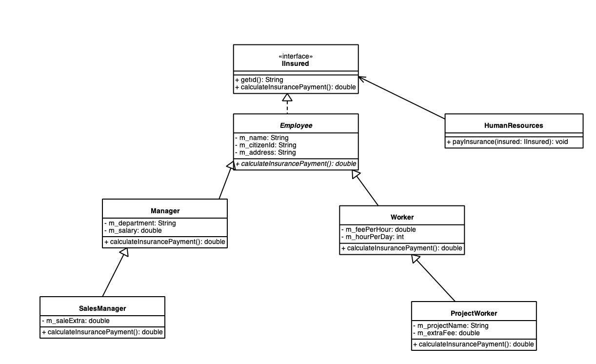

```java
package org.csystem.app.company;  
  
import org.csystem.app.company.employee.Employee;  
import org.csystem.app.company.employee.Manager;  
import org.csystem.app.company.employee.ProjectWorker;  
import org.csystem.app.company.employee.SalesManager;  
import org.csystem.app.company.employee.Worker;  
import org.csystem.app.company.hr.HumanResources;  
import org.csystem.util.thread.ThreadUtil;  
  
import java.util.Random;  
  
public class DemoCompanyApp {  
    private static Manager getManager()  
    {  
        return new Manager("Kaan Aslan", "12345678945", "Mecidiyeköy", "Yazılım", 300000);  
    }  
  
    private static Worker getWorker()  
    {  
        return new Worker("Güray Sönmez", "12345789321", "Bodrum", 400, 8);  
    }  
  
    private static ProjectWorker getProjectWorker()  
    {  
        return new ProjectWorker("Lokman Köse", "23456789233", "Çağlayan", 200, 8, "Dernek", 2000);  
    }  
  
    private static SalesManager getSalesManager()  
    {  
        return new SalesManager("Ali Serçe", "34567892345", "Geyikli", "Pazarlama", 400000, 30000);  
    }  
  
    private static Employee getEmployee(Random random)  
    {  
        return switch (random.nextInt(4)) {  
            case 0 -> getWorker();  
            case 1 -> getProjectWorker();  
            case 2 -> getSalesManager();  
            default -> getManager();  
        };  
    }  
  
  
    public static void run()  
    {  
        Random random = new Random();  
        HumanResources humanResources = new HumanResources();  
  
        while (true) {  
            Employee employee = getEmployee(random);  
  
            humanResources.payInsurance(employee);  
            ThreadUtil.sleep(1000);  
        }  
    }  
  
    public static void main(String[] args)  
    {  
        run();  
    }  
}
```

```java
package org.csystem.app.company.employee.insurance;  
  
public interface IInsured {  
    String getId();  
    double calculateInsurancePayment();  
}
```

```java
package org.csystem.app.company.employee;  
  
import org.csystem.app.company.employee.insurance.IInsured;  
  
public abstract class Employee implements IInsured {  
    private String m_name;  
    private String m_citizenId;  
    private String m_address;  
  
    //...  
  
    protected Employee(String name, String citizenId, String address)  
    {  
        //...  
        m_name = name;  
        m_citizenId = citizenId;  
        m_address = address;  
    }  
  
    public String getName()  
    {  
        return m_name;  
    }  
  
    public void setName(String name)  
    {  
        //...  
        m_name = name;  
    }  
  
    public String getId()  
    {  
        return m_citizenId;  
    }  
  
    public void setId(String citizenId)  
    {  
        //...  
        m_citizenId = citizenId;  
    }  
  
    public String getAddress()  
    {  
        return m_address;  
    }  
  
    public void setAddress(String address)  
    {  
        //...  
        m_address = address;  
    }  
  
  
    //...  
}
```

```java
package org.csystem.app.company.hr;  
  
import org.csystem.app.company.employee.insurance.IInsured;  
import org.csystem.util.console.Console;  
  
public class HumanResources {  
    //...  
  
    public void payInsurance(IInsured insured)  
    {  
        Console.writeLine("--------------------------------------------------------");  
        Console.writeLine("CitizenId:%s", insured.getId());  
        Console.writeLine("Insurance payment:%f", insured.calculateInsurancePayment());  
        Console.writeLine("--------------------------------------------------------");  
    }  
}
```

```java
package org.csystem.app.company.employee;  
  
public class Manager extends Employee {  
    private String m_department;  
    private double m_salary;  
  
    public Manager(String name, String citizenId, String address, String department, double salary)  
    {  
        super(name, citizenId, address);  
        m_department = department;  
        m_salary = salary;  
    }  
  
    public String getDepartment()  
    {  
        return m_department;  
    }  
  
    public void setDepartment(String department)  
    {  
        //...  
        m_department = department;  
    }  
  
    public double getSalary()  
    {  
        return m_salary;  
    }  
  
    public void setSalary(double salary)  
    {  
        //...  
        m_salary = salary;  
    }  
  
    public double calculateInsurancePayment()  
    {  
        return m_salary * 1.5;  
    }  
}
```

```java
package org.csystem.app.company.employee;  
  
public class SalesManager extends Manager {  
    private double m_saleExtra;  
  
    public SalesManager(String name, String citizenId, String address, String department, double salary, double saleExtra)  
    {  
        super(name, citizenId, address, department, salary);  
        m_saleExtra = saleExtra;  
    }  
  
    public double getSaleExtra()  
    {  
        return m_saleExtra;  
    }  
  
    public void setSaleExtra(double saleExtra)  
    {  
        m_saleExtra = saleExtra;  
    }  
  
    public double calculateInsurancePayment()  
    {  
        return super.calculateInsurancePayment() + m_saleExtra;  
    }  
}
```

```java
package org.csystem.app.company.employee;  
  
public class Worker extends Employee {  
    private double m_feePerHour;  
    private int m_hourPerDay;  
  
    public Worker(String name, String citizenId, String address, double feePerHour, int hourPerDay)  
    {  
        super(name, citizenId, address);  
        m_feePerHour = feePerHour;  
        m_hourPerDay = hourPerDay;  
    }  
  
    public double getFeePerHour()  
    {  
        return m_feePerHour;  
    }  
  
    public void setFeePerHour(double feePerHour)  
    {  
        m_feePerHour = feePerHour;  
    }  
  
    public int getHourPerDay()  
    {  
        return m_hourPerDay;  
    }  
  
    public void setHourPerDay(int hourPerDay)  
    {  
        m_hourPerDay = hourPerDay;  
    }  
  
    public double calculateInsurancePayment()  
    {  
        return m_feePerHour * m_hourPerDay * 30;  
    }  
  
    //...  
}
```


```java
package org.csystem.app.company.employee;  
  
public class ProjectWorker extends Worker {  
    private String m_projectName;  
    private double m_extraFee;  
  
    public ProjectWorker(String name, String citizenId, String address, double feePerHour, int hourPerDay, String projectName, double extraFee)  
    {  
        super(name, citizenId, address, feePerHour, hourPerDay);  
        m_projectName = projectName;  
        m_extraFee = extraFee;  
    }  
  
    public String getProjectName()  
    {  
        return m_projectName;  
    }  
  
    public void setProjectName(String projectName)  
    {  
        m_projectName = projectName;  
    }  
  
    public double getExtraFee()  
    {  
        return m_extraFee;  
    }  
  
    public void setExtraFee(double extraFee)  
    {  
        m_extraFee = extraFee;  
    }  
  
    public double calculateInsurancePayment()  
    {  
        return super.calculateInsurancePayment() + m_extraFee * 30;  
    }  
}
```


>JavaSE'de `CharSequence` arayüzü karakterlerin dizilimine ilişkin (sequence of characters) ilişkin bir soyutlama (anlaşma) sunar. Bu arayüz ile dizilmiş olan karakterler için okuma (readability) işlemlerine ilişkin soyut ve default metotlar gelmektedir. Karakterler ile işlemler yapan sınıflar bu arayüzü bir anlaşma olarak implemente ederler. Bu anlamda String sınıfı, StringBuilder sınıfı ve diğer karakterler ile işlem yapan sınıflar bu arayüzü implemente etmişlerdir. Pek çok geliştirme ortamına ilişkin kütüphanelerde bu arayüz referansı parametre olarak alan metotlar bulunur. Bu arayüzün `length`, `charAt` gibi abstract metodları vardır. Bu arayüze Java 8 ve sonrasında yararlı default metotlar da eklenmiştir.
>
>Java 17 ile birlikte rassal sayı üretimine ilişkin anlaşmayı temsil eden `RandomGenerator` isimli bir arayüz eklenmiştir. Bu arayüz ile birlikte farklı rassal sayı üretim algoritmaları kullanılabilmektedir. `java.util.Random` sınıfı gibi daha öncesinde var olan rassal sayı üretimine ilişkin sınıflar da Java 17 ile birlikte bu arayüzü implemente etmektedirler. Bu durumda Random sınıfına pek çok metot da dolaylı olarak eklenmiştir. Aslında `RandomGenerator` arayüzünün bir tane abstract metodu vardır:

```java
long nextLong();
```

>Diğer tüm metotları default olarak bildirilmiştir. Bu arayüzün `of` factory metotları ile çeşitli algoritmalar için nesnelere ilişkin referanslar elde edilebilmektedir. Bu arayüz ile birlikte Java'da rassal sayı üretimi soyutlanarak daha genel ve yetenekli hale getirilmiştir.


>Aşağıdaki demo örnekte `Random` parametreli metotları `RandomGenerator` alacak şekilde genelleştirilmiş `StringUtil` sınıfının `generateRandomTextTR` metodu ile `Xoshiro256PlusPlus` rassal sayı üretim algoritması kullanılmıştır. Java'da kullanılan rassal sayı üretim algoritmalarının detayları şu aşamada önemsizdir. Şu aşamada, `RandomGenerator` arayüzünün rassal sayı üretimini soyutlamasına odaklanılmalıdır.

```java
package org.csystem.app;  
  
import org.csystem.util.console.Console;  
import org.csystem.util.string.StringUtil;  
  
import java.util.random.RandomGenerator;  
  
class App {  
    public static void main(String[] args)  
    {  
        RandomGenerator randomGenerator = RandomGenerator.of("Xoshiro256PlusPlus");  
  
        Console.writeLine(StringUtil.generateRandomTextTR(randomGenerator, 10));  
    }  
}
```

>StringUtil sınıfı

```java
package org.csystem.util.string;  
  
import java.util.ArrayList;  
import java.util.random.RandomGenerator;  
  
public final class StringUtil {  
    private StringUtil()  
    {  
    }  
  
    private static final String LETTERS_EN;  
    private static final String LETTERS_TR;  
    private static final String CAPITAL_LETTERS_EN;  
    private static final String CAPITAL_LETTERS_TR;  
    private static final String ALL_LETTERS_EN;  
    private static final String ALL_LETTERS_TR;  
  
    static {  
       LETTERS_EN = "abcdefghijklmnopqrstuvwxyz";  
       LETTERS_TR = "abcçdefgğhıijklmnoöprsştuüvyz";  
       CAPITAL_LETTERS_EN = "ABCDEFGHIJKLMNOPQRSTUVWXYZ";  
       CAPITAL_LETTERS_TR = "ABCÇDEFGĞHIİJKLMNOÖPRSŞTUÜVYZ";  
       ALL_LETTERS_EN = LETTERS_EN + CAPITAL_LETTERS_EN;  
       ALL_LETTERS_TR = LETTERS_TR + CAPITAL_LETTERS_TR;  
    }  
  
    public static String capitalize(String s)  
    {  
       return s.isEmpty() ? s : Character.toUpperCase(s.charAt(0)) + s.substring(1).toLowerCase();  
    }  
  
    public static CharSequence changeCase(CharSequence charSequence)  
    {  
       StringBuilder sb = new StringBuilder(charSequence);  
  
       for (int i = 0; i < charSequence.length(); ++i) {  
          char c = charSequence.charAt(i);  
  
          sb.setCharAt(i, Character.isLowerCase(c) ? Character.toUpperCase(c) : Character.toLowerCase(c));  
       }  
  
       return sb.toString();  
    }  
  
  
    public static int countString(String s1, String s2)  
    {  
       int count = 0;  
  
       for (int i = 0; (i = s1.indexOf(s2, i)) != -1; ++i, ++count)  
          ;  
  
       return count;  
    }  
  
    public static String generateRandomText(RandomGenerator randomGenerator, int count, CharSequence charSequence)  
    {  
       char [] c = new char[count];  
  
       for (int i = 0; i < count; ++i)  
          c[i] = charSequence.charAt(randomGenerator.nextInt(charSequence.length()));  
  
       return String.valueOf(c);  
    }  
  
    public static String generateRandomTextEN(RandomGenerator randomGenerator, int count)  
    {  
       return generateRandomText(randomGenerator, count, ALL_LETTERS_EN);  
    }  
  
    public static String generateRandomTextTR(RandomGenerator randomGenerator, int count)  
    {  
       return generateRandomText(randomGenerator, count, ALL_LETTERS_TR);  
    }  
  
    public static String [] generateRandomTexts(RandomGenerator randomGenerator, int count, int origin, int bound, CharSequence charSequence)  
    {  
       String [] str = new String[count];  
  
       for (int i = 0; i < count; ++i)  
          str[i] = generateRandomText(randomGenerator, randomGenerator.nextInt(origin, bound), charSequence);  
  
       return str;  
    }  
  
    public static String [] generateRandomTextsEN(RandomGenerator randomGenerator, int count, int origin, int bound)  
    {  
       return generateRandomTexts(randomGenerator, count, origin, bound, ALL_LETTERS_EN);  
    }  
  
    public static String [] generateRandomTextsTR(RandomGenerator randomGenerator, int count, int origin, int bound)  
    {  
       return generateRandomTexts(randomGenerator, count, origin, bound, ALL_LETTERS_TR);  
    }  
  
    public static boolean isPalindrome(CharSequence charSequence)  
    {  
       int left = 0;  
       int right = charSequence.length() - 1;  
  
       while (left < right) {  
          char cLeft = charSequence.charAt(left);  
  
          if (!Character.isLetter(cLeft)) {  
             ++left;  
             continue;  
          }  
  
          char cRight = charSequence.charAt(right);  
  
          if (!Character.isLetter(cRight)) {  
             --right;  
             continue;  
          }  
  
          if (Character.toLowerCase(cLeft) != Character.toLowerCase(cRight))  
             return false;  
  
          ++left;  
          --right;  
       }  
  
       return true;  
    }  
  
  
    public static boolean isPangram(String s, String alphabet)  
    {  
       for (int i = 0; i < alphabet.length(); ++i)  
          if (s.indexOf(alphabet.charAt(i)) == -1)  
             return false;  
  
       return true;  
    }  
  
  
    public static boolean isPangramEN(String s)  
    {  
       return isPangram(s.toLowerCase(), LETTERS_EN);  
    }  
  
    public static boolean isPangramTR(String s)  
    {  
       return isPangram(s.toLowerCase(), LETTERS_TR);  
    }  
  
  
    public static String join(ArrayList texts, CharSequence delimiter)  
    {  
       StringBuilder sb = new StringBuilder();  
  
       for (Object o : texts) {  
          String s = (String)o;  
  
          sb.append(s).append(delimiter);  
       }  
  
       return sb.substring(0, sb.length() - delimiter.length());  
    }  
  
    public static String join(ArrayList texts, char delimiter)  
    {  
       return join(texts, String.valueOf(delimiter));  
    }  
  
    public static String join(String [] s, CharSequence delimiter)  
    {  
       StringBuilder sb = new StringBuilder();  
  
       for (String str : s)  
          sb.append(str).append(delimiter);  
  
       return sb.substring(0, sb.length() - delimiter.length());  
    }  
  
    public static String join(String [] s, char delimiter)  
    {  
       return join(s, String.valueOf(delimiter));  
    }  
  
    public static String padLeading(String s, int n, char ch)  
    {  
       int len = s.length();  
  
       return len < n ? String.valueOf(ch).repeat(n - len) + s : s;  
    }  
  
    public static String padLeading(String s, int n)  
    {  
       return padLeading(s, n, ' ');  
    }  
  
    public static String padTrailing(String s, int n, char ch)  
    {  
       int len = s.length();  
  
       return len < n ? s + String.valueOf(ch).repeat(n - len) : s;  
    }  
  
    public static String padTrailing(String s, int n)  
    {  
       return padTrailing(s, n, ' ');  
    }  
  
    public static String reverse(String s)  
    {  
       return new StringBuilder(s).reverse().toString();  
    }  
  
    public static String [] split(String s, CharSequence delimiters)  
    {  
       return split(s, delimiters, true);  
    }  
  
    public static String [] split(String s, CharSequence delimiters, boolean removeEmptyEntries)  
    {  
       StringBuilder pattern = new StringBuilder("[");  
  
       for (int i = 0; i < delimiters.length(); ++i) {  
          char c = delimiters.charAt(i);  
  
          if (c == '[' || c == ']')  
             pattern.append('\\');  
  
          pattern.append(c);  
       }  
  
       pattern.append(']');  
  
       if (removeEmptyEntries)  
          pattern.append("+");  
  
       return s.split(pattern.toString());  
    }  
}
```

>ArrayUtil sınıfı

```java
package org.csystem.util.array;  
  
  
import java.util.random.RandomGenerator;  
  
public final class ArrayUtil {  
    private ArrayUtil()  
    {  
    }  
  
    private static void bubbleSortAscending(int [] a)  
    {  
        for (int i = 0; i < a.length - 1; ++i)  
            for (int k = 0; k < a.length - 1 - i; ++k)  
                if (a[k + 1] < a[k])  
                    swap(a, k, k + 1);  
    }  
  
    private static void bubbleSortDescending(int [] a)  
    {  
        for (int i = 0; i < a.length - 1; ++i)  
            for (int k = 0; k < a.length -1 - i; ++k)  
                if (a[k] < a[k + 1])  
                    swap(a, k, k + 1);  
    }  
  
    private static void selectionSortAscending(int [] a)  
    {  
        int min, minIndex;  
  
        for (int i = 0; i < a.length - 1; ++i) {  
            min = a[i];  
            minIndex = i;  
  
            for (int k = i + 1; k < a.length; ++k)  
                if (a[k] < min) {  
                    min = a[k];  
                    minIndex = k;  
                }  
            a[minIndex] = a[i];  
            a[i] = min;  
        }  
    }  
  
    private static void selectionSortDescending(int [] a)  
    {  
        int max, maxIndex;  
  
        for (int i = 0; i < a.length - 1; ++i) {  
            max = a[i];  
            maxIndex = i;  
  
            for (int k = i + 1; k < a.length; ++k)  
                if (max < a[k]) {  
                    max = a[k];  
                    maxIndex = k;  
                }  
            a[maxIndex] = a[i];  
            a[i] = max;  
        }  
    }  
  
    public static double average(int [] a)  
    {  
        return sum(a) / (double)a.length;  
    }  
  
    public static void bubbleSort(int [] a)  
    {  
        bubbleSort(a, false);  
    }  
  
    public static void bubbleSort(int [] a, boolean descending)  
    {  
        if (descending)  
            bubbleSortDescending(a);  
        else  
            bubbleSortAscending(a);  
    }  
  
    public static void drawHistogram(int [] data, int n, char ch)  
    {  
        int maxValue = ArrayUtil.max(data);  
  
        for (int grade : data) {  
            int count = (int)Math.floor(grade * n / (double)maxValue);  
  
            while (count-- > 0)  
                System.out.print(ch);  
  
            System.out.println();  
        }  
    }  
  
    public static int [] generateRandomArray(RandomGenerator randomGenerator, int count, int origin, int bound)  
    {  
        int [] a = new int[count];  
  
        for (int i = 0; i < count; ++i)  
            a[i] = randomGenerator.nextInt(origin, bound);  
  
        return a;  
    }  
  
    public static double [] generateRandomArray(RandomGenerator randomGenerator, int count, double origin, double bound)  
    {  
        double [] a = new double[count];  
  
        for (int i = 0; i < count; ++i)  
            a[i] = randomGenerator.nextDouble(origin, bound);  
  
        return a;  
    }  
  
    public static boolean [] generateRandomArray(RandomGenerator randomGenerator, int count)  
    {  
        boolean [] a = new boolean[count];  
  
        for (int i = 0; i < count; ++i)  
            a[i] = randomGenerator.nextBoolean();  
  
        return a;  
    }  
  
    public static int [] histogramData(int [] a, int n)  
    {  
        int [] data = new int[n + 1];  
  
        for (int val : a)  
            ++data[val];  
  
        return data;  
    }  
  
    public static int max(int [] a)  
    {  
        return max(a, 0);  
    }  
  
    public static int max(int [] a, int startIndex)  
    {  
        int result = a[startIndex];  
  
        for (int i = startIndex + 1; i < a.length; ++i)  
            result = Math.max(result, a[i]);  
  
        return result;  
    }  
  
    public static int max(int [][] a)  
    {  
        int result = Integer.MIN_VALUE;  
  
        for (int [] array : a)  
            result = Math.max(result, max(array));  
  
        return result;  
    }  
  
    public static int min(int [] a)  
    {  
        return min(a, 0);  
    }  
  
    public static int min(int [] a, int startIndex)  
    {  
        int result = a[startIndex];  
  
        for (int i = startIndex + 1; i < a.length; ++i)  
            result = Math.min(result, a[i]);  
  
        return result;  
    }  
  
    public static int min(int [][] a)  
    {  
        int result = Integer.MAX_VALUE;  
  
        for (int [] array : a)  
            result = Math.min(result, min(array));  
  
        return result;  
    }  
  
    public static void multiplyBy(int [] a, int value)  
    {  
        for (int i = 0; i < a.length; ++i)  
            a[i] *= value;  
    }  
  
    public static void multiplyBy(int [][] a, int value)  
    {  
        for (int [] array : a)  
            multiplyBy(array, value);  
    }  
  
    public static int partition(int [] a, int threshold)  
    {  
        int partitionPoint = 0;  
  
        while (partitionPoint != a.length && a[partitionPoint] < threshold)  
            ++partitionPoint;  
  
        if (partitionPoint == a.length)  
            return partitionPoint;  
  
        for (int i = partitionPoint + 1; i < a.length; ++i)  
            if (a[i] < threshold)  
                swap(a, i, partitionPoint++);  
  
        return partitionPoint;  
    }  
  
    public static int partitionByEven(int [] a)  
    {  
        int partitionPoint = 0;  
  
        while (partitionPoint != a.length && a[partitionPoint] % 2 == 0)  
            ++partitionPoint;  
  
        if (partitionPoint == a.length)  
            return partitionPoint;  
  
        for (int i = partitionPoint + 1; i < a.length; ++i)  
            if (a[i] % 2 == 0)  
                swap(a, i, partitionPoint++);  
  
        return partitionPoint;  
    }  
  
    public static void print(int [] a)  
    {  
        print(a, ' ', '\n');  
    }  
  
    public static void print(int [] a, char sep, char end)  
    {  
        print(a, 1, sep, end);  
    }  
  
    public static void print(int [] a, int n)  
    {  
        print(a, n, ' ', '\n');  
    }  
  
    public static void print(int [] a, int n, char sep, char end)  
    {  
        String fmt = String.format("%%0%dd%c", n, sep);  
  
        for (int val : a)  
            System.out.printf(fmt, val, sep);  
  
        System.out.print(end);  
    }  
  
    public static void print(int [][] a)  
    {  
        print(a, 1);  
    }  
  
    public static void print(int [][] a, int n)  
    {  
        for (int [] array : a)  
            print(array, n, ' ', '\n');  
    }  
  
    public static void print(double [] a)  
    {  
        print(a, '\n', '\n');  
    }  
  
    public static void print(double [] a, char sep, char end)  
    {  
        for (double val : a)  
            System.out.printf("%f%c", val, sep);  
  
        System.out.print(end);  
    }  
  
    public static void reverse(int [] a)  
    {  
        int left = 0, right = a.length - 1;  
  
        while (left < right)  
            swap(a, left++, right--);  
    }  
  
    public static void reverse(char [] a)  
    {  
        int left = 0, right = a.length - 1;  
  
        while (left < right)  
            swap(a, left++, right--);  
    }  
  
    public static void selectionSort(int [] a)  
    {  
        selectionSort(a, false);  
    }  
  
    public static void selectionSort(int [] a, boolean descending)  
    {  
        if (descending)  
            selectionSortDescending(a);  
        else  
            selectionSortAscending(a);  
    }  
    public static long sum(int [] a)  
    {  
        long total = 0;  
  
        for (int val : a)  
            total += val;  
  
        return total;  
    }  
  
    public static void swap(int [] a, int i, int k)  
    {  
        int temp = a[i];  
  
        a[i] = a[k];  
        a[k] = temp;  
    }  
  
    public static void swap(char [] a, int i, int k)  
    {  
        char temp = a[i];  
  
        a[i] = a[k];  
        a[k] = temp;  
    }  
  
    //...  
}
```

>MatrixUtil sınıfı

```java
package org.csystem.util.matrix;  
  
import org.csystem.util.array.ArrayUtil;  
  
import java.util.random.RandomGenerator;  
  
public final class MatrixUtil {  
    private MatrixUtil()  
    {  
    }  
  
    public static int [][] add(int [][] a, int [][] b)  
    {  
        int m = a.length;  
        int n = a[0].length;  
        int [][] r = new int[m][n];  
  
        for (int i = 0; i < m; ++i)  
            for (int j = 0; j < n; ++j)  
                r[i][j] = a[i][j] + b[i][j];  
  
        return r;  
    }  
  
    public static double [][] add(double [][] a, double [][] b)  
    {  
        int m = a.length;  
        int n = a[0].length;  
        double [][] r = new double[m][n];  
  
        for (int i = 0; i < m; ++i)  
            for (int j = 0; j < n; ++j)  
                r[i][j] = a[i][j] + b[i][j];  
  
        return r;  
    }  
  
    public static int [][] generateRandomMatrix(RandomGenerator randomGenerator, int m, int n, int origin, int bound)  
    {  
        int [][] result = new int[m][];  
  
        for (int i = 0; i < m; ++i)  
            result[i] = ArrayUtil.generateRandomArray(randomGenerator, n, origin, bound);  
  
        return result;  
    }  
  
    public static int [][] generateRandomSquareMatrix(RandomGenerator randomGenerator, int n, int origin, int bound)  
    {  
        return generateRandomMatrix(randomGenerator, n, n, origin, bound);  
    }  
  
    public static boolean isMatrix(int [][] a)  
    {  
        for (int i = 1; i < a.length; ++i)  
            if (a[i].length != a[0].length)  
                return false;  
  
        return true;  
    }  
  
    public static boolean isSquareMatrix(int [][] a)  
    {  
        return isMatrix(a) && a.length == a[0].length;  
    }  
  
    public static int max(int [][] a)  
    {  
        return ArrayUtil.max(a);  
    }  
  
    public static int min(int [][] a)  
    {  
        return ArrayUtil.min(a);  
    }  
  
    public static int [][] multiply(int [][] a, int [][] b)  
    {  
        int m = a.length;  
        int n = a[0].length;  
        int p = b[0].length;  
        int [][] r = new int[m][p];  
  
        for (int i = 0; i < m; ++i)  
            for (int j = 0; j < n; ++j)  
                for (int k = 0; k < p; ++k)  
                    r[i][k] += a[i][j] * b[j][k];  
  
        return r;  
    }  
  
    public static void multiplyBy(int [][] a, int value)  
    {  
        ArrayUtil.multiplyBy(a, value);  
    }  
  
    public static void print(int [][] a)  
    {  
        print(a, 1);  
    }  
  
    public static void print(int [][] a, int n)  
    {  
        ArrayUtil.print(a, n);  
    }  
  
    public static int [][] subtract(int [][] a, int [][] b)  
    {  
        int m = a.length;  
        int n = a[0].length;  
        int [][] r = new int[m][n];  
  
        for (int i = 0; i < m; ++i)  
            for (int j = 0; j < n; ++j)  
                r[i][j] = a[i][j] - b[i][j];  
  
        return r;  
    }  
  
    public static long sum(int [][] a)  
    {  
        long total = 0;  
  
        for (int [] array : a)  
            total += ArrayUtil.sum(array);  
  
        return total;  
    }  
  
    public static long sumDiagonal(int [][] a)  
    {  
        long total = 0;  
  
        for (int i = 0; i < a.length; ++i)  
            total += a[i][i];  
  
        return total;  
    }  
  
    public static int [][] transpose(int [][] a)  
    {  
        int m = a.length;  
        int n = a[0].length;  
        int [][] r = new int[n][m];  
  
        for (int i = 0; i < n; ++i)  
            for (int j = 0; j < m; ++j)  
                r[i][j] = a[j][i];  
  
        return r;  
    }  
}
```

###### 20 Mayıs 2025

###### Arayüzlerle İlgili Tür Dönüştürmeleri

>Arayüzlerle ilgili tür dönüştürmeleri 4 (dört) durumda incelenebilir:  
>- Bir sınıf referansının onun desteklediği (implementation) bir arayüz referansına dönüştürülmesi  
>- Bir arayüz referansının herhangi bir sınıf türüne dönüştürülmesi
>- Bir arayüz referansının başka bir arayüz referansına dönüştürülmesi
>- Bir sınıf referansının onun desteklemediği bir arayüz referansına dönüştürülmesi  

> Bir sınıf referansının onun desteklediği (implementation) bir arayüz referansına dönüştürülmesi doğrudan (implicit) yapılabilir. Bu durum arayüz referansının taban sınıf referansı gibi kullanılmasıdır. Zaten arayüzün hedeflerinden biri de budur  

```java
package org.csystem.app;  
  
class App {  
    public static void main(String[] args)  
    {  
        A a = new A();  
        IX ix;  
  
        ix = a;  
    }  
}  
  
  
class A implements IX {  
    //...  
}  
  
interface IX {  
    //...  
}
```

>Bir arayüz referansının herhangi bir sınıf türüne dönüştürülmesi explicit olarak yani tür dönüştürme operatörü ile yapılır. Ancak çalışma zamanı sırasında arayüz referansının dinamik türünün dönüştürülecek sınıfı kapsayıp kapsamadığına bakılır. Kapsıyorsa haklı dönüşümdür, akış devam eder. Kapsamıyorsa haksız dönüşümdür, ClassCastException  fırlatılır 

```java
package org.csystem.app;  
  
class App {  
    public static void main(String[] args)  
    {  
        A a = new A();  
        IX ix;  
  
        ix = a;  
  
        B b = (B) ix; //haklı dönüşüm  
  
        System.out.println("Tekrar yapıyor musunuz?");  
    }  
}  
  
class A extends B implements IX {  
    //...  
}  
  
class B  {  
    //...  
}  
  
interface IX {  
    //...  
}
```


>Bir arayüz referansının herhangi bir sınıf türüne dönüştürülmesi explicit olarak yani tür dönüştürme operatörü ile yapılır. Ancak çalışma zamanı sırasında arayüz referansının dinamik türünün dönüştürülecek sınıfı kapsayıp kapsamadığına bakılır. Kapsıyorsa haklı dönüşümdür, akış devam eder. Kapsamıyorsa haksız dönüşümdür, ClassCastException fırlatılır 

```java
package org.csystem.app;  
  
class App {  
    public static void main(String[] args)  
    {  
        A a = new A();  
        IX ix;  
  
        ix = a;  
  
        B b = (B)ix; //haksız dönüşüm  
  
        System.out.println("Tekrar yapıyor musunuz?");  
    }  
}  
  
class A implements IX {  
    //...  
}  
  
class B  {  
    //...  
}  
  
interface IX {  
    //...  
}
```


>Bir arayüz referansının başka başka bir arayüz referansına dönüştürülmesi iki şekilde incelenebilir:  
>1. Kaynak arayüz hedef arayüzden türetilmişse doğrudan yapılabilir  

```java
package org.csystem.app;  
  
class App {  
    public static void main(String[] args)  
    {  
        A a = new A();  
        IY iy = a;  
        IX ix;  
  
        ix = iy; //upcasting  
  
  
        System.out.println("Tekrar yapıyor musunuz?");  
    }  
}  
  
class A implements IY {  
    //...  
}  
  
interface IY extends IX {  
    //...  
}  
  
interface IX {  
    //...  
}
```


>Bir arayüz referansının başka başka bir arayüz referansına dönüştürülmesi iki şekilde incelenebilir:  
> 2. Kaynak arayüz hedef arayüzden türetilmemişse explicit olarak yapılablir. Bu durumda çalışma zamanı sırasında  kaynak arayüz referansının dinamik türünün hedef arayüzü destekleyip desteklemediğine bakılır. Destekliyorsa haklı dönüşümdür. Desteklemiyorsa haksız dönüşümdür. ClassCastException fırlatılır  

```java
package org.csystem.app;  
  
class App {  
    public static void main(String[] args)  
    {  
        A a = new A();  
        IY iy = a;  
        IX ix;  
  
        ix = (IX)iy; //haklı dönüşüm  
  
  
        System.out.println("Tekrar yapıyor musunuz?");  
    }  
}  
  
class A implements IX, IY {  
    //...  
}  
  
interface IY {  
    //...  
}  
  
interface IX {  
    //...  
}
```

>Bir arayüz referansının başka başka bir arayüz referansına dönüştürülmesi iki şekilde incelenebilir:  
> 2. Kaynak arayüz hedef arayüzden türetilmemişse explicit olarak yapılablir. Bu durumda çalışma zamanı sırasında  kaynak arayüz referansının dinamik türünün hedef arayüzü destekleyip desteklemediğine bakılır. Destekliyorsa haklı dönüşümdür. Desteklemiyorsa haksız dönüşümdür. ClassCastException fırlatılır  

```java
package org.csystem.app;  
  
class App {  
    public static void main(String[] args)  
    {  
        A a = new A();  
        IY iy = a;  
        IX ix;  
  
        ix = (IX)iy; //haksız dönüşüm  
  
  
        System.out.println("Tekrar yapıyor musunuz?");  
    }  
}  
  
class A implements IY {  
    //...  
}  
  
interface IY {  
    //...  
}  
  
interface IX {  
    //...  
}
```
  
>Bir sınıf referansının onun desteklemediği bir arayüz referansına dönüştürülmesi:  Bu işlem tür dönüştürme operatörü ile yapılabilir. Çalışma zamanı sırasında kaynak referansın dinamik türünün hedef arayüzü destekleyip desteklemediğine bakılır. Destekliyorsa haklı dönüşümdür. Desteklemiyorsa haksız dönüşümdür, ClassCastException fırlatılır  

```java
package org.csystem.app;  
  
class App {  
    public static void main(String[] args)  
    {  
        A a = new B();  
        IX ix;  
  
        ix = (IX)a; //haklı dönüşüm  
  
        System.out.println("Tekrar yapıyor musunuz?");  
    }  
}  
  
  
class B extends A implements IX {  
    //...  
}  
  
class A  {  
    //...  
}  
  
interface IX {  
    //...  
}
```


>Bir sınıf referansının onun desteklemediği bir arayüz referansına dönüştürülmesi:  
  Bu işlem tür dönüştürme operatörü ile yapılabilir. Çalışma zamanı sırasında kaynak referansın dinamik türünün  hedef arayüzü destekleyip desteklemediğine bakılır. Destekliyorsa haklı dönüşümdür. Desteklemiyorsa haksız dönüşümdür, ClassCastException fırlatılır  

```java
package org.csystem.app;  
  
class App {  
    public static void main(String[] args)  
    {  
        A a = new B();  
        IX ix;  
  
        ix = (IX)a; //haklı dönüşüm  
  
        System.out.println("Tekrar yapıyor musunuz?");  
    }  
}  
  
  
class B extends A{  
    //...  
}  
  
class A  {  
    //...  
}  
  
interface IX {  
    //...  
}
```


>enum sınıflar arayüzleri destekleyebilirler. Bu durumda enum class içerisinde arayüzün varsa abstract metotları override edilebilir. enum sınıfı içerisinde arayüzün abstract bir metodu override edilmezse error oluşur. Çünkü enum sınıflar abstract olamaz

```java
package org.csystem.app;  
  
import org.csystem.util.console.Console;  
  
import java.util.Random;  
import java.util.random.RandomGenerator;  
  
class App {  
    public static void main(String[] args)  
    {  
        SampleFactory sampleFactory = new SampleFactory();  
  
        Sample sample = sampleFactory.create();  
        Console.writeLine("Sample: %s", sample);  
  
        Console.writeLine(sample.foo(3));  
    }  
}  
  
class SampleFactory {  
    private static final Sample [] VALUES = Sample.values();  
    private final RandomGenerator m_randomGenerator = new Random();  
  
    public Sample create()  
    {  
        return switch (m_randomGenerator.nextInt(VALUES.length)) {  
            case 0 -> Sample.AA;  
            case 1 -> Sample.BB;  
            case 2 -> Sample.CC;  
            default -> Sample.DD;  
        };  
    }  
}  
  
enum Sample implements IX {  
    AA, BB, CC, DD;  
  
    public int foo(int a)  
    {  
        return ordinal() + a;  
    }  
}  
  
interface IX {  
    int foo(int a);  
}
```

>enum sınıflar için desteklediği arayüzlerin sanal metotları her enum sabiti için ayrıca override edilebilir. Bu durumda enum class için override edilen metot yalnızca özellikle override edilmemiş bir sabit için çağrılır. Eğer tüm sabitler için ayrı override'lar yapılırsa enum class için yapılan genel override edilen metot hiç bir şekilde çağrılamaz yani bu durumda genel override'ın anlamı yoktur.

>Aşağıdaki demo örneği inceleyiniz

```java
package org.csystem.app;  
  
import org.csystem.util.console.Console;  
  
import java.util.Random;  
import java.util.random.RandomGenerator;  
  
class App {  
    public static void main(String[] args)  
    {  
        SampleFactory sampleFactory = new SampleFactory();  
  
        Sample sample = sampleFactory.create();  
        Console.writeLine("Sample: %s", sample);  
  
        Console.writeLine(sample.foo(3));  
    }  
}  
  
class SampleFactory {  
    private static final Sample [] VALUES = Sample.values();  
    private final RandomGenerator m_randomGenerator = new Random();  
  
    public Sample create()  
    {  
        return switch (m_randomGenerator.nextInt(VALUES.length)) {  
            case 0 -> Sample.AA;  
            case 1 -> Sample.BB;  
            case 2 -> Sample.CC;  
            default -> Sample.DD;  
        };  
    }  
}  
  
enum Sample implements IX {  
    AA {  
        public int foo(int a)  
        {  
            Console.writeLine("A");  
            return ordinal() + a;  
        }  
    }  
  
    , BB {  
        public int foo(int a)  
        {  
            Console.writeLine("B");  
            return ordinal() + a;  
        }  
    },  
    CC {  
        public int foo(int a)  
        {  
            Console.writeLine("C");  
            return ordinal() + a;  
        }  
    }, DD;  
  
    public int foo(int a)  
    {  
        Console.writeLine(toString());  
        return ordinal() + a;  
    }  
}  
  
interface IX {  
    int foo(int a);  
}
```

>Aşağıdaki `IRandomGeneratorFactory` arayüzü ve `RandomGeneratorAlgorithm` enum sınıfını inceleyiniz


```java
package org.csystem.util.random;  
  
import java.util.random.RandomGenerator;  
  
public interface IRandomGeneratorFactory {  
    RandomGenerator create();  
}
```

```java
package org.csystem.util.random;  
  
import java.security.SecureRandom;  
import java.util.concurrent.ThreadLocalRandom;  
import java.util.random.RandomGenerator;  
  
public enum RandomGeneratorAlgorithm implements IRandomGeneratorFactory {  
    L128X1024_MIX_RANDOM("L128X1024MixRandom"), L128X128_MIX_RANDOM("L128X128MixRandom"), L128X256_MIX_RANDOM("L128X256MixRandom"),  
    L32X64_MIX_RANDOM("L32X64MixRandom"), L64X1024MIX_RANDOM("L64X1024MixRandom"), L64X128_MIX_RANDOM("L64X128MixRandom"),  
    L64X128_STAR_STAR_RANDOM("L64X128StarStarRandom"), L64X256_MIX_RANDOM("L64X256MixRandom"), RANDOM("Random"),  
    XOROSHIRO128_PLUS_PLUS("Xoroshiro128PlusPlus"), XOROSHIRO256_PLUS_PLUS("Xoshiro256PlusPlus"),  
    SPLITTABLE_RANDOM("SplittableRandom"), THREAD_LOCAL_RANDOM("ThreadLocalRandom") {  
        public RandomGenerator create()  
        {  
            return ThreadLocalRandom.current();  
        }  
    },  
    SECURE_RANDOM("SecureRandom") {  
        public RandomGenerator create()  
        {  
            return new SecureRandom();  
        }  
    };  
  
    private final String m_name;  
  
    RandomGeneratorAlgorithm(String name)  
    {  
        m_name = name;  
    }  
  
    public String getName()  
    {  
        return m_name;  
    }  
  
    public RandomGenerator create()  
    {  
        return RandomGenerator.of(m_name);  
    }  
  
    //...  
}
```

###### 22 Mayıs 2025

>Bazı sınıflar bir **kaynağı (resource)** kullanırlar. Bu kaynakların kullanılmaya başlamadan önce **mantıksal olarak açılması (open)** gerekir. Burada **açma işlemi**, o kaynağı kullanmadan önce yapılması gereken işlemleri tamamlamak anlamında kullanılır. Bu tip kaynakların işlem bittikten sonra **mantıksal olarak kapatılması (close)** yani **geri bırakılması (free/release)** ile ilgili işlemlerin tamamlanması gerekir. Örneğin bir dosyanın verileri üzerinde işlem yapmak için dosyanın açılması gerekir, işlem bittikten sonra da kapatılması gerekir. Bir dosyanın açılması işletim  sistemi düzeyinde aşağı seviyeli bir takım işlemlerin yapılması demektir, kapatılması ise yine işletim sistemi düzeyinde  bir takım işlemlerin yapılması demektir. İşte böylesi durumlar için Java dünyasında **Closeable** arayüzü kullanılır. Bu arayüzün aşağıdaki prototipe sahip close isimli abstract bir metodu vardır:  

```java
void close() throws IOException;  
```

>Bu durumda ilgili sınıf kaynağı geri bırakma (release) işlemini bu metot içerisinde yapar. Kaynağı mantıksal olarak açma işlemi sınıftan sınıfa yani senaryoya göre değişebilir. Örneğin bazı sınıflar kaynağı açma işlemini ctor içerisinde  yaparlar. `Senaryo ne olursa bir Java programcısı için Closeable arayüzünü destekleyen bir sınıfı kullanmak, onun close metodunun da genel olarak çağrılması gerektiği anlamına gelir. Benzer şekilde programcı, böylesi kaynak kullanan bir sınıf yazdığında da Closeable arayüzünü destekler.` JavaSE'de Closeable arayüzünü destekleyen çok fazla sınıf vardır. Java 7 ile birlikte tamamen aynı metoda sahip olan **AutoCloseable** isimli bir arayüz eklenmiştir ve Java 7 ile birlikte Closeable arayüzü AutoCloseable arayüzünden türetilmiştir. `AutoCloseable` arayüzü ileride ele alınacaktır.  
  
**Anahtar Notlar:** Closeable arayüzünü destekleyen bazı sınıfların close metotları throws IOException bildirerek override edilse de bu exception'ın handle edilmesi gerekmeyebilir ya da handle edilse de anlamlı olmayabilir. Örneğin açık olan bir dosyanın kapatılamaması durumunda oluşacak exception için programın içerisinde yapılacak çok da bir şey yoktur. Yani programcı açısından bu exception'ın handle edilmesi bir anlam ifade etmez ancak close metodu IOException'ı throws listesinde içerecek biçimde override edildiğinden programcının bu exception'ı akış içerisinde handle etmesi veya metodu çağırdığı yerde throws bildirimi yapması gerekir. Her iki durumda da gereksiz kod olması açısından clean code yazılmamış olur. Bu durumda programcının strateji değiştirerek daha clean code yazması gerekir.

>Aşağıdaki demo örnekte finally bloğu içerisinde aslında ihtiyaç olmasa da (örnek özelinde ihtiyaç olmadığını varsayınız) `close` metodu çağrısı `IOException` fırlattığı için `try deyimi` ile sarmalanmıştır. Dikkat edilirse checked exception dolayısıyla programcı strateji değiştirmek ve gereksiz kodlar yazmak zorunda kalmıştır.

```java
package org.csystem.app;  
  
import org.csystem.util.console.Console;  
  
import java.io.Closeable;  
import java.io.IOException;  
  
class App {  
    public static void main(String[] args)  
    {  
        DemoApp.run();  
    }  
}  
  
class DemoApp {  
    public static void run()  
    {  
        String url = Console.readString("Input url:");  
        String username = Console.readString("Input username:");  
        String password = Console.readString("Input password:");  
  
        DemoDatabaseConnection connection = null;  
  
        try {  
            connection = new DemoDatabaseConnection(url, username, password);  
            String sqlStr = Console.readString("Input sql command:");  
  
            connection.insert(sqlStr);  
        }  
        catch (IOException ex) {  
            Console.writeLine("Error occurred:%s", ex.getMessage());  
        }  
        finally {  
            if (connection != null)  
                try {  
                    connection.close();  
                }  
                catch (IOException ignore) {  
  
                }  
        }  
  
        Console.writeLine("C and System programmers association");  
    }  
}  
  
class DemoDatabaseConnection implements Closeable {  
    private String m_url;  
    private String m_username;  
    private String m_password;  
    //...  
  
    private void checkInformation(String url, String username, String password)  throws IOException  
    {  
        if (url == null || url.isBlank() || username == null || username.isBlank() || password == null)  
            throw new IOException("Illegal connection parameters");  
    }  
  
    public DemoDatabaseConnection(String url, String username, String password) throws IOException  
    {  
        checkInformation(url, username, password);  
        m_url = url;  
        m_username = username;  
        m_password = password;  
  
        Console.writeLine("Connection to '%s' succeed with user:%s", url, username);  
    }  
  
    public void insert(String sqlStr) throws IOException  
    {  
        if (sqlStr == null || sqlStr.isBlank())  
            throw new IOException("sqlStr can not be null");  
  
        Console.writeLine("'%s' sent to %s", sqlStr, m_url);  
    }  
  
    //...  
  
    public void close() throws IOException  
    {  
        //...  
        Console.writeLine("Close connection");  
    }  
}
```

>Yukarıdaki demo örnek aşağıdaki gibi daha okunabilir hale getirilebilir ancak yine de programcı stratej değiştmek zorunda kalmıştır. Bununla birlikte programcı close metodunun çağrılmasını unutabilir yani gözünden kaçabilir

```java
package org.csystem.app;  
  
import org.csystem.util.console.Console;  
  
import java.io.Closeable;  
import java.io.IOException;  
  
class App {  
    public static void main(String[] args)  
    {  
        DemoApp.run();  
    }  
}  
  
class DemoApp {  
    public static void run()  
    {  
        String url = Console.readString("Input url:");  
        String username = Console.readString("Input username:");  
        String password = Console.readString("Input password:");  
  
        DemoDatabaseConnection connection = null;  
  
        try {  
            DemoDatabaseConnectionUtil.insert(url, username, password);  
        }  
        catch (IOException ex) {  
            Console.writeLine("Error occurred:%s", ex.getMessage());  
        }  
  
        Console.writeLine("C and System programmers association");  
    }  
}  
  
class DemoDatabaseConnectionUtil {  
    public static void insert(String url, String username, String password) throws IOException  
    {  
        DemoDatabaseConnection connection = null;  
  
        try {  
            connection = new DemoDatabaseConnection(url, username, password);  
            String sqlStr = Console.readString("Input sql command:");  
  
            connection.insert(sqlStr);  
        }  
        finally {  
            if (connection != null)  
                connection.close();  
        }  
    }  
}  
  
class DemoDatabaseConnection implements Closeable {  
    private String m_url;  
    private String m_username;  
    private String m_password;  
    //...  
  
    private void checkInformation(String url, String username, String password)  throws IOException  
    {  
        if (url == null || url.isBlank() || username == null || username.isBlank() || password == null)  
            throw new IOException("Illegal connection parameters");  
    }  
  
    public DemoDatabaseConnection(String url, String username, String password) throws IOException  
    {  
        checkInformation(url, username, password);  
        m_url = url;  
        m_username = username;  
        m_password = password;  
  
        Console.writeLine("Connection to '%s' succeed with user:%s", url, username);  
    }  
  
    public void insert(String sqlStr) throws IOException  
    {  
        if (sqlStr == null || sqlStr.isBlank())  
            throw new IOException("sqlStr can not be null");  
  
        Console.writeLine("'%s' sent to %s", sqlStr, m_url);  
    }  
  
    //...  
  
    public void close() throws IOException  
    {  
        //...  
        Console.writeLine("Close connection");  
    }  
}
```

>Yukarıdaki yaklaşımlarda checked exception dolayısıyla programcının strateji değiştirmesi söz konusudur ayrıca kod içerisinde close metodunun çağrılmasının gözden kaçtığı durumlar olabilir ve bu da senaryoya göre çeşitli bug'ların oluşmasına sebep olabilir.  Java 7 ile birlikte **AutoCloseable** arayüzü eklenmiş, `Closeable` arayüzü AutoCloseable arayüzünden türetilmiştir. Yani Java 7 ile birlikte Closeable arayüzünü destekleyen her sınıf aynı zamanda AutoCloseable arayüzünü de destekler duruma gelmiştir. Java 7 ile birlikte ismine **try-with-resources (TWR)** denilen bir deyim eklenmiştir. Bu deyimin genel biçimi şu şekildedir:  

```java
try (<AutoCloseable arayüzü türünden referans>[; <AutoCloseable arayüzü türünden referans>; ...]) {
	//...  
}  
[  
    catch blokları VEYA finally bloğu VEYA catch blokları ile finally bloğu  
]  
```

>Bu deyim ile close metodu otomatik olarak çağrılır. Yani programcının bu deyim ile birlikte close metodunu çağırması gerekmez. Bu durumda programcı ne strateji değiştirmek zorunda kalır ne de close metodunun çağrılmasının gözden kaçabileceği durumlar oluşabilir. 
>
>Yukarıdaki demo örnek TWR kullanılarak aşağıdaki gibi daha okunabilir ve kapatma anlamında daha güvenli bir biçimde yazılabilir

```java
package org.csystem.app;  
  
import org.csystem.util.console.Console;  
  
import java.io.Closeable;  
import java.io.IOException;  
  
class App {  
    public static void main(String[] args)  
    {  
        DemoApp.run();  
    }  
}  
  
class DemoApp {  
    public static void run()  
    {  
        String url = Console.readString("Input url:");  
        String username = Console.readString("Input username:");  
        String password = Console.readString("Input password:");  
  
        try (DemoDatabaseConnection connection = new DemoDatabaseConnection(url, username, password)){  
            String sqlStr = Console.readString("Input sql command:");  
  
            connection.insert(sqlStr);  
        }  
        catch (IOException ex) {  
            Console.writeLine("Error occurred:%s", ex.getMessage());  
        }  
  
        Console.writeLine("C and System programmers association");  
    }  
}  
  
class DemoDatabaseConnection implements Closeable {  
    private String m_url;  
    private String m_username;  
    private String m_password;  
    //...  
  
    private void checkInformation(String url, String username, String password)  throws IOException  
    {  
        if (url == null || url.isBlank() || username == null || username.isBlank() || password == null)  
            throw new IOException("Illegal connection parameters");  
    }  
  
    public DemoDatabaseConnection(String url, String username, String password) throws IOException  
    {  
        checkInformation(url, username, password);  
        m_url = url;  
        m_username = username;  
        m_password = password;  
  
        Console.writeLine("Connection to '%s' succeed with user:%s", url, username);  
    }  
  
    public void insert(String sqlStr) throws IOException  
    {  
        if (sqlStr == null || sqlStr.isBlank())  
            throw new IOException("sqlStr can not be null");  
  
        Console.writeLine("'%s' sent to %s", sqlStr, m_url);  
    }  
  
    //...  
  
    public void close() throws IOException  
    {  
        //...  
        Console.writeLine("Close connection");  
    }  
}
```


>Java 9'dan önce bu deyimin parantezi içerisinde referansa ilk değer verilmesi zorunluydu yani referansın değerinin parantez içerisinde verilmesi gerekiyordu. Java 9 ile birlikte parantez içerisinde daha önce değer verilmiş referanslar da kullanılabilir duruma gelmiştir. TWR parantezi içerisindeki referansın AutoCloseable arayüzünü destekleyen bir sınıf türünden ya da AutoCloseable arayüzü türünden ya da AutoCloseable arayüzünden türetilmiş bir arayüz referansı türünden olması gerekir. Yani kısaca söylemek gerekirse buradaki referansın AutoCloseable olması gerekir. Closeable arayüzü de AutoCloseable'dan türetildiğinden TWR ile kullanılabilmektedir. 

>Aşağıdaki demo örneği inceleyiniz

```java
	package org.csystem.app;  
  
import org.csystem.util.console.Console;  
  
import java.io.Closeable;  
import java.io.IOException;  
  
class App {  
    public static void main(String[] args)  
    {  
        DemoApp.run();  
    }  
}  
  
class DemoApp {  
    public static void run()  
    {  
        String url = Console.readString("Input url:");  
        String username = Console.readString("Input username:");  
        String password = Console.readString("Input password:");  
  
        try {  
            DemoDatabaseConnection connection = new DemoDatabaseConnection(url, username, password);  
  
            DemoDatabaseConnectionUtil.insert(connection);  
        }  
        catch (IOException ex) {  
            Console.writeLine("Error occurred:%s", ex.getMessage());  
        }  
  
        Console.writeLine("C and System programmers association");  
    }  
}  
  
class DemoDatabaseConnectionUtil {  
    public static void insert(DemoDatabaseConnection connection)  
    {  
        try (connection) { //Since Java 9
            String sqlStr = Console.readString("Input sql command:");  
  
            connection.insert(sqlStr);  
        }  
        catch (IOException ex) {  
            Console.writeLine("Error occurred while insert:%s", ex.getMessage());  
        }  
    }  
}  
  
class DemoDatabaseConnection implements Closeable {  
    private String m_url;  
    private String m_username;  
    private String m_password;  
    //...  
  
    private void checkInformation(String url, String username, String password)  throws IOException  
    {  
        if (url == null || url.isBlank() || username == null || username.isBlank() || password == null)  
            throw new IOException("Illegal connection parameters");  
    }  
  
    public DemoDatabaseConnection(String url, String username, String password) throws IOException  
    {  
        checkInformation(url, username, password);  
        m_url = url;  
        m_username = username;  
        m_password = password;  
  
        Console.writeLine("Connection to '%s' succeed with user:%s", url, username);  
    }  
  
    public void insert(String sqlStr) throws IOException  
    {  
        if (sqlStr == null || sqlStr.isBlank())  
            throw new IOException("sqlStr can not be null");  
  
        Console.writeLine("'%s' sent to %s", sqlStr, m_url);  
    }  
  
    //...  
  
    public void close() throws IOException  
    {  
        //...  
        Console.writeLine("Close connection");  
    }  
}
```

>Programcının özel bir durum yoksa TWR kullanması tavsiye edilir. Dikkat edilirse bu deyim ile close metodunun fırlattığı exception da handle edilebilmektedir.

###### 27 Mayıs 2025

>Genel biçime dikkat edilirse TWR bloğundan sonra herhangi bir catch bloğu ya da finally bloğu gelmek zorunda değildir

```java
package org.csystem.app;  
  
import org.csystem.util.console.Console;  
  
import java.io.Closeable;  
import java.io.IOException;  
  
class App {  
    public static void main(String[] args)  
    {  
        DemoApp.run();  
    }  
}  
  
class DemoApp {  
    public static void run()  
    {  
        String url = Console.readString("Input url:");  
        String username = Console.readString("Input username:");  
        String password = Console.readString("Input password:");  
  
        try {  
            DemoDatabaseConnection connection = new DemoDatabaseConnection(url, username, password);  
  
            DemoDatabaseConnectionUtil.insert(connection);  
        }  
        catch (IOException ex) {  
            Console.writeLine("Error occurred:%s", ex.getMessage());  
        }  
  
        Console.writeLine("C and System programmers association");  
    }  
}  
  
class DemoDatabaseConnectionUtil {  
    public static void insert(DemoDatabaseConnection connection) throws IOException  
    {  
        try (connection) {  
            String sqlStr = Console.readString("Input sql command:");  
  
            connection.insert(sqlStr);  
        }
    }  
}  
  
class DemoDatabaseConnection implements Closeable {  
    private String m_url;  
    private String m_username;  
    private String m_password;  
    //...  
  
    private void checkInformation(String url, String username, String password)  throws IOException  
    {  
        if (url == null || url.isBlank() || username == null || username.isBlank() || password == null)  
            throw new IOException("Illegal connection parameters");  
    }  
  
    public DemoDatabaseConnection(String url, String username, String password) throws IOException  
    {  
        checkInformation(url, username, password);  
        m_url = url;  
        m_username = username;  
        m_password = password;  
  
        Console.writeLine("Connection to '%s' succeed with user:%s", url, username);  
    }  
  
    public void insert(String sqlStr) throws IOException  
    {  
        if (sqlStr == null || sqlStr.isBlank())  
            throw new IOException("sqlStr can not be null");  
  
        Console.writeLine("'%s' sent to %s", sqlStr, m_url);  
    }  
  
    //...  
  
    public void close() throws IOException  
    {  
        //...  
        Console.writeLine("Close connection");  
    }  
}
```

>TWR deyiminde parantez içerisinde kullanılan referans'ın faaliyet alanı TWR deyiminin try bloğu boyuncadır. Ayrıca bu referans final kabul edilir.
>
```java
package org.csystem.app;  
  
import org.csystem.util.console.Console;  
  
import java.io.Closeable;  
import java.io.IOException;  
  
class App {  
    public static void main(String[] args)  
    {  
        DemoApp.run();  
    }  
}  
  
class DemoApp {  
    public static void run()  
    {  
        String url = Console.readString("Input url:");  
        String username = Console.readString("Input username:");  
        String password = Console.readString("Input password:");  
  
        try (DemoDatabaseConnection connection = new DemoDatabaseConnection(url, username, password)) {  
            connection = null; //error: Variable 'connection' should be final or effectively final  
            String sqlStr = Console.readString("Input sql command:");  
  
            connection.insert(sqlStr);  
        }  
        catch (IOException ex) {  
            connection = null; //error: Can not find symbol 'connection'  
            Console.writeLine("Error occurred:%s", ex.getMessage());  
        }  
  
        connection = null; //error: Can not find symbol 'connection'  
  
        Console.writeLine("C and System programmers association");  
    }  
}  
  
class DemoDatabaseConnection implements Closeable {  
    private String m_url;  
    private String m_username;  
    private String m_password;  
    //...  
  
    private void checkInformation(String url, String username, String password)  throws IOException  
    {  
        if (url == null || url.isBlank() || username == null || username.isBlank() || password == null)  
            throw new IOException("Illegal connection parameters");  
    }  
  
    public DemoDatabaseConnection(String url, String username, String password) throws IOException  
    {  
        checkInformation(url, username, password);  
        m_url = url;  
        m_username = username;  
        m_password = password;  
  
        Console.writeLine("Connection to '%s' succeed with user:%s", url, username);  
    }  
  
    public void insert(String sqlStr) throws IOException  
    {  
        if (sqlStr == null || sqlStr.isBlank())  
            throw new IOException("sqlStr can not be null");  
  
        Console.writeLine("'%s' sent to %s", sqlStr, m_url);  
    }  
  
    //...  
  
    public void close() throws IOException  
    {  
        //...  
        Console.writeLine("Close connection");  
    }  
}
```
  
**Anahtar Notlar:** Bir değişkenin final olarak bildirilmemesine rağmen faaliyet alanı içerisinde final olarak kabul edilmesine genel olarak **effectively final** denilmektedir.  
  
>TWR deyiminin parantezi içerisinde birden fazla referans kullanılması durumunda close metodu kullanım ile ters sırada çağrılır

```java
package org.csystem.app;  
  
import org.csystem.util.console.Console;  
  
import java.io.Closeable;  
import java.io.IOException;  
  
class App {  
    public static void main(String[] args)  
    {  
        DemoApp.run();  
    }  
}  
  
class DemoApp {  
    public static void run()  
    {  
        String url = Console.readString("Input url:");  
        String username = Console.readString("Input username:");  
        String password = Console.readString("Input password:");  
        String sqlStr = Console.readString("Input sql command:");  
  
        try (Statement statement = new Statement(sqlStr); DemoDatabaseConnection connection = new DemoDatabaseConnection(url, username, password, statement)) {  
            connection.insert();  
        }  
        catch (IOException ex) {  
            Console.writeLine("Error occurred:%s", ex.getMessage());  
        }  
  
        Console.writeLine("C and System programmers association");  
    }  
}  
  
class Statement implements Closeable {  
    private final String m_sqlCmd;  
    //...  
  
    public Statement(String sqlCmd) throws IOException  
    {  
        Console.writeLine("Prepare statement");  
          
        if (sqlCmd == null || sqlCmd.isBlank())  
            throw new IOException("sqlStr can not be null");  
        m_sqlCmd = sqlCmd;  
    }  
  
    public String getSqlCmd()  
    {  
        return m_sqlCmd;  
    }  
  
    public void close()  
    {  
        //...  
        Console.writeLine("Close statement");  
    }  
}  
  
class DemoDatabaseConnection implements Closeable {  
    private String m_url;  
    private String m_username;  
    private String m_password;  
    private Statement m_statement;  
    //...  
  
    private void checkInformation(String url, String username, String password, Statement statement)  throws IOException  
    {  
        if (url == null || url.isBlank() || username == null || username.isBlank() || password == null || statement == null)  
            throw new IOException("Illegal connection parameters");  
    }  
  
    public DemoDatabaseConnection(String url, String username, String password, Statement statement) throws IOException  
    {  
        checkInformation(url, username, password, statement);  
        m_url = url;  
        m_username = username;  
        m_password = password;  
        m_statement = statement;  
  
        Console.writeLine("Connection to '%s' succeed with user:%s", url, username);  
    }  
  
    public void insert() throws IOException  
    {  
  
        Console.writeLine("'%s' sent to %s", m_statement.getSqlCmd(), m_url);  
    }  
  
    //...  
  
    public void close() throws IOException  
    {  
        //...  
        Console.writeLine("Close database connection");  
    }  
}
```

>Closeable (AutoCloseable) kullanan bazı sınıflara ilişkin aşağıdaki örnekleri inceleyiniz. **Örneklerde, sınıfların detaylarına değil, TWR ile kullanımına odaklanınız.** Örnekler TWR kullanımını göstermek için yazılmıştır.

>Aslında `Scanner` sınıfı bir `input` alan ve örneğin `nextXXX` metotları ile ilgili inputtan okuma yapan bir `IO` sınıfıdır. Yani Scanner aslında okuma işlemini polimorfik olarak yapmaktadır. Aşağıdaki demo örnekte Scanner sınıfı komut satırından alınan bir dosyadan satır satır okuma yapmaktadır. 

```java
package org.csystem.app.io.input;  
  
import java.io.IOException;  
import java.nio.file.Path;  
import java.util.NoSuchElementException;  
import java.util.Scanner;  
  
import static org.csystem.util.console.CommandLineArgsUtil.checkLengthEquals;  
  
public class ReadLinesViaScannerApp {  
    private static void readLines(Scanner s)  
    {  
        try (s) {  
            while (true) {  
                String line = s.nextLine();  
  
                System.out.println(line);  
            }  
        }  
        catch (NoSuchElementException ex) {  
            System.out.println("All lines read successfully");  
        }  
    }  
  
    public static void run(String[] args)  
    {  
        checkLengthEquals(1, args.length, "wrong number of arguments");  
  
        try {  
            Scanner s = new Scanner(Path.of(args[0]));  
  
            readLines(s);  
        }  
        catch (IOException ex) {  
            System.err.printf("Exception occurred:%s%n", ex.getMessage());  
        }  
    }  
    public static void main(String[] args)  
    {  
        run(args);  
    }  
}
```


>Aşağıdaki demo örnekte program şu şekilde komut satır argümanları almaktadır

```java
<src path1> <src path2> ... <src pathn> <dest path>
```

>Program son aldığı argümana ilişkin dosya içerisinde diğer argümanlara ilişkin dosyaların verilerini birleştirecektir. Her hangi bir dosya bulunamazsa program sonlandırılacak ve yaratılan dosya silinecektir. Program görece küçük dosyalardan okuma yapacak şekilde tasarlanmıştır.

```java
package org.csystem.app.io.concat;  
  
import java.io.File;  
import java.io.FileInputStream;  
import java.io.FileNotFoundException;  
import java.io.FileOutputStream;  
import java.io.IOException;  
  
import static org.csystem.util.console.CommandLineArgsUtil.checkLengthGreater;  
  
public class ConcatFilesApp {  
    public static void appendFile(FileOutputStream fos, String srcPath) throws IOException  
    {  
        try (FileInputStream fis = new FileInputStream(srcPath)) {  
            fos.write(fis.readAllBytes());  
        }  
    }  
  
    public static void concatFiles(FileOutputStream fos, String [] args) throws IOException  
    {  
        try (fos) {  
            for (int i = 0; i < args.length - 1; ++i) {  
                appendFile(fos, args[i]);  
            }  
        }  
        catch (FileNotFoundException ex) {  
            new File(args[args.length - 1]).delete();  
        }  
    }  
  
    public static void run(String[] args)  
    {  
        checkLengthGreater(2, args.length, "wrong number of arguments");  
  
        try  {  
            FileOutputStream fos = new FileOutputStream(args[args.length - 1]);  
  
            concatFiles(fos, args);  
        }  
        catch (IOException ex) {  
            System.err.printf("IO Exception occurred:%s%n", ex.getMessage());  
        }  
    }  
  
    public static void main(String[] args)  
    {  
        run(args);  
    }  
}
```


###### 3 Haziran 2025

##### Generics

>Generic'ler **derleme zamanı çok biçimliliğinin (compile time polimorphism - CTP)** gerçekleştirmek için kullanılır. Java 1.5 ile dile eklenmiştir. Generic'ler C++'ın template'larından esinlenilerek Java'ya eklenmiştir. Generic'ler genel olarak iki gruba ayrılabilir: **generic türler (generic types), generic metotlar (generic methods)**.  Şu ana kadar görmüş olduğumuz tür bildirimleri içerisinde yalnızca sınıflar ve arayüzler generic olarak bildirilebilirler. enum sınıfları generic olarak bildirilemezler. Exception sınıfları da generic olarak bildirilemezler. Generic konusuna ilişkin bazı detaylar `Java ile Uygulama Geliştirme 1` kursunda ele alınacaktır. 

>Generic bir UDT bildiriminde açısal parantezler kullanılır. Açısal parantezler sınıf isminden sonra yazılır. Açısal parantezler içerisinde değişken isimlendirme kurallarına uygun isimler virgül ile listelenebilir. Açısal parantezler içerisindeki bu isimlere **generic tür parametreleri (generic type parameters)** veya **tür parametreleri (type parameters)** veya **parametrelenmiş türler (parameterized types)** denir. Adından da anlaşılacağı gibi bu isimler aslında bir tür belirtirler. Bir convention olarak tür parametrelerinde `upper camel case` olarak yazılırlar. Bazı durumlarda bu isimler tek bir karakterden de oluşabilir. Tek karakterden oluşan isimlendirmelerde çoğunlukla `T, K, L, E` gibi karakterler kullanılır. Şüphesiz bu bir zorunluluk değildir. Generic tür parametrelerine ilişkin isimlerin faaliyet alanı (scope) ilgili UDT boyuncadır ilgili UDT içerisinde tür olarak kullanılabilir:

```java
class A<T, K> {  
    //...  
    private T m_t;  
    private K m_k;  
  
    public A(T t, K k)  
    {  
        m_t = t;  
        m_k = k;  
    }  
  
    public T getT()  
    {  
        return m_t;  
    }  
  
    public void setT(T t)  
    {  
        m_t = t;  
    }  
  
    public K getK()  
    {  
        return m_k;  
    }  
  
    public void setK(K k)  
    {  
        m_k = k;  
    }  
  
    //...  
}  
  
class B<T> {  
    //...  
    private final T m_t;  
  
    public B(T t)  
    {  
        m_t = t;  
    }  
  
    public T getT()  
    {  
        return m_t;  
    }  
    //...  
}
```

>Generic bir UDT ismi iki şekilde kullanılabilir: **açılım (instantiation) yapılarak, doğrudan yani açılım yapılmayarak (raw use).** Açılım yapılarak kullanımda UDT ismi ile beraber açısal parantez içerisinde generic tür parametrelerine ilişkin türler açıkça belirtilir. Birden fazla generic tür parametresi varsa bu durumda türler virgül ile ayrılacak şekilde listelenir. Açılım, aslında sınıfın ilgili generic parametrelerine ilişkin türlerin belirtilmesi demektir. Bu durumda generic tür parametrelerinin kullanıldığı her yerde `derleme zamanında` açılıma ilişkin türlere göre işlem yapılır. Açılımda generic tür parametre sayısı kadar tür açılımı yapılmalıdır. 

```java
package org.csystem.app;  
  
import org.csystem.math.geometry.Point;  
  
class App {  
    public static void main(String[] args)  
    {  
        A<String, String> as;  
        A<Integer, String> ai;  
        B<Point> bp;  
        B<Double> bd;  
  
        //...  
    }  
}  
  
  
class A<T, K> {  
    //...  
    private T m_t;  
    private K m_k;  
  
    public A(T t, K k)  
    {  
        m_t = t;  
        m_k = k;  
    }  
  
    public T getT()  
    {  
        return m_t;  
    }  
  
    public void setT(T t)  
    {  
        m_t = t;  
    }  
  
    public K getK()  
    {  
        return m_k;  
    }  
  
    public void setK(K k)  
    {  
        m_k = k;  
    }  
  
    //...  
}  
  
class B<T> {  
    //...  
    private final T m_t;  
  
    public B(T t)  
    {  
        m_t = t;  
    }  
  
    public T getT()  
    {  
        return m_t;  
    }  
    //...  
}
```

>Generic bir UDT açılım yapılmadan kullanıldığında yani açısal parantez olmadan kullanıldığında generic tür parametreleri `Object` olarak ele alınır.  
```java
package org.csystem.app;  
  
class App {  
    public static void main(String[] args)  
    {  
        A as;  
        A ai;  
        B bp;  
        B bd;  
  
        //...  
    }  
}  
  
  
class A<T, K> {  
    //...  
    private T m_t;  
    private K m_k;  
  
    public A(T t, K k)  
    {  
        m_t = t;  
        m_k = k;  
    }  
  
    public T getT()  
    {  
        return m_t;  
    }  
  
    public void setT(T t)  
    {  
        m_t = t;  
    }  
  
    public K getK()  
    {  
        return m_k;  
    }  
  
    public void setK(K k)  
    {  
        m_k = k;  
    }  
  
    //...  
}  
  
class B<T> {  
    //...  
    private final T m_t;  
  
    public B(T t)  
    {  
        m_t = t;  
    }  
  
    public T getT()  
    {  
        return m_t;  
    }  
    //...  
}
```

>Generic tür parametreleri açılım yapılsa da yapılmasa da `çalışma zamanında Object` olarak ele alınır. Bu anlamda generic bir türün çalışma zamanında (yani aslında byte code'da) Object türü olarak ele alınmasına **erasure** terimi de kullanılmaktadır. Bu anlamda generic'ler **derleme zamanında tür kontrolü açısından önemlidir**. Generic türlerin açılım yapılmadan kullanılması tavsiye edilen bir durum değildir. Bir generic tür parametresinin `Object` olması isteniyorsa, `Object` açılımı yapılarak kullanılmalıdır. Zaten bir çok static kod analizi aracı da generic sınıfların açılım yapılmadan kullanılması (raw usage) durumunda uyarı mesajı vermektedir. 

>Generic bir sınıf türünden nesne yaratılırken yine açısal parantez kullanılır. Aslında burada da açısal parantez kullanılmadan nesne yaratmak mümkündür (raw usage), yine tavsiye edilen bir durum değildir. 

```java
package org.csystem.app;  
  
import org.csystem.util.console.Console;  
  
class App {  
    public static void main(String[] args)  
    {  
        A<String, String> as = new A<String, String>("Elif", "Kılıç");  
        A<Integer, String> ai = new A<Integer, String>(1, "Onur Meşe");  
        B<Double> bd = new B<Double>(3.4);  
          
        Console.writeLine("%s, %s", as.getT(), as.getK());  
        Console.writeLine("%d, %s", ai.getT(), ai.getK());  
        Console.writeLine("%s", bd.getT());  
    }  
}  
  
  
class A<T, K> {  
    //...  
    private T m_t;  
    private K m_k;  
  
    public A(T t, K k)  
    {  
        m_t = t;  
        m_k = k;  
    }  
  
    public T getT()  
    {  
        return m_t;  
    }  
  
    public void setT(T t)  
    {  
        m_t = t;  
    }  
  
    public K getK()  
    {  
        return m_k;  
    }  
  
    public void setK(K k)  
    {  
        m_k = k;  
    }  
  
    //...  
}  
  
class B<T> {  
    //...  
    private final T m_t;  
  
    public B(T t)  
    {  
        m_t = t;  
    }  
  
    public T getT()  
    {  
        return m_t;  
    }  
    //...  
}
```

>Java 7 ile birlikte nesne yaratılırken, atanacak referansa ilişkin açılım yapılmışsa, açısal parantez içerisi boş bırakılabilir. Burada yine açısal parantez olmadan kullanım tavsiye edilmez. Bu kullanıma açısal parantezlerin bitişik yazılması karo şekline benzediğinden **diamond syntax** da denilmektedir.

```java
package org.csystem.app;  
  
import org.csystem.util.console.Console;  
  
class App {  
    public static void main(String[] args)  
    {  
        A<String, String> as = new A<>("Elif", "Kılıç");  
        A<Integer, String> ai = new A<>(1, "Onur Meşe");  
        B<Double> bd = new B<>(3.4);  
  
        Console.writeLine("%s, %s", as.getT(), as.getK());  
        Console.writeLine("%d, %s", ai.getT(), ai.getK());  
        Console.writeLine("%s", bd.getT());  
    }  
}  
  
  
class A<T, K> {  
    //...  
    private T m_t;  
    private K m_k;  
  
    public A(T t, K k)  
    {  
        m_t = t;  
        m_k = k;  
    }  
  
    public T getT()  
    {  
        return m_t;  
    }  
  
    public void setT(T t)  
    {  
        m_t = t;  
    }  
  
    public K getK()  
    {  
        return m_k;  
    }  
  
    public void setK(K k)  
    {  
        m_k = k;  
    }  
  
    //...  
}  
  
class B<T> {  
    //...  
    private final T m_t;  
  
    public B(T t)  
    {  
        m_t = t;  
    }  
  
    public T getT()  
    {  
        return m_t;  
    }  
    //...  
}
```

>Generic parametreler temel türler olarak açılamazlar. Bir generic tür parametresi için temel bir tür kullanılması gerektiğinde, temel türe karşılık gelen sarmalan sınıf ile açılım yapılmalıdır. Bu durumda temel türler ile kullanımda (yani sarmalayan sınıflar ile kullanımda) otomatik kutulama (auto boxing) söz konusudur. Bu da duruma göre maliyetli olabilir. Buna göre programcı temel türler için ayrı bir UDT de yazabilir. Bu durum ileride ele alınacaktır. 

```java
package org.csystem.app;  
  
import org.csystem.util.console.Console;  
  
class App {  
    public static void main(String[] args)  
    {  
        A<int, String> as; //error  
  
    }  
}  
  
  
class A<T, K> {  
    //...  
    private T m_t;  
    private K m_k;  
  
    public A(T t, K k)  
    {  
        m_t = t;  
        m_k = k;  
    }  
  
    public T getT()  
    {  
        return m_t;  
    }  
  
    public void setT(T t)  
    {  
        m_t = t;  
    }  
  
    public K getK()  
    {  
        return m_k;  
    }  
  
    public void setK(K k)  
    {  
        m_k = k;  
    }  
  
    //...  
}  
```

>Çalışma zamanında generic bir UDT'nin farklı türden açılımları farklı türler değillerdir.

```java
package org.csystem.app;  
  
import org.csystem.util.console.Console;  
  
class App {  
    public static void main(String[] args)  
    {  
        A<Integer, String> ais = new A<>(1, "Onur Meşe");  
        A<Integer, Integer> aii = new A<>(100, 200);  
  
        Console.writeLine(ais.getClass().getName());  
        Console.writeLine(aii.getClass().getName());  
    }  
}  
  
class A<T, K> {  
    //...  
    private T m_t;  
    private K m_k;  
  
    public A(T t, K k)  
    {  
        m_t = t;  
        m_k = k;  
    }  
  
    public T getT()  
    {  
        return m_t;  
    }  
  
    public void setT(T t)  
    {  
        m_t = t;  
    }  
  
    public K getK()  
    {  
        return m_k;  
    }  
  
    public void setK(K k)  
    {  
        m_k = k;  
    }  
  
    //...  
}
```

###### 10 Haziran 2025

>ArrayList sınıfı da generic bir sınıftır

```java
package org.csystem.app;  
  
import org.csystem.util.console.Console;  
  
import java.util.ArrayList;  
  
class App {  
    public static void main(String[] args)  
    {  
        ArrayList<String> texts = new ArrayList<>();  
  
        while (true) {  
            String s = Console.readString("Input a text:");  
  
            if ("quit".equals(s))  
                break;  
  
            texts.add(s);  
        }  
  
        for (String s : texts)  
            Console.writeLine(s);  
    }  
}
```

>Aşağıdaki demo örnekte ekleme yaparken `otomatik kutulama (auto-boxing),` toplam bulunurken ise `otomatik kutu açma (auto-unboxing)` yapıldığına dikkat ediniz. 

```java
package org.csystem.app;  
  
import org.csystem.util.console.Console;  
  
import java.util.ArrayList;  
  
class App {  
    public static void main(String[] args)  
    {  
        ArrayList<Integer> numbers = new ArrayList<>();  
  
        while (true) {  
            int val = Console.readInt("Input a number:", "Invalid value!...");  
  
            if (val == 0)  
                break;  
  
            numbers.add(val);  
        }  
  
        int sum = 0;  
  
        for (int val : numbers)  
            sum += val;  
  
        Console.writeLine("Sum:%d", sum);  
    }  
}
```

>Generic sınıflarla ilgili türetme işlemi şu şekilde incelenebilir:  
>- Generic olmayan bir sınıf generic bir sınıfın bir açılımından türetilebilir. Bu durumda taban sınıfın sanal metotları türemiş sınıfta açılıma uygun olarak override edilmelidir.

```java
class B extends A<Integer, String> {  
    //...  
    public String foo(Integer a)  
    {  
        //...  
  
        return String.valueOf(a);  
    }  
}  
  
class C extends A<Boolean, Integer> {  
    //...  
    public Integer foo(Boolean b)  
    {  
        return b ? 1 : 0;  
    }  
}  
  
abstract class A<T, K> {  
    //...  
    public abstract K foo(T t);  
    //...  
}
```

>- Generic bir sınıf generic olmayan bir sınıftan türetilebilir. Bu durumda `derleme zamanı açısından` türemiş sınıfın her açılımı o generic olmayan taban sınıftan türetilmiş olur.

```java
package org.csystem.app;  
  
class App {  
    public static void main(String[] args)  
    {  
        A<Integer, String> ais = new A<>();  
        A<Boolean, String> abs = new A<>();  
  
        Sample.doWork(ais);  
        Sample.doWork(abs);  
    }  
}  
  
class Sample {  
    public static void doWork(X x)  
    {  
        //...  
    }  
}  
  
class A<T, K> extends X {  
    //...  
    public K foo(T t)  
    {  
        //...  
        return null;  
    }  
    //...  
}  
  
class X {  
    //...  
}
```

>- Generic bir sınıf başka bir generic sınıfın bir açılımından türetilebilir. Bu durumda derleme zamanı açısından türemiş sınıfın her açılımı ilgili taban sınıftan türetilmiş olur. Yine taban sınıfın generic tür parametrelerini kullanan sanal metotları türemiş sınıfta açılıma uygun olarak override edilmelidir.

```java
class B<T> extends A<Integer, String> {  
    //...  
    public String foo(Integer a)  
    {  
        //...  
  
        return String.valueOf(a);  
    }  
}  
  
  
abstract class A<T, K> {  
    //...  
    public abstract K foo(T t);  
    //...  
}
```


```java  
class B<T, K> extends A<T, K> {  
    //...  
    {  
        //...  
  
        return null;  
    }  
}  
  
  
abstract class A<T, K> {  
    //...  
    public abstract K foo(T t);  
    //...  
}
```

###### 8 Temmuz 2025

>Bir arayüz generic olabilir. Bu durumda bu arayüzü destekleyen (implementation) sınıfların arayüzün sanal metotlarını generic  tür parametrelerine uygun olarak override etmesi gerekir. 

```java
class B implements IA<Boolean, String> {  
    //...  
    public String foo(Boolean a)  
    {  
        //...  
  
        return String.valueOf(a);  
    }  
  
    //...  
}  
  
class C implements IA<String, Integer> {  
    public Integer foo(String str)  
    {  
        //...  
  
        return str.length();  
    }  
  
    //...  
}  
 
interface IA<T, K> {  
    K foo(T t);  
}
```

>Aşağıdaki demo örnekte A sınıfının interface listesinde iki tane aynı interface olduğu için error oluşur. Çünkü generic bir UDT'nin her açılımı ayrı bir tür belirtmez

```java
class A implements IA<Integer, Boolean>, IA<String, String> { //error
    public Boolean foo(Integer i)  
    {  
        //...  
  
        return i != 0;  
    }  
  
    public String foo(String s)  
    {  
        return s.toUpperCase();  
    }  
}  
  
  
interface IA<T, K> {  
    K foo(T t);  
}
```


> Aşağıdaki demo örnekte farklı arayüzlerin override edilen metotların byte code'daki karşılıkları (erasure)aynı olacağından error oluşur

```java
class A implements IA<Integer, Boolean>, IB<String, String> {  
    public Boolean foo(Integer i)  
    {  
        //...  
  
        return i != 0;  
    }  
  
    public String foo(String s)  
    {  
        return s.toUpperCase();  
    }  
}  
  
interface IB<T, K> {  
    K foo(T t);  
}  
  
interface IA<T, K> {  
    K foo(T t);  
}
```

>Aşağıdaki demo örnekte error oluşmaz

```java
class A implements IA<Integer, Boolean>, IB<String, String> {  
    public Boolean foo(Integer i)  
    {  
        //...  
  
        return i != 0;  
    }  
  
    public String bar(String s)  
    {  
        return s.toUpperCase();  
    }  
}  
  
interface IB<T, K> {  
    K bar(T t);  
}  
  
interface IA<T, K> {  
    K foo(T t);  
}
```

###### 15 Temmuz 2025

>Generic arayüzler programlamada çok kullanıldığından bazı durumlarda bu arayüzü kullanan sınıflar açısından otomatik kutulama ve otomatik kutu açma maliyeti olmaması için generic arayüzün ilgili temel türler için benzer arayüzleri de kütüphane içerisinde bulundurulur. Örneğin, Java 8'de çok kullanılan `Predicate<T>` arayüzünün kullanıldığı yerlerde kutulama bir maliyet oluşturabileceğinden JavaSE'de ayrıca IntPredicate, LongPredicate ve DoublePredicate gibi 3 tane daha benzer arayüz bulunur. Bu gruptaki arayüzlerin test isimli abstract metotları `Predicate<T>` için T türden, IntPredicate için int türden, LongPredicate için long türden ve DoublePredicate için  double türden parametreye sahiptir. Şüphesiz bu durum generic sınıflar için de duruma göre yapılabilmektedir. 

>Aşağıdaki demo örnekte `Predicate<T>` ve `Consumer<T>` standart arayüzlerinin basit bir kullanımları gösterilmiştir.
>
```java
package org.csystem.app;  
  
import org.csystem.util.console.Console;  
import org.csystem.util.string.StringUtil;  
  
import java.util.Arrays;  
import java.util.Random;  
import java.util.function.Consumer;  
import java.util.function.Predicate;  
  
class App {  
    public static void main(String[] args)  
    {  
        String [] str = StringUtil.generateRandomTextsTR(new Random(), 10, 5, 11);  
  
        for (String s : str)  
            Console.writeLine(s);  
  
        Console.writeLine("///////////////////////////");  
  
        int length = Console.readInt("Input length:");  
        LengthPredicate lengthPredicate = new LengthPredicate(length);  
        StringConsumer stringConsumer = new StringConsumer();  
  
        Arrays.stream(str).filter(lengthPredicate).forEach(stringConsumer);  
    }  
}  
  
class StringConsumer implements Consumer<String> {  
    public void accept(String s)  
    {  
        Console.writeLine(s);  
    }  
}  
  
class LengthPredicate implements Predicate<String> {  
    private final int m_length;  
    public LengthPredicate(int length)  
    {  
        m_length = length;  
    }  
  
    public boolean test(String s)  
    {  
        return s.length() > m_length;  
    }  
}
```

>Aslında yukarıdaki program aşağıdaki gibi de Java'nın fonksiyonel programlama özellikleri kullanılarak da aşağıdaki gibi yapılabilir. Aşağıdaki kodlara ilişkin detaylar `Java ile Uygulama Geliştirme 1` kursunda ele alınacaktır. Örnek durumu göstermek amaçlı yazılmıştır.

```java
package org.csystem.app;  
  
import org.csystem.util.console.Console;  
import org.csystem.util.string.StringUtil;  
  
import java.util.Arrays;  
import java.util.Random;  
import java.util.function.Consumer;  
import java.util.function.Predicate;  
  
class App {  
    public static void main(String[] args)  
    {  
        String [] str = StringUtil.generateRandomTextsTR(new Random(), 10, 5, 11);  
  
        for (String s : str)  
            Console.writeLine(s);  
  
        Console.writeLine("///////////////////////////");  
  
        int length = Console.readInt("Input length:");  
          
        Arrays.stream(str).filter(s -> s.length() > length).forEach(Console::writeLine);  
    }  
}
```

>Aşağıdaki örnekte otomatik kutulama ve otomatik kutu açma maliyeti olmadığına dikkat ediniz

```java
package org.csystem.app;  
  
import org.csystem.util.array.ArrayUtil;  
import org.csystem.util.console.Console;  
  
import java.util.Arrays;  
import java.util.Random;  
import java.util.function.IntConsumer;  
import java.util.function.IntPredicate;  
  
class App {  
    public static void main(String[] args)  
    {  
        int [] a = ArrayUtil.generateRandomArray(new Random(), 10, 10, 20);  
  
        for (int val : a)  
            Console.write("%d ",val);  
  
        Console.writeLine("\n///////////////////////////");  
  
        int length = Console.readInt("Input length:");  
        GreaterPredicate greaterPredicate = new GreaterPredicate(length);  
        WriteIntConsumer writeIntConsumer = new WriteIntConsumer();  
  
        Arrays.stream(a).filter(greaterPredicate).forEach(writeIntConsumer);  
  
        Console.writeLine();  
    }  
}  
  
class WriteIntConsumer implements IntConsumer {  
    public void accept(int a)  
    {  
        Console.write("%d ", a);  
    }  
}  
  
class GreaterPredicate implements IntPredicate {  
    private final int m_length;  
      
    public GreaterPredicate(int length)  
    {  
        m_length = length;  
    }  
  
    public boolean test(int a)  
    {  
        return a > m_length;  
    }  
}
```

>Aslında yukarıdaki program aşağıdaki gibi de Java'nın fonksiyonel programlama özellikleri kullanılarak da aşağıdaki gibi yapılabilir. Aşağıdaki kodlara ilişkin detaylar `Java ile Uygulama Geliştirme 1` kursunda ele alınacaktır. Örnek durumu göstermek amaçlı yazılmıştır.

```java
package org.csystem.app;  
  
import org.csystem.util.array.ArrayUtil;  
import org.csystem.util.console.Console;  
  
import java.util.Arrays;  
import java.util.Random;  
  
class App {  
    public static void main(String[] args)  
    {  
        int [] a = ArrayUtil.generateRandomArray(new Random(), 10, 10, 20);  
  
        for (int val : a)  
            Console.write("%d ",val);  
  
        Console.writeLine("\n///////////////////////////");  
  
        int length = Console.readInt("Input length:");  
  
        Arrays.stream(a).filter(v -> v > length).forEach(v -> Console.write("%d ", v));  
  
        Console.writeLine();  
    }  
}
```

>Generic arayüzlerin de açılımsız kullanımı (raw usage) tavsiye edilmez. Generic bir arayüz taban sınıf referansı olarak kullanıldığında yine uygun açılım yapılmalıdır. 

###### 29 Temmuz 2025

>enum sınıflar ve exception sınıfları generic olamazlar

```java
enum Sample<T> { //error  
    //...
}  
  
class MyException<T> extends Exception { //error  
    //...
}  
  
  
class YourException<T> extends RuntimeException { //error  
    //...
}
```


>Bir metot generic olarak bildirilebilir. Generic bir metodun generic tür parametreleri metodun geri dönüş değerinden  önce açısal parantez içerisinde bildirilir. Generic bir metot çağrısında generic parametrelerin türleri çağrı  sırasında **tespit edilebiliyorsa (type inference/deduction)** bu durumda açılım yapmaya gerek yoktur. Açılım metot isminden önce açısal parantez içerisinde yapılır.

```java
package org.csystem.app;  
  
import org.csystem.util.console.Console;  
  
class App {  
    public static void main(String[] args)  
    {  
        Sample s = new Sample();  
  
        s.foo(10);  
        s.foo("Ankara");  
        s.<String>foo("istanbul");  
        Sample.bar(67, "Zonguldak");  
        Sample.bar("Ali", "Veli");  
        Sample.<Integer, String>bar(34, "İstanbul");  
    }  
}  
  
class Sample {  
    public <T> void foo(T t)  
    {  
        Console.writeLine(t);  
    }  
  
    public static <T, K> void bar(T t, K k)  
    {  
        Console.writeLine(t);  
        Console.writeLine(k);  
    }  
}
```

>Aşağıdaki demo örnekte int türden bir argüman ile açılım yapılarak generic metodun çağrılması mümkün değildir. Çünkü Java'da her durumda argümandan parametrelere olan dönüşümün kalitesi sorgulanır ve daha kaliteli olan ya da daha az kaliteli olmayan dönüşüm kazanır. Bu durumda örnek özelinde int bir argüman ile generic metodun çağrılması sağlanamayacağına göre int değer kutulanarak (yani Integer bir argüman geçilerek) generic metodun çağrılması sağlanabilir. Örnekte, String bir argüman ile generic metodun çağrılması temel türler kadar kolay yapılamaz. Bu kavrama genel olarak **generic parameter type specialization** da denilmektedir.

```java
package org.csystem.app;  
  
import org.csystem.util.console.Console;  
  
class App {  
    public static void main(String[] args)  
    {  
        Sample.foo(10);  
        Sample.<Integer>foo(10);  
        Sample.foo((Integer)10);  
        Sample.foo("Ankara");  
        Sample.<String>foo("Ankara");  
        Sample.foo((Object)"Ankara");  
        Sample.foo(new StringBuilder("Ankara"));  
    }  
}  
  
class Sample {  
    public static <T> void foo(T t)  
    {  
        Console.writeLine("T -> %s", t);  
    }  
  
    public static void foo(int a)  
    {  
        Console.writeLine("int -> %d", a);  
    }  
  
    public static void foo(String s)  
    {  
        Console.writeLine("String -> %s", s);  
    }  
}
```

>Generic bir sınıfın generic metodu olabilir. Buna **member generic** de denilmektedir.

```java
package org.csystem.app;  
  
class App {  
    public static void main(String[] args)  
    {  
        Sample<Integer> s = new Sample<>();  
  
        s.foo(6, "ankara");  
        s.foo(10, 20);  
    }  
}  
  
class Sample<T> {  
    public <K> void foo(T t, K k)  
    {  
        //...  
    }  
	//...
}
```

>Generic bir sınıfın generic tür parametresi static bir metot içerisinde kullanılamaz. Yani generic sınıfın generic tür parametre isminin faaliyet alanına (scope) static metotlar dahil değildir.

```java
class Sample<T> {  
    public static <K> void foo(T a, K b)  //error
    {  
        //...  
    }  
	//...
}
```

>Yukarıdaki durum için generic metoda ayrı bir tür parametresi bildirilebilir

```java
package org.csystem.app;  
  
class App {  
    public static void main(String[] args)  
    {  
        Sample.foo(6, "ankara");  
        Sample.foo(10, 20);  
    }  
}  
  
class Sample<T> {  
    public static <L, K> void foo(L a, K b)  
    {  
        //...  
    }  
  
    //...  
}
```

>Yukarıda bildirilen generic tür parametre ismi generic sınıfın tür parametre ismi ile aynı verilebilir

```java
package org.csystem.app;  
  
class App {  
    public static void main(String[] args)  
    {  
        Sample.foo(6, "ankara");  
        Sample.foo(10, 20);  
    }  
}  
  
class Sample<T> {  
    public static <T, K> void foo(T t, K k)  
    {  
        //...  
    }  
  
    //...  
}
```

>Aşağıdaki demo örnekte generic metodun `T` tür parametresi sınıfın `T` tür parametresini gölgeler (shadowing/hiding/masking). Yani foo metodu içerisinde sınıfın generic tür parametresi olan `T` kullanılamaz.

```java
class Sample<T> {  
    public <T, K> void foo(T t, K k)  
    {  
        //...  
    }  
  
    //...  
}
```


>Aşağıdaki demo örnekte static bir veri elemanı, ait olduğu generic sınıfın generic tür parametresi türünden olamayacağından error oluşur

```java
class Sample<T> {  
    public static T a;  
    //...  
}
```

###### 6 Ağustos 2025

>Programlamada bir  `n-liyi (n-ary)` temsil eden veri yapılarına genel olarak `tuple` denilmektedir. JavaSE'de `tuple` veri yapısını temsil eden sınıflar doğrudan bulunmaz. Böylesi sınıflar gerektiğinde programcı ya kendisi bir kütüphane yazar ya da yazılmış olan başka bir kütüphaneyi kullanır. Bir `tuple` veri yapısının generic olması daha uygundur. Burada bir ikiliyi temsil eden `Pair` ve bir üçlüyü temsil eden `Triple` generic sınıfları immutable olarak yazılacaktır.

**Anahtar Notlar:** Generic bir sınıfın açılımında tür parametreleri için `?` karakteri kullanılabilir. Bu generic'ler için genel olarak `any type` anlamına gelmektedir.  Genel olarak tür bilgisinin kullanılmadığı ancak açılım yapılması durumunda kullanılır. Buradaki, `?` atomuna `wildcard` denilmektedir. Wildcard kullanımına ilişkin detaylar `Java ile Uygulama Geliştirme 1` kursunda ele alınacaktır. Buradaki `instanceof` operatöründe kullanımı şimdilik bir kalıp olarak düşünülebilir.

>Test Kodları

```java
package org.csystem.tuple.test;  
  
import org.csystem.tuple.Pair;  
import org.csystem.util.console.Console;  
  
public class PairEqualsTest {  
    public static void run()  
    {  
        Pair<Integer, String> p1 = new Pair<>(67, "Zonguldak");  
        Pair<Integer, String> p2 = new Pair<>(67, "Zonguldak");  
        Pair<Integer, String> p3 = new Pair<>(34, "İstanbul");  
  
        Console.writeLine(p1);  
        Console.writeLine(p2);  
        Console.writeLine(p3);  
  
        Console.writeLine(p1.equals(p2));  
        Console.writeLine(!p1.equals(p3));  
    }  
  
    public static void main(String[] args)  
    {  
        run();  
    }  
}
```


```java
package org.csystem.tuple.test;  
  
import org.csystem.tuple.Pair;  
import org.csystem.util.console.Console;  
  
public class PairOfTest {  
    public static void run()  
    {  
        Pair<Integer, String> p1 = Pair.of(67, "Zonguldak");  
        Pair<Integer, String> p2 = Pair.of(67, "Zonguldak");  
        Pair<Integer, String> p3 = Pair.of(34, "İstanbul");  
  
        Console.writeLine(p1);  
        Console.writeLine(p2);  
        Console.writeLine(p3);  
  
        Console.writeLine(p1.equals(p2));  
        Console.writeLine(!p1.equals(p3));  
    }  
  
    public static void main(String[] args)  
    {  
        run();  
    }  
}
```

>Pair sınıfı

```java
package org.csystem.tuple;  
  
public class Pair<F, S> {  
    public final F first;  
    public final S second;  
  
    public static <F, S> Pair<F, S> of(F first, S second)  
    {  
        return new Pair<>(first, second);  
    }  
  
    public Pair(F first, S second)  
    {  
        this.first = first;  
        this.second = second;  
    }  
  
    public boolean equals(Object other)  
    {  
        return other instanceof Pair<?, ?> p && first.equals(p.first) && second.equals(p.second);  
    }  
  
    public String toString()  
    {  
        return "(%s, %s)".formatted(first, second);  
    }  
    //...  
}
```
###### 8 Ağustos 2025

>Triple sınıfı

```java
package org.csystem.tuple;  
  
public class Triple<F, S, T> {  
    public final F first;  
    public final S second;  
    public final T third;  
  
    public static <F, S, T> Triple<F, S, T> of(F first, S second, T third)  
    {  
        return new Triple<>(first, second, third);  
    }  
  
    public Triple(F first, S second, T third)  
    {  
        this.first = first;  
        this.second = second;  
        this.third = third;  
    }  
  
    public boolean equals(Object other)  
    {  
        return other instanceof Triple<?,?,?> t && first.equals(t.first) && second.equals(t.second) && third.equals(t.third);  
    }  
  
    public String toString()  
    {  
        return "(%s, %s, %s)".formatted(first, second, third);  
    }  
  
    //...  
}
```


>Bir sınıf ya da bir metodun generic tür parametresi için bir kısıt (constraint) verilebilir. Örneğin bir sınıf generic tür parametresi için `TWR` kullanmak isteyebilir. Yani generic türün `AutoCloseable` olması tasarımdan dolayı gerekebilir. Bu durumda derleyici generic tür parametresinin `AutoCloseable` olduğunu nasıl anlayacaktır? Bu durumda generic tür parametreleri için kısıtlar verilebilir. Bunun için genel olarak `extends` anahtar sözcüğü kullanılır. Kısıt verilen generic tür parametreleri, verilen kısıtlara uygun olarak açılmalıdır. Yani, kısıtları sağlan türler ile açılım yapılmalıdır. Aksi durumda error oluşur.

```java
package org.csystem.app;  
  
import java.io.FileInputStream;  
import java.io.FileOutputStream;  
  
class App {  
    public static void main(String[] args)  
    {  
        Sample<FileOutputStream, MyRunnable> s1;  
        Sample<AutoCloseable, Runnable> s2;  
        Sample<String, Runnable> s3; //error  
        Sample<FileInputStream, String> s4; // error  
    }  
}  
  
class Sample<T extends AutoCloseable, K extends Runnable> {  
    //...  
  
    public void foo(T t, K k)  
    {  
        try (t) {  
            k.run();  
        }  
        catch (Exception ex) {  
            //...  
        }  
    }  
}  
  
class MyRunnable implements Runnable {  
    //...  
    public void run()  
    {  
		//...
    }  
}
```

**Anahtar Notlar:** Generic parametrelere ilişkin kısıtların detayları `Java ile Uygulama Geliştirme` kurslarında ele alınacaktır.

>Generic türden bir nesne new operatörü ile doğrudan yaratılamaz. Benzer şekilde generic türden bir dizi de new  operatörü ile doğrudan yaratılamaz. 

```java
class Sample<T, K> {  
    private T m_t;  
    private K [] m_ks;  
  
    public Sample(int size)  
    {  
        m_t = new T(); //error  
        m_ks = new T[size];  //error  
  
    }  
  
    //...  
}
```

>
>Bunun için pek çok yöntem vardır. Burada, aşağıdaki yöntemle nesne yaratma ele alınacaktır. Aşağıdaki yöntemde nesne için önce `Object` türden nesne yaratılmış sonra tür dönüştürme operatörü ile  generic türe dönüştürülmüştür. Benzer şekilde dizi için önce `Object` türden bir dizi yaratılmış sonra generic dizi  referansına explicit olarak dönüştürülmüştür. Diğer yöntemler burada ele alınmayacaktır.  
  
**Anahtar Notlar:** Bu yöntemde bir çok static kod analizi aracı uyarı verebilecektir. Bu uyarı ve nedeni şu aşamda  önemsizdir.

```java
class Sample<T, K> {  
    private T m_t;  
    private K [] m_ks;  
  
    public Sample(int size)  
    {  
        m_t = (T)new Object();  
        m_ks = (K[]) new Object[size];   
    }  
  
    //...  
}
```


>StringUtil sınıfı

```java
package org.csystem.util.string;  
  
import java.util.ArrayList;  
import java.util.random.RandomGenerator;  
  
public final class StringUtil {  
    private StringUtil()  
    {  
    }  
  
    private static final String LETTERS_EN;  
    private static final String LETTERS_TR;  
    private static final String CAPITAL_LETTERS_EN;  
    private static final String CAPITAL_LETTERS_TR;  
    private static final String ALL_LETTERS_EN;  
    private static final String ALL_LETTERS_TR;  
  
    static {  
       LETTERS_EN = "abcdefghijklmnopqrstuvwxyz";  
       LETTERS_TR = "abcçdefgğhıijklmnoöprsştuüvyz";  
       CAPITAL_LETTERS_EN = "ABCDEFGHIJKLMNOPQRSTUVWXYZ";  
       CAPITAL_LETTERS_TR = "ABCÇDEFGĞHIİJKLMNOÖPRSŞTUÜVYZ";  
       ALL_LETTERS_EN = LETTERS_EN + CAPITAL_LETTERS_EN;  
       ALL_LETTERS_TR = LETTERS_TR + CAPITAL_LETTERS_TR;  
    }  
  
    public static String capitalize(String s)  
    {  
       return s.isEmpty() ? s : Character.toUpperCase(s.charAt(0)) + s.substring(1).toLowerCase();  
    }  
  
    public static CharSequence changeCase(CharSequence charSequence)  
    {  
       StringBuilder sb = new StringBuilder(charSequence);  
  
       for (int i = 0; i < charSequence.length(); ++i) {  
          char c = charSequence.charAt(i);  
  
          sb.setCharAt(i, Character.isLowerCase(c) ? Character.toUpperCase(c) : Character.toLowerCase(c));  
       }  
  
       return sb.toString();  
    }  
  
  
    public static int countString(String s1, String s2)  
    {  
       int count = 0;  
  
       for (int i = 0; (i = s1.indexOf(s2, i)) != -1; ++i, ++count)  
          ;  
  
       return count;  
    }  
  
    public static String generateRandomText(RandomGenerator randomGenerator, int count, CharSequence charSequence)  
    {  
       char [] c = new char[count];  
  
       for (int i = 0; i < count; ++i)  
          c[i] = charSequence.charAt(randomGenerator.nextInt(charSequence.length()));  
  
       return String.valueOf(c);  
    }  
  
    public static String generateRandomTextEN(RandomGenerator randomGenerator, int count)  
    {  
       return generateRandomText(randomGenerator, count, ALL_LETTERS_EN);  
    }  
  
    public static String generateRandomTextTR(RandomGenerator randomGenerator, int count)  
    {  
       return generateRandomText(randomGenerator, count, ALL_LETTERS_TR);  
    }  
  
    public static String [] generateRandomTexts(RandomGenerator randomGenerator, int count, int origin, int bound, CharSequence charSequence)  
    {  
       String [] str = new String[count];  
  
       for (int i = 0; i < count; ++i)  
          str[i] = generateRandomText(randomGenerator, randomGenerator.nextInt(origin, bound), charSequence);  
  
       return str;  
    }  
  
    public static String [] generateRandomTextsEN(RandomGenerator randomGenerator, int count, int origin, int bound)  
    {  
       return generateRandomTexts(randomGenerator, count, origin, bound, ALL_LETTERS_EN);  
    }  
  
    public static String [] generateRandomTextsTR(RandomGenerator randomGenerator, int count, int origin, int bound)  
    {  
       return generateRandomTexts(randomGenerator, count, origin, bound, ALL_LETTERS_TR);  
    }  
  
    public static boolean isPalindrome(CharSequence charSequence)  
    {  
       int left = 0;  
       int right = charSequence.length() - 1;  
  
       while (left < right) {  
          char cLeft = charSequence.charAt(left);  
  
          if (!Character.isLetter(cLeft)) {  
             ++left;  
             continue;  
          }  
  
          char cRight = charSequence.charAt(right);  
  
          if (!Character.isLetter(cRight)) {  
             --right;  
             continue;  
          }  
  
          if (Character.toLowerCase(cLeft) != Character.toLowerCase(cRight))  
             return false;  
  
          ++left;  
          --right;  
       }  
  
       return true;  
    }  
  
  
    public static boolean isPangram(String s, String alphabet)  
    {  
       for (int i = 0; i < alphabet.length(); ++i)  
          if (s.indexOf(alphabet.charAt(i)) == -1)  
             return false;  
  
       return true;  
    }  
  
  
    public static boolean isPangramEN(String s)  
    {  
       return isPangram(s.toLowerCase(), LETTERS_EN);  
    }  
  
    public static boolean isPangramTR(String s)  
    {  
       return isPangram(s.toLowerCase(), LETTERS_TR);  
    }  
  
  
    public static String join(ArrayList<String> texts, CharSequence delimiter)  
    {  
       StringBuilder sb = new StringBuilder();  
  
       for (String s : texts)  
          sb.append(s).append(delimiter);  
  
       return sb.substring(0, sb.length() - delimiter.length());  
    }  
  
    public static String join(ArrayList<String> texts, char delimiter)  
    {  
       return join(texts, String.valueOf(delimiter));  
    }  
  
    public static String join(String [] s, CharSequence delimiter)  
    {  
       StringBuilder sb = new StringBuilder();  
  
       for (String str : s)  
          sb.append(str).append(delimiter);  
  
       return sb.substring(0, sb.length() - delimiter.length());  
    }  
  
    public static String join(String [] s, char delimiter)  
    {  
       return join(s, String.valueOf(delimiter));  
    }  
  
    public static String padLeading(String s, int n, char ch)  
    {  
       int len = s.length();  
  
       return len < n ? String.valueOf(ch).repeat(n - len) + s : s;  
    }  
  
    public static String padLeading(String s, int n)  
    {  
       return padLeading(s, n, ' ');  
    }  
  
    public static String padTrailing(String s, int n, char ch)  
    {  
       int len = s.length();  
  
       return len < n ? s + String.valueOf(ch).repeat(n - len) : s;  
    }  
  
    public static String padTrailing(String s, int n)  
    {  
       return padTrailing(s, n, ' ');  
    }  
  
    public static String reverse(String s)  
    {  
       return new StringBuilder(s).reverse().toString();  
    }  
  
    public static String [] split(String s, CharSequence delimiters)  
    {  
       return split(s, delimiters, true);  
    }  
  
    public static String [] split(String s, CharSequence delimiters, boolean removeEmptyEntries)  
    {  
       StringBuilder pattern = new StringBuilder("[");  
  
       for (int i = 0; i < delimiters.length(); ++i) {  
          char c = delimiters.charAt(i);  
  
          if (c == '[' || c == ']')  
             pattern.append('\\');  
  
          pattern.append(c);  
       }  
  
       pattern.append(']');  
  
       if (removeEmptyEntries)  
          pattern.append("+");  
  
       return s.split(pattern.toString());  
    }  
}
```

>**Sınıf Çalışması:** İskeleti verilen `CSDArrayList<E>` sınıfını aşağıdaki açıklamalara göre yazınız:  
>**Açıklamalar:**  
    - Sınıfın metotları `ArrayList<E>` sınıfındaki metotların yaptığı işleri yapacaktır.  
    - Metotların karmaşıklıklarının `ArrayList<E>` ile aynı olması gerekir.  
    - Metotlarda fırlatılacak exception'lar yine `ArrayList<E>` ile aynı olacaktır.  
    - Sınıfın public bölümünü değiştirmeden istediğiniz eklemeyi yapabilirsiniz.
>
>`CSDArrayList<E>` sınıfının iskeleti

```java
package org.csystem.collection;  
  
public class CSDArrayList<E> {  
  
    public CSDArrayList()  
    {  
        throw new UnsupportedOperationException("Not yet implemented");  
    }  
  
    public CSDArrayList(int initialCapacity)  
    {  
        throw new UnsupportedOperationException("Not yet implemented");  
    }  
  
    public boolean add(E element)  
    {  
        throw new UnsupportedOperationException("Not yet implemented");  
    }  
  
    public void add(int index, E element)  
    {  
        throw new UnsupportedOperationException("Not yet implemented");  
    }  
  
    public int capacity()  
    {  
        throw new UnsupportedOperationException("Not yet implemented");  
    }  
  
    public void clear()  
    {  
        throw new UnsupportedOperationException("Not yet implemented");  
    }  
  
    public void ensureCapacity(int minCapacity)  
    {  
        throw new UnsupportedOperationException("Not yet implemented");  
    }  
  
    public E get(int index)  
    {  
        throw new UnsupportedOperationException("Not yet implemented");  
    }  
  
    public E remove(int index)  
    {  
        throw new UnsupportedOperationException("Not yet implemented");  
    }  
  
    public E set(int index, E element)  
    {  
        throw new UnsupportedOperationException("Not yet implemented");  
    }  
  
    public int size()  
    {  
        throw new UnsupportedOperationException("Not yet implemented");  
    }  
  
    public void trimToSize()  
    {  
        throw new UnsupportedOperationException("Not yet implemented");  
    }  
  
    public String toString()  
    {  
        throw new UnsupportedOperationException("Not yet implemented");  
    }  
}
```


